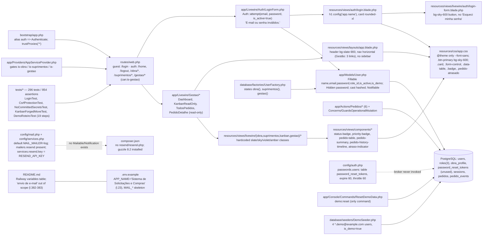
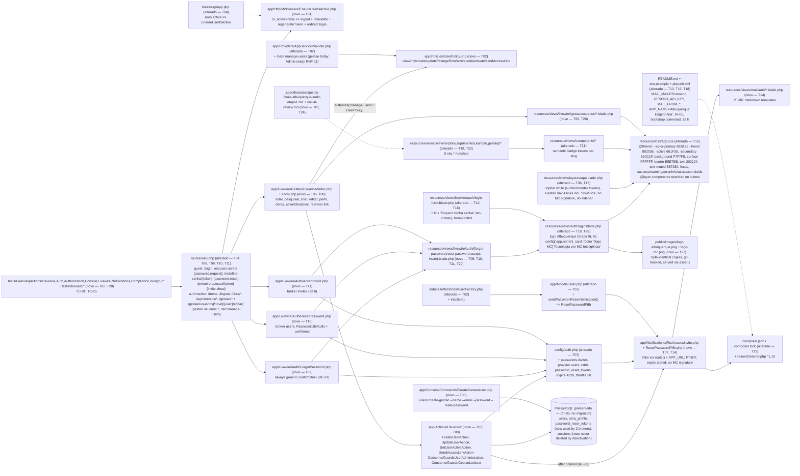

# Implementation Plan

## Request Summary
- Objective: Evolve the in-production Laravel 13 + Livewire 4 monolith to the final Albuquerque Engenharia version — Gestão-administered users, secure first-access invite, "Esqueci minha senha" recovery, transactional e-mail (Resend, credentials only on Railway), centralized Albuquerque design tokens applied globally, redesigned login with discreet MC Inteligência signature, official logos only in the last implementation stage, domain preparation — while preserving the validated architecture, business rules, Policies/Gates, obra isolation and the 296-test / 854-assertion baseline (`82e4d48`).
- Scope: **in** — SPEC `## Scope › In` (RF-01..RF-33, UI-01..UI-25, CT-01..CT-08, RNF-01..RNF-18, TC-01..TC-25, §47 Etapas 1–10). **out** — 4th `Admin` role (§5.1), definitive MC domain execution (§36 / Etapa 11, deferred below), physical user deletion as a normal action (§8), any change to pedido flows/Policies/Gates/audit (§4), Redis/queues/workers/microservices/Next.js/Supabase (§3), redesigning/sourcing logos (§30–§31), creating the Resend account / keys / Railway variables (IH-01), a sidebar (Q-08), MC signature on authenticated pages or e-mails (Q-09b), hardcoding the brand name (Q-09a).
- Tier: complete
- Architecture references: `AGENTS.md`, `docs/agents/architecture.md`, `docs/agents/domain_rules.md`, `docs/agents/data_model.md`, `docs/agents/tech_stack.md`, `docs/agents/coding_guidelines.md` (all read; layering rules embedded in every task below). Init chain (`.spec/init/*.md`) read as vocabulary only — it predates the Laravel reimplementation; the SPEC wins.
- Requirements document cross-check: `docs/specs/AJUSTES-FINAIS-ALBUQUERQUE.md` §1–§54 — see `## Traceability to §54 deliverables` at the end; every §47 Etapa is a phase, every §43 test and §49–§53 criterion is mapped.

### Architecture rules this plan preserves (source: `docs/agents/*.md`, `AGENTS.md`)
1. `routes/web.php` binds URLs directly to Livewire full-page components; `guest` / `auth` / `can:*` middleware live on the routes (`architecture.md` › Layer responsibilities).
2. Livewire components validate, call `$this->authorize()` in `mount()` and again in every action method, and delegate every write to exactly one single-purpose Action class — they never write models directly (`coding_guidelines.md` §1, §3).
3. Actions: `Validator::make` with PT-BR messages, typed signatures, `DB::transaction`; guards live in a shared `Concerns/*` trait so no Action can forget them (`coding_guidelines.md` §2). The `1 PedidoEvent per mutation` rule is pedido-scoped — user administration does not touch `pedidos`/`pedido_events`, so no `PedidoEvent` is written and `PedidoEvent` immutability (`app/Models/PedidoEvent.php` `booted()`, `PedidoEventPolicy` always `false`) stays untouched.
4. Authorization is a Gate/Policy, never an inline role comparison in views; role slug comparisons are centralized in `Gate::define` (`AppServiceProvider::boot()`).
5. Domain classifiers (`app/Domain/Pedidos/*`) stay pure and untouched; `GuardsOperationalMutation` untouched.
6. Models: `#[Fillable]` / `#[Hidden]` attributes, `casts()`; `users.password` keeps the `hashed` cast.
7. Theme lives in `resources/css/app.css` — Tailwind 4 `@theme` + `@layer components`; no runtime JS framework.
8. Tests: Pest closures, factories with named states, `RefreshDatabase`; narrowest run via `php artisan test --compact --filter=…`; Pint (`vendor/bin/pint --dirty`) before finishing any PHP change; new files via `php artisan make:* --no-interaction` and sibling conventions.
9. No new base folders and no dependency changes without approval (`AGENTS.md`) — the single approved dependency is `resend/resend-php` (Q-03). `app/Actions/Usuarios/`, `app/Notifications/`, `app/Console/Commands/`, `app/Http/Middleware/`, `app/Policies/` are sub-folders of existing bases or framework-conventional dirs created by `php artisan make:*` (see Assumptions).

## AS IS — Componentes impactados

Legenda: fatia verificada do repositório em `82e4d48` (working tree limpa em código de aplicação). O login é o único ponto de entrada e recusa inativos silenciosamente; a Gestão só tem telas read-only; o tema não define tokens de cor (`sky-*` em 14 arquivos, `slate-800/900` em 8); o broker de senha e a tabela `password_reset_tokens` existem mas nenhum fluxo os consome; o mailer `resend` está declarado em `config/mail.php` mas o SDK não está instalado; `app/Notifications`, `app/Mail`, `lang/` e `public/images/` não existem.

## TO BE — Componentes propostos

Legenda: `T02`–`T06` produzem a administração de usuários (Gate `manage-users` + `UserPolicy`, Actions `app/Actions/Usuarios/*` com guardas RF-30, middleware `EnsureUserIsActive`, comando `users:create-gestao`, páginas `gestao.usuarios.*`); `T07`–`T12` produzem convite/recuperação (broker `passwords.invites` 72 h, notificações PT-BR, páginas `password.request`/`password.reset`/`invite.show`, link no login, envio pós-commit com feedback honesto); `T13`–`T15` a infraestrutura de e-mail (SDK Resend aprovado, templates, README/.env.example, IH-01); `T16` os tokens; `T17`–`T22` a aplicação global da identidade; `T23`–`T24` responsividade/acessibilidade e revisão visual; `T25`–`T26` regressão e E2E; `T27`–`T28` as logos (última etapa de implementação); `T29` os gates de deploy. Nenhuma migration é necessária (CT-05); `app/Actions/Pedidos/*`, `app/Domain/*`, `PedidoPolicy`, `PedidoEventPolicy`, `LoginForm` e `/home` permanecem byte-idênticos (RF-01).

## Architecture of the new slices (§54: administração de usuários, convite/reset, e-mail)

### User administration (Etapa 2)
- **Routes** (CT-01): inside the existing `Route::middleware('can:is-gestao')->prefix('gestao')->name('gestao.')` group, add `Route::middleware('can:manage-users')->group(...)` with `GET /usuarios` → `Gestao\Usuarios\Index` (`gestao.usuarios.index`), `GET /usuarios/novo` → `Gestao\Usuarios\Form` (`gestao.usuarios.create`), `GET /usuarios/{user}/editar` → `Gestao\Usuarios\Form` (`gestao.usuarios.edit`). URL shape is FLEXIBLE; name prefix and middleware stack are RIGID.
- **Authorization** (RNF-11): `Gate::define('manage-users', fn (User $u): bool => $u->role?->slug === RoleSlug::Gestao->value)` beside the 3 existing gates; `UserPolicy` abilities (`viewAny`, `create`, `update`, `changeRole`, `activate`, `deactivate`, `sendAccessLink`) all resolve through `Gate::allows('manage-users', ...)` so a future `Admin` role only edits the gate. Components call `$this->authorize('viewAny', User::class)` in `mount()` and the specific ability in each action; Actions re-check via `GuardsUserAdministration::ensureActorManagesUsers($actor)` (`AuthorizationException`) so forged Livewire calls fail even if a component forgets.
- **Actions** (`app/Actions/Usuarios/`, mirroring `app/Actions/Pedidos/*`): `CreateUserAction::execute(User $actor, array $data): array{user: User, invite_sent: bool}`, `UpdateUserAction::execute(User $actor, User $target, array $data): User` (name, email, role_id, obra_ids — obra sync and detach-on-role-change inside the same transaction), `SetUserActiveAction::execute(User $actor, User $target, bool $active): User`, `SendAccessLinkAction::execute(User $actor, User $target): string` (broker status). `GuardsGestaoLockout` trait: `ensureNotSelf($actor, $target)` and `ensureAnotherActiveGestaoRemains($target)` → `ValidationException` PT-BR (RF-30).
- **Migrations**: none (CT-05). `users.is_active`, `users.is_demo`, `obra_profile`, `password_reset_tokens` already exist. If an implementer finds a column indispensable, it must be an incremental reversible migration with `down()` — flag it in the PR, never `migrate:fresh`.
- **Session termination** (RF-31): `EnsureUserIsActive` middleware aliased `active`, applied as `Route::middleware(['auth', 'active'])` on the whole authenticated group and registered as Livewire persistent middleware so `/livewire/update` calls of a deactivated user are also cut.
- **Bootstrap** (CT-08): `users:create-gestao` command (see T05) — idempotent upsert by e-mail, password only at runtime, `--reset-password` opt-in.

### Invite and password reset (Etapa 3)
- **Brokers**: `passwords.users` (existing: 60 min / throttle 60 s) for recovery; `passwords.invites` (new: 4320 min / throttle 60 s, same `password_reset_tokens` table, provider `users`) for first access. Both share one row per e-mail — issuing one replaces the other (RNF-01, documented in README).
- **Notifications**: `FirstAccessInvite` (link `route('invite.show', ['token' => $token, 'email' => $email])`, states 72 h) and `ResetPasswordPtBr extends Illuminate\Auth\Notifications\ResetPassword` (link `route('password.reset', [...])`, states 60 min); `User::sendPasswordResetNotification()` overridden to the PT-BR class. Links derive from `APP_URL` via named routes (RNF-12).
- **Pages** (all `guest`, `#[Layout('auth.login')]`): `ForgotPassword` (`password.request`) → `Password::broker('users')->sendResetLink(['email' => $email, 'is_active' => true])`, ignores the status and always renders the same confirmation (RF-21/RNF-04); `ResetPassword` (`password.reset`) → `Password::broker('users')->reset(...)`; `AcceptInvite` (`invite.show`) → `Password::broker('invites')->reset(...)`. Both reset pages validate `['required', 'confirmed', Password::defaults()]` with PT-BR messages, set the password through the model (hashed cast), rotate `remember_token`, fire `PasswordReset`, redirect to `route('login')` with a status flash.
- **Post-commit dispatch** (RF-29): `CreateUserAction` runs the insert + pivot sync in `DB::transaction`, then calls `SendAccessLinkAction` outside the closure in `try/catch (\Throwable $e) { report($e); $inviteSent = false; }`. The form shows "Usuário criado, mas o convite não pôde ser enviado — use Reenviar convite" when `invite_sent === false`.
- **Gestão resend** (RF-14): `SendAccessLinkAction` returns the broker status; `Index::sendAccessLink($userId)` maps `Password::RESET_THROTTLED` to "Um link já foi enviado para este e-mail há menos de 1 minuto. Aguarde para reenviar." and `RESET_LINK_SENT` to the confirmation; any other status becomes a generic error.

### E-mail infrastructure (Etapa 4)
- Transport is selected only by `MAIL_MAILER`: `log` (committed default in `.env.example`), `array` (`phpunit.xml`), `resend` (production, Railway Variables). `config/mail.php` already declares the `resend` mailer and `config/services.php` reads `RESEND_API_KEY`; the only code-level need is the SDK `resend/resend-php` (approved, Q-03). No queue: notifications are synchronous (RNF-08) — do NOT implement `ShouldQueue`.
- Version confirmation (planner action item a): `composer show -a resend/resend-php` lists `v1.15.0` (latest) requiring `php ^8.1`, `guzzlehttp/guzzle ^7.8.2 || ^8.0`, `guzzlehttp/psr7 ^2.6.3 || ^3.0`, `psr/http-client ^1.0`; `laravel/framework` v13.32.0 declares `resend/resend-php: ^1.0` in `require-dev` and suggests `^0.10.0 || ^1.0`; installed `guzzlehttp/guzzle 8.2.0` and `guzzlehttp/psr7 3.1.0` satisfy it. Constraint to require: **`resend/resend-php:^1.15`** (`^1.0` also compatible). Not installed during planning.
- IH-01 stays open: Resend account, verified sender domain, API key and the 4 Railway variables are human steps; until then production keeps `log` and every other flow works.

## Tasks

### T01 — Etapa 1: baseline audit and preflight
- **Files**: `.spec/features/ajustes-finais-albuquerque/audit-etapa1.md` (new artifact; no application code)
- **Change**: Git preflight per §40 (`git status`, current branch `build/v0-demo-laravel`, `git fetch`, confirm `HEAD` descends from `82e4d48`). Run `php artisan test --compact` and record the baseline (expected 296 tests / 854 assertions / 0 failures) and `npm run build` exit code. Inspect and record, with `file:line` evidence, the 11 §47-Etapa-1 items: autenticação (`app/Livewire/Auth/LoginForm.php:47`), usuários/profiles (`app/Models/User.php`, `2026_09_18_230111_*`), roles (`app/Enums/RoleSlug.php`, 3 rows), Policies/Gates (`app/Policies/*`, `AppServiceProvider.php:29-31`), obras, obra-profile (`2026_09_18_230113_*`, `ObraProfileCardinalityTest`), mail config (`config/mail.php:17`, `config/services.php:21-23`, `phpunit.xml:36`), views/layouts (`layouts/app.blade.php:36`, `auth/login.blade.php`), Tailwind (`resources/css/app.css:6`, `sky-*` in 14 files), componentes (6 under `resources/views/components`), testes existentes (list of `tests/**`). Confirm `composer show -a resend/resend-php` reports a `^1.x` version compatible with `laravel/framework` (record it; do NOT install). Confirm the two logo originals exist at the `/mnt/c/...` path with sizes 209281 B / 23177 B and dimensions 1063×345 / 1305×200 (`file`/`identify`/`php -r 'print_r(getimagesize(...))'`); do NOT copy them (§33, §48).
- **Covers**: RF-01 (baseline), RF-26 (version confirmation), UI-19 (asset pre-check), RNF-13, RNF-18, §47 Etapa 1
- **Tests**: none new — the baseline suite run is the deliverable; record counts in the artifact
- **Risk**: Low — read-only
- **Dependencies**: none

### T02 — Gate `manage-users`, `UserPolicy` and factory states
- **Files**: `app/Providers/AppServiceProvider.php`, `app/Policies/UserPolicy.php` (new, `php artisan make:policy UserPolicy --model=User --no-interaction`), `database/factories/UserFactory.php`, `tests/Feature/Authorization/UserPolicyTest.php` (new), `tests/Feature/Authorization/RoleGatesTest.php` (extend only — do not modify existing assertions)
- **Change**: Add `Gate::define('manage-users', fn (User $user): bool => $user->role?->slug === RoleSlug::Gestao->value)` next to the 3 existing gates (same comparison style, `coding_guidelines.md` §2). `UserPolicy` abilities `viewAny(User $actor)`, `create(User $actor)`, `update(User $actor, User $target)`, `changeRole(User $actor, User $target)`, `activate(User $actor, User $target)`, `deactivate(User $actor, User $target)`, `sendAccessLink(User $actor, User $target)` — each returns `Gate::allows('manage-users')` for the actor (RNF-11: only the gate names the role). `changeRole`/`deactivate` additionally return `false` when `$actor->is($target)` (RF-30 self-guard, first line of defense; the Action re-checks). Register nothing else — Laravel auto-discovers `App\Policies\UserPolicy` for `App\Models\User`. Add `UserFactory::inactive()` state (`is_active => false`). Do not touch `PedidoPolicy`/`PedidoEventPolicy`.
- **Covers**: RF-02, RF-05, RF-30 (policy half), RNF-10, RNF-11
- **Tests**: `tests/Feature/Authorization/UserPolicyTest.php` — gestao allowed on every ability; obra/suprimentos denied on every ability; `changeRole`/`deactivate` denied for self; `RoleSlug::cases()` count is 3; `RoleGatesTest.php` — `Gate::allows('manage-users')` true only for gestao
- **Risk**: Low — additive
- **Dependencies**: T01

### T03 — User administration Actions with lockout guards
- **Files**: `app/Actions/Usuarios/CreateUserAction.php`, `app/Actions/Usuarios/UpdateUserAction.php`, `app/Actions/Usuarios/SetUserActiveAction.php`, `app/Actions/Usuarios/Concerns/GuardsUserAdministration.php`, `app/Actions/Usuarios/Concerns/GuardsGestaoLockout.php` (all new via `php artisan make:class --no-interaction`; sibling shape = `app/Actions/Pedidos/*`), `tests/Feature/Actions/Usuarios/CreateUserActionTest.php`, `tests/Feature/Actions/Usuarios/UpdateUserActionTest.php`, `tests/Feature/Actions/Usuarios/SetUserActiveActionTest.php`, `tests/Feature/Actions/Usuarios/GestaoLockoutGuardTest.php` (new)
- **Change**: `GuardsUserAdministration::ensureActorManagesUsers(User $actor)` → `AuthorizationException('Apenas o perfil "gestao" pode administrar usuários.')` when `Gate::forUser($actor)->denies('manage-users')`. `GuardsGestaoLockout::ensureNotSelf(User $actor, User $target)` → `ValidationException` on `target` `'Você não pode desativar nem alterar o perfil da própria conta.'`; `ensureAnotherActiveGestaoRemains(User $target)` → `ValidationException` `'É necessário manter pelo menos um usuário Gestão ativo.'` when `User::query()->whereHas('role', slug = gestao)->where('is_active', true)->whereKeyNot($target->id)->doesntExist()` and the target is currently an active gestao. `CreateUserAction::execute(User $actor, array{name: string, email: string, role_id: int, obra_ids?: list<int>} $data): array{user: User, invite_sent: bool}`: guard actor; `Validator::make` with PT-BR messages — `name` required string max 255; `email` required email `unique:users,email`; `role_id` required `exists:roles,id`; `obra_ids` required array min 1 with `exists:obras,id` when the role slug is `obra`, prohibited otherwise (RF-07, Q-10.1); inside `DB::transaction`: `User::create([... 'password' => Str::password(32), 'is_active' => true, 'is_demo' => false])` (random, hashed by the cast — never a shared default, RF-18) + `obras()->sync($obraIds)`; return `['user' => $user, 'invite_sent' => false]` — the post-commit invite dispatch is wired in T08. `UpdateUserAction::execute(User $actor, User $target, array{name, email, role_id, obra_ids?} $data): User`: guard actor; validate (`email` unique ignoring `$target`); when `role_id` changes call `ensureNotSelf` and, if the target is an active gestao leaving the role, `ensureAnotherActiveGestaoRemains`; in one `DB::transaction` update `name/email/role_id`, `obras()->sync($obraIds)` when the new role is `obra` (≥ 1 required) and `obras()->detach()` when the new role is not `obra` (Q-10.2); on e-mail change only update the column — no notification, no token deletion (Q-10.3). `SetUserActiveAction::execute(User $actor, User $target, bool $active): User`: guard actor; on deactivation `ensureNotSelf` + `ensureAnotherActiveGestaoRemains`; `update(['is_active' => $active])` only — never delete `users`, `pedidos`, `pedido_events`, `obra_profile` or `sessions` rows (RF-10, Q-06). No `PedidoEvent` is written (pedido-scoped rule). Explicit return types, PHPDoc array shapes, Pint.
- **Covers**: RF-06 (creation half), RF-07, RF-08, RF-09, RF-10, RF-11, RF-18, RF-30, RNF-02, RNF-10, CT-05 (no migration)
- **Tests**: `CreateUserActionTest` — TC-04: row with `is_active=true`, `is_demo=false`, role, pivot rows = selected obras; documented default `password` does not authenticate; obra with 0 obras → error on `obras`/`obra_ids` and counts unchanged (TC-23); duplicate/invalid e-mail, empty name, unknown role → field errors; obra/suprimentos actor → `AuthorizationException`, nothing persisted. `UpdateUserActionTest` — TC-06: values + `updated_at` change, pedidos/events untouched; `{A,B}` → `{B,C}` pivot exactly `{B,C}`, `{}` refused and pivot stays (TC-05/TC-23); `PedidoPolicy::view` allows C / denies A after sync; obra → suprimentos detaches all (TC-24); e-mail change → `Notification::assertNothingSent()` and a pre-existing `password_reset_tokens` row for the old address still exists (TC-24). `SetUserActiveActionTest` — TC-07/TC-09: `is_active=false`, counts of `pedidos` (requester/responsible) and `pedido_events` (actor) unchanged, timeline still renders the name; TC-11 reactivation → login succeeds. `GestaoLockoutGuardTest` — TC-21: A on A (deactivate, change role) → PT-BR error, row unchanged; TC-22: A deactivates B → ok; A now last active gestao → deactivate A / change A's role → error; reactivate B → change to A allowed by another actor, still refused for self.
- **Risk**: Medium — authorization + data integrity; mitigated by forged-call tests and transaction
- **Dependencies**: T02

### T04 — `EnsureUserIsActive` middleware on the authenticated group
- **Files**: `app/Http/Middleware/EnsureUserIsActive.php` (new, `php artisan make:middleware EnsureUserIsActive --no-interaction`), `bootstrap/app.php`, `routes/web.php`, `app/Providers/AppServiceProvider.php` (Livewire persistent middleware registration), `tests/Feature/Auth/EnsureUserIsActiveTest.php` (new)
- **Change**: `handle(Request $request, Closure $next)`: if `$request->user()` exists and `is_active === false` → `Auth::guard('web')->logout()`, `$request->session()->invalidate()`, `$request->session()->regenerateToken()`, `redirect()->route('login')->with('status', 'Sua conta foi desativada. Fale com a Gestão.')`; otherwise `$next($request)`. Alias `'active' => EnsureUserIsActive::class` inside the existing `$middleware->alias([...])` block (`bootstrap/app.php:23`). Change the authenticated group to `Route::middleware(['auth', 'active'])` so `/home`, `/logout`, `/obra/*`, `/suprimentos/*`, `/gestao/*` are all covered without touching `LoginForm` (RF-01). Register the middleware as Livewire persistent middleware in `AppServiceProvider::boot()` (`Livewire::addPersistentMiddleware([EnsureUserIsActive::class])` — verify the exact Livewire 4 API with `search-docs` before use) so `/livewire/update` requests from an already-loaded page of a deactivated user are also terminated. `sessions` rows are not deleted by anything.
- **Covers**: RF-31, RF-10 (session termination path), RNF-10, Q-06
- **Tests**: `EnsureUserIsActiveTest` — TC-20: user logs in, is deactivated (`SetUserActiveAction` or direct update), next `GET route('obra.pedidos.index')` redirects to `route('login')` with the session status and `Auth::check()` false; a Livewire `call()` after deactivation is refused/redirected; active user unaffected on the same routes; `tests/Feature/Auth/LoginTest.php` and `UnauthenticatedAccessTest.php` unchanged and green
- **Risk**: High — sits on every authenticated request; a null/boolean-cast bug locks everyone out. Mitigation: strict `=== false` on the boolean cast, feature test for the active path, `LoginTest` green
- **Dependencies**: T02

### T05 — Bootstrap command `users:create-gestao`
- **Files**: `app/Console/Commands/CreateGestaoUser.php` (new, `php artisan make:command CreateGestaoUser --no-interaction`; sibling: `ResetDemoData.php`), `tests/Feature/Console/CreateGestaoUserCommandTest.php` (new)
- **Change**: Signature `users:create-gestao {--name=} {--email=} {--password=} {--reset-password : Sobrescreve a senha de um usuário já existente}` — no default values in code. Decision (planner action item b): the password is read from `--password=` or, when absent, from the runtime environment variable `GESTAO_BOOTSTRAP_PASSWORD` via `env('GESTAO_BOOTSTRAP_PASSWORD')` inside `handle()` only (never in `config/`, never in `.env.example` with a value, only documented as a name in README); the explicit opt-in flag is `--reset-password`. `handle()`: validate `email` (required, `email`) and presence of a password → on failure print a PT-BR usage message and return `self::INVALID`, creating nothing; `name` required only when the user does not exist yet. Resolve `role_id` of `RoleSlug::Gestao` (fail with a message if the `roles` lookup is not seeded). `DB::transaction`: `User::query()->firstOrNew(['email' => $email])`; on new → fill `name`, `role_id`, `is_active=true`, `is_demo=false`, `password` (hashed by cast); on existing → set `role_id` gestao, `is_active=true`, `is_demo=false`, update `name` if given, and set `password` ONLY when `--reset-password` is passed; `save()`. Output: "Usuário Gestão garantido: {email} (criado|atualizado)" — never the password, never the hash. Document usage in README (T15).
- **Covers**: RF-32, RF-33 (runbook prerequisite), CT-08, RNF-02, RNF-07, Q-01, IH-04
- **Tests**: `CreateGestaoUserCommandTest` — TC-18: run twice with the same e-mail → exactly 1 `users` row, role gestao, `is_active`, `is_demo=false`; second run without flag leaves `password` hash unchanged; with `--reset-password` `Hash::check(new)` true; `->doesntExpectOutputToContain($password)`; missing password (option absent and env unset via `putenv`/`$this->app` env reset) → exit code `self::INVALID` and 0 rows; missing/invalid e-mail → same; `grep -rn "password" app/Console/Commands/CreateGestaoUser.php` shows no literal default value (assert via file read in the test or as a review gate)
- **Risk**: Medium — production credential path; mitigated by no defaults, no echo, `NoCommittedSecretsTest`
- **Dependencies**: T02

### T06 — Users area: routes, Livewire pages, nav entry
- **Files**: `routes/web.php`, `app/Livewire/Gestao/Usuarios/Index.php`, `app/Livewire/Gestao/Usuarios/Form.php` (new, `php artisan make:livewire Gestao/Usuarios/Index --no-interaction` etc.), `resources/views/livewire/gestao/usuarios/index.blade.php`, `resources/views/livewire/gestao/usuarios/form.blade.php` (new), `resources/views/layouts/app.blade.php` (nav entry only), `tests/Feature/Livewire/UsuariosIndexTest.php`, `tests/Feature/Livewire/UsuariosFormTest.php` (new)
- **Change**: Routes as described in "Architecture of the new slices" (nested `can:manage-users` group inside the `can:is-gestao` group; names `gestao.usuarios.index|create|edit`). `Index` (`#[Layout('layouts.app')]`, `WithPagination`, `public string $search = ''`, `updating()` resets page — same conventions as `Gestao\TodosPedidos`): `mount()` → `$this->authorize('viewAny', User::class)`; `users()` → `User::query()->with(['role', 'obras'])` filtered by `whereRaw('lower(name) like ?')` / `orWhereRaw('lower(email) like ?')` on the lowercased term (RF-04, case-insensitive on PostgreSQL), ordered by name, paginated; columns nome, e-mail, perfil (`role->name`), status badge (`Ativo`/`Inativo`), obras (comma-separated names, only for obra users); row actions `Editar` (link), `Ativar`/`Desativar` (`setActive(int $userId, bool $active, SetUserActiveAction $action)` → `authorize('activate'|'deactivate', $user)` then action; `ValidationException` surfaces inline as PT-BR error; success flash). `Form` handles create and edit (`mount(?User $user = null)` → `authorize('create', User::class)` or `authorize('update', $user)`; properties `name`, `email`, `roleId`, `obraIds` (array); obra multi-select rendered only when the selected role is `obra` (RF-09); `save(CreateUserAction|UpdateUserAction)` → `authorize` again, delegate, redirect to `gestao.usuarios.index` with flash; never renders or logs any password). Add `['label' => 'Usuários', 'route' => 'gestao.usuarios.index', 'active' => 'gestao.usuarios.*']` as the 4th item of the `gestao` branch of `$navItems` (UI-08) — no other layout change here (T17 restyles). Use existing `.card`, `.data-table`, `.btn-primary`, `.btn-secondary`, `.badge`, `.form-control` classes only (UI-23; tokens arrive in T16).
- **Covers**: RF-03, RF-04, RF-05, RF-06 (UI half), RF-07, RF-08, RF-09, RF-10, RF-11, RF-25, CT-01, UI-08 (nav count), UI-23, RNF-03, RNF-10
- **Tests**: `UsuariosIndexTest` — TC-01: gestao `GET route('gestao.usuarios.index')` 200 with `Usuários` nav link, 5 columns, 2 obras listed for a 2-obra user, none for suprimentos; RF-04 search cases (`ana`, `BRUNO@`, empty); TC-02/TC-03: obra and suprimentos get 403 on the route and on forged `Livewire::test(Index::class)->call('setActive', ...)` (same technique as `KanbanForgedMoveTest`), `users` unchanged; guest → redirect `route('login')` (TC-15); rendered HTML never contains a password hash. `UsuariosFormTest` — create/edit happy paths through the component, validation messages per field, obra selector hidden for non-obra roles, forged `save` by obra/suprimentos → 403 and no row
- **Risk**: Medium — new admin surface; mitigated by route + component + action triple authorization
- **Dependencies**: T03, T04

### T07 — `passwords.invites` broker and PT-BR notifications
- **Files**: `config/auth.php`, `app/Notifications/FirstAccessInvite.php`, `app/Notifications/ResetPasswordPtBr.php` (new via `php artisan make:notification ... --no-interaction`), `app/Models/User.php` (add `sendPasswordResetNotification(#[\SensitiveParameter] string $token): void` only), `tests/Feature/Notifications/AuthNotificationsTest.php` (new)
- **Change**: Add `'invites' => ['provider' => 'users', 'table' => env('AUTH_PASSWORD_RESET_TOKEN_TABLE', 'password_reset_tokens'), 'expire' => 4320, 'throttle' => 60]` under `passwords` (CT-03; same table, no migration). `FirstAccessInvite` (`Notification`, channel `mail`, NOT `ShouldQueue` — RNF-08): `toMail()` returns a `MailMessage` with PT-BR subject (`'Seu acesso ao '.config('app.name')`), greeting by name, explanation of first access, action button "Definir minha senha" → `route('invite.show', ['token' => $this->token, 'email' => $notifiable->getEmailForPasswordReset()])`, and the sentence "Este link é válido por 72 horas." derived from `config('auth.passwords.invites.expire')`; no password in the body; no MC signature (CT-07, UI-16). `ResetPasswordPtBr extends Illuminate\Auth\Notifications\ResetPassword`: override `toMail()` with PT-BR subject "Redefinição de senha", button "Redefinir senha" → `route('password.reset', ['token' => $this->token, 'email' => ...])`, expiry sentence from `config('auth.passwords.users.expire')` (60 minutos), and the "if you did not request…" line in PT-BR. Templates are refined into markdown views in T14 — here inline `MailMessage` lines are acceptable. `User::sendPasswordResetNotification()` → `$this->notify(new ResetPasswordPtBr($token))`.
- **Covers**: RF-15 (notification), RF-27, CT-03, CT-07, RNF-01, RNF-08, RNF-12, Q-02
- **Tests**: `AuthNotificationsTest` — `config('auth.passwords.invites')` has expire 4320 / throttle 60 / table `password_reset_tokens`; `FirstAccessInvite::toMail()` renders PT-BR text, the action URL host equals `parse_url(config('app.url'))['host']` and changes when `config(['app.url' => ...])` changes; URL contains the token and e-mail and no password; the body does not contain "MC Inteligência"; same for `ResetPasswordPtBr` with "60 minutos"
- **Risk**: Low — additive config + classes
- **Dependencies**: T03

### T08 — `SendAccessLinkAction`, post-commit invite on create, Gestão resend action
- **Files**: `app/Actions/Usuarios/SendAccessLinkAction.php` (new), `app/Actions/Usuarios/CreateUserAction.php`, `app/Livewire/Gestao/Usuarios/Index.php`, `app/Livewire/Gestao/Usuarios/Form.php`, `resources/views/livewire/gestao/usuarios/index.blade.php`, `tests/Feature/Actions/Usuarios/SendAccessLinkActionTest.php` (new), `tests/Feature/Livewire/UsuariosFormTest.php`, `tests/Feature/Livewire/UsuariosIndexTest.php` (extend)
- **Change**: `SendAccessLinkAction::execute(User $actor, User $target): string` — `ensureActorManagesUsers`; `Password::broker('invites')->sendResetLink(['email' => $target->email], fn (User $user, string $token) => $user->notify(new FirstAccessInvite($token)))`; returns the broker status string; never reads or displays `users.password` (RF-14/RF-25). `CreateUserAction`: after `DB::transaction` returns, call `SendAccessLinkAction` in `try { ... $inviteSent = $status === Password::RESET_LINK_SENT; } catch (\Throwable $e) { report($e); $inviteSent = false; }` — never inside the transaction, so a rolled-back user never receives an invite and a transport failure never rolls back the user (RF-29, RNF-08). `Form::save()` flashes "Usuário criado. Convite enviado para {email}." or "Usuário criado, mas o convite não pôde ser enviado — use Reenviar convite." based on `invite_sent`. `Index::sendAccessLink(int $userId, SendAccessLinkAction $action)` → `authorize('sendAccessLink', $user)` → map `RESET_THROTTLED` → "Um link já foi enviado para este e-mail há menos de 1 minuto. Aguarde para reenviar." (explicit, RF-14/Q-05), `RESET_LINK_SENT` → "Link de acesso enviado para {email}.", else → "Não foi possível enviar o link. Tente novamente." Add the per-row secondary button "Reenviar convite / Enviar link de redefinição".
- **Covers**: RF-06 (invite half), RF-14, RF-15, RF-29, RNF-05 (authenticated surface), RNF-08, CT-07, Q-04, Q-05
- **Tests**: `SendAccessLinkActionTest` — `Notification::fake()`: sends `FirstAccessInvite` to the target only; `password_reset_tokens` row exists for the e-mail; second call within 60 s returns `RESET_THROTTLED` and `Notification::assertSentTimes(FirstAccessInvite::class, 1)` (TC-25 Gestão side); obra actor → `AuthorizationException`. `UsuariosFormTest` — TC-16: after create `Notification::assertSentTo($user, FirstAccessInvite::class)`; TC-19: bind a `SendAccessLinkAction` mock that throws → user row exists, response shows the failure feedback, no exception escapes, `report()` logged (`Log::shouldReceive`/`$this->app['log']` spy); validation failure → `Notification::assertNothingSent()`. `UsuariosIndexTest` — resend twice → 1 notification + explicit "já foi enviado" message on the second call; forged call by obra → 403
- **Risk**: Medium — e-mail side effects; mitigated by post-commit placement and fakes
- **Dependencies**: T06, T07

### T09 — "Esqueci minha senha" page (`password.request`)
- **Files**: `routes/web.php`, `app/Livewire/Auth/ForgotPassword.php`, `resources/views/livewire/auth/forgot-password.blade.php` (new), `tests/Feature/Auth/PasswordRecoveryRequestTest.php` (new)
- **Change**: Inside the `guest` group add `Route::get('/esqueci-senha', ForgotPassword::class)->name('password.request')` (path FLEXIBLE, name RIGID — CT-02). Component `#[Layout('auth.login')]` mirroring `LoginForm` (rules/messages PT-BR, `role="alert"` errors): `public string $email = ''; public bool $sent = false;` `sendResetLink()` validates `email` required/email, calls `Password::broker('users')->sendResetLink(['email' => $this->email, 'is_active' => true])` (the extra credential excludes inactive users at the provider level — RF-21), ignores the returned status entirely and sets `$sent = true`; the view then shows one fixed text "Se o e-mail informado estiver cadastrado e ativo, você receberá um link para redefinir a senha em instantes." (identical for sent / unknown / inactive / throttled — RNF-04, Q-05) plus a "Voltar ao login" link. Optional FLEXIBLE hardening: `->middleware('throttle:6,1')` on this route. Submit is a Livewire action (see Open Question 1 about the `password.email` name).
- **Covers**: RF-19 (target page), RF-20, RF-21, RF-24, RNF-03, RNF-04, RNF-05 (public surface), CT-02, UI-24 (layout reuse)
- **Tests**: `PasswordRecoveryRequestTest` — TC-10: active user → `password_reset_tokens` row exists, `Notification::assertSentTo($user, ResetPasswordPtBr::class)`, page shows the generic text; TC-15/RF-21: unknown e-mail, inactive user (`User::factory()->inactive()`), and throttled repeat produce byte-identical rendered component HTML and status, `Notification::assertNothingSent()` for unknown/inactive, exactly 1 notification across two rapid submits for an active user (TC-25 public side); RF-24: dataset `['obra', 'suprimentos', 'gestao']`; guest route renders 200, authenticated user is redirected by `guest`
- **Risk**: Medium — anti-enumeration; mitigated by status-agnostic rendering test
- **Dependencies**: T07

### T10 — Reset password page (`password.reset`)
- **Files**: `routes/web.php`, `app/Livewire/Auth/ResetPassword.php`, `resources/views/livewire/auth/reset-password.blade.php` (new), `tests/Feature/Auth/PasswordResetTest.php` (new)
- **Change**: `Route::get('/redefinir-senha/{token}', ResetPassword::class)->name('password.reset')` in the `guest` group (name RIGID — the notification resolves it). Component `#[Layout('auth.login')]`: `mount(string $token)` reads `$token` and `request()->query('email')`; properties `email`, `password`, `password_confirmation`; `resetPassword()` validates `email` required/email, `password` `['required', 'confirmed', Password::defaults()]` with PT-BR messages; calls `Password::broker('users')->reset([...], function (User $user, string $password): void { $user->forceFill(['password' => $password, 'remember_token' => Str::random(60)])->save(); event(new PasswordReset($user)); })`; on `Password::PASSWORD_RESET` → `redirect()->route('login')->with('status', 'Senha redefinida. Entre com a nova senha.')`; any other status (`INVALID_TOKEN`, `INVALID_USER`) → `ValidationException` on `email` with the single generic message "Este link é inválido ou expirou. Solicite um novo." (RF-17/RF-23 — never reveals whether the e-mail exists). Password hashed by the model cast; token deleted by the broker.
- **Covers**: RF-22, RF-23, RF-24, RNF-01, RNF-02, RNF-03, RNF-06, CT-02, UI-24
- **Tests**: `PasswordResetTest` — TC-13/TC-14: valid token → `Hash::check(new)` true, login with new password succeeds and old fails with `'E-mail ou senha inválidos.'`, token row gone, reuse fails; TC-11: tampered token → generic error, hash unchanged; TC-12: `$this->travel(61)->minutes()` → expired, hash unchanged; weak password (< 8) and mismatched confirmation → field errors; RF-24 dataset for the 3 roles
- **Risk**: Medium — credential path; framework broker does the heavy lifting
- **Dependencies**: T07

### T11 — First-access invite page (`invite.show`)
- **Files**: `routes/web.php`, `app/Livewire/Auth/AcceptInvite.php`, `resources/views/livewire/auth/accept-invite.blade.php` (new), `tests/Feature/Auth/FirstAccessInviteTest.php` (new)
- **Change**: `Route::get('/primeiro-acesso/{token}', AcceptInvite::class)->name('invite.show')` in the `guest` group (CT-03 FLEXIBLE pair chosen: distinct `invite.*` route with first-access copy). Same component shape as `ResetPassword` but `Password::broker('invites')` and copy "Defina sua senha" / "Bem-vindo(a) ao {{ config('app.name') }}" / button "Definir senha"; success → `route('login')` with "Senha definida. Entre com seu e-mail e a nova senha."; failure → same generic "Este link é inválido ou expirou. Peça um novo convite à Gestão." Share the password rules/messages with `ResetPassword` via a small trait or duplicated constants (FLEXIBLE) — keep both components thin.
- **Covers**: RF-16, RF-17, RF-18, RNF-01, RNF-06, CT-03, UI-24, Q-02
- **Tests**: `FirstAccessInviteTest` — TC-16: create via `CreateUserAction` (T08) with `Notification::fake()`, extract the token by asserting on `FirstAccessInvite` `toMail()` URL, open `invite.show`, submit → `Hash::check` true, token invalidated, `LoginForm` authenticates; TC-11: tampered token → error; TC-12: `$this->travel(73)->hours()` → expired, `$this->travel(71)->hours()` → still valid (72 h boundary); consumed token reuse → error; no password appears in any response; a reset token issued by `passwords.users` cannot be consumed on the invite page after its own 60-min expiry (shared-table behavior documented)
- **Risk**: Medium — mitigated like T10
- **Dependencies**: T07, T08

### T12 — Login link "Esqueci minha senha", CSRF coverage of new forms
- **Files**: `resources/views/livewire/auth/login-form.blade.php`, `tests/Feature/Security/CsrfProtectionTest.php` (extend — keep existing tests intact), `tests/Feature/Livewire/LoginFormTest.php` (extend with a new test only)
- **Change**: Add `<a href="{{ route('password.request') }}" class="text-sm ...">Esqueci minha senha</a>` under the password field (RF-19) — no behavior change to `LoginForm.php` (RF-01). Extend `CsrfProtectionTest` with `app['env'] = 'production'` cases: guest `POST route('default-livewire.update')` (the transport used by `ForgotPassword`, `ResetPassword`, `AcceptInvite`) without token → 419, with token → not 419; `GET route('password.request')` and `route('invite.show', ['token' => 'x'])` render a `csrf-token` meta (auth layout).
- **Covers**: RF-19, RNF-03, UI-15 (link presence), AC-50.3
- **Tests**: `LoginFormTest` new test: `GET /login` sees `Esqueci minha senha` linking to `route('password.request')`; `CsrfProtectionTest` new cases as above
- **Risk**: Low
- **Dependencies**: T09

### T13 — Resend SDK dependency (approved) and transport wiring check
- **Files**: `composer.json`, `composer.lock`, `tests/Feature/Compliance/MailTransportTest.php` (new)
- **Change**: `composer require resend/resend-php:^1.15 --no-interaction` (the single approved dependency — Q-03/RNF-09; confirmed compatible: framework v13.32.0 `require-dev` `^1.0`, SDK needs guzzle `^8.0` which is installed). Commit the updated `composer.lock` (Railway runs `composer install --no-dev`). Verify `config/mail.php` `mailers.resend` (`transport => resend`) and `config/services.php` `resend.key => env('RESEND_API_KEY')` are untouched and sufficient; do not add `MAIL_MAILER` defaults other than `log`; do not add Postmark/SES/Mailgun packages. Do not implement `failover` unless the owner asks (FLEXIBLE, off by default).
- **Covers**: RF-26, RF-28, CT-04, RNF-07, RNF-09, AC-Q03
- **Tests**: `MailTransportTest` — `composer.json` `require` contains `resend/resend-php`; `config('mail.default')` is `array` under tests; `config('mail.mailers.resend.transport') === 'resend'`; `config('services.resend.key')` is null in tests (no secret); `NoCommittedSecretsTest`, `NoNextJsDependencyTest`, `NoSupabaseDependencyTest` green
- **Risk**: Medium — lock-file change affects the Railway build; mitigated by committing the lock and running `composer install` locally
- **Dependencies**: T07

### T14 — PT-BR mail templates and sender identity
- **Files**: `resources/views/mail/auth/first-access-invite.blade.php`, `resources/views/mail/auth/reset-password.blade.php` (new markdown templates), `app/Notifications/FirstAccessInvite.php`, `app/Notifications/ResetPasswordPtBr.php` (switch to `->markdown('mail.auth.…', [...])`), `lang/pt_BR.json` (new — translations for the framework mail-theme strings such as `All rights reserved.`, `Regards`, and the "trouble clicking" subcopy; FLEXIBLE: alternatively publish `vendor:publish --tag=laravel-mail` and translate `resources/views/vendor/mail/html/*`), `tests/Feature/Notifications/AuthNotificationsTest.php` (extend)
- **Change**: Author both messages fully in PT-BR (subject, greeting with the user's name, purpose, button label, expiry sentence "72 horas" / "60 minutos", fallback URL line, "Se você não solicitou…" line); sender is whatever `config('mail.from')` resolves (`MAIL_FROM_ADDRESS`/`MAIL_FROM_NAME` ← `APP_NAME`) — never hardcode a name or address; no MC Inteligência text or logo (Q-09b); no password anywhere. Confirm `MAIL_MAILER=log` writes the full body incl. the link to `storage/logs/laravel.log` locally (manual check noted in README).
- **Covers**: RF-27, CT-07, UI-16 (e-mail exclusion), RNF-12, AC-50.8
- **Tests**: `AuthNotificationsTest` extended — rendered `MailMessage` (`->render()`) contains the PT-BR strings, `config('mail.from.name')` as sender, link host = `APP_URL` host, no "password"/"senha:" value, no "MC Inteligência"; `Mail::fake()`-free `MAIL_MAILER=array` send via `Notification::send` and assert on `app('mailer')->getSymfonyTransport()->messages()` (array transport) that the message is addressed to the user only
- **Risk**: Low
- **Dependencies**: T13

### T15 — README, `.env.example`, IH-01 and operations documentation
- **Files**: `README.md`, `.env.example`
- **Change**: `.env.example`: line 23 → `APP_NAME="Albuquerque Engenharia"` (UI-15, not a secret); mail block keeps `MAIL_MAILER=log` and adds commented production keys `# MAIL_MAILER=resend`, `# RESEND_API_KEY=` (empty), `MAIL_FROM_ADDRESS`, `MAIL_FROM_NAME="${APP_NAME}"`; document `GESTAO_BOOTSTRAP_PASSWORD` as a name only (no value, commented). `README.md`: (1) production variables table gains `APP_NAME="Albuquerque Engenharia"`, `MAIL_MAILER=resend`, `RESEND_API_KEY=<placeholder>`, `MAIL_FROM_ADDRESS=<placeholder>`, `MAIL_FROM_NAME`, keeps `BCRYPT_ROUNDS=12`; SMTP set listed as fallback; (2) "E-mail transacional" section: transports per environment (`log` local, `array` tests, `resend` production), IH-01 human steps (create Resend account, verify sender domain, generate API key, fill the 4 variables on Railway → serviço Laravel → Variables), behavior while unset (invites/resets are logged only — Gestão still sees "enviado"); (3) "Bootstrap do primeiro Gestão" section documenting `php artisan users:create-gestao --name="…" --email=… --password=… [--reset-password]` (or `GESTAO_BOOTSTRAP_PASSWORD` in the shell only), that the password is never stored, and that the owner changes it via "Esqueci minha senha"; (4) invite link validity 72 h and reset 60 min, shared token table note (RNF-01); (5) remove/replace the lines 382-383 statement that e-mail sending is out of scope; (6) Etapa 10 runbook summary (see `## Operator runbook`) and Etapa 11 domain checklist as a deferred section (RNF-12). Never a real key or password.
- **Covers**: RF-28, RF-32 (docs), RF-33 (runbook), CT-03 (72 h documented), CT-04, UI-15 (`.env.example`), RNF-07, RNF-12, IH-01, IH-04
- **Tests**: `NoCommittedSecretsTest` green; `tests/Feature/Compliance/EnvExampleTest.php` (new, small): `.env.example` contains `APP_NAME="Albuquerque Engenharia"` and `MAIL_MAILER=log`, and no non-empty `RESEND_API_KEY=` value
- **Risk**: Low
- **Dependencies**: T13

### T16 — Design tokens and token-based component layer
- **Files**: `resources/css/app.css`, `tests/Feature/Design/ThemeTokensTest.php` (new)
- **Change**: Extend `@theme` (keep `--font-sans`) with `--color-primary: #9E0128; --color-primary-hover: #802036; --color-primary-active: #661F35; --color-secondary: #520C1F; --color-background: #F7F7F8; --color-surface: #FFFFFF; --color-border: #E5E7EB; --color-text: #202124; --color-text-muted: #6B7280; --color-focus: #9E0128;` plus semantic `--color-success` (emerald-600 family), `--color-warning` (amber-600), `--color-error` (red-600), `--color-info` (blue-700, not sky), `--color-atraso` (red-600), `--color-concluido` (emerald-700) and light tints (`-soft`) for badge backgrounds (UI-01/UI-02; Tailwind 4 auto-generates `bg-primary`, `text-text-muted`, `border-border`, `ring-focus`…). Rewrite `@layer components` on tokens: `.card` (`bg-surface border-border rounded-lg shadow-sm`, radius ≤ 8px), `.page-title`/`.section-title`/`.form-label` (`text-text`), `.form-control` (`bg-surface border-border text-text focus:border-primary focus:ring-2 focus:ring-focus/30 disabled:bg-background disabled:text-text-muted`, `rounded-md`), `.form-error` (`text-error`), `.btn-primary` (`bg-primary text-white hover:bg-primary-hover active:bg-primary-active focus:ring-2 focus:ring-focus/40 rounded-md`, no `rounded-full`), `.btn-secondary` (`bg-surface border-border text-secondary hover:bg-background`), `.btn-danger` (`bg-error`), `.badge` + `.badge-neutral/-info/-success/-warning/-error/-secondary/-atraso/-concluido` (tinted bg + dark text, distinct per state — UI-11), `.data-table thead th` (`bg-background text-text-muted border-border`), `.data-table tbody td` (`border-border text-text`), `.pedido-atrasado` (class name preserved — `PedidoCardRenderTest` — `border-l-atraso bg-error/5`), new `.nav-link` / `.nav-link-active` (`text-primary` + 2px bottom border primary), `.alert-success`/`.alert-error`/`.alert-info`, `.empty-state` (`text-text-muted`). No gradients, no `shadow-xl`, no `animate-*` (UI-13). Optional FLEXIBLE: publish `vendor/pagination/tailwind.blade.php` to tokenize pagination. Run `npm run build` → exit 0.
- **Covers**: UI-01, UI-02, UI-04, UI-05, UI-06, UI-09, UI-10, UI-11 (class layer), UI-13, RNF-17, §47 Etapa 5 (tokens, cores, tipografia, buttons, inputs, cards, tables, badges, layouts)
- **Tests**: `ThemeTokensTest` — reads `resources/css/app.css`: `@theme` declares each of the 10 named tokens + 6 semantic ones; each of the 9 §16 hex values is present bound to the expected token; `primary-hover`/`primary-active` are wine values; the file contains no `sky-` and no `bg-gradient`; `.btn-primary` rule references `primary`; `.pedido-atrasado` rule still exists. Existing suite green (class names consumed by tests are preserved)
- **Risk**: Medium — global visual change; mitigated by preserving class names used by tests
- **Dependencies**: T15 (phase order only)

### T17 — Topbar and app layout on tokens
- **Files**: `resources/views/layouts/app.blade.php`, `tests/Feature/Livewire/LayoutIdentityTest.php` (new)
- **Change**: `<html class="h-full bg-background">`, body `text-text`; `<header class="bg-surface border-b border-border">` (no `bg-slate-900`, no shadow heavier than `shadow-sm`); brand link `{{ config('app.name') }}` in `text-text font-semibold` (no hardcoded name — Q-09a); nav links use `.nav-link` / `.nav-link-active` (`aria-current="page"` kept); user name `text-text-muted`; role badge `.badge .badge-neutral` (outline, not sky); "Sair" → `.btn-secondary` compact. Keep the `$navItems` match (with the 4th Gestão item from T06), no `<aside>`, no MC signature (UI-16/UI-25). Keep `@livewireStyles`/`@livewireScripts` and `@vite`.
- **Covers**: UI-03, UI-04, UI-07 (N/A confirmed — no sidebar), UI-08, UI-14 (topbar, menus), UI-15 (`config('app.name')` brand), UI-16, UI-25, AC-51.6
- **Tests**: `LayoutIdentityTest` — as gestao the rendered page has exactly 4 nav links (`Dashboard`, `Kanban`, `Todos os Pedidos`, `Usuários`); obra/suprimentos have no `Usuários`; header HTML contains no `bg-slate-900`/`bg-slate-800`/`sky-`; no `<aside`; no "MC Inteligência" on `/gestao/dashboard`, `/obra/pedidos`, `/suprimentos/kanban`; brand text equals `config('app.name')`
- **Risk**: Low
- **Dependencies**: T16

### T18 — Auth layout and login redesign (text-only signature; logos in Etapa 9)
- **Files**: `resources/views/auth/login.blade.php`, `resources/views/livewire/auth/login-form.blade.php`, `phpunit.xml` (`<env name="APP_NAME" value="Albuquerque Engenharia"/>`), `tests/Feature/Auth/LoginScreenIdentityTest.php` (new)
- **Change**: Auth layout: `bg-background`, centered column, reserved logo slot above the `h1` (empty until T28 — do not reference any image file yet, UI-20), `h1` `{{ config('app.name') }}` in `text-text`, card `.card` (`rounded-lg`, `shadow-sm`), footer `
Tecnologia por MC Inteligência
` — the MC `` is added in T28; this footer lives only in the auth layout so `forgot/reset/invite` inherit it and `layouts/app.blade.php` never gets it (UI-16, UI-24). Login form: keep `h2` "Entrar no sistema", inputs → `.form-control` with `.form-label`, errors `.form-error role="alert"`, the T12 link styled `text-primary hover:text-primary-hover`, submit `.btn-primary` full width — no `sky-*` (UI-15 "the blue button ceases to exist"). `<title>` keeps `config('app.name')`.
- **Covers**: UI-09, UI-10, UI-14 (autenticação, recuperação, definição inicial), UI-15, UI-16 (text placement), UI-24, UI-25, AC-52.1, AC-51.10
- **Tests**: `LoginScreenIdentityTest` — `GET /login` contains `Albuquerque Engenharia`, `Entrar no sistema`, `Esqueci minha senha`, `Entrar`, `Tecnologia por MC Inteligência`; the submit button has `btn-primary` and no `sky-`; `grep -rn "Albuquerque Engenharia" resources/views app` → 0 (assert via `Finder` in the test); `password.request`, `password.reset`, `invite.show` pages contain the same `h1` and signature; `LoginFormTest`/`LoginTest` unchanged and green
- **Risk**: Low
- **Dependencies**: T16

### T19 — Identity on Obra, Suprimentos and Kanban views
- **Files**: `resources/views/livewire/obra/acompanhamento.blade.php`, `resources/views/livewire/obra/nova-solicitacao.blade.php`, `resources/views/livewire/obra/pedido-detalhe.blade.php`, `resources/views/livewire/suprimentos/todos-pedidos.blade.php`, `resources/views/livewire/suprimentos/pedido-detalhe.blade.php`, `resources/views/livewire/kanban/kanban-board.blade.php`, `resources/views/livewire/kanban/pedido-card.blade.php`
- **Change**: Replace hardcoded palette classes (`sky-*`, `slate-800/900` surfaces, `violet-*`) with tokens/utilities: page background neutral, cards `.card`, filters/forms `.form-control`/`.form-label`, buttons `.btn-*`, tables `.data-table`, Kanban columns `bg-background` with `border-border` headers and card `bg-surface`, active/selected indicators `text-primary`/`border-primary`, empty states `.empty-state`, success/error flashes `.alert-*`, pagination neutral, hover/focus/active/disabled states via the token classes (UI-14 list: filtros, formulários, modais, menus, botões, paginação, notificações, histórico, detalhes do pedido, telas vazias, mensagens). Do not change any `wire:*` binding, `data-*` attribute, `id`, `aria-*`, label text or control order (RF-01, tests). Keep `.pedido-atrasado` on overdue cards.
- **Covers**: UI-03, UI-04, UI-05, UI-06, UI-13, UI-14, AC-51.8, AC-51.9
- **Tests**: existing `AcompanhamentoTest`, `NovaSolicitacaoTest`, `PedidoDetalheObraTest`, `PedidoDetalheSuprimentosTest`, `TodosPedidosFiltersTest`, `KanbanBoardTest`, `PedidoCardRenderTest`, `AccessibleStatusControlTest`, `CancelPedidoControlTest`, `QueryCountTest` green unchanged; compliance grep in T22
- **Risk**: Low–Medium — many files; mitigated by test suite on every view
- **Dependencies**: T16

### T20 — Identity on Gestão views, users area and auth pages
- **Files**: `resources/views/livewire/gestao/dashboard.blade.php`, `resources/views/livewire/gestao/kanban-read-only.blade.php`, `resources/views/livewire/gestao/pedido-card-read-only.blade.php`, `resources/views/livewire/gestao/pedido-detalhe.blade.php`, `resources/views/livewire/gestao/todos-pedidos.blade.php`, `resources/views/livewire/gestao/usuarios/index.blade.php`, `resources/views/livewire/gestao/usuarios/form.blade.php`, `resources/views/livewire/auth/forgot-password.blade.php`, `resources/views/livewire/auth/reset-password.blade.php`, `resources/views/livewire/auth/accept-invite.blade.php`
- **Change**: Dashboard: `porStatus`/`porObra` bars `bg-primary` (main series) on `bg-background` tracks; `prazos` buckets keep 3 distinguishable semantic colors (`bg-success`, `bg-warning`, `bg-atraso`); indicator cards `.card` with semantic accents (pendentes warning, atrasados error) — keep `data-testid`/`data-value` attributes (UI-12). Kanban read-only + card read-only, pedido-detalhe, todos-pedidos as in T19. Users area: `.data-table`, `.card`, `.btn-primary/-secondary`, status badge `.badge-success`/`.badge-neutral`, obra chips neutral, form on `.form-control`, error/success `.alert-*` (UI-23). Auth pages: `.form-control`, `.btn-primary`, generic-confirmation block `.alert-info`, links `text-primary` (UI-24). No `sky-*`, no dark surfaces, no gradients, no `shadow-xl`.
- **Covers**: UI-04, UI-11 (dashboard buckets), UI-12, UI-13, UI-14 (dashboards, gráficos, área de usuários, recuperação, definição inicial), UI-23, UI-24, AC-51.7
- **Tests**: `DashboardIndicatorsTest`, `DashboardFiltersTest`, `DashboardDrillDownTest`, `GestaoKanbanReadOnlyTest`, `PedidoDetalheGestaoTest`, `UsuariosIndexTest`, `UsuariosFormTest`, `PasswordRecoveryRequestTest`, `PasswordResetTest`, `FirstAccessInviteTest` green unchanged; compliance grep in T22
- **Risk**: Low–Medium
- **Dependencies**: T16

### T21 — Semantic badges and shared components on tokens
- **Files**: `resources/views/components/status-badge.blade.php`, `resources/views/components/priority-badge.blade.php`, `resources/views/components/pedido-table.blade.php`, `resources/views/components/pedido-summary.blade.php`, `resources/views/components/pedido-history-timeline.blade.php`, `resources/views/components/atraso-indicator.blade.php`, `tests/Feature/Livewire/SemanticBadgeTest.php` (new)
- **Change**: `status-badge`: `solicitado` → `badge-neutral`, `em_analise` → `badge-info`, `em_compra_preparacao` → `badge-secondary` (light wine tint — the only institutional use), `aguardando_entrega` → `badge-warning`, `entregue` → `badge-concluido`, `cancelado` → `badge-error`; `priority-badge`: `baixa` neutral, `normal` info, `alta` warning, `urgente` error (solid) — six statuses and four priorities each on a distinct class (UI-11; institutional red is not applied to all states). Keep `data-status`/`data-priority` attributes and `$attributes->merge`. `atraso-indicator` → `text-atraso`; `pedido-table` → `.data-table` tokens; `pedido-summary` and `pedido-history-timeline` → `text-text`/`text-text-muted`/`border-border`, timeline dot `bg-primary` for the latest event only (small institutional element).
- **Covers**: UI-05, UI-11, UI-14 (badges, histórico, tabelas), AC-51.12
- **Tests**: `SemanticBadgeTest` — rendering `x-status-badge` for the 6 statuses yields 6 distinct class sets and keeps `data-status`; same for 4 priorities; `PedidoCardRenderTest`, `AccessibleStatusControlTest`, `PedidoDetalhe*Test` green unchanged
- **Risk**: Low
- **Dependencies**: T16

### T22 — Identity compliance gate (grep-based tests)
- **Files**: `tests/Feature/Compliance/BrandIdentityComplianceTest.php` (new)
- **Change**: A `Finder`-based compliance test (same style as `NoCommittedSecretsTest`): (a) `grep -rE "(bg|text|border|ring|from|to)-sky-[0-9]+" resources/views resources/css` → 0 matches (UI-01/AC-51.4); (b) no `bg-slate-800`/`bg-slate-900` in `resources/views/layouts` and `resources/views/auth` (UI-04); (c) no `bg-gradient-`, `shadow-xl`, `shadow-2xl`, `animate-` (except `wire:loading`-related) in `resources/views` (UI-13); (d) "MC Inteligência" appears only in `resources/views/auth/login.blade.php` (UI-16: not in `layouts/app.blade.php`, not under `livewire/{obra,suprimentos,kanban,gestao}`, not under `resources/views/mail`); (e) "Albuquerque Engenharia" literal absent from `resources/views` and `app` (UI-15/Q-09a); (f) no `rounded-full` on `.btn-*` rules and no `<aside` in layouts (UI-09, UI-07); (g) no `->password` output in `resources/views` (RF-25).
- **Covers**: UI-01, UI-04, UI-07, UI-09, UI-13, UI-15, UI-16, UI-25, RF-25, AC-51.4, AC-51.5, AC-Q08, AC-Q09a, AC-Q09b
- **Tests**: the task is the test; must be green after T17–T21
- **Risk**: Low
- **Dependencies**: T17, T18, T19, T20, T21

### T23 — Responsiveness and accessibility verification (3 viewports)
- **Files**: `tests/Browser/ResponsiveIdentityTest.php` (new), minor view fixes discovered (same files as T17–T21, only if overflow/focus issues appear)
- **Change**: Pest Browser test visiting `/login`, `/suprimentos/kanban`, `/gestao/dashboard`, `/gestao/usuarios`, `/gestao/usuarios/novo`, `/esqueci-senha` at viewports ≥1280 px, 768–1024 px and ≤414 px (`->resize(...)` or the plugin's device helpers — confirm the exact API with `search-docs` [UNVERIFIED]); assert `document.documentElement.scrollWidth <= document.documentElement.clientWidth` (no horizontal overflow), the primary control of each screen is visible, `assertNoJavascriptErrors()`, and each `<input>` has a matching `<label for>`; verify focus ring visibility (`focus:ring-2`) on buttons/links/inputs by class inspection. Record computed WCAG contrast in the review artifact (T24): `#FFFFFF` on `#9E0128` = 8.4:1, `#202124` on `#FFFFFF` = 16.1:1, `#6B7280` on `#FFFFFF` = 4.8:1 — all ≥ 4.5:1. Fix any overflow (e.g., users table wrapper `overflow-x-auto`, nav `overflow-x-auto` already present) without changing behavior. Playwright system deps per `README.md` "Suíte Browser".
- **Covers**: UI-21, UI-22, AC-51.11, §47 Etapa 7 (desktop, tablet, mobile, acessibilidade, consistência), §34, §35
- **Tests**: `ResponsiveIdentityTest` green; `AccessibleStatusControlTest` green; `tests/Browser/DemoRoteiroTest.php` green
- **Risk**: Medium — browser env dependencies (see memory: Playwright deps without sudo); mitigated by documented workaround
- **Dependencies**: T22

### T24 — Visual review artifact (§46 quality gate)
- **Files**: `.spec/features/ajustes-finais-albuquerque/visual-review.md` (new artifact under the feature folder, per SPEC FLEXIBLE — not in `docs/`)
- **Change**: Systematic per-screen review matrix covering: screens (login, esqueci-senha, redefinir-senha, primeiro-acesso, topbar, Obra acompanhamento, nova solicitação, Obra detalhe, Suprimentos todos os pedidos, Suprimentos detalhe, Kanban, Gestão dashboard, Gestão kanban, Gestão todos os pedidos, Gestão detalhe, Usuários index, Usuários form) × §46 items (consistência de cores, spacing, tipografia, alinhamento, bordas, radius, sombras, estados, responsividade, logos, hierarquia visual, legibilidade) × §26 anti-patterns (11 pass/fail lines per screen) × §27 26 consistency items (UI-14 matrix, each checked or "verified token-compliant"); the mandatory line "§19 Sidebar: N/A — navegação topbar-only" (UI-07/Q-08) and the §27/§34/§51 sidebar items marked N/A with the same note; the §15 light proportion statement per screen (no red/wine full-width container — UI-03); contrast figures from T23; "logos" column marked "pending Etapa 9" until T28 updates it. Rule: changing Tailwind classes alone does not count as done (RNF-16).
- **Covers**: UI-03, UI-07, UI-13, UI-14, RNF-16, AC-51.1, AC-51.2, AC-51.3, AC-51.6, AC-Q08, §46
- **Tests**: none automated — artifact reviewed by the developer; T28 appends the logos rows
- **Risk**: Low
- **Dependencies**: T23

### T25 — Full regression and preservation gates (Etapa 8)
- **Files**: no application code (fixes only if a regression is found, in the file that regressed)
- **Change**: Run in order: `vendor/bin/pint --dirty --format agent`; `php artisan test --compact` (entire suite: baseline 296 tests with unmodified assertions + all new tests, 0 failures); `npm run build` (exit 0, RNF-17); `php artisan test --compact tests/Browser/DemoRoteiroTest.php` (19-step E2E); preservation diff — `git diff --name-only 82e4d48 -- app/Actions/Pedidos app/Domain app/Policies/PedidoPolicy.php app/Policies/PedidoEventPolicy.php app/Enums app/Livewire/Auth/LoginForm.php app/Models/PedidoEvent.php database/migrations` must be empty (RF-01, CT-05); `git diff 82e4d48 -- tests/` must show only additions of new files/tests, never edits to existing assertions (review the hunks). Revalidate the §44 list by mapping each item to the green test(s): login (`LoginTest`), Obra (`ObraScreensRouteTest`, `AcompanhamentoTest`), criação de pedido (`CreatePedidoActionTest`, `NovaSolicitacaoTest`), acompanhamento, Suprimentos (`SuprimentosScreensRouteTest`), Kanban (`KanbanBoardTest`), mudança de status (`UpdatePedidoStatusActionTest`), responsável, prioridade, previsão (`UpdatePedido*ActionTest`), histórico (`PedidoEventImmutabilityTest`, `PedidoDetalhe*Test`), Gestão (`Dashboard*Test`, `GestaoKanbanReadOnlyTest`), dashboard, autorização (`RoleGatesTest`, `PedidoPolicyTest`, `BypassUiAuthorizationTest`, `KanbanForgedMoveTest` — TC-17), isolamento entre obras (`PedidoPolicyTest`, `ObraProfileCardinalityTest`). Record the final counts in `visual-review.md` footer or the audit artifact.
- **Covers**: RF-01, TC-17, RNF-17, AC-53.1, AC-53.2, AC-53.3, AC-53.4, AC-53.5, §44
- **Tests**: the whole suite; acceptance is 0 failures and the empty preservation diff
- **Risk**: Low
- **Dependencies**: T24

### T26 — E2E for the new flows (browser)
- **Files**: `tests/Browser/AuthRecoveryAndUsersTest.php` (new)
- **Change**: Pest Browser scenario(s) with `MAIL_MAILER=array`: (1) login as `gestao.demo@example.com` → click `Usuários` → create an Obra user with 1 obra → listing shows the row with `Ativo` badge and obra name → `Desativar` → badge `Inativo` → `Ativar` → `Reenviar convite` → confirmation text; (2) `/login` → click `Esqueci minha senha` → submit `obra.demo@example.com` → generic confirmation text; submit an unknown e-mail → same text; (3) invite acceptance end-to-end: read the token from the array mailer (or `Notification::fake()` is not available in browser tests — use the `array` transport messages) → open `invite.show` → set password → login with it lands on `/obra/pedidos`. Follow the `DemoRoteiroTest` helpers and the pest-browser gotchas (wait for `wire:model` before typing; in-process server keeps the auth guard across contexts — log out between actors).
- **Covers**: UI-21, AC-53.5, TC-01, TC-07, TC-10, TC-16 (E2E layer), §47 Etapa 8 (browser/E2E)
- **Tests**: the task is the test; green with `DemoRoteiroTest`
- **Risk**: Medium — browser flakiness; mitigated by explicit waits
- **Dependencies**: T25

### T27 — Etapa 9: copy and version the official logo assets
- **Files**: `public/images/logo-albuquerque.png`, `public/images/logo-mc.png` (new, binary), `tests/Feature/Compliance/BrandAssetsTest.php` (new)
- **Change**: Before copying: confirm both originals exist at `/mnt/c/Users/leool/OneDrive/Documentos/Projetos/MC-Inteligência_Albuquerque - Sistema de Solicitações e Compras/{logo_Albuquerque.png,logo_MC.png}`, confirm names, inspect with `file` / `php -r 'print_r(getimagesize(...));'` (expect 1063×345 RGBA 209281 B and 1305×200 RGBA 23177 B) and record `sha256sum` of each (UI-19, §32). Copy with `cp` (never `mv`, never edit/resize/re-encode) to `public/images/` (CT-06 choice: static `public/images/` served via `asset()` — no Vite fingerprinting needed for 2 PNGs). Verify `sha256sum` of copies equals the originals and that the originals' size/mtime are unchanged. `git add public/images/*.png` (`.gitignore` only ignores `public/build`, `public/hot`, `public/storage`; confirm). Do not reference the files in any view yet (that is T28).
- **Covers**: UI-17 (asset integrity), UI-18, UI-19, UI-20, CT-06, IH-02, AC-52.7, AC-52.8
- **Tests**: `BrandAssetsTest` — both files exist, `getimagesize()` returns 1063×345 and 1305×200 with `image/png`, byte sizes 209281 / 23177, `git ls-files public/images` lists both; no string `/mnt/c/` or `C:\Users` in `app/`, `resources/`, `public/`, `config/`
- **Risk**: Low — binary add; originals untouched
- **Dependencies**: T26

### T28 — Etapa 9: apply the Albuquerque logo and the MC signature logo
- **Files**: `resources/views/auth/login.blade.php`, `tests/Feature/Auth/LoginScreenIdentityTest.php` (extend), `.spec/features/ajustes-finais-albuquerque/visual-review.md` (logos rows)
- **Change**: In the auth layout logo slot: `` — `w-auto` with the intrinsic `width`/`height` attributes preserves the 1063:345 ratio (UI-17: undistorted, rounded corners, breathing room via `mb-4`/card spacing, responsive height 56 px mobile / 72 px desktop ≤ 60 % of the card width). In the footer signature: ` Tecnologia por MC Inteligência` — 16 px tall (smaller than the Albuquerque logo and < 2× the `text-xs` line-height), aligned with the text, `text-text-muted` (UI-16/UI-18, §29). Review proportions, alignment and responsiveness at the 3 viewports (re-run `ResponsiveIdentityTest`), run `npm run build` (exit 0). Update `visual-review.md` "logos" column for the 4 auth screens. No logo in `layouts/app.blade.php`, no MC favicon/title (UI-25). These changes must be committed after all Etapa 2–8 commits (UI-20 — verify with `git log --oneline -- public/images resources/views/auth/login.blade.php`).
- **Covers**: UI-15 (logo element), UI-16, UI-17, UI-18, UI-20, UI-25, CT-06, AC-52.2, AC-52.3, AC-52.4, AC-52.5, AC-52.6, §47 Etapa 9
- **Tests**: `LoginScreenIdentityTest` extended — `/login`, `password.request`, `password.reset`, `invite.show` HTML contain `images/logo-albuquerque.png` with `w-auto` (or `h-auto`) and no conflicting fixed `w-*`+`h-*` pair, and the string `Tecnologia por MC Inteligência` within the same parent element as `images/logo-mc.png`; `/gestao/dashboard` contains neither image; `BrandIdentityComplianceTest` (T22) still green; `ResponsiveIdentityTest` green
- **Risk**: Low
- **Dependencies**: T27

### T29 — Etapa 10: pre-deploy gates (automatable part)
- **Files**: none (verification only); `README.md` only if a runbook detail proved wrong during T25–T28
- **Change**: (1) `git status` clean, `git diff --stat 82e4d48..HEAD` reviewed — every changed path belongs to the task list above (no stray files, no `.env`, no `public/build`); (2) secrets: `php artisan test --compact --filter=NoCommittedSecrets` green and `git grep -nE "RESEND_API_KEY\s*=\s*re_" -- . ':!README.md'` returns nothing, no password literal in `app/Console/Commands/CreateGestaoUser.php`; (3) final `vendor/bin/pint --dirty`, full `php artisan test --compact`, `npm run build` exit 0, browser suite green; (4) confirm `composer.lock` includes `resend/resend-php` and `composer install --no-dev --dry-run` resolves; (5) confirm no new migration exists (`ls database/migrations | wc -l` = 14) so the Railway pre-deploy `php artisan migrate --force` is a no-op (CT-05, RNF-15); (6) confirm commits are descriptive (ralph emits `feat(phase-N): <title>` per phase) and the `feat(phase-10)` logo commit is the last implementation commit (`git log --oneline` ordering, UI-20); (7) confirm `README.md` carries the variables table, IH-01 and the operator runbook, and `.env.example` has `APP_NAME="Albuquerque Engenharia"` / `MAIL_MAILER=log`. Push, Railway deploy and production steps are operator actions (see `## Operator runbook`), not part of this task.
- **Covers**: RNF-07, RNF-13, RNF-14, RNF-15, RNF-17, AC-53.6, §47 Etapa 10 (revisar diff, verificar secrets, testes finais, build final, commit(s))
- **Tests**: full suite + compliance tests; acceptance is every gate green and the review notes appended to the audit artifact
- **Risk**: Low
- **Dependencies**: T28

## Execution Phases
| Phase | Etapa (§47) | Tasks | Parallel-safe? |
|-------|-------------|-------|----------------|
| 1 | Etapa 1 — Auditoria | T01 | n/a (single task) |
| 2 | Etapa 2a — Administração de usuários: autorização, actions, middleware, comando | T02, T03, T04, T05 | Partially — T03, T04, T05 are file-disjoint and may run in parallel after T02 (T04 and T06 both edit `routes/web.php`, so T04 must finish before Phase 3) |
| 3 | Etapa 2b — Administração de usuários: interface Gestão | T06 | n/a (single task) |
| 4 | Etapa 3 — Primeiro acesso e senha | T07, T08, T09, T10, T11, T12 | No — T07 first; T08 depends on T07; T09/T10/T11 each edit `routes/web.php` (sequential); T12 after T09 |
| 5 | Etapa 4 — E-mail | T13, T14, T15 | No — T13 first (composer); T14 and T15 are file-disjoint and may run in parallel after T13 |
| 6 | Etapa 5 — Design system | T16 | n/a (single task) |
| 7 | Etapa 6 — Aplicação global da identidade | T17, T18, T19, T20, T21, T22 | Yes for T17–T21 (file-disjoint); T22 last |
| 8 | Etapa 7 — Responsividade e refinamento | T23, T24 | No — T24 records T23 results |
| 9 | Etapa 8 — Testes/regressão | T25, T26 | No — T26 after the suite is green |
| 10 | Etapa 9 — LOGOS (última etapa de implementação) | T27, T28 | No — T28 needs the assets |
| 11 | Etapa 10 — Preparação para deploy (automatable gates) | T29 | n/a (single task); operator runbook follows |

Etapa 11 — Domínio is **deferred** (no task; see `## Deferred stage — Etapa 11`).

## Contracts emitted
Skipped — no formal API surface. The SPEC `### Contracts` (CT-01..CT-08) describe server-rendered Livewire routes, a second password broker, environment variables, an absence of schema changes, brand assets, outbound e-mails and an Artisan command; none is a REST, gRPC or async-event interface, and `docs/agents/api_contracts.md` confirms the application has no JSON API (`routes/api.php` absent, only `/livewire/update`). Each contract is realized inline: CT-01 → T06; CT-02 → T09, T10, T12; CT-03 → T07, T11; CT-04 → T13, T15; CT-05 → T03 (no migration), T29 (verification); CT-06 → T27, T28; CT-07 → T07, T14; CT-08 → T05.

## Acceptance criteria per phase (critérios de aceite por fase)
| Phase | Gate to leave the phase |
|-------|-------------------------|
| 1 | `audit-etapa1.md` exists with the 11 items + evidence; baseline suite green (296/854/0); build exit 0; resend SDK version recorded; logos verified, not copied |
| 2 | `UserPolicyTest`, `RoleGatesTest`, `CreateUserActionTest`, `UpdateUserActionTest`, `SetUserActiveActionTest`, `GestaoLockoutGuardTest`, `EnsureUserIsActiveTest`, `CreateGestaoUserCommandTest` green (TC-04..TC-09, TC-18, TC-20..TC-24); `LoginTest` unchanged; `Gate::allows('manage-users')` only for gestao; no migration added |
| 3 | `UsuariosIndexTest`, `UsuariosFormTest` green (TC-01, TC-02, TC-03, TC-15); Gestão nav has 4 links; obra/suprimentos 403 on route and forged calls; AC-49.1..AC-49.10 satisfied |
| 4 | `AuthNotificationsTest`, `SendAccessLinkActionTest`, `PasswordRecoveryRequestTest`, `PasswordResetTest`, `FirstAccessInviteTest`, extended `CsrfProtectionTest`/`LoginFormTest` green (TC-10..TC-16, TC-19, TC-25); AC-50.1..AC-50.9, AC-Q02, AC-Q04, AC-Q05 satisfied |
| 5 | `composer.json` requires `resend/resend-php`; `MailTransportTest`, `EnvExampleTest`, `NoCommittedSecretsTest` green; README documents variables, IH-01, bootstrap command, 72 h; `.env.example` `APP_NAME="Albuquerque Engenharia"`, `MAIL_MAILER=log`; AC-Q03 satisfied |
| 6 | `ThemeTokensTest` green; all 9 hex values bound in `@theme`; `npm run build` exit 0; full suite green |
| 7 | `BrandIdentityComplianceTest` green (0 `sky-*`, no dark surfaces, MC only in auth layout, no brand literal); `LayoutIdentityTest`, `LoginScreenIdentityTest`, `SemanticBadgeTest` green; full suite green; AC-51.4, AC-51.5, AC-51.6..AC-51.10, AC-51.12, AC-52.1 satisfied |
| 8 | `ResponsiveIdentityTest` green at 3 viewports; `visual-review.md` complete incl. "§19 Sidebar: N/A — navegação topbar-only" and 11 §26 lines per screen; contrast ≥ 4.5:1 recorded; AC-51.1..AC-51.3, AC-51.11 satisfied |
| 9 | Full suite 0 failures with baseline assertions unmodified; preservation diff empty; `npm run build` exit 0; `DemoRoteiroTest` + `AuthRecoveryAndUsersTest` green; AC-53.1..AC-53.5 satisfied |
| 10 | `BrandAssetsTest` green (checksums/dimensions/tracked/no Windows path); logos rendered undistorted on the 4 auth screens, MC logo smaller and beside the signature; logo commits are the last implementation commits; AC-52.2..AC-52.8 satisfied |
| 11 | All T29 gates green; operator runbook executed and verified in production (AC-53.6, AC-Q01, AC-Q01b) |

## Operator runbook — Etapa 10 (human steps, IH-04; not ralph tasks)
Executed by the developer after Phase 11 gates are green. Never `migrate:fresh`; never edit code on Railway; no secrets in Git.
1. `git push origin build/v0-demo-laravel` (or the branch agreed for production) — Railway deploys from GitHub (RNF-13/RNF-14); pre-deploy `php artisan migrate --force` runs (no-op: 14 migrations unchanged); start command unchanged (`config:cache && route:cache && view:cache && php artisan serve …`).
2. Railway → serviço Laravel → Variables: set `APP_NAME="Albuquerque Engenharia"` (Q-09a). Redeploy so `config:cache` picks it up.
3. When IH-01 is done (Resend account, verified sender domain, API key): set `MAIL_MAILER=resend`, `RESEND_API_KEY=<key>`, `MAIL_FROM_ADDRESS=<verified sender>`, `MAIL_FROM_NAME="Albuquerque Engenharia"`; redeploy. Until then keep `MAIL_MAILER=log` (invites/resets are written to the container log only).
4. Validate production: `/up` → 200; `/login` shows "Albuquerque Engenharia", the logos and "Esqueci minha senha"; demo login still works.
5. Bootstrap the owner's Gestão (RF-32) in a Railway one-off shell: `php artisan users:create-gestao --name="<nome>" --email=leo.olivbernardo@gmail.com --password='<typed now, never stored>'` → expect "Usuário Gestão garantido: … (criado)". Clear the shell history if applicable.
6. Verify the owner's login in production; open `Usuários`.
7. Deactivate the demo accounts (RF-33) via `Usuários` → `Desativar` on `obra.demo@example.com`, `obra.multiobra.demo@example.com`, `suprimentos.demo@example.com`, `gestao.demo@example.com` (the last-active-Gestão guard allows it because the owner is active). Verify: `SELECT count(*) FROM users WHERE is_demo = true AND is_active = true;` → 0. Demo pedidos/obras remain (history preserved).
8. Owner changes the initial password via "Esqueci minha senha" (requires step 3) or keeps it until IH-01 is completed.
9. Owner creates the Albuquerque Gestão user through `Usuários` (invite e-mail requires step 3).
10. Validate e-mail delivery end-to-end (invite + reset), then record IH-01 as closed in README.

## Deferred stage — Etapa 11 (Domínio; trigger: IH-03, definitive MC subdomain informed)
Not part of this delivery's acceptance; "Não inventar domínio". When the MC subdomain (conceptually `albuquerque.<dominio-mc>`) is communicated: add the custom domain on the existing Railway service; configure DNS (CNAME to the Railway target); wait for/validate the HTTPS certificate; set `APP_URL=https://<subdominio>` (and keep `SESSION_SECURE_COOKIE=true`; review `SESSION_DOMAIN` only if needed); redeploy so `config:cache` refreshes; validate redirects (`/` → `/home`, login → role home), cookies (session persists across requests on the new host), assets (`@vite` and `asset('images/...')` resolve under the new host), Livewire (`/livewire/update` works — no hardcoded host), password recovery and invite links (host equals `APP_URL` — guaranteed by RNF-12/T07 tests), and a final production checklist. The Railway-generated domain remains the technical endpoint until then; the interface stays Albuquerque-branded (§37, UI-25).

## Risks
| Risk | Blast radius | Mitigation | Rollback |
|------|-------------|------------|----------|
| `EnsureUserIsActive` mis-evaluates `is_active` (null/cast) and logs everyone out | Every authenticated request | Strict `=== false` on the boolean cast; TC-20 + active-path test; `LoginTest` unchanged | Remove `'active'` from the route group (1-line revert); middleware stays inert |
| Last-active-Gestão guard bug blocks legitimate admin changes (or fails to block, leaving no Gestão) | Users area; production admin continuity | TC-21/TC-22 both directions; guard queried on `role gestao AND is_active` excluding target; bootstrap command can always restore a Gestão (RF-32) | Re-run `users:create-gestao` to guarantee an active Gestão |
| Forged Livewire calls bypass UI hiding | Users table integrity | Triple authorization (route `can:*`, component `authorize`, Action guard trait) with forged-call tests (RF-05) | n/a (prevented) |
| Shared `password_reset_tokens` row per e-mail: an invite replaces a pending reset and vice-versa | Users mid-flow receive an "invalid link" | Documented (RNF-01, README); resend paths available (RF-14, RF-19) | n/a (accepted) |
| `composer.lock` change (`resend/resend-php`) breaks the Railway build | Deploy | `composer install --no-dev --dry-run` gate in T29; guzzle 8 already installed | Revert the composer commit |
| Production sends "enviado" while `MAIL_MAILER=log` (IH-01 open) | Invited users never receive e-mail | README states the behavior; runbook step 3 before creating client users; Gestão can resend later | Set variables, resend invite |
| CSS rewrite renames a class used by tests or Livewire/Alpine hooks | Suite / interactive behavior | Class names consumed by tests (`pedido-atrasado`, `data-*`, `wire:*`) preserved; full suite after each view task | Revert the specific view file |
| Design token naming (`text-text`, `border-border`) confuses implementers | Readability | Names fixed in T16 and documented in the CSS header comment | n/a |
| Livewire persistent-middleware API differs in Livewire 4 | RF-31 not enforced on `/livewire/update` | Verify with `search-docs` in T04; feature test covers a Livewire call after deactivation | Fall back to a `beforeResolvingRoute`/`Livewire::listen` hook or per-component check in `mount()`/`hydrate()` |
| Browser tests blocked by Chromium system deps | Phase 8/9 gates | Documented no-sudo workaround (memory: `apt-get download` + `dpkg-deb -x` + `LD_LIBRARY_PATH`) | Run browser suite on another machine; do not skip the gate |
| Demo deactivation in production removes the only working accounts if the owner's account was not verified | Production access | Runbook order enforced: create → verify login → deactivate | `users:create-gestao --reset-password` or reactivate via SQL |
| Baseline assertion edits sneak in with view changes | RF-01 violation | T25 diff review of `tests/` restricted to additions | Restore the test file from `82e4d48` |

## Open Questions
- **CT-02 route names `password.email` / `password.update` vs. Livewire architecture** — SPEC CT-02 lists 4 RIGID names, two of which (`password.email`, `password.update`) are POST-submit names from Laravel's controller-based scaffolding. `docs/agents/architecture.md` binds every route to a Livewire full-page component and submits travel through `/livewire/update`; registering POST closure routes only to hold those names would create dead endpoints. The plan follows the architecture: `password.request`, `password.reset` (and `invite.show`) are the named GET routes; submits are the Livewire actions `sendResetLink()` / `resetPassword()` / `acceptInvite()`. If the developer wants the two POST names to exist (e.g., for non-JS fallbacks), T09/T10 would add classic Blade forms + POST closures — please confirm; default is the Livewire-only version. Impact: naming only; no RF changes.
- **Framework-conventional directories** — `app/Notifications/`, `resources/views/mail/`, `lang/` and `public/images/` do not exist today; they are created by `php artisan make:notification` / Laravel conventions, not custom base folders. `AGENTS.md` forbids new base folders without approval — the plan treats these as conventional (approved by the SPEC's own FLEXIBLE suggestions). Confirm if a stricter reading is intended (alternative: `toMailUsing()` closures in `AppServiceProvider` and inline `MailMessage` lines, no new dirs — T14 would then drop the markdown views).
- **Runner preconditions (informational, no answer needed)** — `ralph.sh` (harness copy at `~/tools/beer-and-code-harness/scripts/ralph.sh`) refuses to start on a dirty working tree and runs `composer test` (the full suite, Browser suite included) as gate 2 on every phase. Before `./ralph.sh .spec/features/ajustes-finais-albuquerque/PHASES.md`, the developer must commit or stash the current `docs/agents/*.md` edits, `docs/specs/` and `.spec/features/ajustes-finais-albuquerque/` (SPEC/PLAN/PHASES), and the Playwright/Chromium prerequisites for `tests/Browser` must be satisfied on the machine that runs ralph.

## Assumptions
- The working tree for application code is clean at `82e4d48` on `build/v0-demo-laravel` (`git status` at plan time shows only `docs/agents/*.md` modifications, `docs/specs/` and `.spec/features/` untracked — none are application code). Verified.
- `composer show -a resend/resend-php` reached Packagist during planning and reported v1.15.0 as latest with `^1.0`-compatible constraints; `laravel/framework` v13.32.0 `require-dev` pins `resend/resend-php: ^1.0`. Verified.
- Logo originals exist and are unmodified (209281 B, mtime 2026-09-20 15:11; 23177 B, mtime 2026-09-20 15:18). Verified at plan time; T27 re-verifies.
- PostgreSQL `like` is case-sensitive, so RF-04 uses `lower()` on both sides (or `ilike`). Verified behavior of PostgreSQL; implementation choice FLEXIBLE.
- `Password::defaults()` yields min 8 chars in this app (no `Password::defaults()` customization exists — `grep -rn "Password::defaults" app` → 0). Verified.
- Passing `is_active => true` in the credentials array to `Password::sendResetLink()` filters through `EloquentUserProvider::retrieveByCredentials` (non-password keys become `where` clauses), so inactive users yield `INVALID_USER` without an e-mail. [UNVERIFIED for Laravel 13 — implementer confirms with `search-docs`; fallback: pre-check `User::where('email')->where('is_active', true)->exists()` inside the component and still render the generic text].
- Livewire 4 exposes a persistent-middleware registration equivalent to Livewire 3's `Livewire::addPersistentMiddleware()`. [UNVERIFIED — T04 verifies].
- Pest Browser plugin v4.3 supports viewport resizing per test. [UNVERIFIED — T23 verifies; fallback: three named device helpers or a Playwright config].
- `ralph.sh` creates exactly one commit per phase (`feat(phase-N): <title>`), so the Phase 10 logo commit necessarily follows every Etapa 2–8 commit (UI-20). Verified in `~/tools/beer-and-code-harness/scripts/ralph.sh` (`commit_phase`).
- The `roles` lookup exists in production (seeded by `DemoSeeder` — 3 rows); the bootstrap command fails fast if not. Verified in `DemoSeeder`.
- No new migration is needed for any RF (CT-05). Verified against `users`, `obra_profile`, `password_reset_tokens` schemas in `docs/agents/data_model.md` and the migrations.

## Traceability to §54 deliverables
| §54 item | Where in this plan |
|----------|--------------------|
| fases | `## Execution Phases` (11 phases = §47 Etapas 1–10; Etapa 11 deferred) |
| subfases | Phases 2/3 split Etapa 2 into backend and interface; Phase 4 orders T07→T12; Phase 7 splits Etapa 6 by surface |
| tarefas | T01–T29 |
| dependências | `Dependencies` field per task + phase table |
| arquivos/áreas provavelmente afetados | `Files` per task; AS IS / TO BE diagrams |
| migrations necessárias | none (CT-05) — T03, T29; incremental/reversible rule if ever needed |
| autorização | T02 (gate + policy), T03 (action guards), T04 (middleware), T06 (route/component) |
| arquitetura da administração de usuários | `## Architecture of the new slices › User administration` + TO BE |
| arquitetura de convite/password reset | `## Architecture of the new slices › Invite and password reset` + T07–T12 |
| infraestrutura de e-mail | `## Architecture of the new slices › E-mail infrastructure` + T13–T15, IH-01 |
| design system | T16 |
| aplicação global da identidade | T17–T22 |
| testes | `Tests` per task; TC-01..TC-25 mapped in phase gates; §43 list covered by T03, T04, T05, T06, T08–T12, T25 |
| E2E | T23, T25 (`DemoRoteiroTest`), T26 |
| tratamento dos assets | T27, T28 (Etapa 9 only; §32–§33) |
| deploy | T29 + `## Operator runbook — Etapa 10` |
| domínio | `## Deferred stage — Etapa 11` (§36–§37, RNF-12) |
| riscos | `## Risks` |
| critérios de aceite por fase | `## Acceptance criteria per phase` + AC-49..AC-53 / AC-Q01..AC-Q10 mapping |
| §48 (não fazer durante o planejamento) | Honored — no code, DB, Railway, migration or logo copy was changed while planning |
