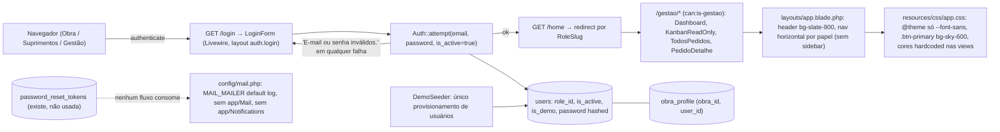
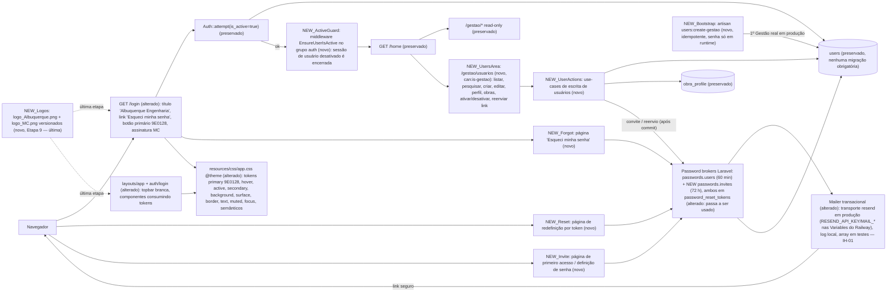

# SPEC: ajustes-finais-albuquerque

## Metadata
- Source: developer description via /plan (`docs/specs/AJUSTES-FINAIS-ALBUQUERQUE.md`, 54 sections — the requirements document; the confirmed ACs are the literal bullets of §49–§53 plus the mandatory test list of §43)
- Service: Sistema de Solicitações e Compras — Laravel monolith, repo `lobernardo/sistema_obra_mc`, branch `build/v0-demo-laravel`, baseline commit `82e4d48` (verified: `git log 82e4d48` = "fix(railway): PHP >=8.4 constraint and trusted proxies for Railway edge"), Railway project `sistema-obra-mc`
- Tier: complete
- Version: 1.1
- Changelog: 1.1 (2026-09-20) — clarifier resolve: applied developer answers Q-01..Q-10 (`.handoff/clarifier-answers.md`): bootstrap Artisan command for the owner's Gestão account (RF-32, CT-08, TC-18); `passwords.invites` broker 72 h (CT-03, RNF-01); Resend transport with approved `resend/resend-php` dependency (RF-26, CT-04, RNF-09, IH-01); post-commit invite send with honest failure feedback (RF-29, TC-19); public generic response vs Gestão-visible throttle (RF-14, RF-20, RF-21, RNF-05, TC-25); `EnsureUserIsActive` middleware (RF-31, TC-20); self + last-active-Gestão guards (RF-30, TC-21, TC-22); topbar-only navigation, UI-07 N/A; `APP_NAME` via Railway (UI-15); MC signature on auth screens only (UI-16, UI-25); 3 edit edge rules (RF-07, RF-08, RF-09, TC-23, TC-24); demo accounts deactivated in Etapa 10 runbook (RF-33). All 8 clarification markers removed (0 remaining). 1.0 — initial SPEC.
- Architecture references: `AGENTS.md` (Laravel Boost guidelines: follow sibling conventions, no new base folders or dependencies without approval, `php artisan make:*`, Pest, Pint), `docs/agents/architecture.md` (layering: routes → Livewire full-page components → single-purpose Action classes → Eloquent; Policies/Gates own authorization; Domain classifiers are pure), `docs/agents/domain_rules.md` (role matrix, `Login refuses inactive users silently`, immutable `PedidoEvent`, `GuardsOperationalMutation`), `docs/agents/data_model.md` (`users`, `obra_profile`, `password_reset_tokens`, FK cascade/restrict behavior), `docs/agents/tech_stack.md` (Laravel 13 / Livewire 4 / Tailwind 4 / Vite 8 / Pest 4 / PostgreSQL 17 / Railway). Init chain (`.spec/init/project-description.md`, `user-stories.md`, `database-schema.md`, `project-phases.md`) used only as background vocabulary — it still describes the pre-migration Next.js/Supabase stack; where it conflicts with the description (e.g. "Supabase Auth", "RLS"), the description and ACs win, and this SPEC targets the Laravel code that actually exists (see Context).

## Context

The application is a validated, in-production Laravel 13 + Livewire 4 monolith (`docs/agents/architecture.md`): every HTTP route in `routes/web.php` binds directly to a Livewire full-page component; write use-cases live in `app/Actions/Pedidos/*` (validation via `Validator::make`, `DB::transaction`, 1 immutable `PedidoEvent` per mutation); authorization is expressed as coarse role gates `is-obra` / `is-suprimentos` / `is-gestao` in `app/Providers/AppServiceProvider.php:29-31` plus `PedidoPolicy` / `PedidoEventPolicy`; obra isolation is the `obra_profile` pivot (`app/Models/User.php:53`). Authentication is a single Livewire component `App\Livewire\Auth\LoginForm` that calls `Auth::guard('web')->attempt([...$credentials, 'is_active' => true])` (`app/Livewire/Auth/LoginForm.php:47`) and answers every failure with `'E-mail ou senha inválidos.'`. There is no user-administration screen, no "Esqueci minha senha", no invite flow, no `app/Mail`, no `app/Notifications`, no `lang/` directory, and `config/mail.php` defaults to `MAIL_MAILER=log` (`config/mail.php`, `'default' => env('MAIL_MAILER', 'log')`); `README.md` line 382-383 explicitly lists "envio de e-mail" as out of scope of V0. The framework table `password_reset_tokens` already exists (`database/migrations/0001_01_01_000000_create_users_table.php:24`) and is unused. Users are provisioned only by `DemoSeeder` / factories.

Visually, the UI uses a dark top bar (`resources/views/layouts/app.blade.php:36` `bg-slate-900`) with a horizontal role-scoped nav (there is **no sidebar** in the current layout), a sky-blue primary (`resources/css/app.css:37` `.btn-primary … bg-sky-600`; `resources/views/livewire/auth/login-form.blade.php:20`), and a `@theme` block that defines only `--font-sans` (`resources/css/app.css:6`). Colors are hardcoded per view (grep: 48× `text-slate-500`, 6× `text-sky-700`, 3× `bg-sky-500`, etc.); semantic badges live in `resources/views/components/status-badge.blade.php` and `priority-badge.blade.php`; dashboard bars use `bg-sky-500` / `bg-violet-500` (`resources/views/livewire/gestao/dashboard.blade.php:110,148`). The login title and the top-bar brand both render `config('app.name')` (`resources/views/auth/login.blade.php:17`, `layouts/app.blade.php:39`).

This SPEC governs the **final evolution for Albuquerque Engenharia** (description §1): (1) user administration by Gestão (Gestão = Administrador, no 4th role — §5.1), (2) secure first-access invite (§9), (3) password recovery from the login screen (§10–§12), (4) transactional e-mail infrastructure with credentials only in Railway env vars and a recorded human-intervention point (§13), (5) global Albuquerque visual identity via centralized design tokens, predominantly light, `#9E0128` as signature (§14–§27), (6) redesigned login (§28), (7) discreet MC Inteligência signature with logo (§29, §31), (8) preparation for an MC-owned domain (§36–§37, execution deferred), (9) full preservation of architecture, business rules, Policies/Gates, obra isolation and the 296-test / 854-assertion baseline (§2–§4, §43–§44, §53), and (10) official logos applied **only in the last implementation stage** (§33, §47 Etapa 9). The document is explicit: do not rebuild, do not replace the architecture, do not reintroduce Next.js/Supabase/React, do not add Redis/workers/microservices (§3), and do not turn future/optional items (Admin role §5.1, definitive domain §36 / §47 Etapa 11, physical deletion §8) into mandatory scope.

The two logo assets referenced in §32 were verified to exist on the mounted Windows filesystem at spec time: `/mnt/c/Users/leool/OneDrive/Documentos/Projetos/MC-Inteligência_Albuquerque - Sistema de Solicitações e Compras/logo_Albuquerque.png` (PNG 1063×345 RGBA) and `.../logo_MC.png` (PNG 1305×200 RGBA). They were **not** copied (§33, §48).

## AS IS — Estado atual

Legenda: fatia atual de autenticação, área Gestão e tema. O login é o único ponto de entrada (`routes/web.php:21`), recusa inativos silenciosamente (`LoginForm.php:47`), Gestão só possui telas read-only sob `can:is-gestao` (`routes/web.php:60`), o layout tem topbar escura e nenhuma sidebar, o tema Tailwind não define tokens de cor e o e-mail está configurado apenas em `log`, sem nenhum fluxo que envie mensagens.

## TO BE — Estado proposto

Legenda: `NEW_UsersArea` e `NEW_UserActions` realizam RF-03..RF-14, RF-29, RF-30 e CT-01; `NEW_Forgot`/`NEW_Reset` realizam RF-19..RF-25 e CT-02; `NEW_Invite` realiza RF-15..RF-18 e CT-03 (broker `passwords.invites`); `Broker`/`Mailer` (alterados) realizam RF-26..RF-28, CT-04, RNF-01..RNF-05 e o ponto de intervenção IH-01; `NEW_ActiveGuard` realiza RF-31; `NEW_Bootstrap` realiza RF-32/RF-33 e CT-08; `Tokens`/`Layout`/`Login` (alterados) realizam UI-01..UI-16, UI-21..UI-24 (navegação continua topbar-only — UI-07 N/A); `NEW_Logos` realiza UI-17..UI-20 e CT-06 e só entra na Etapa 9 (§33). Autenticação (`LoginForm`), `/home`, rotas read-only de Gestão, `users` e `obra_profile` permanecem inalterados (RF-01); o único acréscimo no caminho autenticado é o middleware `EnsureUserIsActive`.

## Scope
- **In**:
  - User administration area "Usuários" for the Gestão role, with the full §6 feature list (list, search, view name/e-mail/perfil/status/obras, create, edit, change perfil, associate/change obras, activate, deactivate, trigger/re-issue password definition/recovery flow).
  - Secure first-access invite flow (§9) and administrative password help (§12) with no password ever visible to Gestão.
  - "Esqueci minha senha" from the login screen, tokenized reset flow for all three roles (§10–§11).
  - Transactional e-mail infrastructure on Laravel's native `resend` transport (developer-approved dependency `resend/resend-php`), credentials exclusively in Railway environment variables, recorded human-intervention point (§13; Q-03).
  - Developer-approved additions (v1.1): idempotent Artisan bootstrap command for the owner's real Gestão account (RF-32, CT-08); `EnsureUserIsActive` middleware terminating live sessions of deactivated users (RF-31); self-lockout and last-active-Gestão guards (RF-30); post-commit invite dispatch with honest failure feedback (RF-29); dedicated `passwords.invites` broker with 72 h expiry (CT-03); deactivation/removal of demo accounts in production as an Etapa 10 runbook step (RF-33).
  - Centralized design tokens and global application of the Albuquerque identity to every surface listed in §27 (login, recovery, first-password, sidebar/topbar, dashboards, cards, Kanban, tables, filters, forms, modals, menus, buttons, pagination, badges, notifications, charts, history, pedido detail, users area, hover/focus/active/disabled states, empty states, error/success messages).
  - Redesigned login (§28), MC Inteligência signature with logo (§29, §31), Albuquerque logo (§30), asset handling (§32), logos only in the last stage (§33).
  - Responsiveness (§34), accessibility (§35), visual QA (§46), mandatory tests (§43), regression (§44), production build (§45).
  - Preservation of stack (§3), business rules (§4), Git/Railway/DB operating rules (§38–§42).
  - Preparation for an MC-owned domain: no hardcoded host, all links derived from `APP_URL` / named routes (§36–§37) — execution of DNS/custom-domain steps is **not** in this delivery.
  - Implementation order §47 Etapas 1–10 as a RIGID sequencing constraint.
- **Out**:
  - A fourth `Admin` role, transferring administrative permissions to it, or removing administration from Gestão (§5.1 — future).
  - Definitive MC domain configuration (§36, §47 Etapa 11): custom domain on Railway, DNS, certificate, `APP_URL` change, redirect/cookie/asset/Livewire/e-mail-link validation — triggered only when the domain is communicated; "Não inventar domínio".
  - Physical deletion of users as a normal administrative action (§8 — deactivation is the action; deletion, if ever offered, is Optional and guarded by RF-13).
  - Any change to pedido creation, workflow, status transition matrix, cancellation, history, Kanban, dashboard, Policies/Gates, obra isolation, Suprimentos rules, audit or persistence (§4).
  - Redis, queues/workers, microservices, distributed architecture, additional services (§3); Next.js, Supabase, separate React app (§3).
  - Redesigning, AI-generating or sourcing alternative logos (§30–§31).
  - Creating the Resend account, verifying the sender domain, generating the API key and filling the Railway variables — human intervention (IH-01).
  - Introducing a sidebar: navigation stays topbar-only in this delivery (Q-08); §19 applies only if a sidebar ever exists (UI-07 N/A).
  - MC Inteligência signature/logo on authenticated pages or in e-mail bodies (Q-09b): the signature appears only on authentication screens (UI-16).
  - Hardcoding the brand name: `<title>`, topbar brand and mail sender keep `config('app.name')`; the visible name is set by `APP_NAME` on Railway (Q-09a, UI-15).

## RIGID (Non-Negotiable)

### Functional Requirements

#### A. Preservation and administrative role model (§2–§5)

- RF-01 [Ubiquitous]: The system SHALL preserve, unchanged in behavior, every flow listed in §4: criação de solicitações, visualização por obra, responsáveis, prioridades, datas necessárias, previsão de entrega, cálculo de atraso, cancelamento, workflow, histórico, Kanban, dashboard, autenticação, Policies/Gates, isolamento por obra, Gestão read-only nos fluxos que hoje são read-only, regras de Suprimentos, auditoria e persistência. Functional changes SHALL be limited to the scope explicitly defined in this SPEC.
  - AC: Every test file present at baseline `82e4d48` (296 tests / 854 assertions) passes without modification of its assertions; `PedidoPolicy`, `PedidoEventPolicy`, `GuardsOperationalMutation`, the 6 `app/Actions/Pedidos/*` actions, the 3 `app/Domain/Pedidos/*` classifiers and the `StatusSlug` transition matrix produce identical results for identical inputs before and after the change.
- RF-02 [Ubiquitous]: The Gestão role SHALL act as the system administrator in this version (`Gestão = Administrador`). The system SHALL NOT introduce a fourth role: `RoleSlug` remains exactly `obra`, `suprimentos`, `gestao` (verified at `app/Enums/RoleSlug.php:5-9`) and the `roles` lookup keeps 3 rows.
  - AC: `RoleSlug::cases()` count equals 3; no migration or seeder inserts a role with slug other than the 3 existing; a user with role `gestao` can reach the users area (RF-03) and no user of another role can (RF-05).
- RF-03 [State-Driven]: WHILE the authenticated user has role `gestao`, the system SHALL expose a section named `Usuários` in the Gestão area that lists all users showing, per row, nome, e-mail, perfil (role name), status (ativo/inativo) and, for Obra users, the associated obras.
  - AC: Logged in as `gestao`, the navigation contains an entry labeled `Usuários`; the listing renders every `users` row with the 5 columns above; an Obra user with 2 obras shows both obra names; a Suprimentos/Gestão user shows no obra association.
- RF-04 [Event-Driven]: WHEN the Gestão user submits a search term in the users area, the system SHALL filter the listing to users whose nome OR e-mail contains the term, case-insensitively.
  - AC: With users "Ana Silva" (ana@x.com) and "Bruno" (bruno@x.com), searching `ana` returns only Ana; searching `BRUNO@` returns only Bruno; empty term returns all.
- RF-05 [Unwanted]: IF a user whose role is `obra` or `suprimentos` requests any users-administration page or invokes any users-administration action (create, edit, change perfil, associate obras, activate, deactivate, re-issue link), THEN the system SHALL refuse with HTTP 403 and persist nothing; IF the requester is unauthenticated, THEN the system SHALL redirect to `/login` (existing `Authenticate` middleware behavior, verified at `app/Http/Middleware/Authenticate.php:15`).
  - AC: Feature tests for `obra` and `suprimentos` actors receive 403 on the users-area route and on each Livewire action invoked directly (forged call, same technique as `tests/Feature/Livewire/KanbanForgedMoveTest.php`); the `users` table is unchanged after each attempt; a guest is redirected to `route('login')`.

#### B. User administration operations (§6–§8, §12)

- RF-06 [Event-Driven]: WHEN the Gestão user submits the create-user form with nome, e-mail, perfil and — only when perfil is Obra — one or more obras, the system SHALL create the user with `is_active = true`, `is_demo = false`, a non-guessable, unusable-as-typed password (never a shared default, never shown), the chosen role, the chosen obra associations, committed in one `DB::transaction`, and SHALL dispatch the first-access invite (RF-15) after that transaction commits (RF-29).
  - AC: After submit, a `users` row exists with the given nome/e-mail/role_id, `is_active = true`, `is_demo = false`; `obra_profile` has exactly one row per selected obra; a notification/mailable to that e-mail was sent (`Notification::fake()` / `Mail::fake()` assertion); the response never contains a password; logging in with any documented default password (e.g. `password`) fails.
- RF-07 [Unwanted]: IF the create/edit form is submitted with an e-mail already present in `users.email` (unique index verified at `database/migrations/0001_01_01_000000_create_users_table.php:18`), an invalid e-mail, an empty nome, a role not among the 3 `RoleSlug` values, OR perfil `obra` with zero obras selected (Q-10.1: an Obra user requires ≥ 1 obra on create and on edit), THEN the system SHALL reject with field-level validation messages in PT-BR and persist nothing.
  - AC: Each invalid case yields a validation error on the corresponding field (`obras` for the zero-obra case); `users` and `obra_profile` counts are unchanged.
- RF-08 [Event-Driven]: WHEN the Gestão user saves the edit-user form, the system SHALL update nome, e-mail and perfil of the target user, subject to RF-30. WHEN the e-mail is changed, the system SHALL only update the column: it SHALL NOT send an automatic invite and SHALL NOT delete pending `password_reset_tokens` rows of the old address — those expire naturally (Q-10.3). WHEN the perfil changes from `obra` to `suprimentos` or `gestao`, the system SHALL detach every `obra_profile` row of that user in the same transaction (Q-10.2).
  - AC: The `users` row reflects the new values; `updated_at` changes; the user's existing `pedidos` / `pedido_events` references are untouched; after an e-mail change, `Notification::assertNothingSent()` holds and a pre-existing `password_reset_tokens` row for the old e-mail still exists; after changing perfil Obra → Suprimentos, `obra_profile` has 0 rows for the user (TC-24).
- RF-09 [Event-Driven]: WHEN the Gestão user changes the obra associations of an Obra user (add or remove), the system SHALL persist the new set in `obra_profile` under the existing cardinality rules (`tests/Feature/ObraProfileCardinalityTest.php`; pivot verified at `database/migrations/2026_09_18_230113_create_obra_profile_table.php:14`), SHALL refuse a resulting empty set for an Obra user (RF-07), and WHILE the perfil is not Obra the form SHALL NOT offer obra association.
  - AC: Saving Obra user with obras {A, B} then {B, C} results in pivot rows exactly {B, C}; saving {} for an Obra user yields a validation error and pivot rows stay {B, C} (TC-23); `PedidoPolicy::view` for that user now allows pedidos of C and denies pedidos of A; the obra selector is absent when perfil is Suprimentos or Gestão.
- RF-10 [Event-Driven]: WHEN the Gestão user executes `Desativar usuário` on an active user (subject to RF-30), the system SHALL set `users.is_active = false` (column verified at `database/migrations/2026_09_18_230111_add_role_and_profile_fields_to_users_table.php:16`) and SHALL NOT delete the row nor any `pedidos`, `pedido_events`, `obra_profile` or `sessions` rows referencing it; any live session of that user is terminated on its next request by RF-31.
  - AC: After deactivation, `users` row exists with `is_active = false`; counts of `pedidos` where `requester_id`/`responsible_id` = user and `pedido_events` where `actor_id` = user are unchanged; the pedido history timeline still renders the user's name on its events.
- RF-11 [Event-Driven]: WHEN the Gestão user executes `Ativar` on an inactive user, the system SHALL set `is_active = true`.
  - AC: The user can subsequently authenticate with a valid password.
- RF-12 [Unwanted]: IF a user with `is_active = false` submits valid credentials at login, THEN the system SHALL refuse with the existing generic message `'E-mail ou senha inválidos.'` (verified at `app/Livewire/Auth/LoginForm.php:47-51`).
  - AC: Existing test `a deactivated user does not authenticate even with valid credentials` (`tests/Feature/Auth/LoginTest.php`) keeps passing; `Auth::check()` is false.
- RF-13 [Optional]: WHERE a physical delete of a user is offered at all (not required by this delivery; §8 "Preferir desativação"), IF the user has any related `pedidos` (as requester or responsible), `pedido_events` (as actor) or other dependent records, THEN the system SHALL refuse the deletion. The FK constraints `restrictOnDelete` on `pedidos.requester_id` (`2026_09_18_230114_create_pedidos_table.php:18`) and `pedido_events.actor_id` (`2026_09_18_230115_create_pedido_events_table.php:20`) SHALL be preserved as the last line of defense.
  - AC: If a delete action exists, attempting it on a user with 1 pedido returns an error and the row remains; the two FK constraints remain `restrict` in the schema.
- RF-14 [Event-Driven]: WHEN the Gestão user triggers "reenviar convite / enviar link de redefinição" for a user, the system SHALL send a secure link to that user's own e-mail address; the system SHALL NEVER display the current password, recover an old password, or deliver any password in plain text to Gestão or anyone (§12). Because this action is authenticated (not public), WHEN the broker answers `throttled` (a link was issued for that e-mail less than `throttle` seconds ago), the system SHALL show Gestão an explicit PT-BR message stating that a link was already sent moments ago, instead of the generic confirmation (Q-05).
  - AC: A notification is sent to the target user's e-mail only; no response body, log line or e-mail contains a plaintext password; no code path reads `users.password` for display; triggering the action twice within the throttle window sends exactly 1 notification and the second response contains the explicit "já enviado" message (TC-25).
- RF-29 [Event-Driven]: WHEN the create-user transaction (RF-06) has committed and the invite dispatch (RF-15) throws an exception (transport failure, provider error), THEN the system SHALL keep the created user, log the exception via the application logger, and show Gestão an honest PT-BR feedback of the form "Usuário criado, mas o convite não pôde ser enviado — use Reenviar convite"; RF-14 is the recovery path. The invite SHALL never be dispatched before the commit (no invite for a rolled-back user) (Q-04).
  - AC: With the notification channel faked to throw, after submit the `users` row exists, the response shows the failure feedback, no unhandled exception reaches the browser, and a subsequent RF-14 call sends the invite (TC-19); with a validation failure or transaction rollback, `Notification::assertNothingSent()` holds.
- RF-30 [Unwanted]: IF a Gestão user attempts to deactivate (RF-10) or change the perfil (RF-08) of their OWN account (`$actor->is($target)`), OR IF a deactivation or perfil change would leave ZERO users with role `gestao` and `is_active = true`, THEN the system SHALL refuse the operation with a PT-BR error and persist nothing. The guard SHALL be enforced in the Action/Policy layer (server-side), not only hidden in the UI (Q-07).
  - AC (TC-21, self-guard): Gestão A invokes deactivate on A (forged Livewire call) → PT-BR error, `is_active` still true; A changes own perfil to `obra` → error, `role_id` unchanged. AC (TC-22, last-Gestão guard): with two active Gestão users A and B, A deactivates B → success; then B (now inactive) no longer counts and A is the last active Gestão, so a direct Action call that would deactivate A or change A's perfil → error, row unchanged; re-activating B makes the change to A possible again except when A acts on itself (self-guard still applies).
- RF-31 [State-Driven]: WHILE an authenticated session belongs to a user whose `is_active` is `false`, the system SHALL, on the next request to any route under the `auth` middleware group, log the user out, invalidate the session and regenerate the CSRF token, and redirect to `/login` with a PT-BR message; `sessions` table rows SHALL NOT be deleted by the deactivation action itself (Q-06). This SHALL be implemented as a dedicated middleware (`EnsureUserIsActive`) aliased in `bootstrap/app.php` and applied wherever `auth` applies, without modifying `LoginForm` (RF-01).
  - AC: Feature test: user logs in, Gestão deactivates them, the user's next `GET` to an authenticated route redirects to `route('login')` with the message and `Auth::check()` is false afterwards (TC-20); an active user's requests are unaffected; `tests/Feature/Auth/LoginTest.php` stays green.

#### C. First access (§9)

- RF-15 [Event-Driven]: WHEN a user is created (RF-06, after commit) or the invite is re-issued (RF-14), the system SHALL send an e-mail containing a secure link with a temporary token issued by the dedicated `passwords.invites` broker (CT-03, 72 h expiry) to the user's e-mail address, using a dedicated invite notification with first-access copy.
  - AC: The captured notification/mailable is addressed to the user's e-mail, is the invite notification class (not the reset one), and its link contains a token and identifies the account; the link does not contain the password; a `password_reset_tokens` row exists for the e-mail.
- RF-16 [Event-Driven]: WHEN the invited user opens a valid invite link and submits a password with confirmation that satisfies RNF-06, the system SHALL store it hashed, invalidate the token, and allow login with that password.
  - AC: After submit, `Hash::check(newPassword, user.password)` is true; the token row is removed/invalid; reusing the same link fails; `LoginForm` authenticates with the new password.
- RF-17 [Unwanted]: IF the invite link token is invalid, expired or already used, THEN the system SHALL refuse to set the password and show an error without revealing whether the e-mail exists.
  - AC: Tampered token → validation error, password unchanged; token older than 4320 minutes (72 h, CT-03) → same (TC-12, via time travel on `password_reset_tokens.created_at`); consumed token → same.
- RF-18 [Unwanted]: The system SHALL NOT use shared default passwords for new users, SHALL NOT send passwords in plain text by e-mail, and SHALL NOT store reversible passwords (§9).
  - AC: No seeded/fixed password is assigned by the create-user use-case; e-mail bodies never contain the password; `users.password` remains bcrypt-hashed (`'password' => 'hashed'` cast verified at `app/Models/User.php:33`).

#### D. Password recovery (§10–§11)

- RF-19 [Ubiquitous]: The login screen SHALL display a link labeled `Esqueci minha senha` leading to a page that asks for the e-mail.
  - AC: `GET /login` HTML contains the text `Esqueci minha senha` linking to the recovery route (CT-02); the recovery page renders an e-mail input.
- RF-20 [Event-Driven]: WHEN the recovery form is submitted with the e-mail of an existing **active** user, the system SHALL create a temporary reset token (broker `passwords.users`, 60 min), send an e-mail with the secure reset link, and display a generic confirmation.
  - AC: A `password_reset_tokens` row exists for the e-mail; a reset notification is sent; the page shows the generic confirmation text.
- RF-21 [Unwanted]: IF the recovery form is submitted with an unknown e-mail, OR the e-mail of a user with `is_active = false`, OR an e-mail for which the broker answers `throttled` (a link was issued less than `throttle` seconds ago), THEN the system SHALL display the same generic confirmation as RF-20, SHALL NOT send any e-mail to a deactivated user, SHALL NOT send a second e-mail while throttled (the throttle stays enforced server-side), and SHALL NOT reveal whether the address has an account or was throttled (§11 anti-enumeration; §50 "usuário desativado não recupera acesso indevidamente"; Q-05).
  - AC: Response body and status are byte-identical between unknown e-mail, inactive e-mail, throttled e-mail and active e-mail; no notification is sent for unknown or inactive users; submitting twice for the same active e-mail within the throttle window sends exactly 1 notification and both responses show the generic text (TC-25); the deactivated user cannot obtain a working reset link.
- RF-22 [Event-Driven]: WHEN the user opens a valid reset link and submits a new password with confirmation satisfying RNF-06, the system SHALL update the password hash, invalidate the token, and allow login with the new password while the previous password stops working.
  - AC: Login with new password succeeds; login with old password fails with the generic message; the token cannot be reused.
- RF-23 [Unwanted]: IF the reset token is invalid, expired or already consumed, THEN the system SHALL refuse the reset and leave the password unchanged.
  - AC: Each of the 3 cases yields a validation error and `users.password` hash is unchanged.
- RF-24 [Ubiquitous]: Password recovery SHALL be available to users of all three roles: Obra, Suprimentos, Gestão.
  - AC: The RF-20/RF-22 test runs for one user of each role and passes.
- RF-25 [Unwanted]: The system SHALL NOT expose the current password of any user through any page, action, API response, log or e-mail; no feature SHALL allow consulting a stored password (§11–§12).
  - AC: Grep of `resources/views`, `app/` for any output of `->password` or `users.password` yields none; `User` keeps `password` in `#[Hidden]` (verified at `app/Models/User.php:20`).

#### E. E-mail infrastructure (§13)

- RF-26 [Ubiquitous]: The application SHALL send invite and recovery e-mails through Laravel's mail layer using a transport configured exclusively by environment variables (CT-04). Production SHALL use Laravel's native `resend` transport (`MAIL_MAILER=resend`, API key read from `config('services.resend.key')` ← `RESEND_API_KEY`, block verified at `config/services.php:21-23`), which requires the Composer package `resend/resend-php` — its addition is **approved by the developer** (Q-03; RNF-09 exception); the planner SHALL confirm the version compatible with Laravel 13 (`search-docs` / `composer show`) before requiring it. The committed default (`.env.example`) SHALL stay `MAIL_MAILER=log`; the test suite SHALL keep `array` (`phpunit.xml:36`); local development and tests SHALL NOT require a real provider.
  - AC: `composer.json` `require` lists `resend/resend-php` at a version compatible with the installed Laravel; with `MAIL_MAILER=array` the test suite sends and asserts both message types without network; with `MAIL_MAILER=log` locally the message body (including the link) is written to the log; `.env.example` keeps `MAIL_MAILER=log`; no transport host, user, password or API key appears in any versioned file (`tests/Feature/Compliance/NoCommittedSecretsTest.php` stays green).
- RF-27 [Ubiquitous]: The e-mail messages (invite, recovery) SHALL be written in PT-BR, identify the sender as configured by `MAIL_FROM_NAME` / `MAIL_FROM_ADDRESS`, and build their links from `APP_URL` via named routes so they remain valid after a future domain change (§36).
  - AC: Rendered messages contain PT-BR copy; the link host equals `config('app.url')` host; changing `APP_URL` in a test changes the link host with no code change.
- RF-28 [Ubiquitous]: The provider is decided (Resend, Q-03); the account, verified sender domain, API key and Railway variables remain a **human intervention point** (IH-01, see "Human intervention points"): the delivery SHALL leave the application ready (transport selectable by `MAIL_MAILER`, variables documented in `README.md`) and shippable with the transport unset (`log`) without breaking any other flow.
  - AC: `README.md` production variables table lists `MAIL_MAILER=resend`, `RESEND_API_KEY`, `MAIL_FROM_ADDRESS`, `MAIL_FROM_NAME`, `APP_NAME` with placeholder values (never real ones); the plan/traceability records IH-01 as an open human action until credentials are set on Railway.

#### F. Production bootstrap of the real Gestão account (Q-01)

- RF-32 [Event-Driven]: WHEN the operator runs an idempotent Artisan command (CT-08, e.g. `users:create-gestao`) supplying the owner's nome, e-mail and an initial password provided only at runtime, the system SHALL create — or, if a user with that e-mail already exists, update without duplicating — a user with role `gestao`, `is_active = true`, `is_demo = false`, and the given password hashed. The command SHALL NOT contain any default password in code, SHALL NOT read the password from a versioned file, and SHALL NOT overwrite the password of an already-existing user unless an explicit opt-in flag is passed (flag name FLEXIBLE). The initial password value is NEVER recorded in this SPEC, in Git, in logs or in Railway variables (§40); the owner changes it afterwards through "Esqueci minha senha" (RF-19..RF-22). The owner then creates the client's (Albuquerque) Gestão user through the Usuários area (RF-06).
  - AC (TC-18): Running the command twice with the same e-mail leaves exactly 1 `users` row with role `gestao`, `is_active = true`, `is_demo = false`; the second run without the opt-in flag leaves `users.password` unchanged; with the flag, `Hash::check` on the new value is true; the command output never echoes the password; `grep -rn` for the password option's default in `app/Console` finds no literal value; running with a missing password option fails with a usage error and creates nothing.
- RF-33 [Ubiquitous]: The demo accounts seeded by `DemoSeeder` (`*.demo@example.com`, `is_demo = true`, verified at `database/seeders/DemoSeeder.php:139-142`) SHALL be deactivated (or removed where RF-13 allows) in the production database during Etapa 10, only AFTER the real Gestão account (RF-32) exists and its login has been verified; this is a runbook step, not automated code, and SHALL NOT run `migrate:fresh` or drop data (RNF-15).
  - AC: The Etapa 10 runbook in the plan lists, in order: run RF-32 command → verify login → deactivate demo users; after execution, `SELECT count(*) FROM users WHERE is_demo = true AND is_active = true` = 0 in production; `DemoSeeder` and its tests remain unchanged for local/test environments.

### UI Requirements

#### Design system and identity (§14–§27)

- UI-01 [Ubiquitous]: The theme SHALL be defined once in a central location compatible with Tailwind 4 (the existing `@theme` block in `resources/css/app.css:6`) and SHALL expose at minimum these tokens: `primary`, `primary-hover`, `primary-active`, `secondary`, `background`, `surface`, `border`, `text`, `muted text`, `focus`, and semantic states (`success`, `warning`, `error`, `info`, `atraso`, `concluído`). Components SHALL consume these tokens instead of hardcoded palette classes for brand and surface colors (§17).
  - AC: `resources/css/app.css` `@theme` declares a variable for each token listed; after the change, `grep -rE "(bg|text|border|ring|from|to)-sky-[0-9]+" resources/views resources/css` returns 0 matches; `.btn-primary`, `.form-control`, `.card`, `.data-table`, `.badge` reference token variables or token-derived utilities.
- UI-02 [Ubiquitous]: The token values SHALL be the §16 reference palette: primary `#9E0128`; vinho secundário `#802036`; vinho escuro `#661F35`; bordô profundo `#520C1F`; branco `#FFFFFF`; fundo secundário `#F7F7F8`; bordas/divisores `#E5E7EB`; texto principal `#202124`; texto secundário `#6B7280`.
  - AC: Each of the 9 hex values appears in the `@theme` block bound to the corresponding token; primary-hover/active resolve to `#802036`/`#661F35` (or `#520C1F`), never to a blue.
- UI-03 [Ubiquitous]: The interface SHALL remain predominantly LIGHT: approximately 75–80% white/neutrals, 15–20% greys, 5–10% institutional red/wine; the large red surfaces of the institutional website SHALL NOT be reproduced (§15).
  - AC: Visual review checklist (RNF-16) records, per screen, that page background, cards, tables, forms and modals are white/`#F7F7F8`; no full-width container (header, sidebar, hero, page background) uses a red/wine fill.
- UI-04 [Ubiquitous]: Surfaces SHALL follow §18: general background white or very light grey; cards white with discreet borders and minimal shadow; tables light with discreet headers; forms on light surfaces; modals white/light.
  - AC: `.card` uses `surface` + `border` tokens and shadow at most `shadow-sm`; `.data-table thead th` uses a neutral background token; no dark (`slate-800`/`slate-900`) surface remains in layouts.
- UI-05 [Ubiquitous]: Primary `#9E0128` SHALL be used principally for: botões primários, item ativo, links importantes, seleção, indicadores ativos, ícones de destaque, pequenos elementos institucionais (§18).
  - AC: `.btn-primary` background = primary token; active nav item uses primary token for text/indicator; focus rings use `focus` token derived from primary.
- UI-06 [Ubiquitous]: Dark wines (`#802036`, `#661F35`, `#520C1F`) SHALL be used for hover, active, details, specific headers and controlled-contrast elements only (§18).
  - AC: `.btn-primary:hover` and `:active` resolve to a wine token; no wine value is used as a page or panel background.
- UI-07 [Ubiquitous — N/A in this delivery]: Navigation SHALL remain topbar-only (Q-08): this delivery SHALL NOT introduce a sidebar; the current horizontal nav inside the top bar (`resources/views/layouts/app.blade.php:44-58`) is kept and restyled by UI-08. §19 (white/light sidebar, red/wine only for active item, icons, indicators, details; never an entirely red sidebar) is recorded as **N/A — no sidebar exists** in the Etapa 7 visual review and becomes binding only if a sidebar is ever added in a future delivery.
  - AC: `resources/views/layouts/app.blade.php` contains no `<aside>`/sidebar region; the visual review (RNF-16) has an explicit line "§19 Sidebar: N/A — navegação topbar-only"; the §27/§34/§51 "sidebar" items are marked N/A with the same note.
- UI-08 [Ubiquitous]: The topbar SHALL be white, clean, corporate, organized, without excess elements (§20); the current dark `bg-slate-900` header (`layouts/app.blade.php:36`) SHALL be replaced. The Gestão branch of the nav SHALL have 4 entries: the 3 existing (`Dashboard`, `Kanban`, `Todos os Pedidos` — verified at `layouts/app.blade.php:28-30`) plus `Usuários` (RF-03); Obra and Suprimentos branches are unchanged.
  - AC: Header background = `surface` token (white); role badge and "Sair" control use neutral/primary tokens; no `bg-slate-900`/`bg-slate-800` in the header; logged in as `gestao` the nav renders exactly 4 links including `Usuários`; logged in as `obra`/`suprimentos` the nav has no `Usuários` link.
- UI-09 [Ubiquitous]: Buttons SHALL follow §21 — primary: background `#9E0128`, white text, hover in darker wine; secondary: white background, neutral or wine border, wine/dark text; excessive rounding SHALL be avoided.
  - AC: `.btn-primary`/`.btn-secondary` match the above; border radius of buttons/inputs ≤ `rounded-md` (6px); no `rounded-full` on buttons.
- UI-10 [Ubiquitous]: Inputs SHALL follow §22 — white background, neutral border, legible text, focus/ring in the institutional color, accessible error states, clear disabled states.
  - AC: `.form-control` focus ring uses `focus` token; `.form-error` renders with `error` semantic token and `role="alert"` (existing pattern in `login-form.blade.php`); `disabled:` variant renders a visibly different background.
- UI-11 [Ubiquitous]: Badges and status indicators SHALL keep appropriate semantic colors for sucesso, alerta, erro, informação, atraso, concluído; institutional red SHALL NOT be applied to all states (§23).
  - AC: `status-badge.blade.php` and `priority-badge.blade.php` map each slug to a distinct semantic token; `.pedido-atrasado` keeps a distinguishable overdue treatment (existing `data-status`/`data-priority` attributes and `tests/Feature/Livewire/PedidoCardRenderTest.php` keep passing); no two workflow statuses share the same color.
- UI-12 [Ubiquitous]: Dashboard charts/bars SHALL use institutional red/wine as the main series where appropriate and neutrals, coherent auxiliary tones and semantic colors for secondary series, preserving contrast, readability, accessibility and fast interpretation (§24).
  - AC: `dashboard.blade.php` bars for `porStatus`/`porObra` use primary or neutral tokens instead of `bg-sky-500`/`bg-violet-500`; `prazos` buckets keep 3 distinguishable semantic colors; `tests/Feature/Livewire/DashboardIndicatorsTest.php` passes.
- UI-13 [Ubiquitous]: The visual language SHALL convey engenharia, construção, gestão profissional, organização, solidez, precisão, modernidade, aparência corporativa, técnica, premium sem excessos (§25) and SHALL avoid: large fully-red areas, excess gradients, heavy shadows, dark interfaces, excess colors, generic SaaS-template look, over-rounded components, childish look, gratuitous visual effects, excess animation, excess decoration (§26).
  - AC: Visual review (RNF-16) has an explicit pass/fail line for each of the 11 §26 items per screen; no `bg-gradient-*`, no `shadow-xl`/`shadow-2xl`, no `animate-*` beyond Livewire loading states in `resources/views`.
- UI-14 [Ubiquitous]: The identity SHALL be applied consistently to every item of §27: autenticação, recuperação de senha, definição inicial de senha, sidebar (if any), topbar, dashboards, cards, Kanban, tabelas, filtros, formulários, modais, menus, botões, paginação, badges, notificações, gráficos, histórico, detalhes do pedido, área de usuários, estados hover/focus/active/disabled, telas vazias, mensagens de erro/sucesso. Reformulating only the home SHALL NOT be accepted.
  - AC: The visual review matrix lists all 26 items × screens with a checked status; every Livewire view under `resources/views/livewire/{auth,obra,suprimentos,kanban,gestao}` and the 6 components under `resources/views/components` were touched or explicitly verified as already token-compliant.

#### Login and branding (§28–§33, §37)

- UI-15 [Ubiquitous]: The login screen SHALL be visually redesigned with this structure: logo Albuquerque (applied in Etapa 9), the application name rendered from `config('app.name')` (kept — `resources/views/auth/login.blade.php:17`, `layouts/app.blade.php:39` `<title>`/brand and `MAIL_FROM_NAME` all keep reading `config('app.name')`; no hardcoded brand string — Q-09a), login card, title `Entrar no sistema`, e-mail, senha, `Esqueci minha senha`, button `Entrar`, discreet MC Inteligência signature. The visible name `Albuquerque Engenharia` SHALL come from `APP_NAME="Albuquerque Engenharia"` set in Railway Variables (Etapa 10, documented in `README.md`) and updated in `.env.example` (not a secret). The current blue button SHALL cease to exist; the primary action SHALL use institutional red (§28).
  - AC: With `config(['app.name' => 'Albuquerque Engenharia'])` (or `APP_NAME` in `phpunit.xml`), `GET /login` contains the literal texts `Albuquerque Engenharia`, `Entrar no sistema`, `Esqueci minha senha`, `Entrar`, `Tecnologia por MC Inteligência`; `grep -rn "Albuquerque Engenharia" resources/views app` returns 0 matches (name only via config); `.env.example` line 23 reads `APP_NAME="Albuquerque Engenharia"`; `README.md` production variables table lists `APP_NAME`; the submit button carries the primary token class and no `sky-*` class; `tests/Feature/Livewire/LoginFormTest.php` and `tests/Feature/Auth/LoginTest.php` pass.
- UI-16 [Ubiquitous]: The signature `Tecnologia por MC Inteligência` SHALL appear ONLY on the authentication screens — login, "Esqueci minha senha", reset de senha and convite/primeiro acesso (Q-09b); it SHALL NOT be added to authenticated pages (`layouts/app.blade.php`) nor to e-mail bodies in this delivery. Wherever it appears, the official MC Inteligência logo SHALL appear with it, aligned with the text, proportional, small, delicate, visually discreet, not competing with Albuquerque (`[logo MC] Tecnologia por MC Inteligência` or an equivalent, visually better composition) (§29). Albuquerque is the primary brand; there SHALL be no 50/50 visual dispute (§14).
  - AC: `grep -rn "MC Inteligência" resources/views` matches only the auth layout/auth views (not `layouts/app.blade.php`, not `resources/views/livewire/{obra,suprimentos,kanban,gestao}`, not mail templates); each occurrence of the signature text is adjacent to an `` of the MC logo (Etapa 9) whose rendered height is smaller than the Albuquerque logo's rendered height on the same screen and smaller than the body text line-height × 2; the signature sits in a footer/secondary position, not in the header hierarchy.
- UI-17 [Ubiquitous]: The official Albuquerque logo SHALL be added to the authentication experience keeping its original proportion (1063×345, verified), undistorted, with rounded-corner presentation when visually appropriate, breathing room, responsive size, not dominating the screen; the logo SHALL NOT be redesigned, AI-generated or sourced from the internet — only the owner-provided asset (§30).
  - AC: The `` uses `width:auto`/`height:auto` or an aspect-preserving class (no fixed width+height pair with a different ratio); rendered width ≤ 60% of the login card width on desktop and ≤ 90% on mobile; file checksum equals the provided original.
- UI-18 [Ubiquitous]: The MC Inteligência logo SHALL be used exclusively from the provided file (1305×200, verified), not redesigned, not regenerated, not sourced elsewhere, applied discreetly beside the MC identification (§31).
  - AC: File checksum equals the provided original; it is referenced only next to the signature text.
- UI-19 [Ubiquitous]: Before copying the assets, the implementer SHALL confirm the files exist, confirm the names, inspect dimensions/format and SHALL NOT overwrite the originals; the copies SHALL live inside the Laravel project, be versioned in Git and be served without any dependency on the Windows path; Railway SHALL NOT depend on the Windows path (§32).
  - AC: Both assets exist under the repository (CT-06) and are tracked by `git ls-files`; no reference to `/mnt/c/` or `C:\Users` exists in `app/`, `resources/`, `public/`, `config/`; the originals at the Windows path are unmodified (same size/mtime as inspected: 209281 B and 23177 B).
- UI-20 [Ubiquitous]: The effective application of `logo_Albuquerque.png` and `logo_MC.png` SHALL occur only in the LAST implementation stage (§33, §47 Etapa 9), after functionality, user administration, additional authentication, password recovery, e-mail infrastructure, design system, identity application, screen validation and regression validation are complete.
  - AC: The commit(s) that add the asset files and their `` references come after the commits of Etapas 2–8 in the branch history; no earlier commit references the logo files.
- UI-21 [Ubiquitous]: All changes SHALL work on desktop, notebook, tablet and mobile, with special attention to login, sidebar (if any), tables, Kanban, dashboard, users administration, forms and modals; existing responsiveness SHALL NOT break (§34).
  - AC: Browser/E2E check at 3 viewports (≥1280px, 768–1024px, ≤414px) for login, Kanban, dashboard, users area and a form: no horizontal overflow of the document, all primary controls reachable; `tests/Browser/DemoRoteiroTest.php` passes.
- UI-22 [Ubiquitous]: Accessibility and legibility SHALL be preserved: adequate contrast, labels, visible focus, coherent navigation, understandable error messages, legible size, clear visual hierarchy; accessibility SHALL NOT be sacrificed to reproduce the identity (§35).
  - AC: Text on primary (`#FFFFFF` on `#9E0128`) and body text (`#202124` on `#FFFFFF`/`#F7F7F8`) meet WCAG AA contrast ratio ≥ 4.5:1; every input keeps a `<label for>`; focus is visible (ring ≥ 2px) on buttons, links and inputs; `tests/Feature/Livewire/AccessibleStatusControlTest.php` passes.
- UI-23 [Ubiquitous]: The users administration interface SHALL follow the identity defined in this SPEC (tokens, buttons, inputs, tables, badges) (§6).
  - AC: The users listing uses `.data-table`, `.card`, `.btn-primary`/`.btn-secondary`, `.badge` (or their token-based successors); no hardcoded palette classes.
- UI-24 [Ubiquitous]: The "Esqueci minha senha", reset and first-access pages SHALL reuse the authentication layout and identity (Albuquerque title, card, primary button, MC signature) (§27).
  - AC: Those pages render under the same auth layout as `/login` with the same title, card and signature.
- UI-25 [Ubiquitous]: Although the hosting domain will belong to MC Inteligência, the interface SHALL remain primarily Albuquerque; the domain represents hosting/technology operation, the visual experience represents the client (§37).
  - AC: No MC-branded header, favicon or page title replaces Albuquerque in authenticated screens; MC appears only in the auth-screen signature (UI-16); authenticated screens contain no MC reference at all.

### Contracts

- CT-01 — Users administration routes (novo). Under the existing `Route::middleware('auth')` + `can:is-gestao` + `prefix('gestao')` + `name('gestao.')` group (verified at `routes/web.php:60`): a listing/management page at `GET /gestao/usuarios` named `gestao.usuarios.index` bound to a Livewire full-page component; create/edit may be pages (`gestao.usuarios.create`, `gestao.usuarios.edit`) or Livewire modals — the URL shape of create/edit is FLEXIBLE, the middleware stack and the `gestao.usuarios.*` name prefix are RIGID. Every mutation (create, update, change perfil, sync obras, activate, deactivate, resend link) SHALL be a Livewire action that authorizes via a Gate/Policy ability before delegating to an Action class (RNF-19).
- CT-02 — Password recovery routes (novo), under `Route::middleware('guest')`: `GET` request page named `password.request`; `POST`/Livewire submit named `password.email`; `GET` reset page with `{token}` named `password.reset` (this name is what Laravel's `ResetPassword` notification resolves by default); submit named `password.update`. Suggested PT-BR paths (`/esqueci-senha`, `/redefinir-senha/{token}`) are FLEXIBLE; the 4 route names are RIGID. Token store: `password_reset_tokens` (verified at `database/migrations/0001_01_01_000000_create_users_table.php:24`), broker config `passwords.users.expire = 60`, `throttle = 60` (verified at `config/auth.php:99-100`). The `password.email` submit SHALL render the same generic confirmation for every broker status (`sent`, `user`/unknown, inactive, `throttled`) — RF-21.
- CT-03 — Invite / first-access link (novo): a `guest` GET page receiving a token and the account identifier, and a submit that sets the password. It MAY reuse the `password.reset` / `password.update` pair with invite-specific copy, or be a distinct `invite.*` pair — FLEXIBLE. RIGID (Q-02): tokens are issued by a **second password broker** `passwords.invites` added to `config/auth.php` with `provider = users`, `table = password_reset_tokens` (same table, no migration), `expire = 4320` (72 h), `throttle = 60` (same as the default broker); a dedicated notification class with first-access copy (e.g. `App\Notifications\FirstAccessInvite`) builds the link via a named route and `APP_URL`; the token is temporary, single-use, hashed by the framework and bound to the invited e-mail; the 72 h expiry is stated in the invite e-mail body and in `README.md`. No new Composer package for this contract.
- CT-04 — E-mail environment variables (verified at `config/mail.php`, `config/services.php`): `MAIL_MAILER` (transport; `log` committed default, `array` in tests, `resend` in production — Q-03), `RESEND_API_KEY` (read by `config('services.resend.key')`, verified at `config/services.php:21-23` — the existing env name is kept; the shorthand "RESEND_KEY" in the answers refers to this variable), `MAIL_FROM_ADDRESS`, `MAIL_FROM_NAME` (`'from'` block verified at `config/mail.php:113-116`), plus `APP_NAME` (UI-15) and `APP_URL` (links; verified at `config/app.php:55`). The SMTP variable set (`MAIL_SCHEME`, `MAIL_URL`, `MAIL_HOST`, `MAIL_PORT`, `MAIL_USERNAME`, `MAIL_PASSWORD`, `MAIL_EHLO_DOMAIN`) stays available as the framework fallback but is not the production path. Production values live only in Railway → serviço Laravel → Variables. Package addition: `resend/resend-php` only (approved, Q-03) — no other mail package (Postmark, SES, Mailgun) SHALL be added.
- CT-05 — Database changes: RIGID requires no new table or column — `users.is_active`, `users.password` (hashed), `obra_profile` and `password_reset_tokens` already exist. Any addition found necessary during implementation (e.g. an `invited_at`/`password_set_at` timestamp) SHALL be an incremental, reversible migration under `database/migrations/` with a `down()`, applied by `php artisan migrate --force` in the Railway pre-deploy command; `migrate:fresh` is forbidden in production (§42).
- CT-06 — Brand assets (novo, Etapa 9 only): two PNG files copied from the verified Windows originals into a versioned project location (FLEXIBLE: `public/images/` served statically, or `resources/images/` bundled by Vite), referenced only via `asset()`/`Vite::asset()` so they are served under `APP_URL`. Originals: `logo_Albuquerque.png` 1063×345 RGBA 209281 B; `logo_MC.png` 1305×200 RGBA 23177 B.
- CT-07 — Outbound e-mail messages: (a) Convite de primeiro acesso — to the created/invited user, PT-BR, contains the secure invite link (CT-03), states the 72 h validity, and no password; (b) Redefinição de senha — to the requesting active user, PT-BR, contains the secure reset link (CT-02) and the expiry in minutes (60). Both sent synchronously (no queue worker exists — RNF-08) from the configured mailer; the invite is dispatched only after the creating transaction commits (RF-29). Neither message carries the MC Inteligência signature/logo (UI-16); the sender name is `config('mail.from.name')` ← `MAIL_FROM_NAME` (defaults to `APP_NAME`).
- CT-08 — Bootstrap Artisan command (novo, Q-01): `php artisan users:create-gestao` (name FLEXIBLE; the `users:` namespace and the behavior below are RIGID) registered under `app/Console/Commands/` via `php artisan make:command`. Inputs: `--name=` (free text), `--email=` (required, validated as e-mail), password supplied ONLY at runtime — via `--password=` option or an environment variable read at execution time (implementer's choice; the option MUST have no default value in code), and an explicit opt-in flag (name FLEXIBLE, e.g. `--reset-password`) required to overwrite the password of a pre-existing user. Behavior: idempotent upsert keyed by e-mail → role `gestao`, `is_active = true`, `is_demo = false`, password hashed by the model cast; never prints the password; exits non-zero with a usage message if e-mail or password is missing. It is run once in production during Etapa 10 (Railway shell/one-off command), after which the owner changes the password via RF-19..RF-22. The owner's e-mail is `leo.olivbernardo@gmail.com` (developer-supplied, used only as the command argument at execution time — it is not hardcoded in the command).

### Non-Functional Requirements

#### Security (§9, §11–§12)

- RNF-01: Reset and invite tokens SHALL be temporary and expire: reset tokens (`passwords.users`) expire after `60` minutes; invite tokens (`passwords.invites`, CT-03) expire after `4320` minutes (72 h); a new request for the same e-mail on either broker is throttled for `60` seconds (`config/auth.php:99-100` for the existing broker; the new broker mirrors it); tokens SHALL be stored hashed by the framework broker (never the raw token) and SHALL be invalidated on successful use. Because both brokers share `password_reset_tokens` (one row per e-mail), issuing an invite replaces any pending reset token for that e-mail and vice-versa — acceptable and documented.
- RNF-02: Passwords SHALL be stored only as bcrypt hashes through the existing `'password' => 'hashed'` cast (`app/Models/User.php:33`) with `BCRYPT_ROUNDS=12` in production (`README.md` variables table).
- RNF-03: All state-changing requests (login, recovery request, reset, invite acceptance, every users-admin action) SHALL be CSRF-protected — Livewire actions and Blade forms with `@csrf` (existing `tests/Feature/Security/CsrfProtectionTest.php` extended to the new forms).
- RNF-04: The recovery endpoint SHALL NOT allow user enumeration: identical response (status, body, timing class) for known-active, known-inactive and unknown e-mails (RF-21); the login keeps its single generic error (RF-12).
- RNF-05: Rate limiting "quando aplicável" (§11): at minimum the broker per-e-mail throttle (RNF-01), enforced server-side on both the public recovery form and the Gestão resend action. Visibility of the throttled state differs by surface (Q-05): the public "Esqueci minha senha" form NEVER reveals it (generic confirmation, RF-21); the authenticated Gestão action DOES show it explicitly (RF-14). HTTP-level throttling of the login/recovery/reset endpoints is an implementation suggestion (FLEXIBLE) because no threshold is given in the description and none exists in the codebase today (`grep throttle|RateLimiter app routes bootstrap` → 0 matches).
- RNF-06: Password validation SHALL use Laravel's default password rule set (`Password::defaults()`: minimum 8 characters) plus confirmation; the description calls for "validação de senha" via Laravel mechanisms without a stricter threshold, so no stricter number is invented here.
- RNF-07: No credentials, API keys or SMTP passwords SHALL be committed or hardcoded (§13, §40); `tests/Feature/Compliance/NoCommittedSecretsTest.php` stays green; `.env*` remain ignored (`.gitignore` lines 3-6).

#### Architecture, stack and infrastructure (§3, §5.1, §13, §36, AGENTS.md, docs/agents)

- RNF-08: No new infrastructure SHALL be introduced: no Redis, queues/workers, microservices, distributed architecture or additional services (§3). Consequently e-mails SHALL be delivered without depending on a queue worker (synchronous send or `sync` queue), because Railway runs only `php artisan serve` (`README.md` line 358) and no worker process. The synchronous invite send SHALL happen after the creating transaction commits (`DB::afterCommit` or a send outside the transaction — RF-29), so a transport failure can never roll back the user and a rolled-back user can never receive an invite.
- RNF-09: The stack SHALL be preserved exactly as §3 lists it (Laravel, PHP, Blade, Livewire, Tailwind CSS, Vite, PostgreSQL, Eloquent, Laravel Auth/session, Policies/Gates, existing Actions/Services/Enums, Pest, Pest Browser/Playwright, Composer, npm, Laravel Boost, Git/GitHub, Railway); Next.js, Supabase and a separate React app SHALL NOT be reintroduced (existing `NoNextJsDependencyTest` / `NoSupabaseDependencyTest` stay green). Composer/npm dependencies SHALL NOT change without explicit approval (`AGENTS.md`); the single approved addition in this delivery is `resend/resend-php` (Q-03, RF-26) — no other package.
- RNF-10: New code SHALL follow the layering rules of `docs/agents/architecture.md`: routes bind to Livewire full-page components; components validate/authorize and call one Action per control; write use-cases are single-purpose Action classes (new `app/Actions/Usuarios/*` mirroring `app/Actions/Pedidos/*` — no new base folder); the RF-30 guards live in the Action/Policy layer; authorization is a Gate/Policy, never an inline role comparison in views; the `EnsureUserIsActive` middleware (RF-31) lives in `app/Http/Middleware/` beside `Authenticate.php` and is aliased in `bootstrap/app.php:23` (existing alias block); the bootstrap command (CT-08) lives in `app/Console/Commands/`; `PedidoEvent` immutability (`app/Models/PedidoEvent.php` `booted()` hooks, `PedidoEventPolicy` always false) and `GuardsOperationalMutation` remain untouched; Domain classifiers stay pure.
- RNF-11: Administrative authorization SHALL be expressed as a distinct ability (e.g. one Gate such as `manage-users` granted today to `gestao`) consumed by the users area and its actions, so that a future `Admin` role can take over that ability without touching the users-area components or removing anything from Gestão by editing more than the gate definition (§5.1). Creating that role is out of scope.
- RNF-12: Domain preparation (§36): no hostname SHALL be hardcoded; all absolute URLs (e-mail links, redirects, assets) derive from `APP_URL` and named routes; the Railway-generated domain remains the technical endpoint until the MC subdomain is defined; the §36/§47-Etapa-11 checklist (custom domain, DNS, HTTPS certificate, `APP_URL`, redirects, cookies, assets, Livewire, recovery, e-mail links) is recorded in the plan as a deferred, trigger-conditioned stage.

#### Operations: Git, Railway, database, build (§38–§42, §45)

- RNF-13: GitHub `lobernardo/sistema_obra_mc` remains the source of truth; no permanent change may exist only in the Railway container, a local machine, a temporary Claude session or the production filesystem; every application change is versioned with descriptive commits; no force push, no destructive history rewrite, no secrets in commits; before work: confirm branch, fetch remote, check `git status`, known working tree (§38–§40). Future maintenance flow (§39): GitHub → local/workspace → change → tests → review → commit → push → Railway deploy → production validation; Railway is never an editor.
- RNF-14: The existing Railway project `sistema-obra-mc`, its Laravel service, PostgreSQL and `production` environment SHALL be reused; no new Railway project; no other project modified; deploys only from versioned GitHub code (§41).
- RNF-15: `migrate:fresh` SHALL NEVER run in production; the database SHALL NOT be dropped to implement a feature; new structures use incremental, safe migrations; existing data is preserved (§42).
- RNF-16: Visual quality gate (§46): after the visual implementation, a systematic per-screen review SHALL record consistência de cores, spacing, tipografia, alinhamento, bordas, radius, sombras, estados, responsividade, logos, hierarquia visual, legibilidade; changing Tailwind classes alone SHALL NOT count as done.
- RNF-17: `npm run build` SHALL complete with exit code 0 (§45); production SHALL NOT depend on unversioned local files except secrets provided via environment.
- RNF-18: Planning-stage rule (§48): while producing the plan, no code, production, database, migrations, Railway settings or logo copies are changed — first a detailed plan with phases, dependencies, risks and acceptance criteria.

### Test Coverage Requirements (§43 — mandatory)

The existing suite SHALL stay green and the following coverage SHALL be added (each row maps to ≥ 1 automated test):

| ID | Mandatory coverage (§43, literal) | Realizes |
|----|-----------------------------------|----------|
| TC-01 | Gestão acessa administração de usuários | RF-03, CT-01 |
| TC-02 | Obra não acessa administração de usuários | RF-05 |
| TC-03 | Suprimentos não acessa administração de usuários | RF-05 |
| TC-04 | criação de usuário | RF-06, RF-07 |
| TC-05 | associação de usuário a obra | RF-09 |
| TC-06 | alteração de usuário | RF-08 |
| TC-07 | desativação | RF-10 |
| TC-08 | usuário desativado não autentica | RF-12 |
| TC-09 | histórico não é destruído pela desativação | RF-10 |
| TC-10 | recuperação de senha | RF-19, RF-20 |
| TC-11 | token inválido | RF-17, RF-23 |
| TC-12 | token expirado quando aplicável | RF-17, RF-23, RNF-01 (reset > 60 min AND invite > 72 h, both cases) |
| TC-13 | redefinição bem-sucedida | RF-22 |
| TC-14 | login com nova senha | RF-22 |
| TC-15 | proteção contra acesso indevido | RF-05, RF-21, RNF-03, RNF-04 |
| TC-16 | primeiro acesso/convite | RF-15, RF-16 |
| TC-17 | permissões existentes continuam funcionando | RF-01 (`RoleGatesTest`, `PedidoPolicyTest`, `BypassUiAuthorizationTest`, `KanbanForgedMoveTest` unchanged and green) |

Developer-approved additional coverage (v1.1, Q-01..Q-10) — each row maps to ≥ 1 automated test:

| ID | Coverage | Realizes |
|----|----------|----------|
| TC-18 | comando de bootstrap do Gestão: cria, é idempotente, não duplica, não sobrescreve senha sem flag explícita, não ecoa senha, falha sem senha | RF-32, CT-08 |
| TC-19 | criação de usuário com falha no envio do convite: usuário permanece, exceção logada, feedback honesto, reenvio funciona; nenhum convite em rollback | RF-29, RF-06, RF-14 |
| TC-20 | sessão ativa de usuário desativado é encerrada na próxima requisição (logout + redirect + mensagem) | RF-31 |
| TC-21 | Gestão não desativa nem altera o perfil da própria conta | RF-30 |
| TC-22 | última Gestão ativa não pode ser desativada nem ter o perfil alterado | RF-30 |
| TC-23 | usuário Obra exige ≥ 1 obra (create e edit) | RF-07, RF-09 |
| TC-24 | troca de perfil Obra → Suprimentos/Gestão desvincula todas as obras; troca de e-mail apenas atualiza (sem convite automático, tokens antigos preservados) | RF-08 |
| TC-25 | throttle: formulário público sempre genérico e envia 1 e-mail; ação de Gestão exibe estado "já enviado" | RF-14, RF-21, RNF-05 |

Regression revalidation (§44) after all changes: login; Obra; criação de pedido; acompanhamento; Suprimentos; Kanban; mudança de status; responsável; prioridade; previsão; histórico; Gestão; dashboard; autorização; isolamento entre obras — covered by the baseline suite plus `tests/Browser/DemoRoteiroTest.php` (19-step E2E).

### Implementation Order (§47 — RIGID sequencing, §33 — logos last)

| Etapa | Content (literal from §47) | Delivery status |
|-------|----------------------------|-----------------|
| 1 — Auditoria | inspecionar autenticação existente; usuários/profiles; roles; Policies/Gates; obras; relacionamento obra-profile; mail config; views/layouts; Tailwind; componentes; testes existentes | In scope (largely performed in this SPEC's Context/AS IS) |
| 2 — Administração de usuários | autorização; migrations necessárias; actions/services; interface Gestão; criação; edição; associação a obras; ativação/desativação | In scope — includes RF-30 guards, RF-31 `EnsureUserIsActive`, RF-32 bootstrap command (no migration expected — CT-05) |
| 3 — Primeiro acesso e senha | convite; password reset; telas; tokens; segurança; testes | In scope — `passwords.invites` broker 72 h (CT-03), post-commit invite (RF-29), generic-vs-explicit throttle (RF-14/RF-21) |
| 4 — E-mail | abstração/configuração; templates; variáveis necessárias; comportamento local/test; preparação Railway; identificar intervenção humana necessária para credenciais | In scope — Resend transport + approved `resend/resend-php` (RF-26); IH-01 recorded for account/domain/key |
| 5 — Design system | tokens; cores; tipografia; buttons; inputs; cards; tables; badges; layouts | In scope |
| 6 — Aplicação global da identidade | login; sidebar; topbar; Obra; Suprimentos; Gestão; Kanban; dashboard; histórico; administração de usuários; password reset | In scope — "sidebar" item is N/A (UI-07, topbar-only) |
| 7 — Responsividade e refinamento | desktop; tablet; mobile; acessibilidade; consistência | In scope — visual review records §19 sidebar as N/A |
| 8 — Testes/regressão | unit/feature; browser/E2E; build; regressão dos fluxos existentes | In scope |
| 9 — LOGOS — ÚLTIMA ETAPA | localizar os dois arquivos originais; copiar para o projeto; aplicar logo Albuquerque; aplicar logo MC; revisar proporções; revisar alinhamentos; revisar responsividade; versionar assets; validar build | In scope — MUST be the last implementation stage (UI-20) |
| 10 — Preparação para deploy | revisar diff; verificar secrets; testes finais; build final; commit(s); push; deploy Railway; migrations incrementais; configurar e-mail/variáveis quando credenciais estiverem disponíveis; validar produção | In scope. Runbook additions (Q-01, Q-03, Q-09a): set `APP_NAME="Albuquerque Engenharia"` on Railway; set `MAIL_MAILER=resend`, `RESEND_API_KEY`, `MAIL_FROM_ADDRESS`, `MAIL_FROM_NAME` when IH-01 is done; run the RF-32 bootstrap command once (password typed at runtime, never stored); verify the owner's login; deactivate demo accounts (RF-33); owner changes the initial password via "Esqueci minha senha"; owner creates the Albuquerque Gestão user via Usuários |
| 11 — Domínio | Railway custom domain; DNS; SSL; APP_URL; links de e-mail; cookies; redirects; Livewire; validação final | Deferred — executes only when the definitive MC domain is informed (§36); not part of this delivery's acceptance |

### Human intervention points

- IH-01 — Resend account and credentials (§13, Q-03): the provider is decided (Resend via Laravel's native `resend` transport, package `resend/resend-php` approved). What remains human: create the Resend account, verify the sender domain, generate the API key, and set `MAIL_MAILER=resend`, `RESEND_API_KEY`, `MAIL_FROM_ADDRESS`, `MAIL_FROM_NAME` on Railway → serviço Laravel → Variables. Until done, production cannot send invite/recovery e-mails; the application must be shippable with the transport unset (`log`) without breaking any other flow.
- IH-02 — Logo originals (§32): confirmed present at spec time (Context); the copy happens only in Etapa 9 and must not overwrite the originals.
- IH-03 — Definitive MC subdomain (§36): to be informed later; triggers Etapa 11.
- IH-04 — Production bootstrap (Q-01, Etapa 10): the developer runs the RF-32 command once against production, typing the initial password at runtime (never stored anywhere versioned), verifies login, then deactivates the demo accounts (RF-33) and later creates the client's Gestão user via the Usuários area.

### Resolved decisions (v1.1 — from `.handoff/clarifier-answers.md`)

- Q-01 Bootstrap of the first real Gestão → idempotent Artisan command, runtime-only password (RF-32, RF-33, CT-08, IH-04, TC-18).
- Q-02 Invite token TTL → second broker `passwords.invites`, 72 h, same table, no migration (CT-03, RNF-01, RF-15, RF-17).
- Q-03 E-mail transport → Resend native transport; `resend/resend-php` approved (RF-26, RF-28, CT-04, RNF-09, IH-01).
- Q-04 Send failure on create → commit first, send after commit, honest feedback, resend as recovery (RF-29, RNF-08, TC-19).
- Q-05 Throttle vs anti-enumeration → public form always generic; Gestão sees throttled state (RF-14, RF-21, CT-02, RNF-05, TC-25).
- Q-06 Live session on deactivation → `EnsureUserIsActive` middleware on the `auth` group; `sessions` rows not deleted (RF-10, RF-31, RNF-10, TC-20).
- Q-07 Self-lockout → both guards (own account; last active Gestão) in Action/Policy (RF-30, TC-21, TC-22).
- Q-08 Sidebar → topbar-only; UI-07/§19 N/A, recorded in the visual review; 4 Gestão nav items (UI-07, UI-08).
- Q-09a Brand text → keep `config('app.name')`; `APP_NAME` on Railway and `.env.example` (UI-15, CT-04, Etapa 10).
- Q-09b MC signature → auth screens only; not on authenticated pages or e-mails (UI-16, UI-25, CT-07).
- Q-10 Edit edge rules → Obra requires ≥ 1 obra; role change away from Obra detaches obras; e-mail change only updates (RF-07, RF-08, RF-09, TC-23, TC-24).

## FLEXIBLE (Implementation Suggestions)

- Users area: one Livewire full-page component `App\Livewire\Gestao\Usuarios\Index` (listing + search + activate/deactivate + resend) and a form component (create/edit) under `App\Livewire\Gestao\Usuarios\`, views under `resources/views/livewire/gestao/usuarios/`, following `Gestao\TodosPedidos` conventions (`#[Layout('layouts.app')]`, reactive filter properties, `paginate`). Add the nav entry `Usuários` to the `gestao` branch of the `$navItems` match in `layouts/app.blade.php`.
- Actions: `app/Actions/Usuarios/CreateUserAction`, `UpdateUserAction`, `SyncUserObrasAction`, `SetUserActiveAction`, `SendAccessLinkAction` — same shape as `app/Actions/Pedidos/*` (`Validator::make`, `DB::transaction`, typed signatures, PHPDoc array shapes). A shared `Concerns/GuardsUserAdministration` trait analogous to `GuardsOperationalMutation` can enforce the actor ability server-side even on forged calls.
- Authorization: `Gate::define('manage-users', fn (User $u) => $u->role?->slug === RoleSlug::Gestao->value)` in `AppServiceProvider::boot()`, and route middleware `can:manage-users` on the `gestao.usuarios.*` routes (in addition to the group's `can:is-gestao`), or a `UserPolicy` with `viewAny/create/update/activate/deactivate` abilities. This isolates the future Admin transfer (RNF-11).
- RF-30 guards: implement as `UserPolicy::deactivate` / `UserPolicy::changeRole` (or checks inside `SetUserActiveAction` / `UpdateUserAction`) using `$actor->is($target)` and `User::where('role_id', gestaoId)->where('is_active', true)->whereKeyNot($target)->exists()`; surface the refusal as a `ValidationException` in PT-BR so the Livewire form shows it inline.
- RF-31 middleware: `php artisan make:middleware EnsureUserIsActive`; `handle()` → if `$request->user()?->is_active === false` then `Auth::logout()`, `$request->session()->invalidate()`, `$request->session()->regenerateToken()`, `redirect()->route('login')->with('status', 'Sua conta foi desativada.')`; alias `'active' => EnsureUserIsActive::class` in `bootstrap/app.php` and append it to the `auth` groups in `routes/web.php` (or `appendToGroup('web')` guarded by `Auth::check()`).
- RF-32 command: `php artisan make:command CreateGestaoUser` with signature `users:create-gestao {--name=} {--email=} {--password=} {--reset-password}`; fall back to `GESTAO_BOOTSTRAP_PASSWORD` env var read via `env()` inside the command only when `--password` is absent (never in `config/`); `User::updateOrCreate(['email' => ...], [...])` guarded so `password` is only in the payload on create or with `--reset-password`.
- Invite: `Password::broker('invites')->sendResetLink(['email' => ...], fn ($user, $token) => $user->notify(new FirstAccessInvite($token)))`; the notification's `toMail` links to `route('invite.show', ['token' => $token, 'email' => $user->email])` (or the reset route with `?invite=1` for copy switching). Give the created user `Str::password(32)` (random, hashed) so no default password exists. Recovery: `App\Notifications\ResetPasswordPtBr` (or override `toMail` of the framework notification) with PT-BR subject/body and the expiry minutes from `config('auth.passwords.users.expire')`.
- Post-commit send (RF-29): in `CreateUserAction`, run the insert + pivot sync inside `DB::transaction`, then call `SendAccessLinkAction` outside the closure wrapped in `try/catch (\Throwable $e) { report($e); return ['user' => $user, 'invite_sent' => false]; }`; the Livewire form shows a warning flash when `invite_sent` is false.
- Recovery/reset pages as Livewire components `App\Livewire\Auth\ForgotPassword` and `App\Livewire\Auth\ResetPassword` under `#[Layout('auth.login')]`, mirroring `LoginForm` (rules/messages in PT-BR, `role="alert"` errors). `ForgotPassword::submit()` ignores the broker return status and always sets the same `$sent = true` flag. Consider `throttle:6,1` route middleware on `password.email` and `password.update` as an HTTP-level complement (value is a suggestion, not a requirement).
- Users listing: show `is_active` as a semantic badge (`Ativo`/`Inativo`), obras as comma-separated names, and a per-row "Reenviar convite / Enviar link de redefinição" secondary button whose action maps `Password::RESET_THROTTLED` to the explicit PT-BR message (RF-14).
- E-mail: keep `MAIL_MAILER=log` as the committed default; `composer require resend/resend-php` at the version the Laravel 13 docs list for the native `resend` transport; document on `README.md` the production set (`MAIL_MAILER=resend`, `RESEND_API_KEY`, `MAIL_FROM_ADDRESS`, `MAIL_FROM_NAME`, `APP_NAME`) and keep the SMTP set listed as an alternative; use `failover` (`resend` → `log`) only if the owner wants silent degradation.
- Design tokens: extend `@theme` in `resources/css/app.css` with `--color-primary`, `--color-primary-hover`, `--color-primary-active`, `--color-secondary`, `--color-background`, `--color-surface`, `--color-border`, `--color-text`, `--color-text-muted`, `--color-focus`, `--color-success`, `--color-warning`, `--color-error`, `--color-info` (Tailwind 4 auto-generates `bg-primary`, `text-text-muted`, etc.); rewrite `.card`, `.btn-*`, `.form-control`, `.data-table`, `.badge`, `.pedido-atrasado` to use them; add `.btn-secondary` wine variant and a `.nav-link-active` utility.
- Semantic mapping suggestion: `solicitado` neutral grey; `em_analise` info; `em_compra_preparacao` secondary wine tint (light); `aguardando_entrega` warning; `entregue` success; `cancelado` error; priorities `baixa` grey, `normal` info, `alta` warning, `urgente` error (unchanged intent, token-based).
- Top bar: white surface, `border-b` with `border` token, brand text in `text` token, active nav link with `text-primary` and a 2px bottom indicator in primary; role badge as neutral outline.
- Login layout: stacked logo (max-h ~ 72px desktop / 56px mobile, `rounded-md`), `h1` `{{ config('app.name') }}`, card, footer `
` with `` MC logo + "Tecnologia por MC Inteligência" in `text-muted` — placed in `resources/views/auth/login.blade.php` (the shared auth layout) so the forgot/reset/invite pages inherit it and `layouts/app.blade.php` never gets it. Set `APP_NAME="Albuquerque Engenharia"` in `phpunit.xml` `<env>` so `assertSee('Albuquerque Engenharia')` is deterministic.
- Assets: `public/images/logo-albuquerque.png` and `public/images/logo-mc.png` referenced via `asset()`; or `resources/images/*` via `Vite::asset()` if fingerprinting is preferred. Verify with `file`/`identify` before and after copy; do not run `mv`.
- Tests: `tests/Feature/Livewire/UsuariosIndexTest.php`, `UsuariosFormTest.php`, `tests/Feature/Actions/Usuarios/*Test.php`, `tests/Feature/Auth/PasswordResetTest.php`, `FirstAccessInviteTest.php`, `tests/Feature/Auth/EnsureUserIsActiveTest.php` (TC-20), `tests/Feature/Console/CreateGestaoUserCommandTest.php` (TC-18, `$this->artisan(...)->assertExitCode(0)` + `->doesntExpectOutputToContain($password)`), `tests/Feature/Actions/Usuarios/GestaoLockoutGuardTest.php` (TC-21/22), extend `tests/Feature/Security/CsrfProtectionTest.php`, and add a Browser test step for login → "Esqueci minha senha" page render. Use `Notification::fake()` and `Mail::fake()`; for TC-19 bind a fake channel/notification that throws, or `Notification::fake()` + a partial mock on `SendAccessLinkAction`; for TC-12/72 h use `$this->travel(73)->hours()`; factories: extend `UserFactory` with `inactive()` and `gestao()` states.
- Visual QA artifact: a checklist file under `.spec/features/ajustes-finais-albuquerque/` (not in `docs/`) enumerating screens × §46 items × §26 anti-patterns.

## Acceptance Criteria Summary

Confirmed ACs are the literal bullets of §49–§53; each is mapped to the RIGID ids that realize it.

| ID | Criterion (literal) | Realized by | Testable? |
|----|---------------------|-------------|-----------|
| AC-49.1 | Gestão possui área Usuários | RF-03, CT-01 | Yes (feature test, TC-01) |
| AC-49.2 | Gestão cria usuário | RF-06, RF-07 | Yes (TC-04) |
| AC-49.3 | Gestão edita usuário | RF-08 | Yes (TC-06) |
| AC-49.4 | Gestão define perfil | RF-06, RF-08 | Yes |
| AC-49.5 | Gestão associa obras | RF-09 | Yes (TC-05) |
| AC-49.6 | Gestão ativa/desativa | RF-10, RF-11 | Yes (TC-07) |
| AC-49.7 | usuário desativado não entra | RF-12 | Yes (TC-08) |
| AC-49.8 | histórico é preservado | RF-10, RF-13 | Yes (TC-09) |
| AC-49.9 | Obra não administra usuários | RF-05 | Yes (TC-02) |
| AC-49.10 | Suprimentos não administra usuários | RF-05 | Yes (TC-03) |
| AC-50.1 | novo usuário pode receber convite | RF-15, CT-07 | Yes (TC-16) |
| AC-50.2 | usuário define própria senha | RF-16 | Yes (TC-16) |
| AC-50.3 | login possui "Esqueci minha senha" | RF-19, UI-15 | Yes |
| AC-50.4 | recuperação envia link | RF-20, CT-02 | Yes (TC-10) |
| AC-50.5 | token funciona | RF-22, RNF-01 | Yes (TC-13) |
| AC-50.6 | nova senha funciona | RF-22 | Yes (TC-14) |
| AC-50.7 | senha antiga deixa de funcionar | RF-22 | Yes (TC-14) |
| AC-50.8 | nenhuma senha é exposta | RF-14, RF-18, RF-25 | Yes (assertion on responses/e-mails + grep gate) |
| AC-50.9 | usuário desativado não recupera acesso indevidamente | RF-21 | Yes (TC-15) |
| AC-51.1 | interface é predominantemente light | UI-03, UI-04 | Yes (visual review RNF-16; grep for dark surfaces) |
| AC-51.2 | identidade Albuquerque é reconhecível | UI-02, UI-05, UI-15 | Yes (visual review) |
| AC-51.3 | vermelho não domina grandes superfícies | UI-03, UI-06, UI-13 | Yes (visual review) |
| AC-51.4 | azul genérico anterior não é mais a identidade principal | UI-01 (0 `sky-*` matches), UI-15 | Yes (grep) |
| AC-51.5 | componentes usam tokens globais | UI-01 | Yes (grep + CSS inspection) |
| AC-51.6 | sidebar/topbar estão coerentes | UI-07 (N/A — no sidebar, recorded), UI-08 | Yes (visual review + nav assertion of 4 Gestão links) |
| AC-51.7 | dashboards estão coerentes | UI-12, UI-14 | Yes |
| AC-51.8 | Kanban está coerente | UI-11, UI-14 | Yes |
| AC-51.9 | formulários estão coerentes | UI-09, UI-10, UI-14 | Yes |
| AC-51.10 | autenticação está coerente | UI-15, UI-24 | Yes |
| AC-51.11 | responsividade está preservada | UI-21 | Yes (3-viewport browser check) |
| AC-51.12 | estados semânticos continuam distinguíveis | UI-11 | Yes (badge tests) |
| AC-52.1 | tela de login mostra "Albuquerque Engenharia" | UI-15 | Yes (assertSee) |
| AC-52.2 | logo Albuquerque está corretamente aplicada | UI-17, UI-20 | Yes (img present, Etapa 9) |
| AC-52.3 | logo não está distorcida | UI-17 | Yes (aspect check) |
| AC-52.4 | MC Inteligência aparece discretamente | UI-16 | Yes (visual review) |
| AC-52.5 | logo MC está alinhada delicadamente com sua assinatura | UI-16 | Yes (visual review) |
| AC-52.6 | MC não compete visualmente com Albuquerque | UI-14 principle, UI-16 | Yes (visual review) |
| AC-52.7 | logos utilizadas são exatamente os arquivos fornecidos | UI-17, UI-18, UI-19 | Yes (checksum) |
| AC-52.8 | aplicação Railway não depende dos caminhos Windows originais | UI-19, CT-06 | Yes (grep + git ls-files) |
| AC-53.1 | Nenhuma funcionalidade previamente validada pode deixar de funcionar | RF-01, §44 list | Yes (baseline suite) |
| AC-53.2 | Suíte existente deve continuar verde | RF-01, TC-17 | Yes (296 tests / 854 assertions, 0 failures) |
| AC-53.3 | Novos testes devem estar verdes | TC-01..TC-16 | Yes |
| AC-53.4 | Build deve estar verde | RNF-17 | Yes (`npm run build` exit 0) |
| AC-53.5 | E2E crítico deve estar verde | UI-21, §44 | Yes (`tests/Browser/DemoRoteiroTest.php`) |
| AC-53.6 | Produção só deve receber a evolução depois dos gates de qualidade | RNF-13, RNF-14, Etapa 10 | Yes (process gate: deploy commit after green suite/build) |

Developer-approved acceptance criteria added in v1.1 (not literal §49–§53 bullets; approved via clarifier answers):

| ID | Criterion | Realized by | Testable? |
|----|-----------|-------------|-----------|
| AC-Q01 | um comando Artisan idempotente cria/atualiza o Gestão real sem senha default no código e sem ecoar a senha | RF-32, CT-08 | Yes (TC-18) |
| AC-Q01b | contas demo estão inativas em produção após o bootstrap | RF-33 | Yes (runbook query, Etapa 10) |
| AC-Q02 | link de convite vale 72 h e expira depois | CT-03, RF-17, RNF-01 | Yes (TC-12) |
| AC-Q03 | produção usa transporte `resend` com `resend/resend-php`; segredos só no Railway | RF-26, CT-04, RNF-07 | Yes (composer.json + `NoCommittedSecretsTest`) |
| AC-Q04 | falha de envio não desfaz a criação e a Gestão recebe feedback honesto | RF-29 | Yes (TC-19) |
| AC-Q05 | formulário público nunca revela throttle; Gestão vê o estado throttled | RF-14, RF-21 | Yes (TC-25) |
| AC-Q06 | sessão ativa de usuário desativado é encerrada | RF-31 | Yes (TC-20) |
| AC-Q07 | Gestão não se auto-bloqueia nem deixa o sistema sem Gestão ativa | RF-30 | Yes (TC-21, TC-22) |
| AC-Q08 | navegação permanece topbar-only; §19 registrado como N/A | UI-07, UI-08 | Yes (no `<aside>`; review line) |
| AC-Q09a | nome da marca vem de `APP_NAME`, sem hardcode | UI-15 | Yes (grep + env) |
| AC-Q09b | assinatura MC aparece só nas telas de autenticação | UI-16, UI-25 | Yes (grep scoped to views) |
| AC-Q10 | Obra exige ≥ 1 obra; troca de perfil desvincula obras; troca de e-mail apenas atualiza | RF-07, RF-08, RF-09 | Yes (TC-23, TC-24) |

## Distribution by Repo (if multi-repo)

| Repo | RFs | Contracts |
|------|-----|-----------|
| `lobernardo/sistema_obra_mc` (single Laravel monolith; sole repo) | RF-01..RF-33, UI-01..UI-25, RNF-01..RNF-18, TC-01..TC-25 | CT-01..CT-08 |
| Railway project `sistema-obra-mc` (configuration only, no code) | RNF-14, RNF-12 (deferred Etapa 11), RF-33 + IH-04 runbook (Etapa 10) | CT-04 variables (`APP_NAME`, `MAIL_MAILER`, `RESEND_API_KEY`, `MAIL_FROM_*`), CT-05 pre-deploy `migrate --force`, CT-08 one-off command |
