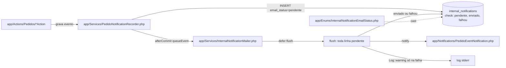
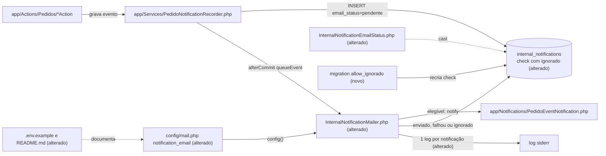

# Implementation Plan

## Request Summary
- Objective: restringir **só o e-mail** das notificações internas por duas listas configuráveis por ambiente — destinatários (`NOTIFICATION_EMAIL_RECIPIENTS`) e tipos de evento (`NOTIFICATION_EMAIL_EVENTS`) — marcando `ignorado` quem não recebe e registrando 1 log por notificação processada, sem tocar linhas de `internal_notifications`, sino, página, regra de destinatários, convite nem redefinição de senha.
- Scope in: enum `InternalNotificationEmailStatus::Ignorado` + migration recriando `internal_notifications_email_status_check`; chaves de config em `config/mail.php`; filtro, `ignorado`, log CT-04 e pausa só entre envios efetivos em `InternalNotificationMailer::flush()`; ajuste dos testes existentes que esperam e-mail de notificação; testes novos; `.env.example`; README.
- Scope out: contador diário, aviso de 80%, `MAIL_DAILY_LIMIT`, parada por cota, classificação de causa de falha; fila/worker/scheduler/retentativa; tela de configuração; qualquer mudança em Recorder, `NotificationRecipientResolver`, `NotifiableEventTypes`, Actions, template do e-mail, sino ou `/notificacoes`.
- Tier: standard
- Architecture references: `/home/leonardool/sistema_obra_mc/AGENTS.md`, `/home/leonardool/sistema_obra_mc/docs/agents/architecture.md`, `/home/leonardool/sistema_obra_mc/docs/agents/domain_rules.md`, `/home/leonardool/sistema_obra_mc/CLAUDE.md` (seções 2, 3 e 8)

Regras de camada preservadas (fonte: `docs/agents/architecture.md:48-52,133`; `CLAUDE.md` seções 2-3):
- Services concentram "notifications + mail": toda decisão de elegibilidade fica em `App\Services\InternalNotificationMailer`; nenhuma Action de `app/Actions/Pedidos/` muda.
- `PedidoNotificationRecorder::record()` continua o único INSERT em `internal_notifications`; o filtro nunca remove nem cria linhas.
- Envio continua num único `defer(..., always: true)` por requisição, sem fila, worker, scheduler nem retentativa (opção B travada).
- Domain (`NotifiableEventTypes`) segue a única classificação de notificável; o Mailer compara strings de `event_type_slug` e **não** referencia `EventTypeSlug` nem declara `isNotifiable`/`classification`/`notifiableEventTypes` (`NotifiableEventTypesDefinitionTest:47-63`).
- Normalização de e-mail só por `App\Support\EmailNormalizer::normalize` (`EmailNormalizationGuardTest`).
- Config lida via `config()`; `env()` só em `config/` (sobrevive ao `config:cache` do build Railpack).

## AS IS — Componentes impactados



Hoje toda linha `pendente` vira um envio (`InternalNotificationMailer.php:61-90`); o estado final é só `enviado` ou `falhou`, a pausa de 600 ms sob `resend` vale entre quaisquer duas linhas, e só a falha gera log (`:114-120`).

## TO BE — Componentes propostos



T01 produz o enum alterado e a migration nova (check com 4 valores); T02 altera `config/mail.php` e `InternalNotificationMailer` (filtro, `ignorado`, log CT-04, pausa só entre envios efetivos); T03 documenta as variáveis em `.env.example` e `README.md`.

## Tasks

### T01 — Estado `ignorado`: enum + migration da check
- **Files**: `app/Enums/InternalNotificationEmailStatus.php`; `database/migrations/<timestamp>_allow_ignorado_in_internal_notifications_email_status.php` (novo, via `php artisan make:migration allow_ignorado_in_internal_notifications_email_status --no-interaction`); `tests/Feature/Migrations/InternalNotificationsTableTest.php`; `tests/Unit/Models/InternalNotificationImmutabilityTest.php`
- **Change**: adicionar `case Ignorado = 'ignorado';` ao enum (docblock cita `ignorado` = e-mail não elegível). Migration: `up()` = `alter table internal_notifications drop constraint internal_notifications_email_status_check` + `add constraint ... check (email_status in ('pendente','enviado','falhou','ignorado'))` numa transação; `down()` aborta com `RuntimeException` em PT-BR **antes de escrever** se `exists (select 1 from internal_notifications where email_status = 'ignorado')`, senão recria a check com os 3 valores. Nenhuma mudança de comportamento do Mailer nesta task (suíte continua verde).
- **Covers**: RF-03 (parte banco), CT-03
- **Tests**: `InternalNotificationsTableTest` — `ignorado` é aceito; valor fora dos 4 (`lido`) continua rejeitado por `internal_notifications_email_status_check`; `down()` com linha `ignorado` lança e deixa a check com 4 valores; `down()` sem linha `ignorado` restaura 3 valores. `InternalNotificationImmutabilityTest` — `email_status = Ignorado` + `email_status_at` é atualizável (coluna em `MUTABLE_COLUMNS`).
- **Risk**: Low — migration só de constraint; `down()` guardado contra perda.
- **Dependencies**: none

### T02 — Filtro de destinatários e tipos, `ignorado`, log por notificação no Mailer
- **Files**: `config/mail.php`; `app/Services/InternalNotificationMailer.php`; `tests/Pest.php` (helper); `tests/Feature/Notifications/InternalNotificationMailerTest.php`; `tests/Feature/Notifications/PedidoNotificationRecorderTest.php`; `tests/Feature/Notifications/NotificationGenerationTest.php`; `tests/Feature/Security/Adversarial/InternalNotificationMailFailureTest.php`; `tests/Feature/Performance/QueryCountTest.php` (só se o caminho de flush for medido)
- **Change**:
  1. `config/mail.php` ganha `'notification_email' => ['recipients' => <lista>, 'events' => <lista>]`, cada lista = `array_values(array_filter(array_map('trim', explode(',', (string) env(...)))))`; `recipients` default `''`; `events` default `'criacao_pedido,observacao,cancelamento,entrega'` (ausente → padrão; definida vazia → lista vazia). Sem closures (compatível com `config:cache`).
  2. `InternalNotificationMailer::flush()`: no início, montar uma vez o conjunto de destinatários normalizados por `EmailNormalizer::normalize` (descartando vazios) e o conjunto de slugs; por notificação, método privado `shouldEmail(InternalNotification): bool` = e-mail normalizado do `recipient` (já eager-loaded, zero consulta) no conjunto **e** `event_type_slug` no conjunto. Não elegível → `update(['email_status' => Ignorado, 'email_status_at' => now()])` sem chamar `PedidoDetailRoute::nameFor` nem o transporte. Elegível → caminho atual (`falhou` por papel sem rota, `falhou` por exceção, `enviado`).
  3. `Sleep::usleep(SEND_INTERVAL_MS * 1000)` sob `resend` só antes de um envio efetivo quando já houve envio efetivo anterior (contador de envios; `ignorado` não pausa).
  4. Substituir `logFailure` por um log por notificação com contexto exato CT-04: `internal_notification_id`, `pedido_event_id`, `event_type_slug`, `recipient_id`, `result` (+ `exception_class` ou `reason = papel_sem_rota_de_detalhe` só em `falhou`); `Log::info` para `enviado`/`ignorado`, `Log::warning` para `falhou`, mensagem fixa PT-BR. Nunca e-mail, conteúdo, código do pedido ou mensagem de exceção. Atualizar o docblock da classe.
  5. Proibido: referenciar `EventTypeSlug` no Mailer; nomes `isNotifiable`/`classification`/`notifiableEventTypes`; `mb_strtolower(trim())` próprio; `env()` fora de `config/`; tocar Recorder, Resolver, Actions.
  6. **Manter a suíte verde nesta task**: helper em `tests/Pest.php`, ex. `allowNotificationEmailsFor(User ...$users): void`, que faz `config(['mail.notification_email.recipients' => <e-mails>, 'mail.notification_email.events' => <os 10 slugs de EventTypeSlug>])`; chamá-lo (só setup, nunca mudando asserções) nos testes que hoje esperam e-mail de notificação: `InternalNotificationMailerTest` (envio, já-enviado, falha A/B, sleep), `PedidoNotificationRecorderTest` (end-to-end 3 e 2 mensagens), `NotificationGenerationTest` (5 destinatários, chamado depois de criar os `gestao` extras), `InternalNotificationMailFailureTest` (A e B). Única asserção alterada, exigida pela SPEC: o contexto exato do log em `InternalNotificationMailerTest` ("the failure log carries ids…") passa a ser o CT-04 e o `toHaveCount(1)` passa a filtrar `warning`.
- **Covers**: RF-01, RF-02, RF-03, RF-04, RF-05, CT-01, CT-02, CT-04, RNF-01, RNF-02, RNF-03, RNF-04, RNF-06
- **Tests**: novos em `InternalNotificationMailerTest`: (a) recipients `" A@X.com , ,b@y.com"` → `a@x.com` recebe 1, `c@z.com` 0 e fica `ignorado` com `email_status_at`; (b) recipients vazio/só vírgulas → 0 e-mails, todas `ignorado`; (c) events padrão (config com o valor default) → os 4 tipos enviam, os outros 6 viram `ignorado`; (d) events `['observacao']` → só observação; events vazio → nada; slug inexistente na lista → sem erro e sem envio; (e) `flush` com N notificações → exatamente N logs, `result` = `email_status` final, chaves exatas CT-04, sem PII; (f) `Sleep::fake` sob resend: 1 envio + 9 `ignorado` → `assertNeverSlept`; (g) papel sem rota elegível → `falhou` com `reason`. Teste de parsing de `config/mail.php` (putenv + `require config_path('mail.php')`): ausente → padrão de 4 eventos e recipients vazio; definida vazia → `[]`. Teste de `entrega` por `UpdatePedidoStatusAction` e por `MarkPedidoEntregueByObraAction` com padrão → 1 e-mail ao destinatário permitido. RF-05: `FirstAccessInviteTest`/`PasswordResetTest`/`InternalNotificationsIsolationTest`/`NotificacoesIndexTest`/`NotifiableEventTypesDefinitionTest`/`PedidoNotificationSinglePointTest`/`EmailNormalizationGuardTest`/`QueryCountTest` verdes sem mudança de asserção. Rodar `php artisan test --compact --testsuite=Feature tests/Feature/Notifications tests/Feature/Security/Adversarial tests/Feature/Compliance tests/Feature/Performance tests/Feature/Auth` e `vendor/bin/pint --dirty --format agent`.
- **Risk**: Medium — muda o padrão de produção para "ninguém recebe e-mail de notificação" até `NOTIFICATION_EMAIL_RECIPIENTS` ser definida no Railway; testes que dependem de e-mail precisam do helper.
- **Dependencies**: T01 (gravar `ignorado` exige a check nova)

### T03 — Documentar as variáveis em `.env.example` e README
- **Files**: `.env.example`; `README.md`; `tests/Feature/Compliance/EnvExampleTest.php`
- **Change**: `.env.example`, próximo ao bloco `MAIL_*`: `NOTIFICATION_EMAIL_RECIPIENTS=` (vazio) e `NOTIFICATION_EMAIL_EVENTS=criacao_pedido,observacao,cancelamento,entrega`, com comentário curto (lista separada por vírgula; não são segredo). README: em "Variáveis de e-mail transacional" (≈ linha 372) e em "Procedimento de deploy", tabela/linhas descrevendo CT-01/CT-02, semântica de vazio/ausente, estado `ignorado`, o log por notificação e o aviso de que precisam existir no Railway **antes do build** (o `config:cache` do Railpack as congela) — sem valores reais de e-mail. Não remover as strings exigidas por `NoCommittedSecretsTest`/`EnvExampleTest`.
- **Covers**: RNF-05, CT-01, CT-02
- **Tests**: `EnvExampleTest` — novo caso: `.env.example` declara `NOTIFICATION_EMAIL_RECIPIENTS=` vazio e `NOTIFICATION_EMAIL_EVENTS=criacao_pedido,observacao,cancelamento,entrega`; README cita as duas variáveis e "antes do build". `NoCommittedSecretsTest` e `EnvExampleTest` verdes.
- **Risk**: Low — só documentação/config de exemplo.
- **Dependencies**: none (nomes e padrão fixados pela SPEC CT-01/CT-02); parallel-safe com T02 (arquivos disjuntos).

## Execution Phases
| Phase | Tasks | Parallel-safe? |
|-------|-------|----------------|
| 1 — Estado `ignorado` no esquema | T01 | n/a (task única) |
| 2 — Filtro do e-mail e documentação | T02, T03 | Sim — arquivos disjuntos; ambas dependem só da Phase 1 |

Cada fase termina com a suíte verde: T01 não muda comportamento; T02 ajusta, na mesma task, todo teste que esperava e-mail de notificação.

## Risks
| Risk | Blast radius | Mitigation | Rollback |
|------|-------------|------------|----------|
| Variáveis ausentes no Railway antes do build: `config:cache` congela recipients vazio → nenhum e-mail de notificação sai | E-mails de notificação interna em produção (notificação interna, convite e redefinição não afetados) | Definir `NOTIFICATION_EMAIL_RECIPIENTS` (e, se desejado, `NOTIFICATION_EMAIL_EVENTS`) em Railway → Variables **antes** do push; README registra isso | Ajustar a variável e redeployar (rebuild) |
| `down()` da migration com linhas `ignorado` | Rollback de esquema | `down()` aborta sem escrever se houver `ignorado` | Converter as linhas antes (ver "Procedimento de rollback") e só então rodar o `down()` |
| Revert só do código (sem `migrate:rollback`) deixa linhas `ignorado` — **não é inofensivo** | `InternalNotification` faz cast de `email_status` para `InternalNotificationEmailStatus` (`app/Models/InternalNotification.php:59`); o enum antigo não tem `ignorado`, então hidratar qualquer linha `ignorado` lança `ValueError` → **HTTP 500 no sino (`Notificacoes\Bell`, em todo layout autenticado) e em `/notificacoes`** | Nunca reverter o código com linhas `ignorado` no banco; seguir o "Procedimento de rollback" | Converter as linhas **antes** de reverter o código (ver abaixo) |

### Procedimento de rollback

Ordem obrigatória — converter os dados **antes** de reverter o código:

1. Converter as linhas `ignorado` para um valor que o enum antigo conhece:
   ```sql
   UPDATE internal_notifications SET email_status = 'falhou' WHERE email_status = 'ignorado';
   ```
2. Reverter o código (revert do commit + deploy).
3. Opcional: `php artisan migrate:rollback` da migration desta feature — o `down()` agora passa, porque não restam linhas `ignorado`.

Sem o passo 1, o sino e `/notificacoes` respondem 500 para todo usuário que tenha alguma notificação `ignorado` visível. Efeito colateral aceito: as linhas convertidas passam a constar como `falhou`, embora nenhum envio tenha sido tentado.

## Open Questions
- Nenhuma bloqueante. Nota: o padrão de produção passa a ser "nenhum destinatário" (CT-01); o desenvolvedor deve decidir a lista antes do deploy.

## Assumptions
- `env('X', default)` devolve string vazia para `X=` definida vazia, permitindo distinguir ausente (default) de vazia — comportamento do `Env` do Laravel [UNVERIFIED no Laravel 13; o teste de parsing em T02 confirma].
- `tests/Pest.php` pode referenciar `EventTypeSlug` (a restrição de RNF-04 vale só para `app/`), verificado em `NotifiableEventTypesDefinitionTest:54-63` (escaneia `app/`).
- `QueryCountTest` mede o caminho do sino/página (`InternalNotificationMailer` não aparece nele); o filtro não acrescenta consulta porque `recipient` já é eager-loaded em `flush()` (`InternalNotificationMailer.php:74`).
- `PedidoEventNotificationMailTest` envia a notificação diretamente (sem `flush`), logo não é afetado pelo filtro.
