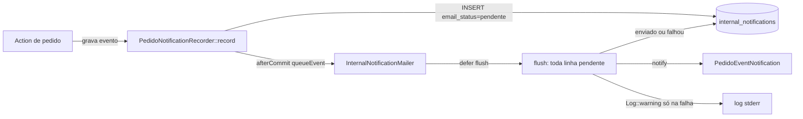
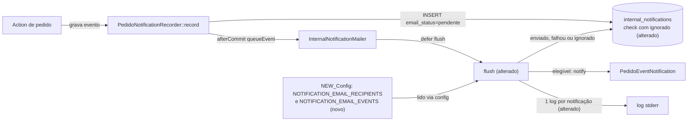

# SPEC: email-notificacoes-enxutas

## Metadata
- Source: developer description via /plan (`.handoff/input.md`, escopo mínimo confirmado)
- Service: sistema_obra_mc (Laravel 13 + Livewire 4, monolito)
- Tier: standard
- Version: 2.0 (substitui integralmente a v1.1; contador diário, aviso de 80%, `MAIL_DAILY_LIMIT`, parada por cota e classificação de causa de falha foram removidos do escopo)
- Architecture references: `AGENTS.md`, `docs/agents/architecture.md`, `docs/agents/domain_rules.md`, `CLAUDE.md` (seções 2 e 3)

## Context

Hoje toda notificação interna de pedido gera também um e-mail: `InternalNotificationMailer::flush()` carrega as linhas `pendente` dos eventos da requisição e envia `PedidoEventNotification` a cada destinatário, gravando `enviado`/`falhou` (verified at `app/Services/InternalNotificationMailer.php:61-90`). São 10 tipos notificáveis (`app/Domain/Pedidos/NotifiableEventTypes.php:24-38`) e o resolvedor inclui todos os `gestao` ativos, então o volume de e-mail cresce com qualquer mutação. O desenvolvedor quer restringir **só o e-mail**, por duas listas configuráveis por ambiente (destinatários e tipos de evento), sem alterar a notificação interna (linhas, sino, página, regra de destinatários).

Regras de arquitetura que esta SPEC respeita:
- `docs/agents/architecture.md:52`: Services concentram o transversal "notifications + mail"; Actions não ganham lógica de e-mail. A mudança fica no Service de envio, nunca nas Actions de `app/Actions/Pedidos/`.
- `docs/agents/domain_rules.md:133` e `CLAUDE.md` seção 2: envio depois da resposta via um único `defer(..., always: true)` por requisição, `SEND_INTERVAL_MS = 600` sob `resend`, sem retentativa, sem fila/worker/scheduler (decisão travada, opção B).
- `CLAUDE.md` seção 3: `PedidoNotificationRecorder::record()` é o único ponto que insere em `internal_notifications` (`tests/Feature/Compliance/PedidoNotificationSinglePointTest.php`).
- `tests/Feature/Compliance/NotifiableEventTypesDefinitionTest.php:54-63`: nenhum arquivo de `app/` cujo nome contenha `notif` (inclui `InternalNotificationMailer.php`) pode referenciar `EventTypeSlug`; e nenhum arquivo fora de `NotifiableEventTypes` pode declarar função `isNotifiable`/`classification`/`notifiableEventTypes` (`:47-52`). O filtro de tipos de e-mail, portanto, compara strings de slug (coluna `internal_notifications.event_type_slug`) e não é uma "classificação de notificável".
- `config:cache` roda no build do Railpack (`CLAUDE.md` seção 2): a configuração precisa ser lida via `config/*.php`, e as variáveis precisam existir no Railway antes do build.

## AS IS — Estado atual

Hoje toda linha `pendente` de `internal_notifications` vira um envio de e-mail; o estado final é só `enviado` ou `falhou`, e o log existe apenas para falhas.

## TO BE — Estado proposto

O `flush` passa a decidir elegibilidade por destinatário (RF-01, CT-01) e por tipo de evento (RF-02, CT-02), marca `ignorado` quem não recebe (RF-03, CT-03) e registra um log por notificação processada (RF-04, CT-04). Recorder, resolvedor de destinatários e as linhas de `internal_notifications` não mudam (RF-05).

## Scope
- **In**: filtro de destinatários e de tipos de evento do e-mail de notificação interna; novo valor `ignorado` em `email_status` (enum + migration recriando a check); log por notificação processada; `.env.example`; README; testes Pest novos e ajustados.
- **Out**: contador diário, aviso de limite/80%, `MAIL_DAILY_LIMIT`, parada por cota, classificação de causa de falha (`daily_quota`/`rate_limit`) e enum de causas; qualquer mudança em convite de primeiro acesso, redefinição de senha, regra de destinatários, sino, página `/notificacoes` ou conteúdo/template do e-mail; fila, worker, scheduler, retentativa; tela de configuração das listas.

## RIGID (Non-Negotiable)

### Functional Requirements

- RF-01 [Conditional]: IF uma notificação interna `pendente` é processada pelo envio diferido E o e-mail do destinatário, normalizado por `App\Support\EmailNormalizer::normalize` (verified at `app/Support/EmailNormalizer.php:27`), não é igual a nenhum item normalizado e não vazio de `NOTIFICATION_EMAIL_RECIPIENTS`, THEN o sistema SHALL NOT enviar o e-mail dessa notificação.
  - AC: com `NOTIFICATION_EMAIL_RECIPIENTS=" A@X.com , ,b@y.com"`, um destinatário `a@x.com` recebe 1 e-mail e um destinatário `c@z.com` recebe 0 e-mails para o mesmo evento elegível.
  - AC: com a variável ausente, vazia ou só com vírgulas/espaços, 0 e-mails são enviados para qualquer destinatário.
  - AC: o conjunto de destinatários das linhas de `internal_notifications` é idêntico ao de antes da mudança (o filtro não remove nem adiciona linhas).

- RF-02 [Conditional]: IF o `event_type_slug` da notificação não está em `NOTIFICATION_EMAIL_EVENTS` (slugs separados por vírgula, com trim, itens vazios descartados; padrão quando a variável está ausente: `criacao_pedido,observacao,cancelamento,entrega`), THEN o sistema SHALL NOT enviar o e-mail dessa notificação.
  - AC: com a variável ausente e destinatário elegível, os eventos `criacao_pedido`, `observacao`, `cancelamento` e `entrega` geram 1 e-mail cada; `mudanca_status`, `finalizacao`, `alteracao_responsavel`, `alteracao_prioridade`, `alteracao_previsao` e `romaneio_anexado` geram 0.
  - AC: com `NOTIFICATION_EMAIL_EVENTS=observacao`, só `observacao` gera e-mail.
  - AC: com a variável definida mas vazia (ou só vírgulas/espaços), nenhum tipo gera e-mail (mesma semântica de lista vazia do RF-01).
  - AC: marcar Entregue — por Suprimentos/Gestão (`UpdatePedidoStatusAction`) ou pela Obra (`MarkPedidoEntregueByObraAction`) — gera evento `entrega` e, com o padrão, envia e-mail ao destinatário elegível, sem regra adicional por status ou papel do ator.
  - AC: um slug na variável que não corresponde a nenhum tipo de evento não causa erro e não habilita nenhum envio.

- RF-03 [Event-Driven]: WHEN o envio diferido processa uma notificação `pendente` que não satisfaz RF-01 e RF-02 ao mesmo tempo, the system SHALL gravar `email_status = ignorado` e `email_status_at` = instante do processamento, sem chamar o transporte de e-mail.
  - AC: após o `flush`, a linha fica com `email_status = ignorado`, `email_status_at` não nulo e nenhuma mensagem é registrada no mailer fake/`array`.
  - AC: uma linha que satisfaz RF-01 e RF-02 continua terminando em `enviado` ou `falhou` exatamente como hoje (inclusive o caso de papel sem rota de detalhe → `falhou`).
  - AC: o banco aceita `ignorado` em `internal_notifications.email_status` e continua rejeitando qualquer valor fora de `pendente`, `enviado`, `falhou`, `ignorado` pela check `internal_notifications_email_status_check`.

- RF-04 [Event-Driven]: WHEN o envio diferido termina o processamento de uma notificação, the system SHALL registrar exatamente 1 entrada de log com o contexto definido em CT-04.
  - AC: um `flush` com N notificações `pendente` produz exatamente N entradas de log, cada uma com `result` ∈ {`enviado`, `falhou`, `ignorado`} igual ao `email_status` final da linha.
  - AC: nenhuma entrada contém endereço de e-mail, texto de observação, descrição do pedido, código do pedido ou mensagem de exceção; na falha por exceção, só `exception_class`; na falha por papel sem rota de detalhe, `reason = papel_sem_rota_de_detalhe` (como hoje, `app/Services/InternalNotificationMailer.php:116-120`).

- RF-05 [Unwanted]: IF qualquer combinação das duas variáveis estiver configurada, THEN o sistema SHALL NOT alterar o convite de primeiro acesso (`FirstAccessInvite`), a redefinição de senha (`ResetPasswordPtBr`), a quantidade e o conteúdo das linhas de `internal_notifications`, o sino, a página `/notificacoes` nem `NotificationRecipientResolver`.
  - AC: os testes existentes de convite, redefinição, `NotificationGenerationTest`, `PedidoNotificationRecorderTest`, `InternalNotificationsIsolationTest` e `NotificacoesIndexTest` passam sem alteração de asserções.
  - AC: com `NOTIFICATION_EMAIL_RECIPIENTS` vazio, convite e redefinição continuam enviando 1 e-mail cada.

### Contracts

- CT-01: variável `NOTIFICATION_EMAIL_RECIPIENTS` — string, e-mails separados por vírgula; ausente/vazia = lista vazia (ninguém recebe e-mail de notificação interna). Não é segredo; precisa existir no Railway antes do build.
- CT-02: variável `NOTIFICATION_EMAIL_EVENTS` — string, slugs de `event_types` separados por vírgula; ausente = `criacao_pedido,observacao,cancelamento,entrega`; definida e vazia = lista vazia. Não é segredo; precisa existir no Railway antes do build.
- CT-03: `internal_notifications.email_status` ∈ {`pendente`, `enviado`, `falhou`, `ignorado`} — enum `App\Enums\InternalNotificationEmailStatus` (verified at `app/Enums/InternalNotificationEmailStatus.php:10-15`) ganha `Ignorado = 'ignorado'`; check `internal_notifications_email_status_check` (verified at `database/migrations/2026_10_01_184752_create_internal_notifications_table.php:43`) recriada por migration nova com os 4 valores; `down()` restaura os 3 valores e recusa (abortando sem escrever) se existir linha `ignorado`.
- CT-04: entrada de log por notificação processada, contexto com exatamente as chaves `internal_notification_id`, `pedido_event_id`, `event_type_slug`, `recipient_id`, `result` (+ `exception_class` ou `reason` apenas quando `result = falhou`).

### Non-Functional Requirements

- RNF-01: O envio continua num único `defer(..., always: true)` por requisição, sem fila, worker, scheduler nem retentativa; `PedidoNotificationRecorder::record()` continua o único ponto que insere em `internal_notifications` (`PedidoNotificationSinglePointTest` verde).
- RNF-02: A pausa `SEND_INTERVAL_MS = 600` sob `MAIL_MAILER=resend` ocorre só entre dois envios efetivos ao transporte; notificações `ignorado` não geram pausa (um `flush` com 1 envio e 9 ignoradas não chama `Sleep`).
- RNF-03: Decidir RF-01/RF-02 não acrescenta consultas por notificação: o delta de consultas do `flush` é constante em relação ao número de notificações (a contagem de `tests/Feature/Performance/QueryCountTest.php` para o caminho de notificação não aumenta).
- RNF-04: `tests/Feature/Compliance/NotifiableEventTypesDefinitionTest.php` continua verde sem alteração: nenhum arquivo novo ou alterado com `notif` no nome referencia `EventTypeSlug`, e nenhum declara `isNotifiable`/`classification`/`notifiableEventTypes`.
- RNF-05: As duas variáveis são lidas pela aplicação só através de `config()` (nunca `env()` fora de `config/`), para sobreviver a `config:cache`; ambas aparecem no `.env.example` (CT-01 vazio, CT-02 com o padrão) e no README, que registra que precisam existir no Railway antes do build. `NoCommittedSecretsTest` e `EnvExampleTest` continuam verdes.
- RNF-06: Sem dependência nova; código compatível com PHP 8.4; `vendor/bin/pint --dirty --format agent` sem pendências.

## FLEXIBLE (Implementation Suggestions)
- Chaves sugeridas em `config/mail.php` (ou `config/services.php`): `mail.notification_email.recipients` e `mail.notification_email.events`, cada uma parseando a string em lista (`explode` + trim + `array_filter`); a normalização de e-mail fica no Service, via `EmailNormalizer` (não reimplementar `mb_strtolower(trim())`, que reprova `EmailNormalizationGuardTest`).
- Em `InternalNotificationMailer::flush()`: calcular os dois conjuntos uma vez no início; por notificação, decidir `ignorado` antes de `PedidoDetailRoute::nameFor`; contar envios efetivos para aplicar o `Sleep`. Nome de método sugerido: `shouldEmail(InternalNotification): bool` (evitar os nomes proibidos de RNF-04).
- Log: `Log::info` para `enviado`/`ignorado`, `Log::warning` para `falhou`, mensagem fixa em PT-BR.
- Migration: `php artisan make:migration allow_ignorado_in_internal_notifications_email_status --no-interaction`; `drop constraint` + `add constraint` com os 4 valores.
- Testes: estender `tests/Feature/Notifications/InternalNotificationMailerTest.php` (filtros, `ignorado`, log, sleep), `tests/Feature/Migrations/InternalNotificationsTableTest.php` (check com `ignorado`), `tests/Unit/Models/InternalNotificationImmutabilityTest.php` (`ignorado` em coluna mutável), `tests/Feature/Security/Adversarial/InternalNotificationMailFailureTest.php` (contexto do log). Nos testes que hoje esperam e-mail, definir `config()` com o destinatário e o tipo, já que o padrão de destinatários passa a ser vazio.
- Plano em 2 fases / 3 tarefas: (1) enum + migration + testes de esquema; (2) filtro + `ignorado` + log no Mailer com testes; (3) `.env.example` + README + ajuste dos testes existentes.

## Acceptance Criteria Summary
| ID | Criterion | Testable? |
|----|-----------|-----------|
| RF-01 | E-mail só para destinatário cujo e-mail normalizado está em `NOTIFICATION_EMAIL_RECIPIENTS`; lista vazia/ausente = nenhum | Sim (Pest, mailer fake) |
| RF-02 | E-mail só para tipos em `NOTIFICATION_EMAIL_EVENTS`; padrão de 4 tipos; vazio = nenhum; `entrega` sempre pelo slug | Sim |
| RF-03 | Não elegível → `ignorado` + `email_status_at`, sem transporte; check aceita 4 valores | Sim |
| RF-04 | Exatamente 1 log por notificação com CT-04, sem PII | Sim (`Log::spy`/fake) |
| RF-05 | Convite, redefinição e notificação interna inalterados | Sim (suíte existente) |
| RNF-01 | `defer()` único; ponto único de INSERT | Sim (compliance) |
| RNF-02 | Pausa só entre envios efetivos | Sim (`Sleep::fake`) |
| RNF-03 | Sem consulta extra por notificação | Sim (`QueryCountTest`) |
| RNF-04 | `NotifiableEventTypesDefinitionTest` verde | Sim |
| RNF-05 | Leitura via `config()`; `.env.example` e README atualizados | Sim (compliance) |
| RNF-06 | Sem dependência nova; Pint limpo | Sim |
