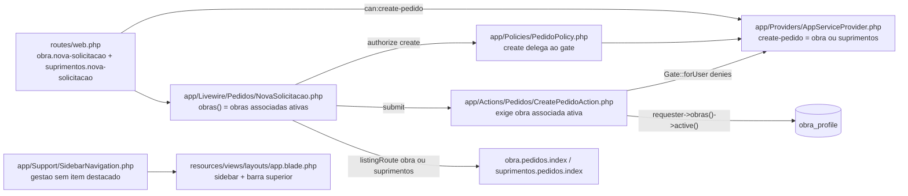
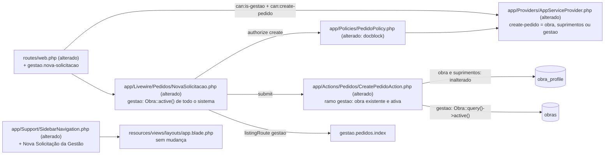

# Implementation Plan

## Request Summary
- Objective: permitir que o perfil `gestao` crie solicitações pela tela existente `App\Livewire\Pedidos\NovaSolicitacao`, numa rota própria `gestao.nova-solicitacao`, escolhendo qualquer obra ativa do sistema (sem associação) ou "Outra", sem ganhar nenhuma outra escrita sobre pedidos (SPEC `gestao-nova-solicitacao` v1.1).
- Scope in: gate `create-pedido` (+ `gestao`), mensagem de recusa da Action, ramo de validação de obra da Gestão em `CreatePedidoAction` (RF-06, RF-07, RF-10), rota `GET /gestao/nova-solicitacao`, item destacado "+ Nova Solicitação" da Gestão (sidebar + barra superior), select e `listingRoute()` do componente, ajuste dos testes que fixam "Gestão sem criação", testes novos, documentação.
- Scope out: qualquer outra escrita da Gestão (RF-11), associação de obras a `gestao` (RF-12), `PedidoPolicy::view`, `Pedido::scopeVisibleTo`, `/home`, Dashboard, Kanban, `Gestao\PedidoDetalhe`; migration, dependência ou componente novo (RNF-03); mudança nas regras de `obra`/`suprimentos` (RF-09).
- Tier: standard
- Architecture references: `CLAUDE.md` (§3 "Criação do pedido", §4 Navegação/Gestão, §5 Autorização — camadas 3 a 6, §8 "Sidebar: um catálogo só" e fluxo de trabalho), `AGENTS.md` (Laravel Boost: Pest, Pint, `php artisan make:*`, sem dependências novas), `docs/agents/architecture.md` (tabela de camadas: rotas com `can:` por grupo, linha 53), `docs/agents/domain_rules.md` (regra atual do gate na linha 61), `docs/agents/api_contracts.md` (tabela de rotas, linhas 29/36/90), `docs/agents/coding_guidelines.md`. `.ai/rules` não existe. Cadeia init (auxiliar, descreve a stack antiga): `.spec/init/{project-description,user-stories,database-schema,project-phases}.md` — não altera a ordem aqui.

Regras de arquitetura preservadas em todas as tarefas:
- **Autorização em camadas** (CLAUDE.md §5): middleware `can:` na rota → `authorize()` em `mount()` → `PedidoPolicy::create` (delegação pura ao gate) → guarda na Action. A Gestão ganha exatamente uma habilidade (`create-pedido`); nenhuma outra policy/guard muda.
- **Sidebar não é autorização** (CLAUDE.md §5, §8): o item novo lista exatamente as `can:` da rota de destino (`['is-gestao', 'create-pedido']`); entra no catálogo `App\Support\SidebarNavigation`, nunca no Blade.
- **Validação antes da transação e antes do `nextval`** (docblock de `app/Actions/Pedidos/CreatePedidoAction.php:36-41`): nenhuma recusa consome código nem deixa arquivo no disco `pedido_anexos`.
- **"Obra ativa" num lugar só**: `Obra::active()` / `ObraStatus::isActive()`. O ramo da Gestão e o select usam o escopo `->active()`, nunca `ObraStatus` nem `where('status', …)` — `tests/Feature/Compliance/ObraActivityDefinitionTest.php:194-201` exige `->active()` literal em `NovaSolicitacao.php` e `CreatePedidoAction.php`.
- **`visibleTo` e `PedidoPolicy::view` intocados**: um pedido "Outra" criado pela Gestão fica visível a Suprimentos/Gestão e invisível a qualquer `obra` (nenhuma é a solicitante).
- Código compatível com PHP 8.4; `vendor/bin/pint --dirty --format agent` depois de cada mudança PHP; testes Pest atualizados, nunca apagados.

## AS IS — Componentes impactados

Hoje a Gestão é barrada no gate `create-pedido`, não tem rota nem item de menu, e a Action só aceita obras presentes em `obra_profile` do solicitante — caminho que a Gestão, sem associações por regra, nunca satisfaz.

## TO BE — Componentes propostos

T01 altera o gate e o docblock da policy; T02 cria o ramo da Gestão e a nova mensagem em `CreatePedidoAction`; T03 adiciona a rota `gestao.nova-solicitacao`; T04 altera `obras()` e `listingRoute()` do componente; T05 acrescenta o item destacado ao catálogo da sidebar (o layout já renderiza o item destacado na sidebar e na barra superior, `resources/views/layouts/app.blade.php:31-42,96-102`, e não muda).

## Tasks

### T01 — Gate `create-pedido` estendido à Gestão e docblock da policy
- **Files**: `app/Providers/AppServiceProvider.php`, `app/Policies/PedidoPolicy.php` (só docblock), `tests/Feature/Authorization/RoleGatesTest.php`, `tests/Feature/Authorization/PedidoPolicyTest.php`
- **Change**:
  - `AppServiceProvider::boot` (linha 50): acrescentar `RoleSlug::Gestao->value` ao `in_array` estrito de `create-pedido`. Atualizar o docblock (linhas ~39-41): "`create-pedido` concede a Nova Solicitação a Obra, Suprimentos e Gestão; as checagens de obra (associação para Obra/Suprimentos, obra existente e ativa para Gestão) vivem em `CreatePedidoAction`."
  - `PedidoPolicy`: nenhuma mudança de código (`create` continua delegando ao gate). Docblock (linhas 10-20): `create` = Obra, Suprimentos e Gestão; manter "`gestao` nunca escreve **sobre um pedido existente**" (RF-11).
  - `RoleGatesTest.php:68-78`: dataset `create-pedido gate` → `'gestao' => ['gestao', true]` e nova linha `'papel desconhecido'` (usuário de `User::factory()->create()`, cujo `Role::factory()` gera slug fora dos três) → `false`; renomear o teste para "create-pedido is granted to obra, suprimentos and gestao only" e atualizar o docblock. Os testes de rota das linhas 105-129 (Gestão 403 em `/obra/…` e `/suprimentos/nova-solicitacao`) ficam **intactos**.
  - `PedidoPolicyTest.php:65-81`: dataset do teste "can create" passa a `['obra', 'suprimentos', 'gestao']`; o teste da linha 76 vira "a user without a recognised papel is denied creating a pedido" (só o usuário sem papel reconhecido; a asserção sobre `gestao` migra para o dataset positivo). Docblock atualizado.
- **Covers**: RF-01, RF-02 (AC de `PedidoPolicy::create`), CT-02
- **Tests**: `tests/Feature/Authorization/RoleGatesTest.php` — gate por papel (4 linhas); `tests/Feature/Authorization/PedidoPolicyTest.php` — `create` true para 3 papéis, false para papel desconhecido.
- **Risk**: High — amplia autorização. Entre T01 e T02/T04 a suíte tem vermelhos previsíveis (testes que fixam "Gestão negada"); ver regra de verde por fase em Execution Phases.
- **Dependencies**: none

### T02 — Ramo da Gestão em `CreatePedidoAction` + nova mensagem de recusa
- **Files**: `app/Actions/Pedidos/CreatePedidoAction.php`, `tests/Feature/Actions/CreatePedidoActionTest.php`, `tests/Feature/Actions/CreatePedidoActionGestaoTest.php` (novo, `php artisan make:test --pest Actions/CreatePedidoActionGestaoTest --no-interaction`)
- **Change** (CT-03: assinatura, chaves de entrada e chave de erro `obra_id` inalteradas):
  - Linha 92: mensagem exata "Apenas os perfis Obra, Suprimentos e Gestão podem criar solicitações." (o literal antigo some de `app/`).
  - `noActiveObraMessage()`: novo ramo `RoleSlug::Gestao` → "Nenhuma obra ativa cadastrada. Cadastre ou reative uma obra em Obras."; os textos de Suprimentos e de Obra ficam idênticos. Como a view já usa esse método para o estado vazio, o RF-10 de UI não exige mudança de Blade.
  - Em `execute()`, logo depois de `validate()`, decidir o ramo **pelo papel do solicitante** (`$requester->role?->slug === RoleSlug::Gestao->value`), nunca por dado de entrada:
    - Gestão: `Obra::query()->active()->doesntExist()` → 422 `obra_id` com `noActiveObraMessage()` (também para "Outra"); com id → novo `private function ensureObraAcceptsSolicitacaoForGestao(int $obraId): void`: `Obra::query()->whereKey($obraId)->doesntExist()` → 422 `obra_id` "A obra informada não foi encontrada."; `Obra::query()->active()->whereKey($obraId)->doesntExist()` → 422 `obra_id` "A obra informada está inativa e não recebe novas solicitações.".
    - Obra/Suprimentos: exatamente o código atual (linhas 97-108) e `ensureObraAcceptsSolicitacao()` sem mudança (RF-09).
  - Tudo continua antes da inspeção de anexos, da transação e do `nextval`; o resto (código, anexos, evento `criacao_pedido` com snapshot `obraLabel()`, `obra_reference` só em "Outra") é compartilhado. Nenhuma linha de `obra_profile` é criada.
  - Usar somente o escopo `->active()` (sem `ObraStatus`/`where('status')`), para manter `ObraActivityDefinitionTest` verde. Importar `App\Models\Obra`.
  - Atualizar o docblock da classe (linhas 25-59): solicitantes Obra/Suprimentos/Gestão e a lista de recusas por ramo.
  - `CreatePedidoActionTest.php:289-298`: o teste "a gestao actor is refused…" passa a usar um solicitante de papel desconhecido e a exigir a mensagem exata nova (RF-02), sem escrita e com a sequência intacta. `:210-215` (`noActiveObraMessage is papel-aware`): acrescentar a asserção do texto da Gestão.
  - `CreatePedidoActionGestaoTest.php` (novo): (a) RF-06: Gestão sem associação cria numa obra `em_andamento` → `obra_id`, `requester_id`, `obra_reference = null`, status `solicitado`, 1 evento `criacao_pedido` com o nome da obra, `obra_profile` inalterada; (b) RF-07: id inexistente e obra `concluido` → 422 `obra_id` com os textos exatos, 0 linhas em `pedidos`/`pedido_events`/`pedido_attachments`, 0 arquivos no disco `pedido_anexos` (enviar 1 anexo válido, `Storage::fake('pedido_anexos')`), sequência não avançada; (c) RF-08: "Outra" com "  Galpão X  " → `obra_reference = 'Galpão X'`, `new_value = 'Outra — Galpão X'`, contagens de `obras`/`obra_profile` inalteradas; (d) RF-10: só obras `concluido` (e banco sem obras) → "Outra" e id `concluido` recusados em `obra_id` (texto exato para "Outra"), sem escrita, arquivo nem código; depois de tornar uma obra ativa, "Outra" é criada; (e) RF-09: `suprimentos` sem associação enviando id de obra ativa não associada → 422 `obra_id` "A obra informada não está associada ao solicitante.", sem pedido; `obra` idem; (f) RNF-01: contagem de consultas em volta apenas de `execute()` para Gestão ≤ Suprimentos com 1 obra associada, entrada idêntica (com `DB::enableQueryLog()`/`DB::getQueryLog()` no próprio arquivo: `measureQueryCount` é definido em `tests/Feature/Performance/QueryCountTest.php:40` e não está carregado quando o arquivo de Actions roda sozinho).
- **Covers**: RF-02, RF-06, RF-07, RF-08 (criação), RF-09, RF-10 (Action), CT-02, CT-03, RNF-01 (Action), RNF-02
- **Tests**: `tests/Feature/Actions/CreatePedidoActionGestaoTest.php` — casos (a)–(f); `tests/Feature/Actions/CreatePedidoActionTest.php` — recusa por papel desconhecido com mensagem nova; mensagem da Gestão em `noActiveObraMessage`.
- **Risk**: High — ramo novo de validação numa Action de escrita; um erro de ordem consumiria código ou permitiria obra Concluída. Mitigado por (b), (d), (e) e pelas asserções de sequência.
- **Dependencies**: T01

### T03 — Rota `GET /gestao/nova-solicitacao` e fixação do middleware
- **Files**: `routes/web.php`, `tests/Feature/Compliance/RouteMiddlewareBaselineTest.php`, `tests/Feature/Security/Adversarial/CrossRoleTest.php`, `tests/Feature/Livewire/GestaoScreensRouteTest.php` (novo, `php artisan make:test --pest Livewire/GestaoScreensRouteTest --no-interaction`)
- **Change**:
  - Dentro do grupo `can:is-gestao` (`routes/web.php:~133`): `Route::get('/nova-solicitacao', NovaSolicitacao::class)->middleware('can:create-pedido')->name('nova-solicitacao');` (mesma forma das rotas de Obra e Suprimentos). Nenhuma outra rota muda; os grupos `obra.*`/`suprimentos.*` continuam negando a Gestão.
  - `RouteMiddlewareBaselineTest.php`: nova entrada `'gestao.nova-solicitacao' => ['web', 'auth', 'active', 'can:is-gestao', 'can:create-pedido']` (CT-01); nenhuma entrada existente alterada.
  - `CrossRoleTest.php:113-121` (G-06): a lista esperada de rotas `gestao.*` ganha `'gestao.nova-solicitacao'` na posição ordenada (depois de `gestao.kanban`); a asserção de 403 para `obra` continua valendo.
  - `GestaoScreensRouteTest.php` (novo, espelhando `ObraScreensRouteTest`/`SuprimentosScreensRouteTest`): `gestao` → 200 com o título "Nova Solicitação"; `obra` → 403; `suprimentos` → 403; visitante → redirect `login`; `gestao` inativo → redirect `login`; `gestao` continua 403 em `/obra/nova-solicitacao` e `/suprimentos/nova-solicitacao`; middleware da rota contém `auth`, `active`, `can:is-gestao`, `can:create-pedido`.
- **Covers**: RF-03, CT-01
- **Tests**: `tests/Feature/Livewire/GestaoScreensRouteTest.php` — matriz de status acima; `tests/Feature/Compliance/RouteMiddlewareBaselineTest.php` — entrada nova; `tests/Feature/Security/Adversarial/CrossRoleTest.php` — G-06 com a rota nova.
- **Risk**: Medium — superfície nova; mitigada pela linha de base de middleware e pelo G-06.
- **Dependencies**: T01

### T04 — `NovaSolicitacao`: select da Gestão e `listingRoute()`
- **Files**: `app/Livewire/Pedidos/NovaSolicitacao.php`, `tests/Feature/Livewire/NovaSolicitacaoTest.php`, `tests/Feature/Performance/QueryCountTest.php`
- **Change**:
  - `obras()`: `gestao` → `Obra::query()->active()->orderBy('name')->get()` (independe de `obra_profile`); demais papéis → `Auth::user()->obras()->active()->orderBy('name')->get()` inalterado. Manter `->active()` literal nos dois ramos (exigência de `ObraActivityDefinitionTest`).
  - `listingRoute()`: `match` sobre `Auth::user()->role?->slug` — `suprimentos` → `suprimentos.pedidos.index`, `gestao` → `gestao.pedidos.index`, qualquer outro → `obra.pedidos.index` (comportamento atual preservado para `obra`).
  - `mount()`/`submit()` sem mudança (seguem `create-pedido` e `create`). View `resources/views/livewire/pedidos/nova-solicitacao.blade.php` sem mudança: estado vazio, formulário, sucesso com código e "Data prevista" e o link `listingUrl` já existem.
  - Docblock da classe: "compartilhada por Obra, Suprimentos e Gestão"; select da Gestão = todas as obras ativas.
  - `NovaSolicitacaoTest.php:280-284` ("gestao is denied the component on mount") → papel desconhecido negado no mount; `:286-303` ("forged submit by gestao") → submit forjado por usuário de papel desconhecido, 403, sem escrita e sequência intacta; dataset de `:305-313` ganha `'gestao' => ['gestao', 'gestao.nova-solicitacao']` (com uma obra ativa no sistema, sem associação) e o nome passa a "the three Nova Solicitação routes…". O teste `:315-322` (rota de Suprimentos 403 para `obra` e `gestao`) fica intacto.
  - Novos casos em `NovaSolicitacaoTest.php`: RF-04 (obras A `em_andamento`, B `a_iniciar`, C `concluido`, nenhuma associada → select da Gestão exatamente A, B em ordem de nome + "Outra"; `suprimentos` associado só a A → A + "Outra"); RF-05 (`listingRoute()` por papel, 3 casos); UI-02 (Gestão preenche obra ativa, envia, vê `PED-XXXXXX`, "Data prevista" e link com `href` = `route('gestao.pedidos.index')`); RF-10 UI (só obras `concluido` → `GET /gestao/nova-solicitacao` mostra exatamente "Nenhuma obra ativa cadastrada. Cadastre ou reative uma obra em Obras." e nenhum `#obra_selection` nem botão de envio; após ativar uma obra, formulário aparece e "Outra" cria).
  - `QueryCountTest.php`: (i) teste dedicado RNF-01 — renderizar o select da Gestão emite **exatamente 1** consulta na tabela `obras` (filtrar o log por `from "obras"`), com 1 e com 15 obras ativas; (ii) acrescentar `gestao` ao dataset `nova solicitação requesters` do teste "1 vs 15" (para Gestão, criar as obras sem associação) — confirmar que o `match` do teste aceita o papel novo.
- **Covers**: RF-04, RF-05, RF-10 (UI), UI-02, RNF-01 (render)
- **Tests**: `tests/Feature/Livewire/NovaSolicitacaoTest.php` — casos acima; `tests/Feature/Performance/QueryCountTest.php` — 1 consulta em `obras`, contagem constante 1 vs 15.
- **Risk**: Medium — o ramo errado de `obras()` exporia todas as obras a Obra/Suprimentos (só no select; a Action recusaria). Coberto pelo caso `suprimentos` do RF-04.
- **Dependencies**: T01, T02 (o teste UI-02 submete pela Action)

### T05 — Item "+ Nova Solicitação" da Gestão no catálogo da sidebar
- **Files**: `app/Support/SidebarNavigation.php`, `tests/Feature/Authorization/SidebarNavigationCatalogueTest.php`, `tests/Feature/Livewire/SidebarNavigationTest.php`, `tests/Feature/Livewire/LayoutIdentityTest.php`
- **Change**:
  - `SidebarNavigation::catalogue()` bloco Gestão (linha 74): primeiro item `self::item('+ Nova Solicitação', 'gestao.nova-solicitacao', 'gestao.nova-solicitacao', ['is-gestao', 'create-pedido'], null, true)`. O layout já emite `data-testid="sidebar-nova-solicitacao"` (sidebar/gaveta) e `data-testid="topbar-nova-solicitacao"` (barra superior no celular) para o item destacado — sem mudança de Blade. Padrão ativo exato `gestao.nova-solicitacao` (não `gestao.pedidos.*`), então "Pedidos" não fica marcado nessa rota.
  - `SidebarNavigationCatalogueTest.php:17`: rótulos da Gestão = `['+ Nova Solicitação', 'Pedidos', 'Dashboard', 'Kanban', 'Obras', 'Associações', 'Usuários']`; `:66-78`: o teste passa a "only the three + Nova Solicitação items are highlighted, each first", iterando `obra`, `suprimentos`, `gestao`. O teste de abilities × `can:` (dataset `sidebarCatalogueItems`) cobre o item novo automaticamente.
  - `SidebarNavigationTest.php:97-106`: reescrever para "gestao sees + Nova Solicitação in the sidebar and top bar, never Visão Geral (UI-01)" — HTML contém `sidebar-nova-solicitacao` e `topbar-nova-solicitacao`, ambos com `href` para `/gestao/nova-solicitacao`, e não contém "Visão Geral". Dataset de `:155-180` ganha `'gestao nova solicitação' => ['gestao', 'gestao.nova-solicitacao', null, '+ Nova Solicitação']`. As linhas `:130-131` (Gestão 403 nas rotas de Obra/Suprimentos) ficam intactas.
  - `LayoutIdentityTest.php:50-56`: lista da Gestão passa a incluir "+ Nova Solicitação" em primeiro (o helper `primaryNavigation` coleta todos os `<a>` do `<nav>`), título do teste para "7 links"; `:177-184` ("gestao has no Nova Solicitação entry") → "gestao has the Nova Solicitação entry pointing to its own route" (link presente, `href` = `route('gestao.nova-solicitacao')`, nenhum `href` para `obra.`/`suprimentos.nova-solicitacao`).
- **Covers**: UI-01, RF-03 (visibilidade = rota)
- **Tests**: `tests/Feature/Authorization/SidebarNavigationCatalogueTest.php` — ordem e destaque; `tests/Feature/Livewire/SidebarNavigationTest.php` — test ids, `aria-current` único na rota nova, sem Visão Geral; `tests/Feature/Livewire/LayoutIdentityTest.php` — lista de links.
- **Risk**: Low — apresentação; a barreira real é a rota (T03).
- **Dependencies**: T03

### T06 — Testes adversariais: nenhuma outra escrita da Gestão e visibilidade do pedido criado por ela
- **Files**: `tests/Feature/Security/Adversarial/PedidoOperationsAuthorizationTest.php`, `tests/Feature/Authorization/BypassUiAuthorizationTest.php`, `tests/Feature/Security/Adversarial/GestaoCreatedPedidoTest.php` (novo, `php artisan make:test --pest Security/Adversarial/GestaoCreatedPedidoTest --no-interaction`)
- **Change**:
  - `PedidoOperationsAuthorizationTest.php:153`: a linha `'creation by gestao'` do dataset de Actions negadas vira `'creation by papel desconhecido'` (ator `User::factory()->create()`), mantendo o número de casos. `:156-178` ("gestao creation is denied at every layer…") → reescrever como "gestao creates only through its own route and never through another papel's route": 403 em `obra.nova-solicitacao` e `suprimentos.nova-solicitacao`, 200 em `gestao.nova-solicitacao`, gate e `create` verdadeiros, `CreatePedidoAction` com obra ativa cria exatamente 1 pedido e avança a sequência em exatamente 1; e um usuário de papel desconhecido continua negado em todas as camadas sem avançar a sequência. A linha `:105` (`'submit by gestao'` sobre snapshot da página de Obra) deve continuar 403 porque o middleware `can:is-obra` é persistente no Livewire (`Illuminate\Auth\Middleware\Authorize` está na lista padrão de `PersistentMiddleware`) — manter a linha; se falhar, parar e registrar (seria regressão de autorização, não ajuste de teste).
  - `BypassUiAuthorizationTest.php:101-111`: "createSolicitacao is rejected when called directly by a user without a recognised papel" com a mensagem exata nova (RF-02).
  - `GestaoCreatedPedidoTest.php` (novo): pedido criado por `gestao` via `CreatePedidoAction` (um com obra, um "Outra") — RF-11: `PedidoPolicy::{addObservacao, marcarEntregue, anexarRomaneio, finalizar, setResponsavel, setPrioridade, setPrevisao, updateStatus, cancelar}` falsos para o criador, e cada Action (`AddPedidoObservacaoAction`, `MarkPedidoEntregueByObraAction`, `AttachRomaneioAction`, `FinalizePedidoAction`, `UpdatePedidoStatusAction`, `UpdatePedidoResponsavelAction`, `UpdatePedidoPrioridadeAction`, `UpdatePedidoPrevisaoAction`, `CancelPedidoAction`) lança `AuthorizationException` sem gravar `pedido_events`; `Gestao\PedidoDetalhe` e `KanbanReadOnly` não renderizam controle de mutação (sem `wire:click` de ação, sem "Mover para"); RF-08 visibilidade: o "Outra" aparece em `gestao.pedidos.index`/`show` para o criador, é visível a um `suprimentos`, e para um `obra` qualquer está ausente do Acompanhamento e o detalhe responde 403.
- **Covers**: RF-02, RF-08 (visibilidade), RF-09 (camadas), RF-11
- **Tests**: os três arquivos acima.
- **Risk**: Medium — testes são a rede de segurança da ampliação de permissão; perder um caso seria silencioso. Regra: nenhum arquivo tocado perde casos.
- **Dependencies**: T02, T03, T04

### T07 — Suíte Browser: Gestão com "+ Nova Solicitação"
- **Files**: `tests/Browser/SidebarNavigationTest.php`, `tests/Browser/ResponsiveIdentityTest.php`
- **Change**:
  - `SidebarNavigationTest.php:28`: dataset `sidebar papéis` → `'Gestão' => ['gestao.demo@example.com', '/gestao/pedidos', true]`. O teste móvel (`:157-222`) já clica em `topbar-nova-solicitacao` e espera `str_replace('/pedidos', '/nova-solicitacao', $landing)` → `/gestao/nova-solicitacao`; confirmar que a Gestão demo (sem associações) vê o formulário porque o `DemoSeeder` cria obras ativas.
  - `ResponsiveIdentityTest.php:494`: dataset `responsive papéis` → Gestão `true` (a sidebar fechada no desktop passa a ter `sidebar-nova-solicitacao` como controle primário).
  - Rodar a suíte Browser redirecionando a saída para arquivo (memória: `tail` pendura no servidor órfão do Playwright), um processo Pest por vez.
- **Covers**: UI-01 (desktop + celular), UI-02
- **Tests**: `tests/Browser/SidebarNavigationTest.php`, `tests/Browser/ResponsiveIdentityTest.php` — verdes com Chromium (ver README "Suíte Browser").
- **Risk**: Medium — suíte sensível a timing do drawer (commits `fix(phase-9)` recentes); mudar só datasets.
- **Dependencies**: T05

### T08 — Documentação manual: onboarding e CLAUDE.md
- **Files**: `docs/onboarding-albuquerque.md`, `CLAUDE.md`
- **Change**:
  - `docs/onboarding-albuquerque.md`: linha 73 (tabela de perfis, Gestão) — itens da sidebar com "+ Nova Solicitação" e "Cria solicitações (qualquer obra ativa ou Outra); não altera pedidos"; linha 79 — regra passa a "Gestão não opera pedidos … pode criar solicitações, mas não mexe em pedido existente"; linha 128 — nota de que para a Gestão a lista mostra todas as obras ativas; nova subseção "Nova Solicitação pela Gestão" na seção da Gestão (~linha 248, espelhando a de Suprimentos na linha 189: todas as obras ativas + Outra; sem obra ativa no sistema aparece "Nenhuma obra ativa cadastrada. Cadastre ou reative uma obra em Obras."; depois de criar, "Ver pedidos" leva a Pedidos); linha 269 — remover "Criar solicitações" da lista do que a Gestão não faz.
  - `CLAUDE.md`: §3 "Criação do pedido" (quem cria: `obra`, `suprimentos` e `gestao`; nova mensagem de recusa; regra da Gestão: qualquer obra existente e ativa, sem associação, "não foi encontrada"/"inativa", mensagem de zero obras ativas no sistema); §4 Navegação (sidebar da Gestão com "+ Nova Solicitação"), parágrafo da Nova Solicitação (três rotas, `listingRoute()` por papel, select da Gestão), tabela `gestao` (nova linha "Criar solicitação (Gestão)" e "não cria pedido" removido do detalhe read-only); §5 camada 3 (`create-pedido` = `obra`, `suprimentos` **ou** `gestao`; nova rota na lista de `routes/web.php`) e camada 4 (`create` delega ao gate) e camada 6 (validação da Gestão); divergência §4 item novo se aplicável. Sem inventar números de linha: citar símbolos.
  - Não editar `docs/agents/*.md` (T10).
- **Covers**: RNF-05 (parte manual)
- **Tests**: `php artisan test --compact tests/Feature/Compliance` — continua verde (há testes que leem README/docs, p.ex. `NoCommittedSecretsTest`, `EnvExampleTest`).
- **Risk**: Low
- **Dependencies**: T01–T05 (documenta o comportamento final)

### T09 — Regressão completa e checagem de RNF-03
- **Files**: nenhum arquivo de produto (só execução); correções pontuais em testes que falharem por causa desta feature, sempre atualizando, nunca apagando.
- **Change**: `vendor/bin/pint --dirty --format agent`; `php artisan test --compact --testsuite=Unit`; `php artisan test --compact --testsuite=Feature` (0 falhas); `vendor/bin/pest tests/Browser > <scratch>/browser.log 2>&1` (0 falhas); `git diff --stat <base> -- composer.json composer.lock package.json package-lock.json database/migrations app/Livewire` → nenhum arquivo novo em `app/Livewire` e nenhuma mudança nos demais; `grep -rn "Apenas os perfis Obra e Suprimentos podem criar" app/` → vazio.
- **Covers**: RNF-03, RNF-04, RF-12 (regressão: `CreateUserActionTest`, `UpdateUserActionTest`, `AttachUserObrasActionTest` intactos e verdes)
- **Tests**: suítes Unit, Feature e Browser completas.
- **Risk**: Low
- **Dependencies**: T06, T07, T08

### T10 — Regenerar `docs/agents/*.md` via `/ai-context`
- **Files**: `docs/agents/*.md` (gerados)
- **Change**: executar `/ai-context` (nunca editar à mão; os arquivos têm o banner "Generated by /ai-context"). Pré-condição: `git status --short docs/agents` vazio antes da Fase 1 (ver gate G-1) para que o diff desta regeneração seja só desta feature.
- **Covers**: RNF-05 (parte gerada)
- **Tests**: `grep -n "create-pedido" docs/agents/domain_rules.md` cita `gestao`; `grep -n "gestao/nova-solicitacao" docs/agents/api_contracts.md` encontra a rota; `php artisan test --compact tests/Feature/Compliance` verde.
- **Risk**: Low — se o motor do Ralph não conseguir invocar `/ai-context`, a tarefa é feita pelo desenvolvedor depois do Ralph (ver Open Questions).
- **Dependencies**: T09

## Execution Phases
| Phase | Tasks | Parallel-safe? |
|-------|-------|----------------|
| 1 — Gate e policy | T01 | n/a (1 tarefa) |
| 2 — Regra de obra da Gestão na Action | T02 | n/a (1 tarefa) |
| 3 — Rota e componente | T03, T04 | Sim — arquivos disjuntos; o teste de 200 de T03 só exige o título, presente também no estado vazio |
| 4 — Sidebar e testes adversariais | T05, T06 | Sim — arquivos disjuntos |
| 5 — Browser e documentação | T07, T08 | Sim — arquivos disjuntos |
| 6 — Regressão completa | T09 | n/a |
| 7 — Regeneração de `docs/agents` | T10 | n/a |

Regra de verde por fase: cada fase fecha com os arquivos de teste que tocou verdes e com `php artisan test --compact --testsuite=Unit` verde. Vermelhos previstos entre as fases 1 e 4 na suíte Feature (testes que ainda fixam "Gestão negada": `NovaSolicitacaoTest:280-303`, `CreatePedidoActionTest:289`, `BypassUiAuthorizationTest:101`, `PedidoOperationsAuthorizationTest:153,156`, `CrossRoleTest` G-06, `SidebarNavigation*`, `LayoutIdentityTest`) são fechados pelas tarefas indicadas; a Feature inteira precisa estar verde ao fim da Fase 4 e a Browser ao fim da Fase 5. Um processo Pest por vez contra `127.0.0.1:5434`; `--filter` sempre com `--testsuite=Feature`.

## Risks
| Risk | Blast radius | Mitigation | Rollback |
|------|-------------|------------|----------|
| Ampliação de autorização vaza para outras escritas da Gestão | Integridade de todos os pedidos | Só `create-pedido` muda; `PedidoPolicy` só docblock; T06 prova as 9 mutações negadas num pedido criado pela Gestão; `RouteMiddlewareBaselineTest` fixa o middleware | Reverter T01 (1 linha do gate) — rota e item somem da prática por 403 e pelo filtro de habilidades da sidebar |
| Ramo da Gestão alcançável por outro papel ou por dado forjado | Isolamento por obra de Obra/Suprimentos | Ramo decidido só por `role->slug` do solicitante; casos RF-09 em T02; `obra_selection` continua passando por `validate()` | Reverter T02 |
| Recusa consumindo `pedido_code_sequence` ou deixando arquivo órfão | Buracos de numeração, lixo no Volume `/data` | Checagens antes da inspeção de anexos, da transação e do `nextval`; asserções de sequência e `Storage::fake` em T02 | Reverter T02 |
| Select da Gestão lista obras demais para Obra/Suprimentos | Exposição de nomes de obras | Ramo por papel em `obras()`; caso `suprimentos` do RF-04; a Action recusaria mesmo assim | Reverter T04 |
| N+1 no select da Gestão com muitas obras | Latência da tela | Teste de exatamente 1 consulta em `obras` e 1 vs 15 (T04) | — |
| Pedido "Outra" criado pela Gestão fica órfão de acompanhamento pela obra | Operação: nenhuma obra vê o pedido | Decisão da SPEC (RF-08); documentado em T08 para orientar uso de obra real sempre que existir | Documentação |
| Browser flakey no drawer | Falso vermelho no gate final | Só datasets mudam; saída em arquivo; reexecutar isolado antes de investigar | — |
| `docs/agents/*.md` já modificados na árvore (git status) | Diff de T10 mistura mudanças alheias | Gate G-1: commitar/descartar antes da Fase 1 | `git checkout docs/agents` |
| Sem CI; deploy automático no push | Produção recebe a permissão nova sem gate | Push só após T09 verde e validação manual; sem migration, rollback = revert + push | `git revert` do intervalo + push |

## Open Questions
- `/ai-context` (T10) é um comando do harness; se o motor do Ralph não o executar numa fase, T10 fica para o desenvolvedor logo após o Ralph. Impacto: só documentação gerada; o verificador da Fase 7 deve aceitar a execução manual.
- Pré-condição G-1: a árvore atual tem `docs/agents/*.md` modificados e não commitados. Quem decide — commit documental separado ou descarte — é o desenvolvedor; sem isso, o diff de T10 não é atribuível a esta feature.
- Nenhuma contradição entre SPEC e arquitetura foi encontrada: a SPEC mantém as camadas de autorização, a sidebar como espelho das rotas e a definição única de obra ativa.

## Assumptions
- `User::factory()->create()` produz papel fora de `{obra, suprimentos, gestao}` via `Role::factory()` — evidência: `database/factories/UserFactory.php:35` e o uso como "user without a recognised papel" em `tests/Feature/Authorization/PedidoPolicyTest.php:78`.
- `Illuminate\Auth\Middleware\Authorize` é middleware persistente do Livewire, então um snapshot da página de Obra continua 403 para a Gestão — evidência: `vendor/livewire/livewire/src/Mechanisms/PersistentMiddleware/PersistentMiddleware.php:23`.
- O layout renderiza sidebar e barra superior a partir do item com `highlight = true`, sem condição de papel — evidência: `resources/views/layouts/app.blade.php:28-42,96-102`.
- O estado vazio e o link "Ver pedidos"/"Voltar" da view derivam de `noActiveObraMessage()` e `listingRoute()` — evidência: `app/Livewire/Pedidos/NovaSolicitacao.php:153-161` e a view; nenhuma mudança de Blade prevista.
- O `DemoSeeder` cria obras ativas (`ObraStatus::EmAndamento`), então a Gestão demo vê o formulário na suíte Browser — evidência: `database/seeders/DemoSeeder.php:185`.
- `measureQueryCount` é função de `tests/Feature/Performance/QueryCountTest.php:40`; T02 mede com `DB::enableQueryLog()` para não depender da ordem de carga dos arquivos Pest.
- Nenhum artefato OpenAPI/proto/AsyncAPI é emitido: os `CT-01..03` da SPEC descrevem rota web Livewire, habilidade de gate e assinatura PHP; o sistema não tem API JSON (`routes/api.php` inexistente).
