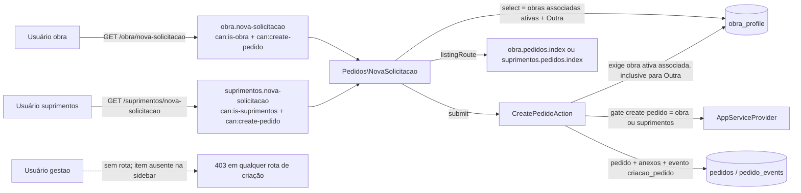
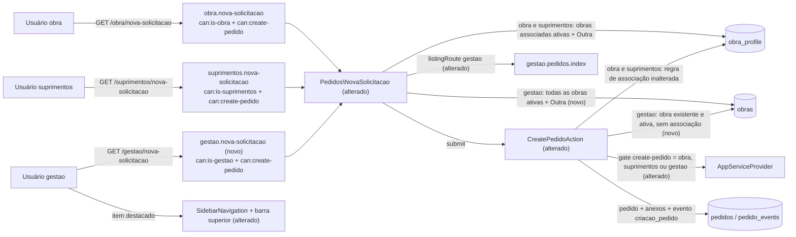

# SPEC: gestao-nova-solicitacao

## Metadata
- Source: developer description via /plan
- Service: sistema_obra_mc (Laravel 13 + Livewire 4, monólito único)
- Tier: standard
- Version: 1.1
- Architecture references: `CLAUDE.md` (§3 Criação do pedido, §4 Navegação/Gestão, §5 Autorização, §8 Convenções de UI), `AGENTS.md`, `docs/agents/architecture.md`, `docs/agents/domain_rules.md`, `docs/agents/api_contracts.md`. Init chain (auxiliar): `.spec/init/{project-description,user-stories,database-schema,project-phases}.md`. SPECs anteriores: `.spec/features/navegacao-sidebar-listagens/SPEC.md`, `.spec/features/paridade-demo-v0/SPEC.md`, `.spec/features/reimplementacao-v0-laravel-livewire/SPEC.md` (RF-20 original).

Regras de arquitetura citadas e mantidas por esta SPEC:
- Autorização em camadas: middleware `can:` na rota → re-checagem em `mount()` → Policy → guard na Action (defesa em profundidade; CLAUDE.md §5, camadas 3–6).
- A sidebar não é camada de autorização: cada item lista **exatamente** as habilidades `can:` da rota de destino (CLAUDE.md §5 e §8, "Sidebar: um catálogo só").
- Toda validação da criação roda antes da transação e antes de consumir `nextval('pedido_code_sequence')` — uma recusa nunca consome código (docblock de `app/Actions/Pedidos/CreatePedidoAction.php:36-43`).
- A definição de "obra ativa" existe em um lugar só: `ObraStatus::isActive()` / escopo `Obra::active()` (CLAUDE.md §6, "Status da obra").

## Context
Hoje só os perfis Obra e Suprimentos criam solicitações: o gate `create-pedido` aceita `obra` ou `suprimentos` (verified at `app/Providers/AppServiceProvider.php:50`), `PedidoPolicy::create` delega a ele (`app/Policies/PedidoPolicy.php:34-37`) e `CreatePedidoAction::execute` recusa os demais com `AuthorizationException` "Apenas os perfis Obra e Suprimentos podem criar solicitações." (verified at `app/Actions/Pedidos/CreatePedidoAction.php:91-93`). O componente neutro de papel `App\Livewire\Pedidos\NovaSolicitacao` está ligado a duas rotas, `obra.nova-solicitacao` e `suprimentos.nova-solicitacao` (verified at `routes/web.php:95,105`), lista só `Auth::user()->obras()->active()` + "Outra" (`NovaSolicitacao.php:~140`) e redireciona para a listagem do papel via `listingRoute()` (Suprimentos → `suprimentos.pedidos.index`, qualquer outro → `obra.pedidos.index`).

A criação exige que o solicitante tenha ≥ 1 obra ativa associada (inclusive para "Outra") e que a obra escolhida esteja em `obra_profile` do solicitante (`CreatePedidoAction.php:97-101`, `:253-265`). A Gestão, por regra, **não pode** ter obras associadas (`CreateUserAction::obraIdsRules`, `app/Actions/Usuarios/CreateUserAction.php:132`; `UpdateUserAction` faz `detach()` ao mudar para `gestao`) e enxerga todos os pedidos (`PedidoPolicy::view`, `Pedido::scopeVisibleTo`). Portanto o caminho de associação não serve à Gestão: ela precisa de uma regra própria — qualquer obra existente e ativa.

A feature concede à Gestão **somente** a criação de solicitações, reusando a tela existente; toda a restrição de escrita operacional da Gestão (RF-20 da SPEC `reimplementacao-v0-laravel-livewire`: sem observar, marcar entregue, anexar romaneio, finalizar, mover status, responsável, prioridade, previsão ou cancelar) permanece.

## AS IS — Estado atual

Hoje a Gestão não tem rota nem item de menu para criar solicitação, e o gate `create-pedido` a recusa em todas as camadas. A validação da obra depende exclusivamente das associações do solicitante em `obra_profile`.

## TO BE — Estado proposto

Nós alterados/novos e requisitos que os realizam: gate `create-pedido` e mensagem da Action (RF-01, RF-02); rota `gestao.nova-solicitacao` (RF-03, CT-01); select e `listingRoute` do componente (RF-04, RF-05, UI-02); regra de obra da Gestão na Action (RF-06, RF-07, RF-08, RF-09); item destacado na sidebar e na barra superior (UI-01). O restante do fluxo de criação (código, anexos, evento `criacao_pedido`) não muda.

## Scope
- **In**:
  - Gate `create-pedido` estendido a `gestao`; `PedidoPolicy::create` e `CreatePedidoAction` seguem o gate; mensagem de recusa atualizada.
  - Rota `GET /gestao/nova-solicitacao` reusando `Pedidos\NovaSolicitacao`.
  - Item "+ Nova Solicitação" destacado para Gestão na sidebar (desktop) e na barra superior (celular).
  - Select da Gestão com todas as obras ativas + "Outra"; redirecionamento pós-criação para `gestao.pedidos.index`.
  - Validação server-side da obra para Gestão (existente e ativa, sem associação).
  - Ajuste dos testes que fixam "Gestão sem criação" e novos testes cobrindo esta SPEC.
  - Documentação: `docs/onboarding-albuquerque.md`, `CLAUDE.md`, `docs/agents/*.md` via `/ai-context`.
- **Out**:
  - Qualquer outra escrita da Gestão sobre pedidos (observação, Marcar como entregue, romaneio, Finalizar, status, responsável, prioridade, previsão, cancelamento) — continua proibida.
  - Associação de obras a usuários `gestao` (regra `obraIdsRules` e `detach()` inalteradas).
  - Mudança em `PedidoPolicy::view`, `Pedido::scopeVisibleTo`, `Gestao\PedidoDetalhe`, Kanban somente leitura, Dashboard ou página inicial `/home`.
  - Novo componente/tela de criação, nova migration, novo evento ou nova coluna.
  - Mudança nas regras de criação de `obra` e `suprimentos`.

## RIGID (Non-Negotiable)

### Functional Requirements

- RF-01 [Ubiquitous]: The `create-pedido` ability SHALL allow users whose role slug is `obra`, `suprimentos` or `gestao`, and SHALL deny every other user (including a user with no role or an unknown role slug).
  - AC: `Gate::forUser($u)->allows('create-pedido')` is `true` for factory users `obra`, `suprimentos` and `gestao`, and `false` for a user whose role slug is outside those three.

- RF-02 [Unwanted]: IF `CreatePedidoAction` is executed by a user denied by `create-pedido`, THEN THE SYSTEM SHALL throw `AuthorizationException` with the message "Apenas os perfis Obra, Suprimentos e Gestão podem criar solicitações." before any validation, without writing any row and without consuming a code from `pedido_code_sequence`.
  - AC: For an actor with an unknown role, the Action throws `AuthorizationException` with exactly that message; `pedidos`, `pedido_events` and `pedido_attachments` counts are unchanged; the next successful creation receives the code that would have followed without the refused attempt.
  - AC: `PedidoPolicy::create` returns `true` for `obra`, `suprimentos` and `gestao` and `false` for any other role (it delegates to `create-pedido`; no own rule).
  - AC: The old literal "Apenas os perfis Obra e Suprimentos podem criar solicitações." no longer appears in `app/`.

- RF-03 [Event-Driven]: WHEN an authenticated, active user requests `GET /gestao/nova-solicitacao`, THE SYSTEM SHALL render `Pedidos\NovaSolicitacao` if the user passes `is-gestao` and `create-pedido`, and SHALL answer HTTP 403 otherwise.
  - AC: `gestao` → 200 with the Nova Solicitação form; `obra` → 403; `suprimentos` → 403; guest → redirect to `login`; inactive `gestao` → redirect to `login` (middleware `active`).
  - AC: `gestao` still receives 403 on `GET /obra/nova-solicitacao` and `GET /suprimentos/nova-solicitacao` (the papel-prefixed groups are unchanged).

- RF-04 [State-Driven]: WHILE the authenticated user of `Pedidos\NovaSolicitacao` has role `gestao`, THE SYSTEM SHALL list in the obra select every obra satisfying `Obra::active()` (status ≠ `concluido`), independent of `obra_profile`, ordered by name, followed by the option "Outra"; WHILE the user has role `obra` or `suprimentos`, the list SHALL remain the user's associated active obras + "Outra".
  - AC: With obras A (em_andamento), B (a_iniciar) and C (concluido), none associated to the `gestao` user, the rendered select for `gestao` contains exactly A and B (name order) and "Outra"; C is absent.
  - AC: For a `suprimentos` user associated only to A, the select contains exactly A and "Outra" (unchanged behavior).

- RF-05 [Event-Driven]: WHEN a `gestao` user creates a pedido through `Pedidos\NovaSolicitacao`, THE SYSTEM SHALL point the listing link/redirect of `listingRoute()` to `gestao.pedidos.index`.
  - AC: For `gestao`, `listingRoute()` returns `route('gestao.pedidos.index')`; for `suprimentos` it returns `route('suprimentos.pedidos.index')`; for `obra` it returns `route('obra.pedidos.index')`.

- RF-06 [Event-Driven]: WHEN `CreatePedidoAction` is executed by a `gestao` user with `obra_selection` equal to an obra id, THE SYSTEM SHALL create the pedido with that `obra_id` if the obra exists and satisfies `Obra::active()`, without requiring any `obra_profile` row for the requester.
  - AC: A `gestao` user with zero associations creating on an `em_andamento` obra gets a pedido with that `obra_id`, `requester_id` = the gestao user, `obra_reference = null`, initial status `solicitado`, one `criacao_pedido` event whose `new_value` is the obra name, and no `obra_profile` row is created.

- RF-07 [Unwanted]: IF a `gestao` user submits an `obra_selection` id that does not exist or whose obra is `concluido`, THEN THE SYSTEM SHALL answer 422 on the key `obra_id` before the transaction and without consuming a code; for a nonexistent obra id the message SHALL be "A obra informada não foi encontrada."; for a `concluido` obra the message SHALL be "A obra informada está inativa e não recebe novas solicitações." (verified at `app/Actions/Pedidos/CreatePedidoAction.php:263`).
  - AC: Nonexistent id → `ValidationException` on `obra_id` with exactly "A obra informada não foi encontrada."; `concluido` obra → `ValidationException` on `obra_id` with exactly that message; in both cases no row is written in `pedidos`/`pedido_events`/`pedido_attachments`, no file remains on disk `pedido_anexos`, and `pedido_code_sequence` is not advanced.

- RF-08 [Event-Driven]: WHEN `CreatePedidoAction` is executed by a `gestao` user with `obra_selection = 'outra'`, THE SYSTEM SHALL create the pedido with `obra_id = null` and `obra_reference` = trimmed reference (blank → `null`, max 255), exactly as for the other roles, without creating any obra or `obra_profile` row.
  - AC: Gestão creates "Outra" with reference "  Galpão X  " → pedido with `obra_id = null`, `obra_reference = 'Galpão X'`, `criacao_pedido.new_value = 'Outra — Galpão X'`; `obras` and `obra_profile` counts unchanged.
  - AC: The resulting pedido is visible to the creating `gestao` user in `gestao.pedidos.index` and `gestao.pedidos.show`, visible to every `suprimentos` user, and not visible (listing absent, detail 403) to any `obra` user (none is the requester) — `PedidoPolicy::view` and `Pedido::scopeVisibleTo` unchanged.

- RF-09 [Unwanted]: IF a `obra` or `suprimentos` user submits an obra id that is active but not associated to them, or the user has zero associated active obras, THEN THE SYSTEM SHALL keep refusing with the current 422 messages on `obra_id` ("A obra informada não está associada ao solicitante." / `noActiveObraMessage()`), including for "Outra"; the Gestão branch SHALL NOT be reachable by any role other than `gestao`.
  - AC: Existing refusals for `obra` and `suprimentos` (not associated, zero active obras including "Outra", obra `concluido`) pass unchanged; a `suprimentos` user with zero associations submitting an active, unassociated obra id receives 422 on `obra_id` and no pedido is created.

- RF-10 [State-Driven]: WHILE no obra in the system satisfies `Obra::active()` (zero active obras system-wide), THE SYSTEM SHALL render, for a `gestao` user of `Pedidos\NovaSolicitacao`, an empty state instead of the form, and `CreatePedidoAction` executed by a `gestao` user SHALL answer 422 on the key `obra_id` with the message "Nenhuma obra ativa cadastrada. Cadastre ou reative uma obra em Obras." — also when `obra_selection = 'outra'` — before the transaction and without consuming a code from `pedido_code_sequence`. The message is returned by a dedicated `RoleSlug::Gestao` branch of `noActiveObraMessage()`; the `obra` and `suprimentos` messages are unchanged.
  - AC: With only `concluido` obras (or no obras) in the database, `GET /gestao/nova-solicitacao` as `gestao` renders the empty state containing exactly "Nenhuma obra ativa cadastrada. Cadastre ou reative uma obra em Obras." and no form (no obra select, no submit button).
  - AC: In the same state, `CreatePedidoAction` as `gestao` with `obra_selection = 'outra'` and with `obra_selection` = a `concluido` obra id both throw `ValidationException` on `obra_id`; for "Outra" the message is exactly "Nenhuma obra ativa cadastrada. Cadastre ou reative uma obra em Obras."; no row is written in `pedidos`/`pedido_events`/`pedido_attachments`, no file remains on disk `pedido_anexos`, and `pedido_code_sequence` is not advanced.
  - AC: As soon as one obra satisfies `Obra::active()`, the same `gestao` user sees the form and can create "Outra" (RF-08).

- RF-11 [Ubiquitous]: A `gestao` user SHALL remain unable to add observações, mark a pedido as entregue, attach romaneio, finalize, change status, responsável, prioridade or previsão, or cancel — for every pedido, including pedidos the same `gestao` user created.
  - AC: For a pedido created by `gestao`, `PedidoPolicy::{addObservacao, marcarEntregue, anexarRomaneio, finalizar, setResponsavel, setPrioridade, setPrevisao, updateStatus, cancelar}` all return `false` for that user; calling each corresponding Action (`AddPedidoObservacaoAction`, `MarkPedidoEntregueByObraAction`, `AttachRomaneioAction`, `FinalizePedidoAction`, `UpdatePedidoStatusAction`, `UpdatePedidoResponsavelAction`, `UpdatePedidoPrioridadeAction`, `UpdatePedidoPrevisaoAction`, `CancelPedidoAction`) with the gestao actor throws `AuthorizationException` and writes no `pedido_events` row.
  - AC: `Gestao\PedidoDetalhe` and `KanbanReadOnly` render no mutation control for a gestao-created pedido.

- RF-12 [Ubiquitous]: Users with role `gestao` SHALL remain unable to hold obra associations.
  - AC: `CreateUserAction`/`UpdateUserAction` with role `gestao` and non-empty `obra_ids` still answer 422; changing a user to `gestao` still detaches every obra; `AttachUserObrasAction` still refuses a `gestao` target (`GuardsObraAssociationTarget`).

### UI Requirements

- UI-01 [State-Driven]: WHILE the authenticated user has role `gestao`, THE SYSTEM SHALL show a highlighted item "+ Nova Solicitação" pointing to `gestao.nova-solicitacao` as the first item of the sidebar (desktop and mobile drawer) and in the mobile top bar, with abilities exactly `['is-gestao', 'create-pedido']` and marked `aria-current="page"` on that route.
  - AC: `SidebarNavigation::for($gestao)` returns, in order: "+ Nova Solicitação" (highlight = true, route `gestao.nova-solicitacao`), Pedidos, Dashboard, Kanban, Obras, Associações, Usuários; exactly one item per role has `highlight = true` for `obra`, `suprimentos` and `gestao`.
  - AC: A page rendered for `gestao` contains `data-testid="sidebar-nova-solicitacao"` and `data-testid="topbar-nova-solicitacao"`, both linking to `/gestao/nova-solicitacao`.
  - AC: On `GET /gestao/nova-solicitacao`, exactly one sidebar item carries `aria-current="page"` and it is "+ Nova Solicitação" (not "Pedidos").
  - AC: Visão Geral remains absent for `gestao`.

- UI-02 [Event-Driven]: WHEN a `gestao` user opens Nova Solicitação, THE SYSTEM SHALL render the same form (obra select, "Outra" with free reference, descrição, "Preciso para", up to 10 anexos) and, after creation, the same success state with the code and "Data prevista", with the listing link pointing to `gestao.pedidos.index`.
  - AC: A Livewire test as `gestao` fills the form on an active obra, submits, sees the generated `PED-XXXXXX` code and a link whose `href` is `route('gestao.pedidos.index')`.

### Contracts

- CT-01: Route `GET /gestao/nova-solicitacao`, name `gestao.nova-solicitacao`, component `App\Livewire\Pedidos\NovaSolicitacao`, middleware exactly `['web', 'auth', 'active', 'can:is-gestao', 'can:create-pedido']` (same shape as `obra.nova-solicitacao`, verified at `tests/Feature/Compliance/RouteMiddlewareBaselineTest.php:36`).
- CT-02: Ability `create-pedido`: allows role slugs `{obra, suprimentos, gestao}`; denial message of `CreatePedidoAction`: "Apenas os perfis Obra, Suprimentos e Gestão podem criar solicitações." (replaces the literal at `app/Actions/Pedidos/CreatePedidoAction.php:92`).
- CT-03: `CreatePedidoAction::execute(User $requester, array $data): Pedido` — input keys unchanged (`obra_selection`, `obra_reference`, `descricao`, `needed_at`, `anexos`); error key for obra refusals remains `obra_id`; HTTP semantics unchanged (403 authorization, 422 validation).

### Non-Functional Requirements

- RNF-01: Executing `CreatePedidoAction` as `gestao` SHALL emit no more database queries than executing it as `suprimentos` with one associated obra, measured by query count around the Action call only (not the Livewire round-trip) in a Feature test with identical input. Separately, rendering the obra select of `Pedidos\NovaSolicitacao` for `gestao` SHALL cost exactly 1 query on `obras` (no per-obra query, no N+1), asserted in its own test.
- RNF-02: Refused Gestão creations (RF-07, RF-10) SHALL consume 0 values from `pedido_code_sequence` and leave 0 files on disk `pedido_anexos`, verified by test.
- RNF-03: No new dependency (composer or npm), no new migration and no new Livewire component; `composer.json`, `package.json` and `database/migrations/` unchanged by this feature.
- RNF-04: The existing test suites pinning Gestão without create access SHALL be updated (not deleted) to the new rule, and `php artisan test --compact --testsuite=Feature` SHALL end with 0 failures; affected files identified: `tests/Feature/Authorization/RoleGatesTest.php` (dataset `create-pedido gate`, `:68-72`), `tests/Feature/Authorization/PedidoPolicyTest.php` (`:77-80`), `tests/Feature/Authorization/SidebarNavigationCatalogueTest.php` (`:17`, `:66-77`), `tests/Feature/Compliance/RouteMiddlewareBaselineTest.php` (new entry for `gestao.nova-solicitacao`), `tests/Feature/Livewire/NovaSolicitacaoTest.php` (`:280-320`), `tests/Feature/Livewire/SidebarNavigationTest.php` (`:97`), `tests/Feature/Security/Adversarial/PedidoOperationsAuthorizationTest.php` (`:168`), plus any other failing test found by running the suite (candidates: `tests/Feature/Security/Adversarial/CrossRoleTest.php`, `tests/Feature/Livewire/LayoutIdentityTest.php`, `tests/Browser/SidebarNavigationTest.php`). Tests still valid (Gestão 403 on `/obra/nova-solicitacao` and `/suprimentos/nova-solicitacao`, `RoleGatesTest.php:105-129`, `SidebarNavigationTest.php:130-131`) SHALL be kept as-is.
- RNF-05: Documentation SHALL describe the new permission: `docs/onboarding-albuquerque.md` (at least the rule at line 79 "a Gestão também não cria solicitações" and the Gestão section around line 248), `CLAUDE.md` (§3 "Criação do pedido", §4 sidebar/Gestão table and Nova Solicitação paragraph, §5 camada 3 and Policy row); `docs/agents/*.md` regenerated only via `/ai-context` (never edited by hand — they carry the generated banner, e.g. `docs/agents/domain_rules.md:61`, `docs/agents/api_contracts.md:29,36`).

## FLEXIBLE (Implementation Suggestions)
- Gate: add `RoleSlug::Gestao->value` to the `in_array` of `create-pedido` in `AppServiceProvider::boot` (line 50); update the docblock (lines ~39-44) and the one in `PedidoPolicy` (lines 10-20), which states "gestao is never authorized to write".
- `CreatePedidoAction`: branch by role before the association checks, e.g. a private `ensureObraAcceptsSolicitacaoForGestao(int $obraId)` that uses `Obra::query()->whereKey($obraId)` and `Obra::active()`; keep `ensureObraAcceptsSolicitacao` untouched for `obra`/`suprimentos` (the nonexistent-id text is RIGID in RF-07). Update the class docblock (lines 25-60).
- `NovaSolicitacao::obras()`: `gestao` → `Obra::query()->active()->orderBy('name')->get()`; otherwise unchanged. `listingRoute()` → `match` over `RoleSlug`. Consider a single role-aware helper (e.g. on the Action) returning the selectable obras query, so component and Action share one definition.
- Route: add `Route::get('/nova-solicitacao', NovaSolicitacao::class)->middleware('can:create-pedido')->name('nova-solicitacao');` inside the `can:is-gestao` group (`routes/web.php:133`).
- Sidebar: in `SidebarNavigation::catalogue()` Gestão block (line 74), prepend `self::item('+ Nova Solicitação', 'gestao.nova-solicitacao', 'gestao.nova-solicitacao', ['is-gestao', 'create-pedido'], null, true)`; the layout already renders the highlighted item in the top bar (`resources/views/layouts/app.blade.php:31-42,96-102`), so no Blade change is expected.
- Tests: new Feature tests in `NovaSolicitacaoTest` (Gestão happy path, select contents, "Outra", nonexistent/concluída obra, code not consumed), `RoleGatesTest`, `PedidoPolicyTest` (RF-11 matrix on a gestao-created pedido), `SidebarNavigationCatalogueTest`, `RouteMiddlewareBaselineTest`; optionally extend `tests/Browser/SidebarNavigationTest.php` for the mobile top bar.

## Acceptance Criteria Summary
| ID | Criterion | Testable? |
|----|-----------|-----------|
| RF-01 | `create-pedido` allows obra, suprimentos, gestao; denies others | Yes |
| RF-02 | Denial message updated; Policy follows gate; no code consumed | Yes |
| RF-03 | `/gestao/nova-solicitacao` 200 for gestao, 403 for obra/suprimentos | Yes |
| RF-04 | Gestão select = all active obras + "Outra"; others unchanged | Yes |
| RF-05 | `listingRoute()` → `gestao.pedidos.index` for gestao | Yes |
| RF-06 | Gestão creates on active obra without association | Yes |
| RF-07 | Nonexistent/concluída obra → 422 `obra_id` with fixed texts, no code consumed | Yes |
| RF-08 | Gestão "Outra" works; visibility rules unchanged | Yes |
| RF-09 | obra/suprimentos association rules unchanged; no bypass | Yes |
| RF-10 | Zero active obras system-wide → Gestão empty state; Action 422 `obra_id` even for "Outra"; no code consumed | Yes |
| RF-11 | Gestão still cannot operate pedidos (9 mutations) | Yes |
| RF-12 | Gestão still cannot hold obra associations | Yes |
| UI-01 | Highlighted "+ Nova Solicitação" for gestao, sidebar + top bar | Yes |
| UI-02 | Same form/success state; link to gestao listing | Yes |
| CT-01..03 | Route, ability, Action contract | Yes |
| RNF-01 | Action query count Gestão ≤ Suprimentos; Gestão select = 1 `obras` query | Yes |
| RNF-02 | Refusal consumes 0 codes, 0 files | Yes |
| RNF-03 | No new dependency/migration/component | Yes |
| RNF-04 | Pinning tests updated, Feature suite green | Yes |
| RNF-05 | Onboarding, CLAUDE.md updated; docs/agents via /ai-context | Yes |
