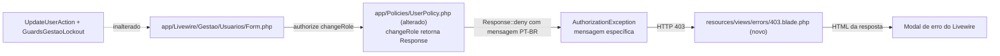

# Implementation Plan

## Request Summary
- Objective: quando um usuário `gestao` tenta salvar outro perfil para a **própria** conta em Gestão > Usuários, negar com a mensagem PT-BR `Não é possível regredir próprio acesso. Solicite à gestão!` (Policy) e trocar a página 403 genérica do framework, em inglês, por uma view própria em PT-BR com botão "Voltar" para `route('home')`.
- Scope:
  - in: `UserPolicy::changeRole` (só a forma da negação: `Response::deny(...)` para a própria conta); nova view `resources/views/errors/403.blade.php`; testes Pest em `tests/Feature/Authorization/UserPolicyTest.php`, `tests/Feature/Livewire/UsuariosFormTest.php` e um teste novo da página 403.
  - out: `UserPolicy::deactivate` e as demais abilities; `GuardsGestaoLockout` e suas mensagens; `App\Livewire\Gestao\Usuarios\Form` (sem mudança de comportamento; o select de perfil continua habilitado na própria conta); páginas de erro 404/419/429/500; dependências novas.
- Tier: light
- Architecture references: `AGENTS.md`, `CLAUDE.md` (§5 camada 4 "Policies" — `UserPolicy` via gate `manage-users`, `changeRole`/`deactivate` recusam a própria conta; §7 "XSS" sem `{!! !!}`; §8 "Classes Tailwind sempre literais"), `docs/agents/architecture.md` ("Layer responsibilities": Policy decide quem pode, componente chama `authorize()` antes da Action, Action decide o estado), `docs/agents/domain_rules.md` ("Users": `GuardsGestaoLockout` continua como defesa em profundidade). `.ai/rules/` não existe no repositório.

## AS IS — Componentes impactados

```mermaid
flowchart LR
  Form["app/Livewire/Gestao/Usuarios/Form.php"] -->|"authorize changeRole (linhas 85-87)"| Policy["app/Policies/UserPolicy.php<br/>changeRole retorna bool"]
  Policy -->|"false"| Exc["AuthorizationException<br/>This action is unauthorized."]
  Exc -->|"HTTP 403"| Default["Página 403 padrão do framework"]
  Default -->|"HTML da resposta"| Modal["Modal de erro do Livewire"]
  Action["UpdateUserAction + GuardsGestaoLockout"] -.->|"defesa em profundidade"| Form
```

Hoje `UserPolicy::changeRole` (`app/Policies/UserPolicy.php:31-34`) nega a própria conta com `false`, o framework gera a mensagem padrão em inglês e, como `resources/views/errors/` não existe, a resposta 403 é a página genérica do framework, exibida também dentro do modal de erro do Livewire.

## TO BE — Componentes propostos

T01 altera `UserPolicy::changeRole` (nó Policy alterado; RF-01..RF-05). T02 cria `errors/403.blade.php` (nó novo; UI-01..UI-03), que exibe a mensagem de T01 tanto numa requisição comum quanto no modal do Livewire. Form, Action e guard não mudam.

## Tasks

### T01 — `UserPolicy::changeRole` nega a própria conta com mensagem PT-BR
- **Files**: `app/Policies/UserPolicy.php`; `tests/Feature/Authorization/UserPolicyTest.php`; `tests/Feature/Livewire/UsuariosFormTest.php`
- **Change**:
  - Em `UserPolicy`, importar `Illuminate\Auth\Access\Response` e mudar a assinatura para `public function changeRole(User $actor, User $target): Response`. Ordem: se `! $this->managesUsers($actor)` → `Response::deny()` (mensagem padrão do framework, RF-02 — **a checagem de `manage-users` vem antes**, para que `obra`/`suprimentos` sobre a própria conta nunca recebam a mensagem de RF-01); se `$actor->is($target)` → `Response::deny(self::SELF_ROLE_CHANGE_DENIED_MESSAGE)`; senão `Response::allow()`. Declarar a constante pública `SELF_ROLE_CHANGE_DENIED_MESSAGE = 'Não é possível regredir próprio acesso. Solicite à gestão!'` com PHPDoc. Atualizar o docblock da classe citando a mensagem. `deactivate` e as demais abilities **não** mudam (continuam `bool`, RF-05). Não tocar `Form.php`, `UpdateUserAction` nem `GuardsGestaoLockout`.
  - Testes em `UserPolicyTest.php` (adições; os testes existentes, inclusive `gestao cannot change the role of or deactivate its own account` em `:50-54`, ficam sem alteração — `can()` continua `false`/`true`):
    - RF-01: `Gate::forUser($gestao)->inspect('changeRole', $gestao)` → `denied()` true e `message()` igual à mensagem exata;
    - RF-02: para `obra` e `suprimentos` (dataset `non-admin papéis`), alvo = outra conta e alvo = a própria conta → `denied()` true e `message()` diferente da mensagem de RF-01;
    - RF-05: `Gate::forUser($gestao)->inspect('deactivate', $gestao)` → `denied()` true e `message()` diferente da mensagem de RF-01.
  - Testes em `UsuariosFormTest.php` (seguindo o estilo do arquivo, `$this->gestao` + `Livewire::test(Form::class, ['user' => ...])`):
    - RF-03: gestao editando a própria conta, `set('roleId', <id do papel obra ou suprimentos>)->call('save')->assertForbidden()`; `$this->gestao->fresh()->role_id` inalterado; `user_admin_events` com a mesma contagem de antes da chamada;
    - RF-04: gestao A edita B (`obra`) com `roleId` = papel `suprimentos` → `assertHasNoErrors()`, `assertRedirect(route('gestao.usuarios.index'))`, `B->fresh()->role->slug === 'suprimentos'` e `$a->can('changeRole', $b)` true.
  - Rodar `vendor/bin/pint --dirty --format agent`.
- **Covers**: RF-01, RF-02, RF-03, RF-04, RF-05, RNF-01, RNF-02
- **Tests**: `php artisan test --compact tests/Feature/Authorization/UserPolicyTest.php tests/Feature/Livewire/UsuariosFormTest.php tests/Feature/Actions/Usuarios/GestaoLockoutGuardTest.php`
- **Risk**: Medium — mudança em Policy de autorização; o risco é inverter a ordem das checagens e vazar a mensagem de RF-01 para `obra`/`suprimentos`, ou afrouxar a negação. Mitigado pelos testes RF-01/RF-02 e pelos testes existentes de `can()`.
- **Dependencies**: none

### T02 — Página 403 própria em PT-BR com "Voltar"
- **Files**: `resources/views/errors/403.blade.php` (novo); `tests/Feature/Http/ForbiddenPageTest.php` (novo, via `php artisan make:test --pest Http/ForbiddenPageTest --no-interaction`)
- **Change**:
  - View HTML **autônoma** (não estende `layouts/app.blade.php`: sem sidebar, sem `<aside`, funciona sem usuário autenticado), `lang` igual ao layout, `@vite(['resources/css/app.css'])`, `<title>` em PT-BR (ex.: `Acesso negado — {{ config('app.name') }}`; nunca o literal da marca, nunca a palavra `Forbidden`). Corpo com fundo branco (`bg-white`/token `surface`) e conteúdo centralizado (`flex min-h-screen items-center justify-center`, classes Tailwind literais, sem interpolação, sem gradiente/`shadow-xl`).
  - Mensagem num bloco `@php` no topo: `$message = trim((string) ($exception?->getMessage() ?? ''))`; se `''` ou `'This action is unauthorized.'` → `'Você não tem permissão para acessar esta página.'`. Exibida só com `{{ $message }}` (escapada; nunca `{!! !!}`). O literal `This action is unauthorized.` aparece só na comparação PHP, nunca é emitido.
  - Botão "Voltar": `<a href="{{ route('home') }}" target="_top" class="btn-primary">Voltar</a>` — link `<a>` focável, rótulo literal `Voltar`, sem `history.back()` nem `javascript:`. `target="_top"` faz o clique dentro do modal de erro do Livewire (que renderiza o HTML num iframe) navegar a janela inteira para `home`, igual à página comum (UI-03).
  - Testes em `ForbiddenPageTest.php`:
    - UI-01/UI-02/UI-03 (rota): `obra` autenticado faz `GET route('gestao.usuarios.index')` → `assertForbidden()`, `assertSee('Você não tem permissão para acessar esta página.')`, `assertSee('Voltar')`, `assertSee('href="'.route('home').'"', false)`, `assertDontSee('This action is unauthorized.')`, `assertDontSee('Forbidden')`;
    - UI-02 (mensagem específica, caminho de RF-03): resposta 403 da tentativa de gestao salvar o próprio perfil contém `UserPolicy::SELF_ROLE_CHANGE_DENIED_MESSAGE`, `Voltar` e o mesmo `href`. Primeiro tentar sobre a resposta do `Livewire::test(Form::class, ['user' => $gestao])->set('roleId', …)->call('save')`; se o harness de teste não expuser o corpo renderizado [UNVERIFIED], registrar no próprio teste uma rota `Route::middleware(['web', 'auth'])->get('/__forbidden-probe', fn () => Gate::authorize('changeRole', auth()->user()))` e afirmar sobre o GET dela (mesma `AuthorizationException`, mesma view);
    - UI-01/UI-03 (arquivo): o conteúdo de `resources/views/errors/403.blade.php` não contém `{!!`, `<aside`, `Albuquerque Engenharia`, `history.back`, `javascript:`, nem `{{` dentro de atributo `class`.
  - Rodar `vendor/bin/pint --dirty --format agent`.
- **Covers**: UI-01, UI-02, UI-03, RNF-01, RNF-02
- **Tests**: `php artisan test --compact tests/Feature/Http/ForbiddenPageTest.php tests/Feature/Security/BladeEscapingTest.php tests/Feature/Compliance/BrandIdentityComplianceTest.php tests/Feature/Livewire/UsuariosIndexTest.php tests/Feature/Livewire/UsuariosFormTest.php`
- **Risk**: Low/Medium — a view vale para **todo** 403 da aplicação (inclusive `abort(403, 'Perfil de acesso não reconhecido.')` de `/home`, que passa a aparecer em PT-BR, e o 403 de `/livewire/update`); testes existentes com `assertForbidden()` só checam status. `@vite` exige manifest em `public/build` (mesma condição do layout atual).
- **Dependencies**: T01 (o teste de mensagem específica usa a constante e a negação de T01)

## Risks
| Risk | Blast radius | Mitigation | Rollback |
|------|-------------|------------|----------|
| Ordem errada em `changeRole` vaza a mensagem de RF-01 para `obra`/`suprimentos` ou permite autoalteração | Autorização de Gestão > Usuários | Checagem de `manage-users` primeiro; testes RF-01/RF-02 via `Gate::inspect`; `GuardsGestaoLockout` continua bloqueando na Action | Reverter `app/Policies/UserPolicy.php` |
| View 403 nova afeta todos os 403 (rotas e `/livewire/update`) | Toda resposta 403 | Fallback genérico PT-BR; mensagem só via `{{ }}`; view sem dependência de usuário autenticado | Apagar `resources/views/errors/403.blade.php` (volta ao padrão do framework) |
| Mensagem de `abort(403, ...)` em inglês de algum ponto futuro apareceria crua | Texto exibido | Só a mensagem padrão do framework é substituída (regra da SPEC UI-02) | n/a |
| Clique em "Voltar" dentro do modal navegar só o iframe | UX do modal Livewire | `target="_top"` no link | Ajustar atributo |
| Compliance de marca/escape reprovar a view | Suíte de compliance | Título via `config('app.name')`, sem `<aside`, sem `{!!`, classes literais | Corrigir a view |

## Open Questions
- Nenhuma bloqueante.

## Assumptions
- `Livewire::test(...)->call('save')->assertForbidden()` já funciona para `AuthorizationException` neste projeto (evidência: `tests/Feature/Livewire/UsuariosFormTest.php:364`, `UsuariosIndexTest.php:239`).
- O framework converte `AuthorizationException` em `AccessDeniedHttpException` preservando a mensagem, e o handler renderiza `errors/403` com `$exception` disponível na view (comportamento padrão do Laravel 13) [UNVERIFIED — confirmar com `search-docs` "custom http error pages" antes de implementar].
- O corpo renderizado da view não é exposto pelo `Livewire::test` [UNVERIFIED]; por isso T02 prevê a rota-sonda de teste como alternativa.
- `btn-primary` existe como componente CSS (`tests/Feature/Compliance/BrandIdentityComplianceTest.php` afirma `.btn-primary` entre as regras de botão).
