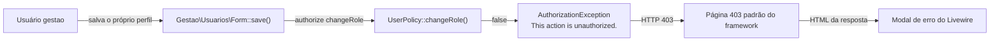

# SPEC: mensagem-auto-rebaixamento

## Metadata
- Source: developer description via /plan
- Service: sistema_obra_mc (Laravel 13 + Livewire 4, monorepo único)
- Tier: light
- Version: 1.1
- Architecture references: `AGENTS.md`, `CLAUDE.md` (§5 "Autorização", §7 "Proteção de dados", §8 "Convenções travadas de UI"), `docs/agents/architecture.md`, `docs/agents/domain_rules.md` (`.ai/rules/` não existe neste repositório)

## Context
Em Gestão > Usuários, o formulário de edição (`App\Livewire\Gestao\Usuarios\Form`) permite trocar o "Perfil" no select `roleId` (verified at resources/views/livewire/gestao/usuarios/form.blade.php:33-34), inclusive na própria conta. Ao salvar com papel diferente, `save()` chama `$this->authorize('changeRole', $this->user)` (verified at app/Livewire/Gestao/Usuarios/Form.php:85-87). `UserPolicy::changeRole` retorna `bool` e nega a própria conta com `false` (verified at app/Policies/UserPolicy.php:31-34); o framework transforma isso em `AuthorizationException` com a mensagem padrão em inglês "This action is unauthorized." (verified at vendor/laravel/framework/src/Illuminate/Auth/Access/AuthorizationException.php:33). Não existe `resources/views/errors/` (verificado por `ls`), então o usuário vê a página 403 genérica do framework, em inglês, e não entende por que a gravação falhou.

A feature faz a Policy negar a autoalteração de papel com uma mensagem específica em PT-BR e adiciona uma página 403 própria, que também é o conteúdo exibido pelo modal de erro do Livewire quando `/livewire/update` responde com status não-OK (Livewire chama `showHtmlModal(responseBody)`, verified at vendor/livewire/livewire/dist/livewire.esm.js:12804).

Regras de arquitetura citadas:
- `docs/agents/architecture.md` ("Layer responsibilities"): Policies decidem **quem** pode; componentes Livewire chamam `$this->authorize(...)` antes de cada Action; Actions decidem se o estado permite a mudança. A mensagem nova pertence à Policy; `GuardsGestaoLockout` (defesa em profundidade na Action, mensagem "Você não pode desativar nem alterar o perfil da própria conta.", `docs/agents/domain_rules.md` "Users") não muda.
- `CLAUDE.md` §5, camada 4: `UserPolicy` — "tudo via gate `manage-users`; `changeRole`/`deactivate` recusam a própria conta". A regra de quem é negado permanece idêntica; só a forma da negação de `changeRole` muda.
- `CLAUDE.md` §7 / `tests/Feature/Security/BladeEscapingTest.php:19`: nenhuma view usa `{!! !!}`.
- `tests/Feature/Compliance/BrandIdentityComplianceTest.php:120` (marca só via `config('app.name')`) e `:128` (só `layouts/app.blade.php` contém `<aside`); `CLAUDE.md` §8 "Classes Tailwind sempre literais".

## AS IS — Estado atual

Hoje a negação da autoalteração de papel é um `false` sem mensagem, e a resposta 403 é a página padrão do framework, em inglês, exibida dentro do modal de erro do Livewire.

## TO BE — Estado proposto

```mermaid
flowchart LR
  Gestao["Usuário gestao"] -->|"salva o próprio perfil"| Form["Gestao\Usuarios\Form::save()"]
  Form -->|"authorize changeRole"| Policy["UserPolicy::changeRole() (alterado)"]
  Policy -->|"deny com mensagem específica"| Exc["AuthorizationException<br/>mensagem PT-BR"]
  Exc -->|"HTTP 403"| NEW_View["errors/403.blade.php (novo)"]
  NEW_View -->|"HTML da resposta"| Modal["Modal de erro do Livewire"]
```

`UserPolicy::changeRole` passa a negar a própria conta com mensagem específica (RF-01, RF-02, RF-04), e a nova view `errors/403.blade.php` exibe essa mensagem em PT-BR tanto em requisição comum quanto no modal do Livewire (UI-01, UI-02, RF-03). O formulário e o modal do Livewire não mudam.

## Scope
- **In**: `UserPolicy::changeRole` (forma da negação); nova view `resources/views/errors/403.blade.php`; testes Pest em `tests/Feature/Authorization/UserPolicyTest.php` e no teste do formulário de usuários.
- **Out**: `UserPolicy::deactivate` (inalterada, continua `bool`); demais abilities de `UserPolicy`; `GuardsGestaoLockout` e suas mensagens; `Gestao\Usuarios\Form` (nenhuma mudança de comportamento; o select de perfil continua habilitado para a própria conta); páginas de erro de outros status (404, 419, 429, 500); qualquer dependência nova.

## RIGID (Non-Negotiable)

### Functional Requirements
- RF-01 [Conditional]: If um usuário `gestao` ativo invoca a ability `changeRole` tendo como alvo a própria conta, then a `UserPolicy` shall negar com a mensagem exata `Não é possível regredir próprio acesso. Solicite à gestão!`.
  - AC: `Gate::forUser($gestao)->inspect('changeRole', $gestao)` retorna `denied() === true` e `message() === 'Não é possível regredir próprio acesso. Solicite à gestão!'`; `$gestao->can('changeRole', $gestao)` continua `false`.
- RF-02 [Conditional]: If um usuário sem a habilidade `manage-users` (`obra` ou `suprimentos`) invoca `changeRole` sobre qualquer alvo, then a `UserPolicy` shall negar sem a mensagem de RF-01.
  - AC: para `obra` e `suprimentos`, `Gate::forUser($actor)->inspect('changeRole', $alvo)` retorna `denied() === true` e `message()` diferente de `Não é possível regredir próprio acesso. Solicite à gestão!` (tanto com alvo = outra conta quanto com alvo = a própria conta).
- RF-03 [Event-Driven]: When um usuário `gestao` envia `save()` em `Gestao\Usuarios\Form` editando a própria conta com `roleId` diferente do papel atual, the sistema shall responder HTTP 403 com a mensagem de RF-01 e não alterar o papel.
  - AC: `Livewire::actingAs($gestao)->test(Form::class, ['user' => $gestao])->set('roleId', <id de outro papel>)->call('save')` resulta em `assertForbidden()`; após a chamada, `$gestao->fresh()->role_id` é igual ao valor anterior e nenhuma linha nova de `user_admin_events` é gravada para essa tentativa.
- RF-04 [Event-Driven]: When um usuário `gestao` salva em `Gestao\Usuarios\Form` a alteração de papel de **outro** usuário, the sistema shall persistir o novo papel como hoje.
  - AC: com `gestao` A editando o usuário B (`obra`) e `roleId` = papel `suprimentos`, `save()` não lança erro, redireciona para `gestao.usuarios.index` e `B->fresh()->role->slug === 'suprimentos'`; `$a->can('changeRole', $b)` retorna `true`.
- RF-05 [Ubiquitous]: The `UserPolicy::deactivate` shall manter o comportamento atual (retorno `bool`, negação da própria conta sem mensagem nova).
  - AC: `Gate::forUser($gestao)->inspect('deactivate', $gestao)->message()` não é `Não é possível regredir próprio acesso. Solicite à gestão!`; o teste existente `gestao cannot change the role of or deactivate its own account` (tests/Feature/Authorization/UserPolicyTest.php:50-54) continua passando para ambas as abilities.

### UI Requirements
- UI-01 [Event-Driven]: When a aplicação responde HTTP 403 a qualquer requisição (GET de página ou POST `/livewire/update`), the sistema shall renderizar `resources/views/errors/403.blade.php` em PT-BR: fundo branco, mensagem centralizada e um botão "Voltar".
  - AC: a resposta 403 de RF-03 e a de um GET autenticado de `obra` em `/gestao/usuarios` contêm o texto `Voltar` e não contêm `This action is unauthorized.` nem `Forbidden`; o arquivo existe, não contém `{!!`, não contém `<aside`, não contém o literal da marca (a marca, se exibida, vem de `config('app.name')`) e usa apenas classes Tailwind literais.
- UI-02 [Conditional]: If a exceção 403 carrega mensagem específica, then a página shall exibir essa mensagem (escapada); if a mensagem estiver vazia ou for a padrão do framework `This action is unauthorized.`, then a página shall exibir um texto genérico em PT-BR. Texto genérico (definido pelo desenvolvedor): `Você não tem permissão para acessar esta página.`.
  - AC: a resposta de RF-03 contém `Não é possível regredir próprio acesso. Solicite à gestão!`; a resposta 403 de `obra` em `/gestao/usuarios` (rota negada pelo middleware `can:manage-users`, mensagem padrão do framework) contém `Você não tem permissão para acessar esta página.` e não contém `This action is unauthorized.`.
- UI-03 [Event-Driven]: When o usuário aciona "Voltar" na página 403, the sistema shall levar o usuário à rota `home` (verified at routes/web.php:77), que redireciona cada papel à sua listagem; o comportamento é o mesmo na página 403 comum e dentro do modal de erro do Livewire.
  - AC: "Voltar" é um link `<a>` focável por teclado, com rótulo literal `Voltar` e `href` igual a `route('home')`; a view não usa `history.back()` nem `javascript:`; a resposta 403 de RF-03 (modal Livewire) e a de `obra` em `/gestao/usuarios` contêm esse mesmo `href`.

### Non-Functional Requirements
- RNF-01: Zero dependências novas em `composer.json` e `package.json` (diff vazio nesses arquivos e nos locks).
- RNF-02: As suítes existentes `tests/Feature/Security/BladeEscapingTest.php`, `tests/Feature/Compliance/BrandIdentityComplianceTest.php`, `tests/Feature/Authorization/UserPolicyTest.php` e `tests/Feature/Actions/Usuarios/GestaoLockoutGuardTest.php` passam sem alteração de suas asserções, exceto adaptações em `UserPolicyTest.php` estritamente necessárias para RF-01/RF-02.

## Acceptance Criteria Summary
| ID | Criterion | Testable? |
|----|-----------|-----------|
| RF-01 | `inspect('changeRole', self)` de `gestao` negado com a mensagem exata | Sim (Pest, Unit/Feature) |
| RF-02 | `obra`/`suprimentos` negados sem a mensagem específica | Sim (Pest) |
| RF-03 | Salvar o próprio papel em `Gestao\Usuarios\Form` → 403, papel inalterado | Sim (Pest + Livewire) |
| RF-04 | `gestao` altera o papel de outro usuário com sucesso | Sim (Pest + Livewire) |
| RF-05 | `deactivate` inalterada | Sim (teste existente) |
| UI-01 | 403 renderiza a view PT-BR com "Voltar", sem texto do framework, conforme compliance | Sim (Pest HTTP + varredura de arquivo) |
| UI-02 | Mensagem específica exibida; mensagem padrão/vazia → texto genérico PT-BR | Sim (Pest HTTP + Livewire) |
| UI-03 | "Voltar" é link para `route('home')`, sem `history.back()` | Sim (Pest HTTP + varredura de arquivo) |
| RNF-01 | Nenhuma dependência nova | Sim (diff) |
| RNF-02 | Suítes de compliance e autorização verdes | Sim |
