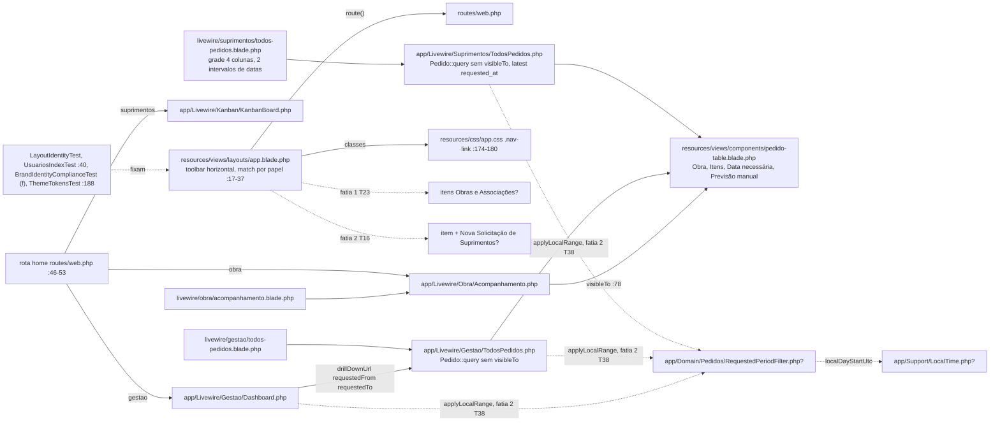
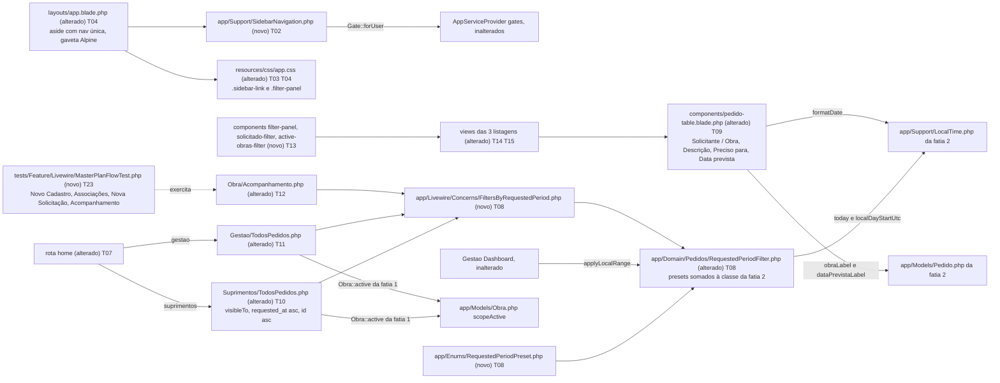

# Implementation Plan

Feature: `navegacao-sidebar-listagens` (fatia 3 de 3, fecha o incremento) · Branch: `build/v0-demo-laravel` · Base: the commit that closes slice 2 (gate G-2), recorded as `<base>` in T01
Source SPEC: `.spec/features/navegacao-sidebar-listagens/SPEC.md` (v1.2: RF-01..RF-25, UI-01..UI-08, CT-01..CT-04, RNF-01..RNF-06, 0 clarification markers)
Developer decisions: `.spec/features/navegacao-sidebar-listagens/.handoff/clarifier-answers.md` (2026-09-22, every recommendation accepted, NC-01..NC-06) and `.spec/features/solicitacao-historico-finalizacao/.handoff/master-plan.md` (§16–§18, §22–§28, §36–§41, §45; §43/§44 as constraints)
Cross-review fixes (fatia 3, 2026-09-23): `.spec/features/navegacao-sidebar-listagens/.handoff/cross-review-fixes.md` (evidence: `.handoff/cross-review.md`). Applied here: F-01 (Personalizado in local days through slice 2's single period class: T08, T09, T10, T11, T12, T17, T22; Open Question and UTC risk removed), F-08 (T14 legend "Preciso para"), F-11 (exact upstream names: gate G-2 and "Upstream names consumed"), F-16 (RF-25 §45 flow test: new T23), F-05 by analogy with slices 1/2 (T20 documentation is its own last phase, documentation-only commit).
Cross-review v2 decisions (2026-09-23): `.spec/features/navegacao-sidebar-listagens/.handoff/cross-review-v2-decisions.md` (evidence: `.handoff/cross-review-v2.md`). Applied here (slice-3 items): N-01 (T20 owns the `docs/onboarding-albuquerque.md` update to the post-increment product, rewrites the listed `DocumentationParityTest` onboarding assertions and mirrors them in `tests/README.md`), N-03 ("Regra de verde por fase": a phase closes green on Unit + Feature; `tests/Browser` is guaranteed only at T22 and T24), N-05 (T20 runs all of `tests/Feature/Compliance`; new T24 in Phase 9 = the master plan's "regressão completa" on the final HEAD), N-06 (T14 relabels the Suprimentos listing KPI caption to "Preciso para"; the T17 (e) scan is case-insensitive; SPEC RF-22 wording "Preciso para De/Até"). Developer defaults confirmed: D-5 (America/Sao_Paulo), D-6 (UI-06/NC-05 is the visual contract), D-10 ("+ Nova Solicitação" only in the sidebar/top bar); the matching Open Questions are closed.
Upstream (built on, never redone): `.spec/features/obras-associacoes-cadastro-convites/{SPEC,PLAN,PHASES}.md` (slice 1: 28 tasks, 9 phases) and `.spec/features/solicitacao-historico-finalizacao/{SPEC,PLAN,PHASES}.md` (slice 2: 39 tasks, 10 phases; "Outbound contract surface")
Executable view: `.spec/features/navegacao-sidebar-listagens/PHASES.md` (24 tasks, 9 phases)

## Pré-requisitos de execução (gates — não são tarefas)

**G-1 — Commit documental separado (por referência ao gate da fatia 1).** Vale literalmente o gate descrito no topo de `.spec/features/obras-associacoes-cadastro-convites/PLAN.md` ("Pré-requisito de execução"), exatamente como a fatia 2 o reaplicou (G-1 do PLAN da fatia 2). Verificação: `git status --short docs/agents` → vazio antes do Ralph. Qualquer pendência em `docs/agents/*.md` vai para um commit só de documentação (`git show --stat --format= HEAD -- . ':!docs/agents'` vazio). Os artefatos `.spec/` desta fatia não entram nesse commit.

**G-2 — Fatias 1 e 2 mergeadas e validadas.** Ordem decidida pelo desenvolvedor: Ralph 1 → validar → Ralph 2 → validar → **Ralph 3** → validar → regressão completa. Nesta fatia: T22 é a regressão incremental (antes do commit documental), a validação do desenvolvedor vem depois de T20, e **T24** é a regressão completa no HEAD final (N-05). O Ralph desta fatia não começa enquanto qualquer item abaixo falhar (o desenvolvedor verifica):
- `git log --oneline` mostra, da fatia 1, os 8 commits `feat(phase-N)` **e** o commit somente de documentação da Fase 9 (T27); da fatia 2, os 9 commits `feat(phase-N)` **e** o commit somente de documentação da Fase 10 (T33). Se o Ralph headless não conseguiu invocar `/ai-context` numa delas, vale o commit documental equivalente feito pelo desenvolvedor;
- nomes da fatia 1: `php artisan route:list --name=obras` lista `obras.index`, `obras.create`, `obras.edit`; `--name=associacoes` lista `associacoes.index`; `--name=register` lista `register` (`GET /cadastro`); `Gate::has('manage-obras')`; `app/Enums/ObraStatus.php` existe e `Obra::scopeActive` filtra por `status != 'concluido'`; existem `app/Livewire/Auth/Register.php`, `app/Livewire/Associacoes/Index.php` e `app/Actions/Usuarios/AttachUserObrasAction.php`;
- nomes da fatia 2 (tabela "Outbound contract surface" do PLAN da fatia 2):
  - `php artisan route:list --name=nova-solicitacao` lista `obra.nova-solicitacao` e `suprimentos.nova-solicitacao`, ambas em `App\Livewire\Pedidos\NovaSolicitacao`; `Gate::has('create-pedido')`;
  - `grep -nE "function (obraLabel|dataPrevistaLabel|presentDataPrevista)|OUTRA_LABEL" app/Models/Pedido.php` retorna as 4; `grep -n "function noActiveObraMessage" app/Actions/Pedidos/CreatePedidoAction.php` retorna 1;
  - `app/Support/LocalTime.php` declara `TIMEZONE`, `toLocal`, `formatDateTime`, `formatDate`, `today`, `localDayStartUtc` e `todayWindowUtc`;
  - **`app/Domain/Pedidos/RequestedPeriodFilter.php` existe** (slice 2 T38, CT-10) e declara `COLUMN`, `utcBoundsForLocalRange` e `applyLocalRange`; `tests/Unit/Domain/RequestedPeriodFilterTest.php`, `tests/Feature/Compliance/RequestedPeriodSingleDefinitionTest.php` e `tests/Feature/Compliance/LocalTimeDisplayComplianceTest.php` existem; `grep -rn "whereDate('requested_at'" app/` → vazio;
  - `StatusSlug::Finalizado`, `StatusSlug::terminal()`, `terminalValues()`, `isTerminal()` e `finalizableFrom()` existem; `Pedido::factory()->outra()` existe; `tests/Pest.php` tem `seedWorkflowStatuses()` e `seedHistoryEventTypes()`;
- a suíte das fatias 1 e 2 está verde (T34 da fatia 2: Unit + Feature + Browser, um processo Pest por vez em `127.0.0.1:5434`) e o desenvolvedor registrou a validação manual da fatia 2;
- `git status --short -- app database routes resources tests config` → vazio.

**G-3 — Publicação.** Esta fatia não tem migration (RNF-06), então não há consulta prévia em produção. A branch faz deploy a cada push (`CLAUDE.md` §2). O desenvolvedor só faz `git push` depois de T22 verde, do commit documental de T20, da validação manual do incremento e de **T24 verde no HEAD final** (N-05). **Se a fatia 2 ainda não tiver sido publicada**, o gate G-4 da fatia 2 (Volume Railway, limites de upload, associações de Suprimentos) vale para este push também, porque ele publica as duas fatias juntas.

**Regra de verde por fase (N-03, decisão D-12).** "A fase fecha verde" significa **Unit + Feature** verdes (`php artisan test --compact --testsuite=Unit`, depois `--testsuite=Feature`). `tests/Browser` fica sabidamente vermelho entre a Fase 2 (T04/T07 mudam navegação, página inicial e logout) e a Fase 6 (T19 atualiza as linhas de navegação), e só é **garantido** nos gates de regressão desta fatia: T22 (Fase 7) e T24 (Fase 9, HEAD final). As tarefas de navegador T18, T19 e T21 rodam seus próprios arquivos, mas não são gate da suíte inteira. Nas fases só de documentação (Fase 8) a regra é: toda `tests/Feature/Compliance` verde (N-05).

## Request Summary

- **Objective**: replace the horizontal toolbar with a role-aware sidebar (desktop fixed, mobile drawer) that highlights "+ Nova Solicitação" for Obra and Suprimentos; land Suprimentos and Gestão on their Pedidos listing; rework the three pedido listings (Solicitante / Obra identification, "Descrição", "Preciso para", "Previsão" = slice 2's Data prevista, Suprimentos oldest→newest order, compact filters, "Solicitado" presets and "Personalizado" in America/Sao_Paulo local days through slice 2's single period class, "Somente obras ativas"); prove the §45 flow end to end (RF-25); run the cross-slice responsive pass (§41) and the final regression of the whole increment.
- **Scope in**: `App\Support\SidebarNavigation` item catalogue; `layouts/app.blade.php` rewrite; CSS components (`.sidebar-link*`, `.filter-panel`); `/home` closure; `RequestedPeriodPreset` enum; **preset methods added to slice 2's existing `App\Domain\Pedidos\RequestedPeriodFilter`** (never a new period class); `FiltersByRequestedPeriod` Livewire trait; `x-pedido-table` columns; three listing components (visibleTo, order, new `#[Url]` properties); three Blade components (`x-filter-panel`, `x-solicitado-filter`, `x-active-obras-filter`); three listing views; a §45 Feature flow test; tests (updated, never deleted); browser suites; final gates; README/CLAUDE.md/onboarding guide (`docs/onboarding-albuquerque.md` + its `DocumentationParityTest` assertions, N-01) and `docs/agents` regeneration in a documentation-only phase, followed by the full regression on the final HEAD (T24, N-05).
- **Scope out** (no exception): everything owned by slice 1 or 2 (consumed only, CT-04), including the local-day rules of atraso/prazo/`entreguesHoje` and the Dashboard period (slice 2 T37/T38, router decision F-01); any change to middleware, gates, policies or Actions; Obra and Gestão default order; a sort control; an "Outra" option in the obra select; search over requester/reference; the auth layout; the Gestão Dashboard's own De/Até; compact filters on Usuários/Obras/Associações (only responsive regression); any migration or data change; any new Composer/npm dependency.
- **Tier**: complete
- **Architecture references** (all present, all honoured below): `AGENTS.md`, `CLAUDE.md` (§4, §5 "Camadas" + "Decisão travada — `visibleTo` antes de qualquer filtro", §8 "Convenções travadas de UI"), `docs/agents/architecture.md` ("Layer responsibilities", "Request pipeline"), `docs/agents/domain_rules.md` ("Atraso, pendência, prazo", "Row visibility and authorization"), `docs/agents/api_contracts.md` ("Listing query-string contract (`#[Url]`)"), `docs/agents/coding_guidelines.md` (§2, §4, §5, §6, §10, §11, §13). `.ai/rules/` does not exist (checked 2026-09-22). `.spec/init/*` describes the discontinued Next.js/Supabase stack and was not used.

### Architecture rules every task below must preserve

| Rule | Source | Mechanically enforced by |
|---|---|---|
| Authorization is layered `auth` → `active` → `can:` route gate → `mount()` re-check → policy → Action guard. **The sidebar is presentation only**: an item is shown iff the user passes exactly the `can:` abilities of its target route, and hiding an item never replaces the route's 403 | `CLAUDE.md` §5 "Camadas"; `docs/agents/coding_guidelines.md` §2; `docs/agents/architecture.md` "Request pipeline" | `RouteMiddlewareBaselineTest` (T01), `SidebarNavigationCatalogueTest` parity case (T02), `SidebarNavigationTest` 403 cases (T06) |
| Listing filter state is `#[Url(except: <default>)]` only; `mount()` never reads the request (it may read properties already hydrated by `#[Url]`); "Limpar filtros" leaves a clean URL; legacy names `atrasado`, `pendente`, `requestedFrom`, `requestedTo` keep resolving | `CLAUDE.md` §8; `docs/agents/coding_guidelines.md` §5; `docs/agents/api_contracts.md` "Listing query-string contract" | `tests/Feature/Compliance/FilterUrlStateComplianceTest.php` (extended T17) |
| `Pedido::visibleTo(Auth::user())` opens every listing query **in the same statement**, before search, filters, ordering and pagination; every filter only narrows | `CLAUDE.md` §5 "Decisão travada"; `docs/agents/coding_guidelines.md` §4 | `ObraVisibleToGuardTest` (extended T17), `PedidoVisibleToScopeTest` |
| Atraso/pendente/prazo only from `app/Domain/Pedidos/*Classifier`; "obra ativa" only from slice 1's `Obra::active()`; obra/referência only from `Pedido::obraLabel()`; Data prevista only from `Pedido::dataPrevistaLabel()`; local calendar only through slice 2's `App\Support\LocalTime` | `docs/agents/domain_rules.md` "Atraso, pendência, prazo"; slice 1 RF-03; slice 2 CT-06/CT-07 | `NavigationListingComplianceTest` (T17), slice 1 `ObraActivityDefinitionTest`, slice 2 `DataPrevistaSingleRuleTest` |
| **One local-day period class** (F-01, slice 2 CT-10): every `requested_at` period bound — Dashboard, drill-down, presets and "Personalizado" — comes from `App\Domain\Pedidos\RequestedPeriodFilter`, which slice 2 creates and this slice only **extends**. No `whereDate('requested_at', …)`, no `where('requested_at', …)` outside that class, no `'America/Sao_Paulo'` literal outside `LocalTime` | SPEC RF-18, CT-03, CT-04; slice 2 PLAN "Outbound contract surface" CT-10 | slice 2 `RequestedPeriodSingleDefinitionTest` (unchanged), `NavigationListingComplianceTest` (d) (T17), T22 step 6 |
| Tailwind classes literal (no safelist, no interpolation); Blade never `{!! !!}`; icons as inline SVG; no chart/icon library; Alpine only as bundled by Livewire | `CLAUDE.md` §8; `docs/agents/coding_guidelines.md` §11 | `BuiltAssetsUtilitiesTest`, `BladeEscapingTest`, T22 dependency diff |
| Visual identity: no gradients, no pill buttons, MC signature only on the auth layout, brand only via `config('app.name')`; the sidebar (now that one exists) is a white/light surface with red/wine only on the active item, the "+ Nova Solicitação" action, icons and details | `.spec/features/ajustes-finais-albuquerque/SPEC.md` UI-07 / §19; `BrandIdentityComplianceTest` (a)–(g) | `BrandIdentityComplianceTest` (f) rewritten in place (T05), `SidebarNavigationTest` (T06), browser background check (T18) |
| The Gestão listing is read-only: its HTML (layout included) contains no `wire:click`; actions go through Alpine `$wire` | `resources/views/livewire/suprimentos/todos-pedidos.blade.php:114-119` comment; `GestaoKanbanReadOnlyTest.php:65` | that test stays green |
| PT-BR user text with the exact strings of RNF-05; English identifiers with Portuguese domain nouns; PHPDoc over inline comments; explicit return types; array-shape PHPDoc | `docs/agents/coding_guidelines.md` §10, §13; `CLAUDE.md` Boost PHP rules | Pint, review |
| PHP **8.4**-compatible; `php artisan make:* --no-interaction`; Pint; Pest; no new dependency; no new base folder; tests updated, never deleted | `CLAUDE.md` §2, §8; `AGENTS.md` | T22 |
| `docs/agents/*.md` regenerated only by `/ai-context`; `CLAUDE.md`/`AGENTS.md`/`README.md` hand-written; code phases never mix with regenerated context | `CLAUDE.md` §8 "Propriedade dos arquivos de contexto"; slices 1/2 F-05 | `DocumentationParityTest`; T20 is its own documentation-only phase |

### Upstream names consumed (exact; from the slice 1/2 PLANs)

| Name | Upstream task | Used by |
|---|---|---|
| Routes `obras.index` (`/obras`), `obras.create`, `obras.edit`, `associacoes.index` (`/associacoes`), group `can:manage-obras` | slice 1 T10, T16 | T02, T06, T21 |
| Ability `manage-obras` (exactly gestao + suprimentos); `Obra::active()` = status ≠ Concluído; `ObraStatus` | slice 1 T02, T08 | T02, T10, T11, T23 |
| Route `register` (`GET /cadastro`) → `App\Livewire\Auth\Register` (`name`, `email`, `password`, `password_confirmation`, `register()`); `App\Livewire\Associacoes\Index` (`selectedObraIds`, `attach(int $userId)`); `AttachUserObrasAction` | slice 1 T15, T16, T19 | T23 |
| Ability `create-pedido` (obra + suprimentos); routes `obra.nova-solicitacao`, `suprimentos.nova-solicitacao` (`App\Livewire\Pedidos\NovaSolicitacao`: `obra_selection`, `obra_reference`, `descricao`, `needed_at`, `submit()`); `CreatePedidoAction::noActiveObraMessage(User)` | slice 2 T13, T14, T15 (CT-05) | T02, T04, T06, T23 |
| `Pedido::obraLabel()`, `Pedido::OUTRA_LABEL`, `pedidos.obra_reference`, "Outra" = `obra_id IS NULL` | slice 2 T02, T07 (CT-07) | T09, T10, T11, T23 |
| `Pedido::dataPrevistaLabel()` / `presentDataPrevista()`, `pedidos.data_prevista` | slice 2 T02, T07 (CT-06) | T09 |
| `StatusSlug::Finalizado`, `StatusSlug::terminal()` / `terminalValues()` / `isTerminal()`; `seedWorkflowStatuses()`, `seedHistoryEventTypes()`; `Pedido::factory()->outra(?string)` | slice 2 T04, T05, T07 (CT-08) | T09 tests, T10, T11, T23 |
| `App\Support\LocalTime`: `TIMEZONE`, `toLocal()`, `formatDateTime()`, `formatDate()`, `today()`, `localDayStartUtc()`, `todayWindowUtc()` | slice 2 T01 | T08, T09 |
| **`App\Domain\Pedidos\RequestedPeriodFilter`** (`final`, static): `COLUMN = 'requested_at'`, `utcBoundsForLocalRange(?string, ?string): array{from: ?CarbonImmutable, until: ?CarbonImmutable}`, `applyLocalRange(Builder, ?string, ?string): Builder`; already called by `DashboardIndicatorsService::filteredQuery()` and by both `TodosPedidos` components | slice 2 T38 (CT-10) | T08 (extends it), T10, T11, T12, T17 |
| Toolbar entries to remove: "Obras"/"Associações" (slice 1 T23), Suprimentos "+ Nova Solicitação" (slice 2 T16); browser flow step that opens Nova Solicitação from the toolbar (slice 2 T30 step 5) | slice 1 T23, slice 2 T16, T30 | T04, T05, T19 |

If an upstream task finalized a different name, CT-02 says this plan follows the upstream name. G-2 detects the mismatch before the first phase.

## AS IS — Componentes impactados

Hoje a navegação é a toolbar do topo, montada por um `match` de papel no próprio layout, e Suprimentos e Gestão aterrissam no Kanban e no Dashboard. As três listagens usam `x-pedido-table` sem solicitante, com "Itens", "Data necessária" e a previsão manual, e só o Acompanhamento abre a consulta com `visibleTo`. Os nós com `?` são o que as fatias 1 e 2 entregam antes desta fatia e que ainda não está na árvore de trabalho: as entradas provisórias da toolbar, `LocalTime` e a classe única de período `RequestedPeriodFilter`, que o Dashboard e as duas `TodosPedidos` já usam para o intervalo "Solicitado".

## TO BE — Componentes propostos

A sidebar lê o catálogo de `SidebarNavigation` (T02), que filtra itens pelas mesmas habilidades das rotas, e o layout reescrito (T04) usa os componentes CSS novos (T03). A rota home (T07) passa a levar Suprimentos e Gestão às listagens. O período "Solicitado" ganha presets dentro da mesma classe de período da fatia 2 (T08), que o Dashboard já usa, e as três listagens (T10, T11, T12) passam a aplicá-la pelo trait e a abrir a consulta com `visibleTo`. A tabela compartilhada (T09) e os painéis de filtro compactos (T13, T14, T15) completam a mudança visual, e o teste de fluxo do §45 (T23) atravessa as três fatias.

## Tasks

### T01 — Linha de base do middleware das rotas, capturada antes de qualquer mudança
- **Files**: `tests/Feature/Compliance/RouteMiddlewareBaselineTest.php` (novo, `php artisan make:test --pest Compliance/RouteMiddlewareBaselineTest --no-interaction`)
- **Change**: at `<base>` (before any other task), capture the middleware of every named route with `php artisan tinker --execute 'foreach (Route::getRoutes() as $r) { if ($r->getName()) { echo $r->getName(), " => ", json_encode($r->gatherMiddleware()), PHP_EOL; } }'` and transcribe it into a literal `function routeMiddlewareBaseline(): array` (`array<string, list<string>>`) inside the test. The docblock records the `<base>` SHA and states that the sidebar is presentation only (SPEC RF-02) and that this map may only be edited when a route is **added** by a later slice. Test 1: each baseline route still exists and its `gatherMiddleware()` equals the recorded list exactly (same order). Test 2: `home` keeps `web`, `auth`, `active`.
- **Covers**: RF-02 (middleware unchanged), RF-09 (routes kept), RF-24
- **Tests**: the test is green at `<base>` and stays green in every later phase.
- **Risk**: Low
- **Dependencies**: gates G-1, G-2

### T02 — Catálogo da sidebar `App\Support\SidebarNavigation`
- **Files**: `app/Support/SidebarNavigation.php` (novo, `php artisan make:class Support/SidebarNavigation --no-interaction`), `tests/Feature/Authorization/SidebarNavigationCatalogueTest.php` (novo)
- **Change**: `final class SidebarNavigation` with `public static function for(?User $user): array` returning `list<array{label: string, route: string, active: string, abilities: list<string>, group: ?string, highlight: bool}>`, plus `public static function catalogue(): array` (`array<string, list<...>>` keyed by `RoleSlug` value) so tests iterate the same data. Catalogue = SPEC CT-02, labels exact (RNF-05), in RF-03 order:
  - `obra`: "+ Nova Solicitação" → `obra.nova-solicitacao`, abilities `['is-obra', 'create-pedido']`, active `obra.nova-solicitacao`, highlight; "Acompanhamento" → `obra.pedidos.index`, `['is-obra']`, `obra.pedidos.*`.
  - `suprimentos`: "+ Nova Solicitação" → `suprimentos.nova-solicitacao`, `['is-suprimentos', 'create-pedido']`, highlight; group "Operação": "Pedidos" (`suprimentos.pedidos.index`, `suprimentos.pedidos.*`), "Visão Geral" (`suprimentos.visao-geral`), "Kanban" (`suprimentos.kanban`), all `['is-suprimentos']`; group "Cadastros": "Obras" (`obras.index`, `obras.*`), "Associações" (`associacoes.index`, `associacoes.*`), both `['manage-obras']`.
  - `gestao`: group "Operação": "Pedidos" (`gestao.pedidos.index`, `gestao.pedidos.*`), "Dashboard" (`gestao.dashboard`), "Kanban" (`gestao.kanban`), all `['is-gestao']`; group "Administração": "Obras", "Associações" (`['manage-obras']`), "Usuários" (`gestao.usuarios.index`, `['is-gestao', 'manage-users']`, `gestao.usuarios.*`).

  The catalogue is picked by `RoleSlug::tryFrom($user?->role?->slug ?? '')`. An unknown papel or `null` user gets `[]`. An item is kept only when `Gate::forUser($user)->allows($ability)` for **every** listed ability. Those abilities are, by construction, the `can:` middleware of the target route, so visibility equals route authorization (RF-02). The docblock states that this class is never an authorization layer (`CLAUDE.md` §5). No query is issued: the gates read the already-loaded `role` relation.
- **Covers**: RF-02, RF-03, RF-07 (who sees it), RF-08 (every route resolves), CT-02, RNF-01 (sidebar part), RNF-05
- **Tests**: (a) the label list per papel is exactly `['+ Nova Solicitação', 'Acompanhamento']`, `['+ Nova Solicitação', 'Pedidos', 'Visão Geral', 'Kanban', 'Obras', 'Associações']` and `['Pedidos', 'Dashboard', 'Kanban', 'Obras', 'Associações', 'Usuários']`. (b) A roleless user and `null` get `[]`. (c) `route($item['route'])` resolves for every item of every catalogue (RF-08). (d) **Parity**: for every item, the set of `can:` abilities in `Route::getRoutes()->getByName($item['route'])->gatherMiddleware()` equals `$item['abilities']` as a set. (e) Only the two "+ Nova Solicitação" items are highlighted, each first; `gestao` has no highlighted item. (f) After `$user->load('role')`, `DB::getQueryLog()` for `SidebarNavigation::for($user)` is empty.
- **Risk**: Low
- **Dependencies**: gates

### T03 — Componentes CSS da sidebar e do painel de filtros
- **Files**: `resources/css/app.css` (component layer, next to `.nav-link` at `:174-180`), `tests/Feature/Design/ThemeTokensTest.php` (additions only)
- **Change**: add token-based components, all classes literal:
  - `.sidebar-link`: `flex min-h-11 items-center gap-3 rounded-md px-3 py-2 text-sm font-medium text-text-muted hover:bg-background hover:text-text focus:outline-none focus-visible:ring-2 focus-visible:ring-focus/40`;
  - `.sidebar-link-active`: `bg-primary/10 text-primary hover:bg-primary/10 hover:text-primary`;
  - `.sidebar-group-label`: `px-3 pt-4 pb-1 text-xs font-semibold tracking-wide text-text-muted uppercase`;
  - `.filter-panel .form-control` → `min-h-11 lg:min-h-0`, so the existing select markup contract (`<select id="…" wire:model.live="…" class="form-control">`, pinned by `TodosPedidosFiltersTest` and `AcompanhamentoTest`) stays byte-identical while touch targets reach 44 px on mobile (UI-07).

  No gradient, no `rounded-full`, no raw colour. `.nav-link*` stay in this task and are removed in T04.
- **Covers**: UI-03, UI-07 (44 px), RNF-04
- **Tests**: `ThemeTokensTest` additions: `.sidebar-link` is not empty and contains `focus-visible:ring-2`; `.sidebar-link-active` contains `primary` and not `rounded-full`; `.filter-panel .form-control` contains `min-h-11`.
- **Risk**: Low
- **Dependencies**: gates

### T04 — Layout autenticado com sidebar (fixa no desktop, gaveta no mobile)
- **Files**: `resources/views/layouts/app.blade.php`, `resources/css/app.css` (remove `.nav-link` and `.nav-link-active`, `:174-180`), `tests/Feature/Design/ThemeTokensTest.php` (`:188-190` migrated to `.sidebar-link`/`.sidebar-link-active`; the test case is updated, not deleted)
- **Change**: presentation only. No route, middleware, gate or component class changes.
  - Replace the `match` of `:17-37` with `$sidebarItems = \App\Support\SidebarNavigation::for($currentUser)`, and remove the toolbar `<nav>` of `:47-60` (including slice 1 T23's provisional "Obras"/"Associações" entries and slice 2 T16's Suprimentos "+ Nova Solicitação" entry, RF-08).
  - Root: `<body x-data="{ sidebarOpen: false }" x-on:keydown.escape.window="if (sidebarOpen) { sidebarOpen = false; $nextTick(() => $refs.menuButton.focus()) }">`, with `
` holding the `<aside>` and the `<main class="min-w-0 flex-1 px-4 py-6 sm:px-6">` (inner `mx-auto max-w-7xl`).
  - Mobile top bar `<header class="sticky top-0 z-30 flex items-center gap-2 border-b border-border bg-surface px-4 py-2 lg:hidden">` holds:
    - the brand link to `home` (`config('app.name')`, `min-w-0 grow truncate`, so the 390 px bar never overflows);
    - when a highlighted item exists, `<a data-testid="topbar-nova-solicitacao" class="btn-primary shrink-0">+ Nova Solicitação</a>` (RF-07 mobile, visible without opening the menu);
    - `<button type="button" x-ref="menuButton" data-testid="menu-toggle" aria-controls="sidebar" aria-expanded="false" x-bind:aria-expanded="sidebarOpen.toString()" x-on:click="sidebarOpen = true" class="… min-h-11 min-w-11 focus-visible:ring-2 focus-visible:ring-focus/40">`, with an inline hamburger SVG (`aria-hidden="true"`) and `Menu`.
  - `<aside id="sidebar" data-open="false" x-bind:data-open="sidebarOpen" class="fixed inset-y-0 left-0 z-50 hidden w-60 flex-col overflow-y-auto border-r border-border bg-surface data-[open=true]:flex lg:sticky lg:top-0 lg:z-auto lg:flex lg:h-screen lg:shrink-0">`. Use the `data-open` attribute and literal data variants. **Do not** combine a static `hidden` with an Alpine `:class` string: Alpine never removes classes present in the static attribute. A backdrop `
` closes the drawer.
  - Inside the aside, top to bottom:
    - the brand link (`config('app.name')` → `route('home')`, RF-06);
    - a `lg:hidden` close button (`aria-label="Fechar menu"`, inline X SVG) that closes the drawer and returns focus to `$refs.menuButton` (UI-02);
    - **exactly one** `<nav aria-label="Navegação principal">`. It holds the highlighted item first (`btn-primary w-full`, `data-testid="sidebar-nova-solicitacao"`), then the group labels (`
`) and the items (`<a class="sidebar-link">`, plus `sidebar-link-active` and `aria-current="page"` when `request()->routeIs($item['active'])`; the highlighted item gets `aria-current` and a literal `ring-2 ring-focus/40 ring-offset-2` when active). Each link has `x-on:click="sidebarOpen = false"`;
    - at the bottom, the user name, the papel `badge badge-neutral` and the logout `<form method="POST" action="{{ route('logout') }}">@csrf` with `<button type="submit" class="btn-secondary w-full">Sair</button>` (RF-05, unchanged route).
  - No `wire:click`, no `{!! !!}`, no MC signature, no gradient. Rewrite the header comment: the sidebar is white, with red only on the active item, the primary action and details (UI-07 of `ajustes-finais-albuquerque` is now binding). It is presentation only, and visibility comes from `SidebarNavigation`.
  - The desktop breakpoint is `lg` (1024 px). At 820×1180 the mobile rendering applies, which UI-01 allows.
- **Covers**: RF-01, RF-04 (rendering), RF-05, RF-06, RF-07, RF-08, UI-01, UI-02, UI-03, RNF-03, RNF-04
- **Tests**: T05 (updated pinning tests) and T06 (new sidebar tests); browser behaviour in T18.
- **Risk**: **Medium**. Every authenticated page changes, and sidebar labels now appear on every page (see Risks).
- **Dependencies**: T02, T03. **T04 and T05 are committed together** (the pinning tests are red in between).

### T05 — Atualizar os testes que fixam a toolbar, "sem sidebar", a contagem de itens e a página inicial
- **Files**: `tests/Feature/Livewire/LayoutIdentityTest.php`, `tests/Feature/Livewire/UsuariosIndexTest.php` (`:40-57`), `tests/Feature/Compliance/BrandIdentityComplianceTest.php` (`:128-140`), plus every Feature test that fails **only** because sidebar text now renders on each page (listed in the phase log)
- **Change**: update, never delete. The case count per file does not decrease (RF-24).
  - `LayoutIdentityTest`:
    - the Gestão case (`:45`, already raised to 6 toolbar items by slice 1 T23) → "gestao sees exactly the 6 CT-02 sidebar links" `['Pedidos', 'Dashboard', 'Kanban', 'Obras', 'Associações', 'Usuários']`;
    - the "never see Usuários" dataset uses `suprimentos.pedidos.index`;
    - the active-item tests (`:67-76`, `:148-161`) assert `sidebar-link-active` + `aria-current="page"`;
    - the topbar test keeps its token assertions on `<header>` and replaces `not->toContain('<aside')` with `substr_count($html, '<aside') === 1` and an aside that contains `bg-surface` and not `bg-primary`;
    - the brand test keeps the header anchor to `home` and also finds the brand in the aside;
    - the role badge / name / "Sair" test moves to a new `layoutSidebar()` helper (`<aside …</aside>`);
    - the Suprimentos menu test (`:140-146`) and slice 2 T16's Suprimentos "+ Nova Solicitação" case assert the CT-02 list, with "+ Nova Solicitação" first, highlighted, and `aria-current` on `/suprimentos/nova-solicitacao`;
    - the home case (`:164-168`) becomes "a suprimentos user lands on Pedidos from /home" → `suprimentos.pedidos.index`.
  - `UsuariosIndexTest:40` → "the gestao sidebar has exactly the 6 CT-02 links, Usuários last in Administração": 6 `<a` in the nav, the 6 routes present, `strrpos('Usuários') > strrpos('Associações')`.
  - `BrandIdentityComplianceTest` (f) is replaced in place (UI-04) by "(f) buttons are not pill-shaped and only the app layout carries a sidebar". The pill assertion is unchanged. It adds `substr_count(app layout, '<aside') === 1`, `substr_count('resources/views/auth/login.blade.php', '<aside') === 0`, and no `<aside` in any other file of `resources/views/layouts` or `resources/views/auth`.
  - Text collisions: run `php artisan test --compact --testsuite=Feature`. Any failing `assertSee`/`assertDontSee` whose failure comes from sidebar labels is re-scoped to the `<main>` region. It is never removed or loosened.
- **Covers**: RF-24, UI-04, RF-01, RF-03, RF-09 (layout test)
- **Tests**: `php artisan test --compact tests/Feature/Livewire/LayoutIdentityTest.php tests/Feature/Livewire/UsuariosIndexTest.php tests/Feature/Compliance/BrandIdentityComplianceTest.php tests/Feature/Design/ThemeTokensTest.php` is green; the whole Feature suite is green.
- **Risk**: Medium (broad churn; the rule is "re-scope, never weaken")
- **Dependencies**: T04, T07

### T06 — Testes da sidebar: itens por papel, estado ativo, landmark único e logout
- **Files**: `tests/Feature/Livewire/SidebarNavigationTest.php` (novo)
- **Change**: verification only. Helpers: `sidebarRegion()` and `sidebarLinks()` over the rendered HTML.
- **Covers**: RF-01, RF-02, RF-03, RF-04, RF-05, RF-06, RF-07 (markup), RF-08, UI-01 (markup), UI-02 (markup), UI-03
- **Tests**:
  - (a) RF-01: for each papel, the Pedidos screen HTML has exactly one `aria-label="Navegação principal"`, located inside `<aside id="sidebar"`; `<header>` contains no `sidebar-link` and no `nav-link`; the page contains no `nav-link` at all (RF-08).
  - (b) RF-03: labels per papel as sets; `obra` sees none of "Obras", "Associações", "Usuários", "Dashboard", "Kanban"; for `gestao` the string "+ Nova Solicitação" appears nowhere in the HTML, and neither does "Visão Geral".
  - (c) RF-02:
    - every sidebar `href` answers 200 for that papel;
    - typed URLs of hidden items keep the route's 403: `obra` → `/gestao/usuarios`, `/obras`, `/suprimentos/pedidos`; `suprimentos` → `/gestao/usuarios`, `/gestao/dashboard`; `gestao` → `/suprimentos/nova-solicitacao`, `/obra/nova-solicitacao`.
  - (d) RF-04: a dataset of every CT-02 "Active when" row plus detail/form routes (`obra.pedidos.show` → "Acompanhamento", `suprimentos.pedidos.show` → "Pedidos", `gestao.pedidos.show` → "Pedidos" and not "Dashboard", `obras.create`/`obras.edit` → "Obras", `gestao.usuarios.create`/`edit` → "Usuários", `suprimentos.nova-solicitacao` → "+ Nova Solicitação"). Each row has exactly 1 `aria-current="page"` in the aside, on the expected label.
  - (e) RF-05: the aside holds `<form method="POST" action="<route logout>">` with a `_token` input and the "Sair" button; `POST /logout` → redirect `login` (the audit stays covered by `AuthenticationEventsTest`).
  - (f) RF-06: with `config(['app.name' => 'Marca Configurada'])` the aside shows it, plus the user name and the papel name.
  - (g) Unknown papel: rendering `view('layouts.app', ['slot' => new HtmlString('')])` as a roleless user gives 0 `<a` inside the nav, the brand and "Sair".
  - (h) RF-07: for `obra`/`suprimentos` the first nav link has `data-testid="sidebar-nova-solicitacao"` and `btn-primary`, the header has `data-testid="topbar-nova-solicitacao"`, both `href` the papel's route, and a GET → 200.
  - (i) UI-02: `data-testid="menu-toggle"` is a `<button>` with `aria-controls="sidebar"`, `aria-expanded="false"` and the accessible text "Menu".
  - (j) UI-03: the aside class list contains `bg-surface`, not `bg-primary`, and no `bg-gradient-`.
- **Risk**: Low
- **Dependencies**: T05

### T07 — Página inicial por papel: Suprimentos e Gestão aterrissam em Pedidos
- **Files**: `routes/web.php` (the `home` closure only, `:46-53`), `tests/Feature/Auth/UnauthenticatedAccessTest.php` (`:20-30` dataset), `tests/Feature/Livewire/HomeLandingTest.php` (novo)
- **Change**: the `match` arms become `RoleSlug::Suprimentos->value => redirect()->route('suprimentos.pedidos.index')` and `RoleSlug::Gestao->value => redirect()->route('gestao.pedidos.index')`. The `obra` arm and the `default` 403 "Perfil de acesso não reconhecido." stay unchanged. Update the comment (CT-01). The route's middleware stays unchanged (T01 pins it). Update any other test asserting the old targets (`grep -rn "route('home')" tests` → only the dataset above and `LayoutIdentityTest`, which T05 covers).
- **Covers**: RF-09, CT-01
- **Tests**:
  - `HomeLandingTest`:
    - `/home` → 302 to `/obra/pedidos`, `/suprimentos/pedidos`, `/gestao/pedidos` per papel; a roleless user → 403 with the message;
    - login through `LoginForm` followed to the final page lands there with 200;
    - `suprimentos.visao-geral`, `suprimentos.kanban`, `gestao.dashboard` and `gestao.kanban` still answer 200 to their papel.
  - `UnauthenticatedAccessTest` dataset → the new targets (same case count).
- **Risk**: Low
- **Dependencies**: T01

### T08 — Período "Solicitado": enum de presets, presets na classe única de período da fatia 2 e trait de componente
- **Files**: `app/Enums/RequestedPeriodPreset.php` (novo, `php artisan make:enum RequestedPeriodPreset --string --no-interaction`), `app/Domain/Pedidos/RequestedPeriodFilter.php` (**alterado** — created by slice 2 T38, CT-10; this task never recreates it, never runs `make:class` for it, and never adds a second period class), `app/Livewire/Concerns/FiltersByRequestedPeriod.php` (novo, `make:trait Livewire/Concerns/FiltersByRequestedPeriod`), `tests/Unit/Enums/RequestedPeriodPresetTest.php` (novo), `tests/Unit/Domain/RequestedPeriodFilterTest.php` (created by slice 2 T38; additions only)
- **Change**:
  - Enum (TitleCase): `Hoje = 'hoje'`, `Ultimos3Dias = '3d'`, `Ultimos7Dias = '7d'`, `UltimoMes = 'mes'`, `Personalizado = 'personalizado'`, in this declaration order. It adds:
    - `label()` → "Hoje", "Últimos 3 dias", "Últimos 7 dias", "Último mês", "Personalizado";
    - `public const string NEUTRAL_LABEL = 'Qualquer data'`;
    - `daysBack(): ?int` → 0, 2, 6, 29, `null`;
    - `isRelative(): bool`.

    The enum computes no bound and holds no timezone: slice 2's `RequestedPeriodSingleDefinitionTest` requires exactly one class under `app/` that builds `requested_at` bounds.
  - `RequestedPeriodFilter` — **additions only**. The existing `COLUMN`, `utcBoundsForLocalRange()` and `applyLocalRange()` keep their signature and behaviour byte for byte (the Dashboard and the drill-down depend on them). New static methods:
    - `effectivePreset(string $preset, string $from, string $to): ?RequestedPeriodPreset`: a valid value wins; an unknown or empty value with any custom date → `Personalizado` (RF-18); an unknown value without dates → `null`, the neutral state (RF-19).
    - `localRangeFor(RequestedPeriodPreset $preset): array{from: string, to: string}` for relative presets: `to = LocalTime::today()->toDateString()`, `from = LocalTime::today()->subDays($preset->daysBack())->toDateString()` (closed range of whole local calendar days ending today, NC-01). `Personalizado` → `LogicException` (it has no relative window).
    - `utcWindow(RequestedPeriodPreset $preset): array{from: CarbonImmutable, until: CarbonImmutable}` = `self::utcBoundsForLocalRange(...self::localRangeFor($preset))` — the same local-day → UTC conversion as Personalizado and the Dashboard.
    - `apply(Builder $query, string $preset, string $from, string $to): Builder`: effective `null` → query unchanged; relative → `self::applyLocalRange($query, $range['from'], $range['to'])`; `Personalizado` → `self::applyLocalRange($query, $from !== '' ? $from : null, $to !== '' ? $to : null)` (RF-18, F-01). **Every path ends in `applyLocalRange`**, so `where('requested_at', …)` still appears only in this class and there is no `whereDate('requested_at', …)` anywhere.

    No `'America/Sao_Paulo'` literal (the day comes from `LocalTime::today()`); `config('app.timezone')` stays UTC. The class docblock gains a paragraph: presets added by slice 3 (RF-16..RF-19, NC-01), Personalizado = local-day bounds (RF-18, router decision F-01, reversible), one implementation for Dashboard, drill-down and listings.
  - Trait (glue only; the using component declares `requestedPreset`, `requestedFrom`, `requestedTo` with `#[Url]`):
    - `normalizeRequestedPeriod(): void` sets `requestedPreset` to the effective value: unknown → `''`; relative → clears `requestedFrom`/`requestedTo`, so they leave the URL (RF-17); `''` with dates → `'personalizado'`. It reads only properties. `#[Url]` values are hydrated before the component `mount()` because `SupportAttributes` is registered before `SupportLifecycleHooks` (`vendor/livewire/livewire/src/LivewireServiceProvider.php:188,210`), so `mount()` never touches the request.
    - `updatedRequestedPreset(): void` calls the normalization.
    - `showsCustomRequestedPeriod(): bool`, `requestedPeriodIsActive(): bool` and `applyRequestedPeriod(Builder $query): void` (delegates to `RequestedPeriodFilter::apply($query, $this->requestedPreset, $this->requestedFrom, $this->requestedTo)`; the trait never builds a bound itself).
  - Docblocks name RF-16..RF-19, NC-01, F-01 and the timezone rule.
- **Covers**: RF-16, RF-17 (state rules), RF-18 (local-day Personalizado through the single class), RF-19, CT-03 (values), CT-04 (CT-10 consumed and extended)
- **Tests**:
  - `RequestedPeriodPresetTest`: cases, order, labels and `daysBack` exact.
  - `RequestedPeriodFilterTest` (additions; every slice 2 case stays unchanged and green), with `travelTo(CarbonImmutable::parse('2026-09-22 12:00', LocalTime::TIMEZONE))`:
    - `utcWindow`: Hoje = [`2026-09-22 03:00Z`, `2026-09-23 03:00Z`); 3d starts `2026-09-20 03:00Z`; 7d starts `2026-09-16 03:00Z`; mes starts `2026-08-24 03:00Z`; `until` is `2026-09-23 03:00Z` for all four;
    - `2026-09-22T02:30Z` is outside Hoje at that clock and inside Hoje at clock `2026-09-21 20:00` local;
    - `effectivePreset` for `('xyz','','')` → null, `('hoje','2020-01-01','')` → Hoje, `('','2026-06-01','2026-06-30')` → Personalizado, `('xyz','2026-06-01','')` → Personalizado;
    - `apply(Pedido::query(), 'personalizado', '2026-09-22', '2026-09-22')->toRawSql()` equals `applyLocalRange(Pedido::query(), '2026-09-22', '2026-09-22')->toRawSql()` and contains `2026-09-22 03:00:00` and `2026-09-23 03:00:00`; `apply(…, 'xyz', '', '')` adds no `where`;
    - `localRangeFor(Personalizado)` throws `LogicException`;
    - `config('app.timezone')` is still `UTC` afterwards.
  - Slice 2's `tests/Feature/Compliance/RequestedPeriodSingleDefinitionTest.php` passes **unchanged**.
- **Risk**: Low. It edits a slice-2 file whose existing API must stay intact; the unchanged slice-2 cases and `DashboardDrillDownTest` guard it.
- **Dependencies**: gates (G-2: slice 2 T38's `RequestedPeriodFilter` and T01's `LocalTime` exist)

### T09 — Tabela compartilhada: Solicitante / Obra, Descrição, Preciso para e Previsão = Data prevista
- **Files**: `resources/views/components/pedido-table.blade.php`, the `with([...])` list only of `app/Livewire/Obra/Acompanhamento.php` (`:78`), `app/Livewire/Suprimentos/TodosPedidos.php` (`:140`) and `app/Livewire/Gestao/TodosPedidos.php` (`:125`), `tests/Feature/Livewire/PedidoTableColumnsTest.php`, `tests/Feature/Livewire/PedidoTableIdentificationTest.php` (novo)
- **Change**:
  - Columns: `$columns = ['Código', 'Solicitante / Obra', 'Descrição', 'Solicitado em', 'Preciso para', 'Status', 'Prioridade', 'Responsável', 'Previsão', 'Atraso']`, still declared once, with header, cells and `colspan` derived from it (UI-05).
  - Identification cell: `<td data-field="identificacao">{{ $pedido->requester->name }} / {{ $pedido->obraLabel() }}</td>`. The card line of `:70` becomes the same text in `
`. The obra part always comes from slice 2's `obraLabel()` (RF-10, CT-07).
  - Descrição keeps the `data-field="items"` hook, the 90-character truncation and the `title`. The card gains a small "Descrição" label outside the `data-field` element.
  - "Solicitado em" renders `\App\Support\LocalTime::formatDate($pedido->requested_at)`, so the displayed day is the same local day the presets and "Personalizado" use (RF-18 AC "matches the Solicitado em day shown in the row"; slice 2 `LocalTimeDisplayComplianceTest` left this component to slice 3).
  - "Preciso para" replaces "Data necessária" in the header and the card `dt`.
  - "Previsão" (table and card) = `{{ $pedido->dataPrevistaLabel() }}` (RF-12, CT-06). `expected_delivery_at` disappears from this component.
  - Each of the three components adds `'requester'` to its eager-load list (RNF-01).
- **Covers**: RF-10, RF-11 (table and card), RF-12, RF-13, RF-18 (displayed day), UI-05, RNF-01
- **Tests**:
  - `PedidoTableColumnsTest`, updated with the same case count: `<th>Descrição</th>` after `<th>Solicitante / Obra</th>`; the Solicitado em case keeps `2026-03-07 14:22:00` → `07/03/2026` and adds `2026-03-08 01:30:00` UTC → `07/03/2026` and `2026-09-22T02:30:00Z` → `21/09/2026`; the empty state still has 10 columns.
  - `PedidoTableIdentificationTest` (dataset: the 3 listings):
    - "João Silva / Residencial Aurora" appears exactly once in the row and once in the card;
    - an "Outra" pedido without reference → "<name> / Outra"; with reference "Galpão provisório" → "<name> / " followed by `obraLabel()`'s output, which contains both "Outra" and "Galpão provisório";
    - an inactive requester's name renders;
    - "Descrição" and "Preciso para" are present, and `<th>Itens</th>`, `<th>Data necessária</th>` and a card `dt` "Data necessária" are absent;
    - with `travelTo('2026-09-21 12:00')`, two pedidos (`expected_delivery_at` null and 2026-09-30) both show "24/09/2026" and the row never shows "30/09/2026";
    - RF-13: an "Outra" pedido with reference, one without, and a Finalizado pedido (status row resolved by slug) → 200 and every row rendered; the status select offers "Finalizado";
    - header count = cells per row = empty-state `colspan`;
    - the file `pedido-table.blade.php` contains no `expected_delivery_at`.
- **Risk**: Low
- **Dependencies**: gates

### T10 — Listagem de Suprimentos: `visibleTo`, ordem ascendente, período e obras ativas
- **Files**: `app/Livewire/Suprimentos/TodosPedidos.php`, `tests/Feature/Livewire/SuprimentosListingBehaviourTest.php` (novo)
- **Change**:
  - `use FiltersByRequestedPeriod;`. Add `#[Url(as: 'solicitado', except: '')] public string $requestedPreset = '';` and `#[Url(as: 'obrasAtivas', except: false)] public bool $activeObrasOnly = false;`. Existing properties keep their names and defaults (RF-22).
  - `mount()`: `authorize('is-suprimentos')`, then `normalizeRequestedPeriod()`.
  - `filteredQuery()` opens with `Pedido::query()->visibleTo(Auth::user())->with([...])` in one statement (RF-23). The `RequestedPeriodFilter::applyLocalRange($query, $this->requestedFrom, $this->requestedTo)` call that slice 2 T38 placed at the old `:178-184` becomes `$this->applyRequestedPeriod($query)` (same class, now preset-aware). The `neededAtFrom`/`neededAtTo` `whereDate` pair on the `date` column `needed_at` stays as is. When `activeObrasOnly` is on: `$query->where(fn (Builder $q) => $q->whereNull('obra_id')->orWhereHas('obra', fn (Builder $q) => $q->active()))`. The group keeps it an AND, "Outra" stays included (NC-02), and the activity rule comes from slice 1's single scope. A bare `whereHas` would drop "Outra".
  - `pedidos()` → `->orderBy('requested_at')->orderBy('id')->paginate(10)` (RF-14). The indicators keep cloning the unordered builder.
  - `limparFiltros()` also resets `requestedPreset` and `activeObrasOnly`.
  - New `activeFilterCount(): int` and `moreFiltersActiveCount(): int` (definition in Assumptions).
  - Docblock updated (RF-14, RF-18, RF-20, RF-23, CT-03).
- **Covers**: RF-14, RF-16, RF-17, RF-18, RF-19, RF-20, RF-21, RF-22, RF-23, CT-03
- **Tests** (`SuprimentosListingBehaviourTest`):
  - RF-14: `requested_at` 09-01, 09-03, 09-02 → order 09-01, 09-02, 09-03, the same when 09-01 is Entregue; 12 identical `requested_at` → page 1 = the 10 lowest ids ascending, page 2 = the other 2, no overlap, and a repeated request gives the same order.
  - RF-16: `travelTo` 2026-09-22 12:00 local, pedidos at local noon of 09-22, 09-21, 09-20, 09-19, 09-16, 09-15, 08-24, 08-23, 08-01 → each preset lists exactly the SPEC set; `indicators()['total']` equals the listed count; setting a preset from page 2 returns to page 1. Timezone edge: `requested_at = 2026-09-22T02:30Z` is not in "Hoje" at 2026-09-22 12:00 local and is at 2026-09-21 local.
  - RF-18 (timezone edge, F-01): the same pedido is **excluded** by `?requestedFrom=2026-09-22&requestedTo=2026-09-22` and **included** by `2026-09-21`/`2026-09-21`; its row shows "21/09/2026" in Solicitado em.
  - RF-17: `set('requestedFrom', …)->set('requestedPreset', '7d')` → `requestedFrom === ''`; `limparFiltros` → all defaults.
  - RF-19: `?solicitado=xyz` → 200 and the unfiltered set; `?solicitado=hoje&requestedFrom=2020-01-01` → only today's rows.
  - RF-20: obras A (Em andamento), B (A iniciar), C (Concluído) and one "Outra" pedido → on: A, B, Outra; off: all four; the indicators follow; `obraId = C` with the filter on → empty.
  - RF-21: row counts and `max(updated_at)` of `pedidos`, `pedido_events`, `obras`, `obra_profile` are identical before and after toggling on and off.
  - RF-23: for `suprimentos`, the codes returned under 3 filter combinations equal an explicit reference query built in the test without `visibleTo`.
  - `?statusId=<id>&atrasado=true` → `activeFilterCount() === 2`.
- **Risk**: Medium. The Suprimentos default view changes (oldest first), which is a visible behaviour change requested by §24.
- **Dependencies**: T08, T09

### T11 — Listagem da Gestão: `visibleTo`, período (drill-down = Personalizado) e obras ativas
- **Files**: `app/Livewire/Gestao/TodosPedidos.php`, `tests/Feature/Livewire/GestaoListingBehaviourTest.php` (novo)
- **Change**: same as T10 (trait, `requestedPreset` `as: 'solicitado'`, `activeObrasOnly` `as: 'obrasAtivas'`, `normalizeRequestedPeriod()` in `mount()`, `visibleTo` opening the statement at `:125`, slice 2 T38's `applyLocalRange` call at the old `:171-177` replaced by `applyRequestedPeriod`, grouped active-obra clause, `limparFiltros`, counters). The order stays `latest('requested_at')` (Out of scope). `pendente`/`entregue` stay unchanged and count as active filters. No `wire:click` anywhere.
- **Covers**: RF-15 (state), RF-16, RF-17, RF-18, RF-19, RF-20, RF-21, RF-22, RF-23, CT-03
- **Tests** (`GestaoListingBehaviourTest`):
  - RF-18: GET `/gestao/pedidos?requestedFrom=2026-06-01&requestedTo=2026-06-30&atrasado=true` → the component has `requestedPreset === 'personalizado'` and both dates kept, and the rows equal a reference query built with `RequestedPeriodFilter::applyLocalRange(Pedido::query(), '2026-06-01', '2026-06-30')` plus `atrasado` (local days 01/06..30/06, never `whereDate`); `tests/Feature/Livewire/DashboardDrillDownTest.php` (including slice 2 T38's local-day boundary case) passes **unchanged**.
  - RF-18 (timezone edge, F-01): `requested_at = 2026-09-22T02:30Z` excluded by De = Até = 2026-09-22 and included by 2026-09-21, both when chosen in the control (`set('requestedPreset', 'personalizado')->set('requestedFrom', …)`) and when resolved from the URL.
  - RF-19 and RF-20 datasets as in T10 (the Gestão listing has no indicators).
  - A preset resets to page 1.
  - 3 pedidos → newest first (order unchanged).
  - `GestaoKanbanReadOnlyTest` stays green (no `wire:click`).
- **Risk**: Medium (drill-down parity with the Dashboard; structural, because both go through the same class)
- **Dependencies**: T08, T09

### T12 — Acompanhamento: novo eixo "Solicitado", sempre depois de `visibleTo`
- **Files**: `app/Livewire/Obra/Acompanhamento.php`, `tests/Feature/Livewire/AcompanhamentoSolicitadoTest.php` (novo)
- **Change**:
  - `use FiltersByRequestedPeriod;`. Add `#[Url(as: 'solicitado', except: '')] public string $requestedPreset = ''`, `#[Url(except: '')] public string $requestedFrom = ''` and `#[Url(except: '')] public string $requestedTo = ''` (the same names as the other two listings, CT-03).
  - `mount()` normalizes after `authorize('is-obra')`. `applyRequestedPeriod($query)` runs after the untouched `visibleTo` statement of `:78`. No period bound is built in this component.
  - `limparFiltros()` resets the three new properties.
  - `activeFilterCount()` counts search, obra, status, atraso and Solicitado.
  - No `activeObrasOnly` (RF-20 excludes Acompanhamento). The order is unchanged.
- **Covers**: RF-15, RF-16, RF-17, RF-18, RF-19, RF-22, RF-23, CT-03
- **Tests**: presets list only the user's own pedidos in the right windows; a forged `obraId` of a foreign obra combined with any preset → 0 rows (RF-23); `?obrasAtivas=true` changes nothing; `limparFiltros` clears the Solicitado parameters; a preset from page 2 → page 1; `?statusId=<id>&atrasado=true` → count 2; RF-18 timezone edge: the user's pedido at `2026-09-22T02:30Z` is excluded by `?requestedFrom=2026-09-22&requestedTo=2026-09-22` and included by `2026-09-21`.
- **Risk**: Low
- **Dependencies**: T08, T09

### T13 — Componentes Blade do painel de filtros, do controle "Solicitado" e de "Somente obras ativas"
- **Files**: `resources/views/components/filter-panel.blade.php`, `resources/views/components/solicitado-filter.blade.php`, `resources/views/components/active-obras-filter.blade.php` (novos), `tests/Feature/Livewire/FilterPanelComponentsTest.php` (novo)
- **Change**:
  - `x-filter-panel`:
    - Props `activeCount` (int) and `moreActiveCount` (?int; `null` = no "Mais filtros"). Slots `primary`, `secondary` and optional `more`.
    - It renders `<form wire:submit.prevent aria-label="Filtros" class="filter-panel card flex flex-col gap-3" x-data="{ filtersOpen: false, moreOpen: false }">`.
    - Mobile toggle: `<button type="button" data-testid="filtros-toggle" class="btn-secondary min-h-11 w-full lg:hidden" aria-controls="filtros-painel" aria-expanded="false" x-bind:aria-expanded="filtersOpen.toString()" x-on:click="filtersOpen = ! filtersOpen">`. Its text is exactly `Filtros` or `Filtros (N)`.
    - Container `
` with:
      - row 1 `lg:flex-row lg:flex-wrap lg:items-end lg:gap-2` for `primary`;
      - row 2 for `secondary` plus the desktop-only "Mais filtros" button (`hidden lg:inline-flex`, `aria-expanded` bound to `moreOpen`, text `Mais filtros` / `Mais filtros (N)`);
      - the `more` block `
`. It is always shown inside the opened mobile panel, so each axis stays within one extra interaction (RF-22), and on desktop only when opened.
    - State lives in Alpine, not in `
`: the Livewire morph drops attributes absent from the server HTML, so a native `open` would close on every filter change. Alpine data survives morphs.
    - No `wire:click`.
  - `x-solicitado-filter` (prop `showCustom`):
    - `<label for="requestedPreset" class="form-label">Solicitado</label><select id="requestedPreset" wire:model.live="requestedPreset" class="form-control">` with `<option value="">Qualquer data</option>` followed by `RequestedPeriodPreset::cases()` in order with `label()`;
    - `@if ($showCustom)` "De" (`id="requestedFrom"`, `wire:model.live="requestedFrom"`, `type="date"`) and "Até" (`id="requestedTo"`), each with `label[for]` (RF-15).
  - `x-active-obras-filter`: the checkbox `id="activeObrasOnly" wire:model.live="activeObrasOnly"` inside a label with the exact text "Somente obras ativas". It carries `aria-describedby="activeObrasOnly-help"` and the one-line help `Oculta pedidos de obras concluídas; pedidos "Outra" (sem obra) continuam listados.` (UI-08). A single source guarantees identical text on both listings.
- **Covers**: RF-15 (control), RF-22 (one extra interaction), UI-06, UI-07 (markup), UI-08, RNF-04, RNF-05
- **Tests** (`Blade::render`):
  - filter-panel with `activeCount` 0 → button text `Filtros`; 2 → `Filtros (2)`; `aria-expanded="false"` and `aria-controls="filtros-painel"`; no `wire:click`; the "Mais filtros" button is present only when `moreActiveCount` is not null;
  - solicitado-filter → 6 options in order `['', 'hoje', '3d', '7d', 'mes', 'personalizado']` with the exact labels; `showCustom=false` → no `id="requestedFrom"`/`id="requestedTo"`; `true` → both with `label[for]`;
  - active-obras-filter → exact label, and the help mentions "concluídas" and "Outra".
- **Risk**: Medium. Alpine data-attribute variants and morph behaviour are verified in the browser (T18).
- **Dependencies**: T03, T08

### T14 — Filtros compactos nas listagens de Suprimentos e Gestão
- **Files**: `resources/views/livewire/suprimentos/todos-pedidos.blade.php`, `resources/views/livewire/gestao/todos-pedidos.blade.php`, `tests/Feature/Livewire/TodosPedidosFiltersTest.php` (additions only)
- **Change**:
  - Replace the grid form of `:33-123` (and the Gestão equivalent) with `<x-filter-panel :active-count="$this->activeFilterCount()" :more-active-count="$this->moreFiltersActiveCount()">`.
    - `primary`, in UI-06 order: Obra, Status, Prioridade, `x-solicitado-filter :show-custom="$this->showsCustomRequestedPeriod()"`, Responsável, and the existing "Limpar filtros" button (`x-on:click="$wire.limparFiltros()"`, `data-testid="limpar-filtros"`). Each select sits in `
` with its visible `form-label`, and the `<select …>` line stays **byte-identical** to today's contract.
    - `secondary`: Busca, with the placeholder "Código, obra ou descrição".
    - `more`: "Somente com atraso" (existing markup), `x-active-obras-filter`, and the needed-date fieldset De/Até (ids `neededAtFrom`/`neededAtTo` unchanged). **Its `<legend>` becomes "Preciso para"** (was "Data necessária", `todos-pedidos.blade.php:87` and Gestão `:61`; F-08, aligned with RF-11 and with slice 2's "Preciso para" validation messages). The axis, its property names and its `#[Url]` names do not change (RF-22).
  - The old Solicitado "A partir de/Até" fieldset is removed. The Suprimentos indicator cards keep their numbers, links and markup; **only the caption** of the atrasados card (`suprimentos/todos-pedidos.blade.php:29`, "data necessária vencida e não entregues") becomes "Preciso para vencido e não concluídos" (N-06, D-13: same wording that slice 2 T10 applies to the Dashboard and Visão Geral captions; pure copy, no logic). The Gestão view keeps zero `wire:click`.
- **Covers**: RF-11 (filter label and KPI caption, N-06), RF-15, RF-20 (control), RF-22, UI-06 (structure), UI-07, UI-08, RNF-05
- **Tests** (additions, dataset suprimentos/gestao):
  - on load `id="requestedFrom"` is absent; after `set('requestedPreset', 'personalizado')` both date inputs render, and after `'hoje'` they are gone;
  - the needed-date fieldset legend is exactly "Preciso para", and the rendered listing contains no "data necessária" in any letter case (`mb_stripos`), so the Suprimentos KPI caption is covered too;
  - Suprimentos: the atrasados card caption contains "Preciso para vencido e não concluídos";
  - the "Somente obras ativas" label is exact and the help text is identical in both listings;
  - every rendered `select`/`input` id has one `label[for]` or an `aria-label`;
  - `?statusId=<id>&atrasado=true` renders `Filtros (2)`;
  - Gestão HTML has no `wire:click`.
  - All pre-existing cases stay green unchanged, including the markup contract (`:507-530`), the requested-range case (`:91-105`, now resolved as Personalizado), slice 2 T38's local-day boundary additions and the legacy names (RF-22).
- **Risk**: Medium (see the one-row risk)
- **Dependencies**: T10, T11, T13

### T15 — Filtros compactos no Acompanhamento
- **Files**: `resources/views/livewire/obra/acompanhamento.blade.php`, `tests/Feature/Livewire/AcompanhamentoTest.php` (additions only)
- **Change**:
  - Remove the in-page "+ Nova Solicitação" button (`:7`). The action now lives, highlighted, in the sidebar and the mobile top bar (RF-07). The page title stays.
  - `<x-filter-panel :active-count="$this->activeFilterCount()" :more-active-count="null">`:
    - `primary`: Obra, Status, `x-solicitado-filter`, Limpar filtros;
    - `secondary`: Busca (placeholder "Código, obra ou descrição", RF-11) and "Somente com atraso".
  - Select lines stay byte-identical to the UI-02 markup contract (`AcompanhamentoTest.php:289-303`).
- **Covers**: RF-11 (placeholder), RF-15, RF-22, UI-06, UI-07
- **Tests** (additions): the placeholder contains no "itens"; De/Até appear only with Personalizado; `Filtros (2)` with status and atraso; no `activeObrasOnly`, `priorityId` or `responsibleId` control; `<main>` holds no link to `obra.nova-solicitacao` (the sidebar and top bar do).
- **Risk**: Low
- **Dependencies**: T12, T13

### T16 — Orçamento de consultas: listagens com sidebar, 1 vs 10 pedidos por papel
- **Files**: `tests/Feature/Performance/QueryCountTest.php` (additions only)
- **Change**: three cases (obra, suprimentos, gestao) measuring the **full page** `$this->get(route('<papel>.pedidos.index'))`, which covers layout, sidebar gates and component, with 1 pedido vs 10 pedidos. Each pedido has a distinct requester, the obras are mixed, and one is "Outra". Repeat with `?solicitado=7d&obrasAtivas=true` (Suprimentos/Gestão) and `?solicitado=7d` (Obra). Assert equal counts. If a count grows, fix the eager loading in the owning component (T09–T12). Never relax the test.
- **Covers**: RNF-01
- **Tests**: the additions.
- **Risk**: Low
- **Dependencies**: phase 5

### T17 — Varreduras de conformidade da fatia
- **Files**: `tests/Feature/Compliance/FilterUrlStateComplianceTest.php`, `tests/Feature/Compliance/ObraVisibleToGuardTest.php` (one new case), `tests/Feature/Compliance/LocalTimeDisplayComplianceTest.php` (slice 2 T31; path list only), `tests/Feature/Compliance/NavigationListingComplianceTest.php` (novo)
- **Change**:
  - `filterPropertyUrlNames()` gains `requestedPreset => 'solicitado'` and `activeObrasOnly => 'obrasAtivas'` for Suprimentos/Gestão, and `requestedPreset => 'solicitado'`, `requestedFrom`, `requestedTo` for Acompanhamento. The existing `except`-equals-default and "no request read" tests cover them, and the glob adds `app/Livewire/Concerns/*.php`.
  - `ObraVisibleToGuardTest` gains "the Suprimentos and Gestão listings open every static Pedido query with visibleTo". It uses the same token walker (`obraVisibilityTokens`) over exactly `app/Livewire/Suprimentos/TodosPedidos.php` and `app/Livewire/Gestao/TodosPedidos.php` (RF-23).
  - `LocalTimeDisplayComplianceTest`: the exclusion of `resources/views/components/pedido-table.blade.php` that slice 2 left for slice 3 is lifted; the component is now scanned like the other views (no timestamp formatted outside `LocalTime`). No other case changes.
  - `NavigationListingComplianceTest`:
    - (a) `pedido-table.blade.php` contains no `expected_delivery_at`, no `>Itens<` and no `Data necessária`;
    - (b) `layouts/app.blade.php` contains no `match (` on the role slug, no `nav-link`, no `wire:click` and no `{!!`;
    - (c) the two `TodosPedidos` components contain no `ObraStatus::`, no `'concluido'` literal and no `whereHas('obra'` without an accompanying `whereNull('obra_id')` in the same statement (NC-02, single activity rule);
    - (d) **single period class (RF-18, F-01)**: `app/Livewire/Obra/Acompanhamento.php`, both `TodosPedidos` components and `app/Livewire/Concerns/FiltersByRequestedPeriod.php` contain no `whereDate('requested_at'`, no `where('requested_at'`, no `localDayStartUtc`, no `utcBoundsForLocalRange` and no `America/Sao_Paulo`; the three components apply the period only through `applyRequestedPeriod`, and the trait only through `RequestedPeriodFilter::apply`; `app/Enums/RequestedPeriodPreset.php` references neither `LocalTime` nor `Carbon`; exactly one file under `app/` is named `*PeriodFilter.php` and it is `app/Domain/Pedidos/RequestedPeriodFilter.php`;
    - (e) no Blade under `resources/views/livewire/{obra,suprimentos,gestao}/*todos-pedidos*` or `acompanhamento` contains "A partir de" or "data necessária", compared **case-insensitively** (`mb_stripos`, or a `/…/iu` regex), so the lowercase KPI caption of the Suprimentos listing cannot survive the scan (F-08, N-06). The scan covers exactly those files; the Kanban cards, Dashboard and Visão Geral captions are slice 2 T10/T11 and `pedido-summary` is slice 2 T22.
  - Slice 2's `RequestedPeriodSingleDefinitionTest` is not edited; it stays green because the presets live in the same class.
- **Covers**: RF-11, RF-12, RF-17, RF-18, RF-20, RF-23, RNF-04
- **Tests**: the deliverable is the tests themselves.
- **Risk**: Low
- **Dependencies**: phase 5

### T18 — Navegador: sidebar e filtros compactos (testes novos)
- **Files**: `tests/Browser/SidebarNavigationTest.php`, `tests/Browser/ListingFiltersLayoutTest.php` (novos), `tests/Pest.php` (browser helpers), `tests/Browser/ResponsiveIdentityTest.php` (pure move of `RESPONSIVE_AUDIT_SCRIPT` and `assertResponsiveAndAccessible()` into `tests/Pest.php`, with no logic change)
- **Change**: shared helpers in `tests/Pest.php`: the moved audit, `openSidebarIfCollapsed($page)` (clicks `[data-testid="menu-toggle"]` when visible) and `logoutThroughSidebar($page)`. Follow the pest-browser gotchas (absolute URLs, wait for `wire:model` before typing, one Pest process at a time).
- **Covers**: UI-01, UI-02, UI-03, UI-06, UI-07, RF-05, RF-07, RNF-02 (slice-owned part)
- **Tests**:
  - Sidebar at 1440×900 for the 3 papéis:
    - the nav is visible without interaction and `menu-toggle` is not visible;
    - the computed background of `#sidebar` is `rgb(255, 255, 255)`;
    - on `/suprimentos/pedidos` with more than 10 pedidos, after `window.scrollTo(0, document.body.scrollHeight)`, the rect of `sidebar-nova-solicitacao` intersects the viewport, and clicking it loads the Nova Solicitação form;
    - "Sair" → `/login`.
  - Sidebar at 390×844:
    - the nav is not visible, and `topbar-nova-solicitacao` is visible inside the viewport and loads the form;
    - focus `menu-toggle` + Enter → `aria-expanded="true"` and nav visible; Escape → `aria-expanded="false"` and `document.activeElement` is the toggle;
    - "Fechar menu" closes the drawer and returns focus; following a link navigates and the new page has the drawer closed;
    - "Sair" reachable after opening.
  - `scrollWidth ≤ clientWidth` at the 3 viewports with the menu closed and open. Focus-ring audit on the sidebar links.
  - Filters at 1280×800 and 1440×900 on the 3 listings:
    - the primary controls share one row (`top` within 4 px);
    - the distinct `top` set of all visible filter controls (disclosure closed, Personalizado off) has ≤ 2 values;
    - every control is labelled;
    - opening "Mais filtros" and ticking "Somente com atraso" keeps the disclosure open after the Livewire re-render, and its button reads `Mais filtros (1)`;
    - choosing Personalizado renders De/Até, and Hoje removes them.
  - Filters at 390×844:
    - no filter `select` visible on load and `filtros-toggle` visible;
    - `?statusId=<id>&atrasado=true` → `Filtros (2)`;
    - with the panel open, every control is ≥ 44 px tall;
    - `scrollWidth ≤ clientWidth` open and closed;
    - with the panel closed, the first `[data-testid="pedido-card"]` top is < 844.
- **Risk**: Medium (environment-sensitive: Chromium, see the memory note on system libraries)
- **Dependencies**: phase 5

### T23 — Fluxo ponta a ponta do §45 (Feature): Novo Cadastro → associação → pedido na obra associada
- **Files**: `tests/Feature/Livewire/MasterPlanFlowTest.php` (novo, `php artisan make:test --pest Livewire/MasterPlanFlowTest --no-interaction`)
- **Change**: verification only (RF-25, F-16). One Feature test (not Browser) with a dataset `associating papel ∈ {suprimentos, gestao}`. Setup through factories only for the pre-existing actors and lookups: `seedWorkflowStatuses()`, `seedHistoryEventTypes()`, one obra A in status Em andamento, one `suprimentos` and one `gestao` user. Every step of the new user goes through the real routes, Livewire components and Actions, never through direct model writes:
  1. **Novo Cadastro** (slice 1): `$this->get(route('register'))` → 200; `Livewire::test(\App\Livewire\Auth\Register::class)->set('name', 'Ana Obra')->set('email', …)->set('password', …)->set('password_confirmation', …)->call('register')` → redirect to `home`. Assert: 1 new user, papel `obra`, 0 rows in `obra_profile`.
  2. **Empty state** (slice 2 RF-07): acting as the new user, `$this->get(route('obra.nova-solicitacao'))` → 200 and contains `CreatePedidoAction::noActiveObraMessage($user)`, no `<form` inside `<main>`. **Forged creation before the association**: `Livewire::test(\App\Livewire\Pedidos\NovaSolicitacao::class)->set('obra_selection', (string) $obraA->id)->set('descricao', …)->set('needed_at', …)->call('submit')` → `assertHasErrors('obra_id')`, 0 pedidos, `last_value` of `pedido_code_sequence` unchanged.
  3. **Association** (slice 1): acting as the dataset papel, `Livewire::test(\App\Livewire\Associacoes\Index::class)->set("selectedObraIds.{$user->id}", [$obraA->id])->call('attach', $user->id)` → no errors; `obra_profile` has exactly (A, new user).
  4. **Login and "+ Nova Solicitação" from the sidebar**: log out; `Livewire::test(\App\Livewire\Auth\LoginForm::class)` with the new credentials → redirect to `home`; `$this->get('/home')` → 302 `/obra/pedidos`; the page's `[data-testid="sidebar-nova-solicitacao"]` `href` equals `route('obra.nova-solicitacao')`; GET that `href` → 200 with the form. `Livewire::test(NovaSolicitacao::class)->set('obra_selection', (string) $obraA->id)->set('descricao', 'Cimento CP-II 50 sacos')->set('needed_at', …)->call('submit')` → no errors, `code` set.
  5. **Acompanhamento**: `$this->get(route('obra.pedidos.index'))` → 200, contains the code and "Ana Obra / <obra A name>" (RF-10).

  Final assertions: exactly 1 pedido, `requester_id` = the new user, `obra_id` = A; exactly 1 `pedido_events` row of type `criacao_pedido` for it, actor = the new user. The docblock cites §45, RF-25 and the upstream names it depends on (G-2).
- **Covers**: RF-25 (and, end to end, RF-07, RF-09, RF-10)
- **Tests**: `php artisan test --compact tests/Feature/Livewire/MasterPlanFlowTest.php` is green for both dataset rows.
- **Risk**: Medium. It is the only test that crosses the three slices; an upstream rename breaks it, which is intended (G-2 catches renames first).
- **Dependencies**: phase 5 (sidebar T04, landing T07, table T09)

### T19 — Testes de navegador existentes: novas páginas iniciais e logout pela sidebar
- **Files**: `tests/Browser/DemoRoteiroTest.php` (`:83-90`, `:135-140`, step 16), `tests/Browser/ResponsiveIdentityTest.php` (listing case `:251-285`), `tests/Browser/AuthRecoveryAndUsersTest.php` (`logoutThroughBrowser` `:56-59`, `click('Usuários')` `:107`), the browser tests created by slice 1 (`tests/Browser/ObraInvitationFlowTest.php`) and slice 2 (`tests/Browser/SolicitacaoFinalizacaoFlowTest.php`, including step (5) that opens `/suprimentos/nova-solicitacao` from the toolbar entry), navigation lines only
- **Change**:
  - Suprimentos login expects `/suprimentos/pedidos`, then `goto(route('suprimentos.kanban'))` before step 6 and step 16. Gestão login expects `/gestao/pedidos`, then `goto(route('gestao.dashboard'))` before step 14. Comments at `:83` and `:135` are updated.
  - Logout goes through `logoutThroughSidebar()`. Nav clicks are scoped to `#sidebar`. Slice 2 T30 step (5) opens Nova Solicitação through `[data-testid="sidebar-nova-solicitacao"]` (desktop) instead of the removed toolbar entry.
  - Responsive listing case primary selectors:
    - `/obra/pedidos` → `[data-testid="topbar-nova-solicitacao"]` below 1024 px and `[data-testid="sidebar-nova-solicitacao"]` at 1024 px and above;
    - Suprimentos/Gestão → `[data-testid="filtros-toggle"]` below 1024 px and `#obraId` above.
  - No business assertion changes, and no case is removed.
- **Covers**: RF-09 (browser landings), RF-05, RF-24
- **Tests**: `vendor/bin/pest tests/Browser` is green.
- **Risk**: Medium
- **Dependencies**: T18

### T21 — Passe responsivo transversal (§41): telas das três fatias dentro do novo layout
- **Files**: `tests/Browser/ResponsiveIdentityTest.php` (additions only); fixes, when needed, only in the view that fails (literal classes such as `min-w-0`, `overflow-x-auto`, `flex-wrap`)
- **Change**: dataset-driven audits (`assertResponsiveAndAccessible`, viewports `:22-26`: 1440×900, 820×1180, 390×844), each with a documented primary selector:
  1. the sidebar per papel on its Pedidos screen, closed, and open on mobile (`openSidebarIfCollapsed`);
  2. the three listings with `?solicitado=personalizado`, and with the filter panel open on mobile;
  3. slice 1: `/obras`, `/obras/{obra}/editar` with the Convites section and at least one convite, and `/associacoes`, as gestao and as suprimentos;
  4. slice 2:
     - `/obra/nova-solicitacao` and `/suprimentos/nova-solicitacao` with "Outra" selected and 2 files listed (reusing slice 2 T30's fixture approach);
     - the three pedido detail screens of a pedido carrying history and attachments, with the observation form, "Marcar como entregue" (obra), the romaneio control and "Finalizar pedido" (suprimentos);
  5. pre-existing: both Kanbans, Dashboard, Visão Geral, Usuários list and form;
  6. auth layout: the existing login/esqueci-senha cases and slice 1's `/cadastro` and `/convite` cases are **re-run**, not duplicated.

  A failure is fixed in the owning view, never by relaxing the audit. Each fix is listed in the phase log.
- **Covers**: RNF-02, UI-01, UI-07, RF-07
- **Tests**: `vendor/bin/pest tests/Browser/ResponsiveIdentityTest.php` is green.
- **Risk**: Medium (it can surface layout debts of slices 1/2 inside the new shell)
- **Dependencies**: phase 6

### T22 — Regressão final do incremento (fatias 1 + 2 + 3): Pint, build, suítes completas e gates
- **Files**: none (verification only; any fix lands in a file owned by an earlier task of this slice)
- **Change**: in this order, **one Pest process at a time** against `127.0.0.1:5434`:
  1. `vendor/bin/pint --dirty --format agent`;
  2. `npm run build` (before the suites: `tests/Browser` and `BuiltAssetsUtilitiesTest` read the build);
  3. `php artisan test --compact --testsuite=Unit`, then `--testsuite=Feature` (it includes T23's §45 flow test, RF-25), then `vendor/bin/pest tests/Browser` (the whole browser suite, including slices 1 and 2);
  4. `git diff --stat <base>..HEAD -- composer.json composer.lock package.json package-lock.json` → empty (RNF-03);
  5. `git diff --name-only --diff-filter=A <base>..HEAD -- database/migrations` → empty; after `migrate:fresh` on the test DB, `php artisan migrate` prints "Nothing to migrate" (RNF-06);
  6. single period class (RF-18, F-01): `git diff --name-status <base>..HEAD -- app/Domain/Pedidos/RequestedPeriodFilter.php` shows `M` (never `A`); `grep -rn "whereDate('requested_at'" app/` → empty; `find app -name '*PeriodFilter.php'` → only `app/Domain/Pedidos/RequestedPeriodFilter.php`;
  7. `git diff --name-only --diff-filter=D <base>..HEAD -- tests` → empty, and for every test file changed in this slice `git show <base>:<file> | grep -cE '^(test|it)\('` ≤ the same count at HEAD (RF-24);
  8. `migrate:fresh --seed` twice in a row on a scratch database, then `php artisan demo:reset --force` and `db:seed`, all exit 0;
  9. hand the developer the manual validation checklist of the increment, to be run **after** T20's documentation commit and **before** T24 (master order: Ralph 3 → validar → regressão completa): the three demo users at desktop and phone width (sidebar sets, landings, "+ Nova Solicitação", presets, "Personalizado" near local midnight, "Somente obras ativas", Dashboard drill-down → Personalizado with the same count as the KPI), plus the §45 flow by hand (Novo Cadastro → associação em /associacoes → pedido). Remind the developer of F-01 (confirmed as D-5, reversible): "hoje", atraso, `entreguesHoje` and every period now turn at local midnight instead of 21:00 Brasília.

  T22 is the **incremental** regression of the code: it runs before the documentation commit (T20). It does not replace T24, which repeats the full gate on the final HEAD.
- **Covers**: RF-18 (single class), RF-24, RF-25 (suite), RNF-01..RNF-06
- **Tests**: 0 failures across Unit, Feature and Browser; Pint clean; build exit 0; items 4–8 as stated.
- **Risk**: Medium (browser environment)
- **Dependencies**: T21

### T20 — Documentação: README, CLAUDE.md, guia de onboarding e `/ai-context` (fase própria, somente documentação, depois de T22)
- **Files**: `README.md` (screens table `:14-15`, landings `:167-168`, demo script `:194-196`), `CLAUDE.md` (manual), `docs/onboarding-albuquerque.md` (manual, N-01), `tests/Feature/Compliance/DocumentationParityTest.php` (onboarding assertions only, N-01), `tests/README.md` (theme map additions), `docs/agents/*.md` (regenerated)
- **Change**: mirrors slices 1/2 F-05: a documentation-only phase after the incremental gate (T22), so no `feat(phase-N)` commit mixes code with regenerated context. The diff of this phase is restricted to the six paths above. `DocumentationParityTest.php` is the only test file allowed, because it pins documentation text and must move with it (N-01).
  - `README` records the new landings (`/suprimentos/pedidos`, `/gestao/pedidos`) and the sidebar in the demo script.
  - `CLAUDE.md`, edited by hand:
    - §4: the new homes, the sidebar per papel, the Suprimentos ascending order, the presets, "Somente obras ativas", and the §45 flow test (`MasterPlanFlowTest`);
    - §5: the sidebar is not an authorization layer, and `visibleTo` opens all three listings;
    - §8 "Convenções travadas de UI":
      - the sidebar rule (white surface, red only for active/primary/details, `SidebarNavigation` as the single catalogue whose abilities equal the route's `can:`);
      - `x-filter-panel` with Alpine state, never `
`, because of morph;
      - the data-attribute variant pattern for Alpine toggles;
      - the "Solicitado" rule: presets and "Personalizado" are local days in `America/Sao_Paulo`, all bounds from the single `RequestedPeriodFilter` shared with the Dashboard (never `whereDate('requested_at', …)`), with the parameters `solicitado`/`obrasAtivas`.
  - **`docs/onboarding-albuquerque.md` → the post-increment product (N-01, single owner for slices 1–3).** Every sentence changed must be backed by the three SPECs (`obras-associacoes-cadastro-convites`, `solicitacao-historico-finalizacao`, this one) **and** by the code at HEAD; nothing is invented. Sections and the known drift to fix:
    - "O que o sistema faz" (`:17`): anexos and observações now exist (slice 2), so they leave the out-of-scope list;
    - "Os seis status" (`:38`): Finalizado is added as a terminal status after Entregue (slice 2 RF-33), with the romaneio requirement;
    - "Os três perfis" (`:59-75`): the "menu do topo" becomes the sidebar (CT-02 labels, groups "Operação"/"Cadastros"/"Administração"); "ninguém se cadastra sozinho" becomes Novo Cadastro (`/cadastro`, papel `obra`, zero obras) plus convites de obra (slice 1); the table rows gain Suprimentos creating solicitações and managing Obras/Associações, Obra marking "Entregue" and adding observações; the landing sentence (`:75`) becomes Obra → Acompanhamento, Suprimentos and Gestão → Pedidos;
    - "Acesso" (`:77-103`): obra and suprimentos users hold 0..N obras (slice 1 RF-11/RF-13b); convites de obra alongside the Gestão-created user;
    - "Guia do perfil Obra" (`:105-127`): "+ Nova Solicitação" in the sidebar (mobile top bar, `:111`), the slice 2 form fields (Obra with "Outra" + Referência, "Preciso para", "Descrição", anexos), the Acompanhamento columns (Solicitante / Obra, Descrição, Preciso para, Previsão = Data prevista) and the "Solicitado" filter; "não pode ser editado" stays true;
    - "Guia do perfil Suprimentos" (`:129-183`): the Kanban has the Finalizado column (the "Cinco colunas" sentence at `:143` is rewritten from slice 2's column set) and the card label "Preciso para"; "Todos os Pedidos" becomes the "Pedidos" listing (oldest → newest, compact filters, "Solicitado" presets, "Somente obras ativas", the "Preciso para vencido e não concluídos" caption); Nova Solicitação by Suprimentos; romaneio and "Finalizar pedido"; Obras and Associações;
    - "Guia do perfil Gestão" (`:185-227`): Dashboard captions with "Preciso para"; Obras and Associações; the Usuários rule at `:220` (obra needs ≥ 1 obra, Suprimentos cannot hold obras) becomes slice 1's rule; "O que a Gestão não faz" (`:224-226`) loses "Cadastrar obras";
    - "Limites conhecidos" (`:319-327`): remove "Cadastro de obras só por via técnica" and "Sem anexos e sem comentários"; keep "Sem edição do pedido original", "Sem entrega parcial" and "Sem aprovação hierárquica" only if they are still true at HEAD (they are out of scope of slices 1–3).
  - **`DocumentationParityTest` onboarding assertions, rewritten explicitly (N-01).** The case count does not decrease (RF-24); no other case of the file changes:
    1. `test('the onboarding known-limits table drops the two limits this feature removed (RF-31)')` — renamed to "…drops the limits removed by the paridade feature and by the obras/solicitação/navegação increment (RF-31, N-01)". It keeps `->not->toContain('Sem filtro por status em Todos os Pedidos')` and `->not->toContain('Sem dashboard próprio para Suprimentos')`; **replaces** `->toContain('Cadastro de obras só por via técnica')` with `->not->toContain('Cadastro de obras só por via técnica')`; adds `->not->toContain('Sem anexos e sem comentários')`, `->toContain('Sem edição do pedido original')` and `->toContain('Sem entrega parcial')` (the section is still pinned to exist with real content).
    2. `test('the onboarding guide describes the filters and the Visão Geral it now has (RF-31)')` — unchanged (`### Visão Geral — o resumo do dia` present; the old status-filter sentence absent).
    3. **New case** `test('the onboarding guide describes the post-increment navigation and cadastros (N-01)')` over the whole guide: `->not->toContain('Cinco colunas')`, `->not->toContain('no menu do topo')`, `->not->toContain('Suprimentos no Kanban e a Gestão no Dashboard')`, `->not->toContain('ninguém se cadastra sozinho')`, `->toContain('Finalizado')`, `->toContain('Preciso para')`, `->toContain('Somente obras ativas')`, `->toContain('Associações')`.
  - `tests/README.md` mirrors the change: the documentation-parity row names `DocumentationParityTest` and the onboarding assertions above, and the theme map gains this slice's new test files (`SidebarNavigationCatalogueTest`, `SidebarNavigationTest`, `HomeLandingTest`, `RequestedPeriodPresetTest`, `PedidoTableIdentificationTest`, the three listing behaviour tests, `FilterPanelComponentsTest`, `NavigationListingComplianceTest`, `RouteMiddlewareBaselineTest`, `MasterPlanFlowTest`, the two new browser files).

  Then run `/ai-context` (precondition G-1: `git status --short docs/agents` empty), so `api_contracts.md` "Listing query-string contract" gains `solicitado`, `obrasAtivas`, Acompanhamento `requestedFrom`/`requestedTo` and the Suprimentos order, and `architecture.md` records the sidebar. Never hand-edit `docs/agents/*.md`, and do not create `AI_CONTEXT.md`. If headless Ralph cannot invoke `/ai-context` ([UNVERIFIED], same as slice 1 T27 and slice 2 T33), the regeneration is a developer step in a separate documentation-only commit.
- **Covers**: RNF-05 (documentation language), supports RF-24 and CT-03; closes N-01
- **Tests**: after the edit, **all of `tests/Feature/Compliance`** is green (`php artisan test --compact tests/Feature/Compliance`), which covers every test that reads the edited files: `DocumentationParityTest` (CLAUDE.md, `docs/agents`, onboarding), `EnvExampleTest` and `NoCommittedSecretsTest` (README) (N-05).
- **Risk**: Low (Medium for the onboarding rewrite's accuracy: each sentence is checked against the SPECs and the code)
- **Dependencies**: T22, gate G-1

### T24 — Regressão completa no HEAD final (plano mestre: "Ralph 3 → validar → regressão completa")
- **Files**: none (verification only). A failure is fixed in the file of the task that owns it; after any fix T24 restarts from step 1, and a documentation fix also re-runs all of `tests/Feature/Compliance`.
- **Change**: preconditions: T20's documentation-only commit exists, and the developer has recorded the manual validation of the increment with T22's checklist. Then, on the final HEAD, in this order and **one Pest process at a time** against `127.0.0.1:5434`:
  1. `git status --short` → empty; record `git rev-parse HEAD` in the phase log (the SHA that is pushed);
  2. `vendor/bin/pint --dirty --format agent` → changes no file (`git status --short` still empty);
  3. `npm run build` → exit 0 (before the suites: `tests/Browser` and `BuiltAssetsUtilitiesTest` read the build);
  4. `php artisan test --compact --testsuite=Unit`, then `php artisan test --compact --testsuite=Feature` (includes `tests/Feature/Compliance` and T23's §45 flow), then `vendor/bin/pest tests/Browser` (the whole browser suite, slices 1–3);
  5. `migrate:fresh --seed` on a scratch database (never the development database), then `php artisan migrate` prints "Nothing to migrate" (RNF-06);
  6. `git diff --stat <base>..HEAD -- composer.json composer.lock package.json package-lock.json` → empty (RNF-03).
- **Covers**: RF-24, RF-25 (suite on the final HEAD), RNF-01..RNF-06; closes N-05 and the master plan's "regressão completa"
- **Tests**: 0 failures across Unit, Feature and Browser on the recorded HEAD; Pint makes no change; build exit 0; "Nothing to migrate"; empty dependency diff.
- **Risk**: Medium (browser environment; see the Chromium risk)
- **Dependencies**: T20, developer validation of the increment

## Execution Phases

| Phase | Tasks | Parallel-safe? |
|-------|-------|----------------|
| 1 — Fundamentos: linha de base de rotas, catálogo da sidebar e CSS | T01, T02, T03 | Yes: disjoint files. T01 must capture the baseline before any other code change in the phase |
| 2 — Sidebar no layout e páginas iniciais | T04, T07, T05, T06 | Partial: T04 and T07 in parallel (disjoint files). T05 after both (it edits `LayoutIdentityTest`, including the home case). T04 and T05 land in the same commit. T06 last |
| 3 — Período "Solicitado" e tabela compartilhada | T08, T09 | Yes: T08 creates the enum and the trait and adds methods to `RequestedPeriodFilter.php`; T09 edits the table and the `with()` lines |
| 4 — Consultas das três listagens | T10, T11, T12 | Yes: each task owns one component and one new test file |
| 5 — Filtros compactos nas três listagens | T13, T14, T15 | Partial: T13 first. Then T14 and T15 in parallel (disjoint views and test files) |
| 6 — Desempenho, conformidade, fluxo §45 e navegador da fatia | T16, T17, T18, T23, T19 | Partial: T16, T17, T18 and T23 in parallel (disjoint files). T19 after T18 (it uses the helpers T18 moves into `tests/Pest.php` and edits `ResponsiveIdentityTest`) |
| 7 — Passe responsivo transversal e regressão final do incremento | T21, T22 | No: T22 last |
| 8 — Documentação (commit somente de documentação) | T20 | No: single task, after T22 and gate G-1; diff restricted to `README.md`, `CLAUDE.md`, `docs/onboarding-albuquerque.md`, `tests/Feature/Compliance/DocumentationParityTest.php`, `tests/README.md`, `docs/agents/*.md`; all of `tests/Feature/Compliance` green. If headless Ralph cannot invoke `/ai-context`, the regeneration is a developer step |
| 9 — Regressão completa no HEAD final | T24 | No: single task, after T20's commit and the developer's validation of the increment; verification only |

## Risks

| Risk | Blast radius | Mitigation | Rollback |
|------|-------------|------------|----------|
| Sidebar labels ("Obras", "Kanban", "Pedidos", "Dashboard"…) now render on every page, so existing `assertSee`/`assertDontSee` assertions collide | Feature suite red from phase 2 | T05 re-scopes the affected assertions to `<main>` and never weakens or deletes them; the list goes in the phase log | Revert phase 2 |
| Mobile drawer toggling breaks: a static `hidden` plus an Alpine `:class` string never un-hides, or Tailwind variant order lets `data-[open=true]:*` beat `lg:*` | Sidebar invisible on mobile or hidden on desktop | `data-open` attribute plus literal data variants (T04), `lg:data-[open=true]:hidden` on the backdrop, verified at 3 viewports in T18 | Revert T04 (toolbar returns with T05's tests reverted) |
| Livewire morph resets the filter disclosure/panel on each update | "Mais filtros" closes after every change | Alpine state (never `
`) in T13; T18 asserts it stays open after a re-render | Keep the extra controls in row 2 (still ≤ 2 lines) |
| The one-row target at 1280 px does not fit next to the sidebar | UI-06 AC fails | `w-60` sidebar, `lg:w-36` selects, Busca in row 2; measured in T18. Fallback: `sr-only` labels on the primary selects, which keep their accessible name | None needed (layout-only) |
| Slice 3 recreates, forks or breaks slice 2's `RequestedPeriodFilter` (a second period class, a `make:class` overwrite, or a changed `applyLocalRange` signature) | Dashboard and drill-down diverge again; KPI ≠ listing count near local midnight | T08 edits the existing file with additions only; G-2 checks it exists before phase 1; slice 2's `RequestedPeriodFilterTest`, `RequestedPeriodSingleDefinitionTest` and `DashboardDrillDownTest` stay unchanged and green; T17 (d) and T22 step 6 (`M`, never `A`) | Revert T08's additions; the slice-2 API is untouched |
| Suprimentos ascending order puts the newest pedidos on the last page | Perceived "missing" new pedidos; browser flows that expect a new pedido on page 1 | RF-14 is explicit (NC-03); DemoRoteiro navigates explicitly (T19); the status/pendente filters isolate them | Revert T10's `orderBy` lines |
| Adding `visibleTo` to the Suprimentos/Gestão queries changes the rows | Operational listings | For these papéis `visibleTo` is the identity (slice 2 T09 kept it); the T10 reference-query parity test | Revert the statement opening |
| Sidebar gates add queries per request (`manage-obras`, `create-pedido`) | RNF-01 | T02 asserts zero queries with `role` loaded; T16 full-page counts | Eager-load `role` in the layout |
| Upstream names differ from the slice 1/2 PLANs | Sidebar routes missing, then 500 on every page; T23 red | G-2 checks every consumed name before phase 1; T02 (c) resolves every route | Follow the upstream name (CT-02 rule) |
| The §45 flow test (T23) depends on the `register`/`register-ip` rate limiters and on slice 1's Register session handling | Flaky or red RF-25 test | One registration per test run; the limiters are cleared by `RefreshDatabase` + the array/database cache of the test env; the test logs out explicitly before step 4 | Split the dataset into two tests with fresh state |
| Browser suite fails for environment reasons (Chromium libraries) | Completion of phases 6, 7 and 9 | `npm run build` first; the memory note on `apt-get download` + `LD_LIBRARY_PATH`; one Pest process at a time; `--testsuite=Feature` when filtering | Run `tests/Browser` separately; Feature gates stand alone |
| The onboarding guide contradicts the product, or `DocumentationParityTest` keeps pinning "Cadastro de obras só por via técnica" (N-01) | Client onboarding with false statements; a green suite pinning a false sentence | T20 is the single owner of the guide; its rewrite of the parity assertions is listed explicitly; every sentence is checked against the three SPECs and the code at HEAD | Revert T20's commit (documentation only) |
| Final HEAD differs from what T22 verified (docs commit, fixes after validation) (N-05) | A broken build or suite is pushed | T24 re-runs Pint, build, Unit, Feature, Browser, migrate and the dependency diff on the recorded HEAD; G-3 requires T24 green | Do not push; fix in the owning task and restart T24 |
| The push publishes slice 2 too, if it was not pushed yet | Attachments stored on the ephemeral filesystem | G-3 reapplies slice 2's G-4 (Volume) | Follow slice 2's rollback |

## Open Questions

Nenhuma questão aberta. As três que estavam registradas foram fechadas pelo desenvolvedor em `.handoff/cross-review-v2-decisions.md` (2026-09-23, "Defaults confirmados"):

- **[FECHADA — D-10] Botão "+ Nova Solicitação" dentro do Acompanhamento.** Default confirmado: removido (T15). A ação fica só na sidebar e na barra superior do mobile (RF-07).
- **[FECHADA — D-5] Dia local em todo o incremento (F-01).** Fuso America/Sao_Paulo confirmado para toda regra de "hoje": presets, "Personalizado", atraso, `entreguesHoje` e o período do Dashboard viram à meia-noite local, pela mesma classe da fatia 2 (T08). Continua reversível trocando o corpo de `LocalTime`/`RequestedPeriodFilter`; T22 mantém o lembrete no checklist.
- **[FECHADA — D-6] Referência visual dos filtros (F-15).** Confirmado: o texto do UI-06 com os critérios NC-05 é o contrato no lugar da "segunda referência visual" do §26, e T18 mede exatamente isso. Uma imagem anexada depois é pedido de mudança.

## Assumptions

- **Upstream names** are those fixed in the slice 1 PLAN (T08, T10, T15, T16, T19, T23) and the slice 2 "Outbound contract surface" (CT-05..CT-08, CT-10, conversion point, test helpers). They are re-checked by G-2.
- **`RequestedPeriodFilter` ownership**: slice 2 T38 creates the file, its unit test and the compliance scan; this slice only adds `effectivePreset`, `localRangeFor`, `utcWindow` and `apply`, exactly the extension point the slice 2 PLAN names ("slice 3 adds its presets to this class and routes Personalizado through `applyLocalRange`"). `localRangeFor` is an extra helper beyond the three names slice 2 lists; it is private-by-convention glue that `utcWindow` and `apply` share.
- **Livewire lifecycle**: `#[Url]` values are hydrated before the component's `mount()`, verified in `vendor/livewire/livewire/src/LivewireServiceProvider.php:188` (`SupportAttributes`) vs `:210` (`SupportLifecycleHooks`). So the preset normalization in `mount()` reads properties, never the request.
- **Query-string names**: preset `solicitado` (values `hoje`, `3d`, `7d`, `mes`, `personalizado`), active obras `obrasAtivas`. The SPEC marks both names FLEXIBLE, and T17 pins them.
- **Neutral option label**: "Qualquer data" (RF-15 names only the neutral *state*).
- **Unknown preset + custom dates** resolves as Personalizado: the unknown value is treated as absent (RF-19), and then RF-18 applies.
- **Active-filter counters**: each axis counts once. `search`, `obraId`, `statusId`, `priorityId`, `responsibleId`, `atrasado`, `obrasAtivas`, "Preciso para" (either bound) and "Solicitado" (a preset, or either custom date), plus Gestão's hidden `pendente`/`entregue`. "Mais filtros (N)" counts only the axes inside the disclosure: atraso, obras ativas and "Preciso para" (Busca sits in row 2, outside it). SPEC example `?statusId&atrasado=true` → 2 holds.
- **"Preciso para" in the filter panel (F-08)**: only the visible legend changes; the axis (`neededAtFrom`/`neededAtTo`, `#[Url]` names, `whereDate` on the `date` column `needed_at`) is the RF-22 "Preciso para De/Até" axis (SPEC wording fixed by N-06), unchanged. UI-06 and the FLEXIBLE filter-bar note still say "Data necessária" for the same axis; the rendered label is "Preciso para". `needed_at` is a `date` column, so it is never timezone-shifted.
- **RF-25 step 2 "fails on the association rule"**: with zero associations, slice 2's `CreatePedidoAction` rejects on its zero-active-obra check (RF-07 message on `obra_id`) before the per-obra association check; T23 asserts the error key `obra_id`, 0 pedidos and the unchanged sequence, which is the association rule for a user with no obra.
- **Breakpoints**: sidebar and filter collapse switch at `lg` (1024 px). At 820×1180 the mobile rendering applies, which UI-01 allows ("either rendering is acceptable").
- **Group labels** "Operação", "Cadastros", "Administração" are non-link text (FLEXIBLE grouping). The CT-02 item sets and the first positions are unaffected.
- Page titles "Todos os Pedidos" (Suprimentos/Gestão) are kept; the sidebar label is "Pedidos" (RNF-05 lists sidebar strings).
- Obra and Gestão listings keep `latest('requested_at')` without a tie-breaker (SPEC Out: their order is not changed).
- Kanban cards keep their "Previsão de entrega" line from slice 2 T11 (the Kanban is not a listing). Visão Geral's "5 mais recentes" block is not a listing either.
- Text search is not extended to requester or reference (SPEC Out).
- **No contracts emitted**: tier `complete` and `### Contracts` is populated (CT-01..CT-04), but none is a REST, gRPC or async-event interface. CT-01 is a redirect map, CT-02 a presentation catalogue, CT-03 a Livewire `#[Url]` query-string contract, and CT-04 in-process names. `docs/agents/api_contracts.md` records no `routes/api.php`, and the repository has no `openapi*.yaml`, `*.proto` or `asyncapi*.yaml`. This is the same decision as slices 1 and 2.
- **Onboarding facts (N-01)**: the drift list in T20 comes from `.handoff/cross-review-v2.md` N-01 and a read of `docs/onboarding-albuquerque.md` on 2026-09-23 (line numbers at that date). Whether slices 1/2 changed any sentence of the guide before T20 runs is [UNVERIFIED]; T20 edits the guide as found at HEAD.
- **Needed-date wording outside this slice (N-06)**: the Kanban cards (`Necessário em`), the Dashboard and Visão Geral captions are relabeled by slice 2 T10/T11, and `pedido-summary`'s "Data necessária" belongs to slice 2 T22. This slice only owns the Suprimentos listing caption (T14) and the listing-scoped scan (T17 (e)).
- Test-runner constraints apply throughout: one Pest process at a time against `127.0.0.1:5434`, and `--filter` without `--testsuite=Feature` pulls in `tests/Browser`.
