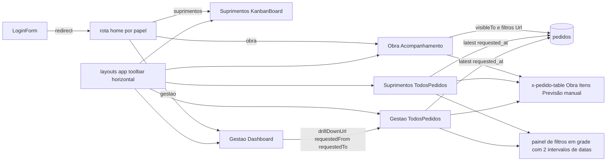
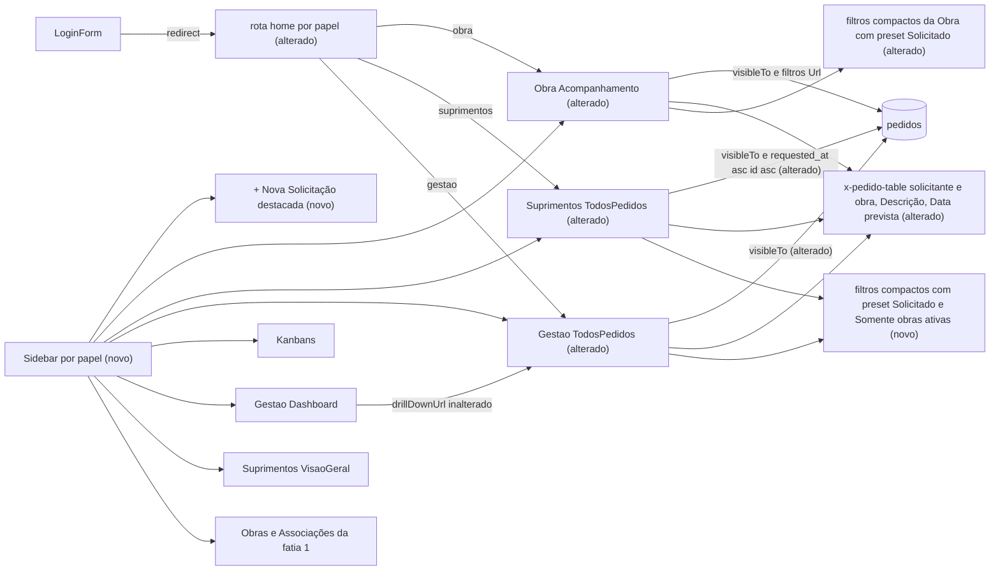

# SPEC: navegacao-sidebar-listagens

## Metadata
- Source: developer description via /plan (`.spec/features/navegacao-sidebar-listagens/.handoff/description.md`, slice 3 of 3 of the "PLANO COMPLETO — EVOLUÇÃO DO SISTEMA ALBUQUERQUE"). The 11 confirmed ACs are the source of truth. Product wording comes verbatim from `.spec/features/solicitacao-historico-finalizacao/.handoff/master-plan.md` §16–§18, §22–§28, §36–§41, with §43/§44 as constraints.
- Service: sistema_obra_mc (Laravel 13.32.0 / Livewire 4.4.5 / PostgreSQL). Single repo, single deployable.
- Tier: complete
- Version: 1.2 (2026-09-23: cross-review fixes F-01, F-11, F-15, F-16 applied from `.handoff/cross-review-fixes.md`; v1.1: clarifications NC-01..NC-06 resolved from `.handoff/clarifier-answers.md`, 2026-09-22)
- Architecture references: `AGENTS.md`; `CLAUDE.md` (§4 user stories per papel, §5 authorization layers and "Decisão travada — `visibleTo` antes de qualquer filtro", §8 "Convenções travadas de UI": `#[Url]` is the only filter state, SVG inline with no chart library, literal Tailwind classes); `docs/agents/architecture.md`; `docs/agents/domain_rules.md`; `docs/agents/api_contracts.md` ("Listing query-string contract"); `docs/agents/coding_guidelines.md` (§2, §4, §5, §10, §11).
- Upstream contracts (read, not re-specified):
  - Slice 1 `.spec/features/obras-associacoes-cadastro-convites/SPEC.md` v1.3 + `PLAN.md`: obra status `a_iniciar | em_andamento | concluido`, "ativa" ⇔ status ≠ Concluído through the single `Obra::active()` / `ObraStatus::isActive()` definition (slice 1 RF-03, CT-01); ability `manage-obras` = exactly `gestao` + `suprimentos` (slice 1 CT-03, PLAN T08); routes `obras.index` (`GET /obras`), `obras.create` (`GET /obras/nova`), `obras.edit` (`GET /obras/{obra}/editar`) and `associacoes.index` (`GET /associacoes`), all inside `['auth','active']` + `can:manage-obras`, outside the papel prefixes (slice 1 PLAN T10, T16); toolbar entries "Obras" and "Associações" (slice 1 UI-08, PLAN T23); `manage-users` stays Gestão-only (slice 1 RF-37).
  - Slice 2 `.spec/features/solicitacao-historico-finalizacao/SPEC.md` v1.2 (markers NC-01..NC-10 resolved in `.spec/features/solicitacao-historico-finalizacao/.handoff/clarifier-answers.md`) + `PLAN.md` ("Outbound contract surface"): outbound CT-05 = ability `create-pedido` (exactly `obra` + `suprimentos`) and routes `obra.nova-solicitacao` (`GET /obra/nova-solicitacao`, kept) and `suprimentos.nova-solicitacao` (`GET /suprimentos/nova-solicitacao`), both bound to `App\Livewire\Pedidos\NovaSolicitacao` (slice 2 PLAN T13, T15); CT-06 = column `pedidos.data_prevista` + presentation point `Pedido::dataPrevistaLabel()` / `Pedido::presentDataPrevista()` (T02, T07); CT-07 = column `pedidos.obra_reference` + presentation point `Pedido::obraLabel()` + constant `Pedido::OUTRA_LABEL`, "Outra" = `obra_id IS NULL` (T02, T07, T10); CT-08 = `StatusSlug::Finalizado`, `StatusSlug::terminal()` / `terminalValues()` / `isTerminal()`, `Pedido::visibleTo` extended for "Outra" (T04, T08, T09, T11). Timezone boundary: `App\Support\LocalTime` (`LocalTime::TIMEZONE = 'America/Sao_Paulo'`, `LocalTime::toLocal()`, slice 2 PLAN T01) and the single local-day period class that slice 2 introduces for the Dashboard period filter (cross-review decision F-01; name fixed by the slice 2 PLAN: `App\Domain\Pedidos\RequestedPeriodFilter`, created in slice 2 T38 (CT-10), extended here, never recreated). The slice-2 resolutions this SPEC depends on are: slice-2 NC-01 (the listing "Previsão" is the automatic Data prevista, +3 dias úteis; the manual "Previsão de entrega" stays only in the detail), slice-2 NC-02 (b) (timestamps stored in UTC, "day"/"Hoje" computed in America/Sao_Paulo at the edge), slice-2 NC-09 (Finalizado is a status after Entregue, listed normally from the `statuses` table).
- Execution order: slice 1 → slice 2 → slice 3. None of slices 1/2 is in the working tree yet (`routes/web.php` has no `obras.*`, `associacoes.*` or Suprimentos Nova Solicitação route; `app/Models/Obra.php` still has `is_active`).
- Init chain: not used (`.spec/init/*` describes the discontinued Next.js/Supabase stack).
- `.ai/rules/` does not exist in the repository (checked 2026-09-22).

### Architecture rules this SPEC inherits

| Rule | Source |
|---|---|
| Routes bind to full-page Livewire components. Authorization is layered: `auth` → `active` → `can:` route gate → `mount()` re-check → policy → Action guard. Navigation markup is never an authorization layer | `CLAUDE.md` §5 "Camadas"; `docs/agents/architecture.md` "Layer responsibilities", "Request pipeline"; `docs/agents/coding_guidelines.md` §2 |
| Listing filter state is `#[Url(except: <default>)]` only; `mount()` never reads a request parameter; "Limpar filtros" leaves a clean URL; legacy drill-down names (`atrasado`, `pendente`, `requestedFrom`, `requestedTo`) keep resolving | `CLAUDE.md` §8 "Convenções travadas de UI"; `docs/agents/coding_guidelines.md` §5; `docs/agents/api_contracts.md` "Listing query-string contract"; `tests/Feature/Compliance/FilterUrlStateComplianceTest.php` |
| `Pedido::visibleTo` opens every listing query in the same statement, before search, filters, ordering and pagination; a user filter may only narrow the set | `CLAUDE.md` §5 "Decisão travada"; `docs/agents/coding_guidelines.md` §4; `tests/Feature/Compliance/ObraVisibleToGuardTest.php` |
| Atraso/pendente/prazo come only from `app/Domain/Pedidos/*Classifier`; no formula re-derived in components or Blade | `docs/agents/domain_rules.md` "Atraso, pendência, prazo"; `docs/agents/coding_guidelines.md` §5 |
| Tailwind classes are literal (no safelist); Blade never uses `{!! !!}`; charts/icons as inline SVG, no new runtime dependency | `CLAUDE.md` §8; `docs/agents/coding_guidelines.md` §11; `tests/Feature/Compliance/BuiltAssetsUtilitiesTest.php`, `tests/Feature/Security/BladeEscapingTest.php` |
| User-facing text in PT-BR; brand only through `config('app.name')` | `docs/agents/coding_guidelines.md` §10; `tests/Feature/Compliance/BrandIdentityComplianceTest.php` (e) |
| Visual identity: no gradients, no pill buttons, MC signature only on the auth layout; **if a sidebar is ever added**, it is white/light, red/wine only for the active item, icons and details, never an entirely red sidebar | `.spec/features/ajustes-finais-albuquerque/SPEC.md` UI-07 (N/A until now, "becomes binding only if a sidebar is ever added") and §19 of that brief; `BrandIdentityComplianceTest.php` |
| PHP 8.4-compatible code, Pint, Pest, no new Composer/npm dependency without approval, tests are updated, never deleted | `CLAUDE.md` §2, §8; `AGENTS.md` |

## Context

Today navigation is a horizontal toolbar inside the top bar of `resources/views/layouts/app.blade.php` (items built by a `match` on `role->slug`, lines 17-37; `<nav aria-label="Navegação principal">`, lines 47-60; logout form, lines 70-75). The header comment and `BrandIdentityComplianceTest.php:128-140` (test "(f) … layouts contain no sidebar") pin the absence of a sidebar (`<aside`). `/home` (`routes/web.php:46-53`) sends `obra` → `obra.pedidos.index`, `suprimentos` → `suprimentos.kanban`, `gestao` → `gestao.dashboard`.

The three pedido listings (`App\Livewire\Obra\Acompanhamento`, `App\Livewire\Suprimentos\TodosPedidos`, `App\Livewire\Gestao\TodosPedidos`) share `x-pedido-table` (`resources/views/components/pedido-table.blade.php`). Its columns are `Código, Obra, Itens, Solicitado em, Data necessária, Status, Prioridade, Responsável, Previsão, Atraso` (line 9); "Previsão" shows the manual `expected_delivery_at` (lines 40, 82); the requester is not shown and not eager-loaded. All three order by `latest('requested_at')` (Acompanhamento `:99`, Suprimentos `TodosPedidos.php:129`, Gestão `TodosPedidos.php:179`) with no tie-breaker. The Suprimentos and Gestão filter panels are 4-column grids with two permanently exposed date ranges ("Data necessária" and "Solicitado", `resources/views/livewire/suprimentos/todos-pedidos.blade.php:33-123`). Only Acompanhamento opens its query with `visibleTo` (`Acompanhamento.php:78`); the other two open with `Pedido::query()` (for `suprimentos`/`gestao` `visibleTo` is the identity, `app/Models/Pedido.php:41-48`). The Gestão dashboard drill-down (`app/Livewire/Gestao/Dashboard.php:79-90`) builds `/gestao/pedidos?requestedFrom=…&requestedTo=…&<criterion>=true`.

Slices 1 and 2 add screens (Obras, Associações, Nova Solicitação for Suprimentos) as provisional toolbar entries and publish the data this slice displays (Data prevista, canonical obra/referência, Finalizado, "Outra" visibility). This slice replaces the toolbar with a role-aware sidebar, moves the Suprimentos and Gestão landing page to Pedidos, and reworks the three listings (identification, Descrição, Previsão, ordering, compact filters, "Solicitado" presets, "Somente obras ativas") plus the cross-cutting responsive pass.

## AS IS — Estado atual

Hoje a navegação é uma toolbar horizontal no topo, e Suprimentos e Gestão aterrissam no Kanban e no Dashboard. As três listagens usam a mesma tabela, que não mostra o solicitante, chama a descrição de "Itens" e usa a previsão manual. Os painéis de filtro expõem permanentemente dois intervalos de datas.

## TO BE — Estado proposto

A sidebar por papel substitui a toolbar e destaca "+ Nova Solicitação" para Obra e Suprimentos (RF-01..RF-08, UI-01..UI-04, CT-02). A rota home passa a levar Suprimentos e Gestão a Pedidos (RF-09, CT-01). A tabela compartilhada mostra solicitante e obra, "Descrição" e a Data prevista (RF-10..RF-13, UI-05). A listagem de Suprimentos ganha ordenação ascendente determinística (RF-14). Os filtros compactos, o preset "Solicitado" e o filtro "Somente obras ativas" estão em RF-15..RF-23, UI-06..UI-08 e CT-03.

## Scope
- **In**:
  - Sidebar replacing the toolbar in `layouts/app.blade.php` for every authenticated screen, desktop and mobile. It indicates the current section, shows only authorized items, keeps logout and accommodates the administrative areas (Usuários, Obras, Associações). It highlights "+ Nova Solicitação" for `obra` and `suprimentos`. Per-papel content per §38–§40.
  - `/home` for `suprimentos` and `gestao` → their Pedidos listing. Visão Geral, Dashboard and both Kanbans stay reachable through the sidebar.
  - The three pedido listings:
    - "solicitante / obra-ou-referência" identification (table and cards);
    - "Itens" → "Descrição" and "Data necessária" → "Preciso para" in the shared table/card of the three listings (NC-06);
    - "Previsão" reading the slice-2 Data prevista.
  - Suprimentos listing default order: oldest → newest, deterministic, terminal pedidos mixed in (NC-03).
  - Compact, horizontal filters on the three listings (desktop), collapsed behind a "Filtros" button on mobile without overflow, with no filter removed (NC-05).
  - "Solicitado" preset filter on the three listings (NC-04): it replaces the always-visible Solicitado date range on the Suprimentos and Gestão listings and is a new axis on Acompanhamento.
  - "Somente obras ativas" filter on the Suprimentos and Gestão listings.
  - `visibleTo` opening the Suprimentos and Gestão listing queries too (identity for those papéis; uniform rule).
  - Updating (never deleting) the tests that pin the toolbar, the old homes and the "no sidebar" brand rule.
  - Cross-cutting responsive pass (§41): the sidebar, the listings and the filters of this slice, plus a browser regression of the slice 1 and slice 2 screens rendered inside the new sidebar layout.
- **Out**:
  - Everything owned by slice 1 or slice 2: obra model/status, associations, convites, Novo Cadastro, Nova Solicitação form and ability, Data prevista rule, "Outra" representation, attachments, history, observations, Entregue by Obra, romaneio, Finalizado. This slice only consumes them.
  - Any change to routes' middleware, gates, policies or Actions (the sidebar is presentation only).
  - Changing the Obra and Gestão listing default order (§24 names only Suprimentos).
  - A user-selectable sort control; an "Outra" option in the obra filter select; extending the text search to requester or reference.
  - The auth layout (`resources/views/auth/login.blade.php`: login, Novo Cadastro, convite, recovery). These screens get no sidebar. Their mobile behaviour is owned by slice 1 and only re-checked here as regression.
  - The Gestão Dashboard's own period filter: it keeps its De/Até fields, and its drill-down URLs (`requestedFrom`/`requestedTo`) keep working and resolve as "Personalizado" (NC-04, RF-18). Moving that filter to local-day bounds, and creating the single period class both consume, is owned by slice 2 (cross-review decision F-01).
  - Usuários, Obras and Associações screens are not "listagens aplicáveis" for the compact filter / preset work of §26 (NC-04). They are only covered by the responsive regression of RNF-02.

## RIGID (Non-Negotiable)

### Functional Requirements

#### Sidebar — structure and authorization (AC-9, AC-10, AC-11)

- RF-01 [Ubiquitous]: The system shall render, on every screen that uses `layouts/app.blade.php`, a sidebar as the only primary navigation. The horizontal toolbar item list is removed from the top bar. The sidebar shall contain exactly one navigation landmark `<nav aria-label="Navegação principal">`, used in desktop and mobile alike, so the landmark never appears twice in the DOM.
  - AC: for each papel, a GET of its Pedidos screen returns HTML with exactly one `aria-label="Navegação principal"` element, inside the sidebar region. The top bar (`<header>`) contains no `nav-link` item.
- RF-02 [Ubiquitous]: The system shall show a sidebar item only when the current user passes the **same ability that protects the item's route** (`is-obra`, `is-suprimentos`, `is-gestao` verified at `app/Providers/AppServiceProvider.php:37-39`; `manage-users` at `:40`; `manage-obras` from slice 1 CT-03; the Nova Solicitação ability `create-pedido` from slice 2 CT-05). The sidebar is never an authorization layer: route middleware, `mount()` checks, policies and Action guards stay exactly as they are.
  - AC: for each papel, every sidebar link GET → 200. The item sets match CT-02 exactly, with no extra item. The `route:list` middleware of every route that exists before this slice is identical before and after it. A hidden item's URL typed directly still returns the route's own 403 (e.g. `obra` → `/gestao/usuarios` 403, `suprimentos` → `/gestao/usuarios` 403).
- RF-03 [Ubiquitous]: The system shall provide the per-papel sidebar content of CT-02:
  - **Obra** (§38): "+ Nova Solicitação", "Acompanhamento". No administrative area.
  - **Suprimentos** (§39): "+ Nova Solicitação", "Pedidos", "Visão Geral", "Kanban", "Obras", "Associações".
  - **Gestão** (§40): "Pedidos", "Dashboard", "Kanban", "Obras", "Associações", "Usuários".

  An unrecognized papel gets no navigation items, but still gets the brand and logout.
  - AC: rendered item labels per papel equal the lists above as sets. `obra` sees neither "Obras", "Associações", "Usuários", "Dashboard" nor "Kanban". `gestao` sees no "+ Nova Solicitação" and no "Visão Geral". A user whose papel matches no `RoleSlug` sees 0 items and the logout control.
- RF-04 [State-Driven]: While a screen belongs to a sidebar section, the system shall mark exactly one item as current with `aria-current="page"` and the active visual state. The section of a screen is decided by route-name pattern (CT-02 "Active when"), so detail and form screens mark their parent section (a pedido detail marks "Pedidos"/"Acompanhamento", `obras.edit` marks "Obras", `gestao.usuarios.edit` marks "Usuários"). A screen outside every section marks none.
  - AC: for each route in CT-02's "Active when" column, the rendered sidebar has exactly 1 `aria-current="page"`, on the expected item. On `gestao.pedidos.show`, "Pedidos" is current and "Dashboard" is not.
- RF-05 [Ubiquitous]: The system shall keep logout in the sidebar on desktop and mobile. It stays a `POST` to route `logout` (verified at `routes/web.php:55-67`) with the CSRF token, and keeps the current effects: `logout` audit record, session invalidation, token regeneration, redirect to `login`.
  - AC: at 1440×900 and at 390×844 the "Sair" control is reachable and submits `POST /logout`. `tests/Feature/Auth/AuthenticationEventsTest.php` and the CSRF tests stay green.
- RF-06 [Ubiquitous]: The system shall show in the sidebar the brand through `config('app.name')` (linking to route `home`, verified at `routes/web.php:53`), the current user's name and papel.
  - AC: the literal "Albuquerque Engenharia" still appears in no view or `app/` file (`BrandIdentityComplianceTest` (e)). The sidebar contains `config('app.name')`, the user name and the papel name.

#### "+ Nova Solicitação" (AC-9, §10, §37)

- RF-07 [Ubiquitous]: The system shall show "+ Nova Solicitação" as the first sidebar entry, visually highlighted with the primary action style, for users passing the Nova Solicitação ability (slice 2 CT-05: exactly `obra` and `suprimentos`). It points to that papel's Nova Solicitação route: `obra.nova-solicitacao` (verified at `routes/web.php:70`) for `obra`, and `suprimentos.nova-solicitacao` (slice 2 CT-05, PLAN T15) for `suprimentos`. The action shall be findable from any page:
  - on desktop it stays within the viewport without scrolling the page, including after scrolling a long listing to the bottom;
  - on mobile it is visible without opening the navigation menu.

  `gestao` never sees it.
  - AC: at 1440×900, on a Pedidos page scrolled to the bottom, the "+ Nova Solicitação" element intersects the viewport. At 390×844, with the menu closed, it is visible and tappable. Clicking it loads the Nova Solicitação form (200) for both papéis. For `gestao`, the text "+ Nova Solicitação" appears nowhere in the layout.
- RF-08 [Ubiquitous]: The system shall remove the provisional toolbar entries added by slice 1 (UI-08: "Obras", "Associações") and slice 2 (UI-02: Suprimentos "+ Nova Solicitação"), which now live only in the sidebar. No sidebar item links to a route that does not exist.
  - AC: no `nav-link` element remains outside the sidebar. Every `route()` name used by the sidebar resolves (a test iterates CT-02 and calls `route($name)` for each).

#### Landing pages (AC-4, §22, §23)

- RF-09 [Event-Driven]: When an authenticated user requests `/home`, the system shall redirect:
  - `suprimentos` → `suprimentos.pedidos.index` (verified at `routes/web.php:76`);
  - `gestao` → `gestao.pedidos.index` (verified at `routes/web.php:84`);
  - `obra` → `obra.pedidos.index`, unchanged;
  - an unrecognized papel → 403 "Perfil de acesso não reconhecido.", unchanged.

  Visão Geral (`suprimentos.visao-geral`, verified at `routes/web.php:79`), `suprimentos.kanban` (`:78`), `gestao.dashboard` (`:83`) and `gestao.kanban` (`:86`) keep their routes, middleware and content, and stay reachable from the sidebar.
  - AC: `/home` as `suprimentos` → 302 to `/suprimentos/pedidos`. As `gestao` → 302 to `/gestao/pedidos`. As `obra` → 302 to `/obra/pedidos`. Successful login lands on those pages. The four screens above still answer 200 to their papel. `tests/Feature/Livewire/LayoutIdentityTest.php:164-168` ("a suprimentos user still lands on the Kanban") is updated to the new target, not deleted.

#### Listing content (AC-1, AC-2, AC-3)

- RF-10 [Ubiquitous]: The system shall show, for each pedido in the three listings (desktop table and mobile card), the requester and the obra-or-reference as "<requester name> / <obra representation>". The obra representation is slice 2's canonical presentation point (CT-07): the obra name, "Outra", or "Outra" + reference. It is never re-derived in this slice. The requester name is the requester user's current `name`, shown even when that user is inactive.
  - AC: a pedido by "João Silva" for "Residencial Aurora" shows the text "João Silva / Residencial Aurora" in the table row and in the card. An "Outra" pedido without reference shows "<name> / Outra". With reference "Galpão provisório", it shows "<name> / " followed by CT-07's output containing "Outra" and "Galpão provisório". An inactive requester's name still renders. The obra remains visible (no loss of the current "Obra" information).
- RF-11 [Ubiquitous]: The system shall label, in the shared listing component (`x-pedido-table`) of the three listings (Acompanhamento, Suprimentos, Gestão), desktop table and mobile card (NC-06):
  - the pedido description "Descrição" (not "Itens");
  - the needed date `needed_at` "Preciso para" (not "Data necessária").

  The Acompanhamento search placeholder becomes "Código, obra ou descrição".
  - AC: the HTML of `/obra/pedidos`, `/suprimentos/pedidos` and `/gestao/pedidos` contains the "Descrição" and "Preciso para" headers, and neither "Itens" nor "Data necessária" as a table header or card label. The card shows "Descrição" and "Preciso para" in the mobile rendering. The `/obra/pedidos` search placeholder contains no "itens".
- RF-12 [Ubiquitous]: The system shall fill the "Previsão" column (table) and field (card) of the three listings from slice 2's Data prevista presentation point (CT-06, format `dd/mm/aaaa`). The listing never recomputes it and never reads `expected_delivery_at` directly for this column. Per slice-2 NC-01 (resolved), Data prevista is automatic and fixed at creation (Data da solicitação + 3 dias úteis) and coexists with the manual "Previsão de entrega" (`expected_delivery_at`), which stays only in the pedido detail and never feeds this column.
  - AC: a pedido requested Mon 2026-09-21 shows "Previsão 24/09/2026" (slice 2 RF-10 table) in the three listings, table and card, both when `expected_delivery_at` is null and when it holds another date (e.g. 30/09/2026, which does not appear in the listing row). A compliance scan of `resources/views/components/pedido-table.blade.php` finds no `expected_delivery_at`.
- RF-13 [Ubiquitous]: The system shall keep the listings rendering without error for every pedido state published by slice 2: "Outra" pedidos with or without reference, and status Finalizado (badge per slice 2 UI-08). The status filter options come from `Status::ordered()` (the `statuses` table), so Finalizado is offered automatically. Per slice-2 NC-09 (resolved), Finalizado is a status placed after Entregue, and it appears in the status filter like any other status.
  - AC: with one "Outra" pedido (with reference), one without reference and one Finalizado pedido seeded, the three listings return 200 and render all visible rows.

#### Ordering (AC-5, §24)

- RF-14 [Ubiquitous]: The system shall order the Suprimentos listing by default by Data da solicitação ascending (`requested_at` ASC), then by `id` ASC as tie-breaker, so the order is total and stable across pages. The indicators (Total/Pendentes/Atrasados) keep counting the same filtered set. The order is literal over the whole filtered set (NC-03): terminal pedidos (Entregue, Cancelado, Finalizado) are mixed with the others by `requested_at`, with no grouping by status. Users isolate them with the existing status and pendente filters. The Obra and Gestão listings keep `requested_at` DESC.
  - AC: 3 pedidos with `requested_at` 2026-09-01, 2026-09-03 and 2026-09-02 → order 09-01, 09-02, 09-03. If the 09-01 pedido is Entregue and the others are Solicitado, the order is still 09-01, 09-02, 09-03. 12 pedidos with an identical `requested_at` → page 1 holds the 10 lowest ids ascending and page 2 the other 2. No pedido appears on both pages, and repeated requests return the same order.

#### Filters — "Solicitado" presets (AC-6, §25)

- RF-15 [Ubiquitous]: The system shall offer on the three pedido listings (NC-04) one compact control "Solicitado". On the Suprimentos and Gestão listings it replaces the permanently exposed "Solicitado" date range. On Acompanhamento it is a new filter axis, applied after `visibleTo` (RF-23). The control offers:
  - a neutral state (no period restriction, the default);
  - the presets "Hoje", "Últimos 3 dias", "Últimos 7 dias", "Último mês";
  - "Personalizado".

  The fields "De" and "Até" are rendered only while "Personalizado" is selected. The base date is Data da solicitação (`requested_at`), the column the current "Solicitado" range filters (verified at `app/Livewire/Suprimentos/TodosPedidos.php:178-184`).
  - AC: on load, neither "De" nor "Até" is in the DOM. Choosing "Personalizado" renders both. Choosing any other option removes them. The control lists exactly the neutral option + the 5 options, in the order above.
- RF-16 [Event-Driven]: When the user selects a preset, the system shall apply its period immediately, with no further action, and reset to page 1. The window of each preset is computed from the current date at query time (a shared URL with a preset means the same relative window on the day it is opened). The "current date" and the calendar day of `requested_at` are taken in America/Sao_Paulo; `requested_at` stays stored in UTC and is converted only at the edge (slice-2 NC-02 (b), resolved). Each window is a closed range of whole calendar days ending on today (NC-01):

  | Preset | Window (calendar days, America/Sao_Paulo) |
  |---|---|
  | Hoje | today |
  | Últimos 3 dias | today and the 2 previous days |
  | Últimos 7 dias | today and the 6 previous days |
  | Último mês | the last 30 days including today (today and the 29 previous days) |
  | Personalizado | De/Até as entered, each read as a local calendar day in America/Sao_Paulo (RF-18) |
  - AC: with the clock at 2026-09-22 (America/Sao_Paulo) and pedidos requested on 09-22, 09-21, 09-20, 09-19, 09-16, 09-15, 08-24, 08-23 and 08-01 (local dates):
    - "Hoje" lists only 09-22;
    - "Últimos 3 dias" lists 09-22, 09-21, 09-20 and excludes 09-19;
    - "Últimos 7 dias" lists 09-22 down to 09-16 and excludes 09-15;
    - "Último mês" lists 09-22 down to 08-24 and excludes 08-23 and 08-01.
  - AC (timezone edge): a pedido with `requested_at` = 2026-09-22T02:30:00Z (= 2026-09-21 23:30 in São Paulo) is not in "Hoje" at 2026-09-22 12:00 local, and is in "Hoje" when the clock is 2026-09-21 local.
  - AC: each preset updates the listing (and the Suprimentos indicators) without a submit, and resets to page 1.
- RF-17 [Ubiquitous]: The system shall keep the Solicitado state in the URL through `#[Url]` only (CT-03):
  - the selected preset is one `#[Url]` property whose `except:` equals its neutral default;
  - custom dates stay in the existing `requestedFrom` / `requestedTo` properties, under their existing names (Suprimentos, Gestão). Acompanhamento gains properties with the same names and the same `except: ''`.

  While a preset other than "Personalizado" is active, `requestedFrom`/`requestedTo` are not applied and are absent from the URL. "Limpar filtros" returns the control to neutral and removes every Solicitado parameter from the URL.
  - AC: selecting "Últimos 7 dias" → the URL contains the preset parameter and neither `requestedFrom` nor `requestedTo`. After "Limpar filtros" the query string has no Solicitado parameter. `FilterUrlStateComplianceTest` is extended with the new property (name and `except`) and still asserts that no listing component reads the request.
- RF-18 [Event-Driven]: When a listing URL carries `requestedFrom` and/or `requestedTo` without a preset parameter (the Gestão dashboard drill-down built by `Dashboard::drillDownUrl`, verified at `app/Livewire/Gestao/Dashboard.php:79-90`, or a bookmarked link), the system shall treat it as "Personalizado", render "De"/"Até" with those values, and filter by them.
  "Personalizado" (whether chosen in the control or resolved from the URL) compares `requested_at` against **local-day bounds**: the start of day "De" and the end of day "Até" in America/Sao_Paulo, converted to UTC before the comparison. No UTC-day comparison (`whereDate` on the stored UTC value) remains in the three listings (cross-review decision F-01). The conversion is done by the **same single period class** that slice 2 introduces for the Gestão Dashboard period filter (`RequestedPeriodFilter` or the equivalent name fixed by the slice 2 PLAN). There is one implementation: this slice consumes it and never re-implements the bounds, so the drill-down and the KPI it came from move together.
  The Gestão Dashboard keeps its own De/Até period fields (NC-04). Their day semantics are owned by slice 2 (local day, same class).
  - AC: `tests/Feature/Livewire/DashboardDrillDownTest.php` passes with exact parity: the drill-down rows equal the clicked KPI count for the same filters. Opening `/gestao/pedidos?requestedFrom=2026-06-01&requestedTo=2026-06-30&atrasado=true` shows "Personalizado" selected, De = 01/06/2026, Até = 30/06/2026, and the rows whose `requested_at` falls on 01/06..30/06 in local time.
  - AC (timezone edge): a pedido with `requested_at` = 2026-09-22T02:30:00Z (= 2026-09-21 23:30 in São Paulo) is **excluded** by Personalizado De = Até = 2026-09-22 and **included** by De = Até = 2026-09-21, on the three listings. This matches the "Solicitado em" day shown in the row and the "Hoje" preset (RF-16).
  - AC: a static scan of the three listing components and of the shared filter code finds no `whereDate('requested_at'`, and the Personalizado De/Até bounds are obtained only from the slice-2 period class.
- RF-19 [Unwanted]: If the preset parameter holds an unknown value (forged URL), then the system shall treat it as the neutral state and answer 200 without a server error. If it holds a relative preset together with `requestedFrom`/`requestedTo`, then the preset wins and the custom dates are ignored.
  - AC: `?<preset>=xyz` → 200 and the unfiltered row set. `?<preset>=<Hoje>&requestedFrom=2020-01-01` → the "Hoje" rows only.

#### Filters — "Somente obras ativas" (AC-8, §28)

- RF-20 [Ubiquitous]: The system shall offer on the Suprimentos and Gestão listings (not on Acompanhamento) a filter "Somente obras ativas", off by default and persisted by `#[Url]` (CT-03). While it is on, the listing and the Suprimentos indicators include only pedidos whose obra is active per slice 1's single definition (status ≠ Concluído, `Obra::active()` / `ObraStatus::isActive()`), never re-implemented here. Pedidos without obra ("Outra", slice 2 CT-02/CT-07) are **included** while the filter is on (NC-02): the filter excludes only pedidos whose obra is Concluída. The rule is the same in both listings and stated in the control's help text (UI-08).
  - AC: obras A (Em andamento), B (A iniciar), C (Concluído), one pedido each, plus one "Outra" pedido → filter on lists the pedidos of A, B and "Outra", not C. Filter off lists all four. The Suprimentos indicators follow the listed set. `obraId = C` with the filter on → empty listing (intersection, never widened).
- RF-21 [Ubiquitous]: The system shall make "Somente obras ativas" a read-only restriction of the query. Toggling it writes nothing: no `pedidos`, `pedido_events`, `obras` or `obra_profile` row changes, and `updated_at` values stay the same.
  - AC: row counts and `max(updated_at)` of those 4 tables are identical before and after toggling the filter on and off.

#### Filters — compact layout and visibility rule (AC-6, AC-7, §26, §27)

- RF-22 [Ubiquitous]: The system shall keep every filter axis that exists today on each listing:
  - Acompanhamento: busca, obra, status, somente com atraso, plus Solicitado (new, RF-15);
  - Suprimentos and Gestão: busca, somente com atraso, obra, status, prioridade, responsável, Preciso para De/Até, Solicitado (now RF-15), plus "Somente obras ativas" (RF-20);
  - Gestão's hidden drill-down parameters `pendente` and `entregue`;
  - "Limpar filtros" on the three listings.

  It shall keep their `#[Url]` names (`docs/agents/api_contracts.md` "Listing query-string contract"), their `except:` defaults and the rule that changing any filter resets to page 1. Controls may be regrouped or placed behind a disclosure, but every axis stays usable with at most one extra interaction.
  - AC: for each listing, each axis above filters the rows as today (existing listing tests pass). `FilterUrlStateComplianceTest` keeps every pinned name. The Gestão listing still renders no `wire:click` (read-only marker kept).
- RF-23 [Ubiquitous]: The system shall keep `Pedido::visibleTo(Auth::user())` as the first scope, in the statement that opens the query, in Acompanhamento. It shall also open the Suprimentos and Gestão listing queries (and the builder shared with the Suprimentos indicators) the same way. Every filter of this slice, including RF-16 and RF-20, is applied after it and only narrows.
  - AC: `ObraVisibleToGuardTest` and `PedidoVisibleToScopeTest` pass. A static check extended to `app/Livewire/Suprimentos/TodosPedidos.php` and `app/Livewire/Gestao/TodosPedidos.php` finds `visibleTo` in each static `Pedido::` statement. For `suprimentos`/`gestao` the row sets for any filter combination are identical to before this change. An `obra` user with a forged `obraId` of a foreign obra gets 0 rows.

#### Non-regression (AC-11, §44)

- RF-24 [Ubiquitous]: The system shall preserve every existing protection listed in §44 and inherited from slices 1/2:
  - server-side authorization and route middleware;
  - obra isolation (`visibleTo`, `PedidoPolicy`);
  - inactive-user blocking (`active` on every authenticated route and on `/livewire/update`);
  - `AuthenticateSession`, rate limiters, e-mail normalization;
  - the append-only trails (`pedido_events`, `user_admin_events`, `authentication_events`, slice 1's trails).

  Tests that pin the toolbar, the old homes or the "no sidebar" rule are **updated** to the new rules, never deleted:
  - `LayoutIdentityTest.php` (Gestão "exactly 4 nav links", `:45`, as already raised to 6 by slice 1 T23; active-state tests `:67-76`, `:137-161`; home `:164-168`);
  - `UsuariosIndexTest.php:40` ("the gestao nav branch has exactly 4 items");
  - `BrandIdentityComplianceTest.php:128-140` (see UI-04);
  - `tests/Browser/DemoRoteiroTest.php` landing steps (`:83`, `:135`);
  - `EnsureUserIsActiveTest.php:109-126` route iteration.
  - AC: the full suite (`php artisan test --compact`) and `vendor/bin/pest tests/Browser` pass. `git diff --stat` shows no deleted test file, and the number of `test(`/`it(` cases in each touched test file does not decrease.
- RF-25 [Ubiquitous]: The system shall have one end-to-end Feature test (not Browser) of the master plan §45 flow, run against the integrated state of slices 1–3 (cross-review F-16). Each step goes through the real routes/components and Actions, never through direct model writes:
  1. a visitor creates an account through Novo Cadastro (slice 1): papel `obra`, zero obras;
  2. that user's Nova Solicitação shows the empty state and allows no submission;
  3. a `suprimentos` user associates the new user with an active obra in Associações (slice 1). The same test, or a dataset variant, also covers the association made by a `gestao` user;
  4. the new user logs in, opens "+ Nova Solicitação" from the sidebar and creates a pedido for that obra (slice 2);
  5. the pedido appears in the user's Acompanhamento, identified as "<requester name> / <obra name>" (RF-10).
  - AC: the test exists under `tests/Feature/`, passes in `php artisan test --compact`, and asserts 1 pedido with the new user as requester and the associated obra, 1 `criacao_pedido` event, and the row in Acompanhamento. Before step 3, a forged creation for that obra fails on the association rule.

### UI Requirements

- UI-01 [State-Driven]: While the viewport is desktop width (1440×900), the sidebar shall be permanently visible on the left, fixed or sticky in height, with the main content to its right and no horizontal document overflow. While the viewport is mobile width (390×844), the sidebar shall be hidden behind a "Menu" button in a compact top bar. The top bar also carries the brand and, for `obra`/`suprimentos`, "+ Nova Solicitação" (RF-07). The button opens the sidebar as an overlay drawer. At 820×1180 either rendering is acceptable, provided RNF-02 holds.
  - AC: at 1440×900 the `nav` is visible without interaction. At 390×844 it is not visible until "Menu" is activated, and then it is. `scrollWidth ≤ clientWidth` of the document at the 3 viewports, menu closed and open.
- UI-02 [Ubiquitous]: The mobile menu control shall be keyboard- and screen-reader-operable:
  - it is a `<button>` with an accessible name, `aria-expanded` reflecting the state and `aria-controls` pointing to the sidebar;
  - "Escape" and a close control close the drawer and return focus to the "Menu" button;
  - following a link closes it;
  - every sidebar item has the visible focus ring used by the audit of `tests/Browser/ResponsiveIdentityTest.php`.
  - AC: a browser test at 390×844 opens with keyboard (Enter), sees `aria-expanded="true"`, presses Escape, sees `aria-expanded="false"` and focus on the button. Focus-ring audit passes for sidebar links.
- UI-03 [Ubiquitous]: The sidebar shall follow the Albuquerque identity binding rule for sidebars (`.spec/features/ajustes-finais-albuquerque/SPEC.md` UI-07 / §19):
  - white/light surface;
  - the brand red/wine (`primary` token) only for the active item, the "+ Nova Solicitação" action, icons and details, never as the sidebar fill;
  - no gradients;
  - no MC signature;
  - literal Tailwind classes;
  - icons, if any, as inline SVG (no icon package).
  - AC: the sidebar container's computed background is the `surface` token (not `primary`). `BrandIdentityComplianceTest` gradient/signature/pill rules pass. `BuiltAssetsUtilitiesTest` finds every sidebar utility in the built CSS. `package.json`/`composer.json` gain no dependency.
- UI-04 [Ubiquitous]: The brand-compliance rule "(f) … layouts contain no sidebar" shall be **replaced in place** by the new rule:
  - `resources/views/layouts/app.blade.php` contains exactly one sidebar region (an `<aside>` holding the "Navegação principal" `nav`);
  - the auth layout `resources/views/auth/login.blade.php` contains none;
  - the pill-button assertion of the same test stays unchanged.

  The layout header comment that says "no sidebar (UI-07)" is updated accordingly.
  - AC: the updated test (f) asserts `substr_count(<app layout>, '<aside') === 1` and `0` for the auth layout, and still asserts no `rounded-full` on `.btn-primary`/`.btn-secondary`.
- UI-05 [Ubiquitous]: The shared listing (`x-pedido-table`) shall render the RF-10 identification as one table column and as a prominent line in each card (in the card, the line that shows the obra today, `pedido-table.blade.php:70`). The column set is declared once and header, cells and empty-state `colspan` derive from it (as today, line 9). The "Descrição" label (RF-11) and "Previsão" (RF-12) render in both table and card.
  - AC: header count = cell count per row = empty-state `colspan`. The identification text appears once per row and once per card.
- UI-06 [State-Driven]: While the viewport is desktop width (≥ 1280 px), the filters of each listing shall render as a compact horizontal bar in the order of the master plan's example: [Obra] [Status] [Prioridade] [Solicitado] [Responsável] [Limpar], with the axes a listing does not have omitted (Acompanhamento: [Obra] [Status] [Solicitado] [Limpar]). Busca, "Somente com atraso", "Somente obras ativas" and "Data necessária" stay in the bar or behind a single "Mais filtros" disclosure, whose state shows how many of its filters are active. Every control keeps a visible label or an accessible name. The vertical-space target for "diminuir significativamente" is (NC-05):
  - the primary controls above share one line;
  - the whole filter bar, disclosure closed and "Personalizado" not selected, occupies at most 2 lines.
  - Visual reference (F-15): §26 of the master plan asks to follow "a segunda referência visual fornecida". That image is **not** in the repository or in any slice artifact. Until the developer attaches it under `.spec/features/navegacao-sidebar-listagens/.handoff/`, the contract for the filter layout is this UI-06 text (control order above) plus the NC-05 measurable criteria. The implementation and its tests are judged only against them. An image attached later that differs from this text is a change request, not a defect of this slice.
  - AC: at 1280×800 and at 1440×900, on the three listings, the controls listed above for that listing share one row (their bounding boxes have equal `top` within 4 px). The set of distinct `top` values (within 4 px) of all visible filter controls, disclosure closed and "Personalizado" not selected, has at most 2 elements. Every `select`/`input` has a `label[for]` or `aria-label`.
- UI-07 [State-Driven]: While the viewport is mobile width (390×844), the filters shall be collapsed behind a "Filtros" button (NC-05), closed by default, whose text shows the count of active filters (e.g. "Filtros (2)"; no count when none is active). The button is a `<button>` with `aria-expanded` reflecting the state. Open or closed, the filters cause no horizontal overflow, and every control is ≥ 44 px tall for touch. While the panel is closed, the first pedido card is not pushed below the first viewport.
  - AC: at 390×844, on load no filter `select` is visible and the "Filtros" button is. With `?statusId=<id>&atrasado=true` it reads "Filtros (2)". Document `scrollWidth ≤ clientWidth` with the panel open and closed. With the panel closed, the first `[data-testid="pedido-card"]` top is < 844 px. Each filter control's height is ≥ 44 px.
- UI-08 [Ubiquitous]: The "Somente obras ativas" control shall be a labelled checkbox or toggle with the exact label "Somente obras ativas" and a one-line PT-BR help text stating that pedidos of obras concluídas are hidden and pedidos "Outra" (without obra) keep being listed (NC-02).
  - AC: the label text is exact. The help text is present, mentions "concluídas" and "Outra", and is identical on the Suprimentos and Gestão listings.

### Contracts

- CT-01 (`/home` landing map, route `home`, `routes/web.php:46-53`):

  | Papel | Redirect target |
  |---|---|
  | `obra` | `obra.pedidos.index` (unchanged) |
  | `suprimentos` | `suprimentos.pedidos.index` (was `suprimentos.kanban`) |
  | `gestao` | `gestao.pedidos.index` (was `gestao.dashboard`) |
  | other | 403 "Perfil de acesso não reconhecido." (unchanged) |

- CT-02 (Sidebar item catalogue; the label is exact, visibility = the ability protecting the target route):

  | Papel | Order | Label | Target route | Visible iff | Active when (route pattern) |
  |---|---|---|---|---|---|
  | obra | 1 | + Nova Solicitação | `obra.nova-solicitacao` (verified at `routes/web.php:70`; rebound by slice 2 PLAN T15) | `create-pedido` (slice 2 CT-05) | `obra.nova-solicitacao` |
  | obra | 2 | Acompanhamento | `obra.pedidos.index` (`routes/web.php:71`) | `is-obra` | `obra.pedidos.*` |
  | suprimentos | 1 | + Nova Solicitação | `suprimentos.nova-solicitacao` (slice 2 PLAN T15, `GET /suprimentos/nova-solicitacao`) | `create-pedido` (slice 2 CT-05) | `suprimentos.nova-solicitacao` |
  | suprimentos | 2 | Pedidos | `suprimentos.pedidos.index` (`routes/web.php:76`) | `is-suprimentos` | `suprimentos.pedidos.*` |
  | suprimentos | — | Visão Geral | `suprimentos.visao-geral` (`routes/web.php:79`) | `is-suprimentos` | `suprimentos.visao-geral` |
  | suprimentos | — | Kanban | `suprimentos.kanban` (`routes/web.php:78`) | `is-suprimentos` | `suprimentos.kanban` |
  | suprimentos | — | Obras | `obras.index` (slice 1 PLAN T10, `GET /obras`) | `manage-obras` | `obras.*` (`obras.index`, `obras.create`, `obras.edit`) |
  | suprimentos | — | Associações | `associacoes.index` (slice 1 PLAN T16, `GET /associacoes`) | `manage-obras` | `associacoes.*` |
  | gestao | 1 | Pedidos | `gestao.pedidos.index` (`routes/web.php:84`) | `is-gestao` | `gestao.pedidos.*` |
  | gestao | — | Dashboard | `gestao.dashboard` (`routes/web.php:83`) | `is-gestao` | `gestao.dashboard` |
  | gestao | — | Kanban | `gestao.kanban` (`routes/web.php:86`) | `is-gestao` | `gestao.kanban` |
  | gestao | — | Obras | `obras.index` (slice 1 PLAN T10) | `manage-obras` | `obras.*` (`obras.index`, `obras.create`, `obras.edit`) |
  | gestao | — | Associações | `associacoes.index` (slice 1 PLAN T16) | `manage-obras` | `associacoes.*` |
  | gestao | — | Usuários | `gestao.usuarios.index` (`routes/web.php:88-89`) | `manage-users` | `gestao.usuarios.*` |
  | all | last | Sair | `POST logout` (`routes/web.php:55-67`) | authenticated | — |

  "—" order = FLEXIBLE (grouping suggestion in FLEXIBLE). Route and ability names are the exact names fixed by the slice 1 PLAN (T08, T10, T16) and the slice 2 PLAN "Outbound contract surface" (CT-05: T13, T15); none of them is in code until those slices are executed. If an upstream PLAN is revised to a different name, this table follows the upstream name. The label, ability semantics and section do not change.

- CT-03 (Listing query-string additions, extending `docs/agents/api_contracts.md` "Listing query-string contract"; all `#[Url(except: <default>)]`, all omitted from the URL at default):

  | Param (name FLEXIBLE, then pinned in `FilterUrlStateComplianceTest`) | Acompanhamento | Suprimentos | Gestão | Values | Default |
  |---|---|---|---|---|---|
  | Solicitado preset | ✓ (NC-04) | ✓ | ✓ | neutral, `hoje`, `3d`, `7d`, `mes`, `personalizado` (value spelling FLEXIBLE); windows per RF-16 | neutral (omitted) |
  | `requestedFrom` / `requestedTo` (existing names, kept; new on Acompanhamento with the same names) | ✓ (NC-04) | ✓ | ✓ | `Y-m-d`, read as a local day in America/Sao_Paulo and converted to UTC bounds through the slice-2 period class; applied only when preset = Personalizado or preset absent (RF-18) | `''` |
  | Somente obras ativas | — | ✓ | ✓ | boolean | `false` |

  Every other existing parameter (`search`, `obraId`, `statusId`, `atrasado`, `priorityId`, `responsibleId`, `neededAtFrom`, `neededAtTo`, `pendente`, `entregue`) keeps its name, semantics and default. Pagination stays 10 per page. Default order: Suprimentos `requested_at` ASC, `id` ASC (RF-14); Obra and Gestão unchanged.

- CT-04 (Consumed from slice 2, not redefined, exact names from the slice 2 PLAN "Outbound contract surface"):
  - CT-05: ability `create-pedido`; routes `obra.nova-solicitacao`, `suprimentos.nova-solicitacao` (`App\Livewire\Pedidos\NovaSolicitacao`);
  - CT-06: `pedidos.data_prevista`; `Pedido::dataPrevistaLabel()` / `Pedido::presentDataPrevista()`;
  - CT-07: `pedidos.obra_reference`; `Pedido::obraLabel()`; `Pedido::OUTRA_LABEL`; "Outra" = `obra_id IS NULL`;
  - CT-08: `StatusSlug::Finalizado`; `StatusSlug::terminal()` / `terminalValues()` / `isTerminal()`; `Pedido::visibleTo` for "Outra";
  - timezone: `App\Support\LocalTime` (`TIMEZONE`, `toLocal()`), and the single local-day period class (F-01) consumed by RF-18.

  Consumed from slice 1: CT-01 obra status / `Obra::active()` / `ObraStatus::isActive()`; CT-03 ability `manage-obras`; routes `obras.index`, `obras.create`, `obras.edit`, `associacoes.index` (PLAN T10/T16).

### Non-Functional Requirements

- RNF-01 (query budget): rendering any of the three listings issues a number of SQL queries that does not grow with the number of pedidos on the page or with the number of sidebar items. `requester` is eager-loaded together with the relations already loaded (`obra`, `status`, `priority`, `responsible`), and gates in the sidebar resolve from the already-loaded user papel. Asserted in the style of `tests/Feature/Performance/QueryCountTest.php`: the same count for 1 and for 10 pedidos per page, for each papel.
- RNF-02 (responsive, §41): at 1440×900, 820×1180 and 390×844 (the viewports of `tests/Browser/ResponsiveIdentityTest.php:22-26`), the following show no horizontal document overflow, keep the primary control inside the viewport, and keep labelled controls with a visible focus ring:
  - the sidebar (closed and open on mobile) for the three papéis;
  - the three listings with filters (Personalizado open included);
  - as integrated regression inside the new layout, the slice 1 screens (`/obras`, Obra form with Convites, `/associacoes`) and slice 2 screens (Nova Solicitação for `obra` and `suprimentos` with "Outra" and file list, the three pedido detail screens with history, observation, Entregue, romaneio and Finalizar controls);
  - the pre-existing screens (Kanbans, Dashboard, Visão Geral, Usuários list/form).

  Login, Novo Cadastro and convite (auth layout) are re-run from their existing browser tests.
- RNF-03 (no new dependency): no Composer or npm package is added. The drawer uses Alpine (bundled with Livewire 4.4.5), icons are inline SVG, and there is no chart or icon library (`CLAUDE.md` §8). PHP 8.4-compatible code; `vendor/bin/pint --dirty --format agent` clean.
- RNF-04 (styling): all new classes are literal; the built CSS contains every utility used by the sidebar and filters (`BuiltAssetsUtilitiesTest`); no `{!! !!}` (`BladeEscapingTest`).
- RNF-05 (language): every new label and help text is PT-BR, with the exact strings "+ Nova Solicitação", "Pedidos", "Acompanhamento", "Visão Geral", "Kanban", "Dashboard", "Obras", "Associações", "Usuários", "Sair", "Solicitado", "Hoje", "Últimos 3 dias", "Últimos 7 dias", "Último mês", "Personalizado", "De", "Até", "Somente obras ativas", "Descrição", "Preciso para", "Previsão", "Filtros", "Limpar filtros".
- RNF-06 (no data change): this slice adds no migration and changes no stored data. `php artisan migrate` after this slice reports "Nothing to migrate" relative to slices 1/2 (§43).

## FLEXIBLE (Implementation Suggestions)

- **Layout**: restructure `layouts/app.blade.php` into `
` + `<aside class="… bg-surface border-r border-border lg:sticky lg:top-0 lg:h-screen">` + `<main>`. Mobile: `x-data="{ open: false }"` on the root; the `aside` becomes `fixed inset-y-0 left-0 z-40 -translate-x-full` / `translate-x-0` on `open`, with a backdrop button that closes it; `@keydown.escape.window="open = false"` and `x-ref` for returning focus. Keep one `nav` element for both modes.
- **Item catalogue**: move the per-papel `match` from the layout into a small presenter (e.g. `App\Support\Navigation\SidebarItems::for(User $user): array<int, array{label: string, route: string, active: string, ability: string, highlight: bool}>`), filtered with `Gate::forUser($user)->allows($ability)`. Tests then iterate the same list as RF-02/CT-02. Alternatively keep it in Blade with `@can` per item.
- **Grouping**: Suprimentos: [+ Nova Solicitação] · Operação (Pedidos, Kanban, Visão Geral) · Cadastros (Obras, Associações). Gestão: Operação (Pedidos, Kanban, Dashboard) · Administração (Obras, Associações, Usuários). Sair at the bottom with the user name/papel.
- **CSS tokens**: add `.sidebar-link` / `.sidebar-link-active` components next to `.nav-link` (`resources/css/app.css:174-180`), with `bg-primary/10 text-primary` for the active item; reuse `.btn-primary` for "+ Nova Solicitação". Keep `.nav-link*` while tests reference it, or migrate `ThemeTokensTest.php:188-190` to the new names (update, not delete).
- **Preset property**: `#[Url(as: 'solicitado', except: '')] public string $requestedPreset = ''` with a `RequestedPeriodPreset` string enum (`Hoje = 'hoje'`, `Ultimos3Dias = '3d'`, `Ultimos7Dias = '7d'`, `UltimoMes = 'mes'`, `Personalizado = 'personalizado'`) exposing `range(CarbonImmutable $today): array{0: CarbonImmutable, 1: CarbonImmutable}` (one definition, unit-tested with `travelTo()`), where `$today` is `now('America/Sao_Paulo')` and the local-day bounds are converted to UTC before comparing with `requested_at`. Used by all three listings (also Acompanhamento). `updatedRequestedPreset()` clears `requestedFrom`/`requestedTo` when the new value is not `personalizado`. Effective mode = `personalizado` when the preset is empty and a custom date is set (RF-18); in that mode the De/Até bounds come from slice 2's period class (RIGID per RF-18), and the relative presets may also delegate their bounds to it. Put the shared filter logic in a trait (e.g. `App\Livewire\Concerns\FiltersPedidoListing`) used by both TodosPedidos components, without changing property names.
- **Somente obras ativas**: `#[Url(as: 'obrasAtivas', except: false)] public bool $activeObrasOnly = false;` → `->where(fn ($q) => $q->whereNull('obra_id')->orWhereHas('obra', fn ($q) => $q->active()))`, which keeps "Outra" (NC-02). A bare `whereHas('obra', …)` would drop "Outra" and violate RF-20. Adapt the `whereNull` to slice 2's canonical "Outra" representation (CT-07).
- **Ordering**: `->orderBy('requested_at')->orderBy('id')` in `Suprimentos\TodosPedidos::pedidos()`. Optionally add `->orderByDesc('id')` after `latest('requested_at')` in the other two listings for stable pagination (no order change on non-ties).
- **Filter bar**: `<form class="card flex flex-wrap items-end gap-2">` with `select.form-control` at a fixed small width (`w-40`) and a `
`- or Alpine-based "Mais filtros" popover holding Busca, atraso, obras ativas and Data necessária; on mobile a "Filtros (N)" toggle wrapping the same controls in `grid grid-cols-1 gap-3`. Label controls with `sr-only` labels where the visible text is the placeholder option.
- **Identification cell**: `{{ $pedido->requester->name }} / {{ $pedido->obraLabel() }}` (slice 2 FLEXIBLE accessor name), `with([... 'requester'])`. Header "Solicitante / Obra".
- **Tests**: `SidebarNavigationTest` (per-papel items, abilities, aria-current per CT-02 row, logout); `HomeLandingTest`; `SolicitadoPresetTest` with `travelTo('2026-09-22')`; `ActiveObrasFilterTest`; extend `FilterUrlStateComplianceTest`, `QueryCountTest`, `ResponsiveIdentityTest` (sidebar + integrated screens) and `DemoRoteiroTest` (new landings).

## Acceptance Criteria Summary

| ID | Criterion | Testable? |
|----|-----------|-----------|
| RF-01 | Sidebar is the only primary nav; one landmark | Yes (Feature) |
| RF-02 | Items visible iff route ability passes; middleware unchanged | Yes (Feature, adversarial) |
| RF-03 | Exact per-papel item sets | Yes (Feature) |
| RF-04 | Exactly one current item by route pattern | Yes (Feature) |
| RF-05 | Logout in sidebar, desktop + mobile, same effects | Yes (Feature + Browser) |
| RF-06 | Brand via config, user name and papel | Yes (compliance) |
| RF-07 | "+ Nova Solicitação" highlighted, always findable, obra/suprimentos only | Yes (Browser + Feature) |
| RF-08 | Provisional toolbar entries removed; all routes resolve | Yes (Feature) |
| RF-09 | `/home` → Pedidos for suprimentos/gestão; other screens reachable | Yes (Feature) |
| RF-10 | "solicitante / obra-ou-referência" in table + card | Yes (Livewire) |
| RF-11 | "Descrição" and "Preciso para" in the three listings | Yes (Livewire) |
| RF-12 | "Previsão" = slice-2 automatic Data prevista, never `expected_delivery_at` | Yes (Livewire) |
| RF-13 | Listings render "Outra" and Finalizado | Yes (Feature) |
| RF-14 | Suprimentos order `requested_at` ASC, `id` ASC, terminal pedidos mixed | Yes (Livewire) |
| RF-15 | Solicitado control on the three listings: neutral + 5 options; De/Até only in Personalizado | Yes (Livewire) |
| RF-16 | Presets apply immediately; windows ending today, America/Sao_Paulo | Yes (time travel, boundary + timezone cases) |
| RF-17 | Preset state `#[Url]`; Limpar clears | Yes (compliance + Livewire) |
| RF-18 | Drill-down dates → Personalizado; De/Até as local days via the slice-2 period class; KPI parity | Yes (DashboardDrillDownTest + timezone edge + static scan) |
| RF-19 | Forged preset values handled | Yes (Feature) |
| RF-20 | Somente obras ativas = status ≠ Concluído; "Outra" included | Yes (Livewire) |
| RF-21 | Filter writes nothing | Yes (Feature) |
| RF-22 | No filter axis lost; URL names kept | Yes (existing + compliance) |
| RF-23 | `visibleTo` opens all three listing queries | Yes (compliance + Feature) |
| RF-24 | No regression; pinning tests updated, not deleted | Yes (full suite + diff check) |
| RF-25 | §45 flow end to end: Novo Cadastro → association → pedido on the associated obra | Yes (Feature flow test) |
| UI-01..UI-08 | Sidebar desktop/mobile, a11y, identity, brand test update, table, filter bar, mobile filters, obras-ativas control | Yes (Feature + Browser) |
| RNF-01..RNF-06 | Query budget, responsive, no deps, literal CSS, PT-BR strings, no data change | Yes |

## Resolved clarifications

Source: `.spec/features/navegacao-sidebar-listagens/.handoff/clarifier-answers.md` (2026-09-22, all recommendations accepted).

| Id | Question | Resolution | Applied to |
|---|---|---|---|
| NC-01 | Exact windows of the "Solicitado" presets | Base `requested_at`, calendar in America/Sao_Paulo. Hoje = today; Últimos 3 dias = today + 2 previous days; Últimos 7 dias = today + 6 previous days; Último mês = last 30 days including today; Personalizado shows De/Até | RF-16, CT-03, FLEXIBLE preset |
| NC-02 | "Somente obras ativas" ON: include or exclude "Outra" pedidos? | **Included**. The filter excludes only pedidos whose obra is Concluída | RF-20, UI-08, FLEXIBLE |
| NC-03 | Suprimentos ascending order vs terminal pedidos | Literal oldest → newest, `requested_at` ASC then `id` ASC; terminal pedidos mixed in; the existing status/pendente filters isolate them | RF-14, Scope |
| NC-04 | Scope of compact filters + presets; Dashboard; admin screens | Apply to the 3 pedido listings (Acompanhamento, Suprimentos, Gestão). Gestão Dashboard keeps De/Até; its drill-down (`requestedFrom`/`requestedTo`) resolves as "Personalizado". Usuários/Obras/Associações are out of §26 | Scope, RF-15, RF-17, RF-18, RF-22, UI-06, CT-03 |
| NC-05 | Verifiable "compact" target | Desktop ≥ 1280 px: primary filters on one line, whole bar at most 2 lines. Mobile: filters collapsed behind a "Filtros" button with active-filter count, no horizontal overflow | UI-06, UI-07, RNF-05 |
| NC-06 | Labels in Suprimentos/Gestão listings | "Descrição" (not "Itens") and "Preciso para" (not "Data necessária") in the shared table component of the 3 listings, desktop and mobile | RF-11, Scope, RNF-05 |

Slice-2 markers referenced by this SPEC, resolved upstream (`.spec/features/solicitacao-historico-finalizacao/.handoff/clarifier-answers.md`):

| Slice-2 Id | Resolution | Applied to |
|---|---|---|
| NC-01 | Listing "Previsão" = automatic Data prevista (+3 dias úteis, CT-06); manual "Previsão de entrega" stays only in the detail | RF-12 |
| NC-02 (b) | "Hoje" and presets use America/Sao_Paulo; database stays UTC | RF-16 |
| NC-09 | Finalizado is a status/Kanban column after Entregue; listed normally in the status filter from `statuses` | RF-13 |

Cross-review fixes applied in v1.2 (router decisions, 2026-09-23; source `.handoff/cross-review-fixes.md`, evidence `.handoff/cross-review.md`):

| Id | Finding | Resolution | Applied to |
|---|---|---|---|
| F-01 | "Personalizado" filtered by UTC day (`whereDate` on the UTC value) while the presets and "Solicitado em" use the local day | Personalizado De/Até = local-day bounds (America/Sao_Paulo) converted to UTC, through the **same** single period class that slice 2 introduces for the Dashboard period filter. No UTC-day comparison remains. Router decision, reversible and to be flagged to the developer: before it, atraso/entreguesHoje turned the day at 21:00 local. Slice-2 parts (classifiers, `entreguesHoje`, Dashboard) are owned by slice 2 | Metadata, Scope Out, RF-16 table, RF-18, CT-03, CT-04, FLEXIBLE preset, AC summary |
| F-11 | Metadata/CT-02 referred to slice 2 as "no PLAN yet" and to upstream routes as "not yet in code" | Exact names from the slice 1/2 PLANs: `create-pedido`, `obra.nova-solicitacao`, `suprimentos.nova-solicitacao`, `manage-obras`, `obras.index`/`create`/`edit`, `associacoes.index`, `dataPrevistaLabel()`, `obraLabel()`, `OUTRA_LABEL`, `StatusSlug::terminal()`, `LocalTime` | Metadata, RF-02, RF-07, CT-02, CT-04 |
| F-15 | §26 "segunda referência visual" is not in any artifact | UI-06 text + NC-05 criteria are the contract until the developer attaches the image under `.handoff/` | UI-06 |
| F-16 | No end-to-end test of the §45 flow | New RF-25: one Feature flow test Novo Cadastro → association by Suprimentos/Gestão → pedido on the associated obra | RF-25, AC summary |

Cross-review v2 wording fix (developer decision N-06, 2026-09-23; source `.handoff/cross-review-v2-decisions.md`, evidence `.handoff/cross-review-v2.md`). The only SPEC edit of this round:

| Id | Finding | Resolution | Applied to |
|---|---|---|---|
| N-06 | RF-22 still named the needed-date axis "Data necessária De/Até" while RF-11, NC-06 and the PLAN use "Preciso para" | Wording only: RF-22 now reads "Preciso para De/Até". Same axis (`neededAtFrom`/`neededAtTo`, `#[Url]` names and `except:` defaults unchanged); no requirement changes. UI-06 and the FLEXIBLE filter-bar note keep their text and refer to the same axis | RF-22 |

Remaining open clarifications: none.

## Distribution by Repo (if multi-repo)
| Repo | RFs | Contracts |
|------|-----|-----------|
| sistema_obra_mc (single repo) | RF-01..RF-25, UI-01..UI-08, RNF-01..RNF-06 | CT-01..CT-03 (owned), CT-04 (consumed from slices 1/2) |
