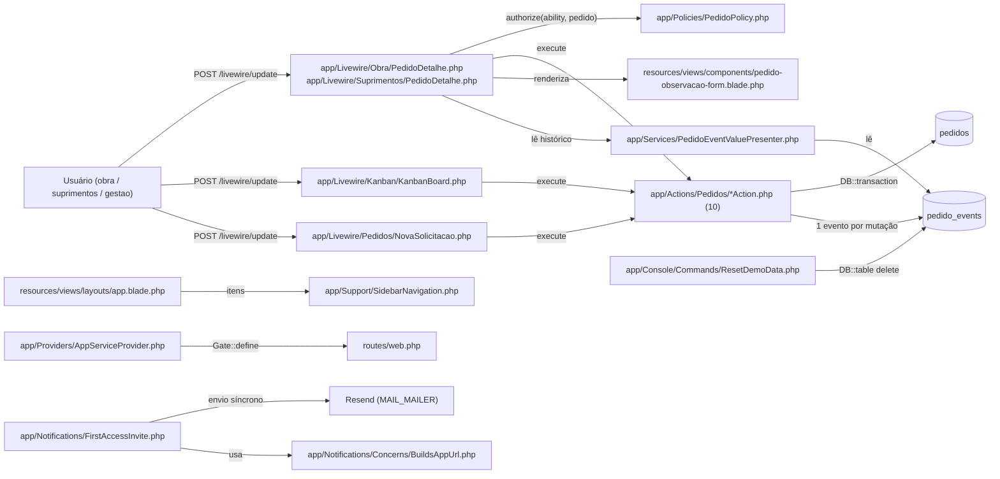
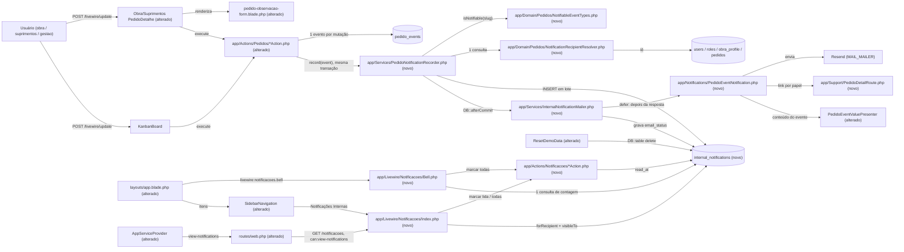

# Implementation Plan

Feature: `notificacoes-internas` · SPEC v1.2 (0 marcadores, aprovada; Q-07: abrir notificação marca lida) · Tier: complete · Branch: `build/v0-demo-laravel`

## Pré-requisitos de execução (gates — não são tarefas)

- **G-1 (árvore limpa antes do Ralph):** `git status --short docs/agents` está vazio. As alterações pendentes em `docs/agents/{architecture,coding_guidelines,project_overview}.md` (snapshot do início desta sessão) vão para um commit só de documentação antes da Fase 1.
- **G-2 (antes do push):** o desenvolvedor confirma no Railway, somente leitura, que `MAIL_MAILER=resend`, `MAIL_FROM_ADDRESS` e `MAIL_FROM_NAME` estão definidos. A feature não cria variável nova (RNF-05). O Railpack roda `php artisan migrate` a cada start do container; a migration de T02 é só aditiva (uma tabela nova), sem backfill.
- **G-3 (depois do deploy; medição RNF-03):** o desenvolvedor executa o roteiro de medição que T22 grava em `.spec/features/notificacoes-internas/defer-verificacao.md` (p95 de 20 execuções, 5 vs. 0 destinatários) e registra o resultado passa/falha. Se falhar, os e-mails continuam corretos. A opção C (worker) **não** entra nesta feature e só pode entrar com aprovação explícita.

Regras válidas para todas as tarefas:
- Toda fase fecha verde: `php artisan test --compact --testsuite=Feature` e `--testsuite=Unit` sem falhas. Um processo Pest por vez contra o PostgreSQL de teste em `127.0.0.1:5434`; `--filter` sempre com `--testsuite=Feature`.
- Código compatível com **PHP 8.4**: nada de pipe operator `|>`, `#[\NoDiscard]` nem `clone with`. Rodar `vendor/bin/pint --dirty --format agent` depois de qualquer mudança PHP. Criar arquivos com `php artisan make:* --no-interaction`.
- **Nenhuma dependência nova** (Composer/npm), nenhum serviço Railway, nenhuma variável de ambiente nova, nenhuma pasta-base nova (`app/Actions/Notificacoes/` e `app/Livewire/Notificacoes/` são subpastas de bases existentes).
- Testes são **atualizados, nunca apagados**. Só mudam as asserções que o PLAN lista explicitamente (T12, T15, T16).

## Request Summary

- **Objective:** cada evento relevante de pedido (os 10 `EventTypeSlug` existentes) gera, na mesma transação, 1 notificação in-app por destinatário elegível e, depois da resposta HTTP, 1 e-mail para ele. Acrescenta a página "Notificações Internas" (3 papéis), um sino global com contador de não lidas, e renomeia o controle de observação para "Observação / ocorrência".
- **Scope in:** tabela `internal_notifications` (CT-02); classificação única dos tipos notificáveis (RF-02, RF-09); regra única de destinatários (RF-03..RF-08); ponto único de registro chamado pelas 10 Actions (RF-01, RF-09); e-mail diferido com `defer()` e `DB::afterCommit` (RF-14..RF-17, RNF-01, CT-03); leitura, marcar lida e marcar todas, com isolamento (RF-18..RF-22, CT-05); página `/notificacoes` (CT-01, UI-01..UI-04); item da sidebar (UI-08); sino (UI-05..UI-07, UI-10); controle "Observação / ocorrência" (RF-10..RF-13, UI-09, CT-04); `demo:reset` (RF-23); verificação leve do `defer()` sob FrankenPHP (RNF-03).
- **Scope out:** alerta automático de atraso (sem scheduler), categorias de ocorrência e tipos de evento novos, worker/fila (opção C), retry de e-mail, preferências por usuário, push/SMS/WebSocket, upload além do romaneio, notificações fora de pedido, edição/exclusão de notificação e de observação, retenção/expurgo, reprocessamento para associados posteriores. Notificações demo no `DemoSeeder` também ficam fora (ver Assumptions A-07).
- **Tier:** complete
- **Architecture references:** `AGENTS.md`, `CLAUDE.md` (guia manual: §2 sem fila/worker/scheduler; §3 `LocalTime`; §5 camadas middleware → `mount()` → Policy → guards das Actions e a decisão travada "`visibleTo` antes de qualquer filtro"; §6 trilhas append-only; §8 `#[Url]` como único estado de filtro, catálogo único `SidebarNavigation`, toggles `data-open` com classes Tailwind literais, Pint, Pest, banco de teste 5434), `docs/agents/architecture.md` ("Layer responsibilities": componente Livewire → `authorize()` → Action com guard traits, validação PT-BR e `DB::transaction`; Domain só com regras; Services para apresentação e envio), `docs/agents/domain_rules.md`, `docs/agents/data_model.md`, `docs/agents/api_contracts.md`. A cadeia `.spec/init/*` foi lida só como contexto (stack Next.js/Supabase descontinuada); o código prevalece.
- **Contracts:** a SPEC tem `### Contracts` (CT-01..CT-05), mas nenhum deles é interface REST, gRPC ou evento assíncrono. CT-01 é página HTML Livewire, CT-02 é entidade de banco, CT-03 é e-mail, CT-04 é reutilização sem mudança e CT-05 são ações Livewire. O repositório não tem `openapi.yaml`, `*.proto`, `asyncapi.yaml` nem `routes/api.php`. Por isso **nenhum arquivo de contrato foi emitido**. Os esquemas ficam inline nas tarefas T02 (CT-02), T06 (CT-03), T13/T14 (CT-01, CT-05) e T09/T12 (CT-04).

## AS IS — Componentes impactados

Hoje cada uma das 10 Actions de pedido grava exatamente 1 linha em `pedido_events` dentro do próprio `DB::transaction` (verificado em `UpdatePedidoStatusAction.php:57`, `CancelPedidoAction.php:43`, `FinalizePedidoAction.php:70`, `AttachRomaneioAction.php:81`, `MarkPedidoEntregueByObraAction.php:53`, `UpdatePedidoResponsavelAction.php:45`, `UpdatePedidoPrioridadeAction.php:44`, `UpdatePedidoPrevisaoAction.php:43`, `CreatePedidoAction.php:167`, `AddPedidoObservacaoAction.php:44`). O histórico só é lido no detalhe, e o único e-mail é o de autenticação, enviado de forma síncrona. Não existe estado de leitura nem aviso ativo.

## TO BE — Componentes propostos

Nós novos e alterados, com a tarefa que os produz: `NotifiableEventTypes` (T03), `NotificationRecipientResolver` (T04), `internal_notifications` + `InternalNotification` (T02), `PedidoEventValuePresenter` alterado + `PedidoDetailRoute` (T05), `InternalNotificationMailer` + `PedidoEventNotification` (T06; o `defer()` foi validado em T01), `PedidoNotificationRecorder` (T07), Actions alteradas (T08, T09), `pedido-observacao-form` e os detalhes (T12), habilidade `view-notifications` + Actions de leitura (T13), página + rota (T14), sidebar (T15), sino + layout (T16) e `ResetDemoData` (T18).

## Tasks

### T01 — Verificação leve de `defer()` sob FrankenPHP (RNF-03, parte estática)
- **Files**: `.spec/features/notificacoes-internas/defer-verificacao.md` (novo, registro técnico exigido pelo AC de RNF-03), `tests/Feature/Notifications/DeferredCallbacksAfterResponseTest.php` (novo)
- **Change**: tarefa curta, sem código de produção e sem infra nova. (1) Confirmar no framework instalado a ordem resposta → callbacks diferidos: `InvokeDeferredCallbacks` (middleware global, `vendor/laravel/framework/src/Illuminate/Foundation/Configuration/Middleware.php:455`) roda em `terminate()`, depois de `Response::send()`, que chama `fastcgi_finish_request()` quando a função existe (`vendor/symfony/http-foundation/Response.php:414-415`). Os callbacks só rodam com status < 400, exceto `always: true`. Em console, rodam em `CommandFinished` com exit 0 (`FoundationServiceProvider.php:215-217`). (2) Confirmar, pela versão do FrankenPHP registrada no log de deploy (consulta read-only ao Railway; se não houver acesso, marcar `[UNVERIFIED]`) e pela documentação/fonte dessa versão, se o SAPI HTTP do FrankenPHP expõe `fastcgi_finish_request()` e/ou `frankenphp_finish_request()`. O modo worker não está habilitado pelo Railpack (Octane não instalado), o que mantém o `scoped` do `DeferredCallbackCollection` por requisição. (3) Registrar a conclusão no arquivo `.md` com uma decisão: `InternalNotificationMailer` (T06) chama `frankenphp_finish_request()` guardado por `function_exists`, como primeira instrução do callback diferido, quando `fastcgi_finish_request` não estiver garantido. A chamada é inofensiva quando a função não existe. (4) Teste que registra, só dentro do teste, uma rota temporária que chama `defer()` e prova que o callback roda depois de a resposta ser montada, e não roda em resposta ≥ 400 sem `always`.
- **Covers**: RNF-03 (parte estática), RNF-01 (base), RNF-05
- **Tests**: `tests/Feature/Notifications/DeferredCallbacksAfterResponseTest.php` — callback diferido executa após o envio no pipeline HTTP; 500 sem `always` não executa; `always: true` executa.
- **Risk**: Low — só leitura e teste. O risco real (flush do FrankenPHP) é medido em G-3.
- **Dependencies**: none

### T02 — Tabela `internal_notifications`, modelo `InternalNotification` (append-only exceto leitura/envio), enum de estado do e-mail e factory
- **Files**: `database/migrations/<timestamp>_create_internal_notifications_table.php`, `app/Models/InternalNotification.php`, `app/Enums/InternalNotificationEmailStatus.php`, `database/factories/InternalNotificationFactory.php` (novos); `app/Models/User.php` (relação `internalNotifications()`, alterado)
- **Change**: migration (timestamp posterior a `2026_09_23_085756`): `id`; `recipient_id` FK `users` RESTRICT; `pedido_id` FK `pedidos` CASCADE; `pedido_event_id` FK `pedido_events` CASCADE; `event_type_slug varchar(40)`; `actor_id` FK `users` RESTRICT; `created_at` (`useCurrent`, sem `updated_at`); `read_at` timestamp nullable; `email_status varchar(10) NOT NULL DEFAULT 'pendente'` com check `internal_notifications_email_status_check` (`pendente`, `enviado`, `falhou`); `email_status_at` timestamp nullable. Unique `(pedido_event_id, recipient_id)`. Índice parcial `internal_notifications_unread_index` em `(recipient_id, created_at desc) where read_at is null` (contador do sino e painel), e índice `(recipient_id, created_at)` para a página. Enum `InternalNotificationEmailStatus` com casos `Pendente`, `Enviado`, `Falhou` (TitleCase). Modelo: `#[Fillable]` explícito, `const UPDATED_AT = null`, casts (`read_at`, `email_status_at` datetime, `email_status` enum), relações `recipient`, `actor`, `pedido`, `event`. Hook `updating` lança `LogicException` em PT-BR se alguma coluna suja estiver fora de `read_at`, `email_status`, `email_status_at`. Hook `deleting` sempre lança. Padrão de `app/Models/PedidoEvent.php:28-37`. Nenhum conteúdo do evento é copiado: o texto exibido vem de `pedido_events` (CT-02).
- **Covers**: CT-02, RF-22, RNF-04 (índice)
- **Tests**: `tests/Feature/Migrations/InternalNotificationsTableTest.php` — colunas, FKs e ações, check, unique, índice parcial, ausência de `updated_at`; `tests/Unit/Models/InternalNotificationImmutabilityTest.php` — atualizar `read_at`/`email_status` funciona; atualizar `pedido_id`/`recipient_id`/`event_type_slug` lança; `delete()` lança.
- **Risk**: Medium — migration roda no start do container em produção. Mitigação: só aditiva, sem backfill, `down()` com `dropIfExists`.
- **Dependencies**: none

### T03 — Classificação única dos tipos notificáveis (`NotifiableEventTypes`)
- **Files**: `app/Domain/Pedidos/NotifiableEventTypes.php` (novo), `tests/Unit/Domain/NotifiableEventTypesTest.php` (novo), `tests/Feature/Compliance/NotifiableEventTypesDefinitionTest.php` (novo)
- **Change**: classe de instância resolvida pelo container (para que um teste possa ligar uma subclasse com um slug fictício, RF-09). `classification(): array<string, bool>` indexada pelos valores de `EventTypeSlug`, com os 10 tipos `true`: `criacao_pedido`, `mudanca_status`, `entrega`, `cancelamento`, `finalizacao`, `alteracao_responsavel`, `alteracao_prioridade`, `alteracao_previsao`, `observacao`, `romaneio_anexado`. `isNotifiable(string $slug): bool` devolve `false` para slug fora do mapa. É o único lugar em `app/` que decide se um tipo notifica.
- **Covers**: RF-02, RF-09 (extensibilidade)
- **Tests**: unit — os 10 slugs são notificáveis e um slug desconhecido não é; compliance — itera `EventTypeSlug::cases()` e falha se algum caso não estiver no mapa; varredura de `app/` falha se outro arquivo listar slugs para decidir notificação.
- **Risk**: Low
- **Dependencies**: none

### T04 — Regra única de destinatários (`NotificationRecipientResolver`), numa consulta deduplicada
- **Files**: `app/Domain/Pedidos/NotificationRecipientResolver.php` (novo), `tests/Feature/Notifications/NotificationRecipientResolverTest.php` (novo), `tests/Feature/Notifications/NotificationRecipientPolicyParityTest.php` (novo)
- **Change**: `recipientIdsFor(PedidoEvent $event): list<int>` executa **1** `SELECT DISTINCT users.id` sobre `users ⋈ roles`, filtrando `users.is_active = true` e `users.id <> pedido_events.actor_id`, e lendo a linha atual de `pedidos` (`obra_id`, `requester_id`, `responsible_id`) na mesma consulta, por subconsulta/join pelo `pedido_id` do evento. Como roda dentro da transação da Action, enxerga o novo responsável (RF-04b). Regra, com um `OR` por ramo: (a) papel `gestao` (RF-03); (b) `obra_id` não nulo: papel `obra` com `obra_profile(obra_id)`, ou papel `suprimentos` com `obra_profile(obra_id)` **ou** `users.id = pedidos.responsible_id` (RF-04); (c) `obra_id` nulo ("Outra"): papel `obra` só se `users.id = pedidos.requester_id`, e todos os `suprimentos` (RF-08). Papel desconhecido nunca entra. O ramo `obra` espelha `PedidoPolicy::view` (`app/Policies/PedidoPolicy.php:22-31`) e `Pedido::scopeVisibleTo` (`app/Models/Pedido.php:83-94`), o que garante RF-07. O docblock registra que mudar a visibilidade de `obra` exige mudar esta regra, e que o escopo de notificação de `suprimentos` é deliberadamente mais estreito que o de visibilidade (RF-04, AC: S2 continua abrindo o pedido). Classe só de leitura, sem escrita (camada Domain).
- **Covers**: RF-03, RF-04, RF-04a, RF-04b, RF-05, RF-06, RF-07, RF-08, RNF-09
- **Tests**: resolver — matriz do AC de RF-04 (S1, S3 e O1 entram; S2 e O2 não); S1 associado e responsável aparece 1 vez (RF-04a); responsável trocado para S3 não associado: S3 entra, o anterior não (RF-04b); autor `gestao` fora e os outros `gestao` dentro (RF-05); `suprimentos` associado e inativo fora (RF-06); "Outra" do AC de RF-08 (O1 e S2 entram; S1 autor, S3 inativo e outros `obra` fora); `DB::getQueryLog` registra exatamente 1 consulta. Paridade — num cenário com os 3 papéis, obras associadas, "Outra", inativos e responsável, para todo id devolvido `Gate::forUser($recipient)->allows('view', $pedido)` é `true` (RF-07).
- **Risk**: High — erro aqui vaza aviso entre obras ou silencia destinatários. Mitigação: matriz completa, teste de paridade com a Policy e consulta única revisável.
- **Dependencies**: none

### T05 — Apresentação do evento fora do detalhe e rota de detalhe por papel
- **Files**: `app/Services/PedidoEventValuePresenter.php` (alterado), `app/Support/PedidoDetailRoute.php` (novo), `tests/Unit/Services/PedidoEventValuePresenterEachTest.php` (novo, ou o teste existente do presenter estendido se estiver em `tests/Unit/Services/`), `tests/Unit/Support/PedidoDetailRouteTest.php` (novo)
- **Change**: presenter — novo `describeEach(Collection $events): array<int, array{action: string, context: ?string, at: string, actor: ?string}>` para eventos de **vários** pedidos. Usa o `pedido` carregado de cada evento no fallback de `criacao_pedido` e reusa `labelsFor()`, que resolve lookups uma vez por coleção. `describeAll()` não muda; o histórico do detalhe continua idêntico (CT-04). Os rótulos de tipo continuam os de `action()` ("Pedido criado", "Observação adicionada", …). `PedidoDetailRoute` (final, estática): `nameFor(User $user): ?string` → `obra.pedidos.show` | `suprimentos.pedidos.show` | `gestao.pedidos.show` pelo `role->slug` (`null` para papel desconhecido), e `absoluteUrlFor(User $user, Pedido $pedido): ?string` ancorado em `APP_URL` pela mesma regra de `app/Notifications/Concerns/BuildsAppUrl.php:16-19`.
- **Covers**: RF-14 (conteúdo), RF-15, UI-01 (conteúdo), UI-02
- **Tests**: `describeEach` em 3 pedidos distintos produz o mesmo resultado que `describeAll` por pedido, com contagem de consultas constante; com `APP_URL=https://exemplo.test`, `obra` → `https://exemplo.test/obra/pedidos/{id}` e `gestao` → `https://exemplo.test/gestao/pedidos/{id}` (AC de RF-15).
- **Risk**: Low — método novo; o caminho do detalhe fica intocado.
- **Dependencies**: none

### T06 — E-mail de notificação, enviado depois da resposta (`InternalNotificationMailer` + `PedidoEventNotification`)
- **Files**: `app/Services/InternalNotificationMailer.php`, `app/Notifications/PedidoEventNotification.php`, `resources/views/mail/pedidos/notificacao.blade.php` (novos); `app/Providers/AppServiceProvider.php` (binding `scoped` do mailer, alterado); `tests/Feature/Notifications/InternalNotificationMailerTest.php`, `tests/Feature/Notifications/PedidoEventNotificationMailTest.php` (novos)
- **Change**: `PedidoEventNotification` (canal `mail`, **sem** `ShouldQueue`, docblock no padrão de `FirstAccessInvite.php`): assunto `[<código>] <rótulo do tipo> — <obraLabel>`, markdown `mail.pedidos.notificacao` sobre `<x-mail.transactional>`, com código, `Pedido::obraLabel()`, rótulo do tipo, conteúdo (`describeEach`), nome do ator, data/hora por `LocalTime::formatDateTime` e botão "Ver pedido" com `PedidoDetailRoute::absoluteUrlFor`. Nunca leva senha, token nem anexo; remetente = `config('mail.from')` (CT-03). `InternalNotificationMailer` (binding `scoped`, um por requisição): `queueEvent(int $pedidoEventId)` acumula ids e, na primeira chamada da requisição, registra **um único** `defer(fn () => $this->flush(), always: true)`. `always: true` é seguro porque o mailer só é chamado por `DB::afterCommit` (T07), então a mutação já está gravada. `flush()`: (i) chama `frankenphp_finish_request()` guardado por `function_exists`, se T01 decidir assim; (ii) carrega as notificações `pendente` desses eventos com `recipient`, `pedido.obra`, `event.eventType`, `event.actor`; (iii) para cada linha, envia num `try/catch(Throwable)` e atualiza `email_status`/`email_status_at` só daquela linha (`enviado` ou `falhou`); (iv) uma falha nunca interrompe os outros destinatários (RF-16) e é registrada com `Log::warning` só com `internal_notification_id`, `pedido_event_id` e a classe da exceção, **nunca** a mensagem da exceção, o endereço ou o texto (RNF-08); (v) com `config('mail.default') === 'resend'`, espaça os envios por uma constante `SEND_INTERVAL_MS` para respeitar o limite de requisições do Resend (ver Risks). Destinatário sem papel reconhecido ou sem rota → `falhou` sem envio.
- **Covers**: RF-14, RF-15, RF-16, RNF-01, RNF-06, RNF-08, CT-03
- **Tests**: mail — corpo PT-BR com `PED-…`, rótulo, conteúdo, ator, data/hora local e link do papel; assunto no formato de CT-03; sem `password`/`token`. Mailer — duas chamadas na mesma requisição registram 1 callback diferido; antes de `app(DeferredCallbackCollection::class)->invoke()` nenhuma mensagem é enviada, depois N (RNF-01); com transporte que lança para o destinatário A (mailer de teste configurado no próprio teste): A fica `falhou` com timestamp, B fica `enviado` e recebe (RF-16); o log capturado não contém o e-mail de A, o texto da observação nem token (RNF-08).
- **Risk**: High — envio pós-resposta, falha silenciosa e limite do provedor. Mitigação: estado por linha (`pendente`/`enviado`/`falhou`) visível no banco, log sem PII, espaçamento dos envios, verificação T01 + medição G-3.
- **Dependencies**: T01, T02, T05

### T07 — Ponto único de registro (`PedidoNotificationRecorder`)
- **Files**: `app/Services/PedidoNotificationRecorder.php` (novo), `tests/Feature/Notifications/PedidoNotificationRecorderTest.php` (novo)
- **Change**: `record(PedidoEvent $event): void`. (1) Lança `LogicException` se `DB::transactionLevel() === 0`: o registro só existe dentro da transação da Action (RF-01). (2) Lê o slug do tipo (1 consulta, ou nenhuma se `eventType` já estiver carregado) e sai se `NotifiableEventTypes::isNotifiable()` for `false`. (3) `NotificationRecipientResolver::recipientIdsFor()` (1 consulta). (4) Sai se não houver destinatário; senão faz **1** INSERT em lote em `internal_notifications` (`recipient_id`, `pedido_id`, `pedido_event_id`, `event_type_slug`, `actor_id`, `created_at`, `email_status = pendente`). (5) `DB::afterCommit(fn () => $mailer->queueEvent($event->id))`, então o rollback descarta o e-mail (RF-17). Delta total ≤ 3 consultas, constante no número de destinatários (RNF-02).
- **Covers**: RF-01, RF-09 (ponto único), RF-17, RNF-02
- **Tests**: fora de transação → `LogicException`; dentro de `DB::transaction` com 3 destinatários → 3 linhas e, após o commit, 1 evento enfileirado no mailer; transação com exceção depois do `record` → 0 notificações e 0 e-mails após `invoke()` (RF-01, RF-17); slug não notificável (subclasse ligada no container) → 0 linhas; slug fictício ligado como notificável numa subclasse, com linha em `event_types` → notifica sem nenhuma outra mudança (AC de RF-09).
- **Risk**: Medium — o acoplamento transacional é o centro da feature. Mitigação: guarda de nível de transação + testes de rollback.
- **Dependencies**: T02, T03, T04, T06

### T08 — Acoplar o registro às Actions de status (status, entrega, cancelamento, finalização, romaneio, entrega pela obra)
- **Files**: `app/Actions/Pedidos/UpdatePedidoStatusAction.php`, `app/Actions/Pedidos/CancelPedidoAction.php`, `app/Actions/Pedidos/FinalizePedidoAction.php`, `app/Actions/Pedidos/AttachRomaneioAction.php`, `app/Actions/Pedidos/MarkPedidoEntregueByObraAction.php` (alterados)
- **Change**: injetar `PedidoNotificationRecorder` por construtor (property promotion; `FinalizePedidoAction` e `AttachRomaneioAction` já têm construtor com `PedidoAttachmentStorage`) e chamar `$this->notificationRecorder->record($event)` logo depois de cada `events()->create(...)`, **dentro** do mesmo `DB::transaction` e depois do `lockForUpdate` existente. Guards, validação, mensagens e ordem atuais ficam intactos. O Kanban (`moveCard`/`moveViaControl`) passa por `UpdatePedidoStatusAction` e fica coberto sem mudança. Atualizar o docblock de cada Action com uma linha sobre a notificação.
- **Covers**: RF-01, RF-02 (`mudanca_status`, `entrega`, `cancelamento`, `finalizacao`, `romaneio_anexado`), RF-09
- **Tests**: os testes existentes em `tests/Feature/Actions/{UpdatePedidoStatus,CancelPedido,FinalizePedido,AttachRomaneio,MarkPedidoEntregueByObra}ActionTest.php` continuam verdes sem mudar asserção; a cobertura nova está em T10.
- **Risk**: Medium — 5 arquivos críticos. Mitigação: mudança mecânica de 2 linhas por Action; a suíte existente prova que nada além disso mudou.
- **Dependencies**: T07

### T09 — Acoplar o registro às Actions de criação, atributos e observação
- **Files**: `app/Actions/Pedidos/CreatePedidoAction.php`, `app/Actions/Pedidos/UpdatePedidoResponsavelAction.php`, `app/Actions/Pedidos/UpdatePedidoPrioridadeAction.php`, `app/Actions/Pedidos/UpdatePedidoPrevisaoAction.php`, `app/Actions/Pedidos/AddPedidoObservacaoAction.php` (alterados)
- **Change**: igual a T08. Em `CreatePedidoAction` a chamada fica dentro do `try` da transação, então a limpeza dos anexos em caso de falha continua valendo. Em `UpdatePedidoResponsavelAction` a chamada vem depois do `update` do pedido, para o resolver enxergar o novo responsável (RF-04b). Em `AddPedidoObservacaoAction` o `DB::transaction(fn () => PedidoEvent::query()->create(...))` vira uma closure que cria o evento, chama `record()` e o devolve. A assinatura `execute(User $actor, Pedido $pedido, string $texto): PedidoEvent`, o `MAX_LENGTH`, as mensagens "Escreva a observação." / "A observação deve ter no máximo 2000 caracteres." e o guard `ensureActorMayObserve` não mudam (CT-04). O docblock passa a dizer "Observação / ocorrência", lista `suprimentos`, `gestao` (via `operate-pedidos`) e `obra` com `view`, e cita a notificação.
- **Covers**: RF-01, RF-02 (`criacao_pedido`, `alteracao_responsavel`, `alteracao_prioridade`, `alteracao_previsao`, `observacao`), RF-04b, RF-09, RF-10, RF-11, RF-12, CT-04
- **Tests**: os testes existentes em `tests/Feature/Actions/{CreatePedido,CreatePedidoAttachments,UpdatePedidoResponsavel,UpdatePedidoPrioridade,UpdatePedidoPrevisao,AddPedidoObservacao}ActionTest.php` continuam verdes; a cobertura nova está em T10.
- **Risk**: Medium — `CreatePedidoAction` consome a sequência e grava arquivos. Mitigação: chamada dentro da transação existente, depois do evento; nada muda antes de `PedidoCodeGenerator`.
- **Dependencies**: T07

### T10 — Testes integrados de geração, rollback, envio diferido e conformidade do ponto único
- **Files**: `tests/Feature/Notifications/NotificationGenerationTest.php`, `tests/Feature/Notifications/ObservacaoOcorrenciaNotificationTest.php`, `tests/Feature/Compliance/PedidoNotificationSinglePointTest.php` (novos)
- **Change**: geração — para cada um dos 10 tipos, executar a Action real com um destinatário elegível e verificar ≥ 1 notificação, `count = destinatários resolvidos`, `pedido_id`, `actor_id` e `event_type_slug` corretos (RF-01, RF-02); 2 `gestao` ativos não autores recebem 1 cada (RF-03); autor `gestao` de `alteracao_prioridade` não recebe (RF-05); Kanban `moveViaControl` gera notificações. Rollback — forçar exceção depois do INSERT do evento dentro da Action (por exemplo, um listener `created` de `PedidoEvent` registrado só no teste) → 0 notificações e 0 e-mails depois de `invoke()` (RF-01, RF-17). RNF-01 — `UpdatePedidoStatusAction` com 5 destinatários e `Notification::fake()`: 0 mensagens antes de `app(DeferredCallbackCollection::class)->invoke()`, 5 depois, cada uma para o e-mail do destinatário (RF-14). Observação — "   " e 2001 caracteres → 422 com as mensagens existentes, 0 eventos e 0 notificações (RF-11); `obra` sem `view` → 403, 0 eventos e 0 notificações; `suprimentos`, `gestao` e `obra` com `view` → sucesso (RF-12); um teste por status terminal (`entregue`, `cancelado`, `finalizado`) grava 1 `observacao` e notifica (RF-13); `pedidos.updated_at` e `status_id` inalterados (RF-10). Conformidade — varredura de `app/Actions/Pedidos/*.php`: todo arquivo com `events()->create(` ou `PedidoEvent::query()->create(` também chama `notificationRecorder->record(`; nenhum outro arquivo de `app/` insere em `internal_notifications` além de `PedidoNotificationRecorder` (RF-09). A varredura cobre só `app/`, porque o `DemoSeeder` grava eventos direto e não notifica.
- **Covers**: RF-01, RF-02, RF-03, RF-05, RF-09, RF-10, RF-11, RF-12, RF-13, RF-14, RF-17, RNF-01
- **Tests**: os 3 arquivos acima.
- **Risk**: Low
- **Dependencies**: T08, T09

### T11 — Orçamento de consultas da geração (RNF-02, RNF-09)
- **Files**: `tests/Feature/Performance/QueryCountTest.php` (alterado, só acréscimo de testes)
- **Change**: novo teste: medir só as consultas emitidas por `PedidoNotificationRecorder::record()` durante `UpdatePedidoStatusAction` com 1 e com 20 destinatários. Os deltas são iguais e ≤ 4 (RNF-02). Outro teste: pedido com `suprimentos` associado **e** responsável gera o mesmo delta que sem responsável e 1 linha para esse usuário (RNF-09). Nenhum teste existente é alterado. O `+1` constante do contador do sino (T16) é absorvido pelos testes "1 vs 10" existentes, que comparam contagens relativas.
- **Covers**: RNF-02, RNF-09, RF-04a
- **Tests**: `tests/Feature/Performance/QueryCountTest.php` — 2 testes novos.
- **Risk**: Low
- **Dependencies**: T08

### T12 — Controle "Observação / ocorrência" nos detalhes (UI-09)
- **Files**: `resources/views/components/pedido-observacao-form.blade.php`, `app/Livewire/Suprimentos/PedidoDetalhe.php` (só docblock), `tests/Feature/Livewire/PedidoObservacaoControlTest.php`, `tests/Feature/Security/Adversarial/GestaoOperacaoPedidosTest.php`, `tests/Browser/SolicitacaoFinalizacaoFlowTest.php`, `tests/Browser/ResponsiveIdentityTest.php` (alterados)
- **Change**: `<section aria-label="Observação / ocorrência">`; `<label>` "Observação / ocorrência"; dica: "Registre falta de produto, troca, atraso, problema de entrega ou qualquer informação relevante. Até 2000 caracteres. Fica no histórico e avisa os envolvidos; não pode ser alterada."; botão "Registrar observação / ocorrência". O campo continua único e obrigatório, sem select de categoria, com `maxlength` de `AddPedidoObservacaoAction::MAX_LENGTH` e erro inline `@error('observacao')` com `role="alert"`. O método `adicionarObservacao` de `Obra\PedidoDetalhe` e de `Suprimentos\PedidoDetalhe` mantém a assinatura (CT-05). Classes Tailwind literais. Allow-list de asserções: `PedidoObservacaoControlTest.php:51,57,66`, `GestaoOperacaoPedidosTest.php:89`, `SolicitacaoFinalizacaoFlowTest.php:144` (seletor `section[aria-label="Observação / ocorrência"]`), `ResponsiveIdentityTest.php:434,456` passam de "Adicionar observação" para "Observação / ocorrência".
- **Covers**: UI-09, RF-10 (exibição no histórico), CT-04, CT-05
- **Tests**: `PedidoObservacaoControlTest` — rótulo "Observação / ocorrência" nos detalhes de Obra, Suprimentos e Gestão (`gestao.pedidos.show`), nenhum `<select>` dentro da seção; enviar vazio mostra "Escreva a observação." no campo; a entrada aparece no histórico com autor e data/hora local.
- **Risk**: Low — mudança de texto; a churn de testes está listada.
- **Dependencies**: none (independente de T08/T09)

### T13 — Habilidade `view-notifications`, escopo do destinatário, Policy e Actions de leitura
- **Files**: `app/Providers/AppServiceProvider.php` (gate, alterado), `app/Models/InternalNotification.php` (scope, alterado), `app/Policies/InternalNotificationPolicy.php`, `app/Actions/Notificacoes/MarkInternalNotificationReadAction.php`, `app/Actions/Notificacoes/MarkAllInternalNotificationsReadAction.php` (novos), `tests/Feature/Authorization/RoleGatesTest.php` (alterado, acréscimo), `tests/Feature/Actions/Notificacoes/MarkInternalNotificationReadActionTest.php`, `tests/Feature/Actions/Notificacoes/MarkAllInternalNotificationsReadActionTest.php` (novos)
- **Change**: `Gate::define('view-notifications', …)` = papel `obra`, `suprimentos` ou `gestao` (papel desconhecido → negado). `InternalNotification::scopeForRecipient(Builder, User)` é a **única** definição de visibilidade de notificações: `where('recipient_id', $user->id)` e `whereIn('pedido_id', Pedido::query()->visibleTo($user)->select('pedidos.id'))`, aplicada na instrução que abre toda consulta de listagem, contagem e painel (RF-21; decisão travada "`visibleTo` primeiro", `CLAUDE.md` §5). `InternalNotificationPolicy::update(User, InternalNotification)` = dono; `delete` sempre `false`. `MarkInternalNotificationReadAction::execute(User $actor, int $notificationId)`: `InternalNotification::query()->forRecipient($actor)->findOrFail($id)` (id forjado de outro usuário → 404, RF-20), `Gate::forUser($actor)->authorize('update', …)`, e um UPDATE condicional `whereNull('read_at')` que preserva o primeiro timestamp (RF-18). `MarkAllInternalNotificationsReadAction::execute(User $actor): int`: 1 UPDATE `where recipient_id = actor and read_at is null` (RF-19, literalmente "toda não lida daquele usuário"). As duas Actions só tocam `read_at`. `MarkInternalNotificationReadAction` devolve a `InternalNotification` (com `pedido`), para que `abrir()` (T14/T16) reuse o mesmo caminho de marcação e reautorização.
- **Covers**: CT-01 (habilidade), CT-05, RF-18, RF-19, RF-20, RF-21, RNF-07
- **Tests**: gate — `obra`/`suprimentos`/`gestao` permitidos, papel desconhecido negado; Actions — `read_at` preenchido e uma segunda marcação não muda o valor; id de outro usuário → `ModelNotFoundException`/404 e `read_at` intacto; A com 5 e B com 3 não lidas: depois da ação de A, A tem 0 e B tem 3; usuário `obra` desassociado da obra X deixa de ver/contar as notificações de X (RF-21).
- **Risk**: Medium — isolamento entre usuários. Mitigação: escopo único + Policy + testes adversariais em T19.
- **Dependencies**: T02

### T14 — Página "Notificações Internas" (`Notificacoes\Index`) e rota `notificacoes.index`
- **Files**: `app/Livewire/Notificacoes/Index.php`, `resources/views/livewire/notificacoes/index.blade.php` (novos), `routes/web.php` (alterado), `tests/Feature/Livewire/NotificacoesIndexTest.php` (novo)
- **Change**: rota `GET /notificacoes` → `Notificacoes\Index`, nome `notificacoes.index`, dentro do grupo `['auth', 'active']` e fora dos prefixos de papel, com `->middleware('can:view-notifications')` e sem parâmetro de rota (CT-01). Componente: `mount()` re-checa `authorize('view-notifications')`; `WithPagination`, 20 por página, `created_at` DESC e `id` DESC; consulta aberta por `InternalNotification::query()->forRecipient(Auth::user())`, com eager load de `event.eventType`, `event.actor`, `event.pedido.obra`, `pedido`. Os itens passam por `PedidoEventValuePresenter::describeEach`. Filtros `#[Url]` com `except:` neutro: `$readState` `as: 'lidas'` (`''` = todas, `nao`, `sim`); `$eventType` `as: 'tipo'` (só slugs de `NotifiableEventTypes`; valor desconhecido → neutro); `$code` `as: 'codigo'` (busca por `pedidos.code` ILIKE). "Limpar filtros" deixa a URL sem parâmetros. Nenhuma leitura manual da request em `mount()`. Ações: `markAsRead(int $id)` → T13, `markAllAsRead()` → T13; as duas fazem `$this->dispatch('notificacoes-atualizadas')` para o sino (UI-03). `abrir(int $id)` (UI-02, Q-07): chama `MarkInternalNotificationReadAction` (que reautoriza a posse por `forRecipient()->findOrFail` + Policy `update`; id forjado → 403/404 sem navegar e sem mudar nada; item já lido mantém o primeiro `read_at`) e então `$this->redirectRoute(PedidoDetailRoute::nameFor($user), $notification->pedido)`. Cada item é ativado por um botão `wire:click="abrir({id})"` com o código do pedido como texto (sem `<a href>` direto, para que a marcação sempre preceda a navegação). Cada item mostra código, `obraLabel()`, rótulo do tipo, conteúdo (texto, ou anterior → novo), ator, data/hora local e estado: não lida com marcação visual **e** textual ("Não lida"), mais o botão "Marcar como lida". Topo com "Marcar todas como lidas". Estado vazio "Nenhuma notificação encontrada.". Usar `x-filter-panel` existente (estado Alpine, nunca `
`); só classes Tailwind literais; PT-BR.
- **Covers**: CT-01, CT-05, UI-01, UI-02, UI-03, UI-04, RF-18, RF-19, RF-20, RF-21, RNF-06
- **Tests**: 25 notificações → 20 na página 1, a mais recente primeiro, com os 7 campos; não lidas com o texto "Não lida"; `abrir(id)` de `suprimentos` numa não lida preenche `read_at` e redireciona para `/suprimentos/pedidos/{id}`; `abrir` numa já lida mantém o `read_at` original e redireciona; `abrir` com id de outro usuário → 403/404, sem redirect, `read_at` intacto; `?lidas=nao` só não lidas; filtro por tipo e por código; "Limpar filtros" zera as propriedades; "Marcar todas como lidas" → nenhum item "Não lida" e evento `notificacoes-atualizadas` disparado; GET sem papel reconhecido → 403; contagem de consultas constante para 1 vs 20 itens.
- **Risk**: Medium — visibilidade por `visibleTo` em subconsulta. Mitigação: escopo único (T13) + varredura (T20).
- **Dependencies**: T05, T13

### T15 — Item "Notificações Internas" na sidebar e baseline de middleware
- **Files**: `app/Support/SidebarNavigation.php` (alterado), `tests/Feature/Authorization/SidebarNavigationCatalogueTest.php`, `tests/Feature/Livewire/SidebarNavigationTest.php`, `tests/Feature/Compliance/RouteMiddlewareBaselineTest.php` (alterados, acréscimo)
- **Change**: `self::item('Notificações Internas', 'notificacoes.index', 'notificacoes.*', ['view-notifications'], 'Notificações')` nos 3 papéis, num grupo próprio logo depois dos itens de operação: Obra depois de "Acompanhamento"; Suprimentos depois de "Kanban" e antes de "Cadastros"; Gestão depois de "Kanban" e antes de "Administração". As habilidades são exatamente as `can:` da rota (`CLAUDE.md` §8). A sidebar não é camada de autorização. `RouteMiddlewareBaselineTest`: acrescentar `notificacoes.index` → `['web', 'auth', 'active', 'can:view-notifications']`. Allow-list: as listas esperadas por papel no teste de catálogo e no teste Livewire da sidebar ganham o item novo.
- **Covers**: UI-08, CT-01
- **Tests**: catálogo com o item nos 3 papéis e habilidades iguais às da rota; em `/notificacoes` só esse item tem `aria-current="page"`; baseline de middleware com a rota nova.
- **Risk**: Low
- **Dependencies**: T14

### T16 — Sino global com contador (`Notificacoes\Bell`) no layout
- **Files**: `app/Livewire/Notificacoes/Bell.php`, `resources/views/livewire/notificacoes/bell.blade.php` (novos), `resources/views/layouts/app.blade.php` (alterado), `tests/Feature/Livewire/NotificacoesBellTest.php` (novo), `tests/Feature/Performance/QueryCountTest.php` (alterado, acréscimo)
- **Change**: o layout renderiza **uma única** instância `<livewire:notificacoes.bell />` dentro de `@auth`, num controle fixo visível no desktop e na barra superior do celular. Uma segunda instância dobraria a consulta de contagem (RNF-04). O layout continua sem `wire:click` e sem saída crua, o que preserva `NavigationListingComplianceTest.php:107`; toda interação mora na view do componente. Render: **1** consulta `InternalNotification::query()->forRecipient($user)->whereNull('read_at')->count()` (RNF-04, índice parcial de T02); badge com o número, `9+` acima de 9 e oculto em 0; nome acessível `aria-label="Notificações, N não lidas"`. Painel: aberto pelo botão, com `data-open="false"` + `x-bind:data-open` e variantes literais (`hidden data-[open=true]:flex`), sem `x-show` nem `
`. Escape fecha e devolve o foco ao sino (`x-ref`). A lista do painel só é carregada ao abrir, por `loadPanel()`: as 10 não lidas mais recentes (código, rótulo do tipo, data/hora local), cada uma ativada por `wire:click="abrir({id})"`, com a mesma semântica de `Index::abrir` (T14: `MarkInternalNotificationReadAction` → redirect para `PedidoDetailRoute` do papel; id forjado → 403/404 sem navegar), "Marcar todas como lidas" (T13) e "Ver todas" → `notificacoes.index`; com 0 não lidas, "Nenhuma notificação nova.". Atualização: `#[On('notificacoes-atualizadas')]` re-renderiza o contador; um timer Alpine de 60 000 ms chama `$wire.$refresh()` só quando `document.visibilityState === 'visible'`, e a função tem nome (`refreshIfVisible`) para os testes. Com a aba oculta não sai requisição. Navegação completa re-renderiza o layout (UI-07). Classes Tailwind literais (UI-10).
- **Covers**: UI-02, UI-05, UI-06, UI-07, UI-10, RF-18, RF-20, RF-21, RNF-04, RNF-07
- **Tests**: `NotificacoesBellTest` — 3 não lidas → badge "3" e `aria-label="Notificações, 3 não lidas"`; 12 → "9+"; 0 → sem badge; `loadPanel` lista 10 de 12, a mais recente primeiro; `abrir(id)` marca lida, redireciona ao detalhe do papel e o contador cai 1; `abrir` com id alheio → 403/404 sem redirect; estado vazio; "Ver todas" aponta para `/notificacoes`; marcar todas zera o contador; notificações de pedido de obra desassociada não contam; a view contém `data-open="false"`, `x-bind:data-open`, o timer de 60000 e a guarda `visibilityState`, e não contém `x-show` nem `<details`. `QueryCountTest` — renderizar o layout para um usuário com 500 notificações acrescenta exatamente 1 consulta em relação a 0 notificações (RNF-04).
- **Risk**: Medium — o sino entra em toda página autenticada. Mitigação: 1 consulta indexada, instância única, painel preguiçoso.
- **Dependencies**: T13, T14

### T17 — Testes de navegador: sino, página e fluxo ponta a ponta
- **Files**: `tests/Browser/NotificacoesInternasFlowTest.php` (novo)
- **Change**: Pest Browser seguindo os cuidados registrados (URL absoluta no `goto`, esperar `wire:model` antes de digitar, saída redirecionada para arquivo). Cenários: Suprimentos muda status, a Gestão abre a página e vê o badge e o item, clica no item e chega a `/gestao/pedidos/{id}` com a notificação já lida (badge 1 a menos ao voltar); clicar num item do painel do sino também marca lida e navega (UI-02, Q-07); "Marcar todas como lidas" some com o badge (UI-03); o painel abre, Escape fecha e o foco volta ao sino (UI-10); viewport de celular mostra o badge na barra superior (UI-05); `refreshIfVisible()` invocado com `document.visibilityState` simulado como `hidden` não emite `/livewire/update`, e com `visible` emite 1 (UI-07); uma notificação criada no servidor aparece no badge depois de `refreshIfVisible()`.
- **Covers**: UI-02, UI-03, UI-05, UI-06, UI-07, UI-10
- **Tests**: `tests/Browser/NotificacoesInternasFlowTest.php`.
- **Risk**: Low — exige Chromium (ver README "Suíte Browser").
- **Dependencies**: T15, T16

### T18 — `demo:reset` limpa as notificações demo (RF-23)
- **Files**: `app/Console/Commands/ResetDemoData.php` (alterado), `tests/Feature/Console/ResetDemoDataTest.php` (alterado, acréscimo), `tests/Feature/Compliance/AuditTrailsAppendOnlyTest.php` (alterado, acréscimo)
- **Change**: dentro da transação existente, **antes** de `Pedido::query()->where('is_demo', true)->delete()`, `DB::table('internal_notifications')->where(…)->delete()` para linhas com `pedido_id` de pedido demo **ou** `recipient_id`/`actor_id` de usuário demo. Isso inclui notificação de pedido real recebida por usuário demo, que de outra forma bloquearia a exclusão do usuário pelo RESTRICT. Só `DB::table`, nunca o modelo (o guard `deleting` lançaria), no padrão de D-11. Atualizar o docblock.
- **Covers**: RF-23, RF-22
- **Tests**: `demo:reset --force` com notificações demo (pedido demo; pedido real com destinatário demo) termina com código 0 e 0 notificações ligadas a pedidos ou usuários demo; notificações reais permanecem. `AuditTrailsAppendOnlyTest` — `ResetDemoData` toca `internal_notifications` só por `DB::table`.
- **Risk**: Medium — ordem de exclusão com FKs RESTRICT. Mitigação: exclusão antes dos pedidos e dos usuários, coberta por teste.
- **Dependencies**: T02

### T19 — Testes adversariais: isolamento, ids forjados e falha de e-mail
- **Files**: `tests/Feature/Security/Adversarial/InternalNotificationsIsolationTest.php`, `tests/Feature/Security/Adversarial/InternalNotificationMailFailureTest.php` (novos)
- **Change**: isolamento com 2 usuários (RNF-07) — página, contador do sino, painel, `markAsRead` e `abrir` (página e sino) com id do outro (chamada Livewire forjada → 403/404, nenhum redirect e `read_at` intacto, RF-20, UI-02) e `markAllAsRead` (o outro não é afetado). `obra` desassociado deixa de ver e contar (RF-21). Mutação via `/livewire/update` real (pipeline HTTP com `InvokeDeferredCallbacks`): transporte que lança para A → mutação gravada, A `falhou` com `email_status_at`, B `enviado` (RF-16); log sem e-mail, texto da observação nem token (RNF-08). Usuário `suprimentos` S2 (não associado, não responsável) continua abrindo o pedido e não recebe notificação (AC de RF-04).
- **Covers**: RNF-07, RNF-08, RF-16, RF-20, RF-21, RF-04, UI-02
- **Tests**: os 2 arquivos acima.
- **Risk**: Low
- **Dependencies**: T10, T14, T16

### T20 — Varreduras de conformidade da feature
- **Files**: `tests/Feature/Compliance/LocalTimeDisplayComplianceTest.php`, `tests/Feature/Compliance/FilterUrlStateComplianceTest.php` (alterados, acréscimo), `tests/Feature/Compliance/InternalNotificationsComplianceTest.php` (novo)
- **Change**: `LocalTimeDisplayComplianceTest` passa a varrer `resources/views/livewire/notificacoes/index.blade.php`, `resources/views/livewire/notificacoes/bell.blade.php` e `resources/views/mail/pedidos/notificacao.blade.php` (RNF-06). `FilterUrlStateComplianceTest` inclui `Notificacoes\Index`: `lidas`, `tipo`, `codigo` como `#[Url]` com `except` igual ao default e nenhuma leitura de request (UI-04). Compliance novo: (a) nenhuma classe em `app/Notifications/` implementa `ShouldQueue` e `routes/console.php` continua sem schedule (sem fila/worker); (b) `composer.json`/`package.json` sem dependência nova em relação à base (RNF-05), comparando com as listas fixadas no teste; (c) toda consulta estática de `InternalNotification::query()` em `app/Livewire/Notificacoes/*.php` e `app/Actions/Notificacoes/*.php` abre com `->forRecipient(` (exceto o `MarkAll`, que usa `recipient_id` explícito); (d) atualizações de `internal_notifications` em `app/` só tocam `read_at`, `email_status`, `email_status_at` (RF-22); (e) nenhuma classe interpolada (`{{` dentro de `class="`) nas views novas (UI-10); (f) nenhum `x-show` nem `<details` nas views novas.
- **Covers**: RNF-05, RNF-06, RF-21, RF-22, UI-04, UI-10
- **Tests**: os 3 arquivos acima.
- **Risk**: Low
- **Dependencies**: T14, T16, T18

### T21 — Gates finais: Pint, build, suítes e dependências
- **Files**: nenhum arquivo de produção (só execução); correções pontuais nos arquivos da feature, se algum gate falhar
- **Change**: `vendor/bin/pint --dirty --format agent`; `npm run build` (as classes `data-[open=true]:*` novas precisam entrar no CSS; `BuiltAssetsUtilitiesTest`); `php artisan test --compact --testsuite=Unit`, `--testsuite=Feature` e, separadamente, `vendor/bin/pest tests/Browser` com saída redirecionada para arquivo; `git diff --stat build/v0-demo-laravel -- composer.json composer.lock package.json package-lock.json` vazio; `php artisan route:list --path=notificacoes` mostra a rota com `can:view-notifications`.
- **Covers**: RNF-05, todos os ACs (regressão)
- **Tests**: as suítes completas.
- **Risk**: Low
- **Dependencies**: T17, T19, T20

### T22 — Documentação e roteiro de medição RNF-03
- **Files**: `CLAUDE.md` (alterado, manual), `docs/agents/*.md` (regenerados por `/ai-context`, nunca à mão), `.spec/features/notificacoes-internas/defer-verificacao.md` (alterado)
- **Change**: `CLAUDE.md`: §2 — o e-mail de notificação sai depois da resposta via `defer()`, sem fila nem worker, com a opção C como evolução que exige aprovação; §3 — notificações internas (10 tipos, regra de destinatários, autor/inativos excluídos, "Outra"); §4 — rota `/notificacoes`, item da sidebar e sino nos 3 papéis, e "Observação / ocorrência"; §5 — habilidade `view-notifications`, `InternalNotification::forRecipient` como única visibilidade de notificação, com `visibleTo` dentro; §6 — tabela `internal_notifications` (append-only exceto `read_at`/`email_status*`) e o `demo:reset`; §7 — logs de falha sem PII. Depois rodar `/ai-context` para regenerar `docs/agents/*.md`. Em `defer-verificacao.md`: roteiro de G-3 (cenário com 5 vs. 0 destinatários, 20 execuções cada da mesma alteração de status capturadas pela aba Network ou por `curl` com a requisição `/livewire/update` copiada, cálculo do p95, critério de ≤ +150 ms) e espaço para o resultado passa/falha.
- **Covers**: RNF-03 (roteiro), RF-09 (documentação da extensão)
- **Tests**: `tests/Feature/Compliance/DocumentationParityTest.php` continua verde (banner em `docs/agents`, nenhum `AI_CONTEXT.md`).
- **Risk**: Low
- **Dependencies**: T21

## Execution Phases

| Phase | Tasks | Parallel-safe? |
|-------|-------|----------------|
| 1 — Fundação: verificação do `defer()`, tabela, classificação e destinatários | T01, T02, T03, T04 | Sim — arquivos distintos, sem dependência entre si |
| 2 — Apresentação, e-mail diferido e ponto único de registro | T05, T06, T07 | Não — T06 depende de T05; T07 depende de T06 |
| 3 — Acoplamento às 10 Actions e controle "Observação / ocorrência" | T08, T09, T12 | Sim — conjuntos de arquivos disjuntos |
| 4 — Testes integrados de geração e orçamento de consultas | T10, T11 | Sim — arquivos de teste distintos |
| 5 — Leitura, página e sidebar | T13, T14, T15 | Não — T14 depende de T13; T15 depende da rota de T14 |
| 6 — Sino e navegador | T16, T17 | Não — T17 depende de T16 |
| 7 — `demo:reset`, testes adversariais e conformidade | T18, T19, T20 | Sim — T20 só acrescenta varreduras sobre arquivos já existentes; arquivos distintos |
| 8 — Gates finais | T21 | Não |
| 9 — Documentação e roteiro de medição | T22 | Não |

## Risks

| Risk | Blast radius | Mitigation | Rollback |
|------|-------------|------------|----------|
| FrankenPHP não encerra a resposta antes dos callbacks de `defer()` (RNF-03) | Latência de toda mutação com destinatários; o e-mail continua correto | T01 verifica e decide a chamada guardada `frankenphp_finish_request()`; G-3 mede p95 em produção | Reverter só a chamada de `defer()` para envio imediato **não** é aceitável (viola o AC 6); a evolução é a opção C, com aprovação |
| Limite de requisições do Resend (plano da conta `[UNVERIFIED]`) com vários destinatários seguidos | Linhas `falhou` sem retry | `SEND_INTERVAL_MS` entre envios quando `mail.default = resend`; estado `falhou` visível; log sem PII | Ajustar a constante; nenhuma migração |
| Regra de destinatários vazar avisos entre obras ou omitir destinatários | Confidencialidade entre obras; confiança no aviso | Consulta única espelhando `PedidoPolicy::view`/`visibleTo`; teste de paridade (RF-07); matriz completa em T04 | Corrigir o resolver; notificações já gravadas ficam invisíveis por `forRecipient` se o pedido não for visível |
| Falha de e-mail depois do commit não tem retry (sem scheduler/worker) | Destinatário sem e-mail; a notificação in-app existe | `email_status = falhou` + `email_status_at` auditáveis | Reenvio manual fora de escopo; opção C futura |
| Processo morre no meio do `flush()` | Linhas ficam `pendente` para sempre | Atualização por linha logo após cada envio | Nenhuma (só leitura de estado) |
| Acoplamento nas 10 Actions muda comportamento transacional | Todas as mutações de pedido | Chamada única depois do evento, dentro da transação existente; suíte de Actions inalterada; guarda `transactionLevel` | `git revert` das fases 3+; a tabela fica órfã e é inofensiva |
| Sino em toda página autenticada acrescenta latência/consulta | Toda tela autenticada | 1 consulta indexada (índice parcial), instância única, painel preguiçoso; `QueryCountTest` | Remover a tag `<livewire:notificacoes.bell />` do layout |
| Migration nova roda no start do Railpack | Deploy | Só aditiva, sem backfill; `down()` simples | `php artisan migrate:rollback --step=1` (tabela sem dependentes) |
| `demo:reset` bloqueado por FK RESTRICT de `recipient_id`/`actor_id` | Comando de demonstração | Exclusão por `DB::table` antes de pedidos/usuários, inclusive pedido real com destinatário demo | Corrigir o filtro; o comando é transacional |
| Polling do sino com a aba oculta | Carga desnecessária | Timer Alpine com guarda `visibilityState`, testado em Browser | Ajustar o intervalo |

## Open Questions

Nenhuma. As três perguntas da primeira versão do plano foram resolvidas pelo desenvolvedor:

| ID | Decisão | Aplicada em |
|---|---|---|
| OQ-1 → SPEC Q-07 | Abrir uma notificação, na página e no sino, a marca como lida (semântica de RF-18, idempotente, só o dono por RF-20) e depois navega ao detalhe do papel. Implementado por `abrir(int $id)` | SPEC v1.2 UI-02/CT-05; T13, T14, T16, T17, T19 |
| OQ-2 | Aprovada como escrita: "mesma resposta" em UI-03 = mesma interação, sem recarregar a página (o `dispatch` `Index` → `Bell` pode gerar um segundo commit em lote do Livewire) | A-11 |
| OQ-3 | Aprovada como escrita: "Marcar todas como lidas" marca todas as não lidas do usuário (`recipient_id`), inclusive as de pedidos que ele não vê mais | A-12 |

## Assumptions

- A-01: Nenhum contrato formal foi emitido. Não existe superfície REST/gRPC/assíncrona (sem `routes/api.php`, `bootstrap/app.php:11-15`), e CT-01..CT-05 são página Livewire, entidade de banco, e-mail e ações Livewire, especificados inline nas tarefas.
- A-02: O FrankenPHP do Railpack roda em modo clássico, não worker (Octane não está em `composer.json`), então o binding `scoped` de `InternalNotificationMailer` e do `DeferredCallbackCollection` vale por requisição. `[UNVERIFIED]` para a configuração interna do Railpack, confirmado em T01.
- A-03: A presença de `fastcgi_finish_request()`/`frankenphp_finish_request()` no SAPI HTTP do FrankenPHP 8.4.25 é `[UNVERIFIED]` e é o objeto de T01/G-3.
- A-04: Nos testes, `Livewire::test()` e chamadas diretas de Actions não passam por `InvokeDeferredCallbacks`. Os testes de e-mail chamam `app(DeferredCallbackCollection::class)->invoke()` ou usam `withoutDefer()`, e só T19 usa o pipeline HTTP real (verificado em `vendor/laravel/framework/src/Illuminate/Foundation/Testing/Concerns/InteractsWithContainer.php:261-292`).
- A-05: `DB::afterCommit` dentro de `RefreshDatabase` dispara no commit da transação da Action, não na transação externa do teste (comportamento do `DatabaseTransactionsManager` do framework em testes). `[UNVERIFIED]` nesta versão; T07 prova com teste.
- A-06: O rótulo do tipo de evento usado no e-mail, no sino e na página é o mesmo de `PedidoEventValuePresenter::action()` ("Pedido criado", "Observação adicionada", "Romaneio anexado", "Pedido finalizado", senão `event_types.name`). Nenhum rótulo novo é inventado.
- A-07: O `DemoSeeder` grava eventos direto (`database/seeders/DemoSeeder.php:325-366`), não pelas Actions. Ele continua **sem** gerar notificações, para que `db:seed` em produção nunca dispare e-mails. As notificações demo surgem quando alguém usa a demonstração e são limpas por `demo:reset` (T18). A sugestão FLEXIBLE de semear notificações fica de fora.
- A-08: Pedidos e eventos já existentes não geram notificações retroativas (Scope Out: "nunca reprocessada").
- A-09: `Gestao\PedidoDetalhe` não tem rota (`CLAUDE.md` §4), então a Gestão registra observação / ocorrência por `Suprimentos\PedidoDetalhe` em `gestao.pedidos.show`. Verificado em `routes/web.php` (`gestao.pedidos.show` → `SuprimentosPedidoDetalhe`).
- A-10: As políticas são descobertas automaticamente (sem `Gate::policy` em `app/Providers`), então `InternalNotificationPolicy` é encontrada pela convenção de nomes.
- A-11 (decisão OQ-2): UI-03 é satisfeita quando contador e lista refletem a marcação na mesma interação, sem recarregar a página; um segundo commit Livewire em lote para o `Bell` é aceito.
- A-12 (decisão OQ-3): `MarkAllInternalNotificationsReadAction` filtra só por `recipient_id` e `read_at is null`, conforme RF-19 literal.
- A-13 (decisão OQ-1/Q-07): os itens da página e do sino não usam `<a href>` direto para o detalhe; a navegação acontece pelo redirect de `abrir()`, depois da marcação, para que nenhum caminho de clique pule o `read_at`.
