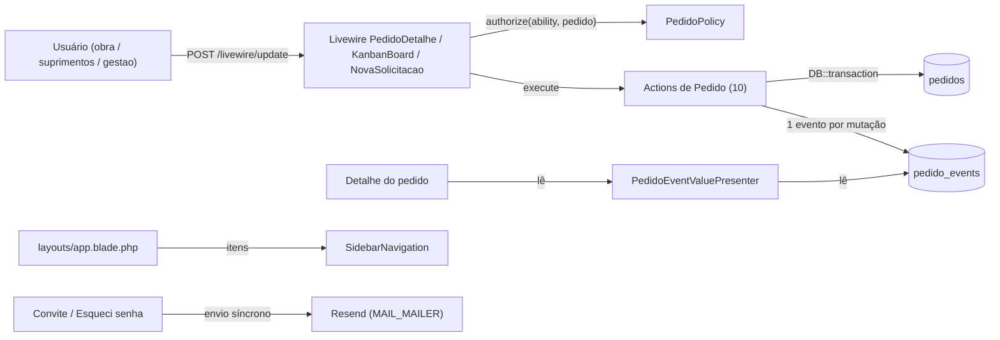
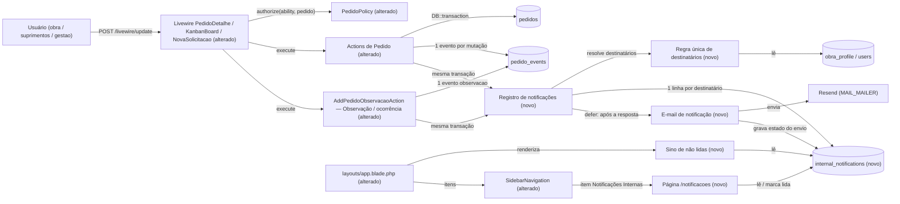

# SPEC: notificacoes-internas

## Metadata
- Source: developer description via /plan (`.spec/features/notificacoes-internas/.handoff/confirmed-input.md`)
- Service: sistema_obra_mc (Laravel 13 + Livewire 4 monólito; PHP 8.4 em produção)
- Tier: complete
- Version: 1.2 (Q-01..Q-06 resolvidas pelo desenvolvedor; escopo de ocorrências reduzido à evolução da observação existente; v1.2: Q-07 — abrir uma notificação a marca como lida antes de navegar)
- Architecture references: `CLAUDE.md` (seções 2, 3, 5, 6, 8), `AGENTS.md`, `docs/agents/architecture.md`, `docs/agents/domain_rules.md`, `docs/agents/data_model.md`, `docs/agents/api_contracts.md`. Init chain (`.spec/init/*.md`) lida só como contexto: descreve a stack Next.js/Supabase descontinuada; o código é a fonte da verdade.

Regras de arquitetura aplicadas (citadas das referências):
- **Componente Livewire → `authorize()` → Action.** Toda escrita passa por uma Action com guard traits, validação PT-BR e `DB::transaction` (`docs/agents/architecture.md`, "Layer responsibilities"; `CLAUDE.md` §5, camadas 3b–5).
- **Histórico append-only.** `pedido_events` e as tabelas `*_events` têm `UPDATED_AT = null` e hooks `updating`/`deleting` que lançam exceção (`CLAUDE.md` §6; `app/Models/PedidoEvent.php:28-37`).
- **`visibleTo` primeiro.** Visibilidade de linha por papel só em `Pedido::scopeVisibleTo` (`app/Models/Pedido.php:83`), aplicado na instrução que abre a consulta (`CLAUDE.md` §5, "Decisão travada").
- **Sidebar = catálogo único, nunca autorização.** Item novo entra em `SidebarNavigation::catalogue()` (`app/Support/SidebarNavigation.php:59`) com exatamente as habilidades `can:` da rota (`CLAUDE.md` §8).
- **Sem fila, worker nem scheduler em produção.** Notificações atuais não implementam `ShouldQueue` (`app/Notifications/FirstAccessInvite.php:18`, docblock "no worker exists"); `routes/console.php` só tem `inspire` (`CLAUDE.md` §2, "O que NÃO existe").
- **Calendário local.** Toda data/hora exibida passa por `App\Support\LocalTime` (`CLAUDE.md` §3).
- **Estado de filtro só por `#[Url]`; toggles Alpine por `data-open` com classes Tailwind literais** (`CLAUDE.md` §8, "Convenções travadas de UI").

## Context

Hoje o acompanhamento de um pedido exige abrir o detalhe e ler o histórico (`pedido_events`, apresentado por `PedidoEventValuePresenter`, `app/Services/PedidoEventValuePresenter.php:31`). Nenhum usuário é avisado quando algo muda: o único e-mail do sistema é o de autenticação (convite de primeiro acesso, redefinição de senha), enviado de forma síncrona.

A feature cria a área **Notificações Internas**: cada evento relevante de um pedido gera uma notificação in-app para cada destinatário elegível e um e-mail para ele. Os destinatários são definidos pelo papel e pela associação a obras (`obra_profile`). A feature acrescenta:

1. Uma página "Notificações Internas" na sidebar dos 3 papéis.
2. Um sino fixo no layout com o contador de não lidas.
3. Um mecanismo único e extensível que mapeia tipo de evento → notificação.
4. O registro de **observações / ocorrências** (falta de produto, troca, atraso, problema de entrega, qualquer informação relevante) como **texto livre obrigatório**, sem categoria. Isso evolui o fluxo de observação já existente (`AddPedidoObservacaoAction`, evento `observacao`, verificado em `app/Actions/Pedidos/AddPedidoObservacaoAction.php:31-51`): ele já aceita os 3 papéis (Obra só com `view`, via `GuardsObraPedidoMutation::ensureActorMayObserve`, `:35-46`), qualquer status, máximo de 2000 caracteres, e grava 1 evento append-only com autor e data/hora. A feature só renomeia o controle para "Observação / ocorrência" e passa a notificar. Não há categorias nem tipos de evento novos (decisão Q-02).

### Achados do código que moldam a SPEC

| Achado | Evidência | Consequência |
|---|---|---|
| 10 tipos de evento, todos gravados dentro de Actions transacionais | `app/Enums/EventTypeSlug.php:7-16`; `events()->create` em `UpdatePedidoStatusAction.php:57`, `CancelPedidoAction.php:43`, `FinalizePedidoAction.php:70`, `AttachRomaneioAction.php:81`, `MarkPedidoEntregueByObraAction.php:53`, `UpdatePedidoResponsavelAction.php:45`, `UpdatePedidoPrioridadeAction.php:44`, `UpdatePedidoPrevisaoAction.php:43`, `CreatePedidoAction.php:167`, `AddPedidoObservacaoAction.php:44` | O ponto natural de geração é o evento de histórico: toda mutação relevante já produz exatamente 1 `pedido_event`. O Kanban passa por `UpdatePedidoStatusAction` e fica coberto sem tratamento especial |
| Suprimentos vê **todos** os pedidos, independentemente de associação | `Pedido::visibleTo` (`app/Models/Pedido.php:83-94`): `RoleSlug::Suprimentos, RoleSlug::Gestao => $query`; `PedidoPolicy::view` (`app/Policies/PedidoPolicy.php:22-31`) | O escopo de notificação de Suprimentos (associação à obra **ou** responsável pelo pedido, Q-06) é **mais estreito** que o de visibilidade. Isso é deliberado (AC 1) e não altera o que Suprimentos pode abrir |
| Gestão não tem associações | `UpdateUserAction.php:75` faz `detach()` ao mudar para `gestao`; `CreateUserAction::obraIdsRules` proíbe obras para `gestao` | O escopo de Gestão é "todos", nunca derivado de `obra_profile` |
| Pedido "Outra" não tem obra | `pedidos.obra_id` NULL; `PedidoPolicy::view` concede ao `obra` só se ele for o solicitante | Para `obra`, o destinatário de pedido "Outra" é o solicitante (espelha `view`). Para `suprimentos` não há associação aplicável → todos os `suprimentos` ativos recebem (Q-01) |
| `User` já usa `Notifiable`; não existe tabela `notifications` | `app/Models/User.php:17,24`; `ls database/migrations` sem `notifications` | Tabela nova |
| E-mails anclados em `APP_URL` | `app/Notifications/Concerns/BuildsAppUrl.php:16-19` | O link do e-mail para o pedido reusa essa regra |
| Sem worker; fila só configurada | `config/queue.php:16` (default `database`); nenhum job em `app/`; 2 serviços no Railway (`CLAUDE.md` §2) | `ShouldQueue` sem worker deixaria e-mails parados na tabela `jobs` para sempre |
| `defer()` disponível no framework | `vendor/laravel/framework/src/Illuminate/Support/functions.php:21`; middleware global `InvokeDeferredCallbacks` (`vendor/laravel/framework/src/Illuminate/Foundation/Configuration/Middleware.php:455`); `Response::send()` chama `fastcgi_finish_request()` quando a função existe (`vendor/symfony/http-foundation/Response.php:414-415`) | Base da estratégia de e-mail (abaixo) |

### Análise: e-mail sem deixar a mutação lenta (AC 6)

| Opção | Latência da mutação | Infra nova | Risco |
|---|---|---|---|
| A. Envio síncrono dentro da Action (padrão atual de `FirstAccessInvite`) | +1 chamada HTTP ao Resend **por destinatário**, antes da resposta | nenhuma | Viola o AC 6: um pedido com 6 destinatários soma ~6 chamadas HTTP ao tempo de alterar status |
| **B. Gravar a notificação na transação; enviar os e-mails depois de a resposta sair (`defer()`)** — **escolhida** | 0 chamada HTTP antes da resposta | nenhuma | O ganho de latência depende de o runtime (FrankenPHP via Railpack) entregar a resposta antes dos callbacks diferidos; se não entregar, os e-mails saem corretamente, só que antes de a resposta ser concluída. Sem retry automático (não há scheduler). Uma falha fica registrada na notificação; a notificação in-app nunca se perde |
| C. `ShouldQueue` + fila `database` + worker | 0 chamada HTTP; só 1 INSERT em `jobs` | **SIM: um serviço worker novo no Railway** (`php artisan queue:work`), com as mesmas variáveis e o mesmo build | Mais um serviço para operar e monitorar; sem worker os e-mails ficam parados sem nenhum erro visível |

**Decisão desta SPEC: opção B** (Q-04). O envio de e-mail em si já funciona em produção (convites e redefinição de senha saem hoje pelo Resend); a única preocupação é não pesar no tempo de resposta. O ponto técnico restante é estreito: confirmar que o FrankenPHP do Railpack encerra a resposta antes dos callbacks de `defer()` (`fastcgi_finish_request()` ou equivalente, `vendor/symfony/http-foundation/Response.php:414-415`). Isso é uma **tarefa leve de verificação no PLAN** (RNF-03), não uma pergunta de produto. A opção C fica documentada só como **evolução futura**: implica um novo serviço worker no Railway e exige aprovação explícita; não faz parte desta feature.

### Análise: notificar a criação de pedido (AC 4)

**Decisão: sim, a criação gera notificação.** Hoje Suprimentos só descobre um pedido novo abrindo a listagem ou o Kanban (`Suprimentos\TodosPedidos`, `KanbanBoard`). A criação é o gatilho do trabalho de Suprimentos (análise → compra → entrega) e o evento que mais se beneficia de aviso ativo. O evento `criacao_pedido` já existe e é gravado na transação de `CreatePedidoAction` (`:167`). Ele segue a mesma regra de destinatários. O autor nunca é notificado (RF-05), então a obra que criou o pedido não recebe aviso da própria criação. Outros usuários `obra` associados à mesma obra recebem.

## AS IS — Estado atual

Hoje cada mutação de pedido grava 1 linha em `pedido_events` dentro da transação da Action. Esse histórico só é visto quando alguém abre o detalhe. O único e-mail enviado é o de autenticação, de forma síncrona. Não existe aviso ativo nem estado de leitura.

## TO BE — Estado proposto

O registro de notificações (RF-01–RF-08, CT-02) roda na mesma transação do evento. Ele grava uma linha por destinatário resolvido pela regra única (RF-03–RF-07). O e-mail (RF-14–RF-17, CT-03) sai depois que a resposta é enviada e não pesa na mutação (RNF-01, RNF-02). A observação / ocorrência (RF-10–RF-13, CT-04) reusa o fluxo `observacao` existente, só com rótulo novo e notificação. O sino (UI-05–UI-07), a página `/notificacoes` (UI-01–UI-04, CT-01) e o item da sidebar (UI-08) são novos. As Actions e o layout são alterados para acoplar esses pontos.

## Scope

- **In**:
  - Geração de notificação in-app para os 10 tipos de evento existentes.
  - Regra única de destinatários por papel/associação/responsável, excluindo autor e inativos.
  - Tabela de notificações com estado de leitura e estado do envio de e-mail.
  - Controle "Observação / ocorrência" (texto livre obrigatório) no detalhe do pedido, evoluindo a observação existente.
  - Página "Notificações Internas" (3 papéis) com filtros, marcar lida e marcar todas como lidas.
  - Sino global com contador de não lidas.
  - E-mail por notificação, enviado após a resposta.
  - Limpeza no `demo:reset`.
- **Out**:
  - Notificação **automática** de atraso por virada de data. Exigiria scheduler/cron, que não existe em produção (`routes/console.php:6-8`). Atraso é registrado manualmente como observação / ocorrência e notifica normalmente (Q-03). Alerta automático é possível feature futura separada.
  - Categorias de ocorrência (falta de produto, troca, atraso, problema de entrega, outra) e tipos de evento novos. Nenhum ganho para as notificações; podem voltar numa feature futura de organização (Q-02).
  - Serviço worker / fila (opção C) — só como evolução futura com aprovação (Q-04).
  - Retry automático de e-mail com falha (sem scheduler nem worker).
  - Preferências de notificação por usuário (opt-out de e-mail, por tipo).
  - Push, SMS, WhatsApp, WebSocket/broadcast em tempo real.
  - Upload de "documento relevante" além do romaneio. Não existe caminho de upload após a criação além de `AttachRomaneioAction`. Só `romaneio_anexado` notifica.
  - Notificações de eventos que não são de pedido (usuários, obras, convites).
  - Edição ou exclusão de observações / ocorrências e notificações.
  - Retenção ou expurgo de notificações antigas.
  - Notificar usuários associados **depois** do evento. A notificação é resolvida no momento do evento e nunca reprocessada.

## RIGID (Non-Negotiable)

### Functional Requirements

#### Geração

- RF-01 [Event-Driven]: When a `pedido_event` of a notifiable type is persisted, the system shall persist, inside the same database transaction, exactly 1 notification per resolved recipient, referencing that event, its pedido and its actor.
  - AC: Após cada Action de pedido bem-sucedida, `count(internal_notifications where pedido_event_id = E) = count(destinatários resolvidos por RF-03..RF-07)`. Se a transação da Action sofrer rollback, 0 notificações existem para a mutação.
- RF-02 [Ubiquitous]: The system shall treat as notifiable exactly the event types `criacao_pedido`, `mudanca_status`, `entrega`, `cancelamento`, `finalizacao`, `alteracao_responsavel`, `alteracao_prioridade`, `alteracao_previsao`, `observacao`, `romaneio_anexado` (verified at `app/Enums/EventTypeSlug.php:7-16`). Each type shall be classified as notifiable or not in a single definition.
  - AC: Um teste de compliance falha se algum caso de `EventTypeSlug` não estiver classificado nessa definição única. Cada um dos 10 tipos gera ≥ 1 notificação num cenário com destinatário elegível.
- RF-03 [State-Driven]: While a user has papel `gestao` and `is_active = true`, the system shall include that user as recipient of every notifiable event.
  - AC: Com 2 usuários `gestao` ativos que não são o autor, cada evento notificável gera 1 notificação para cada um.
- RF-04 [State-Driven]: While a pedido has a non-null `obra_id`, the system shall include as recipients the active users with papel `obra` associated to that obra in `obra_profile`, and the active users with papel `suprimentos` that are associated to that obra in `obra_profile` **or** are the pedido's `responsible_id` (either condition suffices), and no other `suprimentos`/`obra` user.
  - AC: Obra X com Suprimentos S1 (associado), S2 (não associado, não responsável), S3 (não associado, `responsible_id` do pedido), Obra O1 (associada) e O2 (de outra obra): um evento em pedido da obra X notifica S1, S3 e O1, e não notifica S2 nem O2. S2 continua podendo abrir o pedido (a visibilidade não muda).
- RF-04a [Ubiquitous]: The system shall create at most 1 notification per (event, recipient), even when a user satisfies more than one inclusion rule.
  - AC: Suprimentos S1 associado à obra X **e** `responsible_id` do pedido: um evento gera exatamente 1 notificação e 1 e-mail para S1.
- RF-04b [Event-Driven]: When the event is `alteracao_responsavel`, the system shall evaluate the `responsible_id` rule against the pedido state after the change (the new responsible).
  - AC: Suprimentos S3, não associado, passa a ser responsável por ação de outro usuário: S3 recebe a notificação do evento `alteracao_responsavel`. O responsável anterior, não associado, não recebe.
- RF-05 [Unwanted]: If a resolved recipient is the actor of the event, then the system shall not create a notification nor send an e-mail to that user for that event.
  - AC: Usuário `gestao` que altera a prioridade não recebe notificação desse evento. Os demais `gestao` ativos recebem.
- RF-06 [Unwanted]: If a candidate recipient has `is_active = false` at the moment of the event, then the system shall not create a notification nor send an e-mail to that user.
  - AC: Usuário `suprimentos` associado e desativado: 0 notificações e 0 e-mails para ele após qualquer evento.
- RF-07 [Unwanted]: If a candidate recipient would be denied `PedidoPolicy::view` (verified at `app/Policies/PedidoPolicy.php:22`) for the pedido, then the system shall not create a notification for that user.
  - AC: Para todo par (notificação, destinatário) gerado na suíte, `PedidoPolicy::view(destinatário, pedido)` é `true` no momento da geração.
- RF-08 [State-Driven]: While a pedido has `obra_id = null` (pedido "Outra"), the system shall include as `obra` recipient only the pedido's requester, when that requester has papel `obra`, is active and is not the actor, and shall include as `suprimentos` recipients every active `suprimentos` user except the actor.
  - AC: Pedido "Outra" criado por O1 (`obra`), com Suprimentos S1 e S2 ativos e S3 inativo: uma observação de S1 notifica O1 e S2, e não notifica S1 (autor), S3 (inativo) nem nenhum outro usuário `obra`.
- RF-09 [Ubiquitous]: The system shall resolve the recipients of an event from a single definition, reused by every event source, so that a new event type becomes notifiable by registering it in the RF-02 classification, without changes to the recipient rule, storage, page, bell or e-mail.
  - AC: Um teste de compliance falha se alguma Action de pedido gravar `pedido_events` sem passar pelo ponto único de registro de notificações. Adicionar um tipo fictício à classificação num teste gera notificações sem nenhuma outra alteração.

#### Observação / ocorrência

Fluxo único: o existente `AddPedidoObservacaoAction` / evento `observacao` (CT-04). Sem categoria, sem tipo de evento novo.

- RF-10 [Event-Driven]: When an authorized user registers an observation / occurrence on a pedido with a free text, the system shall persist exactly 1 `observacao` `pedido_event` with the trimmed text in `new_value`, the actor and the timestamp, without altering the `pedidos` row, and shall generate its notifications and e-mails per RF-01 and RF-14.
  - AC: Após registrar, `pedido_events` tem +1 linha `observacao` com o texto em `new_value`; `pedidos.updated_at` e `status_id` ficam inalterados; a entrada aparece no histórico do detalhe com autor e data/hora local; os destinatários resolvidos recebem 1 notificação e 1 e-mail cada, com o código do pedido.
- RF-11 [Unwanted]: If the text is empty after trim or exceeds 2000 characters (`AddPedidoObservacaoAction::MAX_LENGTH`), then the system shall reject it with HTTP 422 and the existing PT-BR inline message, persisting nothing.
  - AC: Texto "   " → 422 "Escreva a observação."; 2001 caracteres → 422 "A observação deve ter no máximo 2000 caracteres.". Nos 2 casos, 0 eventos e 0 notificações.
- RF-12 [Conditional]: Where the actor is `suprimentos`, `gestao`, or `obra` with `view` on the pedido (verified at `GuardsObraPedidoMutation::ensureActorMayObserve`, `app/Actions/Pedidos/Concerns/GuardsObraPedidoMutation.php:35-46`), the system shall allow registering an observation / occurrence, with no restriction on its content. Any other actor shall receive HTTP 403.
  - AC: `obra` sem `view` no pedido → 403, 0 eventos e 0 notificações. `suprimentos`, `gestao` e `obra` com `view` → sucesso.
- RF-13 [Ubiquitous]: The system shall accept observations / occurrences in every status, terminal ones (`entregue`, `cancelado`, `finalizado`) included.
  - AC: Um teste por status terminal: o registro grava 1 evento `observacao` e gera as notificações dos destinatários resolvidos.

#### E-mail

- RF-14 [Event-Driven]: When a notification is persisted, the system shall send 1 e-mail to its recipient's address, in PT-BR, identifying the pedido code, the obra label (`Pedido::obraLabel()`), the event type label, the event content, the actor name and the local date/time (`LocalTime::formatDateTime`), with a link to the pedido detail route of the recipient's papel.
  - AC: Para N notificações persistidas, o mailer fake registra N mensagens, cada uma com o e-mail do destinatário. O corpo contém o código `PED-…`, o rótulo do tipo e o link.
- RF-15 [Ubiquitous]: The system shall build the e-mail link from `APP_URL` (verified at `app/Notifications/Concerns/BuildsAppUrl.php:16-19`) to `obra.pedidos.show` (verified at `routes/web.php:95`), `suprimentos.pedidos.show` (verified at `routes/web.php:100`) or `gestao.pedidos.show` (verified at `routes/web.php:134`), according to the recipient's papel.
  - AC: Com `APP_URL=https://exemplo.test`, o link para um destinatário `obra` é `https://exemplo.test/obra/pedidos/{id}`; para `gestao`, é `https://exemplo.test/gestao/pedidos/{id}`.
- RF-16 [Unwanted]: If sending an e-mail fails, then the system shall keep the in-app notification, record the delivery as failed with the timestamp, log the failure without the recipient address or event content, and not affect the mutation already committed nor the other recipients' e-mails.
  - AC: Com transporte de e-mail que lança exceção para o destinatário A: a mutação está gravada, a notificação de A existe com envio "falhou", e o destinatário B recebe o e-mail com envio "enviado".
- RF-17 [Unwanted]: If the database transaction of the mutation is rolled back, then the system shall send no e-mail for it.
  - AC: Forçando exceção após o INSERT do evento dentro da Action, o mailer fake registra 0 mensagens.

#### Leitura e acesso

- RF-18 [Event-Driven]: When the recipient marks a notification as read, the system shall set its read timestamp once. Repeating the action keeps the first timestamp.
  - AC: `read_at` é preenchido. Uma segunda marcação não altera o valor.
- RF-19 [Event-Driven]: When the user triggers "Marcar todas como lidas", the system shall set the read timestamp of every unread notification of that user, and of no other user, in a single operation.
  - AC: Usuário A com 5 não lidas e B com 3: depois da ação de A, A tem 0 não lidas e B continua com 3.
- RF-20 [Unwanted]: If a user attempts to read or mark a notification whose recipient is another user (including a forged id), then the system shall respond HTTP 403 or 404 and change nothing.
  - AC: Chamada Livewire forjada com o id de uma notificação de outro usuário → 403/404 e `read_at` inalterado.
- RF-21 [Ubiquitous]: The system shall list and count for a user only that user's notifications whose pedido the user may currently view (`Pedido::visibleTo`, verified at `app/Models/Pedido.php:83`), with `visibleTo` applied in the statement that opens the query.
  - AC: Usuário `obra` desassociado da obra X depois de receber notificações de pedidos de X: elas deixam de aparecer na página e no contador do sino.
- RF-22 [Ubiquitous]: The system shall keep notifications append-only except for the read timestamp and the e-mail delivery state: no update of other columns and no deletion through the application (except `demo:reset`, RF-23).
  - AC: Atualizar qualquer outra coluna ou excluir via Eloquent lança exceção, no mesmo padrão de `PedidoEvent` (`app/Models/PedidoEvent.php:28-37`).
- RF-23 [Event-Driven]: When `php artisan demo:reset` runs, the system shall delete the notifications of demo pedidos and of demo users before deleting those rows, inside the existing transaction.
  - AC: `demo:reset --force` com notificações demo termina com código 0 e 0 notificações ligadas a pedidos ou usuários demo. Notificações não demo permanecem.

### UI Requirements

- UI-01 [Event-Driven]: When an authenticated active user with papel `obra`, `suprimentos` or `gestao` opens the page "Notificações Internas" (CT-01), the system shall list that user's notifications in reverse chronological order, 20 per page. Each item shows: pedido code, obra label, event type label (PT-BR), content (text, or old → new value as rendered by `PedidoEventValuePresenter`), actor name, local date/time, and read/unread state.
  - AC: Com 25 notificações, a página 1 mostra 20, a mais recente primeiro, com os 7 campos. Não lidas têm marcação visual e textual (não só cor).
- UI-02 [Event-Driven]: When the user activates a notification (on the page CT-01 or in the bell panel UI-06), the system shall first mark that notification as read with RF-18 semantics (idempotent: an already read notification keeps its first `read_at`), re-authorizing on the server that the user is its recipient (RF-20), and then navigate to the pedido detail route of the user's papel (same routes as RF-15).
  - AC: Clique num item não lido de usuário `suprimentos`, na página ou no sino, preenche `read_at` e leva a `/suprimentos/pedidos/{id}`; o contador do sino diminui 1. Clique num item já lido mantém o `read_at` original e navega igual. Chamada Livewire forjada com o id de uma notificação de outro usuário → 403/404, nenhuma navegação e `read_at` inalterado.
- UI-03 [Event-Driven]: When the user activates "Marcar como lida" on an item or "Marcar todas como lidas" on the page, the system shall apply RF-18/RF-19 and update the list and the bell counter in the same response.
  - AC: Depois de "Marcar todas como lidas", a página não mostra itens não lidos e o sino mostra 0 / nenhum badge.
- UI-04 [Optional]: Where the user applies filters on the page, the system shall filter by read state (todas / não lidas / lidas), event type and pedido code. Each filter is a `#[Url]` property with `except:` for the neutral value.
  - AC: `?lidas=nao` mostra só não lidas. "Limpar filtros" deixa a URL sem parâmetros (`FilterUrlStateComplianceTest` estendido à página).
- UI-05 [Ubiquitous]: The system shall render, on every page of `layouts/app.blade.php`, a fixed bell control showing the count of unread notifications of the current user (RF-21), displayed as `9+` above 9 and hidden badge at 0. The control's accessible name is "Notificações, N não lidas".
  - AC: Usuário com 3 não lidas vê o badge "3" no desktop (sidebar/topo) e no celular (barra superior). O leitor de tela anuncia "Notificações, 3 não lidas".
- UI-06 [Event-Driven]: When the user opens the bell, the system shall show the 10 most recent unread notifications (pedido code, type label, local date/time), each linking as UI-02, plus "Marcar todas como lidas" and "Ver todas", which goes to CT-01. With 0 unread, it shows "Nenhuma notificação nova.".
  - AC: Com 12 não lidas, o painel lista 10, a mais recente primeiro. "Ver todas" leva a `/notificacoes`.
- UI-07 [State-Driven]: While a page is open and its tab is visible, the system shall refresh the bell counter and list every 60 s and on every full page navigation, without reloading the page. While the tab is hidden, the system shall not issue refresh requests.
  - AC: Uma notificação criada para o usuário enquanto a página está aberta e visível aparece no badge em ≤ 65 s. Com a aba oculta por 120 s, 0 requisições de atualização do sino são emitidas.
- UI-08 [Ubiquitous]: The system shall add the sidebar item "Notificações Internas" for the 3 papéis through `SidebarNavigation::catalogue()` (verified at `app/Support/SidebarNavigation.php:59`). The item's abilities are exactly the route's `can:` abilities, its active pattern is `notificacoes.*`, and it sits in its own group after the operation items.
  - AC: `SidebarNavigationCatalogueTest` passa com o item novo nos 3 papéis. Em `/notificacoes`, só esse item tem `aria-current="page"`.
- UI-09 [Event-Driven]: When a user who may register observations / occurrences (RF-12) opens a pedido detail (`Obra\PedidoDetalhe`, `Suprimentos\PedidoDetalhe` — also used by Gestão), the system shall show the existing observation control (`<x-pedido-observacao-form />`) labelled "Observação / ocorrência", with a single required free-text field limited to 2000 characters, a hint that it may record falta de produto, troca, atraso, problema de entrega or any relevant information, and no category select. Validation errors appear inline.
  - AC: O controle com o rótulo "Observação / ocorrência" aparece nos detalhes de Obra, Suprimentos e Gestão, sem select de categoria. Enviar vazio mostra "Escreva a observação." no campo.
- UI-10 [Ubiquitous]: The system shall style the bell and the page with literal Tailwind classes only, toggle the bell panel through `data-open` + `x-bind:data-open` (no `x-show`, no `
`), and close it with Escape, returning focus to the bell.
  - AC: Nenhuma classe interpolada nas views novas. Escape fecha o painel e o foco volta ao sino (teste Browser).

### Contracts

- CT-01 (novo): Página `GET /notificacoes`, rota nomeada `notificacoes.index`, no grupo `auth` + `active` (`routes/web.php:61`). Também exige uma habilidade nova que concede acesso aos papéis `obra`, `suprimentos` e `gestao` e nega papel desconhecido (HTTP 403). Nenhum parâmetro de rota. Query string só com os filtros de UI-04. `RouteMiddlewareBaselineTest` é atualizado com a rota.
- CT-02 (novo): Entidade persistida "notificação interna", 1 linha por (evento, destinatário). Campos obrigatórios:
  - destinatário (FK `users`, RESTRICT);
  - pedido (FK `pedidos`, CASCADE);
  - evento de origem (FK `pedido_events`, CASCADE);
  - tipo de evento (slug);
  - ator (FK `users`, RESTRICT);
  - `created_at`;
  - `read_at` nullable;
  - estado do e-mail `pendente` | `enviado` | `falhou` (check constraint), com timestamp do último resultado.

  Unicidade em (evento de origem, destinatário). Índice para "não lidas do usuário em ordem decrescente de criação". Sem `updated_at` de domínio (RF-22). O conteúdo exibido é derivado do evento de origem (imutável), nunca copiado.
- CT-03 (novo): E-mail de notificação. Remetente `config('mail.from')` (`MAIL_FROM_*`). Assunto `[<código>] <rótulo do tipo> — <obraLabel>`. Corpo PT-BR com os campos de RF-14 e um botão "Ver pedido" (link de RF-15). Nunca contém senha, token ou anexo. Sai pelo transporte configurado em `MAIL_MAILER` (`log` | `resend`, `config/mail.php`).
- CT-04 (existente, reutilizado sem mudança de schema): Observação / ocorrência = evento `observacao` já existente (`EventTypeSlug::Observacao`), gravado por `AddPedidoObservacaoAction::execute(User $actor, Pedido $pedido, string $texto): PedidoEvent`. `previous_value` null; `new_value` = texto trimado (1..2000). Nenhum tipo de evento, coluna, migration ou categoria nova; `pedido_events` continua append-only e o histórico existente é renderizado como hoje. Só muda o rótulo da UI (UI-09) e o acoplamento ao registro de notificações (RF-09).
- CT-05 (novo): Ações Livewire do usuário autenticado: marcar uma notificação própria como lida (por id), abrir uma notificação própria (por id: marca lida e redireciona ao detalhe do papel, UI-02), marcar todas como lidas. A ação existente `adicionarObservacao` (`Obra\PedidoDetalhe`, `Suprimentos\PedidoDetalhe`) mantém a assinatura. Toda ação reautoriza no servidor: dono da notificação (RF-20) ou RF-12 para a observação / ocorrência.

### Non-Functional Requirements

- RNF-01: O envio de e-mail não pode ocorrer antes de a resposta HTTP da mutação ser enviada. Zero chamadas ao transporte de e-mail durante a execução da Action e do componente.
  - AC: Em teste, com os callbacks diferidos desligados, uma alteração de status com 5 destinatários registra 0 mensagens no mailer até os callbacks diferidos serem executados. Depois de executados, registra 5.
- RNF-02: A geração de notificações acrescenta à transação da mutação um número **constante** de consultas: ≤ 4, independentemente do número de destinatários (resolução de destinatários + INSERT em lote).
  - AC: `QueryCountTest` estendido: o delta de consultas de `UpdatePedidoStatusAction` com 1 e com 20 destinatários é o mesmo e é ≤ 4.
- RNF-03: Em produção (FrankenPHP/Railpack), o tempo de resposta de uma alteração de status com 5 destinatários e `MAIL_MAILER=resend` não pode exceder o tempo da mesma operação com 0 destinatários em mais de 150 ms (p95 de 20 execuções). Verificado por uma tarefa técnica leve do PLAN: confirmar que o runtime entrega a resposta antes dos callbacks de `defer()` (`fastcgi_finish_request()` ou equivalente do FrankenPHP).
  - AC: A medição (p95 com 5 vs. 0 destinatários) fica registrada na fase de verificação com resultado passa/falha. Em caso de falha, os e-mails continuam sendo enviados corretamente; a decisão é reavaliada e a opção C (worker) só entra com aprovação explícita, fora desta feature.
- RNF-04: O contador do sino executa ≤ 1 consulta por renderização e usa índice (CT-02).
  - AC: `QueryCountTest`: renderizar o layout para um usuário com 500 notificações adiciona exatamente 1 consulta para o contador.
- RNF-05: Nenhuma dependência nova de runtime (composer ou npm), nenhum serviço Railway novo, nenhuma variável de ambiente nova obrigatória na opção B.
  - AC: `composer.json`, `package.json` e a lista de serviços Railway ficam inalterados pela feature.
- RNF-06: Todo texto visível e todo e-mail em PT-BR. Toda data/hora formatada por `LocalTime` (`America/Sao_Paulo`).
  - AC: `LocalTimeDisplayComplianceTest` cobre as views novas e o template de e-mail.
- RNF-07: Isolamento entre usuários: nenhuma consulta de listagem, contador ou marcação de notificação pode retornar ou alterar uma linha cujo destinatário não seja o usuário autenticado.
  - AC: Teste adversarial com 2 usuários cobre página, sino, marcar lida e marcar todas.
- RNF-08: Logs de falha de envio não contêm endereço de e-mail, texto de observação/ocorrência nem token.
  - AC: Teste captura o log de uma falha forçada e verifica a ausência desses 3 valores.
- RNF-09: A resolução de destinatários (gestão + obra associada + suprimentos associado ou responsável + regra "Outra") roda numa consulta única com deduplicação, dentro do limite de RNF-02.
  - AC: `QueryCountTest`: pedido com Suprimentos associado e responsável ao mesmo tempo gera o mesmo delta de consultas que sem responsável, e 1 linha para esse usuário.

## FLEXIBLE (Implementation Suggestions)

- Nome da tabela: `internal_notifications` (evita colidir com a tabela `notifications` do canal `database` do Laravel, de schema polimórfico e `data` JSON). Model `InternalNotification` com `UPDATED_AT = null` e hook `updating` que só permite `read_at` e as colunas de envio.
- Ponto único: um serviço `App\Services\PedidoNotificationRecorder::record(PedidoEvent $event): void`, chamado logo após cada `events()->create(...)` nas Actions. Alternativa: um hook `created` em `PedidoEvent`, que dispensa tocar as 10 Actions, mas esconde o acoplamento; se adotada, garantir que roda dentro da transação. Resolução de destinatários em `App\Domain\Pedidos\NotificationRecipientResolver` (puro sobre uma consulta única: `users` ativos ⋈ `roles` ⋈ `obra_profile`, com `OR users.id = pedidos.responsible_id` para `suprimentos` e ramo "Outra" = todos os `suprimentos` ativos; `DISTINCT` por usuário), seguido de INSERT em lote. Ler o pedido já atualizado (relevante para `alteracao_responsavel`, RF-04b).
- Classificação extensível: um `enum` ou mapa `NotifiableEventTypes` sobre `EventTypeSlug`, com teste de compliance que itera `EventTypeSlug::cases()`.
- E-mail: `App\Notifications\PedidoEventNotification` (via `mail`, sem `ShouldQueue`), disparado por `defer(fn () => ..., always: false)` registrado com `DB::afterCommit` para garantir RF-17. Uma única closure diferida por requisição envia em sequência e atualiza o estado de envio de cada linha. Template markdown `resources/views/mail/pedidos/notificacao.blade.php` no padrão de `mail/auth/*`.
- Evolução (opção C, só com aprovação): trocar o envio diferido por `ShouldQueue` + `after_commit` e criar o serviço Railway `laravel-worker` com `php artisan queue:work --tries=3`. As variáveis do build precisariam ser replicadas.
- Observação / ocorrência: só acoplar `AddPedidoObservacaoAction` ao registro de notificações e trocar o rótulo/dica em `x-pedido-observacao-form`. Atualizar o docblock da Action (hoje cita só `suprimentos` e `obra`, mas o guard já aceita `gestao` via `operate-pedidos`).
- UI: componente Livewire `Notificacoes\Index` (página) e `Notificacoes\Bell` (embutido no layout, `wire:poll.60s.visible` para não consultar com a aba oculta).
- Verificação do `defer()` em produção (RNF-03): checar `function_exists('fastcgi_finish_request')` / comportamento do FrankenPHP e medir o p95 numa fase curta do PLAN. Habilidade `view-notifications` no `AppServiceProvider`. Item na sidebar em grupo próprio, sem rótulo ou com rótulo "Notificações".
- `DemoSeeder`: gerar algumas notificações demo para a demonstração do sino.

## Open Questions

Todas resolvidas: Q-01..Q-06 na versão 1.1 (`.handoff/clarifier-answers.md`), Q-07 na versão 1.2 (decisão do desenvolvedor sobre a OQ-1 do PLAN). Nenhuma pergunta aberta.

| ID | Pergunta | Decisão do desenvolvedor | Aplicada em |
|---|---|---|---|
| Q-01 | Pedido "Outra": quais `suprimentos` recebem? | Todos os `suprimentos` ativos (menos o autor); lado Obra inalterado (só o solicitante `obra`) | RF-08 |
| Q-02 | Quem registra cada categoria de ocorrência e em que status? | Gestão, Suprimentos e Obra com `view`, sem restrição de conteúdo; texto livre obrigatório, sem categoria; qualquer status. Evolui o fluxo `observacao` existente | RF-10..RF-13, UI-09, CT-04, Scope |
| Q-03 | Atraso automático? | Não. Atraso é registrado manualmente e notifica; alerta automático é feature futura | Scope (Out) |
| Q-04 | E-mail sem pesar na resposta | Opção B (`defer()`), sem fila/worker. Verificação leve do flush do FrankenPHP no PLAN | Análise de e-mail, RNF-03, FLEXIBLE |
| Q-05 | Intervalo do sino | 60 s, pausado com a aba oculta | UI-07 |
| Q-06 | `suprimentos` responsável não associado recebe? | Sim: associado **ou** `responsible_id`; ativo; nunca o autor; 1 notificação por usuário por evento | RF-04, RF-04a, RF-04b, RNF-09 |
| Q-07 | Clicar numa notificação a marca como lida? | Sim: na página e no sino, abrir a notificação marca como lida (idempotente, só o dono) e depois navega ao detalhe do papel | UI-02, CT-05 |

## Acceptance Criteria Summary

| ID | Criterion | Testable? |
|----|-----------|-----------|
| RF-01 | N notificações = N destinatários resolvidos; 0 em rollback | Sim |
| RF-02 | Os 10 tipos classificados numa definição única; compliance sobre `EventTypeSlug::cases()` | Sim |
| RF-03 | Todo `gestao` ativo não autor recebe todo evento | Sim |
| RF-04 | `obra` associado; `suprimentos` associado ou responsável | Sim |
| RF-04a | 1 notificação por (evento, usuário) mesmo com 2 regras | Sim |
| RF-04b | `alteracao_responsavel` usa o novo responsável | Sim |
| RF-05 | Autor nunca recebe | Sim |
| RF-06 | Inativo nunca recebe | Sim |
| RF-07 | Toda notificação satisfaz `PedidoPolicy::view` | Sim |
| RF-08 | Pedido "Outra": solicitante `obra` + todos os `suprimentos` ativos | Sim |
| RF-09 | Ponto único; tipo novo notifica sem outra mudança | Sim |
| RF-10 | Observação / ocorrência grava 1 `observacao`, notifica; pedido intocado | Sim |
| RF-11 | Validação 422 com 2 mensagens PT-BR existentes | Sim |
| RF-12 | 3 papéis (Obra com `view`); 403 fora disso | Sim |
| RF-13 | Aceita em todo status, inclusive terminal | Sim |
| RF-14 | 1 e-mail por notificação com código, tipo e link | Sim |
| RF-15 | Link ancorado em `APP_URL`, rota por papel | Sim |
| RF-16 | Falha de e-mail não afeta mutação nem outros destinatários | Sim |
| RF-17 | Rollback → 0 e-mails | Sim |
| RF-18 | Marcar lida idempotente | Sim |
| RF-19 | Marcar todas só do próprio usuário | Sim |
| RF-20 | Id forjado → 403/404, nada muda | Sim |
| RF-21 | Listagem/contador filtrados por `visibleTo` | Sim |
| RF-22 | Append-only exceto leitura/envio | Sim |
| RF-23 | `demo:reset` limpa notificações demo | Sim |
| UI-01 | Página com 7 campos, 20 por página, DESC | Sim |
| UI-02 | Abrir notificação marca lida e leva ao detalhe do papel | Sim |
| UI-03 | Marcar lida/todas atualiza lista e sino | Sim |
| UI-04 | Filtros `#[Url]` com URL limpa no neutro | Sim |
| UI-05 | Sino com contador, `9+`, nome acessível | Sim |
| UI-06 | Painel com 10 não lidas, "Ver todas", estado vazio | Sim |
| UI-07 | Sino atualiza a cada 60 s; pausa com aba oculta | Sim |
| UI-08 | Item na sidebar via catálogo | Sim |
| UI-09 | Controle "Observação / ocorrência" sem categoria nos detalhes | Sim |
| UI-10 | Classes literais, toggle `data-open`, Escape devolve foco | Sim |
| RNF-01 | 0 envios antes dos callbacks diferidos | Sim |
| RNF-02 | Delta de consultas constante ≤ 4 | Sim |
| RNF-03 | ≤ +150 ms p95 em produção (verificação no PLAN) | Sim |
| RNF-04 | Contador = 1 consulta | Sim |
| RNF-05 | Sem dependência, serviço ou variável nova | Sim |
| RNF-06 | PT-BR e `LocalTime` | Sim |
| RNF-07 | Isolamento entre usuários | Sim |
| RNF-08 | Logs sem e-mail, conteúdo ou token | Sim |
| RNF-09 | Resolução de destinatários em consulta única deduplicada | Sim |

## Distribution by Repo (if multi-repo)

| Repo | RFs | Contracts |
|------|-----|-----------|
| sistema_obra_mc (único) | RF-01..RF-23 (+ RF-04a, RF-04b), UI-01..UI-10, RNF-01..RNF-09 | CT-01..CT-05 |
