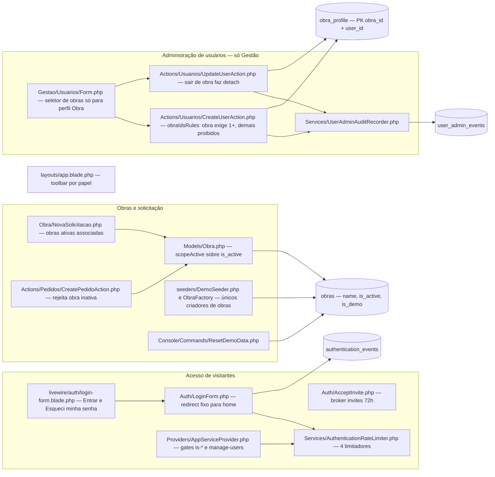
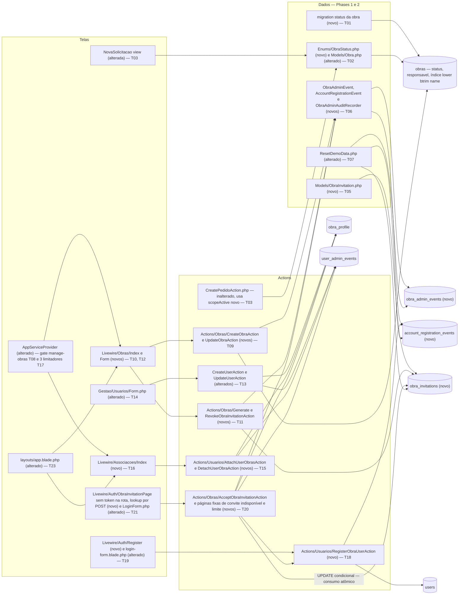

# Implementation Plan

Feature: `obras-associacoes-cadastro-convites` (fatia 1 de 3) · Branch: `build/v0-demo-laravel` · Base: `c987df8`
Source SPEC: `.spec/features/obras-associacoes-cadastro-convites/SPEC.md` (v1.3: F-10 UI-08 provisional toolbar, F-13 RF-11/UI-06 Suprimentos self-association intended with non-blocking notice; v1.2: 42 RF incl. RF-38/NC-08 convite token secrecy, 10 UI, 7 CT, 8 RNF, 0 clarification markers)
Developer decisions: `.spec/features/obras-associacoes-cadastro-convites/.handoff/plan-decisions.md` (2026-09-22) — applied below; the former Open Questions are closed.
Cross-review fixes (fatia 1, 2026-09-23): `.spec/features/navegacao-sidebar-listagens/.handoff/cross-review-fixes.md` (evidence: `cross-review.md`) — F-05 (T27 in its own documentation-only Phase 9 after T28), F-10 (T23 provisional), F-13 (T15/T16 self-association AC and notice), F-14(a) (T01 `down()` documented as data-losing).
Cross-review v2 decisions (slice-1 items, 2026-09-23): `.spec/features/navegacao-sidebar-listagens/.handoff/cross-review-v2-decisions.md` (evidence: `cross-review-v2.md`) — N-03 (per-phase green = Unit + Feature; `tests/Browser` guaranteed only at T28), N-04 (T19 `ZeroObraUserTest` asserts the empty state via `GET route('obra.nova-solicitacao')`, never the component class), N-05 (T27 documentation-only phase re-runs all of `tests/Feature/Compliance`). Defaults D-5, D-6, D-8, D-9, D-10 are recorded as **confirmed**; none of them is referenced by a slice-1 task (they govern slices 2 and 3), so no task changes follow from them.
Executable view: `.spec/features/obras-associacoes-cadastro-convites/PHASES.md` (28 tasks, 9 phases)

## Pré-requisito de execução (gate — não é tarefa)

**Antes de qualquer execução do Ralph** (`./ralph.sh .spec/features/obras-associacoes-cadastro-convites/PHASES.md`), as alterações já produzidas por `/ai-context` nos 8 arquivos `docs/agents/*.md` (hoje modificados e não commitados no working tree: `api_contracts`, `architecture`, `coding_guidelines`, `data_model`, `dependencies`, `domain_rules`, `project_overview`, `tech_stack`) precisam entrar num **commit separado, somente de documentação**, contendo apenas `docs/agents/*.md` — sem código, sem `.spec/`, sem `CLAUDE.md`/`AGENTS.md`. Motivos: (1) as fases do Ralph fazem commits `feat(phase-N): …` e não podem misturar regeneração de contexto com código; (2) T27 regenera esses mesmos arquivos no fim e precisa partir de uma árvore limpa; (3) o verificador independente do Ralph compara diffs por fase.

Verificação do gate (o desenvolvedor executa; o Ralph não começa enquanto falhar):
- `git status --short docs/agents` → vazio;
- `git show --stat --format= HEAD -- . ':!docs/agents'` → vazio (o commit de documentação não toca outro caminho);
- `git status --short` pode continuar listando `.spec/features/obras-associacoes-cadastro-convites/` e `.spec/features/solicitacao-historico-finalizacao/` como não rastreados: os artefatos de `.spec/` (desta fatia e das fatias 2 e 3) não fazem parte desse commit, e as fatias 2 e 3 **não são bloqueadas** por este gate.

## Regras de execução por fase (N-03)

- "A fase fecha verde" significa **Unit + Feature** verdes (`php artisan test --compact --testsuite=Feature` e a suíte Unit), um processo Pest por vez contra `127.0.0.1:5434`.
- `tests/Browser` **não** é garantido fase a fase; nesta fatia ele só é garantido no gate T28 (Phase 8). Uma falha de Browser numa fase intermediária não bloqueia o commit da fase, mas precisa estar resolvida em T28.
- Fases somente de documentação (Phase 9 / T27) re-executam **toda** `tests/Feature/Compliance` (N-05).

## Request Summary

- **Objective**: add (a) an Obras area for Gestão **and** Suprimentos with Nome, Responsável and a 3-value status that replaces `obras.is_active`; (b) a user × obra associations screen for both papéis, with 0..N obras for `obra` and `suprimentos` users; (c) a public "Novo Cadastro" on the login screen that always creates an `obra` account with zero obras; (d) obra invitations: single-use, valid for 24 h, revocable links bound to one obra, which either create a new obra account or attach the obra to an existing obra account; the plaintext token is a secret carried only in the URL fragment (`/convite#<token>`) and handed to the server in a Livewire POST body (RF-38/NC-08, FINAL).
- **Scope in**: one transforming migration on `obras` (status backfill, `is_active` drop, name-uniqueness index); three new append-only-safe tables (`obra_invitations`, `obra_admin_events`, `account_registration_events`); the `manage-obras` ability; 5 obra/convite Actions, 2 association Actions and 1 registration Action; relaxation of `CreateUserAction::obraIdsRules` and of the `UpdateUserAction` detach rule; 3 new rate limiters; 5 new screens (Obras list, Obra form with Convites, Associações, Novo Cadastro, token-free convite page plus two fixed token-free outcome pages); toolbar entries; `demo:reset`/`DemoSeeder`/factories adapted; docs and gates.
- **Scope out** (no exception): everything assigned to fatia 2 (`solicitacao-historico-finalizacao`) and fatia 3 (`navegacao-sidebar-listagens`, which covers the sidebar, homes, columns, sorting and "Somente obras ativas"); any change to `Pedido::visibleTo`/`PedidoPolicy`; obra or user deletion; e-mail delivery of convites; e-mail verification or CAPTCHA; 2FA; full user administration for Suprimentos (`manage-users` stays Gestão-only); the Gestão first-access invite (`/primeiro-acesso/{token}`, broker `invites`, 72 h).
- **Tier**: complete
- **Architecture references** (all present and honoured below): `AGENTS.md`, `CLAUDE.md` (§3, §5, §6; §7 "O que NÃO existe" is stale about rate limiting and audit tables, and the code wins), `docs/agents/architecture.md`, `docs/agents/domain_rules.md`, `docs/agents/data_model.md`, `docs/agents/api_contracts.md`, `docs/agents/coding_guidelines.md`. Init chain (`.spec/init/*`) used only for role language; it describes the discontinued Next.js/Supabase stack (RLS, Supabase Auth) and was **not** used for any stack, authorization or schema decision.

### Architecture rules every task below must preserve

| Rule | Source | Mechanically enforced by |
|---|---|---|
| Route → full-page Livewire component → `mount()` re-checks the ability → `$this->authorize()` before **every** mutating method → one single-purpose Action per write. Components never persist models directly | `docs/agents/architecture.md` "Layer responsibilities"; `docs/agents/coding_guidelines.md` §1, §2 | `tests/Feature/Authorization/BypassUiAuthorizationTest.php`; new adversarial tests (T22) |
| Actions own `Validator::make` with PT-BR messages, the actor guard (trait, `Gate::forUser($actor)`), and the `DB::transaction` that writes the mutation together with its audit row | `docs/agents/coding_guidelines.md` §1; `docs/agents/domain_rules.md` "User administration", "Administrative audit" | Action tests per task |
| Application-layer authorization only (`guest`/`auth` → `active` → `can:` → `mount()` → Policy → Action guard → Action validation). No RLS, no global scope | `CLAUDE.md` §5; `docs/agents/domain_rules.md` "Row visibility" | `tests/Feature/Security/Adversarial/NoGlobalScopeNoRlsTest.php` |
| `Pedido::visibleTo` (`app/Models/Pedido.php:41-48`) and `PedidoPolicy` stay byte-identical; Suprimentos associations never change pedido visibility | `CLAUDE.md` §5 "Decisão travada"; SPEC RF-15 | `tests/Feature/Authorization/PedidoVisibleToScopeTest.php`, `tests/Feature/Compliance/ObraVisibleToGuardTest.php` (both unchanged) |
| `App\Support\EmailNormalizer::normalize()` is the only e-mail normalization; `users_email_lower_unique` is the DB backstop | `docs/agents/coding_guidelines.md` §9; `CLAUDE.md` §6 | `tests/Feature/Compliance/EmailNormalizationGuardTest.php` |
| Audit trails are append-only: `const UPDATED_AT = null`, `updating`/`deleting` hooks throw `LogicException`, the policy denies update/delete. `demo:reset` is the single exemption and uses `DB::table(...)` only | `docs/agents/coding_guidelines.md` §8; `app/Console/Commands/ResetDemoData.php:57-68` | `tests/Feature/Compliance/AuditTrailsAppendOnlyTest.php` (extended in T06/T07) |
| Rate-limit thresholds are literal in `AppServiceProvider::configureRateLimiting()` and consumed through `App\Services\AuthenticationRateLimiter`. Keys carry `sha256(normalized e-mail)` and the IP, never a password | `app/Providers/AppServiceProvider.php:62-68`; `app/Services/AuthenticationRateLimiter.php` | `tests/Unit/Services/AuthenticationRateLimiterTest.php` (extended in T17) |
| Enum-backed slugs with TitleCase cases; explicit `#[Fillable]` on every model; new models get factories | `docs/agents/coding_guidelines.md` §6, §7; `CLAUDE.md` Boost rules | `tests/Unit/Enums/SlugEnumsTest.php`, `tests/Feature/Security/MassAssignmentTest.php` |
| PT-BR user text, English identifiers with Portuguese domain nouns, PT-BR URL segments; literal Tailwind classes; no `{!! !!}`; brand only via `config('app.name')` | `docs/agents/coding_guidelines.md` §10, §11 | `BladeEscapingTest`, `BrandIdentityComplianceTest`, `ThemeTokensTest` |
| PHP **8.4**-compatible (production 8.4.25); `php artisan make:*`; Pint; Pest; **no new dependency** | `CLAUDE.md` §2, §8; `AGENTS.md` | T28 gate |
| `docs/agents/*.md` are regenerated by `/ai-context`, never hand-edited; `CLAUDE.md`/`AGENTS.md` are hand-written | `CLAUDE.md` §8 "Propriedade dos arquivos de contexto" | `tests/Feature/Compliance/DocumentationParityTest.php` |
| Convite plaintext token is a secret (RF-38, FINAL): never in a path, query string, `#[Url]` property, post-lookup snapshot, session, log, audit row, column or exception report; parameters that receive it carry `#[\SensitiveParameter]` (precedent: `app/Notifications/FirstAccessInvite.php:22`, `app/Models/User.php:45`) | SPEC RF-38, RNF-01, CT-05 | `tests/Feature/Compliance/ObraInvitationTokenLeakTest.php` (T26), `tests/Feature/Livewire/ObraInvitationPageTest.php` (T21) |

## AS IS — Componentes impactados

Legenda: hoje as obras só nascem via `DemoSeeder`/factories e a atividade é o booleano `obras.is_active`. Esse booleano é lido por `Obra::scopeActive` (`app/Models/Obra.php:28-32`), pelo formulário de usuários (`Form.php:127`) e, através do escopo, por `NovaSolicitacao` e `CreatePedidoAction`. Só a Gestão associa obras, pela regra rígida "papel obra ⇒ ≥1 obra; demais ⇒ nenhuma" (`CreateUserAction.php:118-134`, `UpdateUserAction.php:72-77`). Não há autocadastro, e o login sempre volta para `/home`.

## TO BE — Componentes propostos

Legenda: a migration T01 troca `is_active` pelo status de três valores, e `ObraStatus` junto com o `scopeActive` reescrito (T02) passa a ser a única definição de "obra ativa", consumida sem mudança de assinatura por `NovaSolicitacao` e `CreatePedidoAction` (T03). As tabelas novas de convites (T05) e de auditoria (T06) entram em `demo:reset` (T07). As telas de Obras (T10, T12) e de Associações (T16) ficam sob o gate `manage-obras` (T08) e delegam a Actions novas (T09, T11, T15). O formulário da Gestão aceita 0..N obras (T13, T14). O autocadastro (T18, T19) e o aceite do convite (T20, T21) compartilham os limitadores novos (T17) e o núcleo de criação de conta de `RegisterObraUserAction`. O token do convite viaja só no fragmento da URL e chega ao servidor no corpo do POST do Livewire (T11, T21); desfechos inválidos e de limite levam a páginas fixas sem token (T20). A toolbar ganha as duas entradas em T23, provisórias até a sidebar da fatia 3 (RF-08) substituí-las. A regeneração de `/ai-context` e o `CLAUDE.md` (T27) ficam numa Phase 9 própria, somente de documentação, depois dos gates de T28.

## Tasks

### T01 — Migration: status da obra, `responsavel`, remoção de `is_active` e unicidade do nome
- **Files**: `database/migrations/<timestamp>_convert_obras_activity_to_status.php` (novo, `php artisan make:migration convert_obras_activity_to_status --no-interaction`)
- **Change**: mirror the structure and docblock style of `2026_09_22_155011_normalize_user_emails_and_add_lower_unique_index.php`. In `up()`, inside one `DB::transaction` and in this order: (1) detect groups of `obras` rows that collide under `lower(btrim(name))`. If any exist, throw a `RuntimeException` with a PT-BR message naming the colliding values, before any write (RF-36b). (2) Add `status varchar(20) NULL` and `responsavel varchar(255) NULL`. (3) Backfill with `update obras set status = case when is_active then 'em_andamento' else 'concluido' end`. (4) Set `status` to `NOT NULL DEFAULT 'a_iniciar'` and add `CHECK (status in ('a_iniciar','em_andamento','concluido'))` named `obras_status_check`. (5) Drop `obras.is_active`, the only column drop this SPEC authorizes (NC-02). (6) `create unique index obras_name_normalized_unique on obras (lower(btrim(name)))`. `down()` re-adds `is_active boolean default true`, backfills it as `status <> 'concluido'`, and drops the index, the check, `status` and `responsavel`. **`down()` is a data-losing rollback (F-14a)**: the A iniciar/Em andamento distinction collapses into `is_active = true`, and every `responsavel` value is discarded; nothing else is removed. The migration docblock must state this explicitly (PT-BR), and the Risks table records it. No `DELETE`, `TRUNCATE` or table drop. No row of `users`, `obras`, `obra_profile`, `pedidos`, `pedido_events`, `user_admin_events` or `authentication_events` is removed (RF-36, §43).
- **Covers**: RF-36, RF-36b, CT-01, RNF-06
- **Tests**: covered by T04 (a migration test needs the model changes of T02 to seed data), including the documented loss on rollback
- **Risk**: **High**. Railpack runs `php artisan migrate` at every container start (`CLAUDE.md` §2), so a name collision in production data aborts the deploy. See the Risks table for the mandatory pre-merge query.
- **Dependencies**: none

### T02 — `ObraStatus`, modelo `Obra`, factory e `DemoSeeder`
- **Files**: `app/Enums/ObraStatus.php` (novo, `php artisan make:enum ObraStatus --string`), `app/Models/Obra.php`, `database/factories/ObraFactory.php`, `database/seeders/DemoSeeder.php`, `tests/Unit/Enums/SlugEnumsTest.php`, `tests/Unit/Models/ObraStatusTest.php` (novo)
- **Change**: `ObraStatus: string` with cases `AIniciar = 'a_iniciar'`, `EmAndamento = 'em_andamento'` and `Concluido = 'concluido'`, plus `label(): string` ("A iniciar"/"Em andamento"/"Concluído") and `isActive(): bool` (`$this !== self::Concluido`). This is the **single** definition of "obra ativa" (RF-03). In `Obra`: set `#[Fillable(['name', 'responsavel', 'status', 'is_demo'])]`, cast `'status' => ObraStatus::class`, drop the `is_active` cast, and rewrite `scopeActive` as `where('status', '!=', ObraStatus::Concluido->value)` so every caller of `->active()` keeps its signature. Add `invitations(): HasMany` (used by T05/T12). Factory: default `status = EmAndamento` and `responsavel = null`. Add states `aIniciar()`, `emAndamento()` and `concluida()`, and remove `inactive()` (its call sites move to `concluida()` in T03). `DemoSeeder::seedObras()` (`:178-181`): `firstOrCreate(['name' => $name], ['status' => ObraStatus::EmAndamento, 'is_demo' => true])`.
- **Covers**: RF-03, RF-35 (seeder/factory half), CT-01
- **Tests**: `tests/Unit/Models/ObraStatusTest.php`: `isActive()` is true for `a_iniciar` and `em_andamento` and false for `concluido`; each label is exact. `SlugEnumsTest`: add `ObraStatus` to the TitleCase/string-backed assertions. `tests/Feature/Seeders/DemoSeederIdempotencyTest.php` passes (every demo obra ends with a non-null status).
- **Risk**: Medium. Removing `inactive()` breaks about 8 test call sites until T03 lands, so T02 and T03 must be committed together.
- **Dependencies**: none (parallel-safe with T01: disjoint files)

### T03 — Consumidores de "obra ativa" e estado vazio da Nova Solicitação
- **Files**: `app/Livewire/Gestao/Usuarios/Form.php` (only `obras()` `:122-134`), `resources/views/livewire/obra/nova-solicitacao.blade.php`, `app/Actions/Pedidos/CreatePedidoAction.php` (docblock only), tests: `tests/Feature/Actions/CreatePedidoActionTest.php`, `tests/Feature/Livewire/NovaSolicitacaoTest.php`, `tests/Feature/Livewire/ObraInativaPreservaHistoricoTest.php`, `tests/Feature/Authorization/PedidoVisibleToScopeTest.php` (`:38`, only the factory call), `tests/Feature/Livewire/AcompanhamentoTest.php`, `tests/Feature/Livewire/TodosPedidosFiltersTest.php`, `tests/Feature/Security/Adversarial/CrossObraTest.php`, `tests/Feature/Security/MassAssignmentTest.php`
- **Change**: `Form::obras()` replaces `->where('is_active', true)` with the `active()` scope inside the same grouped `where` (active obras plus those already associated). `CreatePedidoAction` keeps `->active()` (`:57`) and its PT-BR message, since the check already runs before `DB::transaction` and before `PedidoCodeGenerator::generate()`. Only the docblock is updated to say "Concluído". UI-09: the empty-state text (`nova-solicitacao.blade.php:15`) becomes "Nenhuma obra ativa está associada ao seu usuário. Fale com a Gestão ou com Suprimentos." Tests: replace every `inactive()`/`['is_active' => false]`/`update(['is_active' => false])` on obras with `concluida()`/`['status' => ObraStatus::Concluido]`. These are the readers that RF-36 requires to change in the same delivery. Assertions themselves stay intact, except the UI-09 string and the `Obra` fillable list in `MassAssignmentTest` (`:26`). Add the RF-04 case: `DB::selectOne("select last_value from pedido_code_sequence")` is identical before and after a rejected creation, and so are the `pedidos`/`pedido_events` counts. Add the RF-05 case to `ObraInativaPreservaHistoricoTest`: the associated obra user lists and opens (200) a pedido of a Concluído obra, and the Suprimentos/Gestão listings filtered by that obra return its pedidos.
- **Covers**: RF-03, RF-04, RF-05, UI-09, RF-36 (readers)
- **Tests**: listed above. A Concluído obra is absent from the Nova Solicitação select, and a forged `obra_id` of an associated Concluído obra yields 422 on `obra_id` with the sequence not advanced.
- **Risk**: Medium, because this is broad test churn. Rule: only factory/state calls and the UI-09 string change, and no assertion is weakened or deleted.
- **Dependencies**: T02

### T04 — Testes da migration de status e do esquema
- **Files**: `tests/Feature/Migrations/ObraStatusMigrationTest.php` (novo), `tests/Feature/MigrationSchemaTest.php` (`:137-140`)
- **Change**: verification only. Follow the style of `tests/Feature/Migrations/EmailNormalizationMigrationTest.php`: roll back to before T01's migration, insert rows through `DB::table`, and re-run the migration.
- **Covers**: RF-36, RF-36b, RNF-06
- **Tests**: (a) obras with `is_active` true/false become `em_andamento`/`concluido`, and the column no longer exists; (b) row counts of the 7 tables listed in RF-36 are identical before and after; (c) with `"Obra X"` and `" obra x"` present, the migration throws, the message names both values, and `status`, the index and the check do not exist while `is_active` still does; (d) `Schema::getIndexes('obras')` contains `obras_name_normalized_unique`; (e) `migrate:rollback` followed by `migrate` is repeatable on an already-migrated dataset; after the rollback an `a_iniciar` obra has `is_active = true` and a `concluido` one `false`, and `responsavel` no longer exists — pinning the data-losing `down()` documented in T01 (F-14a). `MigrationSchemaTest` now expects `status` and `responsavel` and asserts that `is_active` is absent from `obras`.
- **Risk**: Low
- **Dependencies**: T01, T02, T03

### T05 — Tabela `obra_invitations`, modelo `ObraInvitation` e estado derivado
- **Files**: `database/migrations/<timestamp>_create_obra_invitations_table.php` (novo), `app/Models/ObraInvitation.php` (novo, `php artisan make:model ObraInvitation --factory`), `database/factories/ObraInvitationFactory.php` (novo), `app/Enums/ObraInvitationState.php` (novo), `tests/Unit/Models/ObraInvitationStateTest.php` (novo)
- **Change**: the table follows CT-02: `id`, `obra_id` FK `obras` **restrict**, `token_hash char(64)` **unique**, `created_by` FK `users` restrict, `created_at` (`useCurrent`), `expires_at timestamp` not null, `revoked_by` FK `users` nullable restrict, `revoked_at` nullable, `used_by` FK `users` nullable restrict, `used_at` nullable. There is no `updated_at`. Add `CHECK (revoked_at is null or used_at is null)` and an index on `(obra_id, created_at)`. Model: `const UPDATED_AT = null`, `#[Fillable(['obra_id', 'token_hash', 'created_by', 'expires_at'])]` (the `revoked_*`/`used_*` columns are written only by the conditional updates of T11/T20, never by mass assignment), relations `obra`, `creator`, `revoker` and `user` (used_by), and `#[Hidden(['token_hash'])]`. `ObraInvitationState` has cases `Pendente`, `Utilizado`, `Expirado` and `Revogado`, each with a PT-BR `label()`. `ObraInvitation::state(): ObraInvitationState` gives `used_at` precedence, then `revoked_at`, then `now() >= expires_at` → Expirado, otherwise Pendente, all derived at read time (RF-26). `ObraInvitation::isConsumable(): bool` is Pendente **and** `obra->status->isActive()` (RF-27, NC-07). The query scope `scopeConsumable(Builder)` applies `whereNull('used_at')->whereNull('revoked_at')->where('expires_at', '>', now())->whereHas('obra', active)` and is the single SQL form reused by the conditional updates. `ObraInvitation::hashToken(#[\SensitiveParameter] string $token): string` = `hash('sha256', $token)`; the model never stores, casts or appends a plaintext token attribute (RF-38.5). Factory states: `revoked()`, `used()` and `expired()`; the factory generates a random `token_hash` directly (no plaintext).
- **Covers**: CT-02, RF-26 (state), RF-27, RNF-01 (hash-only storage), RF-38 (hash-only, sensitive parameter)
- **Tests**: `ObraInvitationStateTest` covers one convite per state with the correct label. With time travel, 23 h 59 min after creation is valid and 24 h 00 min 01 s is not. A pending convite whose obra is Concluído is not consumable. The DB rejects a row with both `revoked_at` and `used_at` set, and a duplicate `token_hash`.
- **Risk**: Medium. `now()` (app clock) is used in the scope instead of the DB `now()` so time-travel tests work, which means the app and DB clocks must agree (both are UTC).
- **Dependencies**: T02

### T06 — Trilhas append-only: `obra_admin_events` e `account_registration_events`
- **Files**: `database/migrations/<timestamp>_create_obra_admin_events_table.php` (novo), `database/migrations/<timestamp>_create_account_registration_events_table.php` (novo), `app/Models/ObraAdminEvent.php` + factory (novo), `app/Models/AccountRegistrationEvent.php` + factory (novo), `app/Enums/ObraAdminAction.php` (novo), `app/Enums/AccountOrigin.php` (novo), `app/Policies/ObraAdminEventPolicy.php`, `app/Policies/AccountRegistrationEventPolicy.php` (novos), `app/Services/ObraAdminAuditRecorder.php` (novo), `tests/Feature/Compliance/AuditTrailsAppendOnlyTest.php`, `tests/Unit/Models/ObraAdminEventImmutabilityTest.php`, `tests/Unit/Models/AccountRegistrationEventImmutabilityTest.php` (novos)
- **Change**: `obra_admin_events` follows CT-07(b): `id`, `actor_id` FK users restrict, `obra_id` FK obras restrict, `obra_invitation_id` FK `obra_invitations` nullable restrict, `action varchar(40)`, `before json null`, `after json null`, `created_at useCurrent`, with indexes `(obra_id, created_at)` and `(actor_id, created_at)`. `account_registration_events` follows CT-07(c)/RF-22: `id`, `user_id` FK users restrict, `origin varchar(20)`, `obra_invitation_id` FK nullable restrict, `ip varchar(45) null`, `created_at useCurrent`. It has no password or e-mail column. `ObraAdminAction` has `ObraCreated = 'obra_created'`, `ObraUpdated`, `InvitationCreated`, `InvitationRevoked` and `InvitationUsed`. `AccountOrigin` has `NovoCadastro = 'novo_cadastro'` and `Convite = 'convite'`. Both models copy the `UserAdminEvent` pattern: `UPDATED_AT = null`, `booted()` `updating`/`deleting` throwing `LogicException` in PT-BR, explicit `#[Fillable]`, and enum casts. Both policies return `false` for `update`/`delete`. `ObraAdminAuditRecorder::record(User $actor, Obra $obra, ObraAdminAction $action, ?array $before, ?array $after, ?ObraInvitation $invitation = null)` enforces a whitelist of `['name', 'responsavel', 'status']` and throws `LogicException` before writing, mirroring `UserAdminAuditRecorder`. Its `snapshot(Obra)` returns `{name, responsavel, status(slug)}`. Atomicity is the caller's responsibility (callers write inside their transaction). The compliance test (additions only) appends the two new models to `AUDIT_MODELS` and the two new tables to the query-builder regex.
- **Covers**: CT-07 (b, c), RF-22 (storage), RF-34 (storage)
- **Tests**: the immutability tests expect `update()`/`delete()` to throw and `save()` on an existing row to throw. `AuditTrailsAppendOnlyTest` stays green with the extended lists. A recorder test verifies that a non-whitelisted key throws and writes 0 rows.
- **Risk**: Low
- **Dependencies**: T05 (FK to `obra_invitations`)

### T07 — `demo:reset` com convites e trilhas novas
- **Files**: `app/Console/Commands/ResetDemoData.php`, `tests/Feature/Console/ResetDemoDataTest.php`, `tests/Feature/Console/ResetDemoDataAuditTrailsTest.php`, `tests/Feature/Compliance/AuditTrailsAppendOnlyTest.php` (the `ResetDemoData` test only)
- **Change**: inside the existing transaction, after the demo pedidos are deleted and **before** `Obra::...->delete()`, run the following steps through `DB::table(...)` only. (1) Compute `$demoObraIds` and `$demoUserIds`. (2) Compute the doomed invitation ids: rows of `obra_invitations` whose `obra_id` is a demo obra **or** whose `created_by`/`revoked_by`/`used_by` is a demo user (mixed rows go, as in D-05). (3) Delete `obra_admin_events` where `obra_id` is a demo obra, or `actor_id` is a demo user, or `obra_invitation_id` is doomed. (4) Delete `account_registration_events` where `user_id` is a demo user or `obra_invitation_id` is doomed. (5) Delete `obra_invitations` by doomed id. Then keep the existing order: demo obras, `user_admin_events`, `authentication_events`, demo users. Update the class docblock. The `AuditTrailsAppendOnlyTest` assertions on `ResetDemoData` are extended additively: each new table appears exactly once via `DB::table`, never via its model, and before the `User` delete.
- **Covers**: RF-35
- **Tests**: seed, create convites (pending/used/revoked) and obra/registration audits for demo obras and demo users, then run `demo:reset --force` and expect exit 0 with no FK violation. A convite of a real obra created by a real user survives, together with its audit rows. A real user's `account_registration_events` row with origin `novo_cadastro` survives.
- **Risk**: Medium. FK order errors surface only when data exists, which is why the test plants every combination.
- **Dependencies**: T05, T06

### T08 — Habilidade `manage-obras`, policies e guarda de Action
- **Files**: `app/Providers/AppServiceProvider.php` (`boot()` only), `app/Policies/ObraPolicy.php` (novo, `php artisan make:policy ObraPolicy --model=Obra`), `app/Policies/ObraInvitationPolicy.php` (novo), `app/Actions/Obras/Concerns/GuardsObraAdministration.php` (novo), `tests/Feature/Authorization/RoleGatesTest.php`, `tests/Feature/Authorization/ObraPolicyTest.php` (novo)
- **Change**: add `Gate::define('manage-obras', fn (User $user): bool => in_array($user->role?->slug, [RoleSlug::Gestao->value, RoleSlug::Suprimentos->value], true))` next to the four existing gates, with a docblock stating that it is distinct from `manage-users`, which stays Gestão-only (RF-37). `ObraPolicy`: `viewAny`, `create`, `update` and `manageAssociations` resolve through `manage-obras`, and `delete` always returns `false` (RF-06). `ObraInvitationPolicy`: `create(User, Obra)` and `revoke(User, ObraInvitation)` resolve through `manage-obras`. `GuardsObraAdministration::ensureActorManagesObras(User $actor)` throws `AuthorizationException('Apenas os perfis Gestão e Suprimentos podem administrar obras.')`. It mirrors `GuardsUserAdministration`, and the gate, not the trait, names the papéis.
- **Covers**: RF-07, CT-03, RF-06 (policy), RF-37 (`manage-users` unchanged)
- **Tests**: `manage-obras` is granted to gestao and suprimentos and denied to obra and to a role-less user. `manage-users` still grants only gestao. `ObraPolicy::delete` is false for every papel.
- **Risk**: Low
- **Dependencies**: T02

### T09 — `CreateObraAction` e `UpdateObraAction`
- **Files**: `app/Actions/Obras/CreateObraAction.php`, `app/Actions/Obras/UpdateObraAction.php` (novos, `php artisan make:class`), `tests/Feature/Actions/Obras/CreateObraActionTest.php`, `tests/Feature/Actions/Obras/UpdateObraActionTest.php` (novos)
- **Change**: both call `ensureActorManagesObras` first. Validation (`Validator::make`, PT-BR) covers `name` (required, string, max:255, trimmed before validation), `responsavel` (nullable, string, max:255; an empty string becomes `null`) and `status` (required, `Rule::enum(ObraStatus::class)`). Uniqueness uses an explicit check `Obra::query()->whereRaw('lower(btrim(name)) = lower(btrim(?))', [$name])` (with `whereKeyNot($obra)` on update) → 422 on `name` with "Já existe uma obra com este nome." Inside `DB::transaction`, create or update, then write `ObraAdminAuditRecorder::record()`. On create: `obra_created`, before = null, after = snapshot. On update: `obra_updated` with only the changed keys, and no record plus an early return when nothing changed (RF-02). The transaction call is wrapped in `try/catch (UniqueConstraintViolationException)`, caught **outside** the closure because PostgreSQL aborts the transaction, and rethrown as the same `ValidationException` on `name` (RF-01 race → never 500). `is_demo` is never accepted from input. No Action or method deletes an obra.
- **Covers**: RF-01, RF-02, CT-01, CT-07(b), RF-06
- **Tests**: every AC of RF-01 and RF-02 as a Feature test, for both Gestão and Suprimentos actors. An `obra` actor gets `AuthorizationException` and 0 rows. Unique race: create "Obra Centro", then call the Action with the pre-check bypassed. A second insert that reaches the index surfaces as `ValidationException`, simulated by inserting the conflicting row via `DB::table` inside a `DB::listen`/`beforeExecuting` hook between the check and the insert. The counts of `pedidos`, `pedido_events` and `obra_profile` for the obra are identical before and after an edit to Concluído.
- **Risk**: Medium, because the race path must catch outside the transaction.
- **Dependencies**: T06, T08

### T10 — Telas Obras: lista e formulário (criar/editar)
- **Files**: `app/Livewire/Obras/Index.php`, `app/Livewire/Obras/Form.php` (novos, `php artisan make:livewire Obras/Index` / `Obras/Form`), `resources/views/livewire/obras/index.blade.php`, `resources/views/livewire/obras/form.blade.php` (novos), `routes/web.php`, `tests/Feature/Livewire/ObrasIndexTest.php`, `tests/Feature/Livewire/ObrasFormTest.php` (novos)
- **Change**: routes live inside the `['auth', 'active']` group, outside the papel prefixes, in a group `Route::middleware('can:manage-obras')`: `GET /obras` → `obras.index`, `GET /obras/nova` → `obras.create`, `GET /obras/{obra}/editar` → `obras.edit`. Components use `#[Layout('layouts.app')]`. `mount()` calls `$this->authorize('viewAny'|'create'|'update', ...)`, and `save()` re-authorizes before delegating to T09's Actions. Index: paginated at 15, ordered by `name`, with columns Nome, Responsável ("—" when null) and Status label, and actions "Nova obra" and "Editar". There is no delete control (UI-03). Form: Nome, Responsável (optional) and Status as a `select` with exactly the 3 `ObraStatus` options bound with `wire:model.live`. When `concluido` is selected, show `alert-info`: "Obras concluídas deixam de receber novas solicitações. Nenhum pedido, histórico ou associação é excluído." (UI-04). Action error keys are remapped onto the inputs in the style of `Gestao\Usuarios\Form::mapErrorKeys`. After save, flash and redirect to `obras.index`. Reuse `card`, `page-title`, `form-control`, `btn-primary`, `btn-secondary`, `alert-info` and the table markup of `gestao/usuarios/index.blade.php`, with no new visual pattern.
- **Covers**: UI-03, UI-04, RF-01, RF-02, RF-06, RF-07, CT-03
- **Tests**: 3 obras in 3 states are listed with the correct labels and there is no delete control. The status select has exactly 3 options, and the notice is visible only with Concluído. Gestão and Suprimentos get 200 on the 3 routes. An `obra` user gets 403 on all of them, a guest gets a redirect to `/login`, and an inactive user is logged out. A forged `save` call from an `obra` user through `Livewire::test` gets 403 and 0 rows. The route middleware for `obras.*` contains `auth`, `active` and `can:manage-obras`.
- **Risk**: Low
- **Dependencies**: T09

### T11 — `GenerateObraInvitationAction` e `RevokeObraInvitationAction`
- **Files**: `app/Actions/Obras/GenerateObraInvitationAction.php`, `app/Actions/Obras/RevokeObraInvitationAction.php` (novos), `tests/Feature/Actions/Obras/GenerateObraInvitationActionTest.php`, `tests/Feature/Actions/Obras/RevokeObraInvitationActionTest.php` (novos)
- **Change**: Generate: `ensureActorManagesObras`. An obra with status `concluido` → `ValidationException` on `obra` with "Não é possível gerar convite para uma obra concluída." and nothing written (RF-33). The token is `bin2hex(random_bytes(32))` (256 bits, CSPRNG, 64 lowercase hex, URL-safe). Inside `DB::transaction`: insert `obra_id`, `token_hash = ObraInvitation::hashToken($token)`, `created_by`, and `expires_at = $now->copy()->addHours(24)` with `created_at = $now` taken from the same `now()`, then write the `invitation_created` audit (no token, no hash in `before`/`after`). The Action returns `array{invitation: ObraInvitation, url: string}`, where **`url = url('/convite').'#'.$token`** — the token lives **only in the URL fragment**, never in the path or query string (RF-23, RF-38.1–2, CT-05). The token-free named route `obra-invitation.show` is registered only in T21, and T21 asserts that `route('obra-invitation.show').'#'.$token` equals this URL. The plaintext appears only in this return value: never in a column, log, audit, exception message, exception context or `report()` (RNF-01, RF-38.5); the local variable holding it is never passed to any logger or exception constructor. Revoke: `ensureActorManagesObras`, then a single conditional update `ObraInvitation::query()->whereKey($id)->whereNull('used_at')->whereNull('revoked_at')->where('expires_at', '>', now())->update(['revoked_by' => ..., 'revoked_at' => now()])` inside the transaction. If 0 rows are affected → `ValidationException` "Somente convites pendentes podem ser revogados." and rollback. Otherwise write the `invitation_revoked` audit.
- **Covers**: RF-23, RF-24, RF-25, RF-33, RF-34, RNF-01, RF-38 (fragment-only link), CT-02
- **Tests**: 1 generation → 1 row with `expires_at = created_at + 24h` and null `revoked_*`/`used_*`. `parse_url($url)`: `fragment` equals the 64-hex token, `path` is exactly `/convite`, `query` is absent, and neither `path` nor `query` contains the token (RF-23 AC). The plaintext is found in no column of `obra_invitations` or `obra_admin_events` (the rows are serialized and the token string searched for). 3 generations → 3 distinct URLs and 3 distinct hashes. Generation on a Concluído obra → 422 with 0 convites and 0 audits. Revoking a pending convite sets `revoked_by`/`revoked_at` and writes 1 audit. Revoking a used, revoked or expired convite → 422 with the row byte-identical. An `obra` actor gets `AuthorizationException` on both Actions. Generate + revoke → 2 `obra_admin_events`.
- **Risk**: Medium, from token handling. See the token-secrecy row in Risks.
- **Dependencies**: T05, T06, T08

### T12 — Seção "Convites" no formulário de edição da obra
- **Files**: `app/Livewire/Obras/Form.php`, `resources/views/livewire/obras/form.blade.php`, `tests/Feature/Livewire/ObraConvitesSectionTest.php` (novo)
- **Change**: in edit mode only, add a "Convites" section. "Gerar convite" (`generateInvitation()`) is hidden when the obra is Concluído, while the Action still enforces RF-33. It authorizes `create` on `ObraInvitationPolicy`, calls T11, and stores the returned URL (`<APP_URL>/convite#<token>`) in a public `?string $generatedLink`, shown once in a read-only input with a copy button (Alpine `navigator.clipboard.writeText`, no new dependency) and the text "Este link vale por 24 horas e não será exibido novamente." `$generatedLink` is reset at the start of every other action, and a reload (new GET) never repopulates it. The list shows the obra's convites ordered by `created_at desc`, eager-loading `creator`, `revoker` and `user`, with creator, criado em, expira em, the state label (T05), revogado por/em and utilizado por/em when set, plus "Revogar" only on Pendente rows. Revoking uses a two-step confirmation in the same style as `Suprimentos/PedidoDetalhe.php:90-107` and authorizes `revoke` before calling T11. The token and `token_hash` are never rendered in the list.
- **Covers**: UI-05, RF-26, RF-23 (shown once), RF-25, RF-07
- **Tests**: generating shows the link and copy control. A fresh `Livewire::test` (the reload) does not contain the link, and the convite is listed as Pendente with "Revogar". One convite per state renders the correct label. The rendered HTML never contains any `token_hash`. A forged `generateInvitation`/`revokeInvitation` call from an `obra` user gets 403.
- **Risk**: Medium. The Livewire snapshot of the creator's page carries `$generatedLink` while it is open; this is the one-time display that RF-38.6 explicitly keeps (response body to the Gestão/Suprimentos browser only, never in a request path/query, never persisted or logged) and is recorded in Assumptions.
- **Dependencies**: T10, T11

### T13 — Relaxamento de `obraIdsRules` e regra de troca de papel
- **Files**: `app/Actions/Usuarios/CreateUserAction.php`, `app/Actions/Usuarios/UpdateUserAction.php`, `tests/Feature/Actions/Usuarios/CreateUserActionTest.php`, `tests/Feature/Actions/Usuarios/UpdateUserActionTest.php`, `tests/Feature/Actions/Usuarios/UserAdminAuditTest.php`, `tests/Feature/Security/Adversarial/AuditTrailTest.php` (`:180-199`)
- **Change**: `obraIdsRules($roleId)`: for papel `obra` **or** `suprimentos`, use `['obra_ids' => ['sometimes', 'array'], 'obra_ids.*' => ['integer', 'distinct', 'exists:obras,id']]` (0..N, RF-11/RF-13b). For `gestao` or any other role, use `['obra_ids' => ['prohibited']]`, since an empty array passes and a non-empty one returns 422 with "O perfil Gestão não pode ser associado a obras." (NC-03). Drop the `obra_ids.required`/`min` messages. `UpdateUserAction`: when the new papel is `gestao`, call `$target->obras()->detach()`. Otherwise, sync **only when `obra_ids` is present** in the validated payload and leave associations untouched when the key is absent, so a change between `obra` and `suprimentos` keeps them (RF-11b). The existing snapshot diff already emits `obra_access_changed` with sorted `before`/`after` in the same transaction (RF-12). Update both class docblocks. The tests that encode the removed rule are **updated, never deleted** (RF-37): `AuditTrailTest` (obra → suprimentos no longer produces `obra_access_changed`, so the expected count becomes 6) and the ≥1/prohibited cases in `CreateUserActionTest`/`UpdateUserActionTest`.
- **Covers**: RF-11, RF-11b, RF-12, RF-13b, CT-06 (gestão rejection)
- **Tests**: an obra user with `obra_ids = []` is created with 0 `obra_profile` rows. A suprimentos user with 2 obras gets 2 rows. Gestão with `[1]` → 422 on `obra_ids` with nothing written. An obra user with [A, B] changed to papel gestao ends with 0 rows and 1 `obra_access_changed` record (before [A, B], after []). A suprimentos user with [A] changed to papel obra keeps [A] and gets no `obra_access_changed` record. `pedidos`/`pedido_events` counts are unchanged.
- **Risk**: Medium. `SessionAfterAdministrativeChangesTest` and `SessionAndRoleTest` send `obra_ids` and must stay green unchanged; they are re-run as gates.
- **Dependencies**: Phase 1 complete

### T14 — Formulário de Usuários da Gestão aceita 0..N obras para Obra e Suprimentos
- **Files**: `app/Livewire/Gestao/Usuarios/Form.php`, `resources/views/livewire/gestao/usuarios/form.blade.php`, `tests/Feature/Livewire/UsuariosFormTest.php`
- **Change**: replace `selectedRoleIsObra()` with `selectedRoleAcceptsObras()` (papel `obra` or `suprimentos`). The selector renders for both, and `save()` sends `obra_ids` for both, including `[]`. For `gestao`, `obra_ids` is not sent. Fieldset copy becomes "Selecione as obras associadas (opcional)." and the empty state becomes "Nenhuma obra ativa cadastrada." The page subtitle becomes "…e, para os perfis Obra e Suprimentos, as obras associadas." `manage-users` and `UserPolicy` stay untouched, so this screen remains Gestão-only.
- **Covers**: UI-10, RF-13b
- **Tests**: selecting Suprimentos shows `[data-obra-selector]`. Saving an obra user with no obra succeeds. Saving a suprimentos user with 2 obras creates 2 rows. Selecting Gestão hides the selector.
- **Risk**: Low
- **Dependencies**: T13

### T15 — `AttachUserObrasAction` e `DetachUserObraAction`
- **Files**: `app/Actions/Usuarios/AttachUserObrasAction.php`, `app/Actions/Usuarios/DetachUserObraAction.php` (novos), `tests/Feature/Actions/Usuarios/AttachUserObrasActionTest.php`, `tests/Feature/Actions/Usuarios/DetachUserObraActionTest.php` (novos)
- **Change**: both `use GuardsObraAdministration` (T08) and call `ensureActorManagesObras($actor)`. They do **not** use `manage-users`. Target papel ∉ {`obra`, `suprimentos`} → 422 on `user_id` with "Somente usuários dos perfis Obra e Suprimentos podem ter obras associadas." (NC-03). Attach input `{obra_ids: list<int>}` is validated as `required|array|min:1` with `obra_ids.*` `integer|exists:obras,id`. Obras in **any** status are accepted (NC-07). A duplicate inside the input, or an obra already associated, → 422 naming the obra: "A obra «<nome>» já está associada a este usuário." or "A obra «<nome>» foi informada mais de uma vez." Inside `DB::transaction`: take the `before` snapshot (`UserAdminAuditRecorder::snapshot`), `->attach($ids)`, deliberately **not** `syncWithoutDetaching`, so a concurrent duplicate hits the composite PK. Then write `obra_access_changed` with `{obra_ids}` before/after. `UniqueConstraintViolationException` is caught outside the closure → the same 422 (RF-10). Detach input is `{obra_id}`. If the obra is not associated → 422. Otherwise `->detach($obraId)` plus the audit in one transaction, touching no `pedidos`/`pedido_events` row (RF-13). **Self-association is intended (RF-11 v1.3, F-13)**: neither Action blocks `actor == target` or a Suprimentos → Suprimentos target; the class docblocks state this and cite slice 2 RF-02 (creation eligibility).
- **Covers**: RF-09, RF-10, RF-11, RF-12, RF-13, RF-15, CT-06, CT-07(a)
- **Tests**: [A, B, C] on a user with 0 obras → 3 rows. Forcing the 3rd insert to fail (via a `beforeExecuting` hook throwing on the 3rd insert) leaves 0 rows and 0 audits. [A] when A is already linked → 422 with 0 rows. Race: A inserted via `DB::table` between the check and the attach → 422, never 500, exactly 1 row. Suprimentos adds [A, B] → 1 record with actor = Suprimentos, before [], after [A, B]. Removal keeps the `pedidos`/`pedido_events` counts, the removed obra user gets 403 on that obra's pedido while Suprimentos/Gestão still get 200. A gestao target → 422. An obra actor → `AuthorizationException`. A suprimentos user with 0 obras and one with 2 obras see the same pedido set (RF-15). `PedidoVisibleToScopeTest` passes unchanged. **Self-association (RF-11 v1.3, F-13)**: a Suprimentos actor attaching obra A to **its own** account (actor == target) → 1 row added, exactly 1 `obra_access_changed` with `actor_id = target_id`, no error; the same for another Suprimentos target. Neither Action contains an `actor == target` block (intended: this is what grants Suprimentos creation eligibility in slice 2 RF-02).
- **Risk**: Medium, from the race path and the PK catch outside the transaction.
- **Dependencies**: T08, T13 (shared rule on which papéis accept obras)

### T16 — Tela Associações usuário × obra
- **Files**: `app/Livewire/Associacoes/Index.php` (novo, `php artisan make:livewire Associacoes/Index`), `resources/views/livewire/associacoes/index.blade.php` (novo), `routes/web.php`, `tests/Feature/Livewire/AssociacoesIndexTest.php` (novo)
- **Change**: route `GET /associacoes` → `associacoes.index` inside the `can:manage-obras` group from T10. `mount()` calls `$this->authorize('manageAssociations', Obra::class)`. Search (`string $search`, resets the page) is case-insensitive over `lower(name)`/`lower(email)`, reusing the query shape of `Gestao\Usuarios\Index::users()`. The listing is `User::query()->whereHas('role', slug in [obra, suprimentos])->with(['role', 'obras'])->orderBy('name')->orderBy('id')->paginate(15)`, so Gestão-papel users are never listed (RF-08). Each row shows papel, Ativo/Inativo and the associated obras (name plus status label), each with "Remover" behind a two-step confirmation (`confirmingRemoval = [userId, obraId]`, then `confirmRemoval()`). It also has a multi-select of obras **not yet** associated and "Adicionar" (`attach(int $userId)`), with state `array<int, list<int>> $selectedObraIds`. The full obra list is loaded **once** per render and diffed in PHP, which avoids N+1. Every mutating method authorizes `manageAssociations` before calling T15's Actions, and errors land on `selectedObraIds.<userId>`. **Self-edit notice (UI-06 v1.3, F-13)**: on the row whose user id equals `Auth::id()`, render a non-blocking `alert-info` with `data-self-association-notice`: "Você está editando as suas próprias associações." The notice never disables or hides "Adicionar"/"Remover" on that row (no `disabled`, no conditional around the controls).
- **Covers**: RF-08, RF-11 (self-association), UI-06, CT-03, RF-07
- **Tests**: searching "maria" finds "Maria" and "MARIA@x.com". A matching Gestão user is not listed. Each row shows all its obras. Adding 2 obras in one action shows both. "Remover" does not call the Action until confirmed (the row still exists after the first click). An `obra` user gets 403 on GET and on forged `attach`/`confirmRemoval`. Self-edit (UI-06 AC): a Suprimentos user sees `data-self-association-notice` on its own row only (exactly 1 occurrence, absent from other rows), and can still `attach` and `confirmRemoval` its own obras (rows +1 / −1).
- **Risk**: Low
- **Dependencies**: T10 (route group), T15

### T17 — Limitadores `register`, `register-ip` e `invite-ip`
- **Files**: `app/Providers/AppServiceProvider.php` (`configureRateLimiting()` only), `app/Services/AuthenticationRateLimiter.php`, `tests/Unit/Services/AuthenticationRateLimiterTest.php`
- **Change**: add the literal limiters `RateLimiter::for('register', fn () => Limit::perMinutes(10, 3))`, `RateLimiter::for('register-ip', fn () => Limit::perHour(10))` and `RateLimiter::for('invite-ip', fn () => Limit::perMinute(20))`. The 4 existing limiters stay byte-identical (RF-37). In `AuthenticationRateLimiter`, add the constants `REGISTER_LIMITER`, `REGISTER_IP_LIMITER` and `INVITE_IP_LIMITER`, the keys `registerKey($email, $ip)` = `register:<sha256(normalized)>:<ip>`, `registerIpKey($ip)` and `inviteIpKey($ip)` = `invite-ip:<ip>` (IP only — **never** the token nor its hash, RF-38.5), and the methods `tooManyRegistrationAttempts`, `hitRegistration` (hits both keys), `tooManyInviteLookups(string $ip)` and `hitInviteLookup(string $ip)`. The invite pair is consumed by the convite **lookup POST** in T21 (RF-19b, NC-08), never by a GET middleware — the convite GET carries no token. Update the class docblock ("four guest flows" → the new count, and that `invite-ip` guards the Livewire lookup call).
- **Covers**: RF-19, RF-19b (thresholds and keys)
- **Tests**: the key formats contain neither a password, a clear e-mail nor any token-like value. After 3 hits the e-mail+IP key reports too many. After 10 hits across e-mails the IP key reports too many. After 20 `hitInviteLookup` the next `tooManyInviteLookups` trips. The existing login/recovery assertions pass unchanged.
- **Risk**: Low
- **Dependencies**: Phase 5 complete (`AppServiceProvider` is also edited by T08, and phases are sequential)

### T18 — `RegisterObraUserAction` (núcleo de criação de conta)
- **Files**: `app/Actions/Usuarios/RegisterObraUserAction.php` (novo), `tests/Feature/Actions/Usuarios/RegisterObraUserActionTest.php` (novo)
- **Change**: public API: `validate(array $data): array` and `createInsideTransaction(array $validated, AccountOrigin $origin, ?ObraInvitation $invitation, ?string $ip): User` (must be called inside a caller's transaction; used by T20), plus `execute(array $data, ?string $ip): User` for Novo Cadastro. `validate` reads **only** `name`, `email`, `password` and `password_confirmation` via `Arr::only`, so every other key is ignored (RF-17). The e-mail goes through `EmailNormalizer::normalize()` before validation (RF-18). Rules: `name` required|string|max:255 (trimmed); `email` required|string|email|max:255|`unique:users,email` with the exact message "Já existe uma conta com este e-mail. Entre ou use Esqueci minha senha." (RF-20); `password` required|string|confirmed|`PasswordRule::defaults()`, with PT-BR messages consistent with `DefinesPasswordFromToken`. `createInsideTransaction` resolves the role by slug (`Role::where('slug', RoleSlug::Obra->value)->firstOrFail()`) and never from input. It creates the user with `is_active = true` and `is_demo = false`, with the password hashed by the model cast, writes **no** `obra_profile` row, and appends one `AccountRegistrationEvent` (`user_id`, `origin`, `obra_invitation_id`, `ip` truncated to 45 chars) in the same transaction (RF-22). `execute` wraps it in `DB::transaction` and catches `UniqueConstraintViolationException` **outside** the closure → `ValidationException` on `email` with the RF-20 text. It does not log in; the component owns the session (T19).
- **Covers**: RF-16, RF-17, RF-18, RF-20, RF-22, CT-07(c)
- **Tests**: a valid submission yields 1 user with papel obra, 0 `obra_profile` rows, active, not demo, and a hashed password (`Hash::check`). `"  Ana@X.com "` is stored as `ana@x.com`. A second signup with `"ANA@x.com"` → 422 with the exact RF-20 text and no user. A forged `role_id` (gestao), `obra_ids = [1]`, `is_active = false` or `is_demo = true` is ignored (papel obra, 0 obras, active, not demo). The unique-index race is simulated via a `beforeExecuting` hook → `ValidationException`, exactly 1 user. Each validation error yields 422 on its field with no user. 1 signup → exactly 1 `account_registration_events` row with origin `novo_cadastro`, and the row contains neither the password nor its hash. Forcing the audit insert to fail rolls back the user.
- **Risk**: Medium
- **Dependencies**: T06

### T19 — Tela "Novo Cadastro" e botão no login
- **Files**: `app/Livewire/Auth/Register.php` (novo), `resources/views/livewire/auth/register.blade.php` (novo), `resources/views/livewire/auth/login-form.blade.php`, `routes/web.php`, `app/Livewire/Obra/Acompanhamento.php` (session notice only), `resources/views/livewire/obra/acompanhamento.blade.php`, `tests/Feature/Livewire/RegisterTest.php`, `tests/Feature/Auth/ZeroObraUserTest.php` (novos)
- **Change**: route `GET /cadastro` → `register`, inside the `guest` group next to `/login` (CT-04). The component uses `#[Layout('auth.login')]` and exactly 4 public properties (`name`, `email`, `password`, `password_confirmation`). The view has 4 labelled inputs, a submit button and a "Voltar para o login" link, and no select or radio for papel or obra (UI-02). `register()` follows the `LoginForm` pattern: normalize the e-mail, `tooManyRegistrationAttempts` → 422 on `email` with `LoginForm::THROTTLED_MESSAGE`, then `hitRegistration` on **every** submission (duplicates and invalid ones included, per RF-20), then `RegisterObraUserAction::execute($data, request()->ip())`. On success: `Auth::guard('web')->login($user)`, `AuthenticationEventRecorder::loginSucceeded($user)`, `Session::regenerate()`, `session()->put('obra.registration_notice', true)`, then redirect to `route('home')` (RF-21). The `password` fields are reset after any failure. `Acompanhamento::mount()` pulls `obra.registration_notice` into a public bool and the view shows `alert-info` "Conta criada. O acesso às obras depende de associação feita pela Gestão ou por Suprimentos." A non-flash key is used because the `/home` redirect would consume a flash before the listing renders. No `Pedido` statement is added or changed in `Acompanhamento`, so `ObraVisibleToGuardTest` stays green. `login-form.blade.php` gains a secondary button `<a href="{{ route('register') }}" class="btn-secondary w-full">Novo Cadastro</a>` below "Entrar", keyboard-focusable (UI-01).
- **Covers**: UI-01, UI-02, CT-04, RF-16, RF-17, RF-19, RF-20, RF-21, RF-14
- **Tests**: `/login` shows "Novo Cadastro" linking to `/cadastro`. The DOM has exactly those 4 inputs and no select or radio. Success leaves the user authenticated with a changed session id, exactly 1 `login_success` for the user, a redirect to `/home`, and the notice visible on `/obra/pedidos`. The 4th submission for the same e-mail+IP within 10 min is refused with no user, and after `travel(11)->minutes()` it is accepted. The 11th from one IP within 1 h is refused. A forged `set('role_id', …)` on the component fails because no such property exists. `/cadastro` redirects an authenticated user away (`guest`). `ZeroObraUserTest` (RF-14): a zero-obra obra user logs in (`login_success`), `/obra/pedidos` returns 200 with 0 rows, the Nova Solicitação empty state is visible, GET of any pedido returns 403, and `CreatePedidoAction` with any `obra_id` → 422. **N-04**: the empty state is asserted only through the HTTP route — `actingAs($user)->get(route('obra.nova-solicitacao'))->assertOk()->assertSee(<UI-09 text from T03>)` — and the test file never references `App\Livewire\Obra\NovaSolicitacao` (no `use`, no `::class`, no `Livewire::test`), because slice 2 (S2 P4/T15) deletes that class while keeping the obra-facing text and route name. A static assertion in the test itself is not required; the T28 review checks the file for the class name.
- **Risk**: Medium. The change to the login view must keep `LoginScreenIdentityTest`/`LoginFormTest` green.
- **Dependencies**: T17, T18

### T20 — `AcceptObraInvitationAction` e páginas fixas do convite (indisponível / limite)
- **Files**: `app/Actions/Obras/AcceptObraInvitationAction.php` (novo), `app/Exceptions/ObraInvitations/ObraInvitationUnavailableException.php` (novo), `resources/views/obra-invitations/unavailable.blade.php`, `resources/views/obra-invitations/throttled.blade.php` (novos), `routes/web.php` (two fixed token-free GET routes), `tests/Feature/Actions/Obras/AcceptObraInvitationActionTest.php`, `tests/Feature/ObraInvitations/ObraInvitationOutcomePagesTest.php` (novos)
- **Change**: the Action never receives a plaintext token after resolution; everything downstream works on the convite **id** (RF-38.3).
  - `resolveByToken(#[\SensitiveParameter] mixed $token): ObraInvitation`: a non-string, an empty string, a value that is not exactly 64 lowercase hex characters, an unknown hash, or `! isConsumable()` all throw the **same** `ObraInvitationUnavailableException` with a fixed message and no context (no token, no hash, no id, no obra). The format check runs before hashing; the hash is computed once and the plaintext is not referenced afterwards.
  - `resolveById(int $invitationId): ObraInvitation`: same exception for unknown id or `! isConsumable()` (used by the RF-30 return and before rendering the confirm state).
  - `ObraInvitationUnavailableException extends RuntimeException`, mirroring `app/Exceptions/Pedidos/PedidoTerminalStateException.php` (named constructor + `render()`): `render()` returns `response()->view('obra-invitations.unavailable', [], 404)` as a fallback if it ever escapes into a plain HTTP request, and `report(): bool` returns `true` (handled, never logged) so an invalid-convite attempt never reaches the log. `bootstrap/app.php` is not changed. The normal path is the component catching it and redirecting (T21).
  - Two fixed token-free routes, outside `guest`/`auth`, no parameters: `GET /convite/indisponivel` → `obra-invitation.unavailable` returning `response()->view('obra-invitations.unavailable', [], 404)` (RF-28), and `GET /convite/limite` → `obra-invitation.throttled` returning `response()->view('obra-invitations.throttled', [], 429)` with `LoginForm::THROTTLED_MESSAGE` (RF-19b). Route closures, as `routes/web.php` already does for `/home` and `/logout`; no controller is created. Both views use the auth shell (brand via `config('app.name')`); `unavailable` contains exactly "Este convite é inválido, expirou ou já foi utilizado. Peça um novo convite à Gestão ou a Suprimentos." and a link to `/login`, and neither view has an obra name, creator, e-mail or form (RF-28, RNF-08).
  - `acceptAsNewAccount(int $invitationId, array $data, ?string $ip): User`: call `RegisterObraUserAction::validate()` **before** any write (RF-29: a validation failure leaves the convite pending). Then, inside `DB::transaction`, the **first** statement is the conditional consumption `ObraInvitation::query()->whereKey($invitationId)->consumable()->update(['used_at' => now()])` (RF-27 re-checked in SQL, RF-38.3). 0 rows → throw `ObraInvitationUnavailableException`, so the transaction rolls back and no user or audit remains (RF-32). Then `createInsideTransaction(..., AccountOrigin::Convite, $invitation, $ip)`, set `used_by`, attach **the convite's** `obra_id` (any submitted obra identifier is ignored), write `obra_access_changed` with actor = target = the new user (RF-12), and write `invitation_used` via `ObraAdminAuditRecorder` with actor = the new user (RF-34). The e-mail unique race is caught outside the transaction as in T18.
  - `acceptAsExistingAccount(User $user, int $invitationId): array{user: User, associated: bool}`: papel ≠ `obra` → `ValidationException` "Convites de obra só se aplicam a contas do perfil Obra." **before** the consumption statement, so nothing is consumed (RF-31). Then, in one transaction: conditional consumption by id with `used_by = $user->id` (0 rows → Unavailable), attach only if the association is absent (`associated = false` otherwise, with no `obra_access_changed`), and `invitation_used`.
- **Covers**: RF-27, RF-28, RF-29, RF-30 (Action), RF-31, RF-32, RF-33, RF-34, RF-19b (throttled page), RF-38 (id-only after resolution, no token in exceptions), RNF-02, RNF-08, CT-05, CT-07
- **Tests**: every RF-29/RF-30/RF-31/RF-33/RF-34 AC at Action level. The success path creates 1 user (papel obra), exactly 1 `obra_profile` row for the convite obra, and a convite used by that user. A forged `obra_id` in `$data` is ignored. A weak password or duplicate e-mail creates no user or association and leaves the convite pending. An existing obra user gets +1 row and the convite used. An already-associated obra user gets +0 rows, `associated = false` and the convite used. Suprimentos gets the error with the papel unchanged, 0 rows and the convite pending. An obra switched to Concluído after generation → Unavailable with 0 users, and switching it back to Em andamento before `expires_at` makes the convite valid again. A rolled-back consumption leaves 0 records in the 3 trails. `resolveByToken` throws the same exception class with the same message for the six invalid causes (expired, used, revoked, malformed, unknown, Concluído obra) plus empty string and a non-string; the exception message and `getTrace()`-derived string (`(string) $e`) never contain the plaintext token. `ObraInvitationOutcomePagesTest`: `GET /convite/indisponivel` → 404 with the generic text and no obra name; `GET /convite/limite` → 429 with the PT-BR throttle message; both routes have no route parameter and neither `guest` nor `auth` middleware.
- **Risk**: **High**. This is the atomicity core of the feature; the ordering "conditional update first, then writes" is what guarantees RF-32.
- **Dependencies**: T05, T06, T11, T15, T18

### T21 — Página do convite sem token na rota, lookup por POST e retorno pós-login
- **Files**: `app/Livewire/Auth/ObraInvitationPage.php` (novo), `resources/views/livewire/auth/obra-invitation-page.blade.php` (novo), `routes/web.php`, `app/Livewire/Auth/LoginForm.php`, `tests/Feature/Livewire/ObraInvitationPageTest.php`, `tests/Feature/ObraInvitations/ObraInvitationTokenTransportTest.php` (novos)
- **Change** (RF-38, CT-05 v1.2 — FINAL, not changeable during implementation):
  - **Route**: `Route::get('/convite', ObraInvitationPage::class)->middleware('active')->name('obra-invitation.show')` — **no route parameter and no query parameter** (RF-38.1), registered **outside** both the `guest` and the `auth` groups. Guests pass through (`EnsureUserIsActive` uses `$request->user()?->is_active`, so a guest is untouched); an authenticated user still goes through `active`, which is already persistent on `/livewire/update` (`app/Providers/AppServiceProvider.php:47`). Registered next to T20's `/convite/indisponivel` and `/convite/limite`.
  - **Component state**: `#[Layout('auth.login')]`; public `#[Locked] ?int $invitationId = null`, `#[Locked] ?string $obraName = null`, the new-account fields (`name`, `email`, `password`, `password_confirmation`) and `?string $notice`. **No `#[Url]` property and no property ever holding the token** (RF-38.3). `const RETURN_SESSION_KEY = 'obra_invitation.return_id'`.
  - **`mount()`** (no token argument): if `Auth::check()` and `session()->pull(self::RETURN_SESSION_KEY)` is an `int`, resume by id: `resolveById()` → set `invitationId`/`obraName`, or on `ObraInvitationUnavailableException` → `$this->redirectRoute('obra-invitation.unavailable')` (RF-30 re-check of RF-27). Otherwise leave the component in the **pending** state.
  - **Inline script** (pending state only; rendered with Livewire's `@script … @endscript`, verified at `vendor/livewire/livewire/src/Features/SupportScriptsAndAssets/SupportScriptsAndAssets.php:72`; a few lines, no npm package, RNF-05): `const token = window.location.hash.slice(1); history.replaceState(null, '', window.location.pathname); $wire.lookup(token);` — the fragment is read, removed from the address bar/history immediately, and handed to the server only in the `/livewire/update` POST body (RF-38.2). The pending state shows "Verificando convite…" and no form. The resumed/valid states never render the script, so a return from login (no fragment) does not trigger an empty lookup.
  - **`lookup(#[\SensitiveParameter] mixed $token)`**: no-op if `invitationId` is already set. Otherwise, in this order and **before any hash or DB lookup**: `tooManyInviteLookups($ip)` → `$this->redirectRoute('obra-invitation.throttled')` and return; `hitInviteLookup($ip)` (once per call, valid and invalid alike — RF-19b, AC-f); then `resolveByToken($token)`. On `ObraInvitationUnavailableException` → `$this->redirectRoute('obra-invitation.unavailable')` — the **same** effect for all six invalid causes and for an empty/absent fragment (RF-28). On success store only `invitationId` and `obraName`; the token is never assigned to a property, session, log or exception (RF-38.3–5).
  - **Render states** (UI-07): pending; **guest** with a resolved convite: obra name read-only + new-account form (Nome, E-mail, Senha, Confirmação) + "Já tenho conta"; **authenticated obra user**: "Aceitar convite como <nome>" with a confirm button, plus a "Sair" form posting to `logout`; **authenticated gestao/suprimentos**: the RF-31 message only; invalid → the fixed RF-28 page via redirect.
  - **`register()`**: requires `Auth::guest()` (otherwise 403) and a resolved `invitationId` (otherwise redirect to `obra-invitation.unavailable`); goes through the shared `register`/`register-ip` limiters exactly as in T19 (RF-19); calls `acceptAsNewAccount($this->invitationId, $data, $ip)`; `ObraInvitationUnavailableException` (consumed/revoked/expired/Concluído meanwhile) → redirect to `obra-invitation.unavailable` (RF-32, RF-33). On success: `Auth::login`, `login_success`, `Session::regenerate()`, redirect to `route('home')` (RF-21, no Novo Cadastro notice). On the RF-20 duplicate: the message plus a "Já tenho conta" call to action. Password fields reset after any failure.
  - **`useExistingAccount()`**: requires a resolved `invitationId`; `session()->put(self::RETURN_SESSION_KEY, $this->invitationId)` — **the integer id only, never the token** (RF-38.4; `SESSION_ENCRYPT=false`) — then redirect to `login`.
  - **`confirm()`**: requires an authenticated user and a resolved `invitationId`; calls `acceptAsExistingAccount($user, $this->invitationId)`; shows "Obra associada à sua conta." or "Você já estava associado a esta obra." and a link to `/home`; Unavailable → redirect to the fixed 404 page.
  - **`LoginForm::authenticate`** (after `Session::regenerate()`): if `is_int(session()->get(ObraInvitationPage::RETURN_SESSION_KEY))`, `$this->redirect(route('obra-invitation.show'))` (token-free URL; the key is `pull`ed by the convite page's `mount()`); otherwise the existing `redirect(route('home'), navigate: true)` stays byte-identical, so every other login path is unchanged (RF-37).
- **Covers**: CT-05, UI-07, RF-19, RF-19b, RF-21, RF-28, RF-29, RF-30, RF-31, RF-38, RNF-08
- **Tests**:
  - `ObraInvitationPageTest`: `route('obra-invitation.show').'#'.$token` equals the URL returned by T11. Each of the 4 rendered states shows its controls and nothing else. For the six invalid causes and for `''`, `call('lookup', $x)` yields the identical effect `assertRedirect(route('obra-invitation.unavailable'))` with `invitationId`/`obraName` still null (RF-28). The 21st `lookup` from one IP within 1 min → `assertRedirect(route('obra-invitation.throttled'))` for both a valid and an invalid token, and `DB::getQueryLog()` of that call has no query on `obra_invitations` (AC-f); after `travel(61)->seconds()` it resolves again. RF-30 flow: guest → `lookup` → `useExistingAccount` → login redirects to exactly `route('obra-invitation.show')` → the page resumes the same convite from the session id → `confirm` → 1 new row and the convite used; without `confirm` nothing changes. A Suprimentos user sees the RF-31 error and the convite stays pending. A forged `register` from an authenticated user → 403. A forged `set('invitationId', $otherId)` is rejected by `#[Locked]`. Route middleware contains `active` and neither `guest` nor `auth`. `LoginFormTest`/`LoginTest` pass unchanged.
  - `ObraInvitationTokenTransportTest` (RF-38 AC-a, AC-c, AC-d): `php artisan route:list --json` (or `Route::getRoutes()`) → `obra-invitation.show`, `.unavailable` and `.throttled` have no parameters and no route contains `{token}` under `/convite`; a `RequestHandled` listener records every HTTP request URI (path + query) and every redirect `Location` during generate → open → register and generate → open → "Já tenho conta" → login → return → confirm, and none contains the plaintext token; after `lookup`, the component `html()` and `json_encode` of its snapshot do not contain the token; `ObraInvitationPage` declares no `#[Url]` attribute (reflection); after `useExistingAccount`, `serialize(session()->all())` — what the `database` session handler persists in `sessions.payload` — does not contain the token and the stored value is the integer id; the `lookup` parameter carries `#[\SensitiveParameter]` (reflection).
- **Risk**: **High** (was Medium): the fragment → script → POST hand-off is the only transport of the token and is exercised end-to-end only by the Browser test (T25); JS-disabled browsers cannot accept a convite (accepted, see Assumptions).
- **Dependencies**: T17, T19 (limiter usage pattern), T20

### T22 — Testes adversariais e de concorrência do convite e das Actions novas
- **Files**: `tests/Feature/Security/Adversarial/ObraInvitationConcurrencyTest.php`, `tests/Feature/Security/Adversarial/ObrasAuthorizationTest.php` (novos), `tests/Feature/Authorization/BypassUiAuthorizationTest.php` (additions only)
- **Change**: tests only. **Concurrency (RF-32, RNF-02) — in-process simulation, decided by the developer (`.handoff/plan-decisions.md`): no new testsuite and no `phpunit.xml` change.** Resolve the same convite into 10 stale `ObraInvitation` instances / component states **before** the first consumption (all of them have passed `resolveByToken`), then run 10 `acceptAsNewAccount($invitationId, …)` calls with distinct e-mails and 10 `acceptAsExistingAccount($user, $invitationId)` calls sequentially. Every call has passed its read-side check, so only the conditional `UPDATE ... WHERE id = ? AND used_at IS NULL AND revoked_at IS NULL AND expires_at > ?` decides. Expect exactly 1 success, 9 `ObraInvitationUnavailableException`, exactly 1 new association, at most 1 new user, and 0 orphan audit rows. Revoke racing consume, in both orders: exactly one wins. **Authorization (RF-07)**: every new Action (`CreateObra`, `UpdateObra`, `GenerateObraInvitation`, `RevokeObraInvitation`, `AttachUserObras`, `DetachUserObra`) called directly with an `obra` actor → `AuthorizationException` and 0 rows. Every new mutating Livewire method called by an `obra` user through `/livewire/update` → 403. **RF-17**: a forged Livewire payload on `Register` and `ObraInvitationPage` carrying `role_id`/`obra_ids` never applies them; a forged `invitationId`/`obraName` update on `ObraInvitationPage` is refused by `#[Locked]`.
- **Covers**: RF-07, RF-17, RF-32, RNF-02
- **Tests**: the deliverable is the tests themselves.
- **Risk**: Low. Truly parallel processes cannot share the `RefreshDatabase` transaction; the in-process simulation is the developer-approved proof (see Assumptions).
- **Dependencies**: T10, T12, T16, T19, T21

### T23 — Entradas "Obras" e "Associações" na toolbar
- **Files**: `resources/views/layouts/app.blade.php` (`:19-37`), `tests/Feature/Livewire/LayoutIdentityTest.php`, `tests/Feature/Livewire/UsuariosIndexTest.php` (`:40-57`)
- **Change**: append `['label' => 'Obras', 'route' => 'obras.index', 'active' => 'obras.*']` and `['label' => 'Associações', 'route' => 'associacoes.index', 'active' => 'associacoes.*']` to the Suprimentos arm (after "Todos os Pedidos") and the Gestão arm (after "Usuários", so "Usuários" stays 4th). The `obra` arm is untouched. The existing active-state convention (`routeIs` plus `aria-current`) and `overflow-x-auto` (mobile) are kept. The two tests that pin the Gestão nav at exactly 4 items are updated to the UI-08 rule (6 items, "Usuários" still 4th). This is an update, not a deletion. **Provisional navigation (UI-08 v1.3, F-10)**: these two toolbar entries are provisional; slice 3 (`navegacao-sidebar-listagens` RF-08) replaces the toolbar with the sidebar and removes them, and rewrites `LayoutIdentityTest`/`UsuariosIndexTest` there. Add a one-line Blade comment (`{{-- … --}}`, not rendered) above the entries saying they are provisional until slice 3 RF-08; do not build anything beyond the two array entries.
- **Covers**: UI-08
- **Tests**: the Gestão nav is `['Dashboard', 'Kanban', 'Todos os Pedidos', 'Usuários', 'Obras', 'Associações']`. Suprimentos is `['Visão Geral', 'Kanban', 'Todos os Pedidos', 'Obras', 'Associações']`. The Obra nav is identical to today. "Obras" is active only under `obras.*`.
- **Risk**: Low
- **Dependencies**: T10, T16

### T24 — Orçamento de consultas das três listagens novas
- **Files**: `tests/Feature/Performance/QueryCountTest.php` (additions only)
- **Change**: add three `measureQueryCount` cases: `Obras\Index` with 5 vs 15 obras, `Associacoes\Index` with 5 vs 15 users each holding 3 obras, and the convite list of `Obras\Form` with 5 vs 30 convites in mixed states. Each asserts equal counts. If any count grows, fix the eager loading in the owning component (T10/T12/T16). Do not relax the test.
- **Covers**: RNF-04
- **Tests**: the 3 additions.
- **Risk**: Low
- **Dependencies**: T10, T12, T16

### T25 — Responsividade e fluxo de convite em navegador
- **Files**: `tests/Browser/ResponsiveIdentityTest.php` (additions only), `tests/Browser/ObraInvitationFlowTest.php` (novo)
- **Change**: extend the responsive audit (viewports `:22-26`: 1440×900, 820×1180, 390×844) to `/login` (with the new button), `/cadastro`, a valid convite opened as guest via **`/convite#<token>`** (after the lookup resolves), `/obras`, `/obras/nova`, `/obras/{obra}/editar` and `/associacoes`. The audit checks for no horizontal overflow, the primary control inside the viewport, labelled inputs and a visible focus ring. The flow test covers RF-38 AC-b and RF-30: (1) open the absolute URL `<APP_URL>/convite#<token>` as guest; wait for the valid-convite state (obra name + form); assert `window.location.hash === ''` and `window.location.href` does not contain the token; (2) click "Já tenho conta", log in as an existing obra user, land back on the token-free `/convite` page showing the same obra, click confirm, and see the success notice; (3) open `/convite#<garbage>` → the browser ends on `/convite/indisponivel` with the generic text. Respect the pest-browser gotchas (absolute URLs, wait for `wire:model` before typing).
- **Covers**: RNF-03, RF-30, RF-38 (AC-b), UI-01, UI-07
- **Tests**: the additions themselves. They require `npm run build` and Chromium.
- **Risk**: Medium, because they are environment-sensitive (Chromium, system libs). Keep them few and purposeful.
- **Dependencies**: T21, T23

### T26 — Varreduras de conformidade: "obra ativa" única, sem exclusão de obra, sigilo do token
- **Files**: `tests/Feature/Compliance/ObraActivityDefinitionTest.php`, `tests/Feature/Compliance/ObraInvitationTokenLeakTest.php` (novos)
- **Change**: static and runtime guards. (a) RF-03/RF-36: a token scan of `app/` and `database/` (excluding `database/migrations/` before T01's file) finds no `'is_active'` in an obra context (`Obra::`, `obras()`, `->obra`, table `obras`) and exactly one `ObraStatus::Concluido` comparison deciding activity, in `ObraStatus::isActive`/`Obra::scopeActive`. (b) RF-06: no route, Livewire method or Action contains `Obra::...->delete()`/`destroy`/`forceDelete`/`DB::table('obras')->delete`, except `ResetDemoData`, with `ObraPolicy::delete` false. (c) RNF-01 / RF-38 AC-e: with `Log::spy()` and `Exceptions::fake()` (facade verified at `vendor/laravel/framework/src/Illuminate/Support/Facades/Exceptions.php:56`), run a full generate → lookup → accept cycle on **both** paths (new account; existing account through "Já tenho conta" → login → return → confirm) and an invalid-token lookup; assert that the plaintext token appears in no log call argument, in no reported exception (message, context, `(string) $e`), in no column of `obra_invitations`, `obra_admin_events`, `account_registration_events`, `user_admin_events` or `authentication_events`, in no serialized session, and not in the Obra edit page once reloaded. (d) RF-38 static scan: no route URI under `/convite` has a parameter; `app/` contains no `url('convite/'`/`route('obra-invitation.show', $…)` with an argument, no `#[Url]` in `app/Livewire/Auth/ObraInvitationPage.php`, and no `session()->put(...)` in the convite flow with a token-typed value; every method parameter named `$token` in `app/Actions/Obras/`, `app/Models/ObraInvitation.php` and `app/Livewire/Auth/ObraInvitationPage.php` carries `#[\SensitiveParameter]` (reflection). (e) RNF-08: the convite page never renders the creator's name or e-mail, and `users.password` is never rendered (the existing `BrandIdentityComplianceTest` stays green).
- **Covers**: RF-03, RF-06, RF-36, RF-38, RNF-01, RNF-08
- **Tests**: the deliverable is the tests themselves.
- **Risk**: Low
- **Dependencies**: T21

### T27 — Documentação: `/ai-context` e `CLAUDE.md` (Phase 9, documentation-only, after T28)
- **Files**: `docs/agents/*.md` (regenerated), `CLAUDE.md` (manual), `README.md` (production runbook section only, if it names `obras.is_active`)
- **Change**: run `/ai-context` so the generated tree records the new gate `manage-obras`, the 6 new routes, the 3 new tables, the `obras.status` model, the 3 limiters and the new Actions. Never hand-edit these files. Their earlier `/ai-context` changes were committed by the **pre-execution gate** (top of this PLAN) in a documentation-only commit; before regenerating, `git status --short docs/agents` must be empty, and the regenerated output lands in this task's own commit. The generated tree must also record the token-free convite route `/convite` (fragment transport, lookup via Livewire POST, `invite-ip` on the lookup) and the two fixed outcome routes. Edit `CLAUDE.md` by hand: §4 "Cadastro de obras ❌" becomes ✅ (Gestão and Suprimentos); document the 0..N association rule, Novo Cadastro and obra convites; update the §5 layer table (`manage-obras`, convite route outside `guest`/`auth`, and a note that the convite token travels only in the URL fragment and never in path/query/session/logs — RF-38); update the §6 model (the three new tables, `obras.status`, `obras_name_normalized_unique`); and correct the stale §7 "Rate limiting" row, which currently says no limiter exists. Do not create `AI_CONTEXT.md`.
  - **Placement (F-05)**: T27 is its own Phase 9, executed **after** T28, so the `feat(phase-8)` commit contains no context regeneration and the Phase 9 commit is **documentation-only**: its diff may touch only `docs/agents/*.md`, `CLAUDE.md` and (if needed) `README.md` — no `app/`, `database/`, `routes/`, `resources/`, `tests/`, `.spec/`, `composer.*` or `package*.json`.
  - **Headless execution is unverified (F-05)**: `/ai-context` is a Claude Code skill; whether a headless Ralph engine session can invoke it is **[UNVERIFIED]**. If the Ralph session cannot invoke it, the phase does not fake the output (never hand-edit `docs/agents/*.md`): the `CLAUDE.md` hand-edit may still be done, and the `/ai-context` regeneration becomes a **developer step** after Ralph, run interactively and committed in the same documentation-only commit (or a second documentation-only commit). Ralph must then leave the checkbox unchecked and report it as pending, rather than marking it done.
- **Covers**: RNF-07 (documentation language), supports RF-37
- **Tests**: **all of `tests/Feature/Compliance`** is re-run after the edits (N-05), since T28 ran before them and several compliance tests read the edited files (`DocumentationParityTest` — banner on `docs/agents/*`, none on `CLAUDE.md`, no `AI_CONTEXT.md`; `EnvExampleTest` and `NoCommittedSecretsTest` read `README.md`). Command: `php artisan test --compact tests/Feature/Compliance`, one Pest process at a time. `git diff --name-only HEAD~1..HEAD` of the Phase 9 commit lists only documentation paths.
- **Risk**: Low (Medium for execution: headless `/ai-context` unverified — developer fallback above)
- **Dependencies**: T28 (Phase 8 complete and green) and the pre-execution gate

### T28 — Gates finais: Pint, build, suíte completa e dependências
- **Files**: none (verification only)
- **Change**: run `vendor/bin/pint --dirty --format agent`, then `npm run build` (before the suite, because `tests/Browser` and `BuiltAssetsUtilitiesTest` read the build). Run `php artisan test --compact --testsuite=Feature` and the Unit suite, then `vendor/bin/pest tests/Browser` separately, with **one Pest process at a time** against `127.0.0.1:5434`. `git diff --stat composer.json composer.lock package.json package-lock.json` must show no change (RNF-05). Confirm with `git diff` that the only pre-existing assertions rewritten are the ones listed in T03, T04, T13 and T23, and that `PedidoVisibleToScopeTest` changed only in its factory call (T03).
- **Covers**: RNF-05, RF-37
- **Tests**: 0 failures across Unit, Feature and Browser — T28 is the **only** slice-1 point where `tests/Browser` is guaranteed green (N-03). `tests/Feature/Auth/ZeroObraUserTest.php` contains no reference to `App\Livewire\Obra\NovaSolicitacao` (N-04; `grep -n 'NovaSolicitacao' tests/Feature/Auth/ZeroObraUserTest.php` returns nothing). Pint clean. Build exit 0. The suites `tests/Feature/{Auth,Authorization,Security,Compliance}` are green.
- **Risk**: Medium, because the browser suite depends on the environment.
- **Dependencies**: T23, T24, T25, T26 (T27 now runs **after** T28, in Phase 9 — F-05)

## Execution Phases

| Phase | Tasks | Parallel-safe? |
|-------|-------|----------------|
| 1 — Status da obra e migração | T01, T02, T03, T04 | Partial: T01 and T02 in parallel (disjoint files). T03 after T02 and committed with it (removing `inactive()` breaks call sites). T04 last |
| 2 — Convites e trilhas de auditoria (dados) | T05, T06, T07 | No: T06 has an FK to T05's table. T07 needs both and shares `AuditTrailsAppendOnlyTest.php` with T06 |
| 3 — Autorização e cadastro de obras | T08, T09, T10 | No: T09 uses T08's trait. T10 uses T09 |
| 4 — Convites: geração, revogação e listagem | T11, T12 | No: T12 calls T11 and edits the `Obras\Form` created in T10 |
| 5 — Associações usuário × obra | T13, T14, T15, T16 | Partial: T13 first. Then T14 and T15 in parallel (disjoint files). T16 after T15 (and it edits `routes/web.php`) |
| 6 — Novo Cadastro público | T17, T18, T19 | Partial: T17 and T18 in parallel (disjoint files). T19 after both |
| 7 — Aceite do convite | T20, T21, T22 | No: T21 consumes T20 and edits `LoginForm`/`routes/web.php`. T22 tests both |
| 8 — Navegação, não-regressão e gates | T23, T24, T25, T26, T28 | Partial: T23, T24 and T26 in parallel (disjoint files). T25 after T23. T28 last |
| 9 — Documentação (commit somente de documentação) | T27 | No: single task, after T28; diff restricted to `docs/agents/*.md`, `CLAUDE.md`, `README.md` (F-05); re-runs all of `tests/Feature/Compliance` (N-05). If headless Ralph cannot invoke `/ai-context`, the regeneration is a developer step |

## Risks

| Risk | Blast radius | Mitigation | Rollback |
|------|-------------|------------|----------|
| T01 aborts on an obra-name collision in production. Railpack runs `php artisan migrate` at **every container start** (`CLAUDE.md` §2), so the abort fails the deploy, not a local command | Production `laravel-app` service, which fails to start | Decided (`.handoff/plan-decisions.md`): **before the Phase 1 merge, Claude runs the read-only query via Railway, only after the developer confirms at that moment**: `select lower(btrim(name)) k, array_agg(id) from obras group by k having count(*) > 1;`. Zero rows → merge. Any row → the developer renames the colliding obras by hand before merging (Claude does not write to production). RF-36b guarantees an abort writes nothing | Nothing ran, so there is nothing to roll back. After a successful run, `migrate:rollback` restores `is_active` from status — **data-losing (F-14a)**: A iniciar/Em andamento collapse to `is_active = true` and all `responsavel` values are lost; take a `pg_dump` of `obras` before rolling back in production |
| `is_active` is dropped while an unconverted reader remains, which raises `Undefined column` in production | Nova Solicitação, the Gestão user form, `demo:reset` and seeding | T03 changes every reader found by the plan-time grep (`app/`, `database/`, `tests/`). T26 pins it with a static scan. T02 and T03 ship in the same commit | `migrate:rollback` (T01 `down()` re-creates `is_active`) and revert Phase 1 |
| Consuming a convite is non-atomic, so two users or two associations come from one link | Obra access control: the most severe defect this feature could introduce | T20 puts the conditional `UPDATE ... WHERE used_at IS NULL AND revoked_at IS NULL AND expires_at > ?` (plus the obra-active subquery) as the **first** statement of the transaction and throws on 0 rows. T22 simulates the interleaving with 10 stale instances | Revert Phase 7. Convites can still be generated and revoked but not consumed |
| The plaintext convite token leaks (RF-38/NC-08 — FINAL). Residual channels after the redesign: (a) the one-time `$generatedLink` in the creator's Livewire response (kept by RF-38.6); (b) the recipient's browser before the inline script runs (`history.replaceState` executes on page load; fragments are never sent to the server nor in `Referer`); (c) an exception trace whose frame args include the `lookup`/`resolveByToken`/`hashToken` argument; (d) a future refactor that re-introduces the token in a route parameter, `#[Url]`, session or log | Anyone with log, DB or session read access could consume a pending convite within 24 h | Token only in the URL fragment; route `/convite` has no parameter; lookup via Livewire POST body; only the integer id kept afterwards (`#[Locked]`) and in the session; `#[\SensitiveParameter]` on every parameter that receives the token, so PHP redacts it from traces; `ObraInvitationUnavailableException` carries no context and is not reported; only the SHA-256 hash persisted; single-use, 24 h, revocable. T21 (`ObraInvitationTokenTransportTest`) and T26 (`ObraInvitationTokenLeakTest`, static + runtime) pin every channel; T25 checks the address bar in a real browser | Revoke the pending convites (T11) |
| Relaxing `obraIdsRules` changes `UpdateUserAction` for direct callers: a payload without `obra_ids` no longer detaches | User administration, console and tests | RF-11b mandates the behaviour. T13 makes it explicit ("absent = keep") and the form always sends the key for obra/suprimentos (T14). `SessionAfterAdministrativeChangesTest`/`SessionAndRoleTest` are re-run as gates | Revert T13 and T14 together |
| Novo Cadastro opens account creation to the internet, with the e-mail enumeration accepted by NC-05 | Spam accounts (papel obra, 0 obras, no data visible) and address probing | `register` 3/10 min per e-mail+IP and `register-ip` 10/h per IP (T17), shared with the convite path. New accounts see nothing until associated (RF-14). `trustProxies('*')` makes the IP forgeable (D-01), so the e-mail+IP key is the weaker one, as is already true for login | Remove the `/cadastro` route and the login button (revert T19). Created accounts can be deactivated |
| Changing `LoginForm` for the convite return could redirect ordinary logins elsewhere | Every login | Only the dedicated integer session key set by `useExistingAccount()` triggers the new branch, and the convite page `pull`s it on arrival, so it fires at most once. Everything else keeps `redirect(route('home'), navigate: true)`. `LoginTest`/`LoginFormTest` stay unchanged | Revert the `LoginForm` hunk. RF-30 then needs a manual reopen of the link |
| The fragment → inline script → Livewire POST hand-off fails in some browser (script not run, `$wire` not ready, navigation cache) and no convite can be accepted | Every convite acceptance (new and existing accounts) | Script uses Livewire's own `@script` (runs after the component boots, so `$wire` exists); empty fragment deterministically lands on the fixed 404 page instead of hanging; T25 exercises the real browser path at 3 viewports | Revoke/regenerate convites; revert Phase 7 (convites stay generable/revocable, not consumable) |
| Headless Ralph cannot invoke `/ai-context` (Claude Code skill) in Phase 9 (F-05, [UNVERIFIED]) | `docs/agents/*.md` stale relative to code; `DocumentationParityTest` unaffected | T27 isolated in its own documentation-only Phase 9 after T28; if the skill is unavailable, Ralph leaves the checkbox open and the developer runs `/ai-context` interactively and commits documentation only; never hand-edit generated files | Revert the Phase 9 commit (documentation only, no code impact) |
| The browser suite (T25) fails for environment reasons | Completion of Phase 8 | `npm run build` runs before it. Chromium is unblocked per the local memory note. One Pest process at a time | Run `tests/Browser` separately. The Feature gates stand alone |

## Open Questions

Nenhuma questão aberta. As três questões da versão anterior foram fechadas pelo desenvolvedor em `.spec/features/obras-associacoes-cadastro-convites/.handoff/plan-decisions.md` (2026-09-22):

- **[FECHADA] Teste de concorrência literal com processos paralelos.** Decisão: simulação no mesmo processo (10 instâncias desatualizadas que já passaram pela checagem de leitura), sem nova suíte e sem mudança em `phpunit.xml`. Aplicada em T22.
- **[FECHADA] Token do convite fora do controle da aplicação (access logs da borda/FrankenPHP, sessão).** Decisão FINAL, imutável durante a implementação: token é segredo, codificado no SPEC v1.2 como RF-38/NC-08 — token só no fragmento (`/convite#<token>`), lookup por POST do Livewire, nunca em path/query/sessão/snapshot após o lookup/logs/auditoria/exceções; `invite-ip` no POST de lookup. Aplicada em T05, T11, T12, T17, T20, T21, T22, T25, T26, T27 e na tabela de Riscos.
- **[FECHADA] Revisão cruzada (2026-09-23), fatia 1**: F-05, F-10, F-13 e F-14(a) aplicados conforme `.spec/features/navegacao-sidebar-listagens/.handoff/cross-review-fixes.md`; nenhuma questão nova aberta (a execução headless de `/ai-context` está em Assumptions/Riscos com fallback definido).
- **[FECHADA] Quem roda a consulta de colisão de nomes em produção, e quando.** Decisão: o Claude executa a consulta somente leitura via Railway, com confirmação do desenvolvedor no momento, antes do merge da Fase 1. Aplicada na tabela de Riscos e no preâmbulo da Fase 1 do PHASES.md.

## Assumptions

- **No contract artefact is emitted.** Emission was evaluated (tier `complete`, and `### Contracts` is populated with CT-01..CT-07) and skipped, because none is a REST, gRPC or async-event interface. CT-01/CT-02/CT-07 are persisted data shapes, CT-03/CT-04/CT-05 are server-rendered Livewire routes, and CT-06 is PHP Action input. `docs/agents/api_contracts.md` records "no `routes/api.php`, no OpenAPI/GraphQL schema", and a repository scan for `openapi*.yaml`/`*.proto`/`asyncapi*.yaml` returns nothing. The same decision was made for `paridade-demo-v0`. Each CT is asserted by the tasks that own it.
- The account-creation audit (RF-22/CT-07c) gets its own table `account_registration_events` rather than a new `AuthenticationEventType` or a `user_admin_events` row. Reasons: `AuthenticationEventRecorder` writes inside `rescue()` (a failure is swallowed, which conflicts with "same transaction as the user insert") and has no origin/convite column, and `UserAdminAuditRecorder`'s whitelist has no `ip`/`origin`. The FLEXIBLE suggestions are thereby superseded by a RIGID-compatible choice.
- The RF-21 notice uses a non-flash session key pulled in `Obra\Acompanhamento::mount()`. The chain Livewire redirect → `/home` → `/obra/pedidos` spans two requests, and a flash set in the first is aged out before the listing renders. [UNVERIFIED by execution]: reasoning from Laravel's flash aging.
- RF-28's HTTP 404 is served by the fixed token-free route `/convite/indisponivel`, reached by a Livewire redirect from `lookup`/`register`/`confirm`; the invalid lookup responses are therefore identical by construction (same redirect effect). `ObraInvitationUnavailableException::render()` is only a fallback for a plain HTTP request. This removes the earlier [UNVERIFIED] dependency on how `Livewire::test()->call()` surfaces an `HttpException`.
- The `sessions.payload` check of RF-38 AC-d is asserted on `serialize(session()->all())` because `phpunit.xml:39` fixes `SESSION_DRIVER=array`; the `database` handler persists exactly that serialized array (base64-encoded, `SESSION_ENCRYPT=false`). [UNVERIFIED by execution] whether switching the driver to `database` inside a single test is reliable; the serialized-array assertion is the planned form.
- Accepting a convite requires JavaScript (the fragment is only readable client-side, RF-38.2). Livewire itself already requires JavaScript, so no supported browser path is lost; without JS the page stays in the pending state and nothing is consumed.
- `EnsureUserIsActive` lets guests through (`$request->user()?->is_active === false`, `app/Http/Middleware/EnsureUserIsActive.php:37`), which is why the convite route can carry `active` without `auth`.
- Slices 2 (`solicitacao-historico-finalizacao`) and 3 (`navegacao-sidebar-listagens`) are not blocked by this plan: nothing here waits on them, and the only shared surfaces (`routes/web.php`, `resources/views/layouts/app.blade.php` toolbar from T23, which fatia 3 will replace with the sidebar) are additive; the pre-execution gate commits only `docs/agents/*.md` and leaves their `.spec/` folders untouched.
- `Livewire\Features\SupportRedirects\HandlesRedirects::redirectIntended` exists in the installed Livewire 4.4.5 (verified at `vendor/livewire/livewire/src/Features/SupportRedirects/HandlesRedirects.php:25`), but it is deliberately **not** used. Honouring Laravel's generic `url.intended` would change where every login lands after a guest hit a protected route, which is a regression risk under RF-37.
- Default DB value for `obras.status` is `a_iniciar` (raw inserts only). Every application path sets the status explicitly. The DB `CHECK` constraint is an added backstop, not a SPEC requirement.
- `Gestao\Usuarios\Index` keeps showing obras only for Obra users (`obraRoleSlug`). UI-10 scopes the change to the form; the Associações screen is where Suprimentos' obras are managed.
- Obra audit snapshots record `status` as the enum slug and `responsavel` as a string or null, mirroring `UserAdminAuditRecorder::snapshot()`'s use of the role slug.
- [UNVERIFIED] A headless Ralph engine session can invoke the `/ai-context` skill. Not verified in this repository; T27 carries the developer-step fallback (F-05).
- Suprimentos self-association (actor == target, and Suprimentos → another Suprimentos) is intended per SPEC v1.3 RF-11/F-13 and master plan §1, §3; it is not treated as privilege escalation and it does not change pedido visibility (`visibleTo` unchanged, RF-15).
- Cross-review v2 defaults D-5 (America/Sao_Paulo for every "hoje" rule), D-6 (UI-06/NC-05 as the visual contract), D-8 (9 fixed holidays + Sexta-feira Santa), D-9 ("Preciso para" message wording) and D-10 ("+ Nova Solicitação" only in the sidebar) are **confirmed** by the developer (`.spec/features/navegacao-sidebar-listagens/.handoff/cross-review-v2-decisions.md`). They belong to slices 2 and 3; slice 1 neither implements nor contradicts them. The N-04 route-based assertion keeps `ZeroObraUserTest` valid when slice 2 applies D-9 and replaces the Nova Solicitação component.
- Test-runner constraints are honoured throughout: one Pest process at a time against `127.0.0.1:5434`, and `--filter` without `--testsuite=Feature` pulls `tests/Browser` in.
