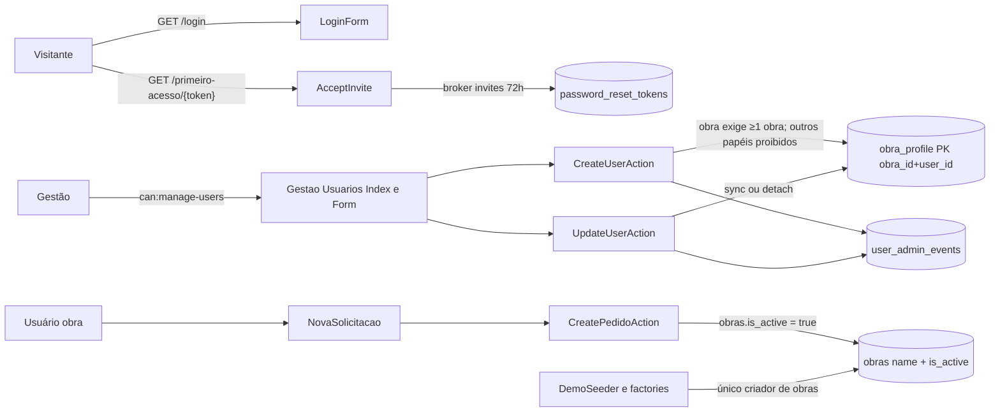
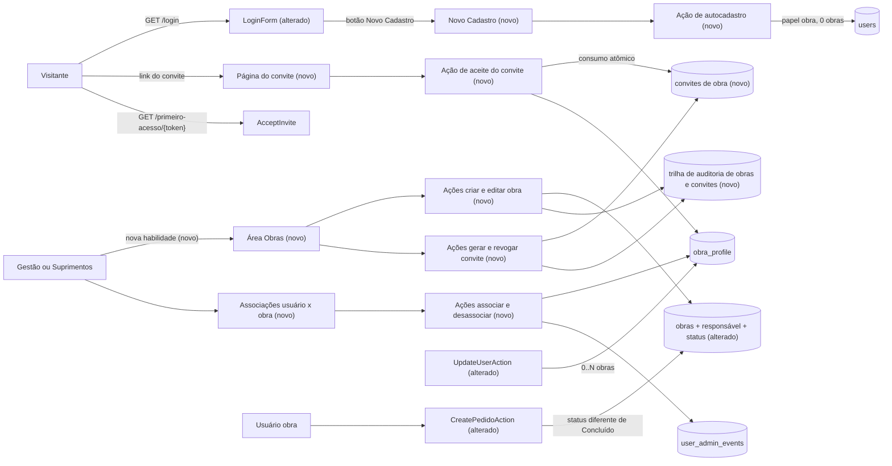

# SPEC: obras-associacoes-cadastro-convites

## Metadata
- Source: developer description via /plan (`.spec/features/obras-associacoes-cadastro-convites/.handoff/description.md` — fatia 1 de 3 do "PLANO COMPLETO — EVOLUÇÃO DO SISTEMA ALBUQUERQUE"; 10 confirmed ACs = source of truth; verbatim §1–§9, §41 (parcial), §42 (parcial), §43–§46)
- Service: sistema_obra_mc (Laravel 13.32.0 / Livewire 4.4.5 / PostgreSQL — single repo, single deployable)
- Tier: complete
- Version: 1.3 (cross-review fixes F-10 (UI-08 provisional until slice 3 RF-08) and F-13 (RF-11/UI-06 Suprimentos self-association intended, non-blocking notice) applied, 2026-09-23; v1.2: NC-08 "convite token is a secret — never in any log, including edge/FrankenPHP access logs" resolved by developer, 2026-09-22, FINAL and not changeable during implementation; v1.1: NC-01..NC-07 resolved, RF-28 status fixed at 404)
- Architecture references: `AGENTS.md`, `CLAUDE.md` (§3, §5, §6; §7 "O que NÃO existe" is stale about rate limiting and audit tables — code wins), `docs/agents/architecture.md`, `docs/agents/domain_rules.md`, `docs/agents/data_model.md`, `docs/agents/api_contracts.md`
- Init chain consulted: `.spec/init/user-stories.md` (role language only). `.spec/init/project-description.md`, `database-schema.md`, `project-phases.md` describe the discontinued Next.js/Supabase stack (RLS, Supabase Auth) and were **not** used for stack or authorization decisions. Where they conflict with the ACs, the ACs win.
- `.ai/rules/` does not exist in the repository (checked 2026-09-22).

### Architecture rules this SPEC inherits

| Rule | Source |
|---|---|
| Routes bind directly to full-page Livewire components; components re-check the role gate in `mount()`, call `$this->authorize(<ability>)` and delegate **every** write to a single-purpose Action. Components never persist directly | `docs/agents/architecture.md` "Layer responsibilities" |
| Actions own validation (`Validator::make`, PT-BR messages), actor guard and the `DB::transaction` that writes the mutation together with its audit/event row | `docs/agents/architecture.md`; `docs/agents/domain_rules.md` "User administration", "Administrative audit" |
| Authorization is application-layer only (7 layers: `guest`/`auth` → `active` → `can:` gates → `mount()` → Policies → Action guards → Action validation). No PostgreSQL RLS | `CLAUDE.md` §5 |
| `Pedido::visibleTo` is the single row-visibility rule and opens every listing query; a user filter may only narrow it | `CLAUDE.md` §5 "Decisão travada"; `app/Models/Pedido.php:40-47` |
| `EmailNormalizer::normalize()` is the only e-mail normalization; DB backstop `users_email_lower_unique` on `lower(email)` | `CLAUDE.md` §6; `docs/agents/domain_rules.md` "E-mail normalization" |
| Audit trails are append-only (`pedido_events`, `user_admin_events`, `authentication_events`), user FKs `restrictOnDelete`; users are never deleted, only deactivated | `docs/agents/data_model.md`; `database/migrations/2026_09_21_000001_create_user_admin_events_table.php`, `…_000002_create_authentication_events_table.php` |
| `demo:reset` is the only exemption to append-only and deletes demo rows in FK order inside one transaction | `app/Console/Commands/ResetDemoData.php:57-68` |
| Rate-limit thresholds are literal product decisions in `AppServiceProvider::configureRateLimiting()`, never env/config | `app/Providers/AppServiceProvider.php:50-69` |
| PHP 8.4-compatible code, Pint, Pest, `php artisan make:*`, no new dependencies without approval, new models get factories | `CLAUDE.md` §2, §8; `AGENTS.md` |

## Context

Today every obra user must have ≥ 1 obra and every non-obra user is forbidden from having any (`CreateUserAction::obraIdsRules`, `app/Actions/Usuarios/CreateUserAction.php:129`), only Gestão administers users and their obras (`can:manage-users`, `routes/web.php:88`), obras have only `name` + boolean `is_active` (`database/migrations/2026_09_18_230112_create_obras_table.php:16-17`) and are created solely by `DemoSeeder`/factories — there is no obra UI (`CLAUDE.md` §4 "Cadastro de obras ❌"). Accounts are only created by Gestão (first-access e-mail via broker `passwords.invites`, 72 h, `/primeiro-acesso/{token}`, `routes/web.php:37`) or by `users:create-gestao`; there is no self-signup.

This slice (fatia 1) introduces: (a) an Obras area for Gestão **and** Suprimentos with Nome, Responsável and a 3-value Status replacing the boolean activity concept; (b) a user × obra association screen for Gestão and Suprimentos, with 0..N obras for obra and suprimentos users; (c) a public "Novo Cadastro" on the login screen that always creates an `obra` account with zero obras; (d) **obra invitations** ("convites de obra") — single-use, 24 h, revocable links tied to one obra, which either create a new obra account or attach the obra to an existing obra account.

Naming note: the existing Gestão "convite de primeiro acesso" (`AcceptInvite`, broker `invites`, `FirstAccessInvite` notification) is a **different** mechanism and is not changed by this SPEC. In this document "convite" without qualifier means the new obra invitation.

Access to the new screens goes into the current toolbar (`resources/views/layouts/app.blade.php:19-37`); the sidebar belongs to fatia 3. Slices 2 (`solicitacao-historico-finalizacao`) and 3 (`navegacao-sidebar-listagens`) are out of scope.

## AS IS — Estado atual

Hoje só a Gestão administra usuários e suas obras, com a regra rígida "papel obra ⇒ ≥1 obra; demais papéis ⇒ nenhuma obra". Obras existem apenas via seeder/factory, com atividade booleana, e não há autocadastro nem convite vinculado a obra.

## TO BE — Estado proposto

Nós novos/alterados e os ids RIGID que realizam: Novo Cadastro e ação de autocadastro (RF-16..RF-22, UI-01, UI-02, CT-04); área Obras e ações de obra (RF-01..RF-07, UI-03, UI-04, CT-01); convites, página e aceite (RF-23..RF-34, UI-05, UI-07, CT-02, CT-05); associações (RF-08..RF-15, UI-06, UI-10, CT-06); `CreatePedidoAction` alterada (RF-03, RF-04); trilha de auditoria (RF-02, RF-12, RF-22, RF-34, CT-07). O fluxo de primeiro acesso da Gestão (`AcceptInvite`) permanece inalterado (RF-37).

## Scope
- **In**:
  - Obras area (list, create, edit) for Gestão and Suprimentos; fields Nome, Responsável, Status ∈ {A iniciar, Em andamento, Concluído}; migration of the existing boolean activity to the new status.
  - "Obra ativa" = status ≠ Concluído, enforced in the existing Nova Solicitação flow (UI list + `CreatePedidoAction`).
  - User × obra association screen for Gestão and Suprimentos (locate user, view, add one or many, remove), 0..N obras for `obra` and `suprimentos` users; relaxation of the ≥1/prohibited rule in the Gestão Usuários form.
  - Public "Novo Cadastro" from the login screen.
  - Obra invitations: generate, list, revoke, accept (new account / existing obra account), atomic single-use consumption.
  - Audit of obras, associations, convites and account creations; `demo:reset` and `DemoSeeder` adapted to the new schema.
  - Toolbar entries for the new screens; mobile operation of login, Novo Cadastro, convite, Obras and associações.
- **Out**:
  - Everything assigned to fatia 2 (Nova Solicitação by Suprimentos, opção "Outra", 3 datas, anexos, histórico padronizado, observações, Obra marca Entregue, romaneio, status Finalizado) and fatia 3 (sidebar, homes = Pedidos, colunas, ordenação, filtros compactos, "Somente obras ativas").
  - Any change to `Pedido::visibleTo` semantics: Suprimentos associations have no effect on pedido visibility in this slice.
  - Deleting obras; deleting users; e-mail delivery of obra convites (the link is copied by the creator); e-mail verification or CAPTCHA on Novo Cadastro; 2FA.
  - Full user administration (create/edit/deactivate/role change/access-link resend) for Suprimentos — AC-3 grants Suprimentos only locate/view/add/remove associations; `manage-users` stays Gestão-only.
  - Changes to the Gestão first-access invite (`/primeiro-acesso/{token}`, broker `invites`, 72 h).

## RIGID (Non-Negotiable)

### Functional Requirements

#### Obras (AC-1, AC-2)

- RF-01 [Event-Driven]: When a Gestão or Suprimentos user submits a new obra with Nome, Responsável and Status, the system shall persist the obra with those values and write one append-only audit record (CT-07) of the creation.
  - AC: Gestão creates obra → 1 new obra row with the submitted name/responsável/status + 1 audit record with actor = Gestão user; same test for Suprimentos passes; Nome empty → 422 on `name`, no row, no audit record; Status outside the 3 values → 422, no row; Responsável empty → obra created with responsável null/blank; Responsável > 255 chars → 422 on `responsavel`, no row.
  - Responsável definition (NC-01, resolved): optional free-text name, ≤ 255 chars, not a reference to `users`. Existing obras keep it blank (no backfill).
  - Nome uniqueness (resolved, Q-03): obra names are unique case-insensitively after trim — comparison on `lower(btrim(name))`. The Action rejects a create/edit whose normalized name equals another obra's with a PT-BR 422 on `name` and writes nothing; a DB unique index on `lower(btrim(name))` backstops races, which surface as a validation error, never HTTP 500.
  - AC (uniqueness): existing "Obra Centro" → creating "  obra centro " → 422 on `name`, no row, no audit; editing obra B to the name of obra A → 422, B unchanged; two concurrent creates of the same name → exactly 1 row, the other a validation error.
- RF-02 [Event-Driven]: When a Gestão or Suprimentos user saves changes to an obra (Nome, Responsável and/or Status, any status to any status, including from Concluído back to A iniciar/Em andamento), the system shall update the obra and write one audit record containing the before/after values of the changed fields only; saving with no change writes nothing.
  - AC: status Em andamento → Concluído produces 1 audit record with `before.status = em_andamento`, `after.status = concluido`; identical resubmission produces 0 records; the count of `pedidos`, `pedido_events`, `obra_profile` rows for that obra is identical before and after the edit.
- RF-03 [Ubiquitous]: The system shall define "obra ativa" exactly as `status ≠ Concluído`, in one single definition consumed by every place that today uses the obra activity flag (`Obra::scopeActive`, `app/Models/Obra.php:28-32`; `NovaSolicitacao::obras()`, `app/Livewire/Obra/NovaSolicitacao.php:79`; `CreatePedidoAction`, `app/Actions/Pedidos/CreatePedidoAction.php:57`).
  - AC: obras in A iniciar and Em andamento are active; Concluído is not; a grep for the old boolean check in `app/` returns no remaining decision point outside the single definition.
- RF-04 [Unwanted]: If an `obra` user submits a new solicitação for an obra whose status is Concluído (including a forged `obra_id` not offered by the select), then the system shall reject it with a 422 on `obra_id`, before consuming a pedido code and without writing any pedido or `pedido_events` row.
  - AC: obra associated + Concluído → 422 on `obra_id`; `pedidos` and `pedido_events` counts unchanged; `nextval('pedido_code_sequence')` not advanced; Nova Solicitação select does not list the Concluído obra.
- RF-05 [State-Driven]: While an obra is Concluído, the system shall keep all its pedidos, `pedido_events` and `obra_profile` rows, and associated `obra` users shall keep seeing its pedidos through the unchanged `Pedido::visibleTo` scope; listing filters by obra keep offering it.
  - AC: associated obra user lists and opens a pedido of a Concluído obra (200, history rendered); Suprimentos/Gestão listings filtered by that obra return its pedidos.
- RF-06 [Ubiquitous]: The system shall not provide any route, Livewire method or Action that deletes an obra.
  - AC: no route/Action/component method deletes from `obras`; the only deleter remains `demo:reset` for `is_demo = true` rows.
- RF-07 [Unwanted]: If a user whose papel is not Gestão or Suprimentos (or who is inactive or unauthenticated) requests any Obras screen or invokes any obra/convite Action or Livewire method, then the system shall deny it (403 for authenticated `obra` users; redirect to `/login` for guests; logout for inactive users) without writing anything.
  - AC: `obra` user GET on the Obras area → 403; direct Action call with an `obra` actor → `AuthorizationException`; forged `/livewire/update` call → 403; zero rows written.

#### Associações usuário × obra (AC-3, AC-4)

- RF-08 [Event-Driven]: When a Gestão or Suprimentos user opens the associations screen and types a search term, the system shall list, paginated, the users whose papel admits associations (RF-11) whose name or e-mail contains the term case-insensitively, each with papel, active/inactive state and the names of all currently associated obras.
  - AC: search "maria" matches "Maria" and "MARIA@x.com"; each row shows all associated obras; a Gestão-papel user matching the term is **not** listed (NC-03).
- RF-09 [Event-Driven]: When a Gestão or Suprimentos user adds one or several obras to a user in a single operation, the system shall create one `obra_profile` row per obra in one transaction.
  - AC: adding [A, B, C] to a user with zero obras yields exactly 3 rows; a failure on any of them leaves 0 new rows.
- RF-10 [Unwanted]: If an add operation includes an obra already associated with the user (or the same obra twice), then the Action shall reject the whole operation with a PT-BR 422 naming the duplicated obra and write nothing; and if a duplicate insert reaches the database anyway (concurrent requests), the composite primary key `(obra_id, user_id)` (verified at `database/migrations/2026_09_18_230113_create_obra_profile_table.php:19`) shall reject it and the user shall receive a validation error, never an HTTP 500.
  - AC: [A] on a user already linked to A → 422, 0 rows added; two concurrent adds of A → exactly 1 row, the other request answers with a validation error.
  - Concluído obras (NC-07, resolved): the associations screen and Actions accept adding an obra whose status is Concluído (it grants visibility of its existing pedidos; creation of new solicitações stays blocked by RF-04).
- RF-11 [Ubiquitous]: The system shall allow users with papel `obra` and papel `suprimentos` to have 0..N associated obras, via the associations screen, the Gestão Usuários form and convites (obra only).
  - AC: an obra user with 0 obras, and a suprimentos user with 3 obras, are both valid states accepted by every Action.
  - Gestão papel (NC-03, resolved): a `gestao` user never holds associations and is not listed on the associations screen; any Action/form input associating obras to a `gestao` user → 422, nothing written. Both Gestão and Suprimentos may edit associations of `obra` and `suprimentos` users.
  - Suprimentos self-association (F-13, resolved v1.3): a Suprimentos actor associating obras with **itself** (or with any other Suprimentos user) is intended behaviour (master plan §1, §3), not a privilege escalation; it is exactly what grants Suprimentos creation eligibility in slice 2 (`solicitacao-historico-finalizacao` RF-02). The Actions shall not block `actor == target`. AC: a Suprimentos user adds obra A to its own account → 1 row added, 1 `obra_access_changed` record (RF-12) with actor = target, no error.
- RF-11b [Event-Driven]: When `UpdateUserAction` changes a user's papel, the system shall (a) on a change to `gestao`, remove all of the user's `obra_profile` rows in the same transaction and write one `obra_access_changed` record (RF-12) with `before.obra_ids` = the removed ids and `after.obra_ids` = []; (b) on a change between `obra` and `suprimentos` (either direction), keep all associations unchanged. This replaces today's "leaving `obra` detaches all" behaviour (`app/Actions/Usuarios/UpdateUserAction.php:76`).
  - AC: obra user with [A, B] → papel gestao → 0 `obra_profile` rows + 1 `obra_access_changed` record (before [A, B], after []); suprimentos user with [A] → papel obra → still [A], no `obra_access_changed` record from the papel change; `pedidos`/`pedido_events` counts unchanged.
- RF-12 [Event-Driven]: When associations are added or removed by any path (associations screen, Gestão Usuários form, convite acceptance), the system shall write, in the same transaction, one `user_admin_events` record with action `obra_access_changed`, `before.obra_ids`/`after.obra_ids` as sorted integer lists, `actor_id` = the acting user (Gestão, Suprimentos, or the invited user themself) and `target_id` = the affected user.
  - AC: Suprimentos adds [A, B] → 1 record, actor = Suprimentos, before = [], after = [A, B]; a rolled-back operation leaves 0 records.
- RF-13 [Event-Driven]: When a Gestão or Suprimentos user removes an association, the system shall delete only that `obra_profile` row and leave every `pedidos` and `pedido_events` row untouched (including pedidos requested by that user in that obra).
  - AC: `pedidos`/`pedido_events` counts identical before and after removal; the removed user no longer sees that obra's pedidos (unchanged `visibleTo`), Suprimentos/Gestão still do.
- RF-14 [State-Driven]: While an `obra` user has zero associated obras, the system shall let the user authenticate normally, land on the obra pedidos listing with zero rows, show the Nova Solicitação empty state, and deny access to any pedido by forged id (403) or forged `obra_id` on creation (422).
  - AC: login succeeds (`login_success` recorded); `/obra/pedidos` returns 200 with 0 rows; GET of an existing pedido of any obra → 403; `CreatePedidoAction` with any `obra_id` → 422 on `obra_id`.
- RF-15 [Ubiquitous]: The system shall keep `Pedido::visibleTo` and `PedidoPolicy` semantics unchanged: associations of a `suprimentos` user shall neither restrict nor expand what that user sees or mutates.
  - AC: a suprimentos user with 0 obras and one with 2 obras see the same pedido set (all); existing `tests/Feature/Authorization/PedidoVisibleToScopeTest.php` passes unchanged.
- RF-13b [Event-Driven]: When Gestão creates or edits a user through the existing Usuários form, the system shall accept 0..N obras for papel `obra` and `suprimentos` (the ≥1-obra requirement and the prohibition for `suprimentos` are removed); for papel `gestao` any non-empty `obra_ids` → 422 on `obra_ids` (NC-03).
  - AC: Gestão creates an obra user with `obra_ids = []` → user created, 0 rows in `obra_profile`; Gestão creates a suprimentos user with 2 obras → 2 rows.

#### Novo Cadastro público (AC-5)

- RF-16 [Event-Driven]: When a guest submits Novo Cadastro with Nome, E-mail, Senha and confirmação de senha, the system shall create a user with papel `obra`, zero associated obras, `is_active = true` and `is_demo = false`.
  - AC: valid submission → 1 new `users` row with `role.slug = obra`, 0 `obra_profile` rows, `is_active = true`, `is_demo = false`, password stored hashed.
  - Validation: Nome required ≤ 255 chars; E-mail required, valid, ≤ 255 chars; Senha required, equal to confirmação, and satisfying `PasswordRule::defaults()` (verified at `app/Livewire/Auth/Concerns/DefinesPasswordFromToken.php:54`) — each violation → 422 on the field, no user created.
- RF-17 [Unwanted]: If the Novo Cadastro request carries any papel, role, obra, `is_active`, `is_demo` or other field beyond name/e-mail/senha/confirmação (forged Livewire payload or direct Action input), then the system shall ignore or reject it and never apply it.
  - AC: forged payload with a `gestao`/`suprimentos` role id and `obra_ids = [1]` → either no user is created, or the created user has papel `obra` and 0 obras; never another papel, never an association.
- RF-18 [Ubiquitous]: The system shall normalize the Novo Cadastro e-mail with `EmailNormalizer::normalize()` (verified at `app/Support/EmailNormalizer.php:27`) before validation and persistence, and shall reject an e-mail equal (case-insensitively, after trim) to an existing user's; a race that reaches the `users_email_lower_unique` index (verified at `database/migrations/2026_09_22_155011_normalize_user_emails_and_add_lower_unique_index.php:36`) shall surface as a validation error, never HTTP 500.
  - AC: "  Ana@X.com " is stored as "ana@x.com"; a second signup with "ANA@x.com" creates no user; two concurrent identical signups → exactly 1 user.
- RF-19 [Unwanted]: If account-creation submissions (Novo Cadastro **and** convite new-account path, RF-29, sharing the same counters) from one IP or for one normalized e-mail + IP exceed the configured threshold, then the system shall refuse the submission with a PT-BR message, without creating a user, following the existing limiter pattern (literal thresholds in `AppServiceProvider::configureRateLimiting()`, keys built from the normalized e-mail hash, never containing the password).
  - Thresholds (NC-04, resolved): limiter `register` = 3 attempts / 10 min per normalized e-mail + IP; limiter `register-ip` = 10 attempts / 1 hour per IP. Both are shared by Novo Cadastro and convite account creation.
  - AC: 4th submission for the same e-mail+IP within 10 min → refused, no user; 11th submission from one IP within 1 hour (any e-mails, mixing Novo Cadastro and convite) → refused, no user; after the window → accepted.
- RF-19b [Unwanted]: If convite token lookups (the POST through `/livewire/update` that carries the token to the server, RF-38) from one IP exceed 20 per minute, then the system shall refuse further lookups with a PT-BR rate-limit response, checked **before** the token is hashed or looked up, without revealing whether any token is valid and without consuming any convite. (NC-08: the GET of the convite page carries no token, so the limiter is bound to the lookup, not to the GET.)
  - AC: 21st lookup from one IP within 1 min → refused with the PT-BR throttle message (for valid and invalid tokens alike; no DB lookup of the token hash occurs for the refused call); after the window → accepted. Limiter `invite-ip` = 20 / 1 min per IP, hit once per lookup call.
- RF-20 [Unwanted]: If the Novo Cadastro (or convite new-account) e-mail already belongs to an account, then the system shall not create a user and shall show the explicit PT-BR validation error on `email`: "Já existe uma conta com este e-mail. Entre ou use Esqueci minha senha." (NC-05, resolved — the developer accepts the account-enumeration exposure, mitigated by RF-19 limiters).
  - AC: duplicate e-mail (any case/whitespace variant) → 0 new users, 422 on `email` with exactly that text; the attempt counts toward RF-19 limiters.
- RF-21 [Event-Driven]: When Novo Cadastro or convite account creation (RF-29) succeeds, the system shall authenticate the new user immediately — regenerate the session id, write one `login_success` `authentication_events` record for the new user — and redirect to `/home`, showing a PT-BR message that access to obras depends on Gestão/Suprimentos (Novo Cadastro only; the convite path already carries its obra). (NC-06, resolved.)
  - AC: after success the user is authenticated, the session id differs from the pre-submit one, exactly 1 `login_success` record exists for the new user, the browser lands on `/home` (→ obra pedidos listing) and, for Novo Cadastro, the message is visible.
- RF-22 [Event-Driven]: When an account is created by Novo Cadastro or by convite acceptance, the system shall write one append-only audit record identifying the created user, the origin (`novo_cadastro` or `convite`, with the convite id), the client IP and the timestamp, in the same transaction as the user insert.
  - AC: 1 signup → exactly 1 record with origin `novo_cadastro`; rolled-back creation → 0 records; the record never contains the password.

#### Convites de obra (AC-6 … AC-9)

- RF-23 [Event-Driven]: When a Gestão or Suprimentos user generates a convite from an obra whose status is not Concluído, the system shall create a convite record bound to that obra with creator, creation time and expiration = creation + 24 h, and shall show the full link to the creator exactly once, in that response. The link carries the plaintext token **only in the URL fragment** (form `<APP_URL>/convite#<token>`), never in the path or query string (RF-38, NC-08).
  - AC: 1 generation → 1 convite row with `obra_id`, `created_by`, `created_at`, `expires_at = created_at + 24h`, `revoked_*`/`used_*` null; the plaintext token appears in no persisted column; the generated link parsed with `parse_url` has the token in `fragment` and neither `path` nor `query` contains it; reloading the screen does not show the link again.
- RF-24 [Ubiquitous]: The system shall produce a distinct token for every convite; N convites for the same obra yield N distinct links, each independently usable once.
  - AC: 3 generations for obra A → 3 rows, 3 distinct links, 3 distinct stored hashes; consuming one leaves the other two valid.
- RF-25 [Event-Driven]: When a Gestão or Suprimentos user revokes a pending convite, the system shall record the revoker and revocation time; revoking a convite that is already used, revoked or expired shall be rejected with a PT-BR 422 and change nothing.
  - AC: revoke pending → `revoked_by`, `revoked_at` set; revoke used → 422, row unchanged; a revoked link afterwards behaves as RF-28.
- RF-26 [Event-Driven]: When a Gestão or Suprimentos user opens an obra, the system shall list that obra's convites with creator, created-at, expires-at and derived state ∈ {Pendente, Utilizado, Expirado, Revogado}, plus revoker/revoked-at and used-by/used-at when set.
  - AC: one convite in each state → each shown with the correct label; state is derived at read time (expired = not used, not revoked and now ≥ `expires_at`).
- RF-27 [Ubiquitous]: The system shall consider a convite valid if and only if its token hash matches a stored convite, it is not used, not revoked, the current time is before `expires_at`, and its obra's status is not Concluído (NC-07).
  - AC: 23 h 59 min after creation → valid; 24 h 00 min 01 s → invalid (time-travel test); pending convite whose obra became Concluído → invalid.
- RF-28 [Unwanted]: If a convite link is expired, used, revoked, malformed, unknown, or belongs to an obra that is now Concluído, then the system shall render the same generic PT-BR error page with HTTP **404** (same status, same text for all cases), without the obra name, creator, e-mail or any other convite data, without any form, and without consuming or altering the convite. Because the lookup is a POST (RF-38), the invalid outcome shall bring the browser to that generic page at a fixed, token-free URL served with HTTP 404; the lookup responses themselves shall be indistinguishable across the six cases.
  - AC: for the six cases the lookup responses are identical (same effect/redirect target, no case-specific data) and the resulting error page is HTTP 404 and byte-identical apart from CSRF/session tokens; neither the lookup response nor the error page URL contains the token; no obra name in the body; the convite row is unchanged.
- RF-29 [Event-Driven]: When a guest with no account submits Nome, E-mail, Senha and confirmação on a valid convite, the system shall, in one transaction, create a user with papel `obra`, `is_active = true`, `is_demo = false`, associate it to the convite's obra, and mark the convite used (`used_at`, `used_by` = new user); the obra is shown read-only and any submitted obra identifier is ignored.
  - AC: success → 1 user (papel obra), exactly 1 `obra_profile` row for the convite obra, convite used by that user; forged payload with another `obra_id` → association only to the convite obra; validation failure (e.g. weak password, duplicate e-mail per RF-18) → no user, no association, convite still pending.
  - The field validation, e-mail normalization and duplicate rules of RF-16/RF-18 apply, as do the shared RF-19 limiters. If the e-mail already exists, the RF-20 message is shown and the page directs the person to the existing-account path (RF-30). On success the user is authenticated and redirected per RF-21.
- RF-30 [Event-Driven]: When the holder of an existing active `obra` account opens a valid convite, the system shall require authentication through the standard login (same limiters, `authentication_events` and `is_active` check as `LoginForm`), return to the same convite page afterwards (the return is keyed by the convite id or token hash kept server-side, never by the plaintext token in the session or URL — RF-38; validity per RF-27 is re-checked on return), require an explicit confirmation, then — in one transaction — add the association if absent (never a duplicate) and mark the convite used by that account.
  - AC: guest chooses "Já tenho conta" → after successful login the browser is back on the (token-free) convite page for the same convite → confirm → 1 new `obra_profile` row (or 0 if already associated, with a PT-BR notice) and convite used by that user; without confirmation nothing changes.
- RF-31 [Unwanted]: If the authenticated account opening or confirming a valid convite has papel `gestao` or `suprimentos`, then the system shall show a clear PT-BR error that convites de obra only apply to Obra accounts, shall not change the account's papel or associations, and shall not consume the convite.
  - AC: Suprimentos confirms → error shown, papel unchanged, 0 new `obra_profile` rows, convite still pending.
- RF-32 [Unwanted]: If two or more requests try to consume the same convite concurrently (new-account or existing-account path, or a revocation racing a consumption), then exactly one shall succeed; every other shall receive the RF-28 outcome and shall leave no user, association or audit row behind.
  - AC: 10 parallel consumptions of one convite → 1 success, 9 failures, exactly 1 new association and at most 1 new user.
- RF-33 [Unwanted]: If a Gestão or Suprimentos user tries to generate a convite for an obra whose status is Concluído, then the system shall reject it with a PT-BR 422 and write no convite and no audit row; and if a pending convite is opened or submitted after its obra became Concluído, then the system shall answer with the RF-28 page (404) and shall not consume the convite (NC-07, resolved).
  - AC: generate on Concluído obra → 422, 0 convite rows, 0 audit rows; obra switched to Concluído after generation → GET and submit of the link → RF-28 404, 0 users/associations created, convite `used_*`/`revoked_*` still null; switching the obra back to Em andamento before `expires_at` makes the same convite valid again.
- RF-34 [Event-Driven]: When a convite is generated, revoked or consumed, the system shall write one append-only audit record (CT-07) with actor, obra, convite id and action, in the same transaction as the change; the association created by consumption is additionally recorded per RF-12.
  - AC: generate + revoke → 2 records; consume → 1 convite record + 1 `obra_access_changed` record (when an association was added); rolled-back consumption → 0 records.

#### Sigilo do token do convite (NC-08 — FINAL, não alterável durante a implementação)

- RF-38 [Ubiquitous]: The system shall treat the convite plaintext token as a secret that never reaches any application log or any access log (Railway edge / FrankenPHP), within the current architecture (Laravel 13 + Livewire 4, no JSON API, no new dependency, RNF-05). Concretely:
  1. **Never in path or query.** No request of the convite flow (page GET, Livewire updates, login return, error page) shall carry the token in its path or query string, since access logs record path + query. The convite route has no token route parameter.
  2. **Fragment transport.** The shareable link carries the token only in the URL fragment (`/convite#<token>`), which browsers never send to the server. The convite page shall include a small inline script that reads `location.hash`, immediately removes it from the address bar and history with `history.replaceState`, and hands the token to the Livewire component in the POST body of `/livewire/update` (method argument), where it is validated for format, hashed and looked up by hash (RF-27). Empty/absent fragment → RF-28 outcome.
  3. **No plaintext after lookup.** The token is never kept in a `#[Url]` property nor in any public Livewire property that is serialized into the component snapshot after the lookup; after lookup the component retains only the convite id (`#[Locked]`), and subsequent actions (register, confirm) act on that id with the RF-27 validity re-checked in the conditional consumption (RF-32).
  4. **No plaintext in session.** The RF-30 post-login return stores only the convite id or token hash in the session, never the plaintext (`SESSION_ENCRYPT=false`, `sessions` table).
  5. **No plaintext in logs, audit or exceptions.** The token is never written to any log line, audit row (`obra_admin_events`, `account_registration`/`authentication_events`, `user_admin_events`) or persisted column — only the hash or the convite id; no exception message, exception context or `report()` payload of the convite flow contains it.
  6. **Unchanged:** the one-time display of the generated link to Gestão/Suprimentos (RF-23, UI-05). The Gestão first-access flow `/primeiro-acesso/{token}` is out of scope of this decision and stays unchanged (RF-37).
  - AC-a: `php artisan route:list --json` → the convite route(s) have no `{token}` (or any) route parameter; a Feature test asserts that every GET issued in the generate → open → register and generate → open → login → return → confirm flows has a URI (path + query) not containing the plaintext token.
  - AC-b: the convite page HTML contains the inline script that reads `location.hash`, calls `history.replaceState` and passes the token to the Livewire lookup method; the Browser test opens `/convite#<token>` and afterwards `window.location.hash === ''` and the page shows the valid-convite state.
  - AC-c: after a successful lookup, the component snapshot (rendered HTML of `/livewire/update` responses and subsequent renders) does not contain the plaintext token; no `#[Url]` property exists on the convite component.
  - AC-d: after "Já tenho conta", the `sessions.payload` row for the session (decoded) does not contain the plaintext token; the login return URL does not contain it.
  - AC-e: with `Log::spy()` and exception reporting captured, a full generate → lookup → accept cycle and an invalid-token lookup produce no log call, no reported exception message/context and no row in `obra_invitations`, `obra_admin_events`, the account-creation audit, `user_admin_events` or `authentication_events` containing the plaintext token.
  - AC-f: the lookup POST is subject to `invite-ip` (RF-19b): the 21st lookup from one IP within 1 min is refused before any hash lookup.

#### Non-regression and data preservation (AC-10, §42, §43)

- RF-35 [Ubiquitous]: The system shall keep `php artisan demo:reset` removing only `is_demo = true` data in one transaction without FK violations, including convites, convite/obra audit rows and account-creation audit rows that reference demo obras or demo users; rows referencing only real data are never touched; `DemoSeeder` and factories shall create obras with a valid `status` (optional free-text responsável per NC-01) and no longer reference `obras.is_active`.
  - AC: seed → create convites and audits for demo obras → `demo:reset --force` exits 0; a convite of a real obra created by a real user survives.
- RF-36 [Ubiquitous]: The migrations of this feature shall be additive/transforming only: no `DELETE`, `TRUNCATE` or drop of any table with data, and no row of `users`, `obras`, `obra_profile`, `pedidos`, `pedido_events`, `user_admin_events`, `authentication_events` removed. In one migration, existing obras receive a status derived from `obras.is_active` — `true` → `em_andamento`, `false` → `concluido` — and then the `obras.is_active` column is dropped (NC-02, resolved; the only column drop authorized by this SPEC). Factories, `DemoSeeder`, `demo:reset` and every reader of `obras.is_active` in `app/`, `database/` and `tests/` change in the same delivery.
  - AC: row counts of those 7 tables identical before and after `migrate`; every existing obra has a non-null status after migrate, with the mapping above; `obras.is_active` no longer exists; grep for `is_active` in obra contexts of `app/`/`database/` returns nothing.
- RF-36b [Unwanted]: If, when the obra-name uniqueness migration runs, existing obras already collide under `lower(btrim(name))`, then the migration shall abort with a PT-BR `RuntimeException` naming the colliding values, write nothing (single transaction), and exit `migrate` with a non-zero code — mirroring `2026_09_22_155011_normalize_user_emails_and_add_lower_unique_index.php`.
  - AC: seeded "Obra X" and " obra x" → `migrate` exits ≠ 0, schema and data unchanged (no status column, no index); without collisions → index created.
- RF-37 [Ubiquitous]: The system shall keep unchanged: `AuthenticateSession` in the `web` group (`bootstrap/app.php:39`), `EnsureUserIsActive` on every authenticated route and on `/livewire/update` (`app/Providers/AppServiceProvider.php:47`), the four existing limiters, `EmailNormalizer` as the single normalization, `users_email_lower_unique`, `Pedido::visibleTo`, `PedidoPolicy`, `UserPolicy`/`manage-users` (Gestão-only), append-only guards of `pedido_events`/`user_admin_events`/`authentication_events`, and the Gestão first-access invite flow (`/primeiro-acesso/{token}`, broker `invites`, 72 h).
  - AC: existing suites under `tests/Feature/{Auth,Authorization,Security,Compliance}` pass; only tests that encode the removed "obra ⇒ ≥1 obra / non-obra ⇒ no obra" rule are updated (never deleted) to the RF-11/RF-13b rule.

### UI Requirements

- UI-01 [Ubiquitous]: The login screen shall show a second button "Novo Cadastro", next to the existing "Entrar" action and "Esqueci minha senha" link (`resources/views/livewire/auth/login-form.blade.php:15`), leading to the Novo Cadastro screen.
  - AC: button visible and keyboard-focusable on `/login`; activating it opens Novo Cadastro.
- UI-02 [Ubiquitous]: The Novo Cadastro screen shall contain exactly the fields Nome, E-mail, Senha, Confirmação de senha and a submit button, plus a link back to login; it shall contain no obra, obra-name, papel/perfil, Gestão or Suprimentos control.
  - AC: DOM contains exactly those 4 inputs; no `select`/radio for papel or obra.
- UI-03 [Ubiquitous]: The Obras screen shall list obras (Nome, Responsável, Status label "A iniciar"/"Em andamento"/"Concluído") paginated, with actions "Nova obra" and "Editar"; no delete action.
  - AC: 3 obras in 3 states listed with correct labels; no delete control.
- UI-04 [Ubiquitous]: The obra form (create/edit) shall have Nome, Responsável (optional free-text) and Status (exactly 3 options); when switching to Concluído it shall state that the obra stops receiving new solicitações and that nothing is deleted.
  - AC: status control has exactly 3 options; the notice text is visible when Concluído is selected.
- UI-05 [Ubiquitous]: The obra edit/detail screen shall have a "Convites" section with "Gerar convite", the convite list of RF-26 and "Revogar" on pending convites; after generation it shall show the link once with a copy control and the text that the link is valid for 24 h and will not be shown again.
  - AC: generate → link and copy control visible; reload → link gone, convite listed as Pendente with Revogar.
- UI-06 [Ubiquitous]: The associations screen shall provide a search field (name/e-mail), the user list of RF-08, and per user: the associated obras each with a "Remover" control (with confirmation) and a multi-select of obras not yet associated with an "Adicionar" action.
  - AC: add 2 obras in one action → both appear; remove asks for confirmation before calling the Action.
  - Self-edit notice (F-13, resolved v1.3): when the listed user is the authenticated user, the screen shall show a visual notice (PT-BR) that the associations being edited are the user's own; the notice never disables or blocks the Adicionar/Remover controls. AC: Suprimentos user sees the notice on its own row only, and can still add/remove its own obras.
- UI-07 [State-Driven]: The convite page shall show, for a valid convite, the obra name read-only and: for guests, the new-account form (Nome, E-mail, Senha, Confirmação) and a "Já tenho conta" action; for an authenticated `obra` user, "Aceitar convite como <nome>" with a confirmation button and a "Sair" option; for Gestão/Suprimentos, the RF-31 error; for invalid convites, the RF-28 page.
  - AC: each of the 4 states renders its described controls and no others.
- UI-08 [Ubiquitous]: The current toolbar (`resources/views/layouts/app.blade.php:19-37`) shall gain "Obras" and the associations entry for Gestão and for Suprimentos; the `obra` papel toolbar is unchanged.
  - AC: Gestão and Suprimentos toolbars contain both entries; obra toolbar identical to today.
  - Provisional (F-10, resolved v1.3): these toolbar entries are provisional navigation, replaced by the sidebar of slice 3 (`navegacao-sidebar-listagens` RF-08), which removes them; tests pinning them (e.g. `LayoutIdentityTest`, `UsuariosIndexTest`) are expected to be rewritten there.
- UI-09 [State-Driven]: While an `obra` user has no active associated obra, Nova Solicitação shall show the existing empty-state notice (`resources/views/livewire/obra/nova-solicitacao.blade.php:15`) with wording that no longer implies only Gestão can associate (Gestão or Suprimentos).
  - AC: 0 obras → notice visible, no form submit possible.
- UI-10 [Ubiquitous]: The Gestão Usuários form shall allow saving `obra` and `suprimentos` users with zero obras and shall show the obra selector for both papéis.
  - AC: selecting Suprimentos shows the obra selector; saving an obra user with no obra succeeds.

### Contracts

All routes below are **new** (none exist in `routes/web.php` today); concrete paths/names are suggestions in FLEXIBLE. The ability and middleware stacks are rigid.

- CT-01 (Obra data): obra = `{ name: string ≤255 required, unique on lower(btrim(name)), responsavel: string ≤255 nullable (free text), status: enum { a_iniciar | em_andamento | concluido } required }`; "ativa" ⇔ `status ≠ concluido` (RF-03). Status labels PT-BR: "A iniciar", "Em andamento", "Concluído".
- CT-02 (Convite record): `{ id, obra_id FK obras, token_hash UNIQUE (plaintext never stored), created_by FK users, created_at, expires_at (= created_at + 24h), revoked_by FK users NULL, revoked_at NULL, used_by FK users NULL, used_at NULL }`; user/obra FKs non-cascading so history survives (restrict). Invariant: at most one of {revoked, used} is set; a consumption or revocation is a single conditional update that only succeeds when both are null and `now < expires_at` (RF-32).
- CT-03 (Screens, authenticated, `auth` + `active`, gated by a new ability granting exactly `gestao` and `suprimentos`, distinct from `manage-users`): Obras list; Obra create; Obra edit (+ convites); Associações. `mount()` re-checks the ability; every mutating method calls `authorize()` before its Action.
- CT-04 (Novo Cadastro screen): guest-only (`guest` middleware, like `/login`); inputs `{ name, email, password, password_confirmation }`; output: new obra user per RF-16, authenticated and redirected to `/home` per RF-21; errors as 422 field errors through `/livewire/update`.
- CT-05 (Convite page, v1.2 per NC-08/RF-38): one token-free route (no route parameter, no token query parameter), reachable by guests and authenticated users (NOT inside the `guest` group; authenticated requests still pass `active`); shareable link = `<APP_URL>/convite#<token>`; token input = argument of a Livewire lookup call in the `/livewire/update` POST body, supplied by the page's inline script from `location.hash` (then cleared with `history.replaceState`); after lookup only the convite id is held (`#[Locked]`). Inputs for the new-account path `{ name, email, password, password_confirmation }`; existing-account path input: confirmation only. Outcomes: success (RF-29/RF-30), RF-31 error, RF-28 page (HTTP 404 at a fixed token-free URL). The lookup is rate limited by `invite-ip` (RF-19b); the new-account submit by `register`/`register-ip` (RF-19).
- CT-06 (Association Actions input): add `{ user_id, obra_ids: list<int> ≥1 distinct existing }`; remove `{ user_id, obra_id }`; actor must be Gestão or Suprimentos (Action-level guard, independent of UI); target papel must be `obra` or `suprimentos` (RF-11/NC-03; `gestao` → 422); obras in any status, including Concluído, are accepted (NC-07).
- CT-07 (Audit records): (a) associations → existing `user_admin_events`, action `obra_access_changed`, whitelist key `obra_ids` (verified at `app/Services/UserAdminAuditRecorder.php:23`); (b) obra created/updated and convite generated/revoked/consumed → a new append-only trail `{ actor_id FK users restrict, obra_id FK obras restrict, convite_id NULL, action, before JSON NULL, after JSON NULL, created_at }` with no update/delete path (model guards + policy denying update/delete, as for the existing trails); (c) account creation → append-only record per RF-22 (IP, origin, user, convite id).

### Non-Functional Requirements

- RNF-01 (token security): convite tokens are generated by a CSPRNG with ≥ 256 bits of entropy, URL-safe; only a one-way hash (SHA-256 or stronger) is persisted; lookup is by hash; the plaintext appears in no log line (application logs **and** Railway edge / FrankenPHP access logs — NC-08), audit row, session payload, Livewire snapshot after lookup, exception report, request path/query, or later page render (RF-38).
- RNF-02 (atomicity): user creation + association + convite consumption (RF-29) and association + consumption (RF-30) each commit or roll back as one unit; audit rows share the same transaction; a parallel test of 10 concurrent consumptions yields exactly 1 success (RF-32).
- RNF-03 (responsive): login, Novo Cadastro, convite page, Obras (list + form) and Associações show no horizontal document overflow and keep the primary control inside the viewport at 390×844, 820×1180 and 1440×900 (same viewports and audit as `tests/Browser/ResponsiveIdentityTest.php:22-26`).
- RNF-04 (query budget): rendering one page of the Obras list, the Associações list and the convite list issues a number of SQL queries that does not grow with the number of rows on the page (no N+1), asserted by a query-count test in the style of `tests/Feature/Performance/QueryCountTest.php`.
- RNF-05 (compatibility): no new Composer or npm dependency; code runs on PHP 8.4.25 (production) and passes `vendor/bin/pint --dirty --format agent`.
- RNF-06 (migrations): `php artisan migrate` on a copy of the current schema with data (and no obra-name collisions, RF-36b) completes with exit 0, removes zero rows from the 7 tables of RF-36, and is repeatable via `migrate:fresh` in the test database; no destructive cleanup inside migrations (§43).
- RNF-07 (language): every user-facing message (validation, errors, notices, statuses) is PT-BR; brand only via `config('app.name')` (`tests/Feature/Compliance/BrandIdentityComplianceTest.php`).
- RNF-08 (no leakage): the convite page and Novo Cadastro never render another user's name/e-mail, the convite creator, or the obra name for an invalid convite; `users.password` is never rendered (existing `BrandIdentityComplianceTest` assertion stays green).

## FLEXIBLE (Implementation Suggestions)

- Obra status: string column `status` (values `a_iniciar`, `em_andamento`, `concluido`) backed by a new `ObraStatus` enum with `isActive()`; rewrite `Obra::scopeActive` to `where('status', '!=', 'concluido')` so `NovaSolicitacao::obras()` and `CreatePedidoAction` keep calling `->active()` unchanged. Migration: collision check on `lower(btrim(name))` → add nullable column → backfill from `is_active` (`true` → `em_andamento`, `false` → `concluido`) → set NOT NULL + default → drop `is_active` → create functional unique index, all in one transaction.
- Responsável: `responsavel` nullable `string(255)`.
- Convites table name `obra_invitations` / model `ObraInvitation` (avoid "invite" collisions with `AcceptInvite`/`FirstAccessInvite`/broker `invites`). Token: `Str::random(64)` or `bin2hex(random_bytes(32))`; store `hash('sha256', $token)` in a unique column. Consumption: `ObraInvitation::whereKey($id)->whereNull('used_at')->whereNull('revoked_at')->where('expires_at', '>', now())->update([...])` inside the transaction, rollback when it returns 0; or `lockForUpdate()` on the row.
- Routes (suggested): `GET /obras` (`obras.index`), `/obras/nova` (`obras.create`), `/obras/{obra}/editar` (`obras.edit`), `/associacoes` (`associacoes.index`) under a shared `can:manage-obras` group outside the `/gestao` prefix; `GET /cadastro` (`register`) inside `guest`; `GET /convite` (`obra-invitation.show`, **no token parameter** — RF-38) outside `guest`; a token-free 404 error route for RF-28 (e.g. `GET /convite/indisponivel`). Gate `manage-obras` defined next to the others in `AppServiceProvider::boot()`; an `ObraPolicy` / `ObraInvitationPolicy` delegating to it.
- Actions under `app/Actions/Obras/` (`CreateObraAction`, `UpdateObraAction`, `GenerateObraInvitationAction`, `RevokeObraInvitationAction`, `AcceptObraInvitationAction`) and `app/Actions/Usuarios/` (`AttachUserObrasAction`, `DetachUserObraAction`, `RegisterObraUserAction`) with a `GuardsObraAdministration` concern mirroring `GuardsUserAdministration`.
- Audit: new `obra_admin_events` table + `ObraAdminAction` enum (`obra_created`, `obra_updated`, `invitation_created`, `invitation_revoked`, `invitation_used`) and an `ObraAdminAuditRecorder` mirroring `UserAdminAuditRecorder`. Account creation: either a new `AuthenticationEventType` case (`account_registered`) with origin in a JSON/extra column, or `user_admin_events` `user_created` with `actor_id = target_id`; update the enum docblocks ("exactly these N").
- Returning to the convite after login: store the convite **id** (never the token) in the session under a dedicated key before redirecting to `/login`; after `Session::regenerate()` `LoginForm` pulls that key and, if present, redirects to the token-free `route('obra-invitation.show')`, which resumes from the session-held id (re-checking RF-27); otherwise the existing `redirect(route('home'))` is unchanged.
- Convite page script: a few lines inline in the Blade (no npm package), e.g. in `x-init`/`@script`: read `location.hash.slice(1)`, `history.replaceState(null, '', location.pathname)`, then `$wire.lookup(token)`. Server-side `lookup(string $token)` checks `invite-ip`, validates 64-hex format, hashes, resolves, stores the id in a `#[Locked]` property and never assigns the token to a property.
- Limiter keys consumed through `AuthenticationRateLimiter`: `register:<sha256(email)>:<ip>`, `register-ip:<ip>`, `invite-ip:<ip>` (names/thresholds are RIGID in RF-19/RF-19b).
- `demo:reset`: delete demo-referencing convites and obra audit rows via `DB::table(...)` after pedidos and before obras/users, extending the existing ordered block.
- Livewire forms: reuse the `alert-info`, form and table components already used by `Gestao\Usuarios\Index`/`Form` and the auth views; mark new copy controls with Alpine `navigator.clipboard`.

## Acceptance Criteria Summary

| ID | Criterion | Testable? |
|----|-----------|-----------|
| RF-01 | G/S create obra with name/responsável/status; audited; invalid input rejected | Yes (Feature) |
| RF-02 | Edit obra; audit only changed fields; no pedido/event/association removed | Yes (Feature) |
| RF-03 | Single "ativa" definition = status ≠ Concluído | Yes (Unit + grep compliance) |
| RF-04 | Concluído obra rejected on creation, no code consumed | Yes (Feature) |
| RF-05 | Concluído obra pedidos stay visible and filterable | Yes (Feature) |
| RF-06 | No obra deletion path | Yes (compliance) |
| RF-07 | Non G/S denied on screens, Livewire methods and Actions | Yes (Feature, adversarial) |
| RF-08 | Locate user by name/e-mail, see associations | Yes (Livewire) |
| RF-09 | Add several obras in one transaction | Yes (Feature) |
| RF-10 | Duplicate rejected by Action and by PK, never 500 | Yes (Feature) |
| RF-11 | obra/suprimentos 0..N obras; gestao none | Yes (Feature) |
| RF-12 | `obra_access_changed` audit on every association change | Yes (Feature) |
| RF-13 | Removal keeps pedidos/events | Yes (Feature) |
| RF-13b | Gestão form accepts 0..N obras | Yes (Feature) |
| RF-11b | Papel change: →gestao detaches (audited), obra↔suprimentos keeps | Yes (Feature) |
| RF-14 | Zero-obra obra user logs in, sees nothing, forgery denied | Yes (Feature) |
| RF-15 | `visibleTo`/`PedidoPolicy` unchanged for suprimentos | Yes (existing tests) |
| RF-16 | Novo Cadastro → papel obra, 0 obras, active | Yes (Livewire) |
| RF-17 | Forged papel/obra fields never applied | Yes (adversarial) |
| RF-18 | E-mail normalized, case-insensitive unique, race safe | Yes (Feature) |
| RF-19 | Signup + convite account creation rate limited (3/10 min e-mail+IP, 10/h IP) | Yes (Feature) |
| RF-20 | Duplicate e-mail → explicit PT-BR message | Yes (Feature) |
| RF-21 | Auto-login after account creation, redirect /home | Yes (Feature) |
| RF-22 | Account-creation audit | Yes (Feature) |
| RF-23 | Generate convite, 24 h, link shown once | Yes (Feature) |
| RF-24 | N convites → N distinct links | Yes (Feature) |
| RF-25 | Revoke pending only, recorded | Yes (Feature) |
| RF-26 | Convite list with derived state | Yes (Livewire) |
| RF-27 | Validity boundary at 24 h | Yes (time travel) |
| RF-28 | Uniform error for 4 invalid states, no data | Yes (Feature) |
| RF-29 | New account via convite, atomic, obra fixed | Yes (Feature) |
| RF-30 | Existing obra account: login → return → confirm → associate | Yes (Feature + Browser) |
| RF-31 | Gestão/Suprimentos not converted, convite not consumed | Yes (Feature) |
| RF-32 | Concurrent consumption → one winner | Yes (concurrency test) |
| RF-33 | No convite for Concluído obra; pending convite refused 404, not consumed | Yes (Feature) |
| RF-34 | Convite lifecycle audited | Yes (Feature) |
| RF-35 | `demo:reset` handles new tables | Yes (Console) |
| RF-36 | Non-destructive migrations with status backfill | Yes (migration test) |
| RF-19b | Convite token lookup (POST) limited 20/min per IP, before hash lookup | Yes (Feature) |
| RF-38 | Token only in URL fragment; never in path/query, session, snapshot after lookup, logs, audit or exception reports | Yes (Feature + Browser + compliance) |
| RF-36b | Migration aborts on obra-name collisions, nothing written | Yes (migration test) |
| RF-37 | No regression of existing security layers | Yes (existing suites) |
| UI-01..UI-10 | Screens, fields, toolbar entries, empty states | Yes (Livewire + Browser) |
| RNF-01..RNF-08 | Token entropy/hash, atomicity, responsive, query budget, deps, migrations, PT-BR, no leakage | Yes |

## Resolved clarifications (v1.1, v1.2, v1.3)

| Id | Decision | Applied in |
|---|---|---|
| NC-01 | Responsável = optional free text ≤255; existing obras blank | RF-01, CT-01, UI-04, RF-35 |
| NC-02 | `is_active` true→Em andamento, false→Concluído; column dropped in same migration; all readers updated together | RF-36, RF-03, RF-35 |
| NC-03 | `gestao` holds no associations, not listed; papel→gestao removes all (audited); obra↔suprimentos keeps | RF-08, RF-11, RF-11b, RF-13b, CT-06 |
| NC-04 | `register` 3/10 min per e-mail+IP, `register-ip` 10/h per IP (shared by signup and convite); `invite-ip` 20/min per IP on link GET | RF-19, RF-19b, RF-29, CT-05 |
| NC-05 | Explicit duplicate message "Já existe uma conta com este e-mail. Entre ou use Esqueci minha senha." | RF-20, RF-29 |
| NC-06 | Auto-login: session regenerated, `login_success` recorded, redirect `/home` | RF-21, RF-29, CT-04 |
| NC-07 | No convite for Concluído obra (422); pending convite of now-Concluído obra → RF-28 404, not consumed; associations accept Concluído | RF-09, RF-23, RF-27, RF-28, RF-33, CT-06 |
| Q-03 | Obra name unique on `lower(btrim(name))` (Action + index); migration aborts on existing duplicates | RF-01, RF-36b, CT-01 |
| RF-28 status | HTTP 404 with generic error page for all invalid-convite cases | RF-28, CT-05 |
| NC-08 (v1.2, FINAL — not changeable during implementation) | Convite token is a secret: never in application logs nor in access logs (Railway edge / FrankenPHP). Token only in URL fragment `/convite#<token>`, moved by inline script (`location.hash` → `history.replaceState`) into a Livewire POST body lookup; never in path/query, `#[Url]`/snapshot after lookup, session (store id/hash), logs, audit or exception reports; `invite-ip` applies to the lookup POST; one-time link display to G/S kept; `/primeiro-acesso/{token}` untouched | RF-19b, RF-23, RF-28, RF-30, RF-38, CT-05, RNF-01, FLEXIBLE |
| F-10 (v1.3, cross-review) | Toolbar "Obras"/associations entries are provisional until slice 3 RF-08 (sidebar) replaces them | UI-08 |
| F-13 (v1.3, cross-review) | Suprimentos self-association (and with other Suprimentos) is intended, grants slice-2 creation eligibility, never blocked; associations screen shows a non-blocking notice when target = self | RF-11, UI-06 |

## Distribution by Repo (if multi-repo)
| Repo | RFs | Contracts |
|------|-----|-----------|
| sistema_obra_mc (single repo) | RF-01..RF-37, RF-11b, RF-13b, RF-19b, RF-36b | CT-01..CT-07 |
