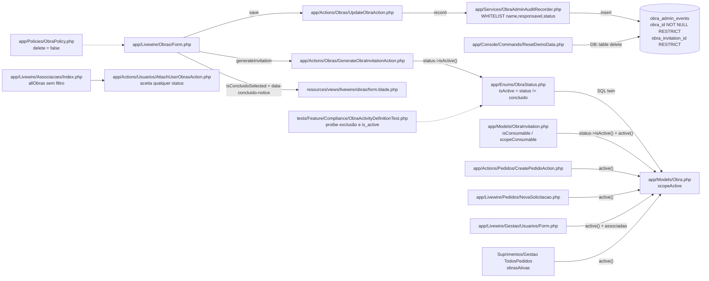
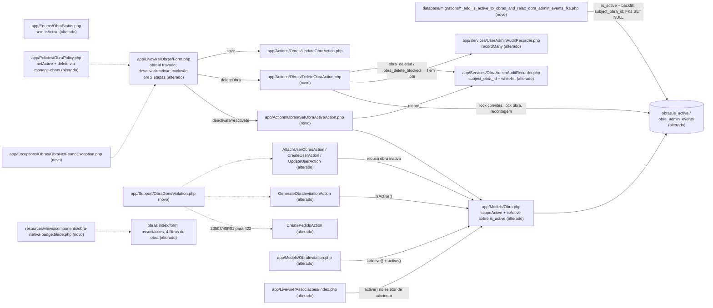

# Implementation Plan

## Request Summary
- Objective: decouple "obra ativa" from the lifecycle Status by introducing the independent column `obras.is_active` (one-time backfill `status <> 'concluido'`), add Desativar/Reativar and a safe, dependency-blocked physical Excluir for Gestão and Suprimentos, keep every obra/convite audit row alive across deletions (`obra_admin_events` FKs → `SET NULL` + non-FK `subject_obra_id`), and narrow new pedidos, convites and associations to active obras.
- Scope:
  - In: SPEC §Scope In (RF-01..RF-26, UI-01..UI-07, CT-01..CT-05, RNF-01..RNF-06).
  - Out: SPEC §Scope Out — no cascade over pedidos/`pedido_events`/`internal_notifications`/`pedido_attachments`/files, no soft delete, no bulk ops, no revocation of pending convites on deactivation, no change to `Pedido::visibleTo`/`PedidoPolicy`, no lock for the deactivation-vs-pedido-creation race (D-4), no Status value/label change, no user deletion.
- Tier: complete
- Architecture references: `CLAUDE.md` (authoritative, hand-written), `AGENTS.md`, `docs/agents/architecture.md` (layer table, lines 45-56), `docs/agents/domain_rules.md`, `docs/agents/data_model.md`. `.ai/rules` does not exist in this repository (checked), so no project rule files apply.

Layering rules carried into every task (`docs/agents/architecture.md:50-53`, `CLAUDE.md` §5 layers 3-6):
- Livewire components re-authorize in `mount()`, call `$this->authorize()` before every Action, and never write to the database.
- Actions own the actor guard (`GuardsObraAdministration::ensureActorManagesObras`), PT-BR `ValidationException`s, the `DB::transaction` and the audit row.
- `ObraAdminAuditRecorder` / `UserAdminAuditRecorder` stay the single writers of their trails.
- No `DB::table('<audit table>')` outside `ResetDemoData` (`tests/Feature/Compliance/AuditTrailsAppendOnlyTest.php:113-128`).
- "Obra ativa" keeps exactly one definition (`Obra::scopeActive()` + `Obra::isActive()`).

## AS IS — Componentes impactados

Hoje a atividade é derivada do Status: `ObraStatus::isActive()` e `Obra::scopeActive()` tratam "Concluído" como inativa, e todos os consumidores leem essa única definição. Não existe caminho de exclusão (`ObraPolicy::delete` é sempre `false`, fixado pelo teste de conformidade), e `obra_admin_events` referencia `obras`/`obra_invitations` com RESTRICT.

## TO BE — Componentes propostos

Legenda:
- T01 cria a migration.
- T02 move a definição única para `is_active` (`Obra`, `ObraStatus`, factories, enum `ObraAdminAction`); T03 adapta os dois recorders.
- T04 troca os consumidores; T06 cria o suporte de concorrência (`ObraGoneViolation`, `ObraNotFoundException`).
- T08 altera a `ObraPolicy`. T09 e T10 criam `SetObraActiveAction` e `DeleteObraAction`.
- T11 restringe as associações; T12 traduz as corridas de FK em criação de pedido e de convite.
- T13 cria o selo "INATIVA" e o sufixo "(inativa)"; T14 reescreve o `Obras\Form`.

## Tasks

### T01 — Migration: `obras.is_active`, `subject_obra_id`, FKs `SET NULL`
- **Files**:
  - `database/migrations/<timestamp>_add_is_active_to_obras_and_relax_obra_admin_events_fks.php` (new, via `php artisan make:migration add_is_active_to_obras_and_relax_obra_admin_events_fks --no-interaction`; the filename must sort after `2026_10_01_184752_create_internal_notifications_table.php`)
  - `tests/Feature/Migrations/ObraActivityFlagMigrationTest.php` (new)
  - `tests/Feature/Migrations/ObraStatusMigrationTest.php`
  - `tests/Feature/MigrationSchemaTest.php`
- **Change**: `up()` wraps everything in a single `DB::transaction` of `DB::statement`s, in this order:
  1. Verify via `pg_constraint` that `obra_admin_events_obra_id_foreign` and `obra_admin_events_obra_invitation_id_foreign` exist. If not, throw a PT-BR `RuntimeException` before any write, so production never ends half-relaxed.
  2. `alter table obras add column is_active boolean not null default true`.
  3. `update obras set is_active = (status <> 'concluido')` (RF-01, one-time; this is the only place outside `Obra` allowed to read `status` for activity).
  4. `alter table obra_admin_events add column subject_obra_id bigint null` → `update obra_admin_events set subject_obra_id = obra_id` → `alter column subject_obra_id set not null` (no FK, RF-19).
  5. Drop `obra_admin_events_obra_id_foreign` → `alter column obra_id drop not null` → re-add it as `foreign key (obra_id) references obras(id) on delete set null`.
  6. Drop and re-add `obra_admin_events_obra_invitation_id_foreign` as `references obra_invitations(id) on delete set null`.

  `down()` (CT-01), also in one transaction:
  - first, if `exists (select 1 from obra_admin_events where obra_id is null)`, throw a PT-BR `RuntimeException` ("Rollback abortado: existem registros de auditoria de obras excluídas (obra_id nulo)…") with nothing written;
  - otherwise restore both FKs as RESTRICT, set `obra_id` back to NOT NULL, drop `subject_obra_id` and drop `obras.is_active`.

  Add a docblock in PT-BR in the style of `2026_09_23_040313` that documents:
  - the backfill semantics;
  - the deploy note: Railpack runs `migrate` on container start, so old containers inserting audit rows without `subject_obra_id` fail during the overlap;
  - the lossy `down()`.

  Fix `ObraStatusMigrationTest`: its `beforeEach` calls `2026_09_23_040313::down()`, which runs `add column is_active` and now collides with the new column. It must first `require` the new migration and call its `down()`. Update `MigrationSchemaTest.php:139-140`: `obras` now **contains** `is_active`. Add assertions for `subject_obra_id` and for the nullable `obra_id`.
- **Covers**: RF-01, RF-19 (schema), CT-01, RNF-05
- **Tests**: `tests/Feature/Migrations/ObraActivityFlagMigrationTest.php` loads the migration object and calls `down()`/`up()` directly, following the pattern of `ObraStatusMigrationTest`. Cases:
  - (a) one obra per status → `concluido` gets `false`, the others get `true`;
  - (b) pre-existing `obra_admin_events` rows keep `obra_id` and get `subject_obra_id = obra_id`;
  - (c) `pg_constraint.confdeltype = 'n'` for both FKs and `obra_id` is nullable;
  - (d) `down()` with a row whose `obra_id` is null throws and changes nothing;
  - (e) a `down()`→`up()` round-trip leaves the schema identical;
  - (f) a newly inserted obra defaults to `is_active = true`.
- **Risk**: High — production DDL on go-live day, auto-run by Railpack on container start; FK names must match.
- **Dependencies**: none

### T02 — Single activity definition on `is_active` (model, enum, factories)
- **Files**:
  - `app/Models/Obra.php`
  - `app/Enums/ObraStatus.php`
  - `app/Enums/ObraAdminAction.php`
  - `app/Models/ObraAdminEvent.php`
  - `database/factories/ObraFactory.php`
  - `database/factories/ObraAdminEventFactory.php`
  - `tests/Unit/Models/ObraStatusTest.php`
  - `tests/Unit/Enums/SlugEnumsTest.php`
  - `tests/Unit/Models/ObraAdminEventImmutabilityTest.php`
- **Change**:
  - **`Obra`**:
    - add `is_active` to `#[Fillable]` and to the casts (`boolean`);
    - add `public function isActive(): bool { return (bool) $this->is_active; }`;
    - rewrite `scopeActive` as `where('is_active', true)` (RF-03);
    - add `public function filterOptionLabel(): string` (`name` + `' (inativa)'` when inactive), the single source of the UI-07 suffix;
    - rewrite the docblocks so they state the single definition.
  - **`ObraStatus`**: delete `isActive()` and fix the class docblock (Status is descriptive only).
  - **`ObraAdminAction`**: add `ObraDeactivated = 'obra_deactivated'`, `ObraReactivated = 'obra_reactivated'`, `ObraDeleted = 'obra_deleted'` and `ObraDeleteBlocked = 'obra_delete_blocked'`, for exactly 9 cases (RF-23).
  - **`ObraAdminEvent`**: add `subject_obra_id` to `#[Fillable]`. Add a `creating` hook that sets `subject_obra_id ??= obra_id`. This is defense in depth: tests and fixtures that create rows directly, such as `ResetDemoDataAuditTrailsTest.php:186`, keep working. The recorder still writes the column explicitly (T03). Update the docblock (FKs are now SET NULL).
  - **`ObraFactory`**: add `inactive()` (`is_active => false`), set `is_active => true` in `definition()`, and keep `concluida()` status-only.
  - **`ObraAdminEventFactory`**: add `subject_obra_id` derived from the resolved `obra_id`.
- **Covers**: RF-03 (definition), RF-23, RF-19 (model side)
- **Tests**:
  - `ObraStatusTest`: `ObraStatus` has no `isActive` method (`method_exists` false).
  - `SlugEnumsTest`: `ObraAdminAction::cases()` slugs equal the 9-item set.
  - `ObraAdminEventImmutabilityTest`: a direct create without `subject_obra_id` gets `subject_obra_id = obra_id`; the existing immutability cases stay green.
- **Risk**: High — switches the meaning of `active()` for every consumer; dozens of fixtures relied on `concluida()` = inactive (handled in T07).
- **Dependencies**: T01

### T03 — Audit recorders: `subject_obra_id`, whitelist, batched user audit
- **Files**:
  - `app/Services/ObraAdminAuditRecorder.php`
  - `app/Services/UserAdminAuditRecorder.php`
  - `tests/Feature/Services/ObraAdminAuditRecorderTest.php`
  - `tests/Feature/Services/UserAdminAuditRecorderBatchTest.php` (new)
- **Change**:
  - **`ObraAdminAuditRecorder`**:
    - `WHITELIST` becomes exactly `['name', 'responsavel', 'status', 'id', 'is_active', 'pedidos_count', 'used_invitations_count']` (CT-02);
    - `record()` writes `'subject_obra_id' => $obra->getKey()` on every insert;
    - add `deletionSnapshot(Obra $obra): array{id:int,name:string,responsavel:?string,status:string,is_active:bool}`, which uses `$obra->isActive()` and never reads the column directly;
    - `snapshot()` stays the 3-key projection used by `obra_updated`.
  - **`UserAdminAuditRecorder`**: add `recordMany(User $actor, UserAdminAction $action, array $rows): int`, with `$rows` as `list<array{target_id:int, before:array|null, after:array|null}>`.
    - It whitelist-checks each payload exactly like `record()`.
    - It writes all rows with **one** `UserAdminEvent::query()->insert([...])`, with `before`/`after` JSON-encoded, `created_at` set to the DB default or `now()`, and no `DB::table` (`AuditTrailsAppendOnlyTest.php:113`).
    - An empty `$rows` performs no query.
    - The transaction stays the caller's responsibility (RNF-03, CT-03).
- **Covers**: CT-02, CT-03, RF-19 (writer side), RF-20/RF-21 (payload shape), RNF-03 (batch primitive)
- **Tests**:
  - `ObraAdminAuditRecorderTest`:
    - every action writes `subject_obra_id`;
    - `id`/`is_active`/`pedidos_count`/`used_invitations_count` are accepted;
    - an unknown key such as `token_hash` still throws `LogicException`.
  - `UserAdminAuditRecorderBatchTest`:
    - 50 rows → exactly 1 INSERT statement (`DB::listen`) and 50 rows with the correct JSON payloads;
    - a non-whitelisted key throws before any query.
- **Risk**: Medium — every existing obra audit write path passes through here.
- **Dependencies**: T01, T02

### T04 — Activity consumers switched to `Obra::isActive()` / `active()`; Concluído notice removed
- **Files**:
  - `app/Actions/Obras/GenerateObraInvitationAction.php`
  - `app/Models/ObraInvitation.php`
  - `app/Livewire/Obras/Form.php`
  - `resources/views/livewire/obras/form.blade.php`
  - `resources/views/components/active-obras-filter.blade.php`
  - `app/Actions/Obras/UpdateObraAction.php` (docblock)
  - `app/Actions/Pedidos/CreatePedidoAction.php` (docblock only)
  - `app/Livewire/Suprimentos/TodosPedidos.php` and `app/Livewire/Gestao/TodosPedidos.php` (docblocks)
  - `app/Exceptions/ObraInvitations/ObraInvitationUnavailableException.php` (docblock)
  - `app/Providers/AppServiceProvider.php` (docblock line ~46)
  - Tests: `tests/Feature/Actions/Obras/GenerateObraInvitationActionTest.php`, `tests/Unit/Models/ObraInvitationStateTest.php`, `tests/Feature/Livewire/ObrasFormTest.php`, `tests/Feature/Livewire/ObraConvitesSectionTest.php`, `tests/Feature/Actions/Obras/UpdateObraActionTest.php`
- **Change**:
  - **`GenerateObraInvitationAction`**: replace `$obra->status->isActive()` with `$obra->isActive()`. The message becomes exactly "Não é possível gerar convite para uma obra inativa." on key `obra` (RF-11).
  - **`ObraInvitation::isConsumable()`**: change to `$this->obra->isActive()`. `scopeConsumable` keeps `whereHas('obra', active())`, so it now reads `is_active`.
  - **`Obras\Form`**: `canGenerateInvitation` becomes `$this->obra?->isActive()`. Remove `isConcluidoSelected()`, the `ObraStatus::Concluido` reference and the `isConcluidoSelected` view variable.
  - **`form.blade.php`**: delete the `data-concluido-notice` block (UI-05).
  - **`active-obras-filter.blade.php`**: the help text becomes "Oculta pedidos de obras inativas; pedidos \"Outra\" (sem obra) continuam listados." (RF-13 semantics).
  - **`UpdateObraAction`**: no behavior change; its update payload already excludes `is_active` (RF-02).
  - Fix every docblock that equates Concluído with inactivity.
- **Covers**: RF-02 (status side), RF-03 (consumers), RF-04 (convite part), RF-11, RF-13, UI-05
- **Tests**:
  - Generate on an `inactive()` obra → 422 with the new text.
  - Generate on a `concluida()` + active obra → succeeds.
  - `isConsumable()` is false for a pending convite of an inactive obra and true again after `is_active` flips back.
  - The form rendered with Status `concluido` contains neither `data-concluido-notice` nor "Obras concluídas deixam".
  - The form shows "Gerar convite" for a Concluído + active obra and hides it for an inactive obra.
  - Updating a Concluído + active obra's status to `em_andamento` leaves `is_active` unchanged.
- **Risk**: Medium — removes a public method used by `ObraActivityDefinitionTest` (rewritten in T05).
- **Dependencies**: T02

### T05 — Compliance test rewrite: single activity definition (RF-03)
- **Files**: `tests/Feature/Compliance/ObraActivityDefinitionTest.php`
- **Change**: rewrite the RF-03 half of the file and leave the RF-06 deletion tests untouched until T08.
  1. Replace "no code reads is_active in an obra context". The new test fails if an obra-context `is_active` statement in `app/`/`database/` lives outside this allowlist:
     - `app/Models/Obra.php`;
     - `app/Actions/Obras/SetObraActiveAction.php` (created in T09; allowlisting a missing file is harmless);
     - `database/factories/ObraFactory.php`;
     - the new T01 migration.

     Keep the scanner self-check.
  2. `ObraStatus::Concluido` / `'concluido'` may be referenced in `app/` only by `app/Enums/ObraStatus.php` (case + label), never in a comparison deciding activity. `database/` allows `ObraFactory.php` and the T01 migration backfill (RF-03 b).
  3. `ObraStatus` has no `isActive` method (RF-03 a).
  4. For each status × `is_active` ∈ {true,false}, `Obra::query()->active()` returns exactly the rows with `is_active = true` (RF-03 c), and `Obra::isActive()` agrees row by row.
  5. Keep "consumers delegate to `->active()`" for `NovaSolicitacao` and `CreatePedidoAction`, and add `GenerateObraInvitationAction` and `ObraInvitation` (they must call `isActive()`/`active()` and never `ObraStatus`).
- **Covers**: RF-03
- **Tests**: the file itself, run with `php artisan test --compact tests/Feature/Compliance/ObraActivityDefinitionTest.php`.
- **Risk**: Medium — a weakened scanner would let a second definition creep in; keep the self-check probe.
- **Dependencies**: T02, T04

### T06 — Concurrency support: `ObraGoneViolation` + `ObraNotFoundException`
- **Files**:
  - `app/Support/ObraGoneViolation.php` (new)
  - `app/Exceptions/Obras/ObraNotFoundException.php` (new)
  - `tests/Unit/Support/ObraGoneViolationTest.php` (new)
- **Change**:
  - **`ObraGoneViolation`** is a `final` class with `public const MESSAGE = 'A obra informada não foi encontrada.'` and `public static function matches(QueryException $e, array $constraintNames): bool`. It returns true when:
    - SQLSTATE `23503` and the driver message names one of the given FK constraints (`pedidos_obra_id_foreign`, `obra_invitations_obra_id_foreign`, `obra_profile_obra_id_foreign`, `obra_admin_events_obra_id_foreign`), so unrelated FK bugs are never masked as "obra não encontrada"; or
    - SQLSTATE `40P01` (deadlock, D-1).

    Add `public static function exception(string $field): ValidationException` for the 422 with that message on `$field`.
  - **`ObraNotFoundException`** extends `RuntimeException` with the same PT-BR message. It is thrown by `SetObraActiveAction`/`DeleteObraAction` when the locked re-read of the obra returns null, and caught by `Obras\Form` (T14). Follow the existing pattern of `app/Exceptions/Pedidos/` and `app/Exceptions/ObraInvitations/`, with PHPDoc.
- **Covers**: RNF-01 (infrastructure)
- **Tests**: `ObraGoneViolationTest`:
  - `23503` naming a listed constraint → true;
  - `23503` naming an unrelated FK (e.g. `pedidos_status_id_foreign`) → false;
  - `40P01` → true;
  - any other SQLSTATE → false.

  `QueryException` is built from a `PDOException` with `errorInfo`.
- **Risk**: Low
- **Dependencies**: none

### T07 — Test fixture sweep: `concluida()`-as-inactive → `inactive()`; RF-04 coverage
- **Files**:
  - `tests/Feature/Actions/CreatePedidoActionTest.php`
  - `tests/Feature/Actions/CreatePedidoAttachmentsTest.php`
  - `tests/Feature/Actions/Obras/AcceptObraInvitationActionTest.php`
  - `tests/Feature/Actions/Obras/RevokeObraInvitationActionTest.php`
  - `tests/Feature/Actions/Usuarios/AttachUserObrasActionTest.php`
  - `tests/Feature/Authorization/BypassUiAuthorizationTest.php`
  - `tests/Feature/Authorization/PedidoVisibleToScopeTest.php`
  - `tests/Feature/Compliance/NavigationListingComplianceTest.php`
  - `tests/Feature/Livewire/AcompanhamentoSolicitadoTest.php`
  - `tests/Feature/Livewire/AcompanhamentoTest.php`
  - `tests/Feature/Livewire/AssociacoesIndexTest.php`
  - `tests/Feature/Livewire/GestaoListingBehaviourTest.php`
  - `tests/Feature/Livewire/NovaSolicitacaoTest.php`
  - `tests/Feature/Livewire/ObraInativaPreservaHistoricoTest.php`
  - `tests/Feature/Livewire/ObraInvitationPageTest.php`
  - `tests/Feature/Livewire/ObrasIndexTest.php`
  - `tests/Feature/Livewire/SuprimentosListingBehaviourTest.php`
  - `tests/Feature/Livewire/TodosPedidosFiltersTest.php`
  - `tests/Feature/Performance/QueryCountTest.php`
  - `tests/Feature/Security/Adversarial/CrossObraTest.php`
  - `tests/Feature/Security/Adversarial/GestaoCreatedPedidoTest.php`
  - `tests/Feature/Security/Adversarial/ObrasAuthorizationTest.php`
  - `tests/Feature/Seeders/DemoSeederIdempotencyTest.php`
  - `tests/Feature/Actions/Obras/ConcluidaAtivaObraTest.php` (new)
- **Change**: in each listed file, read every `concluida()` / `ObraStatus::Concluido` / `'concluido'` usage.
  - Where the test means "obra that no longer receives pedidos/convites/filter", switch it to `->inactive()` (or `['is_active' => false]`) and update the test names and PT-BR comments. Examples: rejection in Nova Solicitação/CreatePedido, non-consumable convite, "Somente obras ativas", demo Suprimentos association.
  - Where the test is about the Status label or value itself, keep `concluida()`.
  - Do not change assertions about message texts already equal to the SPEC (RF-10's message is unchanged). `tests/Feature/Design/ThemeTokensTest.php` refers to the `concluido` colour token and is out of scope.

  The new `ConcluidaAtivaObraTest` checks RF-04 end-to-end on a `concluida()` + active obra:
  - `CreatePedidoAction` creates a pedido;
  - `GenerateObraInvitationAction` + `AcceptObraInvitationAction::acceptAsExistingAccount` succeed;
  - `AttachUserObrasAction` attaches it.

  It also checks RF-13 against the database: with `obrasAtivas=1` on Suprimentos `TodosPedidos`, a pedido of an inactive + `em_andamento` obra is excluded, a pedido of an active + `concluido` obra is included, and an "Outra" pedido is included.
- **Covers**: RF-04, RF-10, RF-11 (consumption), RF-13
- **Tests**: `php artisan test --compact --testsuite=Feature` green (one Pest process at a time on the 5434 DB).
- **Risk**: Medium — broad edit; a misread fixture could silently weaken an inactive-obra assertion. Every test that asserted a refusal for "concluída" must still assert a refusal (now for `inactive()`).
- **Dependencies**: T02, T04

### T08 — `ObraPolicy::setActive` / `delete` + compliance deletion rule (RF-26)
- **Files**:
  - `app/Policies/ObraPolicy.php`
  - `tests/Feature/Authorization/ObraPolicyTest.php`
  - `tests/Feature/Compliance/ObraActivityDefinitionTest.php` (RF-06 tests only)
- **Change**:
  - **`ObraPolicy`**: add `setActive(User $actor, Obra $obra): bool`, and change `delete` to return `$this->managesObras($actor)` (RF-24). Update the class docblock (RF-06 superseded).
  - **Compliance test**: replace the two RF-06 tests with RF-26:
    - a statement deleting an `obras` row may appear only in `app/Actions/Obras/DeleteObraAction.php` and `app/Console/Commands/ResetDemoData.php`, and the test must fail when a second file gains one;
    - public methods of `app/Livewire/Obras/*` matching `/delete|destroy|excluir|apagar/i` must be in the allowlist `confirmDelete`, `cancelDelete`, `deleteObra`;
    - no `obras` route uses HTTP `DELETE` or has a destroy/delete/excluir name;
    - the only Action file matching `/^(Delete|Destroy|Remove|Excluir)Obra/` is `DeleteObraAction.php`;
    - `can('delete', $obra)` is true for `gestao`/`suprimentos` and false for `obra`.
- **Covers**: RF-24, RF-26, RF-09 (policy layer)
- **Tests**: `ObraPolicyTest` — `setActive` and `delete` are true for `gestao`/`suprimentos` and false for `obra` and for a user with an unknown role. Run the compliance file.
- **Risk**: Medium — opens the first deletion permission in the system.
- **Dependencies**: T05

### T09 — `SetObraActiveAction` (Desativar/Reativar)
- **Files**:
  - `app/Actions/Obras/SetObraActiveAction.php` (new, via `php artisan make:class`)
  - `tests/Feature/Actions/Obras/SetObraActiveActionTest.php` (new)
- **Change**: `execute(User $actor, Obra $obra, bool $active): Obra` mirrors `App\Actions\Usuarios\SetUserActiveAction` and uses `GuardsObraAdministration`.
  1. Call `ensureActorManagesObras` first (RF-09).
  2. Open a `DB::transaction` and re-read with `Obra::query()->lockForUpdate()->find($obra->getKey())`. A null result throws `ObraNotFoundException` (T06, RNF-01).
  3. If `isActive() === $active`, return without writing (RF-07).
  4. Otherwise run `update(['is_active' => $active])`, which changes only `is_active` + `updated_at` (RF-02, RF-06).
  5. Record one audit through `ObraAdminAuditRecorder`: `ObraDeactivated` with `{is_active:true}`→`{is_active:false}`, or `ObraReactivated` with the inverse (RF-08, CT-02).
  6. Return the fresh model.

  Never touch convites, associations or pedidos (Scope Out). Add a PHPDoc describing the rules.
- **Covers**: RF-02, RF-05, RF-06, RF-07, RF-08, RF-09 (Action layer), RNF-02, CT-02
- **Tests**: `SetObraActiveActionTest`:
  - deactivate/reactivate as `gestao` and as `suprimentos` (RF-05);
  - `status` is unchanged (RF-02);
  - row snapshots of `pedidos`, `pedido_events`, `internal_notifications`, `pedido_attachments`, `obra_profile`, `obra_invitations` and `user_admin_events` are identical, and `obra_admin_events` gains exactly 1 row (RF-06);
  - a no-op in both directions leaves the audit count unchanged (RF-07);
  - the payload matches CT-02 and `subject_obra_id` is set;
  - a failure injected after the update (recorder bound to a throwing fake) rolls back, so `is_active` is unchanged and there is no audit row (RF-08, RNF-02);
  - an `obra` actor gets `AuthorizationException` with nothing written (RF-09);
  - an obra deleted before the call throws `ObraNotFoundException`.
- **Risk**: Low
- **Dependencies**: T02, T03, T06

### T10 — `DeleteObraAction` (safe physical deletion)
- **Files**:
  - `app/Actions/Obras/DeleteObraAction.php` (new, via `php artisan make:class`)
  - `tests/Feature/Actions/Obras/DeleteObraActionTest.php` (new)
  - `tests/Feature/Security/Adversarial/ObraDeletionRaceTest.php` (new)
- **Change**: `execute(User $actor, Obra $obra): void`.
  1. Call `ensureActorManagesObras` (RF-09).
  2. `$outcome = DB::transaction(function () { … })`. Inside the transaction:
     - lock the convites first with `ObraInvitation::query()->where('obra_id', $id)->lockForUpdate()->get(['id', 'used_at'])`, then the obra with `Obra::query()->lockForUpdate()->find($id)` (RF-14, RNF-01 lock order). A null obra throws `ObraNotFoundException`;
     - count `Pedido::query()->where('obra_id', $id)->count()` (any `is_demo`, any status) and the used convites from the locked rows (RF-15);
     - if either count is > 0, return a blocked result with the name, P and C. Nothing has been written, and the closure commits only the locks;
     - otherwise read the affected users' complete obra lists in one query (`obra_profile` rows of every user associated to `$id`) and build sorted `before`/`after` `obra_ids` per user in PHP;
     - delete the non-used convites with `ObraInvitation::query()->where('obra_id', $id)->whereNull('used_at')->delete()` (RF-17). This is an Eloquent builder delete; never touch `account_registration_events`;
     - record `ObraDeleted` with `before = $recorder->deletionSnapshot($obra)`, `after = null` and `subject_obra_id` = id. This happens while the obra still exists (RF-20);
     - call `$obra->delete()`. `obra_profile` cascades, and the `obra_admin_events.obra_id`/`obra_invitation_id` FKs become NULL in the database (RF-18, RF-19);
     - call `UserAdminAuditRecorder::recordMany($actor, ObraAccessChanged, $rows)`: one INSERT, one row per affected user (RF-18, RNF-03, CT-03).
  3. Blocked outcome:
     - in a **separate** `DB::transaction`, record `ObraDeleteBlocked` with `before = null` and `after = {pedidos_count: P, used_invitations_count: C}` (RF-21);
     - then throw `ValidationException::withMessages(['excluir' => sprintf('Não é possível excluir a obra «%s»: ela possui %d pedido(s) e %d convite(s) utilizado(s). Desative a obra para impedir novos usos.', …)])` (RF-16, exact text).

  Never touch `pedidos`, `pedido_events`, `internal_notifications`, `pedido_attachments` or the `pedido_anexos` disk (RF-22). A deadlock (`40P01`) raised inside the deletion transaction is translated to 422 `excluir` with the exact text "Não foi possível excluir a obra agora porque ela foi alterada ao mesmo tempo por outra operação. Tente novamente." (Q-02); nothing is written. Add a PHPDoc with the full rule list.
- **Covers**: RF-09 (Action), RF-14, RF-15, RF-16, RF-17, RF-18, RF-19, RF-20, RF-21, RF-22, RNF-01 (deletion side), RNF-02, RNF-03, CT-02, CT-03, CT-05 (`excluir`)
- **Tests**:
  - **`DeleteObraActionTest`**:
    - success removes the row (RF-14);
    - 1 pedido, or 1 used convite → nothing changes in `obras`, `obra_invitations`, `obra_profile`, the earlier audit rows and `user_admin_events`, with exactly 1 `obra_delete_blocked` row (RF-15, RF-21);
    - 2 pedidos / 0 used convites → the exact RF-16 text;
    - 1 pending, 1 expired and 1 revoked convite are deleted, and the `account_registration_events` count is unchanged (RF-17);
    - 2 associated users → 2 `obra_access_changed` rows with the correct before/after lists (RF-18);
    - prior `obra_created`/`obra_updated`/`invitation_created`/`invitation_revoked` rows survive with `obra_id IS NULL`, `subject_obra_id` = id and `obra_invitation_id IS NULL` (RF-19);
    - `obra_deleted` holds the 5-key snapshot with `subject_obra_id = before.id` (RF-20);
    - counts of the 4 pedido tables and `Storage::disk('pedido_anexos')->allFiles()` are identical before and after both a success and a blocked attempt (RF-22);
    - an exception injected after the `obra_deleted` insert (recorder `recordMany` bound to a throwing fake) leaves `obras`, `obra_invitations`, `obra_profile`, `obra_admin_events` and `user_admin_events` unchanged (RNF-02);
    - the `DB::listen` count is ≤ 15 for N = 1 and N = 50 users and convites, both blocked and successful (RNF-03);
    - an `obra` actor gets `AuthorizationException` (RF-09).
  - **`ObraDeletionRaceTest`**:
    - a pedido committed between the UI confirmation and Action execution (created after the component loads, before `execute`) turns the deletion into the RF-16 block (RF-14 AC);
    - a second `execute` on an already-deleted obra throws `ObraNotFoundException`, with no second `obra_deleted` row.
- **Risk**: High — irreversible physical deletion; correctness hinges on lock order, recount and the separate blocked-audit commit.
- **Dependencies**: T02, T03, T06

### T11 — Associations restricted to active obras (+ FK race translation)
- **Files**:
  - `app/Actions/Usuarios/AttachUserObrasAction.php`
  - `app/Actions/Usuarios/CreateUserAction.php`
  - `app/Actions/Usuarios/UpdateUserAction.php`
  - `app/Livewire/Associacoes/Index.php`
  - `tests/Feature/Actions/Usuarios/AttachUserObrasActionTest.php`
  - `tests/Feature/Actions/Usuarios/CreateUserActionTest.php`
  - `tests/Feature/Actions/Usuarios/UpdateUserActionTest.php`
  - `tests/Feature/Livewire/UsuariosFormTest.php`
- **Change**:
  - **`AttachUserObrasAction`**: after the duplicate and already-associated checks, reject the first inactive obra in the input (by name) with 422 `obra_ids` "A obra «<nome>» está inativa e não aceita novas associações." (RF-12). Rewrite the docblock: NC-07 is narrowed. Inside `catch`, a `QueryException` matching `ObraGoneViolation` (`obra_profile_obra_id_foreign`, or `40P01`) becomes `ObraGoneViolation::exception('obra_ids')` (RNF-01). The existing `UniqueConstraintViolationException` branch stays first.
  - **`CreateUserAction`**: any inactive id in `obra_ids` → the same 422.
  - **`UpdateUserAction`**: inactive ids **not already** in the target's current `obra_profile` → the same 422. Already-associated inactive obras are kept by `sync` (RF-12). Both Actions translate an `ObraGoneViolation` match on `obra_profile_obra_id_foreign` to 422 `obra_ids`.
  - **`Associacoes\Index`**: `allObras()` (the source of the "Adicionar obras" multi-select) becomes `Obra::query()->active()->orderBy('name')->orderBy('id')->get()`. The current-association list keeps reading `$user->obras` unfiltered, and Remover stays available for inactive obras (UI-06, RF-12).
  - `Gestao\Usuarios\Form::obras()` already lists active obras plus those already associated; no change, only test coverage.
- **Covers**: RF-12, UI-06 (associações + formulário de usuários), RNF-01 (association attach), CT-05 (`obra_ids`)
- **Tests**:
  - Attaching an inactive obra → 422 with the exact text, and no `obra_profile` or `user_admin_events` row is written.
  - Detaching an inactive obra succeeds.
  - `UpdateUserAction` keeps an already-associated inactive obra on save and rejects a newly added one.
  - `CreateUserAction` rejects an inactive id.
  - `UsuariosFormTest`: an inactive obra is absent from the list for an unassociated user and present for an associated one.
  - An injected `QueryException` 23503 on `obra_profile_obra_id_foreign` during attach → 422 "A obra informada não foi encontrada." with no partial rows.
- **Risk**: Medium — touches the user-administration Actions shared with Gestão.
- **Dependencies**: T02, T06, T07

### T12 — Pedido creation and convite generation translate obra-gone races to 422
- **Files**:
  - `app/Actions/Pedidos/CreatePedidoAction.php`
  - `app/Actions/Obras/GenerateObraInvitationAction.php`
  - `tests/Feature/Security/Adversarial/ObraGoneWriteRaceTest.php` (new)
- **Change**:
  - **`CreatePedidoAction::execute`**: keep the existing `catch (Throwable)` that deletes stored files. Before rethrowing, a `QueryException` matching `ObraGoneViolation::matches($e, ['pedidos_obra_id_foreign'])` (or `40P01`) becomes `ObraGoneViolation::exception('obra_id')`. The code consumed by `nextval` is acceptable: there is no rollback of sequences.
  - **`GenerateObraInvitationAction`**: catch outside the transaction. A match on `obra_invitations_obra_id_foreign` / `obra_admin_events_obra_id_foreign` / `40P01` becomes `ObraGoneViolation::exception('obra')`. The plaintext token is never placed in the exception or its context (RF-38 of the prior feature).
  - The race of convite **acceptance** with deletion already ends in `ObraInvitationUnavailableException` → `/convite/indisponivel`, because the UPDATE on `consumable()` affects 0 rows once the convite is deleted. Cover it with a test; no code change.
- **Covers**: RNF-01 (pedido creation, convite generation/acceptance), CT-05 (`obra_id`, `obra`)
- **Tests**: `ObraGoneWriteRaceTest`. Each case simulates the obra being deleted after the pre-checks.
  - **Pedido**: a `Pedido::creating` listener deletes the obra row with `DB::table('obras')`, after deleting its convites; the test may use `DB::table` freely. → 422 `obra_id` "A obra informada não foi encontrada.", with no pedido, event, attachment row or file left.
  - **Convite**: a listener on `ObraInvitation::creating` → 422 `obra`, with no convite or audit row.
  - **`40P01` injection**: a listener throwing a `QueryException` with SQLSTATE `40P01` → the same 422 in both Actions.
  - **Acceptance**: after `DeleteObraAction` removes a pending convite, `acceptAsExistingAccount` throws `ObraInvitationUnavailableException` and the page redirects to `/convite/indisponivel`.
- **Risk**: Medium — `CreatePedidoAction` is the busiest write path; the matcher must stay constraint-specific.
- **Dependencies**: T04, T06, T10

### T13 — "INATIVA" badge and "(inativa)" filter labels
- **Files**:
  - `resources/views/components/obra-inativa-badge.blade.php` (new)
  - `resources/views/livewire/obras/index.blade.php`
  - `app/Livewire/Obras/Index.php` (docblock)
  - `resources/views/livewire/associacoes/index.blade.php`
  - `resources/views/livewire/obra/acompanhamento.blade.php`
  - `resources/views/livewire/suprimentos/todos-pedidos.blade.php`
  - `resources/views/livewire/gestao/todos-pedidos.blade.php`
  - `resources/views/livewire/gestao/dashboard.blade.php`
  - `tests/Feature/Livewire/ObraInativaLabelsTest.php` (new)
- **Change**:
  - **Badge component**: `@props(['obra'])` renders, only when `! $obra->isActive()`, `INATIVA`. The class stays literal (no interpolation, `CLAUDE.md` §8 "Classes Tailwind sempre literais"), and the text is the signal, not the colour.
  - **Badge placement**: use it next to the obra name in the `/obras` row (UI-01) and in the `/associacoes` current-association `<li>` (UI-07).
  - **Filter selects**: in the four obra-filter selects (Acompanhamento, Suprimentos/Gestão TodosPedidos, Gestão Dashboard), the option text becomes `{{ $obra->filterOptionLabel() }}` (UI-07). The option values and the queries feeding them are unchanged: the obras stay listed and selectable.
  - **`Obras\Index`**: the docblock drops "no delete control" and points to the form.
- **Covers**: UI-01 (list), UI-07
- **Tests**: `ObraInativaLabelsTest`:
  - an inactive obra row in `Obras\Index` shows "INATIVA" + `data-obra-inativa` and an active one does not;
  - `Associacoes\Index` shows "INATIVA" in a user's current associations;
  - the obra filter selects of `Obra\Acompanhamento`, `Suprimentos\TodosPedidos`, `Gestao\TodosPedidos` and `Gestao\Dashboard` render "<nome> (inativa)" for an inactive obra and the bare name for an active one.
  - Re-run `QueryCountTest` for the Obras and Associações listings: no extra queries, since `is_active` is already on the loaded models.
- **Risk**: Low
- **Dependencies**: T02, T11

### T14 — `Obras\Form`: Desativar/Reativar, two-step Excluir, blocked reason, not-found handling
- **Files**:
  - `app/Livewire/Obras/Form.php`
  - `resources/views/livewire/obras/form.blade.php`
  - `tests/Feature/Livewire/ObrasFormActivationDeletionTest.php` (new)
  - `tests/Feature/Livewire/ObrasFormTest.php`
  - `tests/Feature/Livewire/ObraConvitesSectionTest.php`
- **Change**:
  1. **Hydration safety (RNF-01, D-2)**:
     - replace the public `?Obra $obra` model property with `#[Locked] public ?int $obraId`, keeping `mount(?Obra $obra = null)` and the route binding;
     - add a private resolver `obra(): ?Obra` (`Obra::query()->find($this->obraId)`);
     - pass `obra` to the view from `render()`.

     Livewire's model synthesizer re-fetches with `firstOrFail()` on every request, so a concurrently deleted obra would surface as a 404. Every action method, including `save`, `generateInvitation` and `revokeInvitation`, must therefore resolve the obra, and when it is null (or when an Action throws `ObraNotFoundException`) run `session()->flash('status', 'A obra informada não foi encontrada.')` + `redirectRoute('obras.index')`.
  2. **Desativar/Reativar (UI-02)**: `deactivate(SetObraActiveAction $action)` / `reactivate(...)` call `authorize('setActive', $obra)`, then the Action. They set `#[Locked] public ?string $activityFeedback` to "Obra desativada." / "Obra reativada.", rendered as `role="status"` `alert-success`.
  3. **Two-step Excluir (UI-03)**:
     - `#[Locked] public bool $confirmingDelete`;
     - `confirmDelete()` sets it; nothing else is written;
     - `cancelDelete()` clears it;
     - `deleteObra(DeleteObraAction $action)` calls `authorize('delete', $obra)` and the Action, then flashes `"Obra «{$name}» excluída."` and runs `redirectRoute('obras.index')`.

     The dialog (`role="alertdialog"`, pattern of `revoke-confirm-dialog`) reads "Excluir definitivamente a obra «<nome>»? Esta ação não pode ser desfeita." with the buttons "Confirmar exclusão" (`btn-danger`) and "Cancelar".
  4. **Blocked deletion (UI-04)**: Livewire puts the Action's `ValidationException` into the error bag. Render `@error('excluir')` as `role="alert"`, plus a "Desativar obra" button (`wire:click="deactivate"`) in the same block while the obra is active, and reset `confirmingDelete`.
  5. **Badge (UI-01)**: show `<x-obra-inativa-badge>` next to the "Editar obra" heading.
  6. **Other actions**: clear `generatedLink` on every new action, as the existing ones do.
  7. **Convites of an inactive obra (Q-05)**: in the Convites table, a convite whose state is Pendente on an inactive obra is shown as "Pendente (obra inativa)". Presentation only; `ObraInvitation::state()` is unchanged. Test it in `ObraConvitesSectionTest`.

  Use stable `data-testid`s (`deactivate-obra`, `reactivate-obra`, `delete-obra`, `delete-confirm`, `delete-cancel`, `delete-blocked`). Component docblock: document the new flows.
- **Covers**: UI-01 (form), UI-02, UI-03, UI-04, RF-09 (component layer), RNF-01 (second deletion), CT-04
- **Tests**:
  - **`ObrasFormActivationDeletionTest`**:
    - "Desativar obra" flips to "INATIVA" + "Obra desativada."; "Reativar obra" removes the badge + "Obra reativada.";
    - `confirmDelete` alone deletes nothing, and `cancelDelete` restores the initial state;
    - `deleteObra` on an obra without dependencies → `assertRedirect(route('obras.index'))`, the flash `Obra «X» excluída.` and the row is gone;
    - on an active obra with pedidos → the RF-16 text with `role="alert"` + a "Desativar obra" button that deactivates when clicked;
    - the obra is deleted out of band after the component loads, then `deleteObra` → redirect to `/obras` with the flash "A obra informada não foi encontrada." and no 404/500;
    - an `obra` user calling `deactivate`/`deleteObra` on a mounted component → 403 (forged, via `Livewire::actingAs` swap).
  - **`ObrasFormTest`, `ObraConvitesSectionTest`**: adjust to the `obraId` property; they stay green.
- **Risk**: Medium — refactoring the bound model property touches convites code paths fixed by `ObraInvitationTokenLeakTest`, which must stay green.
- **Dependencies**: T04, T08, T09, T10, T13

### T15 — Authorization end-to-end for Desativar/Reativar/Excluir (RF-09)
- **Files**: `tests/Feature/Security/Adversarial/ObrasAuthorizationTest.php`
- **Change**: extend the adversarial matrix with:
  - an `obra` user → 403 on `GET /obras/{obra}/editar`;
  - an `obra` user calling `deactivate`/`reactivate`/`confirmDelete`/`deleteObra` on `Obras\Form` → 403;
  - direct `SetObraActiveAction`/`DeleteObraAction` calls with an `obra` actor and with an unknown-role user → `AuthorizationException`.

  In every case, `obras`, `obra_admin_events`, `obra_invitations` and `obra_profile` are unchanged.
- **Covers**: RF-09, CT-05 (403)
- **Tests**: the file itself.
- **Risk**: Low
- **Dependencies**: T09, T10, T14

### T16 — `demo:reset` with audit rows of deleted obras (RF-25)
- **Files**:
  - `app/Console/Commands/ResetDemoData.php` (docblock only, unless a test proves a change is needed)
  - `tests/Feature/Console/ResetDemoDataTest.php`
- **Change**:
  - The current `whereIn('obra_id', $demoObraIds) OR whereIn('actor_id', $demoUserIds) OR whereIn('obra_invitation_id', …)` already ignores `obra_id IS NULL` rows unless the actor is demo, so the expected outcome is that no logic change is needed.
  - Document in the docblock that audit rows of deleted obras (`obra_id` null) are removed only when their `actor_id` is a demo user.
  - Keep exactly one `DB::table('obra_admin_events')` in the file (`AuditTrailsAppendOnlyTest.php:107-110`).
- **Covers**: RF-25
- **Tests**: extend `ResetDemoDataTest`:
  - (a) a real obra deleted through `DeleteObraAction` by a real Gestão → its `obra_admin_events` rows (`obra_id` null) survive `demo:reset --force`;
  - (b) an obra deleted by a demo Gestão → its audit rows are removed and the command exits 0;
  - the existing cases stay green.
- **Risk**: Low
- **Dependencies**: T10

### T17 — Browser test: two-step deletion and Desativar
- **Files**: `tests/Browser/ObraDeletionFlowTest.php` (new)
- **Change**: as a Gestão user on `/obras/{obra}/editar`:
  - click "Excluir obra", see the confirmation text, click "Cancelar" → the obra is still present;
  - click "Excluir obra" → "Confirmar exclusão" on an obra without pedidos → land on `/obras` with "Obra «X» excluída.";
  - on an obra with a pedido → see the RF-16 message, then click "Desativar obra" → "INATIVA" is visible.

  Follow the gotchas in the memory notes: absolute URLs, wait for `wire:model`, redirect output to a file.
- **Covers**: UI-02, UI-03, UI-04
- **Tests**: `vendor/bin/pest tests/Browser/ObraDeletionFlowTest.php > <scratch>/browser.log 2>&1` (requires local Chromium).
- **Risk**: Low
- **Dependencies**: T14

### T18 — `CLAUDE.md` update, Pint, dependency check (RNF-04, RNF-06)
- **Files**: `CLAUDE.md`
- **Change**: rewrite every statement that equates activity with Status or forbids deletion:
  - §1 (summary of Gestão/Obras, if present);
  - §3 "Criação do pedido" (`obra Concluída → …` becomes `obra inativa (is_active = false) → …`);
  - §4 "Áreas compartilhadas" (Cadastro de obras: new Desativar/Reativar/Excluir; "Não há exclusão" removed; associations accept only active obras);
  - §5 layer 4 (`ObraPolicy::delete` sempre `false` → `setActive`/`delete` via `manage-obras`) and layer 6 (CreatePedidoAction "obra Concluída");
  - §5 Convite (the "obra Concluída" invalid cause → "obra inativa");
  - §6 table rows `obras` (add `is_active boolean NOT NULL DEFAULT true`, remove "`is_active` **não existe mais**") and `obra_admin_events` (if absent, add a row with `subject_obra_id`, nullable `obra_id` SET NULL and `obra_invitation_id` SET NULL);
  - §6 "Status da obra" (the single definition is now `Obra::scopeActive()`/`Obra::isActive()` over `is_active`; describe the new migration and its lossy, guarded `down()`);
  - §6 `demo:reset` (rows with null `obra_id`).

  Do **not** hand-edit `docs/agents/*.md` (generated). Run `vendor/bin/pint --dirty --format agent`, and confirm `git diff --stat composer.json composer.lock package.json package-lock.json` is empty.
- **Covers**: RNF-04, RNF-06
- **Tests**: `grep -n "status ≠ \`concluido\`\|is_active\` \*\*não existe mais\|ObraPolicy::delete\` sempre" CLAUDE.md` returns 0 lines. Pint reports no changes on a second run. Ask the developer to run the full suite with `php artisan test --compact`.
- **Risk**: Low
- **Dependencies**: T01–T17

## Execution Phases
| Phase | Tasks | Parallel-safe? |
|-------|-------|----------------|
| 1 — Fundação: schema, definição única e fixtures | T01, T02, T03, T04, T05, T06, T07 | Partially — T06 is independent. Order T01 → T02 → T03/T04 → T05/T07. No two tasks share a file, but the suite is green only at the end of the phase. |
| 2 — Actions de domínio e autorização | T08, T09, T10, T11, T12 | Partially — T08, T09, T10 and T11 are file-disjoint and parallel-safe; T12 runs after T10 (its acceptance-race test uses `DeleteObraAction`). |
| 3 — Interface | T13, T14 | No — T13 (badge component) before T14 (form uses it). |
| 4 — Endurecimento e documentação | T15, T16, T17, T18 | T15, T16 and T17 are parallel-safe; T18 is last. |

## Risks
| Risk | Blast radius | Mitigation | Rollback |
|------|-------------|------------|----------|
| Railpack runs `php artisan migrate` on container start, and during the zero-downtime overlap the **old** container is still serving. Old code inserting into `obra_admin_events` (create/edit obra, generate/revoke/accept convite) without `subject_obra_id` hits NOT NULL → HTTP 500 for those few seconds. | Obra/convite admin writes, seconds-long window | Deploy before go-live, with no admin activity during the deploy. Watch the deploy log for the migration `DONE` and the `/up` healthcheck. The `ObraAdminEvent::creating` hook (T02) only protects **new** code. | Retry the failed action after the deploy completes; no data is lost (the transaction rolled back). |
| Wrong FK constraint names in production would leave the RESTRICT FKs in place or fail the deploy. | Deploy of the whole release | T01 checks `pg_constraint` for both names and aborts in PT-BR before any write. A failed migration fails the container start, so Railway keeps the previous deployment. Optionally run a read-only `\d obra_admin_events` check via `railway ssh` beforehand. | Nothing to roll back: the migration is transactional. |
| Rolling the code back after an obra has been deleted: `down()` aborts while `obra_id IS NULL` rows exist, and the old code cannot write `obra_admin_events` while `subject_obra_id` is NOT NULL. | Release rollback | Prefer a forward fix. `pg_dump` the `obras`, `obra_admin_events`, `obra_invitations` and `obra_profile` tables before the deploy. | Before any deletion: `php artisan migrate:rollback --step=1` (via `railway ssh`), then redeploy the previous commit. After a deletion, only a forward fix or a manual restore from the dump. |
| Backfill semantics: every currently Concluído obra becomes inactive. After go-live, marking an obra Concluído no longer blocks pedidos or convites. | Operational behaviour | This is intended (D1). Communicate it to Gestão/Suprimentos and remove the old notice (UI-05). | Reactivate or deactivate per obra through the UI. |
| Physical deletion is irreversible. | One obra, its non-used convites and its associations | Deletion is blocked by any pedido or used convite. The UI has a two-step confirmation. Locks are taken on the convites, then the obra, with a recount. `obra_deleted` keeps a 5-key snapshot and `obra_access_changed` keeps the per-user lists, and the audit trail survives through `subject_obra_id`. | Recreate the obra by hand from the `obra_deleted` snapshot; re-associate the users from the `obra_access_changed` rows. |
| `Obras\Form` model-property rehydration would 404 on a deleted obra. | Form UX, RNF-01 D-2 | T14 replaces the property with a locked id + resolver, covered by an out-of-band deletion test. | Revert T14 (UI-only). |
| `ObraGoneViolation` masking unrelated FK errors as "obra não encontrada". | Silent misdiagnosis | It matches SQLSTATE **and** the specific constraint names, with a negative unit test (T06). | — |
| Deadlock between deletion and convite acceptance/generation. | Concurrent admin + convite flows | Lock order: convites first, then the obra (D-1). `40P01` on the racing writer → 422. | — |
| The fixture sweep (T07, ~23 files) weakens an assertion. | Test-suite trust | Rule: every test that asserted a refusal for "concluída" must assert a refusal for `inactive()`. Review the diff per file. | `git checkout` the file. |
| `CLAUDE.md` drift / `docs/agents/*.md` already have uncommitted changes in the working tree. | Agent context | T18 edits only `CLAUDE.md`. `/ai-context` regeneration is a developer step after merge. | — |

## Open Questions
Todas resolvidas pelo desenvolvedor em 2026-10-01 (seguem as recomendações apresentadas):
- **Q-01 — `UpdateObraAction` x exclusão concorrente:** aceito como está. A corrida de milissegundos ainda pode dar 500 (sem perda de dados); `UpdateObraAction` não muda.
- **Q-02 — deadlock dentro de `DeleteObraAction`:** traduzir. Um `40P01` na transação de exclusão vira 422 `excluir` com o texto "Não foi possível excluir a obra agora porque ela foi alterada ao mesmo tempo por outra operação. Tente novamente." (incorporado em T10).
- **Q-03 — aceite de convite x exclusão:** aceito. Terminar em `/convite/indisponivel` satisfaz RNF-01.
- **Q-04 — `Create/UpdateUserAction`:** manter a tradução da corrida de FK para 422 `obra_ids` (T11), mesmo além da lista literal da RNF-01.
- **Q-05 — convites pendentes de obra inativa:** exibir "Pendente (obra inativa)" na tabela de Convites, só na apresentação; `ObraInvitation::state()` não muda (incorporado em T14).
- **Q-06 — `/ai-context`:** passo manual do desenvolvedor depois da execução do ralph. As edições pendentes em `docs/agents/*.md` foram commitadas antes da execução.

## Assumptions
- **No contract artifacts.** The SPEC's `### Contracts` (CT-01..CT-05) are populated, but they describe a DB schema, audit payloads, Livewire component methods and error mappings. The app has no REST, gRPC or async interface (`CLAUDE.md` §2: no `routes/api.php`). So no `openapi.yaml`, `service.proto` or `asyncapi.yaml` was emitted. Each CT is enforced inline by the tasks that implement it (T01, T03, T09, T10, T14).
- **`Livewire/Gestao/Usuarios/Form::obras()`** already implements "active + already associated" (verified `app/Livewire/Gestao/Usuarios/Form.php:121-133`), so it needs tests only.
- **`CreatePedidoAction`** already emits the exact RF-10 message "A obra informada está inativa e não recebe novas solicitações." (verified `CreatePedidoAction.php:295-299`). Its behaviour changes only through `Obra::scopeActive()`.
- **`ResetDemoData`** already leaves `obra_id IS NULL` audit rows with real actors untouched, because `whereIn` never matches NULL (verified `ResetDemoData.php:115-120`). T16 is expected to be test + docblock only. [UNVERIFIED until T16 runs]
- **`ObraStatusMigrationTest`** will fail on the new schema unless it rolls back the new migration first, because the old migration's `down()` re-adds `obras.is_active` (verified `2026_09_23_040313:70`, test `beforeEach` at line 95). T01 owns that fix.
- **The FK constraint names in production** are the Laravel defaults `obra_admin_events_obra_id_foreign` / `obra_admin_events_obra_invitation_id_foreign`, as created by `foreignId()->constrained()` in `2026_09_23_042011`. [UNVERIFIED on the Railway database; T01 aborts safely if they differ.]
- **Badge styling.** The `badge`/`badge-neutral` classes exist in `resources/css/app.css:115-122` (verified). No new CSS or JS dependency is needed.
- **"Somente obras ativas" help text.** Changing it from "obras concluídas" to "obras inativas" is a necessary consequence of RF-13: the old text would be false. No test asserts the old text (verified by grep).
- **Inline flash on the form.** The success flashes "Obra desativada."/"Obra reativada." render on the form through a component property, because `Obras\Form` does not render `session('status')`. Flashes that end in a redirect use the existing `session('status')` alert of `obras/index.blade.php`.
- **PHP version.** Production runs PHP 8.4.25. No 8.5-only syntax is used (pipe operator, `clone with`, etc.).
