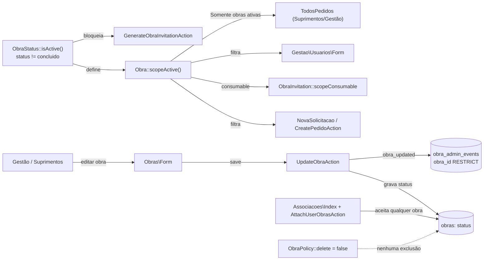
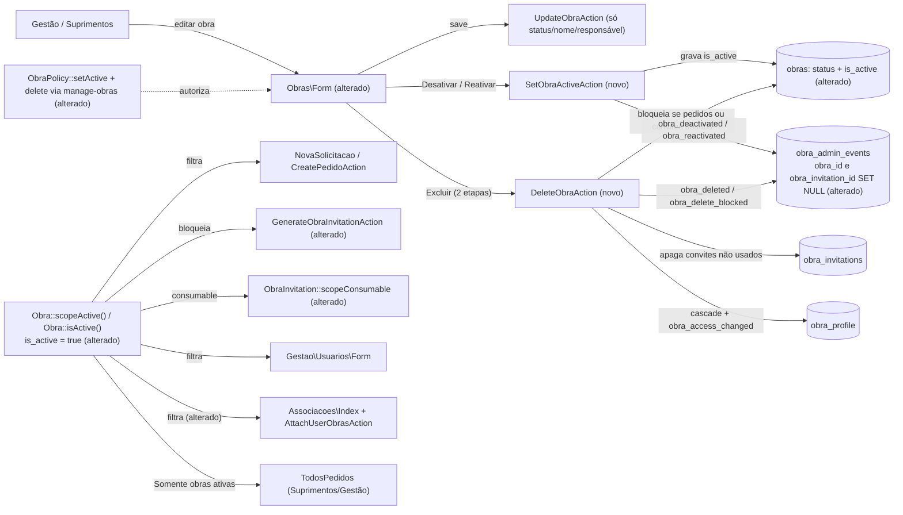

# SPEC: obras-ativacao-exclusao

## Metadata
- Source: developer description via /plan (confirmed input `.spec/features/obras-ativacao-exclusao/.handoff/confirmed-input.md`, decisions D1–D7)
- Service: sistema_obra_mc (Laravel 13 + Livewire 4 monolith, PostgreSQL, Railway)
- Tier: complete
- Version: 1.1
- Architecture references: `CLAUDE.md` (authoritative, hand-written), `AGENTS.md`, `docs/agents/architecture.md`, `docs/agents/domain_rules.md`, `docs/agents/data_model.md`
- Clarifications (resolved, v1.0 → v1.1; source `.handoff/clarifier-answers.md`):
  - Q-01 → option B: non-FK `obra_admin_events.subject_obra_id bigint NOT NULL`, backfilled, written on every insert; `obra_id` FK `ON DELETE SET NULL`; `obra_deleted` snapshot includes `id` (RF-19, RF-20, CT-01, CT-02, RNF-05).
  - D-1 → `DeleteObraAction` locks invitations before the obra; SQLSTATE `40P01` → 422 like `23503` (RF-14, RNF-01).
  - D-2 → second concurrent deletion: flash "A obra informada não foi encontrada." + redirect to `/obras`, no 404 (RNF-01).
  - D-3 → per-user `obra_access_changed` rows in one batched insert (RNF-03).
  - D-4 → deactivation vs. pedido creation race accepted, no lock (Scope Out).
  - D-5 → minimal INATIVA visibility in `/associacoes` and "(inativa)" suffix in obra-filter selects (UI-07, Scope).
- Supersedes: RF-03 (definition of "obra ativa") and RF-06 (no obra deletion) of `.spec/features/obras-associacoes-cadastro-convites/SPEC.md`; NC-07 of the same SPEC (associations accept obras in any status) is narrowed by RF-12.

### Architecture rules applied (cited)
- `docs/agents/architecture.md:52-53` — Livewire components re-authorize in `mount()` and call `authorize()` before an Action; they never write to the DB. Actions own actor guards, PT-BR validation, `DB::transaction` and one audit record per mutation. Every new write path here is an Action called from the `Obras\Form` component.
- `CLAUDE.md` §5 layers 3–5 — route gate (`can:manage-obras`), `mount()` re-check, Policy, and Action guard (`GuardsObraAdministration::ensureActorManagesObras`) are all mandatory. The UI is never the barrier.
- `CLAUDE.md` §6 "Status da obra" + `docs/agents/domain_rules.md:165` — "obra ativa" has one single definition, consumed by every reader and fixed by `tests/Feature/Compliance/ObraActivityDefinitionTest.php`. This SPEC moves that one definition to a new column. It does not add a second definition.
- `CLAUDE.md` §6 "`pedido_events` é append-only (e as outras 4 tabelas `*_events`)" — audit rows are never updated or deleted through Eloquent. The only post-insert change allowed here is the database's own `ON DELETE SET NULL` on FK columns (RF-19).

## Context
"Obra ativa" is currently derived from the lifecycle Status: active ⇔ `status ≠ concluido` (`ObraStatus::isActive()`, verified at `app/Enums/ObraStatus.php:24`; `Obra::scopeActive()`, verified at `app/Models/Obra.php:30-35`). So the business Status "Concluído" also switches off new pedidos, invitations and the "Somente obras ativas" filter. Gestão and Suprimentos cannot take an obra out of use without marking it Concluído, and no obra can ever be removed. `ObraPolicy::delete` always returns `false` (verified at `app/Policies/ObraPolicy.php:37`), and `ObraActivityDefinitionTest.php:219-265` forbids any deletion path (RF-06 of the prior feature).

The system goes live tomorrow. Before then, the developer wants:
1. an independent activity flag (`obras.is_active`), so Status becomes purely descriptive;
2. explicit Desativar/Reativar for Gestão and Suprimentos;
3. a safe physical Excluir that only works when it cannot destroy operational or account history.

Demo data is wiped separately by `php artisan demo:reset --force`, so no demo-specific deletion rule is needed.

Current consumers of the activity definition (verified by Grep):
- `CreatePedidoAction.php:127,295`
- `Livewire/Pedidos/NovaSolicitacao.php:140`
- `GenerateObraInvitationAction.php:43`
- `Livewire/Obras/Form.php:172,181`, plus the `data-concluido-notice` in `resources/views/livewire/obras/form.blade.php:31`
- `Models/ObraInvitation.php:83,97` (`isConsumable`, `scopeConsumable`)
- `Livewire/Gestao/Usuarios/Form.php:127`
- `Suprimentos/TodosPedidos.php:214`, `Gestao/TodosPedidos.php:207` ("Somente obras ativas")

`Associacoes\Index::allObras()` (`app/Livewire/Associacoes/Index.php:150-153`) and `AttachUserObrasAction` currently accept obras in any status.

FKs referencing `obras` and `obra_invitations` (verified in `database/migrations/`):

| FK | On delete |
|---|---|
| `pedidos.obra_id` | RESTRICT (nullable) |
| `obra_invitations.obra_id` | RESTRICT (`2026_09_23_042010:26`) |
| `obra_admin_events.obra_id` | RESTRICT, NOT NULL (`2026_09_23_042011:21`) |
| `obra_admin_events.obra_invitation_id` | RESTRICT (`:22`) |
| `account_registration_events.obra_invitation_id` | RESTRICT (`2026_09_23_042012:23`) |
| `obra_profile.obra_id` | CASCADE |

## AS IS — Estado atual

Hoje a atividade da obra é derivada do Status: "Concluído" é o único jeito de tirar uma obra de uso, e não há caminho de exclusão. Associações aceitam obras em qualquer status, e a auditoria de obras referencia `obras` com RESTRICT.

## TO BE — Estado proposto

A atividade passa a ser a coluna `obras.is_active`, independente do Status (RF-01..RF-04). Os consumidores leem só `Obra::scopeActive()`/`Obra::isActive()` (RF-03, RF-10..RF-13), e as associações passam a recusar obra inativa (RF-12). `SetObraActiveAction` realiza RF-05..RF-08 e UI-02. `DeleteObraAction` realiza RF-14..RF-22, UI-03 e UI-04, e a nova auditoria realiza RF-08, RF-20, RF-21, CT-02 e CT-03. As FKs alteradas de `obra_admin_events` realizam RF-19 e CT-01.

## Scope
- **In**:
  - New column `obras.is_active` with a one-time backfill, plus the move of the single "obra ativa" definition to it.
  - Desativar/Reativar Actions + UI.
  - Excluir obra Action + two-step UI, with dependency blocking and blocked-attempt audit.
  - FK changes on `obra_admin_events` (`obra_id` nullable + SET NULL; `obra_invitation_id` SET NULL) and the new non-FK `obra_admin_events.subject_obra_id` (RF-19).
  - Minimal "inativa" labeling in `/associacoes` and in the listing/dashboard obra-filter selects (UI-07), with no behavior change there.
  - Narrowing of associations (screen + Action + Gestão user form) to active obras.
  - Applying "inativa" in Nova Solicitação, CreatePedidoAction, invitation generation/consumption and the "Somente obras ativas" filter.
  - "INATIVA" badge on `/obras` list and form, and removal of the Concluído notice.
  - `ObraPolicy` abilities.
  - Rewrite of the compliance test `ObraActivityDefinitionTest.php` (both the activity definition and the deletion rule).
  - Keeping `demo:reset` working.
  - A planned task to update `CLAUDE.md` and to regenerate `docs/agents/*` via `/ai-context`.
- **Out**:
  - Deleting or cascading over pedidos, `pedido_events`, `internal_notifications`, `pedido_attachments` or files on disk.
  - Soft delete.
  - Bulk activation/deletion.
  - Revoking or rewriting pending invitations on deactivation. They only become non-consumable while the obra is inactive.
  - Any change to `Pedido::visibleTo`, `PedidoPolicy`, pedido visibility, or the behavior of the listing/dashboard obra-filter selects. They keep listing inactive obras; only the " (inativa)" label suffix of UI-07 is added.
  - Locking against a deactivation that races a pedido creation: a pedido may still be created on an obra deactivated concurrently. This is an accepted, documented behavior.
  - Changes to Status values or labels.
  - Demo-specific deletion rules.
  - User deletion.

## RIGID (Non-Negotiable)

### Functional Requirements

**Activity flag and single definition**

- RF-01 [Ubiquitous]: The `obras` table shall have a column `is_active boolean NOT NULL DEFAULT true`. The adding migration shall set, once, `is_active = (status <> 'concluido')` for every existing row, in the same transaction that adds the column.
  - AC: After `migrate` on a database that has one obra per status, the `concluido` obra has `is_active = false` and the `a_iniciar`/`em_andamento` obras have `is_active = true`. A newly created obra has `is_active = true`.
- RF-02 [Ubiquitous]: After the migration, Status and `is_active` shall be independent. Changing an obra's Status shall never change `is_active`, and changing `is_active` shall never change Status, nome or responsável.
  - AC: Updating a `concluido` + active obra's Status to `em_andamento` leaves `is_active` unchanged. Deactivating an `em_andamento` obra leaves `status = em_andamento`. Both are asserted by Feature tests.
- RF-03 [Ubiquitous]: The system shall have exactly one definition of "obra ativa": `is_active = true`. It shall be expressed only by `Obra::scopeActive()` (SQL) and an instance predicate `Obra::isActive()`, both reading only `is_active`. `ObraStatus::isActive()` (verified at `app/Enums/ObraStatus.php:24`) shall no longer exist, and no file in `app/` shall derive obra activity from `status`.
  - AC: `tests/Feature/Compliance/ObraActivityDefinitionTest.php` passes with assertions that:
    - (a) `ObraStatus` has no `isActive` method;
    - (b) no `app/` statement compares an obra `status` against `concluido` to decide activity;
    - (c) `Obra::query()->active()` returns exactly the obras with `is_active = true`, whatever their status.
- RF-04 [Ubiquitous]: An obra with `status = concluido` and `is_active = true` shall behave as active everywhere: it accepts new pedidos, invitation generation, invitation consumption and new associations.
  - AC: A Feature test creates a pedido, generates and accepts an invitation, and attaches an association on a Concluído + active obra. All succeed.

**Desativar / Reativar**

- RF-05 [Event-Driven]: When a `manage-obras` actor (Gestão or Suprimentos) requests Desativar on an active obra, the system shall set `is_active = false`. When the actor requests Reativar on an inactive obra, the system shall set `is_active = true`.
  - AC: After Desativar, `obras.is_active = false`. After Reativar, it is `true`. Each is asserted for both a `gestao` and a `suprimentos` actor.
- RF-06 [Ubiquitous]: Desativar/Reativar shall change only `obras.is_active` and `obras.updated_at`. No row of `pedidos`, `pedido_events`, `internal_notifications`, `pedido_attachments`, `obra_profile`, `obra_invitations`, `obra_admin_events` (other than the new record of RF-08) or `user_admin_events` is created, updated or deleted.
  - AC: Row counts and contents of those tables before and after are identical, except the one new `obra_admin_events` row.
- RF-07 [State-Driven]: While the requested activity equals the current `is_active`, the system shall perform no write and record no audit event (no-op).
  - AC: Desativar on an inactive obra leaves `obra_admin_events` count unchanged and returns without error.
- RF-08 [Event-Driven]: When `is_active` changes, the system shall append exactly one `obra_admin_events` record in the same transaction:
  - action `obra_deactivated` with `before = {is_active: true}`, `after = {is_active: false}`; or
  - action `obra_reactivated` with the inverse.
  - AC: Exactly 1 row with the expected action and payload exists after each change. If the update is forced to fail, the transaction rolls back and no row exists.
- RF-09 [Unwanted]: If an actor without `manage-obras` (role `obra` or unknown) invokes Desativar, Reativar or Excluir, then the system shall refuse at the route (`can:manage-obras`, HTTP 403), in `mount()`/component method (`authorize`, 403), and in the Action (`AuthorizationException`), with no write.
  - AC: An `obra` user gets 403 on `GET /obras/{obra}/editar`. Direct Action calls with an `obra` actor throw `AuthorizationException`, and `obras`/`obra_admin_events` are unchanged.

**Effects of an inactive obra (D6)**

- RF-10 [State-Driven]: While an obra is inactive, it shall not appear in the Nova Solicitação obra select for any role, and `CreatePedidoAction` shall reject it with 422 on `obra_id` and the message "A obra informada está inativa e não recebe novas solicitações." While the requester has no active selectable obra, the existing per-role `noActiveObraMessage()` 422 (`CreatePedidoAction.php:85-96`) shall apply, including for "Outra".
  - AC: A forged `obra_selection` with an inactive obra id returns that 422, and no pedido, event or code is consumed. The select omits it. A user whose only obra is inactive gets the per-role message.
- RF-11 [State-Driven]: While an obra is inactive, the system shall refuse invitation generation with 422 on `obra` and the message "Não é possível gerar convite para uma obra inativa.". Its pending invitations shall not be consumable: lookup and both acceptance paths end in the existing `/convite/indisponivel` outcome. Pending invitations shall not be revoked or altered by deactivation. After Reativar, an unexpired pending invitation shall be consumable again.
  - AC: Generate on an inactive obra returns 422. Accepting a pending invitation of an inactive obra redirects to `/convite/indisponivel` with `used_at` still null. After Reativar, the same invitation (not expired) is accepted.
- RF-12 [State-Driven]: While an obra is inactive:
  - it shall not be offered for new association, either in `/associacoes` or in the Gestão user form (`Gestao\Usuarios\Form`, which keeps showing obras already associated to the edited user);
  - `AttachUserObrasAction` shall reject it with 422 on `obra_ids` and the message "A obra «<nome>» está inativa e não aceita novas associações.";
  - `CreateUserAction`/`UpdateUserAction` shall apply the same rejection to obra ids not already associated to the target user.

  Existing associations to an inactive obra shall remain and stay removable.
  - AC: Attaching an inactive obra returns that 422 with no `obra_profile` or audit row written. The user form for a user already associated to an inactive obra keeps the association on save. Detaching an inactive obra succeeds.
- RF-13 [State-Driven]: While an obra is inactive, its pedidos, history, attachments and associations shall remain viewable and filterable exactly as today. The "Somente obras ativas" filter (`#[Url(as: 'obrasAtivas')]`, Suprimentos and Gestão listings) shall exclude only pedidos whose obra has `is_active = false`, still listing "Outra" pedidos.
  - AC: With `obrasAtivas=1`, pedidos of an inactive + `em_andamento` obra are excluded, pedidos of an active + `concluido` obra are included, and "Outra" pedidos are included. The detail page of a pedido of an inactive obra returns 200 for its authorized viewers.

**Excluir obra**

- RF-14 [Event-Driven]: When a `manage-obras` actor confirms Excluir on an obra with no blocking dependency (RF-15), the system shall physically delete the `obras` row in one `DB::transaction`. Inside that transaction, before deciding, the system shall lock the obra's `obra_invitations` rows and then the obra row (`SELECT … FOR UPDATE`, in that order, RNF-01) and re-count its blocking dependencies.
  - AC: After a successful deletion, `obras` has no row with that id. A Feature test shows that a pedido committed for the obra between UI confirmation and Action execution turns the deletion into the RF-16 block.
- RF-15 [Unwanted]: If the obra has at least one pedido (`pedidos.obra_id` = obra, any `is_demo`, any status) or at least one used invitation (`obra_invitations.used_at IS NOT NULL`), then the system shall not delete anything.
  - AC: With 1 pedido, or with 1 used invitation, the obra row, its invitations, associations and audit rows are all unchanged after the attempt.
- RF-16 [Unwanted]: If deletion is blocked by RF-15, then the system shall return 422 on key `excluir` with a PT-BR message stating the counts, exactly in the form "Não é possível excluir a obra «<nome>»: ela possui 
 pedido(s) e <C> convite(s) utilizado(s). Desative a obra para impedir novos usos." (P and C are the integer counts and may be 0).
  - AC: An obra with 2 pedidos and 0 used invitations yields exactly "Não é possível excluir a obra «X»: ela possui 2 pedido(s) e 0 convite(s) utilizado(s). Desative a obra para impedir novos usos."
- RF-17 [Event-Driven]: When a deletion proceeds, the system shall delete, in the same transaction, every invitation of the obra that is not used (pending, expired or revoked). No `account_registration_events` row shall be deleted.
  - AC: An obra with 1 pending, 1 expired and 1 revoked invitation and no pedidos deletes successfully. Those 3 `obra_invitations` rows are gone, and the `account_registration_events` count is unchanged.
- RF-18 [Event-Driven]: When a deletion proceeds, the `obra_profile` rows of the obra shall be removed (existing CASCADE). For each affected user, the system shall append exactly one `user_admin_events` row with action `obra_access_changed`, `before = {obra_ids: <ids before>}` and `after = {obra_ids: <ids after>}`, in the same transaction.
  - AC: An obra associated to 2 users produces exactly 2 new `obra_access_changed` rows with the correct before/after id lists. Associations do not block deletion.
- RF-19 [Ubiquitous]: Audit rows of `obra_admin_events` shall survive the deletion of their obra and of their invitation. `obra_admin_events.obra_id` shall become nullable with `ON DELETE SET NULL`, and `obra_admin_events.obra_invitation_id` shall use `ON DELETE SET NULL`. No `obra_admin_events` row shall be deleted by an obra deletion. To keep the trail groupable, `obra_admin_events` shall have a non-FK column `subject_obra_id bigint NOT NULL`. The migration backfills it from `obra_id` for every existing row, and every insert of any `ObraAdminAction` value writes it with the obra's id. It is never nulled.
  - AC: After deleting an obra that had `obra_created`, `obra_updated`, `invitation_created` and `invitation_revoked` rows, all those rows still exist with `obra_id IS NULL` and `subject_obra_id` = the deleted obra's id, and the invitation rows have `obra_invitation_id IS NULL`. After the migration, every pre-existing row has `subject_obra_id = obra_id`.
- RF-20 [Event-Driven]: When a deletion proceeds, the system shall append one `obra_admin_events` row with action `obra_deleted` before the `obras` row is removed. Its `before` holds the snapshot `{id, name, responsavel, status, is_active}` of the obra, its `after` is null, and its `subject_obra_id` is the obra's id (RF-19).
  - AC: After deletion, exactly 1 `obra_deleted` row exists. Its 5-key snapshot equals the pre-deletion values, and its `subject_obra_id` equals `before.id`.
- RF-21 [Event-Driven]: When a deletion is blocked by RF-15, the system shall persist one `obra_admin_events` row with action `obra_delete_blocked`, `before = null`, `after = {pedidos_count: 
, used_invitations_count: <C>}`. The row shall be committed even though the request ends in 422.
  - AC: After a blocked attempt, exactly 1 `obra_delete_blocked` row exists with the counts from the 422 message. No other table changed.
- RF-22 [Ubiquitous]: An obra deletion shall never delete, update or cascade over any row of `pedidos`, `pedido_events`, `internal_notifications` or `pedido_attachments`, or over any file in the `pedido_anexos` disk.
  - AC: Counts of those 4 tables and the file listing of the disk are identical before and after any deletion attempt (successful or blocked).
- RF-23 [Ubiquitous]: `ObraAdminAction` shall contain exactly 9 values: the existing 5 plus `obra_deactivated`, `obra_reactivated`, `obra_deleted`, `obra_delete_blocked`.
  - AC: `ObraAdminAction::cases()` slugs equal that 9-item set.
- RF-24 [Ubiquitous]: `ObraPolicy` shall grant `setActive` (Desativar/Reativar) and `delete` through the `manage-obras` gate only (gestao, suprimentos). Every other role shall be denied.
  - AC: `can('delete', $obra)` and `can('setActive', $obra)` are `true` for `gestao`/`suprimentos` and `false` for `obra`.
- RF-25 [Ubiquitous]: `php artisan demo:reset --force` shall keep deleting all demo rows. It shall also succeed when `obra_admin_events` contains rows with `obra_id IS NULL` (from deleted real obras), and it shall not delete those rows unless their `actor_id` is a demo user.
  - AC: `tests/Feature/Console/ResetDemoDataTest.php` passes, extended with:
    - one deleted real obra whose audit rows have a real actor: they survive;
    - one deleted obra whose audit rows have a demo actor: they are removed.

**Supersession and compliance**

- RF-26 [Ubiquitous]: The deletion rule of RF-06 in `.spec/features/obras-associacoes-cadastro-convites/SPEC.md` shall be replaced as follows:
  - the only `app/` file allowed to delete an `obras` row is the new obra-deletion Action (plus `ResetDemoData.php`);
  - the only Livewire public methods on `app/Livewire/Obras/*` allowed to match `/delete|destroy|excluir|apagar/i` are the deletion confirm/cancel/execute methods of UI-03;
  - no route with HTTP method `DELETE` exists for obras.
  - AC: The rewritten deletion tests of `ObraActivityDefinitionTest.php` pass. The test fails if `app/` gains a second statement that deletes an `obras` row.

### UI Requirements
- UI-01 [Ubiquitous]: The `/obras` list (`obras.index`) and the edit form (`obras.edit`) shall show the badge "INATIVA" for an obra with `is_active = false`, using text, not only color (a `data-obra-inativa` hook is suggested). Inactive obras remain listed, editable and filterable.
  - AC: An inactive obra row shows the text "INATIVA". An active obra row does not.
- UI-02 [Event-Driven]: When the edit form of an active obra is shown, it shall offer a button "Desativar obra". For an inactive obra it shall offer "Reativar obra". The click calls the Action after `authorize('setActive', $obra)` and shows the success flash "Obra desativada." or "Obra reativada.".
  - AC: Clicking "Desativar obra" flips the badge to "INATIVA" and shows "Obra desativada.". Clicking "Reativar obra" removes the badge and shows "Obra reativada.".
- UI-03 [Event-Driven]: When the user clicks "Excluir obra" on the edit form, the UI shall require a second explicit confirmation step naming the obra and stating that the deletion is permanent ("Excluir definitivamente a obra «<nome>»? Esta ação não pode ser desfeita."), with "Confirmar exclusão" and "Cancelar". Only "Confirmar exclusão" calls the Action. On success, the UI shall redirect to `obras.index` with the flash "Obra «<nome>» excluída.".
  - AC: A single click on "Excluir obra" deletes nothing. "Cancelar" returns to the initial state with the obra intact. "Confirmar exclusão" on an obra without dependencies redirects to `/obras` with the flash, and the row is gone.
- UI-04 [Unwanted]: If the deletion is blocked, then the form shall show the RF-16 message inline (role="alert"). If the obra is active, it shall offer the "Desativar obra" action in the same place.
  - AC: Confirming deletion of an active obra with pedidos shows the RF-16 text and a "Desativar obra" button that, when clicked, deactivates the obra.
- UI-05 [Ubiquitous]: The form shall no longer show the notice "Obras concluídas deixam de receber novas solicitações…" (`data-concluido-notice`, `resources/views/livewire/obras/form.blade.php:31`). Selecting Status "Concluído" shall show no activity-related message.
  - AC: Rendering the form with Status `concluido` contains neither `data-concluido-notice` nor that text.
- UI-06 [Ubiquitous]: The Nova Solicitação select, the `/associacoes` "add obras" multi-select and the Gestão user form obra list shall not list inactive obras. The exception is that the user form keeps obras already associated to the edited user.
  - AC: An inactive obra's name is absent from the three selects for a user not associated to it, and present in the user form for a user associated to it.
- UI-07 [State-Driven]: While an obra is inactive:
  - the `/associacoes` current-association lists shall show the same "INATIVA" badge as UI-01 next to it;
  - the obra-filter selects of the pedido listings (Obra, Suprimentos, Gestão) and of the Gestão dashboard shall label it "<nome> (inativa)".

  Nothing else changes: the obra stays listed, selectable as a filter and removable.
  - AC: An inactive obra shows "INATIVA" in a user's current associations in `/associacoes` and "<nome> (inativa)" in the listing and dashboard obra filters. An active obra shows neither.

### Contracts
- CT-01 (Schema):
  - `obras.is_active boolean NOT NULL DEFAULT true` (backfill RF-01).
  - `obra_admin_events.obra_id` → `NULL`able, FK `obras(id) ON DELETE SET NULL`.
  - `obra_admin_events.obra_invitation_id` → FK `obra_invitations(id) ON DELETE SET NULL`.
  - `obra_admin_events.subject_obra_id bigint NOT NULL`, with no FK, backfilled from `obra_id` (RF-19).
  - Unchanged: `pedidos.obra_id` RESTRICT, `obra_invitations.obra_id` RESTRICT (the Action deletes non-used invitations explicitly before the obra), `account_registration_events.obra_invitation_id` RESTRICT, and `obra_profile.obra_id` CASCADE.
  - The migration's `down()` shall abort with a PT-BR `RuntimeException`, writing nothing, if any `obra_admin_events.obra_id IS NULL` exists. Otherwise it restores the RESTRICT FKs and drops `obra_admin_events.subject_obra_id` and `obras.is_active`.
- CT-02 (Audit `obra_admin_events`):

  | Action | `before` | `after` |
  |---|---|---|
  | `obra_deactivated` | `{is_active: true}` | `{is_active: false}` |
  | `obra_reactivated` | `{is_active: false}` | `{is_active: true}` |
  | `obra_deleted` | `{id, name, responsavel, status, is_active}` | `null` |
  | `obra_delete_blocked` | `null` | `{pedidos_count: int, used_invitations_count: int}` |

  The audit whitelist (`ObraAdminAuditRecorder::WHITELIST`, verified at `app/Services/ObraAdminAuditRecorder.php:23`) shall be extended exactly with `id`, `is_active`, `pedidos_count` and `used_invitations_count`. No token or token hash is ever written. Every row, of every action, carries `subject_obra_id`.
- CT-03 (Audit `user_admin_events`): on deletion, one `obra_access_changed` (`UserAdminAction::ObraAccessChanged`, verified at `app/Enums/UserAdminAction.php:15`) per affected user, with `{obra_ids: list<int>}` before/after. `obra_ids` is already in `UserAdminAuditRecorder::WHITELIST` (verified at `app/Services/UserAdminAuditRecorder.php:23`).
- CT-04 (Livewire actions on `obras.edit`, route `GET /obras/{obra}/editar` under `can:manage-obras`, verified at `routes/web.php:131-135`): Desativar, Reativar, start-deletion, cancel-deletion and confirm-deletion component methods. No new route and no HTTP `DELETE` route.
- CT-05 (Errors):
  - 422 `excluir` → RF-16 text.
  - 422 `obra_id` (pedido creation) → RF-10 text.
  - 422 `obra` (invitation) → RF-11 text.
  - 422 `obra_ids` (association) → RF-12 text.
  - 403 for non-`manage-obras` actors.

### Non-Functional Requirements
- RNF-01 (Concurrency): A write that races an obra deletion shall end in 422 with a PT-BR message, never HTTP 500. This covers pedido creation, invitation generation/acceptance and association attach referencing an obra deleted concurrently: an FK violation on `pedidos.obra_id`, `obra_invitations.obra_id` or `obra_profile.obra_id` is translated to 422 "A obra informada não foi encontrada." on the field of that Action. A deadlock (SQLSTATE `40P01`) is translated the same way as `23503`. To avoid the deletion-vs-invitation-accept deadlock, `DeleteObraAction` shall lock the obra's `obra_invitations` rows `FOR UPDATE` before it locks the `obras` row. Two concurrent deletions of the same obra produce one deletion. The second request gets no 404 page and no 500: it redirects to `obras.index` with the flash "A obra informada não foi encontrada.".
  - AC: Adversarial Feature tests that simulate each race (FK violation and `40P01` injected after the lock) assert a 422 status and no partial rows. The second concurrent deletion redirects to `/obras` with that flash.
- RNF-02 (Atomicity): Desativar/Reativar and successful deletion are each a single `DB::transaction`. Any exception rolls back all rows written by that request (obra, invitations, associations, audits). The only exception is the deliberate commit of RF-21.
  - AC: An exception injected after the `obra_deleted` audit insert leaves `obras`, `obra_invitations`, `obra_profile`, `obra_admin_events` and `user_admin_events` unchanged.
- RNF-03 (Query budget): A deletion attempt (blocked or successful) of an obra with up to 50 associated users and 50 invitations shall issue at most 15 SQL statements, independent of N. The per-user `obra_access_changed` rows of `user_admin_events` shall be written by one batched insert. Extend `UserAdminAuditRecorder` if needed, keeping its whitelist.
  - AC: A `DB::listen` count in a Feature test is ≤ 15 for N = 1 and N = 50.
- RNF-04 (Compatibility): The code shall be PHP 8.4-compatible (production runs 8.4.25, `CLAUDE.md` §2), add no new Composer or npm dependency, and pass `vendor/bin/pint --dirty --format agent`.
  - AC: `composer.json` and `package.json` diffs show no new packages. Pint reports no changes.
- RNF-05 (Migration safety): The migration shall run in one transaction and be idempotent under `migrate:fresh`. On the production database (go-live), backfill and FK changes shall complete without data loss.
  - AC: `migrate:fresh` followed by tests is green. A migration test asserts the backfill (RF-01), that the existing `obra_admin_events` rows keep their `obra_id`, and that each of them has `subject_obra_id = obra_id` (RF-19).
- RNF-06 (Documentation): A plan task shall update the hand-written `CLAUDE.md` in every place stating "obra ativa = status ≠ concluido", "`obras.is_active` não existe mais", "Não há exclusão" / "`ObraPolicy::delete` sempre `false`" or "obra Concluída não recebe pedido/convite". This includes §1, §3 "Criação do pedido", §4 "Áreas compartilhadas" and §6 "Status da obra" plus the `obras`/`obra_admin_events` rows of the table. `docs/agents/*.md` shall be regenerated via `/ai-context`, never hand-edited.
  - AC: `grep -n "status ≠ \`concluido\`\|is_active\` \*\*não existe mais\|ObraPolicy::delete\` sempre" CLAUDE.md` returns 0 lines after the task.

## FLEXIBLE (Implementation Suggestions)
- Migration name suggestion: `add_is_active_to_obras_and_relax_obra_admin_events_fks`. Use `DB::statement` for the backfill, and drop/re-add the two FK constraints by name.
- `Obra`: add `is_active` to the casts (boolean) and to `#[Fillable]`. Add `public function isActive(): bool` reading `$this->is_active`. Rewrite `scopeActive` as `where('is_active', true)`. `CreateObraAction` stays unaware of `is_active` (the column default covers it).
- One Action `App\Actions\Obras\SetObraActiveAction::execute(User $actor, Obra $obra, bool $active)` (mirrors `App\Actions\Usuarios\SetUserActiveAction`), using `GuardsObraAdministration`.
- `App\Actions\Obras\DeleteObraAction::execute(User $actor, Obra $obra)` does, inside the transaction:
  1. lock `ObraInvitation::where('obra_id', $id)->lockForUpdate()`, then `Obra::query()->lockForUpdate()->find($id)` (null → "não encontrada" outcome of RNF-01);
  2. count pedidos and used invitations;
  3. if blocked, return a result so that the blocked audit is committed outside the rollback, then throw the 422 — or record it in its own `DB::transaction` before throwing;
  4. collect affected user ids and their obra id lists;
  5. delete non-used invitations via the query builder;
  6. record `obra_deleted`;
  7. `$obra->delete()`;
  8. record the per-user `obra_access_changed` rows.
- `ObraInvitation::isConsumable()` → `$this->obra->isActive()`. `GenerateObraInvitationAction` → `$obra->isActive()`. `Obras\Form::render` → `canGenerateInvitation` uses `isActive()`. Remove `isConcluidoSelected`.
- `Associacoes\Index::allObras()` → for the "add" multi-select, use `->active()`. Keep the displayed current associations unfiltered.
- Livewire method names: `deactivate()`, `reactivate()`, `confirmDelete()`, `cancelDelete()`, `deleteObra(DeleteObraAction $action)`. Adjust the compliance-test allowlist to these exact names.
- Test locations:
  - `tests/Feature/Actions/Obras/SetObraActiveActionTest.php`, `DeleteObraActionTest.php`;
  - `tests/Feature/Security/Adversarial/ObraDeletionRaceTest.php`;
  - update `ObrasAuthorizationTest.php`, `ObraPolicyTest.php`, `ResetDemoDataTest.php`, `MigrationSchemaTest.php`;
  - a Browser test for the two-step deletion.
- Translate FK violations (`Illuminate\Database\QueryException` with SQLSTATE `23503`) outside the transaction closure, following the `UniqueConstraintViolationException` pattern in `UpdateObraAction`.

## Acceptance Criteria Summary
| ID | Criterion | Testable? |
|----|-----------|-----------|
| RF-01 | Column + one-time backfill from status | Yes (migration test) |
| RF-02 | Status and is_active independent | Yes (Feature) |
| RF-03 | Single definition on is_active; `ObraStatus::isActive` removed | Yes (compliance) |
| RF-04 | Concluído + ativa works everywhere | Yes (Feature) |
| RF-05 | Desativar/Reativar by gestao/suprimentos | Yes (Feature) |
| RF-06 | Only is_active changes | Yes (Feature, row diff) |
| RF-07 | No-op when unchanged | Yes (Feature) |
| RF-08 | One audit per change, transactional | Yes (Feature) |
| RF-09 | Obra role 403 at route/mount/Action | Yes (Authorization) |
| RF-10 | Inactive obra rejected in pedido creation | Yes (Feature) |
| RF-11 | Inactive obra: no invite generation/consumption; reactivation restores | Yes (Feature) |
| RF-12 | Inactive obra rejected for new associations | Yes (Feature) |
| RF-13 | Inactive obra pedidos viewable; filter uses is_active | Yes (Livewire) |
| RF-14 | Physical delete with lock + recheck | Yes (Feature) |
| RF-15 | Blocked by any pedido or used invite | Yes (Feature) |
| RF-16 | Exact 422 message with counts | Yes (Feature) |
| RF-17 | Non-used invites deleted with the obra | Yes (Feature) |
| RF-18 | Associations cascade + per-user audit | Yes (Feature) |
| RF-19 | Audit rows survive with null FKs | Yes (Feature) |
| RF-20 | `obra_deleted` snapshot incl. id + `subject_obra_id` | Yes (Feature) |
| RF-21 | `obra_delete_blocked` committed with counts | Yes (Feature) |
| RF-22 | Never touches pedidos/events/notifications/attachments/files | Yes (Feature) |
| RF-23 | ObraAdminAction has 9 cases | Yes (Unit) |
| RF-24 | Policy setActive/delete via manage-obras | Yes (Authorization) |
| RF-25 | demo:reset keeps working | Yes (Console) |
| RF-26 | RF-06 superseded; single deletion Action | Yes (compliance) |
| UI-01 | "INATIVA" badge list + form | Yes (Livewire) |
| UI-02 | Desativar/Reativar buttons + flash | Yes (Livewire) |
| UI-03 | Two-step deletion confirmation | Yes (Livewire + Browser) |
| UI-04 | Blocked reason + "Desativar obra" offer | Yes (Livewire) |
| UI-05 | Concluído notice removed | Yes (Livewire) |
| UI-06 | Inactive obra absent from 3 selects (except already associated) | Yes (Livewire) |
| UI-07 | INATIVA badge in /associacoes; "(inativa)" suffix in filter selects | Yes (Livewire) |
| RNF-01 | Races end in 422, never 500 | Yes (Adversarial) |
| RNF-02 | Atomicity | Yes (Feature) |
| RNF-03 | ≤ 15 queries per deletion attempt | Yes (query count) |
| RNF-04 | PHP 8.4, no new deps, Pint | Yes |
| RNF-05 | Migration safety | Yes (migration test) |
| RNF-06 | CLAUDE.md updated, docs regenerated | Yes (grep) |

## Distribution by Repo
| Repo | RFs | Contracts |
|------|-----|-----------|
| sistema_obra_mc (single repo) | RF-01..RF-26, UI-01..UI-07, RNF-01..RNF-06 | CT-01..CT-05 |
