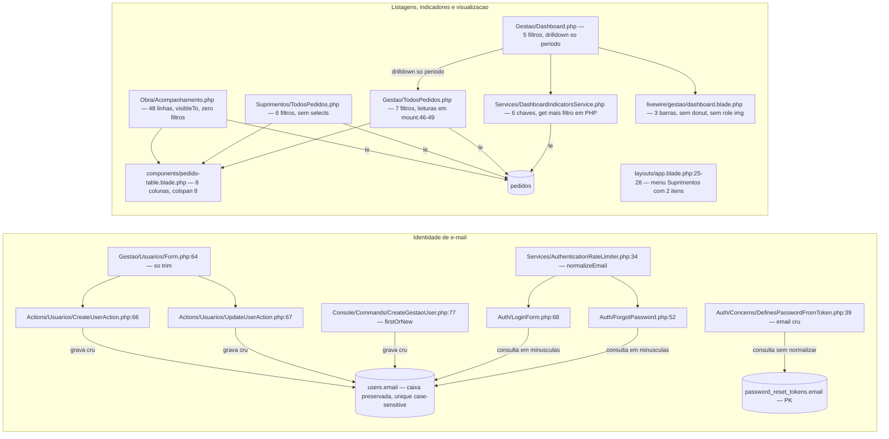
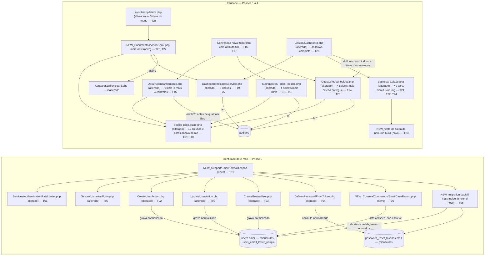

# Implementation Plan

Feature: `paridade-demo-v0` · Branch: `feat/paridade-demo-v0` · Base: `5d36ba2` (`build/v0-demo-laravel`)
Source SPEC: `.spec/features/paridade-demo-v0/SPEC.md` (v1.1, 32 RF / 5 UI / 7 CT / 10 RNF, zero clarification markers)
Executable view: `.spec/features/paridade-demo-v0/PHASES.md` (33 tasks, 6 phases)

## Request Summary

- **Objective**: close the two gaps the client reported against the presentation demo — (1) he cannot log in at all, because `users.email` is written with the typed casing while login/recovery look it up lower-cased on a case-sensitive PostgreSQL column; (2) the screens he does reach are less readable and less navigable than the demo: no "Itens" column, no mobile layout, no obra/status/prioridade/responsável filters, no `entregues` indicator, an inexact drill-down, no donut and no Suprimentos overview screen.
- **Scope in**: `App\Support\EmailNormalizer` + every write/read e-mail path; one reversible migration (backfill of `users.email` and `password_reset_tokens.email` + `users_email_lower_unique`); the `users:email-case-report` diagnostic; two new columns and a card variant on `x-pedido-table`; four filters on the Suprimentos/Gestão listings and four controls on the Obra listing; `#[Url]` binding of **all** filter state; Suprimentos listing KPIs; `entregues` + `entreguesHoje` in `DashboardIndicatorsService`; exact drill-down with an `entregue` criterion; the prazos donut in inline SVG; the accessibility layer over the three dashboard indicator sections; `GET /suprimentos/visao-geral` and its menu entry; documentation, suite, build and gates.
- **Scope out** (no exception): cadastro de obras · observações/comentários · seletor de perfil · auto-cadastro · aprovação · valores · fornecedores · itens estruturados · anexos · Chart.js or any runtime dependency · PostgreSQL RLS · `citext` · dark mode · removal or degradation of any existing behaviour.
- **Tier**: complete
- **Architecture references** (all present and honoured below): `AGENTS.md`, `docs/agents/architecture.md`, `docs/agents/domain_rules.md`, `docs/agents/coding_guidelines.md`, `docs/agents/data_model.md`, with `CLAUDE.md` §3/§5/§6 as the hand-written companion. Auxiliary init chain: `.spec/init/user-stories.md` (US-4.1, US-4.2, US-5.2, US-7.1..US-7.4 — story language only) and `.spec/init/project-phases.md`. `.spec/init/project-description.md` and `.spec/init/database-schema.md` describe the discontinued Next.js/Supabase stack and were **not** used for any stack, authorization or schema decision (SPEC "Init-chain conflicts").

### Architecture rules every task below must preserve

| Rule | Source | Mechanically enforced by |
|---|---|---|
| Route → full-page Livewire component → `authorize()` in `mount()` and per action → single-purpose Action for every write; components never write models directly | `docs/agents/architecture.md` "Layer responsibilities"; `docs/agents/coding_guidelines.md` §1, §3 | `tests/Feature/Authorization/*`, `tests/Feature/Compliance/ObraVisibleToGuardTest.php` |
| Reads go through `Pedido::visibleTo()` (`app/Models/Pedido.php:41`), never an ad-hoc `whereIn('obra_id', …)` in a component | `docs/agents/coding_guidelines.md` §4; `docs/agents/domain_rules.md` "Visibility scope" | `ObraVisibleToGuardTest.php:56,63,83,93` |
| Atraso / pendente / prazo live only in `app/Domain/Pedidos/*Classifier`; no consumer re-derives them in Blade, component or SQL | `docs/agents/coding_guidelines.md` §5 | `tests/Unit/Domain/*`, static scans added by T25 |
| Eager-load what the view renders; query count must not scale with row count | `docs/agents/coding_guidelines.md` §9 | `tests/Feature/Performance/QueryCountTest.php` |
| Append-only trails (`pedido_events`, `user_admin_events`, `authentication_events`) | `docs/agents/coding_guidelines.md` §6; `CLAUDE.md` §6 | `tests/Feature/Compliance/AuditTrailsAppendOnlyTest.php` |
| User-facing strings PT-BR, identifiers English, URL segments PT-BR | `docs/agents/coding_guidelines.md` §11 | review |
| Design tokens declared once in the `@theme` block of `resources/css/app.css`; views consume tokens, never literal colors | `docs/agents/coding_guidelines.md` §10 | `tests/Feature/Design/ThemeTokensTest.php`, `tests/Feature/Compliance/BrandIdentityComplianceTest.php` |
| PHP **8.4**-compatible (production is 8.4.25 even though `AGENTS.md` says 8.5); Pint mandatory; Pest; `php artisan make:*`; no new dependency | `CLAUDE.md` §2; `AGENTS.md` foundation/pint/pest rules | `vendor/bin/pint`, RNF-03 gate (T32) |
| Authorization is application-layer only (`guest`/`auth` → `active` → `can:is-*` → `mount()` re-check → Policy → Action guard) | `CLAUDE.md` §5; `docs/agents/domain_rules.md` | `tests/Feature/Security/Adversarial/NoGlobalScopeNoRlsTest.php` |

## AS IS — Componentes impactados

Legenda: a escrita de `users.email` preserva a caixa digitada enquanto login, recuperação e limitador consultam em minúsculas, e o PostgreSQL compara com distinção de caixa — é exatamente o bloqueio de acesso relatado pelo cliente, sem `citext` nem índice funcional em nenhuma migration. Na fatia de paridade, as três listagens compartilham uma única tabela de 8 colunas, apenas a Gestão lê parâmetros de filtro da query string (e só quatro deles, em `mount()`, que não re-executa em update Livewire), o serviço de indicadores devolve 6 chaves e o dashboard é seu único consumidor, com drill-down que carrega somente o período.

## TO BE — Componentes propostos

Legenda: `NEW_Support/EmailNormalizer.php` (T01) passa a ser a única implementação da regra canônica, com `AuthenticationRateLimiter::normalizeEmail()` delegando a ela, e é consumida pelos caminhos de escrita (T02, T03), pelo consumo de convite/redefinição (T04), pelo diagnóstico (T05) e pela migration de backfill com índice funcional (T06, verificada por T07). Na fatia de paridade, `pedido-table.blade.php` ganha as duas colunas e a variante card (T09, T10), as três listagens ganham seus conjuntos de filtro — completo em Suprimentos e Gestão (T13, T14), reduzido na Obra (T15) — e todo o estado de filtro passa à convenção nova `#[Url]` com "Limpar filtros" (T16, T17); `DashboardIndicatorsService` vai a 8 chaves (T19, T25) e alimenta também a nova `NEW_Suprimentos/VisaoGeral` (T26, T27), enquanto o dashboard ganha KPI de entregues, drill-down exato, donut em SVG inline e camada de acessibilidade (T20, T21, T22, T24), com o render de produção protegido pela asserção sobre a saída do build (T23) e a navegação de Suprimentos com três itens (T28).

## Tasks

### T01 — Regra canônica única de normalização de e-mail
- **Files**: `app/Support/EmailNormalizer.php` (novo, `php artisan make:class Support/EmailNormalizer`), `app/Services/AuthenticationRateLimiter.php`
- **Change**: create `EmailNormalizer::normalize(string $email): string` returning `mb_strtolower(trim($email))` — the single implementation in the whole codebase. Rewrite the body of `AuthenticationRateLimiter::normalizeEmail()` (`:34`) into a single delegating call, **keeping the public method** because `LoginForm:68`, `ForgotPassword:52`, `AuthenticationEventRecorder:89-93` and `tests/Unit/Services/AuthenticationRateLimiterTest.php` call it. Duplicating the expression is prohibited: the RF-01 acceptance criterion is a static scan that would flag the second copy.
- **Covers**: RF-01
- **Tests**: `tests/Unit/Support/EmailNormalizerTest.php` (novo) — `'  Marcelo@Albuquerque.COM '` → `'marcelo@albuquerque.com'`, plus already-normalized and empty-string cases. `tests/Feature/Compliance/EmailNormalizationGuardTest.php` (novo) — token scan over `app/` asserting `strtolower`/`mb_strtolower` applied to an e-mail appears exactly once, inside `EmailNormalizer`. `tests/Unit/Services/AuthenticationRateLimiterTest.php` passes unchanged.
- **Risk**: Medium — the limiter method sits on the hot login path and feeds the rate-limit keys; the delegation must be output-identical or the 4 limiters lose their counters.
- **Dependencies**: none

### T02 — Normalização nos dois Actions de usuário e no formulário da Gestão
- **Files**: `app/Actions/Usuarios/CreateUserAction.php`, `app/Actions/Usuarios/UpdateUserAction.php`, `app/Livewire/Gestao/Usuarios/Form.php`
- **Change**: in both Actions, normalize `$data['email']` **before** `Validator::make(...)` (`CreateUserAction:54-59`, `UpdateUserAction:44-49`), so `unique:users,email` and `Rule::unique('users','email')->ignore($target)` evaluate the canonical value and the persisted column (`CreateUserAction:66`, `UpdateUserAction:67`) is canonical. In `Form.php:64` replace `trim($this->email)` with the canonical call so the UI value matches what the Action stores — the Action remains the single source of truth for the write and covers non-UI callers (console, tests) for free (`docs/agents/coding_guidelines.md` §1).
- **Covers**: RF-02
- **Tests**: `tests/Feature/Actions/Usuarios/CreateUserActionTest.php` and `UpdateUserActionTest.php` — additions: `'Marcelo@Albuquerque.com'` stores `'marcelo@albuquerque.com'`; a second create with `'MARCELO@albuquerque.com'` fails on `email` with the existing PT-BR message "Já existe um usuário com este e-mail."; the same two assertions for `UpdateUserAction` against another user's address. `tests/Feature/Livewire/UsuariosFormTest.php` additions.
- **Risk**: Medium — `UserAdminAuditRecorder::snapshot()` starts recording the canonical e-mail; `UpdateUserActionTest`/`UserAdminAuditTest` assertions on `user_updated` payloads must be checked.
- **Dependencies**: T01

### T03 — Normalização em `php artisan users:create-gestao`
- **Files**: `app/Console/Commands/CreateGestaoUser.php`
- **Change**: normalize the `--email=` value once, immediately after it is read, and use the normalized value in `firstOrNew(['email' => $email])` (`:77`), in the save and in the `Usuário Gestão garantido: %s (%s)` message. Nothing else in the command changes (`GESTAO_BOOTSTRAP_PASSWORD` handling untouched).
- **Covers**: RF-03
- **Tests**: `tests/Feature/Console/CreateGestaoUserCommandTest.php` — addition: running with `'Gestor@X.com'` then `'gestor@x.com'` leaves exactly one row with `email = 'gestor@x.com'`, the second run reported as `atualizado`, never `criado`.
- **Risk**: Low
- **Dependencies**: T01

### T04 — Normalização no consumo de convite e de redefinição
- **Files**: `app/Livewire/Auth/Concerns/DefinesPasswordFromToken.php`
- **Change**: normalize the query-string e-mail in `mount()` (`:39`) and normalize again in `definePasswordThroughBroker()` before handing `'email'` to `Password::broker($broker)->reset()` (`:74-78`) — the field is editable, so the submitted value must be canonicalized too. The generic failure message and the "never reveal whether the e-mail exists" behaviour (`:96-98`) stay exactly as they are.
- **Covers**: RF-04
- **Tests**: `tests/Feature/Auth/FirstAccessInviteTest.php` and `tests/Feature/Auth/PasswordResetTest.php` — additions using `Livewire::withQueryParams(['email' => 'Marcelo@Example.com'])` against a user stored lower-cased: the flow completes, the password is set, and the `authentication_events` row written by `AuthenticationEventRecorder` carries the normalized e-mail.
- **Risk**: Medium — the broker matches `password_reset_tokens.email` exactly; this read-side fix only closes the loop once T06 normalizes the stored token rows.
- **Dependencies**: T01

### T05 — Comando de diagnóstico `users:email-case-report`
- **Files**: `app/Console/Commands/EmailCaseReport.php` (novo, `php artisan make:command`)
- **Change**: read-only command, signature `users:email-case-report`, discovered automatically like `CreateGestaoUser` and `ResetDemoData`. For **both** `users` and `password_reset_tokens`: list every row whose e-mail differs from its normalized form and every group that would collide under `lower(email)`, naming the table and the affected row count, in PT-BR, through `$this->table()` (reporting style of `ResetDemoData`, no confirmation prompt). Verdict is the union of the two tables: exit `0` and print "Nenhuma colisão encontrada." only when both are clean; any collision in either table exits non-zero. Output to stdout only — never a log channel (RF-10).
- **Covers**: RF-07, CT-04
- **Tests**: `tests/Feature/Console/EmailCaseReportCommandTest.php` (novo) — clean dataset → exit 0 + the exact sentence; planted collision in `users` → non-zero, both addresses printed, table named, row count reported; collision only in `password_reset_tokens` → also non-zero and that table named; a database-state assertion (row counts and column values before/after) shows zero writes in all three runs.
- **Risk**: Low
- **Dependencies**: T01

### T06 — Migration: aborto por colisão, backfill das duas tabelas e índice único funcional
- **Files**: `database/migrations/<timestamp>_normalize_user_emails_and_add_lower_unique_index.php` (novo, `php artisan make:migration`)
- **Change**: in `up()`, inside one transaction and in this order — (1) detect collisions under `lower(email)` in `users` **and** `password_reset_tokens`; if any exists, throw a `RuntimeException` with a PT-BR message listing the colliding addresses, leaving the database unchanged (Laravel surfaces it, the transaction rolls back, `migrate` exits non-zero); (2) rewrite both columns to `lower(btrim(email))`; (3) `CREATE UNIQUE INDEX users_email_lower_unique ON users (lower(email))`. `down()` executes only `DROP INDEX IF EXISTS users_email_lower_unique`. No PostgreSQL extension is installed, `users.email` stays `varchar(255)`, `citext` is prohibited, and no row of `pedido_events`, `user_admin_events` or `authentication_events` is read for writing or touched. The migration never deactivates, merges, renames or reassigns an account.
- **Covers**: RF-05, RF-06, RF-08, RF-09, CT-07
- **Tests**: `tests/Feature/Migrations/EmailNormalizationMigrationTest.php` (novo) — after migrating a mixed-case dataset, `SELECT count(*) FROM users WHERE email <> lower(email)` is `0` and likewise for `password_reset_tokens`; an invite token issued before the migration still completes the first-access flow afterwards; with `a@x.com` and `A@x.com` present, `migrate` fails, the message names both addresses, both rows are unchanged and `users_email_lower_unique` does not exist.
- **Risk**: **High** — Railpack runs `php artisan migrate` at every container start in production (`CLAUDE.md` §2), so an unresolved collision aborts the deploy, not just a local command. See the Risks table for the mandatory pre-deploy procedure.
- **Dependencies**: T01, T05

### T07 — Índice, reversibilidade, idempotência e trilhas intactas
- **Files**: `tests/Feature/MigrationSchemaTest.php`, `tests/Feature/Migrations/EmailNormalizationMigrationTest.php`
- **Change**: verification only, no production code. Assert via `Schema::getIndexes('users')` that `users_email_lower_unique` exists with the `lower(email)` expression (same helper style as the existing index assertions at `:23-34`, `:124`, `:167`, `:199`); assert a raw insert of `'A@X.com'` alongside `'a@x.com'` raises a unique violation at database level with the application layer bypassed; assert `migrate:rollback` drops the index and leaves the column type unchanged; assert `migrate → rollback → migrate` on an already-normalized dataset succeeds three times and leaves `users` byte-identical; seed one row in each of the three audit trails with a mixed-case e-mail payload and assert all three are byte-identical after the migration.
- **Covers**: RF-08, RF-09, RNF-09
- **Tests**: the assertions above are the deliverable.
- **Risk**: Low
- **Dependencies**: T06

### T08 — Compliance: nenhum endereço real do cliente em arquivo desta feature
- **Files**: `tests/Feature/Compliance/NoRealClientEmailTest.php` (novo)
- **Change**: grep every file added or modified by this feature (diff against the merge base of `feat/paridade-demo-v0`) for `@albuquerque.` and for the configured production domain, asserting zero occurrences; assert the diagnostic command writes to stdout only, with no log channel receiving an e-mail address. Test data across the feature uses `example.com`/`example.org` or factory-generated values.
- **Covers**: RF-10
- **Tests**: the assertions above are the deliverable; runs alongside `tests/Feature/Compliance/NoCommittedSecretsTest.php`, which stays unchanged.
- **Risk**: Low
- **Dependencies**: T05

### T09 — Colunas "Itens" e "Solicitado em" em `x-pedido-table`
- **Files**: `resources/views/components/pedido-table.blade.php`
- **Change**: add `<th>Itens</th>` immediately after "Obra" and `<th>Solicitado em</th>`; the Itens cell shows `items_description` truncated to at most 90 visible characters and carries the complete, untruncated text in `title`; the Solicitado em cell renders `{{ $pedido->requested_at->format('d/m/Y') }}`. Replace the literal `colspan="8"` (`:34`) by a value derived from a column list declared once in the component. Both attributes are already on the loaded row, so no query is added and no eager-load changes; the `:pedidos :show-route :empty-message` prop contract is unchanged, so the three call sites keep working untouched.
- **Covers**: RF-11, RF-12, RF-13, CT-06
- **Tests**: `tests/Feature/Livewire/PedidoTableColumnsTest.php` (novo) — for a pedido with a 300-character `items_description`, the visible text is ≤ 90 characters and the `title` equals the full 300-character string; `requested_at = 2026-03-07 14:22` renders `07/03/2026`; the empty state renders `colspan="10"` — all three assertions repeated for `Obra\Acompanhamento`, `Suprimentos\TodosPedidos` and `Gestao\TodosPedidos`.
- **Risk**: Low
- **Dependencies**: Phase 0 green (RNF-01)

### T10 — Variante card abaixo do breakpoint `md:`
- **Files**: `resources/views/components/pedido-table.blade.php`
- **Change**: inside the same component and from the same `$pedidos` collection, render a stacked-card list marked `md:hidden` showing at least código, itens, status, data necessária and the atraso indicator, and mark the existing table wrapper `hidden md:block`. Keep `wire:key` and `data-pedido-code` on each item, reuse `x-status-badge` and `x-atraso-indicator`, introduce no new prop, no second data source and no new visual pattern (UI-05). The `overflow-x-auto` on the table wrapper (`:3`) stays for the desktop path.
- **Covers**: UI-01, UI-05, CT-06
- **Tests**: `tests/Feature/Livewire/PedidoTableColumnsTest.php` — the same pedido code is present in both the table and the card markup for the same dataset; the empty message renders exactly once per rendering path. Re-run the three listing test files and `tests/Feature/Livewire/PedidoCardRenderTest.php`.
- **Risk**: Medium — rendering each pedido twice can break pre-existing `assertDontSee`/`assertSeeInOrder` assertions and doubles the listing DOM; verify the three listing test files before committing.
- **Dependencies**: T09

### T11 — Cobertura responsiva das três listagens
- **Files**: `tests/Browser/ResponsiveIdentityTest.php`
- **Change**: add one test (addition only — no existing assertion touched) that seeds `DemoSeeder`, acts as the demo obra / suprimentos / gestão users and runs the existing `assertResponsiveAndAccessible()` helper on `/obra/pedidos`, `/suprimentos/pedidos` and `/gestao/pedidos` across the existing `viewports` dataset (1440×900, 820×1180, 390×844). The helper already asserts the four rules: no horizontal document overflow, primary control inside the viewport, every form control labelled, focus ring ≥ 2 px.
- **Covers**: UI-03, RNF-04, RNF-05
- **Tests**: the new test is the deliverable; requires `npm run build` and Chromium via pest-plugin-browser.
- **Risk**: Medium — browser suite is slow and environment-sensitive; keep it to one test with the three paths.
- **Dependencies**: T10

### T12 — `QueryCountTest` passa a cobrir a listagem da Gestão
- **Files**: `tests/Feature/Performance/QueryCountTest.php`
- **Change**: add a `Gestao\TodosPedidos` case with the same 5-vs-50 equality pattern used by the four existing cases (the file covers Acompanhamento, Suprimentos's listing, the Kanban and the dashboard, but not the Gestão listing). Addition only — the four existing cases keep their assertions.
- **Covers**: RF-13, RNF-02
- **Tests**: the new case is the deliverable.
- **Risk**: Low
- **Dependencies**: T09

### T13 — Quatro filtros na listagem de Suprimentos
- **Files**: `app/Livewire/Suprimentos/TodosPedidos.php`, `resources/views/livewire/suprimentos/todos-pedidos.blade.php`
- **Change**: add `?int $obraId`, `?int $statusId`, `?int $priorityId`, `?int $responsibleId`; each applied as a singular `where('obra_id'|'status_id'|'priority_id'|'responsible_id', …)` only when non-null, combinable with each other and with the six pre-existing filters (`search`, `atrasoOnly`, both date ranges). `render()` supplies the option sets: `Obra::query()->orderBy('name')->get()` **without** `->active()` (RF-18 — inactive obras stay filterable), `Status::ordered()->get()`, `Priority::ordered()->get()`, `User::query()->suprimentos()->orderBy('name')->get()` — the same sources `Gestao\Dashboard::render()` already uses (`:85-88`). Four selects in the filter card following UI-02 and the markup of `dashboard.blade.php:37-75`: `<label for>` matching the control id, `class="form-control"`, `wire:model.live`, an empty option "Todas as obras"/"Todos os status"/"Todas as prioridades"/"Todos os responsáveis". `updating()` already resets the page for any property but `page`.
- **Covers**: RF-14, RF-18 (suprimentos source), UI-02
- **Tests**: `tests/Feature/Livewire/TodosPedidosFiltersTest.php` — additions: each of the four filters alone reduces a seeded dataset to exactly the expected pedidos; all four combined return the intersection; the pre-existing four filters behave identically with and without the new ones; a pedido of a deactivated obra remains findable and that obra is present in the select. `tests/Feature/Livewire/ObraInativaPreservaHistoricoTest.php` passes unchanged; `QueryCountTest` equality holds (the option sets add a fixed number of queries).
- **Risk**: Medium
- **Dependencies**: Phase 0 green (RNF-01); T09/T10 for the shared table

### T14 — Quatro filtros na listagem da Gestão
- **Files**: `app/Livewire/Gestao/TodosPedidos.php`, `resources/views/livewire/gestao/todos-pedidos.blade.php`, `tests/Feature/Livewire/GestaoKanbanReadOnlyTest.php`
- **Change**: mirror T13 exactly — same four properties, same application order, same option sources, same UI-02 markup. `pendenteOnly` keeps its current behaviour and stays unrendered as a control. Extend the id regex at `GestaoKanbanReadOnlyTest:70` with `obraId|statusId|priorityId|responsibleId` so the test "the read-only listing filter set matches the Suprimentos listing filter set" keeps its meaning after the change — an addition to the character class, with no assertion weakened.
- **Covers**: RF-15, RF-18, UI-02
- **Tests**: the RF-14 assertions repeated against `Gestao\TodosPedidos`; a request combining `?pendente=true` with `?statusId=<id>` returns the intersection of both; `GestaoKanbanReadOnlyTest` passes with the extended regex.
- **Risk**: Medium — the two listings must stay filter-for-filter identical or the pre-existing parity test fails.
- **Dependencies**: T13

### T15 — Conjunto reduzido de filtros na listagem da Obra
- **Files**: `app/Livewire/Obra/Acompanhamento.php`, `resources/views/livewire/obra/acompanhamento.blade.php`
- **Change**: add `string $search`, `?int $obraId`, `?int $statusId`, `bool $atrasoOnly` — and **only** these; no prioridade and no responsável control, and `priorityId`/`responsibleId` in the query string are ignored rather than applied (RF-16, decided against handoff AC-2). The `Pedido::` statement must remain a single statement that calls `visibleTo` before its semicolon: `$query = Pedido::query()->visibleTo(Auth::user())->with(['obra','status','priority','responsible']);` — every filter is applied afterwards on `$query` in separate statements, the obra filter with singular `where('obra_id', $this->obraId)` (a `whereIn('obra_id', …)` anywhere in `app/Livewire/Obra/*.php` is a violation, `ObraVisibleToGuardTest:83`), no `find`/`findOrFail`/`firstOrFail` (`:56`), and `AtrasoClassifier::scopeAtrasado($query)` reused for the atraso criterion. Free-text search matches `code`, `items_description` and the obra name, identically to the other two listings. Add `updating()` page reset. Option sets: `Auth::user()->obras()->orderBy('name')->get()` — the user's own obras, **without** `->active()` — and `Status::ordered()->get()`. Controls follow UI-02.
- **Covers**: RF-16, RF-17, RF-18 (obra source), RNF-08, UI-02
- **Tests**: `tests/Feature/Livewire/AcompanhamentoTest.php` — additions: each of the four controls reduces the visible set correctly; no prioridade/responsável control is rendered. `tests/Feature/Authorization/PedidoVisibleToScopeTest.php` — two additions: an Obra user requesting `/obra/pedidos?obraId=<foreign obra id>` gets zero rows and no 500; the rendered obra select of an Obra user contains the name of no obra they are not associated with. `tests/Feature/Compliance/ObraVisibleToGuardTest.php` passes unchanged (its four mechanical rules).
- **Risk**: **High** — this is the easiest task in the feature to break: the guard test inspects tokens, so a refactor that moves `visibleTo` out of the opening statement, or expresses the obra filter as `whereIn`, fails the compliance gate and, worse, could widen visibility if the scope were applied after the filter.
- **Dependencies**: T13

### T16 — Migração de todo o estado de filtro para `#[Url]`
- **Files**: `app/Livewire/Suprimentos/TodosPedidos.php`, `app/Livewire/Gestao/TodosPedidos.php`, `app/Livewire/Obra/Acompanhamento.php`, `tests/Feature/Livewire/DashboardDrillDownTest.php`, `tests/Feature/Livewire/TodosPedidosFiltersTest.php`, `tests/Feature/Livewire/GestaoKanbanReadOnlyTest.php`
- **Change**: bind **every** filter property of the three listings with `Livewire\Attributes\Url` (verified present at `vendor/livewire/livewire/src/Attributes/Url.php` in v4.4.5; `grep -rn "#\[Url" app/` returns zero at HEAD, so this is a new project convention to be recorded in T30/T31): the four new `*Id` properties (`except: null`), `search` (`except: ''`), `atrasoOnly` as `#[Url(as: 'atrasado', except: false)]`, `pendenteOnly` as `#[Url(as: 'pendente', except: null)]`, and `neededAtFrom`/`neededAtTo`/`requestedFrom`/`requestedTo` under their current names (`except: ''`). **Remove** the manual reads at `Gestao\TodosPedidos::mount():46-49`, keeping only `authorize('is-gestao')` — mixing the two mechanisms is prohibited because `mount()` does not re-run on a Livewire update, which would make RF-19's "the resulting URL carries no filter parameter" unsatisfiable. The four legacy drill-down parameter names (`atrasado`, `pendente`, `requestedFrom`, `requestedTo`) keep resolving byte-for-byte.
- **Covers**: RF-20, CT-02, RF-32 (explicit carve-out: URL-addressability is not a removal)
- **Tests**: **updates, never deletions**, to the pre-existing tests that pin the `mount()` mechanism — `DashboardDrillDownTest` (its three cases navigate through `$this->get($drillDownUrl)`, so they must keep passing and be extended to assert the selects are pre-selected), `TodosPedidosFiltersTest`, `GestaoKanbanReadOnlyTest` — each still covering every parameter it covered before. New assertions: changing any filter while on page 3 lands on page 1; `/suprimentos/pedidos?statusId=<id>&obraId=<id>` renders the filtered set on first paint with both selects pre-selected; `/gestao/pedidos?atrasado=true` and `?pendente=true` resolve to the same filtered sets as at HEAD. New static-scan test asserting `app/Livewire/{Obra,Suprimentos,Gestao}/**` contains no `request()->` read of a filter parameter.
- **Risk**: **High** — first use of `#[Url]` in the project; `pendenteOnly` is `?bool` and must not serialize as `pendente=false`; a wrong `except:` silently pollutes every URL and breaks T17.
- **Dependencies**: T13, T14, T15

### T17 — Controle "Limpar filtros" nas três telas
- **Files**: `app/Livewire/Suprimentos/TodosPedidos.php`, `app/Livewire/Gestao/TodosPedidos.php`, `app/Livewire/Obra/Acompanhamento.php` and their three views
- **Change**: a `limparFiltros()` method per component resetting every filter property of that screen to its declared default — the new ones **and** `search`, `atrasoOnly`, `pendenteOnly`, both date ranges — via `$this->reset([...])`, followed by `resetPage()`. A "Limpar filtros" button inside each filter form, using the project's existing button pattern and following UI-02 for focus/labelling.
- **Covers**: RF-19
- **Tests**: with every filter set and the listing on page 2, activating the control yields a component state where each filter property equals its declared default, the paginator is on page 1, and the resulting URL carries no filter parameter; reloading that URL yields the unfiltered listing. Repeated for the three screens.
- **Risk**: Medium — correctness depends entirely on T16's `except:` values.
- **Dependencies**: T16

### T18 — KPIs Total / Pendentes / Atrasados no topo de Suprimentos › Pedidos
- **Files**: `app/Livewire/Suprimentos/TodosPedidos.php`, `resources/views/livewire/suprimentos/todos-pedidos.blade.php`
- **Change**: extract the filtered builder into one private method consumed both by `pedidos()` and by a new `indicators()`, so the numbers can never diverge from the rows the listing paginates. Compute `total` as `(clone $builder)->count()`, `pendentes` via `PendenteClassifier::scopePendente((clone $builder), true)->count()` and `atrasados` via `AtrasoClassifier::scopeAtrasado(clone $builder)->count()` — no classifier logic re-implemented in the component or in Blade (`docs/agents/coding_guidelines.md` §5). Render three cards above the listing following the dashboard's `data-testid="indicator-*"` / `data-value` pattern and theme tokens.
- **Covers**: RF-21
- **Tests**: with no filter the three numbers equal the whole dataset's counts; after an obra filter they equal that obra's counts; the numbers never contradict the paginated rows; a static assertion that no classifier expression is duplicated in the view; `QueryCountTest` equality still holds (the three counts are a fixed cost).
- **Risk**: Medium — cloning the builder after `paginate()` would count the wrong set; clone before.
- **Dependencies**: Phase 2 complete (T13, T16, T17)

### T19 — Chave `entregues` em `DashboardIndicatorsService`
- **Files**: `app/Services/DashboardIndicatorsService.php`
- **Change**: add an `entregues` key counting, over the already-loaded filtered set, the pedidos whose status slug is `entregue` (`StatusSlug::Entregue`) — computed in PHP on the collection returned by `filteredPedidos()`, adding **no** query. Update the `@return` array shape of `compute()` (`:25-32`) in the same edit. The service stays role-agnostic and keeps **not** applying `Pedido::visibleTo` (ADENDO D-6).
- **Covers**: RF-22 (service half), CT-05 (partial)
- **Tests**: `tests/Feature/Livewire/DashboardIndicatorsTest.php` — additions: `entregues` correct with no filter and under each of the 5 dashboard filters; the returned array's key set matches the documented shape.
- **Risk**: Low
- **Dependencies**: Phase 2 complete

### T20 — Drill-down exato e critério `entregue`
- **Files**: `app/Livewire/Gestao/Dashboard.php`, `app/Livewire/Gestao/TodosPedidos.php`
- **Change**: `drillDownUrl(string $criterion)` (`:72-79`) carries every active dashboard filter the target listing now supports — `requestedFrom`, `requestedTo`, `obraId`, `statusId`, `priorityId`, `responsibleId` (only the non-empty ones, keeping the `array_filter` idiom) — plus `$criterion => 'true'`, with `$criterion ∈ {atrasado, pendente, entregue}`. Replace the docblock paragraph at `:21-28` that documents the deliberate restriction, whose stated reason (no counterpart in the target listing) is removed by T14. In `Gestao\TodosPedidos`, an `entregue` URL criterion resolves to the `entregue` status id and is applied as an **additional AND constraint** alongside an explicit `statusId`, consistent with RF-15's intersection semantics — no parameter is dropped and none is invented (see Assumptions).
- **Covers**: RF-23, RF-24, CT-03
- **Tests**: `tests/Feature/Livewire/DashboardDrillDownTest.php` — additions: with obra, prioridade and período set on the dashboard, the drill-down listing's row count equals the KPI value that was clicked; the `entregue` drill-down URL carries the criterion, resolves to the `entregue` status id on first load, and its row count equals the dashboard's `entregues`. The three pre-existing cases keep passing.
- **Risk**: Medium
- **Dependencies**: T19

### T21 — Quarto card "Entregues" no dashboard
- **Files**: `resources/views/livewire/gestao/dashboard.blade.php`, `app/Livewire/Gestao/Dashboard.php`
- **Change**: expose `entreguesDrillDownUrl` from `render()` alongside the two existing drill-down URLs; add a fourth KPI card with exactly the markup pattern of `indicator-pendentes`/`indicator-atrasados` (`:86-96`) — `data-testid="indicator-entregues"`, `data-value`, a theme token for the delivered state (`text-concluido`/`border-t-concluido`), and the count linking to the drill-down. Adjust the KPI grid (`:79`, today `sm:grid-cols-3`) so four cards fit without horizontal overflow at 390 px.
- **Covers**: RF-22 (card half), RF-24 (link), UI-05
- **Tests**: the card renders with the same markup pattern as the existing two; no horizontal overflow at 390 px (asserted by T29); `ThemeTokensTest` and `BrandIdentityComplianceTest` pass unchanged.
- **Risk**: Low
- **Dependencies**: T19, T20

### T22 — Donut de prazos em SVG inline
- **Files**: `resources/views/livewire/gestao/dashboard.blade.php`
- **Change**: inside `[data-testid="indicator-prazos"]`, above the existing numeric list, render an inline `<svg>` with a `viewBox` and `preserveAspectRatio` (fluid at 390 px without a media query) containing three slices sized proportionally to `indicators['prazos']`. Paint through a literal Blade map `$prazoFills = ['dentro_do_prazo' => 'fill-success', 'vencendo_em_breve' => 'fill-warning', 'atrasado' => 'fill-atraso']`, mirroring the `$prazoColors` map already at `:7-11`; each slice receives its class from that map, always written out in full. **Interpolating the class name is prohibited** (`fill-{{ … }}`, `stroke-{{ … }}`, any concatenation): the project has no safelist (`resources/css/app.css:3-4` holds two `@source` lines), so an interpolated class is never emitted and the donut would render black **only in the production build**. Because the RIGID paint mechanism is `fill-*`, the slices are filled `<path>` wedges — the `stroke-dasharray` on concentric circles suggested under FLEXIBLE paints with `stroke`, is incompatible with the mandated `fill-*` map and with the build assertion of T23, and is therefore not used. Handle the zero-pendentes case (the existing `$pendentesTotal = max(..., 1)` guard at `:12`). No new query, no JavaScript, no literal color.
- **Covers**: RF-25
- **Tests**: `tests/Feature/Livewire/DashboardDonutTest.php` (novo) — exactly one `<svg>` inside the prazos card; the three slice lengths are proportional to the three counts within 1 percentage point; the `data-situacao` items keep label and count unchanged; the donut markup contains no `fill-{{` and no `stroke-{{`; no file under `resources/views/` or `resources/css/` **added or modified** by this feature contains a hex color, an `rgb(`/`hsl(` literal or a Tailwind palette class.
- **Risk**: Medium — wedge geometry; a zero total must not produce `NaN` in the path data.
- **Dependencies**: Phase 3 complete

### T23 — Asserção sobre a saída de `npm run build`
- **Files**: `tests/Feature/Compliance/BuiltAssetsUtilitiesTest.php` (novo)
- **Change**: resolve the CSS entry of `resources/css/app.css` through `public/build/manifest.json`, read the emitted stylesheet under `public/build/assets/` and assert the three generated utilities `.fill-success`, `.fill-warning` and `.fill-atraso` are present. This is the **only** assertion that protects the production render of the donut, so it is an explicit task, not an implementation detail. If the manifest is absent, fail with an actionable PT-BR message telling the operator to run `npm run build` — not a skip: the Feature suite already depends on the manifest because `resources/views/layouts/app.blade.php:12` calls `@vite`, and `public/build` is gitignored (`.gitignore:20`), so a stale or missing build must be loud.
- **Covers**: RF-25 (mandatory build-output assertion)
- **Tests**: the new test is the deliverable; it must be re-run after the T33 build, since it reads artefacts produced outside the PHP process.
- **Risk**: Medium — the assertion only proves anything against a build regenerated after the donut edit; T33 sequences `npm run build` before the final suite run for exactly this reason.
- **Dependencies**: T22

### T24 — Camada de acessibilidade das três seções de indicadores
- **Files**: `resources/views/livewire/gestao/dashboard.blade.php`
- **Change**: add `role="img"` and a non-empty PT-BR `aria-label` describing the distribution and its totals to `indicator-por-status` (`:100`), `indicator-prazos` (`:117`) and `indicator-por-obra` (`:138`), keeping the textual numbers as the accessible alternative. The two existing proportional bar sections (`:110`, `:148`) are kept exactly as they are — only the attributes are added, and every `data-status`/`data-situacao`/`data-obra` value stays identical.
- **Covers**: RF-26
- **Tests**: each of the three sections exposes `role="img"` and a non-empty `aria-label` naming the section and its totals; the existing `data-testid` blocks and their per-row `data-*` attributes render with the same values as before the change.
- **Risk**: Low
- **Dependencies**: T22

### T25 — Chave `entreguesHoje` no serviço, com a única consulta autorizada
- **Files**: `app/Services/DashboardIndicatorsService.php`
- **Change**: add the 8th key `entreguesHoje`, defined as pedidos whose status is `entregue` **and** which have a `pedido_events` row of type `entrega` (`event_types.slug = 'entrega'`, `EventTypeSlug::Entrega`) with `created_at` on the current day — the delivery that actually happened, not the forecast (`expected_delivery_at` is nullable and only Suprimentos fills it, so the forecast definition would silently drop deliveries). Compute it with **exactly one** additional query: a `whereExists` over `pedido_events` joined to `event_types`, restricted to the same filtered set, constant regardless of row count — never one query per pedido. This is the only exception authorized by RNF-10; every other key stays on the existing `->get()` + PHP filtering. Update the `@return` shape to the 8 keys and add PHPDoc recording (a) the accepted performance debt with its ≈5 000-pedido threshold, (b) this single authorized exception, (c) the role-agnostic trap: any future reuse in an Obra context must add `Pedido::visibleTo` first (ADENDO D-6, RNF-08).
- **Covers**: RF-29, CT-05, RNF-10
- **Tests**: a dataset with one pedido delivered today, one delivered yesterday and one delivered today **without** `expected_delivery_at` yields `entreguesHoje = 2`, asserted explicitly for all three pedidos; the value is produced by the service; a query-count assertion shows `compute()` issues exactly one more query than at HEAD and the same count at 5 and at 50 pedidos; a static scan finds no `'entrega'` slug reference in `app/Livewire/Suprimentos/` or in the Visão Geral Blade. Operational note to carry into T31: `DemoSeeder` writes `pedido_events.created_at` with `useCurrent()`, so this KPI shows N on the seed day and 0 afterwards — the mitigation is to run `php artisan db:seed` on the day of the demonstration; no date-shifting policy is invented in the seeder.
- **Risk**: Medium — an incorrectly written `whereExists` degrades into an N+1 and breaks RNF-02.
- **Dependencies**: T19

### T26 — Rota e componente `Suprimentos\VisaoGeral`
- **Files**: `routes/web.php`, `app/Livewire/Suprimentos/VisaoGeral.php` (novo, `php artisan make:livewire`)
- **Change**: register `Route::get('/visao-geral', VisaoGeral::class)->name('visao-geral')` inside the existing `can:is-suprimentos` group (`routes/web.php:74-78`), so it inherits `auth` + `active` + the role gate. The component is full-page with `#[Layout('layouts.app')]` and re-checks `$this->authorize('is-suprimentos')` in `mount()`, exactly like `Suprimentos\TodosPedidos:37-40`. Route name is `suprimentos.visao-geral`; the URL segment is PT-BR per `docs/agents/coding_guidelines.md` §11. The `/home` arm is not touched — Suprimentos still lands on the Kanban.
- **Covers**: RF-27, CT-01
- **Tests**: `tests/Feature/Authorization/RoleGatesTest.php` — additions: 200 for suprimentos, 403 for obra, 403 for gestão, 302 → `login` for a guest. `tests/Feature/Auth/EnsureUserIsActiveTest.php`'s existing "every authenticated route loads `active`" check (`:109`) passes with the new route present. `tests/Feature/Livewire/SuprimentosScreensRouteTest.php` additions.
- **Risk**: Low
- **Dependencies**: T25

### T27 — Conteúdo da tela "Visão Geral"
- **Files**: `app/Livewire/Suprimentos/VisaoGeral.php`, `resources/views/livewire/suprimentos/visao-geral.blade.php` (novo), `tests/Feature/Performance/QueryCountTest.php`
- **Change**: `render()` consumes `DashboardIndicatorsService::compute([])` — the service is reused **without** modifying its role-agnostic behaviour and without a second encoding of any classifier rule. The page presents (a) three KPI cards: Total de pedidos (`volumeTotal`), Atrasados (`atrasados`) and Entregues hoje (`entreguesHoje`, produced by the service per T25); (b) a count for each of the 5 non-cancelled workflow statuses, taken from `porStatus` and filtered by slug, matching `porStatus` exactly; (c) a shortcut link to `route('suprimentos.kanban')`; (d) an `x-pedido-table` with the 5 most recent pedidos (`latest('requested_at')->take(5)`, eager-loading `obra`, `status`, `priority`, `responsible`) plus a "Ver todos" link to `route('suprimentos.pedidos.index')`. Only existing visual components and classes: `card`, `page-title`, `section-title`, `x-pedido-table`, `x-status-badge` — no new visual pattern (UI-05).
- **Covers**: RF-28, RF-29 (KPI set), UI-05, RNF-02
- **Tests**: per-status counts equal the seeded dataset's counts and match `porStatus`; the table shows exactly 5 rows ordered by `requested_at` descending; the Kanban link resolves to `route('suprimentos.kanban')` and "Ver todos" to `route('suprimentos.pedidos.index')`; `QueryCountTest` extended with the new screen, asserting its query count at 5 pedidos equals its count at 50; `BrandIdentityComplianceTest` and `ThemeTokensTest` pass unchanged.
- **Risk**: Medium
- **Dependencies**: T26

### T28 — Entrada "Visão Geral" no menu de Suprimentos
- **Files**: `resources/views/layouts/app.blade.php`
- **Change**: add `['label' => 'Visão Geral', 'route' => 'suprimentos.visao-geral', 'active' => 'suprimentos.visao-geral']` to the Suprimentos arm of `$navItems` (`:25-28`), keeping the existing active-state convention (`request()->routeIs($item['active'])` + `aria-current="page"`, `:51-55`). The Obra and Gestão arms and the `/home` role redirect are untouched.
- **Covers**: RF-30
- **Tests**: the Suprimentos menu renders 3 entries; the new entry is marked active only on `/suprimentos/visao-geral`; `/home` still redirects a Suprimentos user to `suprimentos.kanban`; `tests/Feature/Livewire/LayoutIdentityTest.php` passes unchanged.
- **Risk**: Low
- **Dependencies**: T26

### T29 — Cobertura browser do donut e da Visão Geral
- **Files**: `tests/Browser/DashboardChartsTest.php` (novo), `tests/Browser/ResponsiveIdentityTest.php`
- **Change**: UI-04 — a browser test changes a dashboard filter twice and asserts, after each change, that exactly one `<svg>` exists in the prazos card and that its slice proportions match the newly rendered numbers (no disappearing, duplicated or stale chart across Livewire re-renders). Extend the responsive audit (addition only) to `/suprimentos/visao-geral` at the three viewports, and confirm `/gestao/dashboard` still has no horizontal overflow at 390 px with the fourth KPI card and the donut in place.
- **Covers**: UI-04, RNF-04, RNF-05
- **Tests**: the two additions are the deliverable; both require `npm run build` and Chromium.
- **Risk**: Medium — browser suite cost and environment sensitivity; keep the chart test to one purposeful case.
- **Dependencies**: T22, T27, T28

### T30 — `docs/agents/*` regenerados via `/ai-context`
- **Files**: `docs/agents/api_contracts.md`, `architecture.md`, `coding_guidelines.md`, `data_model.md`, `dependencies.md`, `domain_rules.md`, `project_overview.md`, `tech_stack.md`
- **Change**: run `/ai-context` and confirm the regenerated tree records: the new route `suprimentos.visao-geral` and its component; the per-screen filter sets of the three listings and the new query-string contract; the `entregues` and `entreguesHoje` keys and the 8-key shape of `compute()`; the `#[Url]` convention as new; the Fase 0 migration, `users_email_lower_unique` and `App\Support\EmailNormalizer`; the RNF-10 debt with its ≈5 000-pedido threshold and the single authorized query. These files carry the generation banner and are never hand-edited.
- **Covers**: RF-31, RNF-10 (documentation half)
- **Tests**: `git status` shows changes under `docs/agents/`; the regenerated `api_contracts.md` lists the new route and the new query parameters.
- **Risk**: Low
- **Dependencies**: Phases 0–4 complete

### T31 — `CLAUDE.md` e onboarding (edição manual)
- **Files**: `CLAUDE.md`, `docs/onboarding-albuquerque.md`
- **Change**: `CLAUDE.md` and `AGENTS.md` are hand-written and carry no generation banner — they are never machine-overwritten. Edit `CLAUDE.md` manually to record the two decisions "gráficos em SVG inline, sem biblioteca de chart" and "`visibleTo` antes de qualquer filtro", the new `#[Url]` convention, the canonical e-mail normalization rule with its functional unique index, and to close the §4 divergences this feature resolves (item 4 "sem filtro por status" and the "dashboard de Suprimentos" gap), plus the `DemoSeeder` same-day caveat for `entreguesHoje`. In `docs/onboarding-albuquerque.md`, revise the "Limites conhecidos" table (`:308-318`) so "Sem filtro por status em Todos os Pedidos" and "Sem dashboard próprio para Suprimentos" no longer appear. **No `AI_CONTEXT.md` is created** (ADENDO D-2 — the file does not exist and the canonical tree is `AGENTS.md` + `docs/agents/*.md`).
- **Covers**: RF-31
- **Tests**: file assertions — `git status` shows `CLAUDE.md` and `docs/onboarding-albuquerque.md` changed; no file named `AI_CONTEXT.md` exists in the tree; the two rows are gone from the limits table.
- **Risk**: Low
- **Dependencies**: T30

### T32 — Gates de segurança e de dependências
- **Files**: no production file; verification over `tests/Feature/Authorization/*`, `tests/Feature/Security/Adversarial/*`, `tests/Feature/Compliance/*`, `tests/Feature/Design/ThemeTokensTest.php`
- **Change**: run and confirm green, with no assertion weakened, deleted or skipped: `tests/Feature/Authorization/*`, `tests/Feature/Security/Adversarial/*`, `ObraVisibleToGuardTest.php`, `AuditTrailsAppendOnlyTest.php`, `NoCommittedSecretsTest.php`, `ThemeTokensTest.php`, `BrandIdentityComplianceTest.php`, `BrandAssetsTest.php`, `NoNextJsDependencyTest.php`, `NoSupabaseDependencyTest.php`. Confirm `git diff --stat composer.json package.json composer.lock package-lock.json` shows no change to production dependency blocks (zero new runtime dependencies — no charting library).
- **Covers**: RNF-03, RNF-07
- **Tests**: the gate run itself, plus a `git diff` review proving only additions were made to pre-existing test files.
- **Risk**: Low
- **Dependencies**: T31

### T33 — Pint, build de assets e suíte completa
- **Files**: no source file; `public/build/` regenerated
- **Change**: `vendor/bin/pint --dirty --format agent` (no pending style fix); `npm run build` (exit 0 — and it is this build that T23's assertion reads, so it must run **before** the final suite run); `php artisan test --compact` over `tests/Unit` and `tests/Feature`; `vendor/bin/pest tests/Browser` separately, one Pest process at a time against the PostgreSQL test database on `127.0.0.1:5434` (concurrent `RefreshDatabase` runs corrupt the run; `--filter` without `--testsuite=Feature` drags `tests/Browser` in). Confirm with `git diff` that `tests/Browser/DemoRoteiroTest.php` is unedited and that the only pre-existing assertions rewritten are the `mount()` query-string ones replaced in T16.
- **Covers**: RNF-06, RF-32
- **Tests**: 0 failures and 0 errors across the three suites; `npm run build` exit 0; Pint clean.
- **Risk**: Medium — the browser suite needs Chromium; a missing build makes both `tests/Browser` and T23 fail.
- **Dependencies**: T32

## Execution Phases

| Phase | Tasks | Parallel-safe? |
|-------|-------|----------------|
| 0 — Identidade de e-mail normalizada | T01, T02, T03, T04, T05, T06, T07, T08 | Partial — T01 first (every other task consumes it); then T02, T03, T04, T05 touch disjoint files and are parallel-safe; T06 after T05; T07 after T06; T08 after T05 |
| 1 — Legibilidade das listagens e experiência mobile | T09, T10, T11, T12 | Partial — T09 → T10 sequential (same Blade file); T12 parallel with T10; T11 last (browser, needs the final markup). **Blocked until every Phase 0 criterion is green (RNF-01)** |
| 2 — Filtros nas três listagens | T13, T14, T15, T16, T17 | Partial — T13 first (reference implementation); T14 and T15 parallel-safe afterwards (disjoint files); T16 sequential (edits all three components + pre-existing tests); T17 after T16 |
| 3 — Indicadores e drill-down exato | T18, T19, T20, T21 | Partial — T18 and T19 parallel-safe (listing vs service); T20 after T19; T21 after T19 and T20 (same Blade file as the dashboard edits) |
| 4 — Visualização e Visão Geral de Suprimentos | T22, T23, T24, T25, T26, T27, T28, T29 | Partial — T22 and T25 parallel-safe (Blade vs service); T23 and T24 after T22 (T24 shares `dashboard.blade.php`, so sequential with T22); T26 after T25; T27, T28 after T26; T29 last (browser) |
| 5 — Documentação, suíte, build e gates | T30, T31, T32, T33 | No — strictly sequential; T33 must run after the build it validates |

**Blocking sequencing (RNF-01):** Phase 0 is not a parallel track. No task of Phases 1–5 may be implemented, committed or merged before every acceptance criterion of RF-01..RF-10 is green. A reviewer verifies it from the `feat(phase-N)` ordering in `git log --oneline`; each dependent phase's preamble in `PHASES.md` states the precondition explicitly.

## Risks

| Risk | Blast radius | Mitigation | Rollback |
|------|-------------|------------|----------|
| The Fase 0 migration aborts on a real collision during deploy. Railpack runs `php artisan migrate` at **every container start** (`CLAUDE.md` §2, deploy log 2026-09-21), not from a Pre-Deploy Command, so a `RuntimeException` there fails the container start, not a local command | Production `laravel-app` service — total outage risk until the data is fixed | Run `php artisan users:email-case-report` against production (`railway ssh`) **before** merging Phase 0 and resolve every collision manually; RF-06 guarantees the abort happens before any write, so an aborted run leaves the database untouched | The migration never ran: nothing to roll back. If it did run and must be undone, `php artisan migrate:rollback` drops `users_email_lower_unique` |
| The backfill is schema-reversible but **not data-reversible**: `down()` drops the index, it cannot restore the original casing | `users.email` and `password_reset_tokens.email` in every environment where it ran | Accepted and scoped by RNF-09, whose criterion is `migrate → rollback → migrate` on an **already-normalized** dataset. Take a database snapshot before the first production run | Restore from the pre-migration snapshot; `migrate:rollback` alone only removes the index |
| Changing `AuthenticationRateLimiter::normalizeEmail()` alters the limiter keys and resets or splits the 4 rate-limit counters | Login and password-recovery throttling | T01 keeps the public method and only delegates its body; output must be byte-identical. `tests/Unit/Services/AuthenticationRateLimiterTest.php` and `tests/Feature/Auth/LoginRateLimitTest.php` / `PasswordRecoveryRateLimitTest.php` / `Security/Adversarial/RateLimitTest.php` are re-run as gates | Revert T01's edit to `AuthenticationRateLimiter`; `EmailNormalizer` alone is inert |
| Moving `visibleTo` out of the opening `Pedido::` statement in `Acompanhamento`, or expressing the obra filter as `whereIn`, widens Obra visibility | Cross-obra data disclosure — the most severe defect this feature could introduce | RF-17/RNF-08 pin the shape: `Pedido::query()->visibleTo(...)` as one statement, filters in separate statements with singular `where('obra_id', …)`. `ObraVisibleToGuardTest` enforces all four rules mechanically; T15 adds the forged-`obraId` case to `PedidoVisibleToScopeTest` | Revert T15; the Obra listing returns to the zero-filter HEAD behaviour, which is safe |
| The unscoped obra option set leaks every obra name in the company to an Obra user — a disclosure defect that RF-17's row-count assertion does **not** catch and that `ObraVisibleToGuardTest` does not catch either (it inspects `Pedido::` statements, not `Obra::`) | Every Obra user's filter select | RF-18 fixes the source per screen: `Auth::user()->obras()` on `/obra/pedidos`, `Obra::query()` on the other two. T15 adds the mandatory rendered-select assertion to `PedidoVisibleToScopeTest` | Revert the option set in T15's view to the user's own obras |
| The `#[Url]` migration (T16) is the project's first use of the attribute; a wrong `except:` pollutes every URL, and `pendenteOnly` (`?bool`) can serialize as `pendente=false`, breaking "Limpar filtros" (RF-19) and the exact drill-down (RF-23) | The three listings and every drill-down link | Explicit `as:`/`except:` values are specified per property in T16; the four legacy parameter names are asserted to still resolve; `DashboardDrillDownTest` runs as a regression gate before and after | Revert T16 and T17 together; the filters of T13–T15 keep working without URL addressability |
| The donut renders black **only in the production build** if a `fill-*` class is interpolated — invisible to the whole PHP suite | The client's dashboard, exactly the screen this feature exists to improve | RF-25 mandates a literal map and prohibits `fill-{{`/`stroke-{{`; T22 asserts the prohibition on the markup; T23 asserts the three utilities exist in the `npm run build` output, which is the only gate on the production render | Remove the `<svg>` block; the pre-existing proportional bars and numbers remain untouched |
| Rendering each pedido twice (table + cards) breaks pre-existing listing assertions (`assertDontSee`, `assertSeeInOrder`) or doubles the DOM | The three listings and the browser suite | T10 keeps one component and one data source with `hidden md:block` / `md:hidden`; the three listing test files and `PedidoCardRenderTest` are re-run before the commit | Revert T10; T09's two columns stand on their own |
| `entreguesHoje` degenerates into an N+1 and breaks the query-count equality | Dashboard and Visão Geral | RNF-10 authorizes exactly one constant `whereExists`; T25 asserts `compute()` issues exactly one more query than at HEAD, identical at 5 and 50 pedidos | Remove the key and the Visão Geral KPI that consumes it |
| `entreguesHoje` reads 0 on the day after the seed, because `DemoSeeder` writes `pedido_events.created_at` with `useCurrent()` | The demonstration itself | Operational, recorded in T25 and T31: run `php artisan db:seed` on the day of the demonstration. No date-shifting policy is invented in the seeder | None needed — data-only |
| The browser suite (T11, T29) fails for environment reasons (Chromium, missing `public/build`) and blocks the phase | Phases 1 and 4 completion | T33 sequences `npm run build` before the suite; browser tests are kept few and purposeful; one Pest process at a time against the 5434 test database | Run `tests/Browser` separately from `tests/Feature`; the Feature gates stand alone |

## Open Questions

- **Pre-deploy execution of `users:email-case-report` against production is an operational step this plan cannot perform (read-only planning, and production data is out of reach here).** Impact: if a collision exists in production `users` or `password_reset_tokens`, merging Phase 0 makes every subsequent container start fail its `migrate` step. Requested confirmation: who runs the diagnostic against the production database, and when, relative to the Phase 0 merge. The plan assumes it happens before the merge (T06's risk row).
- **Precedence when a drill-down carries both `statusId` and the `entregue` criterion.** RF-23 forbids dropping or inventing parameters and RF-24 requires the `entregue` pre-filter; the SPEC does not state which wins when the dashboard's status filter is active. T20 resolves it as an AND intersection (consistent with RF-15's intersection semantics, and self-consistent because the KPI value under a conflicting status filter is itself 0). Impact if the intended behaviour were "the criterion overrides `statusId`": one assertion in `DashboardDrillDownTest` changes; no structural rework. Flagged, not blocking.
- **Data-irreversibility of the Fase 0 backfill.** RNF-09 scopes reversibility to the schema and to an already-normalized dataset, which the migration satisfies; the original casing of a mixed-case address is nevertheless lost for good. Impact: a pre-migration database snapshot is the only restore path. Flagged for explicit acknowledgement, not as a change request.

## Assumptions

- **No contract artefact is emitted for this feature.** Contract emission was evaluated (tier is `complete` and the SPEC has a populated `### Contracts` subsection) and skipped because none of CT-01..CT-07 is a REST, gRPC or async-event interface: CT-01 is an HTML route bound to a full-page Livewire component, CT-02 a query-string parameter set for that HTML, CT-03/CT-05/CT-06 PHP/Blade signatures, CT-04 an Artisan command, CT-07 a database index. Evidence: `docs/agents/api_contracts.md` "No JSON API: no `routes/api.php`, no concrete controllers, no OpenAPI/GraphQL schema", and a repository scan for `openapi*.yaml` / `*.proto` / `asyncapi*.yaml` returns nothing. Emitting an OpenAPI document for a server-rendered page would invent a contract the architecture explicitly does not have. Each CT stays asserted by the RF that owns it, as the SPEC's own summary table prescribes.
- **The donut is drawn with filled `<path>` wedges, not `stroke-dasharray` circles.** The SPEC's FLEXIBLE section suggests `stroke-dasharray` on three concentric `<circle>` elements, but the RIGID paint mechanism of RF-25 is the literal `fill-success`/`fill-warning`/`fill-atraso` map, and the mandatory build assertion names those three `fill-*` utilities. `stroke-dasharray` paints through `stroke-*`, not `fill-*`. RIGID wins; recorded in T22 so the divergence from the suggestion is a decision, not an oversight.
- `App\Support\EmailNormalizer` is the placement chosen among the FLEXIBLE options (a `Str::macro` or a static on an existing service would also satisfy RF-01). It keeps a rate-limiter class from owning a write-side concern and creates the `app/Support/` directory — a new namespace inside the existing `app/` tree, not a new base folder, consistent with `AGENTS.md` "Stick to existing directory structure".
- 90 characters is the truncation length used for the "Itens" column, the upper bound stated by RF-11's acceptance criterion ("at most 90 characters"); the `title` attribute carries the untruncated text regardless.
- `Gestao\TodosPedidos` gains the four filters but keeps `pendenteOnly` unrendered as a control, so the pre-existing parity test at `GestaoKanbanReadOnlyTest:70` continues to hold once its id regex is extended in T14 — [UNVERIFIED by execution] the regex currently matches only six literal ids, so it would pass untouched, but leaving it untouched would silently stop covering the four new controls.
- `QueryCountTest` covers `Acompanhamento`, `Suprimentos\TodosPedidos`, the Kanban and the dashboard, but **not** `Gestao\TodosPedidos` (verified at HEAD); T12 closes that gap so RNF-02's "each listing" claim is actually enforced.
- The Feature suite already requires `public/build/manifest.json`, because `layouts/app.blade.php:12` calls `@vite` and every layout-rendering test would otherwise raise `ViteException`. T23 therefore fails loudly instead of skipping when the manifest is missing — [UNVERIFIED by execution] confirmed by reading the layout and the existing manifest, not by running the suite with the build removed.
- Test-runner constraints honoured throughout: one Pest process at a time against `127.0.0.1:5434` (concurrent `RefreshDatabase` runs corrupt the run), and `--filter` without `--testsuite=Feature` pulls `tests/Browser` into the run.
