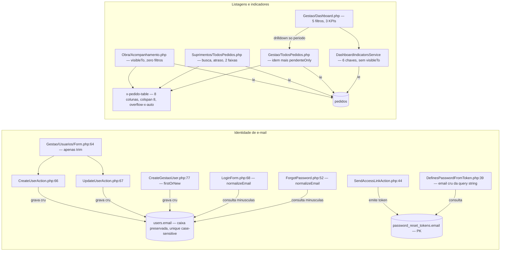
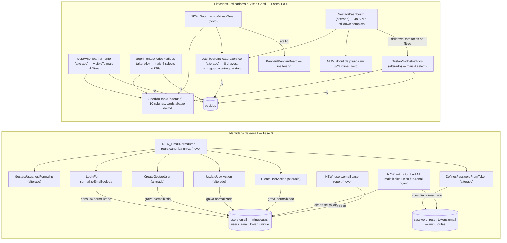

# SPEC: paridade-demo-v0

## Metadata
- Source: developer description via /plan (`.spec/features/paridade-demo-v0/.handoff/input.md` — summary + AC-0..AC-5 + 7 resolved decisions, used verbatim as the AC source of truth)
- Primary references: `claude/PLANO-PARIDADE-DEMO.md` (plan) and `claude/ADENDO-VERIFICACAO-PLANO-PARIDADE.md` (verification against HEAD `5d36ba2`). **Where the two disagree, the ADENDO wins** — every divergence it records (D-1..D-6) is encoded below.
- Service: sistema_obra_mc (Laravel 13.32.0 / Livewire 4.4.5 / PostgreSQL 17 — single repo, single deployable, no JSON API)
- Tier: complete
- Version: 1.1
- Clarification round 1 applied (`.handoff/clarifier-answers.md`, Q-01..Q-05 + 3 minor corrections): NC-01 and NC-02 are closed; RF-16, RF-18, RF-20, RF-22, RF-25, RF-29, RF-32, CT-02, CT-05 and RNF-10 were rewritten accordingly. Zero markers remain.
- Branch: `feat/paridade-demo-v0`, base `5d36ba2` on `build/v0-demo-laravel`
- Architecture references: `AGENTS.md`, `docs/agents/architecture.md`, `docs/agents/domain_rules.md`, `docs/agents/coding_guidelines.md`, `docs/agents/data_model.md` (+ `CLAUDE.md` §3, §5, §6 as the hand-written companion)
- Init chain consulted: `.spec/init/user-stories.md` (US-4.1, US-4.2, US-5.2, US-7.1..US-7.4 — story language only) and `.spec/init/project-phases.md`. `.spec/init/project-description.md` and `.spec/init/database-schema.md` still describe the discontinued Next.js/Supabase stack (RLS, Supabase Auth) and were **not** used for any stack, authorization or schema decision — the confirmed ACs win (see "Init-chain conflicts").
- ID scope: RF/UI/CT/RNF ids in this document are **local to `paridade-demo-v0`**. They intentionally collide with the ids of `reimplementacao-v0-laravel-livewire`, `ajustes-finais-albuquerque` and `security-hardening-production`; never cross-reference by bare id.

### Architecture rules this SPEC inherits (from the references above)

| Rule | Source |
|---|---|
| Routes bind directly to Livewire full-page components; each component calls `authorize()` in `mount()` and again per action, and delegates every write to one single-purpose Action class — components never write models directly | `docs/agents/architecture.md` "Layer responsibilities"; `docs/agents/coding_guidelines.md` §1, §3 |
| Visibility goes through the centralized `Pedido::visibleTo()` scope (`app/Models/Pedido.php:41`), **never** an ad-hoc `whereIn('obra_id', …)` in a component | `docs/agents/coding_guidelines.md` §4; `docs/agents/domain_rules.md` "Visibility scope"; enforced by `tests/Feature/Compliance/ObraVisibleToGuardTest.php` |
| Atraso / pendente / prazo exist only in `app/Domain/Pedidos/*Classifier` (PHP method + query-scope twin); no consumer may re-derive them in Blade, component or SQL | `docs/agents/coding_guidelines.md` §5 |
| Eager-load what the view renders; query count must not scale with row count | `docs/agents/coding_guidelines.md` §9; `tests/Feature/Performance/QueryCountTest.php` |
| Append-only trails (`pedido_events`, `user_admin_events`, `authentication_events`): `UPDATED_AT = null`, `updating`/`deleting` hooks throw, policies deny `update`/`delete` | `docs/agents/coding_guidelines.md` §6; `CLAUDE.md` §6 |
| User-facing strings in PT-BR, identifiers in English, URL segments in PT-BR | `docs/agents/coding_guidelines.md` §11 |
| Design system is declared once in the Tailwind 4 `@theme` block of `resources/css/app.css`; views consume tokens (`bg-primary`, `text-text-muted`, `bg-success`, `bg-warning`, `bg-atraso`…), never literal colors | `docs/agents/coding_guidelines.md` §10; `tests/Feature/Design/ThemeTokensTest.php`; `tests/Feature/Compliance/BrandIdentityComplianceTest.php` |
| Code must stay PHP **8.4**-compatible (production runs 8.4.25 even though `AGENTS.md` says 8.5); Pint mandatory; Pest; `php artisan make:*`; **no new dependency without approval** | `CLAUDE.md` §2; `AGENTS.md` foundation/pint/pest rules |
| Authorization is application-layer only (`guest`/`auth` → `active` → `can:is-*` → `mount()` re-check → Policy → Action guard). No PostgreSQL RLS, none planned | `CLAUDE.md` §5; `docs/agents/domain_rules.md` |

## Context

The V0 Demo is live at `albuquerque.mcinteligencia.com`. The client compared it against the presentation demo and reported two classes of problem: he could not log in at all, and the screens he did reach were harder to read and to navigate than what had been shown to him. This feature closes both gaps, under one principle carried over from the plan: **nothing existing is removed** — free-text search, date ranges, pagination, user administration, Kanban, the three audit trails, rate limiting and `AuthenticateSession` all survive untouched. Every item here is an addition.

### Gap 1 — e-mail identity is normalized on read but not on write (blocking)

Verified at HEAD:

| Side | State | Evidence |
|---|---|---|
| Read (what the user types) | Normalized | `AuthenticationRateLimiter::normalizeEmail()` = `mb_strtolower(trim())` (`app/Services/AuthenticationRateLimiter.php:34`), called by `app/Livewire/Auth/LoginForm.php:68` and `app/Livewire/Auth/ForgotPassword.php:52` before validation and before any limiter key |
| Write (what is stored in `users.email`) | **Not normalized** | `app/Actions/Usuarios/CreateUserAction.php:66` and `app/Actions/Usuarios/UpdateUserAction.php:67` persist `$validated['email']` raw; `app/Livewire/Gestao/Usuarios/Form.php:64` applies `trim()` only; `app/Console/Commands/CreateGestaoUser.php:77` does `firstOrNew(['email' => $email])` with the raw `--email=` value |
| Invite/reset consumption | Not normalized | `app/Livewire/Auth/Concerns/DefinesPasswordFromToken.php:39` takes the e-mail from the query string as-is and hands it to the broker |

Consequence, exactly: Gestão registers `Marcelo@Albuquerque.com`; the invite works (the link carries the stored value); `LoginForm` lowercases what is typed and `Auth::attempt` runs `where email = 'marcelo@albuquerque.com'`; PostgreSQL compares case-sensitively; there is no `citext` and no `lower(email)` index in any migration (`grep -rn "citext\|lower(" database/migrations/` → empty). Result: "E-mail ou senha inválidos." forever, with the correct password. Secondary effect: `unique:users,email` (`CreateUserAction.php:56`, `UpdateUserAction.php:46`) is also case-sensitive, so `a@x.com` and `A@x.com` can coexist as two accounts. Tertiary effect: `AuthenticationEventRecorder::write()` (`app/Services/AuthenticationEventRecorder.php:89-93`) resolves the actor by the normalized e-mail, so failed-login rows for a mixed-case account are mis-attributed.

### Gap 2 — the demo's readability, filters, indicators and the missing screen

| Gap | State at HEAD |
|---|---|
| The listing does not say **what** was requested | `resources/views/components/pedido-table.blade.php` has 8 columns (`código, obra, data necessária, status, prioridade, responsável, previsão, atraso`) and `colspan="8"` at line 34; `items_description` and `requested_at` are absent although both are already loaded |
| Mobile use | The single table has `overflow-x-auto` (line 3) and is shared by all three listings (`obra/acompanhamento.blade.php:10`, `suprimentos/todos-pedidos.blade.php:50`, `gestao/todos-pedidos.blade.php:50`); the client uses the Obra profile from a phone |
| Filters | Suprimentos and Gestão have free-text search, "somente com atraso" and 2 date ranges; **neither has obra/status/prioridade/responsável**. `app/Livewire/Obra/Acompanhamento.php` has **no filter property at all** — 48 lines, `visibleTo` + `paginate(10)` |
| Indicators | `DashboardIndicatorsService::compute()` returns 6 keys (`volumeTotal`, `pendentes`, `atrasados`, `porStatus`, `porObra`, `prazos`); there is no `entregues`, and no KPI anywhere on the Suprimentos listing |
| Drill-down | `Gestao\Dashboard::drillDownUrl()` (`app/Livewire/Gestao/Dashboard.php:72-79`) carries only `requestedFrom`/`requestedTo` + the boolean criterion, documented at `:22-28` as a deliberate limitation *because the target listing has no counterpart filters* |
| Visualization | The dashboard **already renders proportional bars** for `porStatus`, `prazos` and `porObra` (`resources/views/livewire/gestao/dashboard.blade.php:110,131,148` — `
`). ADENDO D-4: the real gaps are the **donut** for prazos, the `role="img"`/`aria-label` layer, and the missing screen |
| Suprimentos "Visão Geral" | Does not exist. `routes/web.php:68-72` exposes only `/suprimentos/pedidos`, `/suprimentos/pedidos/{pedido}` and `/suprimentos/kanban`; the menu (`resources/views/layouts/app.blade.php:26-27`) has 2 items |

### Corrections to the plan that this SPEC adopts (ADENDO wins)

| # | Plan says | HEAD shows | Encoded here as |
|---|---|---|---|
| D-1 | Origin docs `claude/COMPARATIVO-DEMO-VS-PRODUCAO.md`, `claude/DIAGNOSTICO-LOGIN-E-FEEDBACK-CLIENTE.md` | Neither exists; `claude/` holds only the 2 reference documents | Not cited anywhere; the login diagnosis is restated in "Gap 1" |
| D-2 | Final documentation updates `AI_CONTEXT.md` | Does not exist; canonical tree is `AGENTS.md` + `docs/agents/*.md` | RF-31 targets `docs/agents/*` + `CLAUDE.md` + `docs/onboarding-albuquerque.md`; **no `AI_CONTEXT.md` is created** |
| D-3 | `#[Url]` as if it were an existing convention | `grep -rn "#\[Url" app/` → zero; vigente convention is manual query-string reading in `mount()` (`Gestao/TodosPedidos.php:46-49`) | Decision 2 of the handoff adopts `#[Url]`; RF-20 records it as a **new project convention** (`vendor/livewire/livewire/src/Attributes/Url.php` verified present in v4.4.5) |
| D-4 | Dashboard shows the 3 sections "in numbers" | 3 proportional bar sections already exist | RF-25/RF-26 scope the work to the donut + accessibility layer only; the existing bars are **not** rebuilt |
| D-5 | `DemoRoteiroTest` counts table columns and breaks each phase | `tests/Browser/DemoRoteiroTest.php:81` asserts inside `tr[data-pedido-code="…"]` (row scope); `:89` targets `[data-column="solicitado"]`, a **Kanban** column | RNF-06: the test is re-run, **not** edited as if it validated columns |
| D-6 | `PedidoPolicy::view` is the mechanism for Suprimentos seeing everything | True, but the central read mechanism is `Pedido::visibleTo()`, which `DashboardIndicatorsService` does **not** apply | RF-28 + RNF-08 keep the service role-agnostic and record the trap in code |

### Init-chain conflicts (ACs win, flagged as required)

- `.spec/init/user-stories.md` US-1.2 requires tenant isolation "via RLS no PostgreSQL" and US-1.1 requires "Supabase Auth". Neither exists nor is planned; isolation is application-side (`CLAUDE.md` §5). This SPEC does not introduce RLS. **No clarification marker is raised**: the confirmed ACs and the architecture references are unanimous, and `tests/Feature/Security/Adversarial/NoGlobalScopeNoRlsTest.php` already fixes the opposite behavior as a gate.
- `.spec/init/user-stories.md` US-5.2 asks for a status filter on the listings — this feature delivers it (RF-14/RF-15/RF-16), so the divergence recorded in `CLAUDE.md` §4 item 4 is closed for the four selects.

## AS IS — Estado atual

Legenda: a escrita de `users.email` preserva a caixa digitada enquanto login e recuperação consultam em minúsculas, e o PostgreSQL compara com distinção de caixa — é o bloqueio de acesso relatado pelo cliente. Na outra fatia, as três listagens compartilham uma única tabela de 8 colunas sem os quatro selects, e o dashboard é o único consumidor do serviço de indicadores, com drill-down que carrega somente o período.

## TO BE — Estado proposto

Legenda: `NEW_EmailNormalizer` concentra a regra canônica consumida por todos os caminhos de escrita e leitura (RF-01..RF-04), enquanto `NEW_users:email-case-report` e a migration nova executam diagnóstico, backfill e índice único funcional (RF-05..RF-08, CT-04, CT-07). Na fatia de paridade, `x-pedido-table` ganha as duas colunas e a variante card (RF-11, RF-12, UI-01), as listagens de Suprimentos e Gestão ganham os quatro filtros e a da Obra o conjunto reduzido de quatro controles, com `visibleTo` intocado e todo o estado de filtro endereçável por URL via `#[Url]` (RF-14..RF-20, UI-02, CT-02), o serviço de indicadores ganha `entregues` e `entreguesHoje` e alimenta também a nova `NEW_Suprimentos/VisaoGeral` (RF-21, RF-22, RF-27..RF-29, CT-01, CT-05), e o `NEW_donut de prazos em SVG inline`, pintado por utilitários `fill-*` literais, soma a camada visual sobre as barras já existentes sem removê-las (RF-25, RF-26).

## Scope

- **In**:
  - **Fase 0 (bloqueante)** — one canonical e-mail normalization rule applied to every write path and to the invite/reset read path; diagnostic command; data backfill of `users.email` and `password_reset_tokens.email`; functional unique index `users_email_lower_unique`; abort-on-collision policy.
  - **Fase 1** — `Itens` and `Solicitado em` columns on `x-pedido-table`; card variant below the `md:` breakpoint for the three listings; responsive/accessibility browser coverage for the three listings (today absent).
  - **Fase 2** — obra / status / prioridade / responsável filters plus "Limpar filtros" on the Suprimentos and Gestão listings, and the reduced set (obra / status / atraso / busca) on the Obra listing (RF-16); free-text search added to the Obra listing; **all** filter state — new and pre-existing — migrated to `#[Url]`, replacing the manual `mount()` reads (RF-20, CT-02).
  - **Fase 3** — Total / Pendentes / Atrasados KPIs at the top of Suprimentos › Pedidos, reflecting the applied filters; `entregues` key in `DashboardIndicatorsService` and the 4th dashboard card; exact drill-down carrying every filter the target listing now supports, including an `entregue` criterion.
  - **Fase 4** — prazos donut in inline SVG painted with literal `fill-*` theme utilities, with `role="img"`/`aria-label` and the existing numbers preserved; accessibility layer for the two existing bar sections; `entreguesHoje` key in `DashboardIndicatorsService` (entrega event dated today, RF-29); new `/suprimentos/visao-geral` screen (KPIs, per-status counts, Kanban shortcut, 5 most recent pedidos) and its menu entry.
  - **Fase final** — documentation, full suite, asset build, security/dependency gates.
- **Out** (explicitly excluded, no exception): cadastro de obras · campo de observações/comentários · seletor ou troca de perfil no login · auto-cadastro · fluxo de aprovação · valores · fornecedores · itens estruturados (SKU/catálogo) · anexos · Chart.js ou qualquer outra dependência de runtime · PostgreSQL RLS · `citext` · dark mode (the `@theme` block declares a single light palette; `resources/css/app.css` contains no `dark:` variant — the plan's mention of "tema claro/escuro" has no counterpart in the code) · removal or alteration of any existing behaviour · any item not present in `claude/PLANO-PARIDADE-DEMO.md` or `claude/ADENDO-VERIFICACAO-PLANO-PARIDADE.md`.

> **Blocking sequencing.** No requirement of Fases 1–4 may be implemented, merged or deployed before every acceptance criterion of Fase 0 (RF-01..RF-10) is green. Fase 0 is not a parallel track: it is the precondition that lets the client log in at all, and therefore the precondition for any of this work being observable. This is stated normatively in RNF-01.

## RIGID (Non-Negotiable)

### Functional Requirements

#### Fase 0 — e-mail identity (blocking)

- RF-01 [Ubiquitous]: The system SHALL expose exactly one canonical e-mail normalization function, defined as `mb_strtolower(trim($email))`, and every path that stores, looks up or compares a user e-mail SHALL call it. `AuthenticationRateLimiter::normalizeEmail()` (verified at `app/Services/AuthenticationRateLimiter.php:34`) SHALL **delegate** to the canonical function and SHALL NOT keep its own copy of the expression — either the canonical function lives in that method and every other caller reaches it there, or the method body becomes a single call to the canonical function. Duplicating `mb_strtolower(trim(...))` in both places is prohibited, because the AC below is a static scan over `app/` and a duplicate would be flagged as the second implementation. This way limiter keys, audit e-mails and credential lookups can never drift apart.
  - AC: a static scan of `app/` finds no second implementation of e-mail lower-casing/trimming (no `strtolower`/`mb_strtolower` applied to an e-mail outside the canonical function), and a unit test asserts the canonical function returns `'marcelo@albuquerque.com'` for input `'  Marcelo@Albuquerque.COM '`.
- RF-02 [Event-Driven]: WHEN Gestão submits the user form to create or edit a user, the e-mail persisted in `users.email` SHALL be the canonical normalized value. This covers `app/Livewire/Gestao/Usuarios/Form.php:64` (today `trim()` only), `app/Actions/Usuarios/CreateUserAction.php:66` and `app/Actions/Usuarios/UpdateUserAction.php:67` (today raw `$validated['email']`). Normalization SHALL be applied inside the Action, before the `unique` validation rule is evaluated, so the uniqueness check is performed on the canonical value.
  - AC: creating a user with `'Marcelo@Albuquerque.com'` stores `'marcelo@albuquerque.com'`; a second create with `'MARCELO@albuquerque.com'` fails validation on `email` with the existing PT-BR uniqueness message; the same two assertions hold for `UpdateUserAction` against another user's e-mail.
- RF-03 [Event-Driven]: WHEN `php artisan users:create-gestao --email=<value>` runs, the lookup and the persisted value SHALL both use the canonical normalized e-mail (`app/Console/Commands/CreateGestaoUser.php:77`, today `firstOrNew(['email' => $email])` with the raw option).
  - AC: running the command twice with `'Gestor@X.com'` then `'gestor@x.com'` results in exactly one row in `users` with `email = 'gestor@x.com'`, the second run reported as updated, never created.
- RF-04 [Event-Driven]: WHEN a first-access invite or a password reset link is opened and submitted, the e-mail taken from the query string SHALL be normalized before it reaches the password broker (`app/Livewire/Auth/Concerns/DefinesPasswordFromToken.php:39`).
  - AC: a link carrying `?email=Marcelo@Albuquerque.com` for a user stored as `marcelo@albuquerque.com` completes the flow and sets the password; the audit row written by `AuthenticationEventRecorder` carries the normalized e-mail.
- RF-05 [Event-Driven]: WHEN the Fase 0 migration runs, it SHALL rewrite `users.email` and `password_reset_tokens.email` to their canonical normalized values in the same transaction.
  - AC: after `php artisan migrate` on a database seeded with mixed-case rows, `SELECT count(*) FROM users WHERE email <> lower(email)` returns `0` and the same query on `password_reset_tokens` returns `0`; an invite token issued before the migration still completes the first-access flow afterwards (guaranteed by RF-04).
- RF-06 [Unwanted]: IF two or more `users` rows, or two or more `password_reset_tokens` rows, would collide under `lower(email)`, THEN the migration SHALL abort with a non-zero exit and a PT-BR message listing the colliding addresses, and SHALL leave the database unchanged. The migration SHALL NOT deactivate, merge, rename or reassign any account automatically.
  - AC: with two users `a@x.com` and `A@x.com` present, `php artisan migrate` fails, the message names both addresses, `users` still holds both rows unchanged, and `users_email_lower_unique` does not exist.
- RF-07 [Event-Driven]: WHEN an operator runs the diagnostic command `php artisan users:email-case-report` (new), the system SHALL inspect **both** `users` and `password_reset_tokens` — the same two tables RF-05 rewrites and RF-06 aborts on — and SHALL list, per table, every row whose e-mail differs from its normalized form and every group that would collide under `lower(email)`, without writing anything. The command's verdict SHALL be the union of the two tables: a collision in `password_reset_tokens` alone SHALL be reported and SHALL make the command exit non-zero, so an operator can never read "Nenhuma colisão encontrada." and still watch the migration abort during deploy.
  - AC: the command exits `0` and prints "Nenhuma colisão encontrada." on a clean dataset; with a planted collision in `users` it exits non-zero, prints both addresses, names the table and the affected row count; with a planted collision only in `password_reset_tokens` it also exits non-zero and names that table; a database-state assertion shows zero writes in all three runs.
- RF-08 [State-Driven]: WHILE the Fase 0 migration is applied, the database SHALL enforce `CREATE UNIQUE INDEX users_email_lower_unique ON users (lower(email))`. The migration's `down()` SHALL execute `DROP INDEX users_email_lower_unique`. No PostgreSQL extension SHALL be installed and `users.email` SHALL remain `varchar(255)`; `citext` is prohibited.
  - AC: after `migrate`, an insert of `'A@X.com'` alongside an existing `'a@x.com'` raises a unique-violation at the database level even when the application layer is bypassed; after `migrate:rollback` the index is absent and the column type is unchanged; `tests/Feature/MigrationSchemaTest.php` asserts the index name and expression.
- RF-09 [Unwanted]: The Fase 0 migration SHALL NOT update, delete or rewrite any row of `pedido_events`, `user_admin_events` or `authentication_events`. Historical e-mails recorded in those trails keep the casing they were written with.
  - AC: a test seeds one row in each trail with a mixed-case e-mail payload, runs the migration, and asserts the three rows are byte-identical afterwards.
- RF-10 [Unwanted]: No real client e-mail address SHALL appear in application logs, in test fixtures, in the diagnostic command's committed output, or in any file added by this feature. Test data SHALL use `example.com`/`example.org` addresses or factory-generated values.
  - AC: a compliance test greps every file added or modified by this feature for `@albuquerque.` and for the configured production domain and finds zero occurrences; the diagnostic command writes to stdout only and no log channel receives an e-mail address.

#### Fase 1 — listing readability and mobile

- RF-11 [Ubiquitous]: `x-pedido-table` SHALL render an "Itens" column, positioned after "Obra", showing `items_description` truncated for display and carrying the complete, untruncated text in the cell's `title` attribute.
  - AC: for a pedido whose `items_description` is 300 characters, the rendered HTML contains a truncated visible text of at most 90 characters and a `title` attribute whose value equals the full 300-character string; the assertion runs for all three listings.
- RF-12 [Ubiquitous]: `x-pedido-table` SHALL render a "Solicitado em" column formatted `d/m/Y` from `requested_at`.
  - AC: a pedido with `requested_at = 2026-03-07 14:22` renders `07/03/2026` in the three listings.
- RF-13 [Unwanted]: The two new columns SHALL NOT introduce any additional database query, and the empty-state `colspan` SHALL equal the rendered column count (today the literal `8` at `resources/views/components/pedido-table.blade.php:34`).
  - AC: `tests/Feature/Performance/QueryCountTest.php` keeps passing unchanged — the query count at 5 pedidos equals the query count at 50 pedidos for the three listings; a DOM assertion on the empty state reads `colspan="10"`.

#### Fase 2 — filters

- RF-14 [Event-Driven]: WHEN a Suprimentos user selects a value in the obra, status, prioridade or responsável filter of `/suprimentos/pedidos`, the listing SHALL restrict the result set by `obra_id`, `status_id`, `priority_id` or `responsible_id` respectively, combinable with each other and with the pre-existing search, atraso and date-range filters.
  - AC: each filter applied alone reduces a seeded dataset to exactly the expected pedidos; all four applied together return the intersection; the pre-existing four filters still behave identically with and without the new ones.
- RF-15 [Event-Driven]: WHEN a Gestão user selects a value in the same four filters of `/gestao/pedidos`, the listing SHALL behave exactly as RF-14 specifies, while `pendenteOnly` keeps its current query-string-only behaviour.
  - AC: the RF-14 assertions pass against `Gestao\TodosPedidos`; a request combining `?pendente=true` with `?statusId=<id>` returns the intersection of both.
- RF-16 [Event-Driven]: WHEN an Obra user uses `/obra/pedidos`, the listing SHALL offer free-text search plus obra, status and "somente com atraso" filters, reusing `AtrasoClassifier::scopeAtrasado` for the atraso criterion. It SHALL NOT offer the prioridade or responsável filters. **Recorded divergence (decided, not omitted):** AC-2 of the handoff generalizes that "the three listings gain obra, status, prioridade and responsável filters"; `claude/PLANO-PARIDADE-DEMO.md:153-163` specifies only the four controls above for the Obra screen, and the plan wins — the Obra profile neither sets prioridade nor owns the responsável field, so the two extra selects would expose Suprimentos-side workflow state as a filter axis with no corresponding action available to that role.
  - AC: each of the four controls reduces the Obra user's visible set correctly; the free-text search matches `code`, `items_description` and the obra name, consistently with the two other listings; no prioridade or responsável control is rendered on `/obra/pedidos`, and `priorityId`/`responsibleId` in the query string of that screen are ignored rather than applied.
- RF-17 [Unwanted]: The obra filter SHALL restrict **within** the set already returned by `Pedido::visibleTo(Auth::user())` and SHALL NEVER widen it. IF an Obra user submits an `obraId` belonging to an obra they are not associated with, THEN the listing SHALL return an empty result set, never data. The visibility scope SHALL be applied in the same statement that opens the `Pedido::` query, and the obra filter SHALL be applied in a separate statement using singular `where('obra_id', …)`.
  - AC: in `tests/Feature/Authorization/PedidoVisibleToScopeTest.php`, an Obra user requesting `/obra/pedidos?obraId=<id of a foreign obra>` gets zero rows and no 500; `tests/Feature/Compliance/ObraVisibleToGuardTest.php` passes unchanged — every `Pedido::`-initiated statement in `app/Livewire/Obra/*.php` calls `visibleTo` before its semicolon (`:63`), uses no `find`/`findOrFail`/`firstOrFail` (`:56`), contains no `whereIn('obra_id', …)` (`:83`), and `app/Models/Pedido.php` declares no `addGlobalScope`/`ScopedBy` (`:93`).
- RF-18 [Ubiquitous]: The obra option set that feeds the filter SHALL include inactive obras on every screen: it SHALL NOT apply `Obra::active()`, unlike the creation path `app/Livewire/Obra/NovaSolicitacao.php:79`, which remains restricted to active obras. The **source** of that option set SHALL be per screen, not a single shared rule:
  - `/obra/pedidos`: `Auth::user()->obras()->orderBy('name')` — only the obras the authenticated user is associated with, without `->active()`.
  - `/suprimentos/pedidos` and `/gestao/pedidos`: `Obra::query()->orderBy('name')` — unscoped, as `Gestao\Dashboard::render()` already does, because both roles see every obra by policy.

  Rationale recorded so the restriction is not lost again (it comes from `claude/PLANO-PARIDADE-DEMO.md:161` and was over-generalized in the first draft of this requirement): an unscoped option set on the Obra screen would enumerate the name of every obra in the company to a user who may access one — a disclosure defect that RF-17 does not catch (it asserts row counts, and a foreign `obraId` correctly returns zero rows) and that `tests/Feature/Compliance/ObraVisibleToGuardTest.php` does not catch either (it inspects `Pedido::`-initiated statements, not `Obra::`).
  - AC: a pedido belonging to a deactivated obra remains findable through the obra filter on all three listings, and the deactivated obra is present in the select of the screen that is entitled to it; `tests/Feature/Livewire/ObraInativaPreservaHistoricoTest.php` passes unchanged; creating a new pedido for that obra remains impossible. **Mandatory additional test**, in `tests/Feature/Authorization/PedidoVisibleToScopeTest.php` next to the forged-`obraId` case: the rendered obra select of an Obra user contains the name of no obra they are not associated with.
- RF-19 [Event-Driven]: WHEN the user activates "Limpar filtros", every filter of that screen SHALL be reset — the four new ones **and** the pre-existing search, atraso, `pendenteOnly` and date ranges — and the listing SHALL return to page 1.
  - AC: with all filters set and the listing on page 2, activating the control yields a component state where every filter property equals its declared default, the paginator is on page 1, and the resulting URL carries no filter parameter.
- RF-20 [Event-Driven]: WHEN a filter changes, the listing SHALL reset to page 1 and SHALL reflect the active filters in the URL query string; WHEN a URL carrying filter parameters is opened directly, the listing SHALL load already filtered. Filter state SHALL be bound with Livewire's `#[Url]` attribute (verified present at `vendor/livewire/livewire/src/Attributes/Url.php` in livewire/livewire v4.4.5); this is a **new project convention** — `grep -rn "#\[Url" app/` returns zero at HEAD — and it SHALL be recorded as such in the documentation phase.

  **Scope of the binding: all of it.** Every filter property of the three listings SHALL be `#[Url]`-bound — the four new selects **and** the pre-existing `search`, `atrasado`, `pendenteOnly`, `neededAtFrom`, `neededAtTo`, `requestedFrom`, `requestedTo`. The manual query-string reads in `mount()` (`request()->boolean('atrasado')`, `request()->has('pendente')`, `request()->query('requestedFrom'|'requestedTo')` at `app/Livewire/Gestao/TodosPedidos.php:46-49`) SHALL be **removed**, not kept alongside. Mixing the two mechanisms is prohibited for a verifiable reason: `mount()` does not re-run on a Livewire update, so a parameter read there survives in the URL after "Limpar filtros" and returns by itself on the next reload — which makes the RF-19 acceptance criterion ("the resulting URL carries no filter parameter") unsatisfiable and contradicts the exact drill-down of RF-23.

  Conditions on the migration:
  - The drill-down URLs that work today (`?atrasado=true`, `?pendente=true`, `?requestedFrom=`, `?requestedTo=`) SHALL keep working — either by keeping the same parameter names or via the `#[Url(as: …)]` alias.
  - `#[Url(except: …)]` SHALL be used so default values do not pollute the URL.
  - The tests that today assert the `mount()` behaviour SHALL be **updated**, never deleted.
  - AC: changing any filter while on page 3 lands on page 1 (`updating()` already resets for any property but `page`); opening `/suprimentos/pedidos?statusId=<id>&obraId=<id>` renders the filtered set on first paint with both selects pre-selected; `/gestao/pedidos?atrasado=true` and `?pendente=true` still resolve to the same filtered sets as at HEAD; after "Limpar filtros" the URL carries no filter parameter and a reload of that URL yields the unfiltered listing; a static scan of `app/Livewire/{Obra,Suprimentos,Gestao}/**` finds no `request()->` read of a filter parameter; the assertions are repeated for the three listings.

#### Fase 3 — indicators and drill-down

- RF-21 [Ubiquitous]: `/suprimentos/pedidos` SHALL display Total, Pendentes and Atrasados indicators above the listing, computed over the **currently filtered** set (not the global total), reusing `PendenteClassifier` and `AtrasoClassifier` exclusively.
  - AC: with no filter, the three numbers equal the whole dataset's counts; after applying an obra filter, the three numbers equal that obra's counts; the numbers never contradict the rows the listing paginates; no classifier logic is re-implemented in the component or in Blade.
- RF-22 [Ubiquitous]: `DashboardIndicatorsService::compute()` SHALL return an additional `entregues` key holding the count of pedidos in the filtered set whose status slug is `entregue`, and the dashboard SHALL display it as a fourth KPI card following the pattern of the existing three.
  - AC: the returned array has **8 keys** — the 6 at HEAD plus `entregues` (this requirement) and `entreguesHoje` (RF-29) — and the array shape documented in the service's PHPDoc is updated to match in the same edit; `entregues` is correct with no filter and with each of the 5 dashboard filters applied; the card renders with the same markup pattern as `indicator-pendentes`/`indicator-atrasados` and does not cause horizontal overflow at 390 px.
- RF-23 [Event-Driven]: WHEN a user follows a dashboard drill-down link, the target listing SHALL open with **every** dashboard filter that the listing now supports — período, obra, status, prioridade e responsável — in addition to the boolean criterion, so the drill-down count matches the KPI it came from. This replaces the deliberate restriction documented at `app/Livewire/Gestao/Dashboard.php:22-28`, whose stated reason (no counterpart in the target listing) is removed by RF-15.
  - AC: with obra, prioridade and período set on the dashboard, the number of rows the drill-down listing reports equals the KPI value that was clicked; no drill-down parameter is dropped and none is invented.
- RF-24 [Event-Driven]: WHEN the "Entregues" KPI is followed, the drill-down SHALL pre-filter the target listing to the `entregue` status.
  - AC: the generated URL carries the `entregue` criterion, `Gestao\TodosPedidos` resolves it to the `entregue` status id on first load, and the resulting row count equals the dashboard's `entregues` value under the same filters.

#### Fase 4 — visualization and the missing screen

- RF-25 [Ubiquitous]: The dashboard's "Prazos" section SHALL render a donut chart as inline SVG in Blade, with three slices — dentro do prazo, vencendo em breve, atrasado — sized proportionally to the counts already returned in `indicators['prazos']`. The chart SHALL introduce no new query and no JavaScript dependency. All colors SHALL come from the `@theme` tokens already used by that section (`bg-success`, `bg-warning`, `bg-atraso` at `resources/views/livewire/gestao/dashboard.blade.php:7-11`); no literal color value is permitted.

  **Paint mechanism (decided — closes NC-01): `fill-*` utility classes written out in full.** Tailwind 4 generates `fill-success`, `fill-warning` and `fill-atraso` from the `--color-*` entries of the `@theme` block with no CSS change of any kind. The Blade SHALL carry a literal map — `$prazoFills = ['dentro_do_prazo' => 'fill-success', 'vencendo_em_breve' => 'fill-warning', 'atrasado' => 'fill-atraso']` — mirroring the `$prazoColors` map `dashboard.blade.php` already uses, and each slice SHALL receive its class from that map.

  **Interpolating the class name is prohibited** (`fill-{{ $situacao }}`, `stroke-{{ … }}` or any concatenated variant). The project has no safelist — `resources/css/app.css:3-4` holds only two `@source` lines — so an interpolated class is never emitted by the content scan and the donut would render black **only in the production build**: invisible to the test suite, visible to the client.
  - AC: the dashboard renders an `<svg>` inside the prazos card whose three slice lengths are proportional to the three counts within 1 percentage point; the numeric list (`data-situacao` items with label and count) remains present and unchanged; no file under `resources/views/` or `resources/css/` **added or modified** by this feature contains a hex color, an `rgb(`/`hsl(` literal or a Tailwind palette class (the donut is an edit of the existing `dashboard.blade.php`, so "added" alone would not cover it). **Two further assertions are mandatory**, because the no-literal-color rule above passes under every candidate mechanism and catches neither trap: (1) the donut markup contains no `fill-{{` and no `stroke-{{`; (2) the output of `npm run build` contains the three generated utilities `fill-success`, `fill-warning` and `fill-atraso` — the only assertion that protects the production render.
- RF-26 [Ubiquitous]: Each of the three dashboard indicator sections (por status, prazos, por obra) SHALL carry `role="img"` and an `aria-label` describing the distribution in PT-BR, and SHALL keep its textual numbers as the accessible alternative. The two existing proportional bar sections (`dashboard.blade.php:110,148`) are kept as they are — only the accessibility attributes are added.
  - AC: each of the three sections exposes `role="img"` and a non-empty `aria-label` naming the section and its totals; the existing `data-testid="indicator-por-status"`, `indicator-prazos`, `indicator-por-obra` blocks and their per-row `data-*` attributes still render with the same values as before the change.
- RF-27 [Ubiquitous]: The route `GET /suprimentos/visao-geral` SHALL exist inside the `can:is-suprimentos` group of `routes/web.php`, bound to a new full-page Livewire component that re-checks `authorize('is-suprimentos')` in `mount()`.
  - AC: a Suprimentos user gets 200; an Obra user gets 403; a Gestão user gets 403; a guest is redirected to `login`; the route carries the `auth` and `active` middleware like every other authenticated route, asserted by `tests/Feature/Auth/EnsureUserIsActiveTest.php`'s existing "every authenticated route loads `active`" check.
- RF-28 [Ubiquitous]: The "Visão Geral" screen SHALL present: (a) KPI cards, (b) a count per each of the 5 non-cancelled workflow statuses, (c) a shortcut link to the Suprimentos Kanban, (d) a table of the 5 most recent pedidos with a link to the full listing. It SHALL reuse `DashboardIndicatorsService` without modifying its role-agnostic behaviour, and it SHALL NOT introduce a second encoding of any classifier rule.
  - AC: the per-status counts equal the seeded dataset's counts and match `porStatus`; the table shows exactly 5 rows ordered by `requested_at` descending; the Kanban link resolves to `route('suprimentos.kanban')` and the "Ver todos" link to `route('suprimentos.pedidos.index')`; the page's query count at 5 pedidos equals its query count at 50 pedidos.
- RF-29 [Ubiquitous]: The "Visão Geral" KPI set SHALL be Total de pedidos, Atrasados and Entregues hoje. **"Entregues hoje" is defined (decision — closes NC-02) as: a pedido whose status is `entregue` AND which has a `pedido_events` row of type `entrega` (`event_types.slug = 'entrega'`) with `created_at` on the current day.** It measures the delivery that actually happened, not the forecast. The literal definition of `claude/PLANO-PARIDADE-DEMO.md` §4.2 (`expected_delivery_at = today`) is **rejected**: that column is nullable and only Suprimentos fills it (`database/migrations/2026_09_18_230114_create_pedidos_table.php`), so every delivery recorded without a forecast would silently vanish from the count.

  The rule SHALL live **inside** `DashboardIndicatorsService` as the new `entreguesHoje` key (CT-05), computed with exactly **one** additional query — a `whereExists` over `pedido_events` joined to `event_types.slug = 'entrega'` (permitted explicitly by RNF-10). It SHALL NOT be re-encoded in the Visão Geral component or in Blade, which keeps RF-28's "no second encoding" intact.

  **Operational risk, recorded — it does not change the decision:** `DemoSeeder` writes `pedido_events.created_at` with `useCurrent()`, so this KPI shows N on the day the seed runs and 0 on every day after. Mitigation is operational — run `php artisan db:seed` on the day of the demonstration. No date-shifting policy SHALL be invented in the seeder.
  - AC: a dataset with one pedido delivered today, one delivered yesterday and one delivered today **without** `expected_delivery_at` yields `entreguesHoje = 2`, asserted explicitly for all three pedidos (the null-forecast delivery counts; the yesterday delivery does not); the value is produced by the service, and a static scan finds no `'entrega'` slug reference in `app/Livewire/Suprimentos/` or in the screen's Blade.
- RF-30 [Ubiquitous]: The Suprimentos navigation SHALL gain a "Visão Geral" entry alongside the existing "Kanban" and "Todos os Pedidos" (`resources/views/layouts/app.blade.php:26-27`), with the active-state convention already used there. The Suprimentos landing page SHALL remain `/suprimentos/kanban` (`routes/web.php` `/home` arm) — this feature does not change where any role lands after login.
  - AC: the Suprimentos menu renders 3 entries; the new entry is marked active only on `/suprimentos/visao-geral`; `/home` still redirects a Suprimentos user to `suprimentos.kanban`.

#### Fase final — documentation and gates

- RF-31 [Event-Driven]: WHEN the implementation phases are complete, the documentation SHALL be updated: `docs/agents/*.md` regenerated via `/ai-context` (new route, new component, new filters per screen, new `entregues` key, new `#[Url]` convention, new migration and index), `CLAUDE.md` edited **manually** (it and `AGENTS.md` are hand-written and carry no generation banner — they are never machine-overwritten) to record the two decisions "gráficos em SVG inline, sem biblioteca de chart" and "`visibleTo` antes de qualquer filtro", and `docs/onboarding-albuquerque.md` revised so that filters and the Visão Geral are no longer listed as known limitations. No `AI_CONTEXT.md` is created (ADENDO D-2).
  - AC: `git status` after the phase shows changes in `docs/agents/*.md`, `CLAUDE.md` and `docs/onboarding-albuquerque.md`; no file named `AI_CONTEXT.md` exists in the tree; the "limites conhecidos" section of the onboarding document no longer mentions the absence of filters or of a Suprimentos overview screen.
- RF-32 [Unwanted]: No existing behaviour SHALL be removed or degraded. Free-text search, the atraso filter, both date ranges, `pendenteOnly`, pagination, user administration, the Kanban and its accessible "Mover para" control, `pedido_events`, `user_admin_events`, `authentication_events`, the 4 rate limiters and `AuthenticateSession` remain exactly as they are.

  **Explicit ruling on RF-20:** replacing the manual `mount()` query-string reads with `#[Url]` bindings is **not** a removal under this requirement. No filter loses any function — every one of them gains URL addressability, and the parameter names that exist today (`atrasado`, `pendente`, `requestedFrom`, `requestedTo`) keep working. The tests that pin the old `mount()` mechanism are updated to the new one, which is the only class of pre-existing test this feature is allowed to rewrite rather than merely extend.
  - AC: the complete Pest suite (Unit + Feature + Browser) passes with zero modifications to the assertions of any pre-existing test other than additions — the single carve-out being the tests that assert the `mount()` query-string reading replaced by RF-20, which are updated to assert the same filtered outcomes through the `#[Url]` binding and must still cover every parameter they covered before; in particular `tests/Browser/DemoRoteiroTest.php` passes **unedited** (its `:81` assertion is row-scoped and its `:89` assertion targets a Kanban column — ADENDO D-5).

### UI Requirements

- UI-01 [State-Driven]: WHILE the viewport is at or above the `md:` breakpoint, the three listings SHALL render the table; WHILE it is below `md:`, they SHALL render stacked cards showing at least código, itens, status, data necessária and the atraso indicator, following the breakpoint convention already used across the project.
  - AC: at 390×844 the three listings render cards and produce no horizontal overflow of the document; at 1440×900 they render the table; both states expose the same pedido codes for the same dataset.
- UI-02 [Ubiquitous]: Every new filter control SHALL follow the established Blade pattern — a `<label for>` bound to the control id, `class="form-control"` on selects, `wire:model.live` binding, grouped in a `<fieldset>` with a `<legend>`, each select carrying an empty option labelled "Todas"/"Todos" — as used at `resources/views/livewire/suprimentos/todos-pedidos.blade.php:7-46` and `resources/views/livewire/gestao/dashboard.blade.php:22-…`.
  - AC: every new control has a `<label for>` whose target id exists exactly once in the document, and a visible focus ring of at least 2 px, asserted by `tests/Browser/ResponsiveIdentityTest.php` at all three viewports.
- UI-03 [Ubiquitous]: `tests/Browser/ResponsiveIdentityTest.php` SHALL be extended to cover `/obra/pedidos`, `/suprimentos/pedidos` and `/gestao/pedidos` at 1440×900, 820×1180 and 390×844 — coverage that does not exist at HEAD (the file covers `/login`, `/esqueci-senha`, `/suprimentos/kanban`, `/gestao/dashboard`, `/gestao/usuarios`, `/gestao/usuarios/novo`).
  - AC: the three listings are asserted at the three viewports for: no horizontal overflow of the document, the primary control inside the viewport width, every form control labelled, every focusable element with a ≥ 2 px focus ring.
- UI-04 [Event-Driven]: WHEN any dashboard filter changes and Livewire re-renders, the charts SHALL still be present and correct — no disappearing, duplicated or stale chart.
  - AC: a browser test changes a dashboard filter twice and asserts, after each change, that exactly one `<svg>` exists in the prazos card and that its slice proportions match the newly rendered numbers.
- UI-05 [Ubiquitous]: The "Visão Geral" screen SHALL reuse the existing visual components — `card`, `page-title`, `section-title`, `x-pedido-table`, `x-status-badge` — and introduce no new visual pattern.
  - AC: the rendered page uses only class names and components already declared in `resources/css/app.css` and `resources/views/components/`; `tests/Feature/Compliance/BrandIdentityComplianceTest.php` and `tests/Feature/Design/ThemeTokensTest.php` pass unchanged.

### Contracts

- CT-01: `GET /suprimentos/visao-geral` — route name `suprimentos.visao-geral`, middleware `auth` + `active` + `can:is-suprimentos`, bound to a full-page Livewire component under `app/Livewire/Suprimentos/`. Responses: 200 (suprimentos), 403 (obra, gestao, unknown role), 302 → `login` (guest). *(new — no such route exists at HEAD; `routes/web.php:68-72` verified)*
- CT-02 **(new contract — introduced by this feature, not a restatement)**: the URL-addressable filter state of the three listings. It is new because at HEAD almost none of it exists: `Suprimentos\TodosPedidos::mount()` reads **nothing** from the request (none of its 6 filters is URL-addressable) and `Gestao\TodosPedidos::mount()` reads only `atrasado`, `pendente`, `requestedFrom` and `requestedTo` — `search` and the `neededAt*` range are read nowhere. This feature makes **all** filter state of the three screens addressable and bindable, via `#[Url]` (RF-20).

  Parameter set, identical across `/obra/pedidos`, `/suprimentos/pedidos` and `/gestao/pedidos` for the filters each screen supports:

  | Parameter | Type | Screens | Status |
  |---|---|---|---|
  | `obraId`, `statusId` | int | all three | new |
  | `priorityId`, `responsibleId` | int | suprimentos, gestão (RF-16 excludes Obra) | new |
  | `search` | string | all three (new **control** on Obra, RF-16) | newly addressable |
  | `atrasado` | bool | all three | pre-existing name on gestão, **preserved**; new on suprimentos/obra |
  | `pendente` | bool | gestão only | pre-existing name, **preserved** |
  | `neededAtFrom`, `neededAtTo` | `YYYY-MM-DD` | suprimentos, gestão | newly addressable |
  | `requestedFrom`, `requestedTo` | `YYYY-MM-DD` | suprimentos, gestão | pre-existing names on gestão, **preserved** |
  | `page` | int | all three | pre-existing (paginator) |

  Rules: absent or empty parameter = filter inactive; a default-valued filter SHALL NOT appear in the URL (`#[Url(except:)]`); the four drill-down parameter names that Gestão relies on today (`atrasado`, `pendente`, `requestedFrom`, `requestedTo`) are preserved byte-for-byte, by name or by `#[Url(as: …)]` alias, so every existing drill-down link keeps resolving; on `/obra/pedidos`, `obraId` is always subordinate to `Pedido::visibleTo` (RF-17) and its option set is restricted to the user's own obras (RF-18). *(the 4 `*Id` names mirror the property names already used at `app/Livewire/Gestao/Dashboard.php:37-43` — verified)*
- CT-03: `Gestao\Dashboard::drillDownUrl(string $criterion): string` — builds a `gestao.pedidos.index` URL carrying every active dashboard filter supported by the target listing plus `$criterion => 'true'`, where `$criterion ∈ {atrasado, pendente, entregue}`. *(verified at `app/Livewire/Gestao/Dashboard.php:72-79`; `entregue` and the four `*Id` parameters are the additions)*
- CT-04: `php artisan users:email-case-report` — read-only diagnostic; exit `0` when no row needs normalization and no collision exists, non-zero otherwise; output in PT-BR listing non-normalized addresses and collision groups. *(new — `app/Console/Commands/` currently holds only `CreateGestaoUser` and `ResetDemoData`, verified)*
- CT-05: `App\Services\DashboardIndicatorsService::compute(array $filters): array` — return shape gains **two** keys, `entregues: int` (RF-22) and `entreguesHoje: int` (RF-29), going from 6 keys at HEAD to **8**: `{volumeTotal: int, pendentes: int, atrasados: int, entregues: int, entreguesHoje: int, porStatus: Collection, porObra: Collection, prazos: Collection}`. `entreguesHoje` counts pedidos with status `entregue` that have an `entrega` event dated today, and is the **only** key allowed to issue its own query (one `whereExists` over `pedido_events` × `event_types.slug = 'entrega'`, permitted by RNF-10). The array shape in the method's PHPDoc SHALL be updated to these 8 keys in the same edit that adds them. The `$filters` shape is unchanged. The service stays role-agnostic and continues **not** to apply `Pedido::visibleTo` — correct today because only Suprimentos and Gestão screens consume it; a PHPDoc warning SHALL state that any future Obra-context reuse must add the scope first. *(verified at `app/Services/DashboardIndicatorsService.php:23-58,64-93`)*
- CT-06: `<x-pedido-table :pedidos :show-route :empty-message>` — the props contract is unchanged; the component's column count goes from 8 to 10 and its empty-state `colspan` SHALL be derived from the column count rather than hardcoded. All three call sites (`resources/views/livewire/obra/acompanhamento.blade.php:10`, `suprimentos/todos-pedidos.blade.php:50`, `gestao/todos-pedidos.blade.php:50` — verified) keep working without signature changes. *(the literal `colspan="8"` verified at `resources/views/components/pedido-table.blade.php:34`)*
- CT-07: Database object `users_email_lower_unique` — `UNIQUE INDEX ON users (lower(email))`, created and dropped by one reversible migration under `database/migrations/`. No extension, no column type change. *(new — `grep -rn "citext\|lower(" database/migrations/` returns empty at HEAD, verified)*

### Non-Functional Requirements

- RNF-01: Fase 0 is a hard gate. Zero commits implementing RF-11..RF-32 may be merged before RF-01..RF-10 are green.
  - AC: the phase log shows every Fase 0 acceptance criterion passing before the first Fase 1 commit; a reviewer can verify it from `git log --oneline` ordering of the `feat(phase-N)` commits.
- RNF-02: Query count per listing render SHALL NOT scale with row count. `tests/Feature/Performance/QueryCountTest.php` asserts equality between a 5-pedido and a 50-pedido dataset for each listing; the new filters, KPIs and select option sets add a **fixed** number of queries only.
  - AC: the existing test passes unchanged for the three listings and the dashboard, and is extended to cover `/suprimentos/visao-geral` with the same equality assertion.
- RNF-03: Zero new runtime dependencies. The `require` block of `composer.json` and the `dependencies` block of `package.json` SHALL be byte-identical before and after this feature (Chart.js and any other charting library are prohibited).
  - AC: `git diff --stat composer.json package.json composer.lock package-lock.json` shows no change to production dependency blocks; `tests/Feature/Compliance/NoNextJsDependencyTest.php` and `NoSupabaseDependencyTest.php` pass unchanged.
- RNF-04: No horizontal overflow of the document at 390 px on `/obra/pedidos`, `/suprimentos/pedidos`, `/gestao/pedidos`, `/gestao/dashboard` and `/suprimentos/visao-geral`, including the 4th KPI card and the SVG donut.
  - AC: `tests/Browser/ResponsiveIdentityTest.php` asserts `document.scrollWidth <= clientWidth` for the five screens at 390×844.
- RNF-05: Every focusable element added by this feature SHALL expose a focus ring of at least 2 px, and every form control SHALL have an associated `<label for>`.
  - AC: the existing `ResponsiveIdentityTest` audit routine reports zero offenders across the five screens at the three viewports.
- RNF-06: The complete suite SHALL be green and the asset build SHALL succeed before the feature is considered done.
  - AC: `php artisan test --compact` reports 0 failures and 0 errors across `tests/Unit`, `tests/Feature` and `tests/Browser` (one Pest process at a time against the 5434 test database); `npm run build` exits 0; `vendor/bin/pint --dirty --format agent` reports no pending style fix; `tests/Browser/DemoRoteiroTest.php` passes without edits.
- RNF-07: The security compliance gates SHALL keep passing unchanged: `tests/Feature/Authorization/*`, `tests/Feature/Security/Adversarial/*`, `tests/Feature/Compliance/ObraVisibleToGuardTest.php`, `AuditTrailsAppendOnlyTest.php`, `NoCommittedSecretsTest.php`, `tests/Feature/Design/ThemeTokensTest.php`, `tests/Feature/Compliance/BrandIdentityComplianceTest.php`.
  - AC: each listed file passes with no assertion weakened, deleted or skipped; new assertions may only be added.
- RNF-08: The Obra filter path SHALL be provably non-widening: the visibility scope precedes every filter, and the guard test's four mechanical rules keep holding.
  - AC: `ObraVisibleToGuardTest` passes, and `PedidoVisibleToScopeTest` gains the forged-`obraId` case (RF-17) that fails if the scope is moved after the filter.
- RNF-09: The Fase 0 migration SHALL be reversible and SHALL be idempotent with respect to already-normalized data.
  - AC: `migrate` → `migrate:rollback` → `migrate` on a normalized dataset succeeds three times with no error and leaves `users` byte-identical after the final run.
- RNF-10: `DashboardIndicatorsService` performance debt is accepted, not resolved, at V0 volume: it issues `->get()` and filters in PHP (`app/Services/DashboardIndicatorsService.php:92`). It SHALL be recorded as known debt with the threshold above which it must move to SQL aggregation. **Amendment (RF-29):** the `entreguesHoje` key is explicitly authorized to add **exactly one** query to `compute()` — a single `whereExists` over `pedido_events` joined to `event_types.slug = 'entrega'`, over the same filtered set — because the `entrega` event date cannot be derived from the `pedidos` rows already loaded. This is the only exception; every other key stays on the existing `->get()` + PHP filtering, and the added query SHALL be constant, never one per pedido.
  - AC: the service's PHPDoc and `docs/agents/*` record the debt, the stated threshold of approximately 5 000 pedidos and this single authorized exception; a query-count assertion on `compute()` shows exactly one more query than at HEAD, and that count is identical for a 5-pedido and a 50-pedido dataset; no new consumer added by this feature (the Visão Geral screen) changes the query strategy.

## FLEXIBLE (Implementation Suggestions)

- Canonical normalization placement: a small dedicated class (e.g. `App\Support\EmailNormalizer::normalize()`) created with `php artisan make:class`, with `AuthenticationRateLimiter::normalizeEmail()` delegating to it, keeps the rule discoverable and stops a rate-limiter class from owning a write-side concern. A `Str::macro` or a static on an existing service would also satisfy RF-01; what RIGID fixes is "exactly one implementation, called by every path".
- Normalizing inside `CreateUserAction`/`UpdateUserAction` before `Validator::make` (rather than in `Form.php`) keeps the Action the single source of truth for the write, consistent with `docs/agents/coding_guidelines.md` §1, and covers non-UI callers (console, tests) for free.
- The diagnostic command can reuse the reporting style of `app/Console/Commands/ResetDemoData.php` (confirmation-free read-only run, `$this->table()` output).
- For the migration abort, raising a `RuntimeException` with the collision list inside the `up()` closure is enough — Laravel surfaces it and the transaction rolls back.
- For the card variant, a `@class`/`hidden md:table-row` pair inside `x-pedido-table` keeps one component and one data source; a second component (`x-pedido-cards`) is also viable if the markup diverges too much — the prop contract in CT-06 must not change either way.
- KPI computation on the Suprimentos listing: clone the filtered builder before `paginate()` and run one `count()` per indicator, or reuse `AtrasoClassifier::scopeAtrasado`/`PendenteClassifier::scopePendente` on the clones. Either keeps the numbers derived from the same query the listing paginates.
- For the donut, `stroke-dasharray` on three concentric `<circle>` elements is the smallest correct implementation; a single `<path>` per slice is equally acceptable. `viewBox` + `preserveAspectRatio` keep it fluid at 390 px without a media query.
- Suggested test locations: Fase 0 → `tests/Feature/Actions/Usuarios/`, `tests/Feature/Auth/`, `tests/Feature/Console/`, `tests/Feature/MigrationSchemaTest.php`, `tests/Unit/Support/`; Fase 1–2 → `tests/Feature/Livewire/`, `tests/Feature/Authorization/PedidoVisibleToScopeTest.php`, `tests/Browser/ResponsiveIdentityTest.php`; Fase 3 → `tests/Feature/Services/`, `tests/Feature/Livewire/`; Fase 4 → `tests/Feature/Livewire/`, `tests/Feature/Authorization/RoleGatesTest.php`, `tests/Browser/`.
- Test-runner reminders that apply to every phase: one Pest process at a time against `127.0.0.1:5434`, and `--filter` without `--testsuite=Feature` drags `tests/Browser` into the run.

## Acceptance Criteria Summary

| ID | Criterion | Testable? |
|----|-----------|-----------|
| RF-01 | One canonical normalization function; no second lower/trim implementation in `app/`; unit test on the canonical output | Yes — unit + static scan |
| RF-02 | Create/edit through Gestão stores the normalized e-mail; case-variant duplicate rejected by validation | Yes — feature (Actions) |
| RF-03 | `users:create-gestao` run twice with different casing yields exactly one row | Yes — feature (console) |
| RF-04 | Invite/reset link with mixed-case `?email=` completes for a normalized user | Yes — feature (auth) |
| RF-05 | After migration, zero non-normalized rows in `users` and `password_reset_tokens`; pre-existing invite still works | Yes — feature (migration) |
| RF-06 | Collision aborts the migration, names the addresses, leaves the database untouched, index absent | Yes — feature (migration) |
| RF-07 | Diagnostic command covers `users` **and** `password_reset_tokens`: exit 0 + "Nenhuma colisão encontrada."; non-zero with a collision in either table; zero writes | Yes — feature (console) |
| RF-08 | `users_email_lower_unique` blocks a case-variant insert at DB level; `down()` drops it; column type unchanged | Yes — schema test |
| RF-09 | The three audit trails are byte-identical after the migration | Yes — feature |
| RF-10 | Zero real client addresses in files added/changed; no e-mail in logs | Yes — compliance grep |
| RF-11 | 300-char `items_description` renders ≤ 90 visible chars and a full `title`, on all three listings | Yes — feature (Blade) |
| RF-12 | `requested_at 2026-03-07` renders `07/03/2026` on all three listings | Yes — feature (Blade) |
| RF-13 | Query count equal at 5 vs 50 pedidos; empty-state `colspan="10"` | Yes — `QueryCountTest` + DOM |
| RF-14 | Each Suprimentos filter alone and all four combined return the expected sets; old filters unchanged | Yes — feature (Livewire) |
| RF-15 | Same as RF-14 for Gestão; `?pendente=true` + `?statusId=` intersects | Yes — feature (Livewire) |
| RF-16 | Obra listing: search + obra + status + atraso each reduce correctly; no prioridade/responsável control rendered | Yes — feature (Livewire) |
| RF-17 | Forged foreign `obraId` returns zero rows; `ObraVisibleToGuardTest` 4 rules hold | Yes — authorization + compliance |
| RF-18 | Inactive obra filterable and present in the select; Obra select lists only the user's own obras; creation still blocked | Yes — feature + authorization |
| RF-19 | "Limpar filtros" resets new **and** pre-existing filters and returns to page 1 | Yes — feature (Livewire) |
| RF-20 | Filter change → page 1; direct URL loads filtered with selects pre-selected; **all** filter state `#[Url]`-bound, zero `request()->` filter reads left, legacy drill-down names still resolve | Yes — feature (Livewire) + static scan |
| RF-21 | Suprimentos KPIs equal the filtered counts, unfiltered and filtered | Yes — feature (Livewire) |
| RF-22 | `compute()` returns 8 keys and its PHPDoc shape matches; `entregues` correct under each of the 5 filters; 4th card renders | Yes — feature (service + Blade) |
| RF-23 | Drill-down row count equals the clicked KPI under obra + prioridade + período | Yes — feature |
| RF-24 | "Entregues" drill-down pre-filters to `entregue` and matches the KPI | Yes — feature |
| RF-25 | Donut slices proportional within 1 pp; numbers preserved; zero literal colors in added **or modified** views; no `fill-{{`/`stroke-{{`; the 3 `fill-*` utilities present in the `npm run build` output | Yes — Blade + compliance + build assertion |
| RF-26 | Three sections expose `role="img"` + non-empty `aria-label`; existing `data-*` values unchanged | Yes — feature (Blade) |
| RF-27 | 200 suprimentos / 403 obra / 403 gestão / 302 guest on `/suprimentos/visao-geral` | Yes — authorization |
| RF-28 | Per-status counts match `porStatus`; exactly 5 recent rows; both links resolve; query count constant | Yes — feature |
| RF-29 | Three-pedido dataset yields `entreguesHoje = 2` (entrega event today, including the null-forecast delivery); rule lives only in the service | Yes — feature (service) + static scan |
| RF-30 | 3 Suprimentos menu entries; active only on the new route; `/home` still lands on the Kanban | Yes — feature |
| RF-31 | `docs/agents/*`, `CLAUDE.md`, `docs/onboarding-albuquerque.md` changed; no `AI_CONTEXT.md`; limitations section revised | Yes — file assertions |
| RF-32 | Full suite green with no pre-existing assertion weakened; `DemoRoteiroTest` unedited | Yes — suite run + `git diff` |
| UI-01 | Cards below `md:`, table at/above; same codes both ways; no overflow at 390 px | Yes — browser |
| UI-02 | Every new control labelled once, focus ring ≥ 2 px, fieldset/legend/empty option present | Yes — browser + DOM |
| UI-03 | Three listings asserted at 3 viewports on the 4 existing rules | Yes — browser |
| UI-04 | Exactly one `<svg>` and correct proportions after two filter changes | Yes — browser |
| UI-05 | Only existing classes/components used; theme and brand gates unchanged | Yes — compliance |
| RNF-01 | Fase 0 criteria green before the first Fase 1 commit | Yes — phase log + `git log` |
| RNF-02 | Query count equal at 5 vs 50 pedidos on 3 listings + dashboard + Visão Geral | Yes — `QueryCountTest` |
| RNF-03 | No change to production dependency blocks | Yes — `git diff` + compliance |
| RNF-04 | No horizontal overflow at 390 px on the 5 screens | Yes — browser |
| RNF-05 | Zero accessibility offenders across the 5 screens × 3 viewports | Yes — browser |
| RNF-06 | Suite green, `npm run build` exit 0, Pint clean, `DemoRoteiroTest` unedited | Yes — commands |
| RNF-07 | Listed gate files pass with no assertion weakened | Yes — suite + `git diff` |
| RNF-08 | Guard test passes; forged-`obraId` case fails if the scope is moved after the filter | Yes — mutation check |
| RNF-09 | migrate → rollback → migrate succeeds; `users` byte-identical | Yes — feature (migration) |
| RNF-10 | Debt, ~5 000-pedido threshold and the single authorized `entreguesHoje` query recorded in PHPDoc and `docs/agents/*`; `compute()` adds exactly one query, constant at 5 vs 50 pedidos | Yes — file assertion + query count |
| CT-01..CT-07 | Each contract asserted by the RF that owns it (RF-27, RF-14/20, RF-23, RF-07, RF-22, RF-11/13, RF-08) | Yes |

## Open markers

**None. Zero clarification markers remain — both were closed in version 1.1.**

| # | Requirement | Question | Resolution (developer, round 1) |
|---|---|---|---|
| NC-01 | RF-25 | Which Tailwind 4 mechanism carries the `@theme` tokens into SVG paint: `fill-*`/`stroke-*` utilities, `currentColor` via a `text-*` token, or `var(--color-…)` in `style`? | **Closed** — literal `fill-success`/`fill-warning`/`fill-atraso` utilities from a Blade map mirroring `$prazoColors`; interpolated class names prohibited (no safelist exists); two extra assertions added to RF-25 (no `fill-{{`; utilities present in the build output) |
| NC-02 | RF-29 | Is "Entregues hoje" defined by `status = entregue AND expected_delivery_at = today` (plan §4.2, silently drops deliveries with a null forecast) or by an `entrega` event recorded today (accurate, never null)? | **Closed** — the `entrega` event dated today; the forecast-column definition is rejected; implemented as the 8th service key `entreguesHoje` (CT-05, RNF-10 amendment), with the `DemoSeeder` same-day caveat recorded as an operational note |

Other decisions applied in the same round, none of which had raised a marker: RF-18 gained the per-screen obra option source (Q-01), RF-20/CT-02 migrated all filter state to `#[Url]` and CT-02 became a new contract (Q-02), RF-16 recorded the reduced Obra filter set as a decision against AC-2 (Q-05), RF-32 ruled that URL-addressability is not a removal, and RF-01, RF-07 and RF-25 absorbed the three minor corrections.
