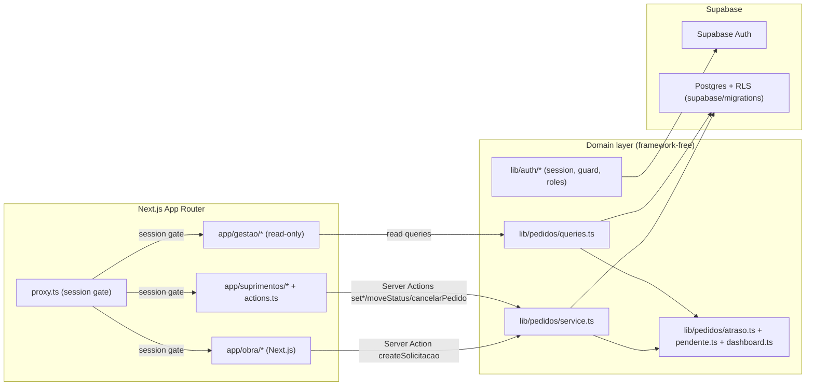
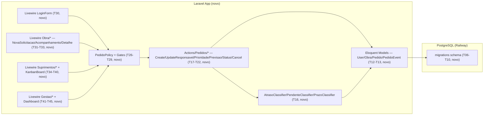

# Implementation Plan

## Request Summary
- Objective: Reimplement the full V0 "Sistema Interno de Solicitações e Compras" — currently Next.js 16/React 19/Supabase (Auth + Postgres + RLS) — as an idiomatic Laravel + Livewire + Blade + PostgreSQL application deployable to Railway, preserving 100% of behavior/rules/data literals frozen as RIGID in SPEC.md (33 brief §47 acceptance criteria, RF-01..RF-26, UI-01..UI-08, RNF-01..RNF-08, CT-01), with zero silent scope loss (RF-25) and zero silent scope growth (brief §40 exclusions).
- Scope: In — Laravel app bootstrap, Livewire, Laravel Boost, PostgreSQL migrations/schema, Eloquent domain layer, auth, authorization (Policies/Gates), audit history, Obra/Suprimentos/Gestão flows, Kanban (operational + read-only), dashboard, demo seeders, Pest/PHPUnit suite, E2E validation, Next.js/Supabase dependency removal, docs, Railway prep. Out — ERP/fornecedores/cotações/financeiro/pagamentos/catálogo-SKU obrigatório/entrega parcial/notificações externas/aprovações complexas/integrações externas/microserviços/Redis-filas-workers-cron sem necessidade comprovada; self-signup público; edição de solicitação pós-envio pela Obra; reabertura de pedido terminal.
- Tier: complete
- Architecture references: `AGENTS.md` (Next.js gate, informational only — target stack is Laravel), `docs/agents/architecture.md`, `docs/agents/domain_rules.md`, `docs/agents/project_overview.md`, `docs/agents/tech_stack.md`, `docs/agents/coding_guidelines.md`, `docs/agents/api_contracts.md`, `docs/agents/data_model.md`, `docs/agents/dependencies.md` — all read and used below as the AS IS behavioral source of truth. Init chain (`.spec/init/project-description.md`, `user-stories.md`, `database-schema.md`, `project-phases.md`) and `docs/migration/LARAVEL-MIGRATION-BRIEF.md` used as auxiliary grounding for phase ordering (brief §41's 22 steps, reorganized below into 14 technically-coherent phases).

## AS IS — Componentes impactados

Legenda: três árvores de rotas Next.js sobre uma camada de domínio framework-free (`lib/pedidos`, `lib/auth`), com autorização dupla (checks em `service.ts` + RLS em `SupaPg`) — verificado em `docs/agents/architecture.md`/`domain_rules.md`. Este é o comportamento que a reimplementação Laravel deve preservar.

## TO BE — Componentes propostos

Legenda: substitui `proxy.ts`+RLS por `auth:web` middleware + `PedidoPolicy`/Gates (T24-T29); substitui `lib/pedidos/service.ts` por Actions de domínio (T17-T23) que continuam pareando toda mutação com um evento de histórico; substitui `lib/pedidos/atraso.ts`/`pendente.ts`/`dashboard.ts` por classifiers PHP únicos (T16) reutilizados por Kanban (T35-T38), listagens (T32/T34) e dashboard (T43-T44); toda a app é promovida à raiz do repositório em T54 após validação completa (T51/T52).

## Tasks

### T01 — Scaffold Laravel application skeleton
- **Files**: `laravel/composer.json`, `laravel/artisan`, `laravel/.env.example`, `laravel/config/app.php`
- **Change**: `composer create-project laravel/laravel laravel` in a dedicated subdirectory (avoids collision with existing Next.js `app/`, `lib/`, `components/`, `package.json`, `tsconfig.json` at repo root per brief §42 "não remover prematuramente"); configure `APP_NAME`/base config.
- **Covers**: RF-01, RNF-02 (partial), RNF-06 (env skeleton)
- **Tests**: `laravel/tests/Feature/BootstrapTest.php` — root route responds 200 after fresh install.
- **Risk**: Low — foundational, low blast radius.
- **Dependencies**: none

### T02 — Install and configure Livewire
- **Files**: `laravel/composer.json`, `laravel/resources/views/layouts/app.blade.php`, `laravel/app/Providers/AppServiceProvider.php`
- **Change**: `composer require livewire/livewire`; base layout includes `@livewireStyles`/`@livewireScripts`.
- **Covers**: RF-03
- **Tests**: `laravel/tests/Feature/LivewireSmokeTest.php` — a trivial Livewire component mounts and renders via `Livewire::test`.
- **Risk**: Low
- **Dependencies**: T01

### T03 — Install and configure Laravel Boost + Claude Code integration
- **Files**: `laravel/composer.json` (`require-dev laravel/boost`), Boost-generated config/guideline files, stub note in README (full doc in T55)
- **Change**: `composer require laravel/boost --dev`; run the package's install/configure step; verify Claude Code MCP integration is wired.
- **Covers**: RF-02
- **Tests**: no automated test (tooling install) — verified by `composer.json` containing `laravel/boost` in `require-dev` (checked in T56/traceability audit).
- **Risk**: Low
- **Dependencies**: T01

### T04 — Configure Vite + Tailwind CSS pipeline
- **Files**: `laravel/vite.config.js`, `laravel/package.json`, `laravel/resources/css/app.css`, `laravel/tailwind.config.js`
- **Change**: install/configure Tailwind for Blade content paths; wire the Vite build script for production assets.
- **Covers**: RNF-01
- **Tests**: build verification gate — `npm run build` (in `laravel/`) documented to exit 0; asserted in T51/CI gate.
- **Risk**: Low
- **Dependencies**: T01

### T05 — Configure Pest/PHPUnit test runner
- **Files**: `laravel/tests/Pest.php`, `laravel/phpunit.xml`, `laravel/tests/TestCase.php`
- **Change**: configure the testing DB connection (`pgsql`, dedicated test DB, `RefreshDatabase`/transactions).
- **Covers**: RF-23 (foundation)
- **Tests**: `laravel/tests/Feature/ExampleTest.php` — baseline test passes.
- **Risk**: Low
- **Dependencies**: T01

### T06 — Configure PostgreSQL connection via environment variables
- **Files**: `laravel/config/database.php`, `laravel/.env.example`
- **Change**: default connection `pgsql`; all credentials (`DB_HOST`, `DB_PORT`, `DB_DATABASE`, `DB_USERNAME`, `DB_PASSWORD`) sourced from env vars only, no Supabase SDK.
- **Covers**: RF-04
- **Tests**: `laravel/tests/Feature/DatabaseConnectionTest.php` — connects to Postgres and runs a trivial query.
- **Risk**: Medium — misconfiguration blocks every later phase.
- **Dependencies**: T01

### T07 — Migration: lookup tables (`roles`, `statuses`, `priorities`, `event_types`)
- **Files**: `laravel/database/migrations/*_create_roles_table.php` (+ statuses, priorities, event_types)
- **Change**: 4 lookup tables, `slug` unique, `sort_order` on statuses/priorities, `is_active`, timestamps — FK never a DB enum (coding_guidelines pattern 1).
- **Covers**: RF-05, RF-26
- **Tests**: `laravel/tests/Feature/MigrationSchemaTest.php` — `migrate:fresh` creates expected columns/constraints per table.
- **Risk**: Medium
- **Dependencies**: T06

### T08 — Migration: `users` identity with `role_id`
- **Files**: `laravel/database/migrations/*_add_role_and_profile_fields_to_users_table.php`
- **Change**: adapt Laravel's default `users` migration (brief §15 "users-centric identity") adding `role_id` FK, `is_active`, `is_demo`; no self-signup insert path.
- **Covers**: RF-05, RF-26, RF-07 (schema support)
- **Tests**: `laravel/tests/Feature/MigrationSchemaTest.php` — asserts `users.role_id` FK and `is_demo` column.
- **Risk**: Medium
- **Dependencies**: T07

### T09 — Migration: `obras`, `obra_profile` pivot
- **Files**: `laravel/database/migrations/*_create_obras_table.php`, `*_create_obra_profile_table.php`
- **Change**: `obras` (`name`, `is_active`, `is_demo`, timestamps); `obra_profile` composite PK `(obra_id, user_id)`, many-to-many.
- **Covers**: RF-05, RF-10, RF-26
- **Tests**: `laravel/tests/Feature/MigrationSchemaTest.php` — asserts composite PK + FKs.
- **Risk**: Low
- **Dependencies**: T08

### T10 — Migration: `pedidos`, `pedido_events`, query indexes
- **Files**: `laravel/database/migrations/*_create_pedidos_table.php`, `*_create_pedido_events_table.php`, `*_add_pedidos_query_indexes.php`
- **Change**: full `pedidos` columns per `docs/agents/data_model.md`; `pedido_events` append-only (no `updated_at`); indexes `(obra_id, status_id)`, `(needed_at)`, `(pedido_id, created_at)`.
- **Covers**: RF-05, RF-26, RNF-07 (index support)
- **Tests**: `laravel/tests/Feature/MigrationSchemaTest.php` — asserts columns/FKs/indexes; asserts `pedido_events` has no update-capable column.
- **Risk**: Medium
- **Dependencies**: T09

### T11 — Migrate-from-zero verification
- **Files**: `laravel/tests/Feature/FreshMigrationTest.php`
- **Change**: n/a (test-only) — run `migrate:fresh` against an empty test DB, assert success and all expected tables exist.
- **Covers**: RF-05
- **Tests**: same file
- **Risk**: Low
- **Dependencies**: T10

### T12 — Eloquent Models for lookup tables
- **Files**: `laravel/app/Models/Role.php`, `Status.php`, `Priority.php`, `EventType.php`
- **Change**: `$fillable`, relations, `sort_order`-based scopes.
- **Covers**: RF-26
- **Tests**: `laravel/tests/Unit/Models/LookupModelsTest.php`
- **Risk**: Low
- **Dependencies**: T10

### T13 — Eloquent Models: `User`, `Obra`, `Pedido`, `PedidoEvent`
- **Files**: `laravel/app/Models/User.php`, `Obra.php`, `Pedido.php`, `PedidoEvent.php`
- **Change**: `User belongsTo Role`, `belongsToMany Obra` via `obra_profile`; `Pedido belongsTo Obra/Status/Priority/requester/responsible`; `PedidoEvent belongsTo Pedido/EventType/actor`; explicit `$fillable`/`$guarded` (RNF-08).
- **Covers**: RF-26, RNF-08
- **Tests**: `laravel/tests/Unit/Models/PedidoModelTest.php`, `laravel/tests/Feature/ObraProfileCardinalityTest.php` — many-to-many cardinality confirmed.
- **Risk**: Medium
- **Dependencies**: T12

### T14 — PHP Enums for frozen slugs
- **Files**: `laravel/app/Enums/RoleSlug.php`, `StatusSlug.php`, `PrioritySlug.php`, `EventTypeSlug.php`
- **Change**: backed enums matching the RIGID literal set (`obra/suprimentos/gestao`; the 6 statuses; the 4 priorities; the 7 event types).
- **Covers**: RF-26 (supports RF-08/08b/08c, RF-13, RF-15, RF-18)
- **Tests**: `laravel/tests/Unit/Enums/SlugEnumsTest.php` — values match RIGID literals exactly.
- **Risk**: Low
- **Dependencies**: T12

### T15 — Pedido code generator (`PED-######`)
- **Files**: `laravel/app/Services/PedidoCodeGenerator.php`, `laravel/database/migrations/*_create_pedido_code_sequence.php`
- **Change**: DB-sequence-backed generator, format `PED-000001`, safe under concurrent creation.
- **Covers**: RF-26 (supports RF-11; format itself is FLEXIBLE per SPEC)
- **Tests**: `laravel/tests/Unit/Services/PedidoCodeGeneratorTest.php` — concurrent calls never collide; format matches `^PED-\d{6}$`.
- **Risk**: Medium — concurrency correctness.
- **Dependencies**: T13

### T16 — Atraso/Pendente/Prazo domain classifiers (single source of truth)
- **Files**: `laravel/app/Domain/Pedidos/AtrasoClassifier.php`, `PendenteClassifier.php`, `PrazoClassifier.php`
- **Change**: pure, reused functions; `PrazoClassifier` uses `VENCENDO_EM_BREVE_DIAS = 3` as a named PHP constant, never runtime-configurable.
- **Covers**: RF-19, RF-19b, RF-19c
- **Tests**: `laravel/tests/Unit/Domain/AtrasoClassifierTest.php` (4-combination matrix), `PendenteClassifierTest.php` (7-status matrix), `PrazoClassifierTest.php` (3-day window parametrized: within/above/overdue/non-pendente).
- **Risk**: Medium — must remain the only reused source (coding_guidelines pattern 2); every later consumer (T32, T34, T35, T43) must call these, never re-derive.
- **Dependencies**: T14

### T17 — `CreatePedidoAction` (RF-11/RF-11b/RF-11c)
- **Files**: `laravel/app/Actions/Pedidos/CreatePedidoAction.php`
- **Change**: validates `obra_id`/`needed_at`/`items_description` required (RF-11b); validates `obra_id` ∈ requester's `obra_profile` server-side regardless of UI payload (RF-11c); assigns lowest-`sort_order` status; generates code (T15); inserts `pedidos` row + `criacao_pedido` event in one DB transaction (rollback on event failure).
- **Covers**: RF-11, RF-11b, RF-11c, RF-18, CT-01
- **Tests**: `laravel/tests/Feature/Actions/CreatePedidoActionTest.php` — valid creation; each of the 3 required fields missing rejected; `obra_id` outside association rejected including a directly-manipulated payload; exactly 1 `criacao_pedido` event per success; transactional rollback on event-insert failure.
- **Risk**: High — core creation path + atomicity guarantee.
- **Dependencies**: T16

### T18 — `UpdatePedidoResponsavelAction` (RF-14/RF-14b)
- **Files**: `laravel/app/Actions/Pedidos/UpdatePedidoResponsavelAction.php`, `laravel/app/Rules/ResponsibleMustBeSuprimentos.php`
- **Change**: `suprimentos`-only; validates `responsible_id` belongs to a `suprimentos`-role user server-side even on direct payload; no-op when unchanged (no event); rejects on terminal pedido (RF-13b); event `alteracao_responsavel`.
- **Covers**: RF-14, RF-14b, RF-13b (partial), RF-18
- **Tests**: `laravel/tests/Feature/Actions/UpdatePedidoResponsavelActionTest.php` — success + event; no-op no event; non-`suprimentos` actor rejected; non-`suprimentos` responsible rejected via tampered payload; terminal pedido rejected.
- **Risk**: Medium
- **Dependencies**: T17

### T19 — `UpdatePedidoPrioridadeAction` (RF-15)
- **Files**: `laravel/app/Actions/Pedidos/UpdatePedidoPrioridadeAction.php`
- **Change**: `suprimentos`-only; `priority_id` restricted to the 4 seeded values; no-op when unchanged; rejects on terminal pedido; event `alteracao_prioridade`.
- **Covers**: RF-15, RF-13b (partial), RF-18
- **Tests**: `laravel/tests/Feature/Actions/UpdatePedidoPrioridadeActionTest.php`
- **Risk**: Medium
- **Dependencies**: T17

### T20 — `UpdatePedidoPrevisaoAction` (RF-16)
- **Files**: `laravel/app/Actions/Pedidos/UpdatePedidoPrevisaoAction.php`
- **Change**: `suprimentos`-only; no-op when date unchanged; rejects on terminal pedido; event `alteracao_previsao`.
- **Covers**: RF-16, RF-13b (partial), RF-18
- **Tests**: `laravel/tests/Feature/Actions/UpdatePedidoPrevisaoActionTest.php`
- **Risk**: Medium
- **Dependencies**: T17

### T21 — `UpdatePedidoStatusAction` (workflow matrix, RF-13/RF-13b)
- **Files**: `laravel/app/Actions/Pedidos/UpdatePedidoStatusAction.php`
- **Change**: `suprimentos`-only; target ∈ `ACTIVE_NON_FINAL_STATUSES` ∪ `{entregue}`; rejects `cancelado` as a target via this action; rejects any transition when current status is terminal; event `mudanca_status` (or `entrega` when target is `entregue`).
- **Covers**: RF-13, RF-13b, RF-18, UI-07 (backend half)
- **Tests**: `laravel/tests/Feature/Actions/UpdatePedidoStatusActionTest.php` — parametrized 4 permitted transitions × 4 non-terminal origins; reject `cancelado` target; reject terminal-origin mutation; reject a forged drag-and-drop-shaped payload from a non-`suprimentos` actor.
- **Risk**: High — core workflow protection surface.
- **Dependencies**: T17

### T22 — `CancelPedidoAction` (RF-17/RF-17b)
- **Files**: `laravel/app/Actions/Pedidos/CancelPedidoAction.php`
- **Change**: `suprimentos`-only; only from non-terminal status; sets `cancelado` (irreversible — no function reopens it); event `cancelamento`.
- **Covers**: RF-17, RF-17b, RF-13b, RF-18
- **Tests**: `laravel/tests/Feature/Actions/CancelPedidoActionTest.php` — cancel active succeeds + event; cancel `entregue` rejected; cancel `cancelado` rejected; `obra` and `gestao` actors rejected.
- **Risk**: Medium
- **Dependencies**: T17

### T23 — `PedidoEvent` immutability guard
- **Files**: `laravel/app/Models/PedidoEvent.php`, `laravel/app/Policies/PedidoEventPolicy.php`
- **Change**: no update/delete route or action exists anywhere; model-level guard raises on any save-after-create/delete attempt (defense in depth beyond "no route exists").
- **Covers**: RF-18 (AC: no UPDATE/DELETE route for history)
- **Tests**: `laravel/tests/Unit/Models/PedidoEventImmutabilityTest.php`
- **Risk**: Low
- **Dependencies**: T13

### T24 — Session-based authentication (login/logout)
- **Files**: `laravel/app/Livewire/Auth/LoginForm.php` (backing class), `laravel/routes/web.php`
- **Change**: email/password via `auth:web` guard, Laravel's default `bcrypt` hashing; invalid credentials never authenticate.
- **Covers**: RF-07, RNF-08 (hashing)
- **Tests**: `laravel/tests/Feature/Auth/LoginTest.php` — valid login creates session; invalid rejected without session; stored password is hashed, never plaintext.
- **Risk**: Medium
- **Dependencies**: T13

### T25 — `auth:web` middleware + unauthenticated redirect
- **Files**: `laravel/routes/web.php`, `laravel/app/Http/Middleware/Authenticate.php`
- **Change**: every non-login route requires `auth:web`; unauthenticated request redirects to `/login`.
- **Covers**: RF-09 (baseline gate)
- **Tests**: `laravel/tests/Feature/Auth/UnauthenticatedAccessTest.php`
- **Risk**: Low
- **Dependencies**: T24

### T26 — Role Gates (`is-obra`, `is-suprimentos`, `is-gestao`)
- **Files**: `laravel/app/Providers/AppServiceProvider.php` (`Gate::define`)
- **Change**: reusable coarse role gates backing Policies and Livewire component authorization.
- **Covers**: RF-08, RF-08b, RF-08c (foundation)
- **Tests**: `laravel/tests/Feature/Authorization/RoleGatesTest.php`
- **Risk**: Low
- **Dependencies**: T24

### T27 — `PedidoPolicy` (view/create/5 mutations)
- **Files**: `laravel/app/Policies/PedidoPolicy.php`
- **Change**: `view` → `obra` scoped to `obra_profile`, `suprimentos`/`gestao` unrestricted; `create` → `obra` role + `obra_profile` membership (defense in depth alongside T17); the 5 operational mutations → `suprimentos` only; `gestao` never authorized to write.
- **Covers**: RF-08, RF-08b, RF-08c, RF-09, RF-10, RF-17b, RF-20
- **Tests**: `laravel/tests/Feature/Authorization/PedidoPolicyTest.php` — `obra` denied on all 5 mutations; `suprimentos` allowed on all 5; `gestao` denied on all 5; `obra` denied read/write on an unassociated obra's pedido (403/404, no existence leak); `obra` associated to multiple obras sees pedidos from all of them.
- **Risk**: High — central authorization surface; misconfiguration risks data leakage across obras/roles.
- **Dependencies**: T26, T18, T19, T20, T21, T22

### T28 — Backend-enforced authorization bypassing the UI
- **Files**: `laravel/tests/Feature/Authorization/BypassUiAuthorizationTest.php`
- **Change**: n/a (test-only) — call the Livewire component's public method / the Action class directly, without rendering the guarded UI control, and assert the Policy still rejects unauthorized actors.
- **Covers**: RF-09
- **Tests**: same file
- **Risk**: Medium
- **Dependencies**: T27

### T29 — Responsible-selector role restriction wiring
- **Files**: `laravel/app/Rules/ResponsibleMustBeSuprimentos.php` (from T18), Livewire selector query used by T39
- **Change**: selector query scoped to `suprimentos`-role users; backend rule rejects any other `responsible_id`.
- **Covers**: RF-14b
- **Tests**: `laravel/tests/Feature/Rules/ResponsibleMustBeSuprimentosTest.php`
- **Risk**: Medium
- **Dependencies**: T18, T27

### T30 — Livewire Login page/component
- **Files**: `laravel/app/Livewire/Auth/LoginForm.php`, `laravel/resources/views/livewire/auth/login-form.blade.php`, `laravel/resources/views/auth/login.blade.php`
- **Change**: Livewire form wired to T24; native CSRF; validation errors surfaced.
- **Covers**: RF-03, RF-07, UI-01
- **Tests**: `laravel/tests/Feature/Livewire/LoginFormTest.php` — `Livewire::test(...)->assertSet/assertSee`.
- **Risk**: Low
- **Dependencies**: T24

### T31 — Livewire "Nova Solicitação" component
- **Files**: `laravel/app/Livewire/Obra/NovaSolicitacao.php`, `laravel/resources/views/livewire/obra/nova-solicitacao.blade.php`
- **Change**: obra select restricted to the user's `obra_profile`; `needed_at` date picker; `items_description` textarea; calls `CreatePedidoAction` (T17); shows the generated `code` on success.
- **Covers**: RF-03, RF-11, RF-11b, RF-11c, UI-01
- **Tests**: `laravel/tests/Feature/Livewire/NovaSolicitacaoTest.php` — success path; each missing field rejected server-side; `obra_id` outside association rejected even when set directly via `Livewire::test(...)->set('obra_id', ...)` bypassing the select options.
- **Risk**: Medium
- **Dependencies**: T17, T27

### T32 — Livewire "Acompanhamento" listing (Obra)
- **Files**: `laravel/app/Livewire/Obra/Acompanhamento.php`, `laravel/resources/views/livewire/obra/acompanhamento.blade.php`
- **Change**: paginated listing scoped to the user's associated obras; shows status/priority/responsible/previsão/atraso via T16.
- **Covers**: RF-03, RF-11, UI-01, RNF-07
- **Tests**: `laravel/tests/Feature/Livewire/AcompanhamentoTest.php` — only own-obra pedidos listed; query count constant across a 5-pedido vs 50-pedido dataset.
- **Risk**: Medium
- **Dependencies**: T27, T16

### T33 — Livewire Detalhe (Obra, read-only) with history timeline
- **Files**: `laravel/app/Livewire/Obra/PedidoDetalhe.php`, `laravel/resources/views/livewire/obra/pedido-detalhe.blade.php`, `laravel/resources/views/components/pedido-history-timeline.blade.php`
- **Change**: read-only detail, no edit controls; ordered event timeline; access to an unassociated obra's pedido denied.
- **Covers**: RF-03, RF-11, UI-01, UI-04
- **Tests**: `laravel/tests/Feature/Livewire/PedidoDetalheObraTest.php` — `criacao_pedido` event visible after full create flow; no edit form in rendered HTML; unassociated pedido access denied.
- **Risk**: Medium
- **Dependencies**: T27, T23

### T34 — Livewire "Todos os Pedidos" listing with RF-12 filter set
- **Files**: `laravel/app/Livewire/Suprimentos/TodosPedidos.php`, `laravel/resources/views/livewire/suprimentos/todos-pedidos.blade.php`
- **Change**: free-text search (código/obra/itens); boolean "Atraso" filter (reuses T16); independent date ranges `neededAtFrom`/`neededAtTo` and `requestedFrom`/`requestedTo`; paginated; eager-loaded relations.
- **Covers**: RF-12, UI-02, RNF-07
- **Tests**: `laravel/tests/Feature/Livewire/TodosPedidosFiltersTest.php` — each filter isolated and combined; "Atraso" filter matches `AtrasoClassifier` output; query count constant across dataset sizes.
- **Risk**: Medium
- **Dependencies**: T16, T27

### T35 — Kanban board component (Suprimentos, interactive)
- **Files**: `laravel/app/Livewire/Kanban/KanbanBoard.php`, `laravel/resources/views/livewire/kanban/kanban-board.blade.php`
- **Change**: 5 active columns ordered by `statuses.sort_order`; `cancelado` excluded; drag-and-drop dispatches to `UpdatePedidoStatusAction` (T21) through a policy-checked component method.
- **Covers**: RF-03, RF-12, UI-02, UI-03
- **Tests**: `laravel/tests/Feature/Livewire/KanbanBoardTest.php` — `assertSee` 5 columns in `sort_order`; `cancelado` never rendered in a column.
- **Risk**: High — most interactive surface, direct workflow-bypass risk.
- **Dependencies**: T21, T27, T16

### T36 — Kanban card component (7 required fields + atraso styling)
- **Files**: `laravel/resources/views/livewire/kanban/pedido-card.blade.php`
- **Change**: renders código/obra/data necessária/prioridade/responsável/previsão/atraso; atraso pedidos get a distinct CSS class.
- **Covers**: UI-03
- **Tests**: `laravel/tests/Feature/Livewire/PedidoCardRenderTest.php` — `assertSee` all 7 fields; atraso pedido carries the distinct class.
- **Risk**: Low
- **Dependencies**: T35, T16

### T37 — Drag-and-drop backend rejection + no UI reflection (UI-07)
- **Files**: `laravel/app/Livewire/Kanban/KanbanBoard.php` (`moveCard` method)
- **Change**: n/a beyond existing method — verified by test: a forged move (invalid transition, or actor not `suprimentos`) called directly on the component is rejected server-side and the card position is unchanged after reload.
- **Covers**: UI-07, RF-13b
- **Tests**: `laravel/tests/Feature/Livewire/KanbanForgedMoveTest.php`
- **Risk**: Medium
- **Dependencies**: T35, T21

### T38 — Accessible non-drag status control (UI-08)
- **Files**: `laravel/resources/views/livewire/kanban/pedido-card.blade.php`, `laravel/app/Livewire/Kanban/KanbanBoard.php` (`moveViaControl` method)
- **Change**: keyboard-accessible selector/button moving a pedido across the workflow without drag-and-drop, same result/event as T35.
- **Covers**: UI-08
- **Tests**: `laravel/tests/Feature/Livewire/AccessibleStatusControlTest.php` — full workflow traversal using only the accessible control.
- **Risk**: Low
- **Dependencies**: T35

### T39 — Pedido detail (Suprimentos) with all 5 operational controls
- **Files**: `laravel/app/Livewire/Suprimentos/PedidoDetalhe.php`, `laravel/resources/views/livewire/suprimentos/pedido-detalhe.blade.php`
- **Change**: responsável/prioridade/previsão/status/cancelamento controls wired to T18–T22 + T27; controls hidden/disabled once the pedido reaches a terminal status.
- **Covers**: RF-12, UI-02, RF-14, RF-15, RF-16, RF-13, RF-13b
- **Tests**: `laravel/tests/Feature/Livewire/PedidoDetalheSuprimentosTest.php` — each of the 5 controls functional; controls disabled/absent for a terminal pedido.
- **Risk**: Medium
- **Dependencies**: T18, T19, T20, T21, T29

### T40 — Cancellation confirmation control
- **Files**: `laravel/resources/views/livewire/suprimentos/pedido-detalhe.blade.php`, `laravel/app/Livewire/Suprimentos/PedidoDetalhe.php` (`cancel` method)
- **Change**: confirmation dialog before the irreversible cancellation; wired to `CancelPedidoAction` (T22).
- **Covers**: RF-17, RF-17b, UI-02
- **Tests**: `laravel/tests/Feature/Livewire/CancelPedidoControlTest.php`
- **Risk**: Low
- **Dependencies**: T39, T22

### T41 — Gestão read-only "Todos os Pedidos" + Kanban (UI-05)
- **Files**: `laravel/app/Livewire/Gestao/TodosPedidos.php`, `laravel/app/Livewire/Gestao/KanbanReadOnly.php`
- **Change**: reuse T34's filter set (identical to Suprimentos, per RF-20 AC) in read-only mode; reuse T35's Kanban board with mutation controls stripped.
- **Covers**: RF-20, UI-05
- **Tests**: `laravel/tests/Feature/Livewire/GestaoKanbanReadOnlyTest.php` — no `wire:click` mutation control rendered; filter set matches T34's.
- **Risk**: Medium
- **Dependencies**: T34, T35, T27

### T42 — Gestão pedido detail (read-only reuse)
- **Files**: `laravel/app/Livewire/Gestao/PedidoDetalhe.php`
- **Change**: reuse the T33 read-only detail pattern for the `gestao` role.
- **Covers**: RF-20, UI-05
- **Tests**: `laravel/tests/Feature/Livewire/PedidoDetalheGestaoTest.php`
- **Risk**: Low
- **Dependencies**: T33, T27

### T43 — Dashboard indicators (volume/pendentes/atrasados/distribuição/prazos/por-obra)
- **Files**: `laravel/app/Livewire/Gestao/Dashboard.php`, `laravel/app/Services/DashboardIndicatorsService.php`, `laravel/resources/views/livewire/gestao/dashboard.blade.php`
- **Change**: single aggregation service reusing T16's classifiers exclusively — no duplicated atraso/pendente logic; all 6 indicators computed from one shared query/dataset.
- **Covers**: RF-21, UI-06
- **Tests**: `laravel/tests/Feature/Livewire/DashboardIndicatorsTest.php` — "atrasados" count identical to the `AtrasoClassifier`-derived count on the same dataset; distribuição-por-status sums to volume total; visão-por-obra sums to volume total.
- **Risk**: High — cross-cutting consistency requirement (RF-21's core AC).
- **Dependencies**: T16, T27

### T44 — Dashboard filters (período/obra/status/prioridade/responsável)
- **Files**: `laravel/app/Livewire/Gestao/Dashboard.php`
- **Change**: 5 combinable filters, each updating all indicators consistently.
- **Covers**: RF-21, UI-06
- **Tests**: `laravel/tests/Feature/Livewire/DashboardFiltersTest.php` — each filter alters indicators consistent with the filtered dataset.
- **Risk**: Medium
- **Dependencies**: T43

### T45 — Drill-down from indicator to filtered listing (RF-22, optional)
- **Files**: `laravel/app/Livewire/Gestao/Dashboard.php`, `laravel/routes/web.php`
- **Change**: clicking "atrasados"/"pendentes" navigates to T34's listing pre-filtered accordingly.
- **Covers**: RF-22
- **Tests**: `laravel/tests/Feature/Livewire/DashboardDrillDownTest.php` — drill-down result count matches the indicator count.
- **Risk**: Low
- **Dependencies**: T43, T34

### T46 — Idempotent demo seeder
- **Files**: `laravel/database/seeders/DemoSeeder.php`, `laravel/database/seeders/DatabaseSeeder.php`
- **Change**: idempotent (upsert-by-natural-key) creation of 3 demo users (obra/suprimentos/gestão) plus a multi-obra obra user, obras, and pedidos spanning statuses/priorities/responsáveis, ≥1 atrasado, ≥1 entregue; `is_demo = true`; `[DEMO]`-prefixed names.
- **Covers**: RF-06
- **Tests**: `laravel/tests/Feature/Seeders/DemoSeederIdempotencyTest.php` — running twice yields identical counts, no unique violation; every created row has `is_demo = true`.
- **Risk**: Medium
- **Dependencies**: T17, T18, T19, T20, T21, T22, T13

### T47 — Demo reset command
- **Files**: `laravel/app/Console/Commands/ResetDemoData.php`
- **Change**: artisan command deleting only `is_demo = true` rows (cascading to `pedido_events`/`obra_profile`), never touching `is_demo = false` rows.
- **Covers**: RF-06 (lifecycle)
- **Tests**: `laravel/tests/Feature/Console/ResetDemoDataTest.php` — mixed real+demo dataset: reset removes only demo rows, preserves real rows integrally.
- **Risk**: Medium — destructive command; scoped strictly by `is_demo` flag.
- **Dependencies**: T46

### T48 — Test coverage traceability map (brief §30 themes)
- **Files**: `laravel/tests/README.md`
- **Change**: table mapping each of the 18 brief §30 themes (auth, unauthenticated user, authorization, obra isolation, user/obra association, pedido creation, form validation, workflow, valid/invalid transitions, responsável, prioridade, previsão, cancelamento, atraso calculation, histórico, dashboard, Suprimentos permissions, Gestão read-only) to the concrete test file(s) from T17–T47.
- **Covers**: RF-23
- **Tests**: n/a (documentation) — completeness cross-checked against `php artisan test` output in T51.
- **Risk**: Low
- **Dependencies**: T17–T47

### T49 — N+1 / pagination performance tests (RNF-07 consolidated)
- **Files**: `laravel/tests/Feature/Performance/QueryCountTest.php`
- **Change**: n/a (test-only) — assert query count stays constant across a 5-pedido vs 50-pedido dataset for T32/T34 listings, T35 Kanban, and T43 dashboard.
- **Covers**: RNF-07
- **Tests**: same file
- **Risk**: Medium
- **Dependencies**: T32, T34, T35, T43

### T50 — Security hardening tests (CSRF, mass assignment, escaping)
- **Files**: `laravel/tests/Feature/Security/CsrfProtectionTest.php`, `MassAssignmentTest.php`, `laravel/tests/Feature/Security/BladeEscapingTest.php`
- **Change**: n/a (test-only) — assert mutating forms carry a valid CSRF token (rejected without one); Models declare explicit `$fillable`; no `{!! !!}` used for unsanitized user content.
- **Covers**: RNF-08
- **Tests**: same files
- **Risk**: Medium
- **Dependencies**: T13, T30, T31, T39, T43

### T51 — Full suite green run + exit-code verification
- **Files**: `laravel/composer.json` (`test` script)
- **Change**: n/a (verification gate) — `php artisan test` / `vendor/bin/pest` passes with exit code 0 across the entire suite (T17–T50).
- **Covers**: RF-23
- **Tests**: n/a (gate)
- **Risk**: Low
- **Dependencies**: T48, T49, T50

### T52 — E2E script for the 19-step roteiro
- **Files**: `laravel/tests/Browser/DemoRoteiroTest.php` (Laravel Dusk) — see Assumptions for the tool choice
- **Change**: automates the 19 steps of brief §31 against demo seed data (T46), asserting persisted state and visible UI at each step (login Obra → criar solicitação → confirmação → Suprimentos no Kanban → responsável/prioridade/previsão → mover workflow → histórico → Obra confirma → Gestão dashboard/Kanban read-only → Suprimentos Entregue → histórico/indicadores atualizados).
- **Covers**: RF-24
- **Tests**: same file — a full pass satisfies AC-28.
- **Risk**: High — depends on the stability of every prior UI phase; run only after T51 is green.
- **Dependencies**: T30, T31, T32, T33, T34, T35, T39, T40, T41, T42, T43, T46

### T53 — Remove Supabase runtime dependencies from the Laravel app
- **Files**: `laravel/composer.json`, `laravel/.env.example`
- **Change**: n/a beyond verification — confirm no Supabase SDK/API call exists anywhere in `laravel/`.
- **Covers**: RNF-03
- **Tests**: `laravel/tests/Feature/Compliance/NoSupabaseDependencyTest.php` — grep-based assertion across `laravel/`.
- **Risk**: Low
- **Dependencies**: T06

### T54 — Promote Laravel app to repo root; retire Next.js runtime
- **Files**: repo root — move `laravel/*` to root; remove/relocate `app/` (Next.js), `components/`, `lib/`, `next.config.ts`, `proxy.ts`, `package.json`/`tsconfig.json` (Next.js), `supabase/` (git history preserves them per brief §42, not deleted from history)
- **Change**: production start/build no longer invokes `next build`/`next start`; Laravel becomes the sole served application at repo root; only performed after T51 and T52 are green (brief §42 sequencing).
- **Covers**: RNF-04, RF-01 (final location)
- **Tests**: `laravel/tests/Feature/Compliance/NoNextJsDependencyTest.php` — no `next build`/`next start` in deploy scripts; root `package.json` (if retained for Vite) has no `next`/`react` runtime dependency.
- **Risk**: High — destructive, repo-wide move; mitigated by running only after full test/E2E green and by preserving history (no `git rm --force` of tracked history, plain removal via a reviewable commit).
- **Dependencies**: T51, T52, T53

### T55 — README rewrite (install/config/migrate/seed/run/test/demo creds)
- **Files**: `README.md` (repo root, post-promotion)
- **Change**: covers the 10 steps of brief §43 (PHP deps, frontend deps, `.env`, PostgreSQL config, `APP_KEY`, migrations, seed demo, start Laravel, access app, authenticate with demo user) plus test-running instructions and demo credentials (no real secrets).
- **Covers**: RNF-02, RNF-05, RF-02 (documentation completion)
- **Tests**: n/a (documentation) — walked through manually as part of RNF-02's AC.
- **Risk**: Low
- **Dependencies**: T54

### T56 — Requirement traceability matrix (RF-25, AC-33)
- **Files**: `.spec/features/reimplementacao-v0-laravel-livewire/TRACEABILITY.md`
- **Change**: table mapping every rule in `docs/agents/domain_rules.md` + every RF in this SPEC + every action in `docs/agents/api_contracts.md` to its Laravel equivalent (file + test); any gap flagged with a brief §40 justification or an explicit `[NEEDS CLARIFICATION]` — never silently resolved.
- **Covers**: RF-25
- **Tests**: n/a (audit document) — AC-33 is explicitly "Parcial — requer auditoria manual complementar" per SPEC; this document is that audit artifact.
- **Risk**: Medium — easy to under-cover on a system this size; mitigated by deriving every row directly from an already-read AS IS source file.
- **Dependencies**: T17–T52

### T57 — Environment variable & production config documentation
- **Files**: `README.md` (Railway section), `laravel/.env.example`
- **Change**: document `APP_NAME`/`APP_ENV`/`APP_KEY`/`APP_DEBUG`/`APP_URL` + PostgreSQL vars; `APP_DEBUG=false` + `migrate --force` documented for production; `config:cache`/`route:cache`/`view:cache` documented for the deploy step.
- **Covers**: RNF-06
- **Tests**: n/a (documentation) — secrets-absence verified in T58.
- **Risk**: Low
- **Dependencies**: T55

### T58 — No committed secrets verification
- **Files**: `.gitignore` (repo root, post-promotion), `laravel/tests/Feature/Compliance/NoCommittedSecretsTest.php`
- **Change**: confirm `.env` is untracked, `.gitignore` covers it; grep for secret-shaped values across the repo returns only placeholders/examples.
- **Covers**: RNF-06, RNF-05
- **Tests**: same file
- **Risk**: Low
- **Dependencies**: T57

## Execution Phases
| Phase | Tasks | Parallel-safe? |
|-------|-------|----------------|
| 1 | T01–T05 | No — T02/T03/T05 all touch `laravel/composer.json` |
| 2 | T06–T11 | No — migrations are FK-ordered even though files differ |
| 3 | T12–T23 | No — long dependency chain (Models → Enums → Classifiers → Actions) |
| 4 | T24–T25 | No — T25 depends directly on T24 |
| 5 | T26–T29 | No — shared `AppServiceProvider`/Policy surface |
| 6 | T30–T33 | No — shared layout/Blade partials across Obra screens |
| 7 | T34–T40 | No — heavy interdependency around the shared Kanban component |
| 8 | T41–T45 | No — reuse and extend T34/T35/T43 sequentially |
| 9 | T46–T47 | No — T47 depends on T46's dataset shape |
| 10 | T48–T51 | Partial — T49 and T50 are mutually parallel-safe after T48; T51 is a final gate |
| 11 | T52 | No — single task |
| 12 | T53–T54 | No — T54 is destructive and gated on T53 |
| 13 | T55–T56 | No — both are documentation gated on the post-promotion state |
| 14 | T57–T58 | No — T58 depends on T57's documented var list |

## Contracts emitted

Skipped — SPEC's CT-01 explicitly declares route/Livewire-action names and paths as FLEXIBLE implementation detail ("nome/path concreto é decisão de implementação Laravel"), and no REST/gRPC/async surface with concrete paths is declared RIGID anywhere in SPEC.md. `docs/agents/api_contracts.md` (AS IS) independently confirms "No REST or GraphQL surface exists." Emitting `openapi.yaml` would require inventing endpoint paths not present in any RIGID source, which the contract-emission rules explicitly forbid ("never invent a requirement — gap belongs in Open Questions"). CT-01's behavioral contract (auth+authorization check, success/structured-error shape, transactional pairing with a history event) is instead enforced inline by every Action task (T17–T22) and their Policy/test coverage (T27–T28).

## Risks
| Risk | Blast radius | Mitigation | Rollback |
|------|-------------|------------|----------|
| `PedidoPolicy` misconfiguration (T27) leaks obra-scoped data or over-grants mutation rights | All 3 roles, every pedido | Exhaustive authorization test matrix (T27/T28) before any UI wiring depends on it | Revert the Policy commit; UI tasks (T31+) fail their own auth tests immediately, surfacing the regression before merge |
| Dashboard/atraso logic drift (T16/T43) — a second, divergent atraso/pendente implementation appears in the dashboard aggregation | Gestão dashboard numbers silently disagree with Kanban/listings | Single classifier source (T16) reused by construction; T43's own test cross-checks its count against `AtrasoClassifier` output on the same dataset | Replace the duplicated logic with a call to T16's classifier; re-run T43's cross-check test |
| Kanban drag-and-drop backend bypass (T35/T37) — client-side manipulation forces an invalid transition | Workflow integrity for any pedido | Backend Action (T21) is the sole authority; forged-payload test (T37) exercises the bypass path directly | Action already rejects by design; no data-layer rollback needed, only a UI-layer fix if the test fails |
| Demo seeder non-idempotency (T46) — reseeding duplicates or violates uniqueness | Demo environment integrity, breaks E2E (T52) | Upsert-by-natural-key strategy + dedicated idempotency test run twice in CI | `ResetDemoData` (T47) clears `is_demo=true` rows before reseeding |
| Repo-root promotion (T54) — destructive move of Laravel from subdirectory, removal of Next.js runtime files | Entire repository working tree | Gated strictly behind T51 (full suite green) and T52 (E2E green); performed as a single reviewable commit, git history preserved per brief §42 | `git revert` the promotion commit; Next.js app remains fully recoverable from history |
| E2E script fragility (T52) — depends on the correctness of every prior UI phase | Release confidence / demo readiness | Run only after T51's full automated suite is green; script asserts persisted state at each of the 19 steps, not just UI presence | Fix the failing step's underlying UI/Action task; re-run T52 in isolation |
| Migration schema drift vs. AS IS (T07–T10) — an unintentionally dropped/renamed column silently changes behavior | Any feature reading/writing the affected column | Schema test (T11) plus traceability matrix (T56) cross-check every column against `docs/agents/data_model.md` | Add a corrective migration; re-run T11 |

## Open Questions

- AGENTS.md currently self-declares "This is NOT the Next.js you know" and is regenerated by `next dev`/`generate-agent-files.js` (per `AGENTS.md` itself). Once Next.js is retired at T54 (RNF-04), this file becomes stale/misleading for future agent sessions but no RIGID requirement in SPEC.md governs its fate. Recommend replacing it with a Laravel-appropriate agent-guidance file as part of T54/T55, but this is a repo-governance decision outside RIGID scope — confirm before T54 deletes the generator that produces it.
- SPEC's RF-24/AC-28 test tooling: brief §47 item 28 and RF-24's AC accept "script E2E automatizado (ou checklist manual documentado, quando automação não for tecnicamente razoável)." This plan assumes Laravel Dusk (T52) as the automated tool since Playwright targets a Node-served app and the final app is pgsql/Blade-served; if the team prefers keeping Playwright against the Laravel-served pages instead, T52's file path changes but its scope does not — flag before implementation if Dusk's ChromeDriver dependency conflicts with the target CI/Railway environment.

## Assumptions

- Laravel app is scaffolded in a `laravel/` subdirectory during the migration (T01) and promoted to the repository root only at T54, after full test/E2E validation — SPEC does not pin a directory layout, and Next.js currently occupies `app/`, `lib/`, `components/`, `package.json`, `tsconfig.json` at repo root, which would collide with Laravel's own conventional `app/` (Http/Models) and root-level `composer.json`/`package.json` if scaffolded in place. This preserves brief §42 ("não remover prematuramente a implementação Next.js") while giving both stacks non-conflicting paths during the overlap window.
- Identity model follows brief §15's "users-centric" option: a single `users` table carries `role_id` (T08) rather than a separate `profiles` table 1:1 with `users` — both are declared FLEXIBLE-equivalent for RF-26 as long as `obra_profile`'s many-to-many cardinality is preserved (verified in T13).
- Pest is assumed as the primary test-writing style (file names follow Pest conventions) while remaining PHPUnit-compatible, per SPEC's "Pest e/ou PHPUnit" — no RIGID requirement mandates one over the other.
- E2E automation tool is assumed to be Laravel Dusk (T52) rather than continuing with the existing Playwright suite, since the target app is Blade/Livewire-served rather than Node-served — flagged above as an Open Question in case the team prefers otherwise; either choice satisfies RF-24's AC.
- `obra_profile`'s pivot user-side column is assumed to rename from `profile_id` to `user_id` (T09) consistent with the users-centric identity assumption above; this is FLEXIBLE per brief §15 and does not change cardinality/behavior.
