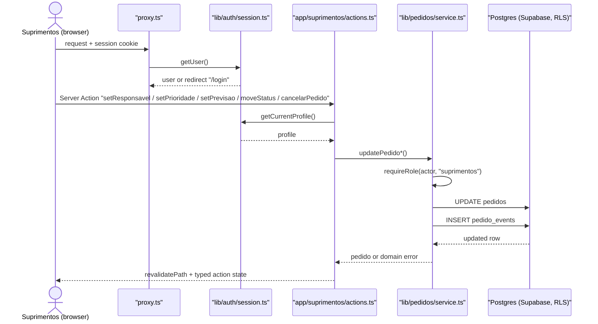
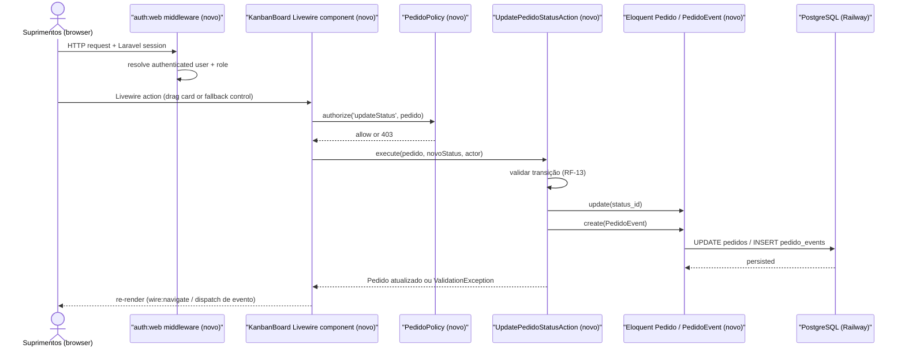

# SPEC: reimplementacao-v0-laravel-livewire

## Metadata
- Source: developer description via /plan (`docs/migration/LARAVEL-MIGRATION-BRIEF.md`)
- Service: Sistema Interno de Solicitações e Compras (V0 → Laravel rewrite, branch `build/v0-demo-laravel`)
- Tier: complete
- Version: 1.1
- Architecture references: `AGENTS.md` (Next.js "not the framework you know" gate — irrelevant to Laravel target, informational only), `docs/agents/architecture.md`, `docs/agents/domain_rules.md`, `docs/agents/project_overview.md`, `docs/agents/tech_stack.md`, `docs/agents/coding_guidelines.md`, `docs/agents/api_contracts.md`, `docs/agents/data_model.md`, `docs/agents/dependencies.md` — all present and used as the AS IS behavioral source of truth per brief §3. Init chain (`.spec/init/project-description.md`, `user-stories.md`, `database-schema.md`, `project-phases.md`) used as auxiliary grounding.

## Context

The current system (Next.js 16 App Router + React 19 + Supabase Auth/Postgres, documented in `docs/agents/*`) is a working V0: three role-scoped route trees (`app/obra`, `app/suprimentos`, `app/gestao`) sitting on a framework-free domain layer (`lib/pedidos/`, `lib/auth/`) with authorization enforced twice — `requireRole` checks in `lib/pedidos/service.ts` and Postgres RLS policies (`supabase/migrations/20260916150500_add_rls_policies.sql`).

This SPEC governs a **full-stack technology migration**, not a new feature: the confirmed summary and `docs/migration/LARAVEL-MIGRATION-BRIEF.md` require reimplementing the same product — same roles, same workflow, same domain rules, same audit trail, same dashboard indicators — on Laravel + Livewire + Blade + PostgreSQL (no Supabase, no Next.js in the final app), deployable to Railway. The brief is explicit and repeated (§3, §41, §49): the Next.js implementation plus `docs/agents/*` plus `docs/product/PRD-V1.md` plus `.spec/init/*` are the source of truth for *behavior*; the migration must not silently drop or silently grow scope. The 33 items in brief §47 ("Critérios de conclusão") are the confirmed, developer-approved acceptance criteria for this SPEC and are reproduced verbatim in the Acceptance Criteria Summary below — not redrafted, not renumbered.

Because entity/table names may legitimately change for Laravel idiom (brief §15 explicitly allows `profiles` → `users`-centric identity), RIGID below freezes **behavior, rules and data literals** (role/status/priority/event-type slugs, the workflow transition matrix, the audit event catalogue, the atraso/pendente formulas) rather than Next.js-specific code paths or route names, which are FLEXIBLE implementation detail for the new stack.

## AS IS — Estado atual

Legenda: fluxo síncrono único documentado em `docs/agents/architecture.md` ("Macro flow: role-guarded request → mutation → cache revalidation") — sem fila/worker/cron (grep confirmado sem matches para `queue|cron|bullmq|kafka|rabbitmq|sqs|redis`). Autorização dupla: `requireRole` em `lib/pedidos/service.ts` e RLS em `supabase/migrations/20260916150500_add_rls_policies.sql`. Toda mutação é pareada com um insert em `pedido_events` na mesma função de serviço.

## TO BE — Estado proposto

Legenda: substitui `proxy.ts`+RLS por middleware `auth:web` (RF-08, RF-09) + `PedidoPolicy` (RF-09, RF-10); substitui `app/suprimentos/actions.ts`+`lib/pedidos/service.ts` por um componente Livewire (UI-02, UI-03) delegando a uma Action de domínio (RF-13, RF-14, RF-15, RF-16, RF-17) que preserva a regra de "toda mutação gera evento" (RF-18) e o mesmo par UPDATE+INSERT transacional hoje feito no RPC `create_pedido`/`service.ts`.

## Scope
- **In**: reimplementação completa do sistema em Laravel + Livewire + Blade + PostgreSQL — autenticação, autorização backend, os 3 perfis (Obra, Suprimentos, Gestão), workflow de 5 status + cancelamento, Kanban (operacional e read-only), responsável/prioridade/previsão, histórico/auditoria, regra de atraso, dashboard gerencial, seeders de demonstração, testes automatizados (Pest/PHPUnit), roteiro E2E, migrations PostgreSQL completas, preparação para deploy Railway, remoção de dependência de Supabase/Next.js na app final.
- **Out** (brief §40 — não adicionar durante a reimplementação): ERP, fornecedores, cotações, financeiro, pagamentos, catálogo obrigatório de materiais, SKU obrigatório, entrega parcial, notificações externas, workflows complexos de aprovação, integrações externas, arquitetura de microserviços, Redis/filas/workers/cron sem necessidade funcional concreta comprovada e documentada antes de adicionar.
- **Out**: self-signup público (brief §21, §9 — provisionamento via seed/administração); edição de solicitação pela Obra após o envio (§14); reabertura de pedido terminal (`entregue`/`cancelado`) — comportamento AS IS confirmado em `docs/agents/domain_rules.md` ("Irreversible — no function moves a `cancelado` pedido back").

## RIGID (Non-Negotiable)

### Functional Requirements

- RF-01 [Event-Driven]: WHEN a developer executa o procedimento de instalação documentado no README, THE SYSTEM SHALL instalar e iniciar a aplicação Laravel com sucesso (Composer install, `.env` configurado, `APP_KEY` gerada).
  - AC: `php artisan serve` (ou servidor equivalente) inicia sem erro fatal após seguir o README do zero. (brief §47 item 1, §43)

- RF-02 [Event-Driven]: WHEN a aplicação Laravel é preparada, THE SYSTEM SHALL ter Laravel Boost instalado e configurado, incluindo integração com o Claude Code.
  - AC: `composer.json` lista `laravel/boost` em `require-dev` e a configuração/instalação recomendada pelo pacote está aplicada e documentada. (brief §47 item 2, §5, §36)

- RF-03 [Event-Driven]: WHEN uma tela requer interatividade (formulários, filtros, tabelas, Kanban, dashboard), THE SYSTEM SHALL implementá-la com um componente Livewire funcional, sem substituir regras de domínio por lógica de componente.
  - AC: cada tela listada em RF-11/RF-12/UI-01 a UI-06 é servida por ao menos um componente Livewire que persiste estado no backend, verificável por teste de feature Livewire (`Livewire::test(...)->assertSet/assertSee`). (brief §47 item 3, §35)

- RF-04 [State-Driven]: WHILE a aplicação está em execução, THE SYSTEM SHALL conectar-se a um PostgreSQL configurado inteiramente via environment variables (sem dependência de Supabase para o acesso ao banco).
  - AC: a conexão padrão em `config/database.php` usa o driver `pgsql` e todas as credenciais vêm de env vars; nenhuma chamada a SDK/API Supabase existe no código de acesso a dados. (brief §47 item 4, §6, §32)

- RF-05 [Event-Driven]: WHEN as migrations Laravel são executadas contra um banco PostgreSQL vazio, THE SYSTEM SHALL criar integralmente o schema (tabelas, constraints, foreign keys, índices) sem depender das migrations Supabase antigas.
  - AC: `php artisan migrate` roda do zero sem erro e resulta em um schema funcionalmente equivalente ao descrito em `docs/agents/data_model.md`/`.spec/init/database-schema.md` (lookups `roles`/`statuses`/`priorities`/`event_types`, `obras`, `obra_profile`, `pedidos`, `pedido_events`, adaptação de `profiles`/`users` permitida). (brief §47 item 5, §33)

- RF-06 [Event-Driven]: WHEN o seed de demonstração é executado, THE SYSTEM SHALL popular usuários, obras e pedidos de demonstração de forma idempotente (execução repetida não duplica nem corrompe dados).
  - AC: rodar o seeder duas vezes seguidas resulta no mesmo conjunto de dados de demonstração (mesma contagem de registros `is_demo = true` ou equivalente), sem erro de unicidade. (brief §47 item 6, §29)

- RF-07 [Event-Driven]: WHEN um usuário de demonstração submete e-mail e senha válidos, THE SYSTEM SHALL autenticá-lo via mecanismo do ecossistema Laravel (guard de sessão, hash de senha), sem depender de Supabase Auth.
  - AC: login bem-sucedido cria sessão autenticada Laravel; credenciais inválidas retornam erro sem autenticar; senhas armazenadas usam hashing Laravel (`bcrypt`/`argon2`, nunca texto plano). (brief §47 item 7, §21)

- RF-08 [Conditional]: WHERE o usuário autenticado possui o papel `obra` (verified at `supabase/seed.sql:5`), THE SYSTEM SHALL restringir seu acesso a: autenticar, criar solicitações, visualizar/acompanhar pedidos e obras às quais está associado, consultar detalhe e histórico — sem editar a solicitação após o envio.
  - AC: teste de autorização confirma que uma requisição de usuário `obra` para mutar responsável/prioridade/previsão/status/cancelamento de qualquer pedido é rejeitada (403/erro de domínio). (brief §47 item 8; PRD §9.1)

- RF-08b [Conditional]: WHERE o usuário autenticado possui o papel `suprimentos` (verified at `supabase/seed.sql:6`), THE SYSTEM SHALL conceder acesso operacional a todas as obras e pedidos: definir responsável, prioridade, previsão, mover status, cancelar, usar Kanban.
  - AC: teste de autorização confirma que um usuário `suprimentos` executa com sucesso cada uma das 5 mutações operacionais em um pedido de qualquer obra. (brief §47 item 8; PRD §9.2)

- RF-08c [Conditional]: WHERE o usuário autenticado possui o papel `gestao` (verified at `supabase/seed.sql:7`), THE SYSTEM SHALL conceder acesso de leitura a todas as obras/pedidos (dashboard, listagem, Kanban read-only) e SHALL NOT expor nenhum controle operacional exclusivo de Suprimentos.
  - AC: teste de autorização confirma que um usuário `gestao` recebe 403/erro de domínio ao tentar qualquer uma das 5 mutações operacionais, e que a UI de Kanban não renderiza controles de movimentação para esse papel. (brief §47 item 8; PRD §9.3)

- RF-09 [Event-Driven]: WHEN qualquer mutação de pedido é solicitada, THE SYSTEM SHALL validar autorização no backend usando Policies/Gates/middleware do Laravel, nunca apenas ocultando controles na UI.
  - AC: teste de feature que manipula diretamente a chamada de backend (bypassando a UI, ex.: chamando o método público do componente Livewire ou a Action diretamente) confirma que a autorização é aplicada independentemente do estado da UI. (brief §47 item 9, §22)

- RF-10 [Conditional]: WHERE um usuário `obra` tenta acessar um pedido de uma obra à qual não está associado via `obra_profile` (tabela pivot many-to-many preservada — verified at `.spec/init/database-schema.md:130-140`), THE SYSTEM SHALL negar o acesso (leitura e escrita) no backend.
  - AC: teste de isolamento confirma 403/404 (não vazamento de existência) ao tentar ler ou mutar um pedido de obra não associada; teste confirma que um usuário `obra` associado a múltiplas obras vê pedidos de todas elas. (brief §47 item 10, §16)

- RF-11 [Event-Driven]: WHEN um usuário `obra` autenticado usa as telas Login, Nova Solicitação, Acompanhamento e Detalhe, THE SYSTEM SHALL permitir login, criação de pedido (campos obrigatórios: obra, data necessária, descrição livre de itens), listagem dos pedidos das obras associadas e consulta de detalhe com histórico.
  - AC: fluxo completo (login → criar solicitação → ver na listagem → abrir detalhe → ver evento `criacao_pedido` no histórico) passa em teste de feature/E2E. (brief §47 item 11, §23)

- RF-11b [Unwanted]: IF os campos obrigatórios `obra_id`, `needed_at` ou `items_description` estiverem ausentes na criação de solicitação, THEN THE SYSTEM SHALL rejeitar a submissão com erro de validação server-side e SHALL NOT criar o pedido.
  - AC: submissão com qualquer um dos 3 campos ausente não cria registro em `pedidos` e retorna mensagem de erro de validação. (comportamento AS IS verified at `docs/agents/domain_rules.md:18`)

- RF-11c [Unwanted]: IF o `obra_id` submetido na criação de uma solicitação não estiver entre as obras associadas ao usuário requisitante via `obra_profile`, THEN THE SYSTEM SHALL rejeitar a criação no backend e SHALL NOT criar o pedido, independentemente do que o formulário/seletor de obra da UI ofereça como opções.
  - AC: uma requisição de criação de pedido com `obra_id` fora das associações `obra_profile` do usuário autenticado — inclusive quando o payload é manipulado diretamente (bypass do seletor de obra na UI) — retorna erro de validação/autorização e não produz registro em `pedidos`; mirrors o comportamento AS IS do app-code (`requireRole`/service) e da policy `pedidos_insert` do RLS. (Q-01)

- RF-12 [Event-Driven]: WHEN um usuário `suprimentos` autenticado usa a visão operacional (listagem, detalhe, Kanban), THE SYSTEM SHALL permitir conduzir o pedido por todo o workflow: atribuir responsável, definir prioridade, informar previsão, mudar status, cancelar.
  - AC: cada uma das 5 ações operacionais é executável a partir da interface de Suprimentos e persiste no backend. (brief §47 item 12, §24)
  - AC: a listagem "Todos os Pedidos" oferece, como conjunto de filtros próprio (distinto do conjunto de filtros do dashboard em RF-21/UI-06): busca livre por identificador/obra/item; filtro booleano "Atraso"; e dois intervalos de data independentes — `neededAtFrom`/`neededAtTo` (Data necessária) e `requestedFrom`/`requestedTo` (Solicitado a partir de/até). (Q-02)

- RF-13 [Conditional]: WHERE o status atual de um pedido é não-terminal (diferente de `entregue`/`cancelado`), THE SYSTEM SHALL permitir transição apenas para outro status não-terminal (`solicitado`, `em_analise`, `em_compra_preparacao`, `aguardando_entrega`) ou para `entregue`; qualquer outro alvo SHALL ser rejeitado no backend com erro de validação.
  - AC: matriz de transição preservada (verified at `docs/agents/domain_rules.md:37-46`, derivada de `lib/pedidos/service.ts` `ACTIVE_NON_FINAL_STATUSES`) — teste parametrizado cobre as 4 transições permitidas × 4 status de origem não-terminal e confirma rejeição de qualquer transição para `cancelado` via a mesma operação (cancelamento é caminho de código separado). (brief §47 item 14, §10)

- RF-13b [Unwanted]: IF um pedido está em status terminal (`entregue` ou `cancelado`), THEN THE SYSTEM SHALL rejeitar qualquer tentativa de alterar seu status, responsável, prioridade, previsão ou cancelá-lo novamente, no backend, independentemente de manipulação client-side (ex.: drag-and-drop no Kanban).
  - AC: teste confirma erro de conflito ao tentar mutar um pedido `entregue` ou `cancelado` por qualquer uma das 5 ações operacionais, inclusive simulando um payload de drag-and-drop direto no endpoint/Livewire action. (brief §47 item 14, §10, §25 — "não permitir que manipulação do navegador burle transições de status")

- RF-14 [Event-Driven]: WHEN Suprimentos atribui ou altera o responsável de um pedido para um valor diferente do atual, THE SYSTEM SHALL persistir a alteração e gerar um evento de histórico do tipo `alteracao_responsavel`.
  - AC: alterar o responsável gera exatamente 1 novo registro de evento com tipo `alteracao_responsavel`, valor anterior e valor novo; reatribuir o mesmo responsável (no-op) SHALL NOT gerar evento. (brief §47 item 15, §18; comportamento no-op verified at `docs/agents/domain_rules.md:26`)

- RF-14b [Conditional]: WHERE Suprimentos seleciona um responsável para um pedido, THE SYSTEM SHALL restringir as opções selecionáveis, e validar no backend, a usuários com papel `suprimentos`.
  - AC: submissão de um `responsible_id` pertencente a um usuário sem papel `suprimentos` é rejeitada no backend com erro de validação/autorização, mesmo quando o payload é manipulado diretamente (bypass do seletor da UI); o seletor de responsável na UI lista apenas usuários com papel `suprimentos`. (Q-04 — endurece o comportamento implícito/não-reforçado do AS IS em regra explícita)

- RF-15 [Conditional]: WHERE Suprimentos define a prioridade de um pedido, THE SYSTEM SHALL restringir o valor a um dos 4 níveis preservados — `baixa`, `normal`, `alta`, `urgente` (verified at `supabase/seed.sql:22-25`) — e gerar evento `alteracao_prioridade` quando o valor muda.
  - AC: submissão de um valor de prioridade fora do conjunto {baixa, normal, alta, urgente} é rejeitada; alteração para um valor válido diferente do atual gera 1 evento `alteracao_prioridade`. (brief §47 item 16, §12)

- RF-16 [Event-Driven]: WHEN Suprimentos informa ou altera a previsão de entrega de um pedido para uma data diferente da atual, THE SYSTEM SHALL persistir a data e gerar evento `alteracao_previsao`, tornando a previsão visível nas interfaces de Obra, Suprimentos e Gestão.
  - AC: alterar a previsão gera evento com valor anterior/novo; a nova data aparece no detalhe do pedido para os 3 perfis autorizados a vê-lo. (brief §47 item 17, §19)

- RF-17 [Event-Driven]: WHEN Suprimentos cancela um pedido em status não-terminal, THE SYSTEM SHALL marcar o pedido como `cancelado` (estado terminal, irreversível), gerar evento `cancelamento`, e impedir qualquer mutação operacional subsequente.
  - AC: cancelamento muda `status` para `cancelado`, gera 1 evento `cancelamento` com autor e data/hora, e uma tentativa subsequente de mudar status/responsável/prioridade/previsão do mesmo pedido é rejeitada. Nenhuma função reabre um pedido `cancelado`. (brief §47 item 18, §11)

- RF-17b [Conditional]: WHERE o usuário autenticado não possui o papel `suprimentos`, THE SYSTEM SHALL negar a ação de cancelamento no backend.
  - AC: usuários `obra` e `gestao` recebem erro de autorização ao tentar cancelar um pedido, mesmo com requisição direta ao backend. (brief §47 item 18, §11 — "respeitar autorização")

- RF-18 [Event-Driven]: WHEN qualquer uma das 7 mutações relevantes ocorre — criação, mudança de status, alteração de responsável, alteração de prioridade, alteração de previsão, cancelamento, entrega — THE SYSTEM SHALL gravar um evento de histórico imutável (sem update/delete) contendo pedido, tipo de evento, autor, valor anterior, valor novo e data/hora, gerado pelo backend.
  - AC: catálogo de `event_types` preservado — `criacao_pedido`, `mudanca_status`, `alteracao_responsavel`, `alteracao_prioridade`, `alteracao_previsao`, `cancelamento`, `entrega` (verified at `supabase/seed.sql:30-36`); teste confirma que nenhuma rota/mutação de UPDATE ou DELETE existe para a tabela de histórico; cada uma das 7 mutações em teste de integração produz exatamente 1 evento do tipo correspondente. (brief §47 item 19, §20)

- RF-19 [Conditional]: WHERE um pedido está em status não-terminal E sua `needed_at` (data necessária) já passou em relação à data corrente, THE SYSTEM SHALL classificá-lo como atrasado (`atraso = true`); pedidos `entregue` ou `cancelado` SHALL NUNCA ser classificados como atrasados, independentemente da data.
  - AC: fórmula preservada (verified at `docs/agents/domain_rules.md:68`, `lib/pedidos/atraso.ts`): atraso é calculado em tempo de leitura (não persistido) e reutilizado por Kanban, listagens, filtros e dashboard a partir de uma única função/serviço; teste parametrizado cobre as 4 combinações (data passada/futura × status terminal/não-terminal) da tabela de decisão. (brief §47 item 20, §13)

- RF-19b [Conditional]: WHERE um pedido não está em status `entregue` nem `cancelado`, THE SYSTEM SHALL classificá-lo como `pendente = true`; pedidos `entregue` ou `cancelado` SHALL NUNCA ser classificados como pendentes.
  - AC: fórmula preservada (verified at `docs/agents/domain_rules.md:67`, `lib/pedidos/pendente.ts` `isPedidoPendente`): `pendente` é `true` a menos que `status.slug` seja `entregue` ou `cancelado`, calculado em tempo de leitura a partir de uma única função/serviço reutilizada por Kanban, listagens e dashboard; teste parametrizado cobre os 5 status ativos e os 2 status terminais. (Q-05)

- RF-19c [Conditional]: WHERE um pedido é `pendente` (RF-19b) e não está `atrasado` (RF-19) E sua `needed_at` está a `VENCENDO_EM_BREVE_DIAS` dias ou menos da data corrente, THE SYSTEM SHALL classificá-lo como `vencendo_em_breve` para fins de indicador de prazo do dashboard (RF-21); o literal `VENCENDO_EM_BREVE_DIAS = 3` é uma constante RIGID e SHALL ser preservado exatamente, não tratado como parâmetro configurável/ajustável em runtime.
  - AC: fórmula preservada (verified at `docs/agents/domain_rules.md:69,74`, `lib/pedidos/dashboard.ts` `classificarPrazo`): teste parametrizado confirma a janela de exatamente 3 dias (dentro da janela → `vencendo_em_breve`; acima de 3 dias → `dentro_do_prazo`; vencido → `atrasado`; não-pendente → `null`); o valor `3` está codificado como constante nomeada no domínio, não em `.env`/config editável sem alteração de código e desta SPEC. (Q-05)

- RF-20 [Event-Driven]: WHEN um usuário `gestao` acessa o sistema, THE SYSTEM SHALL disponibilizar dashboard, listagem de pedidos com filtros, e Kanban somente leitura, sem nenhum controle que altere status/responsável/prioridade/previsão/cancelamento.
  - AC: nenhuma rota/Livewire action acessível ao papel `gestao` realiza escrita nas tabelas `pedidos`/`pedido_events`; teste de autorização confirma. (brief §47 item 21, §9.3, §26)
  - AC: a listagem "Todos os Pedidos" de Gestão oferece o mesmo conjunto de filtros da listagem de Suprimentos (RF-12) — busca livre por identificador/obra/item, filtro booleano "Atraso", e os intervalos independentes `neededAtFrom`/`neededAtTo` e `requestedFrom`/`requestedTo` — distinto do conjunto de filtros do dashboard (RF-21/UI-06). (Q-02)

- RF-21 [Event-Driven]: WHEN o dashboard gerencial é carregado ou um filtro é aplicado, THE SYSTEM SHALL calcular e exibir os indicadores preservados — volume total, pendentes, atrasados, distribuição por status, prazos, visão por obra — a partir da mesma fonte de dados e das mesmas regras (`atraso`/`pendente`) usadas em Kanban e listagens, e SHALL aceitar filtros por período, obra, status, prioridade e responsável.
  - AC: teste confirma que o número de "atrasados" no dashboard é idêntico ao número de pedidos com `atraso = true` retornados pela mesma função de classificação usada no Kanban/listagem, para o mesmo conjunto de dados; cada filtro suportado (período, obra, status, prioridade, responsável) altera os indicadores exibidos de forma consistente com os dados filtrados. (brief §47 item 22, §27)

- RF-22 [Optional]: WHERE a V0 já suporta drill-down de um indicador do dashboard para a lista de pedidos correspondente (comportamento AS IS — `.spec/init/project-description.md:162-163`), THE SYSTEM MAY implementar o drill-down equivalente quando tecnicamente simples, preservando o vínculo indicador→listagem filtrada.
  - AC: se implementado, clicar em um indicador (ex.: "atrasados") navega para uma listagem filtrada cujo resultado bate com a contagem exibida no indicador.

- RF-23 [Event-Driven]: WHEN a suíte de testes automatizados é executada, THE SYSTEM SHALL cobrir, no mínimo, os temas listados no brief §30 (autenticação, usuário não autenticado, autorização, isolamento por obra, associação usuário/obra, criação de pedido, validação de formulário, workflow, transições válidas/inválidas, atribuição de responsável, prioridade, previsão, cancelamento, cálculo de atraso, histórico, dashboard, permissões de Suprimentos, acesso read-only da Gestão) e SHALL passar (exit code 0) usando Pest e/ou PHPUnit.
  - AC: `php artisan test` (ou `vendor/bin/pest`) executa e retorna sucesso; um mapa de cobertura (nome do teste → item do brief §30) existe na documentação de testes, sem item não coberto. (brief §47 item 24, §30)

- RF-24 [Event-Driven]: WHEN o roteiro oficial de demonstração de 19 passos (brief §31) é executado — Obra cria solicitação → Suprimentos opera no Kanban (responsável, prioridade, previsão, status) → histórico → Obra confirma atualização → Gestão vê dashboard e Kanban read-only → Suprimentos marca Entregue → histórico e indicadores atualizados — THE SYSTEM SHALL completar todos os 19 passos sem erro, com os dados persistidos e visíveis nas telas de cada perfil.
  - AC: script E2E automatizado (ou checklist manual documentado, quando automação não for tecnicamente razoável) executa os 19 passos do brief §31 e confirma o estado esperado a cada passo. (brief §47 item 28, §31)

- RF-25 [Event-Driven]: WHEN a reimplementação é considerada concluída, THE SYSTEM SHALL possuir uma matriz de rastreabilidade cobrindo todos os requisitos funcionais relevantes da V0 Next.js (PRD, `docs/agents/domain_rules.md`, `docs/agents/api_contracts.md`, `docs/agents/data_model.md`) para o equivalente Laravel, sem item removido silenciosamente; toda divergência encontrada entre código atual e PRD/specs SHALL ser documentada explicitamente, não resolvida silenciosamente a favor de um dos dois sem registro.
  - AC: documento de rastreabilidade existe, lista cada regra de `docs/agents/domain_rules.md` e seu equivalente/teste Laravel; nenhuma linha marcada como "não implementado" sem justificativa referenciando brief §40 (fora de escopo) ou um `[NEEDS CLARIFICATION]` explícito. (brief §47 item 33, §49)

- RF-26 [State-Driven]: WHILE o modelo de domínio é reconstruído em Eloquent, THE SYSTEM SHALL preservar conceitualmente as entidades/relacionamentos da V0 — lookups `roles`, `statuses`, `priorities`, `event_types`; `obras`; `obra_profile` (many-to-many usuário↔obra); `pedidos`; `pedido_events`; identidade de usuário (`profiles` podendo ser absorvida por `users`, conforme brief §15) — mesmo quando nomes/estruturas físicas são adaptados para idioma Laravel.
  - AC: para cada entidade listada, existe uma Model Eloquent (ou campo em `users`) com as colunas/relacionamentos funcionalmente equivalentes aos documentados em `docs/agents/data_model.md`; teste de schema/factory confirma a cardinalidade many-to-many `obra`↔usuário-obra. (brief §15, §16, §47 item 33)

### UI Requirements

- UI-01 [Event-Driven]: WHEN um usuário `obra` navega pela interface, THE SYSTEM SHALL apresentar em Blade+Livewire as telas Login, Nova Solicitação, Acompanhamento (listagem das solicitações permitidas) e Detalhe (dados do pedido + linha do tempo de histórico).
  - AC: as 4 telas existem, renderizam sem erro para um usuário `obra` autenticado, e a Acompanhamento só lista pedidos das obras associadas ao usuário. (brief §47 item 11, §23)

- UI-02 [Event-Driven]: WHEN um usuário `suprimentos` navega pela interface, THE SYSTEM SHALL apresentar visão operacional (listagem, detalhe), Kanban interativo e os controles de responsável/prioridade/previsão/status/cancelamento/histórico.
  - AC: cada controle listado está presente e funcional na tela de Suprimentos e ausente/desabilitado para os outros dois papéis. (brief §47 item 12, §24)
  - AC: a listagem "Todos os Pedidos" expõe o conjunto de filtros descrito em RF-12 (busca livre, "Atraso" booleano, `neededAtFrom/To`, `requestedFrom/To`), distinto do conjunto de filtros do dashboard (RF-21/UI-06). (Q-02)

- UI-03 [State-Driven]: WHILE o Kanban de Suprimentos é exibido, THE SYSTEM SHALL apresentar as 5 colunas do workflow oficial — `Solicitado`, `Em análise`, `Em compra/preparação`, `Aguardando entrega`, `Entregue` (`cancelado` fora das colunas principais, verified at `supabase/seed.sql:12-17`) — com cada card exibindo, no mínimo: código do pedido, obra, data necessária, prioridade, responsável, previsão e indicação visual de atraso.
  - AC: as 5 colunas aparecem na ordem de `sort_order` (1–5); pedidos `cancelado` não aparecem em nenhuma coluna ativa; cada card renderiza os 7 campos listados; um pedido atrasado recebe tratamento visual distinto (verificável por atributo/classe CSS). (brief §47 item 13, §25)

- UI-04 [Conditional]: WHERE o usuário autenticado é `obra`, THE SYSTEM SHALL NOT renderizar nenhum controle de edição para uma solicitação já enviada.
  - AC: a tela de Detalhe para `obra` não contém formulário/botão de edição de campos da solicitação original. (§14)

- UI-05 [Conditional]: WHERE o usuário autenticado é `gestao`, THE SYSTEM SHALL renderizar o Kanban em modo somente leitura (sem drag-and-drop e sem nenhum controle operacional de Suprimentos) e SHALL NOT expor controles operacionais exclusivos de Suprimentos em nenhuma tela.
  - AC: nenhum elemento interativo de mutação (arrastar card, botões de ação) está presente/habilitado na tela de Gestão; teste de feature confirma ausência via assert de HTML/Livewire wire:click. (brief §47 item 23, §26)

- UI-06 [Event-Driven]: WHEN um usuário `gestao` acessa o dashboard, THE SYSTEM SHALL apresentar os indicadores preservados (volume total, pendentes, atrasados, distribuição por status, prazos, visão por obra) e os filtros preservados (período, obra, status, prioridade, responsável).
  - AC: cada indicador e cada filtro listado está presente e funcional na tela. (brief §47 item 22, §27)

- UI-07 [Unwanted]: IF uma requisição de drag-and-drop (ou chamada direta ao endpoint/Livewire action equivalente) tentar mover um card para uma coluna/status não permitido pela matriz de transição (RF-13) ou por um usuário não-`suprimentos`, THEN THE SYSTEM SHALL rejeitar a transição no backend e SHALL NOT refletir a mudança na UI.
  - AC: teste simulando manipulação direta do estado do navegador (payload forjado) confirma que o backend rejeita e o card permanece na coluna original após reload. (brief §47 item 14, §25 — "não permitir que manipulação do navegador burle transições de status")

- UI-08 [Event-Driven]: WHEN o Kanban é utilizado, THE SYSTEM SHALL disponibilizar uma alternativa acessível ao drag-and-drop para mover um pedido entre status (ex.: seletor/botão de ação equivalente).
  - AC: é possível mover um pedido por todo o workflow usando apenas teclado/controles não-drag, sem depender de arrastar-e-soltar. (`.spec/init/project-description.md:124-125`)

### Non-Functional Requirements

- RNF-01 [Event-Driven]: WHEN o build de assets frontend (Vite + Tailwind) é executado, THE SYSTEM SHALL completar com exit code 0.
  - AC: `npm run build` (ou script Vite equivalente) termina sem erro no pipeline local/CI documentado. (brief §47 item 25)

- RNF-02 [Event-Driven]: WHEN um desenvolvedor segue o README do zero em ambiente local, THE SYSTEM SHALL iniciar e responder na URL configurada, permitindo login com as credenciais de demonstração documentadas.
  - AC: os 10 passos do brief §43 (instalar deps PHP, instalar deps frontend, configurar `.env`, configurar PostgreSQL, gerar `APP_KEY`, migrations, seed demo, iniciar Laravel, acessar app, autenticar com usuário demo) são executáveis em sequência e resultam em sessão autenticada. (brief §47 item 26, §43)

- RNF-03 [State-Driven]: WHILE a aplicação Laravel roda em qualquer ambiente, THE SYSTEM SHALL NOT importar/depender de nenhum SDK ou API do Supabase (`@supabase/supabase-js`, `@supabase/ssr`, Supabase Auth) no código executável final.
  - AC: busca por `supabase` no `composer.json`/PHP/Blade/JS da aplicação final não retorna dependência de runtime (referências apenas em código Next.js legado preservado como referência histórica, fora do runtime Laravel). (brief §47 item 29, §7)

- RNF-04 [State-Driven]: WHILE a aplicação Laravel roda em qualquer ambiente, THE SYSTEM SHALL NOT depender de Next.js ou React como framework principal da aplicação executável final.
  - AC: o processo de start/build de produção documentado não invoca `next build`/`next start`; a aplicação servida é Laravel (Blade/Livewire). (brief §47 item 30, §7)

- RNF-05 [Event-Driven]: WHEN a migração é concluída, THE SYSTEM SHALL ter documentação de execução (README) atualizada cobrindo instalação, configuração de `.env`, migrations, seed, execução local, execução de testes e credenciais de demonstração (sem segredos reais).
  - AC: README contém todas as seções listadas; nenhuma credencial de produção real está presente no repositório (grep por padrões de secret não encontra valor real fora de placeholders/exemplos). (brief §47 item 31, §29, §43, §44)

- RNF-06 [State-Driven]: WHILE a aplicação está preparada para produção, THE SYSTEM SHALL suportar configuração via environment variables (`APP_NAME`, `APP_ENV`, `APP_KEY`, `APP_DEBUG`, `APP_URL`, conexão PostgreSQL) compatível com a arquitetura Railway (Laravel App + PostgreSQL), com `APP_DEBUG=false` e `migrate --force` documentados para produção, e SHALL NOT commitar segredos no Git.
  - AC: documentação lista as env vars necessárias e o procedimento de deploy (Composer install, build de assets, migrations `--force`, caches de produção, start); nenhum arquivo `.env` real está versionado (`.gitignore` cobre `.env`). (brief §47 item 32, §37, §38, §39)

- RNF-07 [State-Driven]: WHILE qualquer tela lista pedidos potencialmente numerosos (listagens de Suprimentos/Gestão/dashboard), THE SYSTEM SHALL usar paginação (ex.: Eloquent `paginate()`) em vez de carregar resultados não limitados, e SHALL evitar consultas N+1 usando eager loading nas relações exibidas (obra, status, prioridade, responsável).
  - AC: teste de query log confirma que o número de queries emitidas por uma listagem/Kanban/dashboard não escala linearmente com o número de pedidos retornados (contagem de queries constante ao variar o dataset de teste entre, por exemplo, 5 e 50 pedidos). (brief §45)

- RNF-08 [State-Driven]: WHILE a aplicação processa qualquer requisição autenticada, THE SYSTEM SHALL aplicar proteção CSRF nativa do Laravel, validação server-side, proteção contra mass assignment (Eloquent `$fillable`/`$guarded`), escaping padrão do Blade, e hashing seguro de senha.
  - AC: formulários mutantes incluem token CSRF válido (rejeição sem ele); Models de escrita declaram `$fillable` explícito; nenhuma view usa `{!! !!}` para conteúdo de usuário não sanitizado sem justificativa documentada. (brief §44)

### Contracts

- CT-01: Toda mutação operacional de pedido (criar solicitação; definir responsável; definir prioridade; definir previsão; mudar status; cancelar) SHALL expor um contrato de backend (rota HTTP e/ou ação Livewire — nome/path concreto é decisão de implementação Laravel, FLEXIBLE) que: (a) exige o usuário autenticado e autorizado conforme RF-08/RF-08b/RF-08c; (b) retorna sucesso com o pedido atualizado OU um erro estruturado indicando a razão (validação, autorização, conflito de estado, não encontrado) sem expor stack trace em produção (`APP_DEBUG=false`); (c) toda mutação bem-sucedida é acompanhada, na mesma unidade transacional, de um evento de histórico (RF-18). Este contrato preserva a semântica observada nas Server Actions atuais (`login`, `createSolicitacao`, `setResponsavel`, `setPrioridade`, `setPrevisao`, `moveStatus`, `cancelarPedido` — verified at `docs/agents/api_contracts.md:9-20`), sem preservar seus nomes/assinaturas literais.

## FLEXIBLE (Implementation Suggestions)

- Estrutura de Models/Actions/Services/Policies/Value Objects/Enums PHP sugerida pelo brief §34 — ex.: `PedidoService`/`Actions\Pedidos\*` centralizando regras, `Policies\PedidoPolicy`, Enums PHP para `role`/`status`/`priority`/`event_type` (mantendo as tabelas de lookup como fonte de verdade, ou substituindo por Enum nativo do PHP — decisão de implementação).
- Adaptação de `profiles` → `users` como identidade principal (brief §15) — pode ser tabela `users` única com `role_id`, ou `users` + tabela `profiles` 1:1; ambos preservam RF-26 se a cardinalidade `obra_profile` for mantida.
- Nomenclatura de rotas/endpoints Laravel (`routes/web.php`), nomes de componentes Livewire, nomes de Actions — livres, desde que o contrato comportamental de CT-01 seja preservado.
- Geração do identificador legível do pedido (`PED-000001` hoje) — o PRD deixa o formato a critério da engenharia (`.spec/init/database-schema.md:176`); manter o padrão atual é aceitável, mas não obrigatório, desde que o identificador permaneça único, estável e legível.
- Uso de Laravel Telescope/Debugbar como ferramenta de verificação de N+1 (RNF-07) durante desenvolvimento — não é dependência de produção.
- Estratégia de autorização: Policies por Model (`PedidoPolicy`, `ObraPolicy`) combinadas com Gates simples para checagens de papel — ambos idiomáticos, escolha do time.
- Exclusões de escopo (brief §40) — não devem ser reintroduzidas como "melhoria" durante a migração: ERP, fornecedores, cotação, financeiro, pagamentos, catálogo/SKU obrigatório, entrega parcial, notificações externas, aprovações complexas, integrações externas, microserviços, Redis/filas/workers/cron sem necessidade concreta documentada.
- Mensagens de erro/validação: reaproveitar o texto em PT-BR já usado no AS IS (ex.: "A obra informada não está associada ao solicitante.", verified at `docs/agents/api_contracts.md:39`) é uma sugestão razoável para minimizar risco de regressão de UX, mas não é mandatório verbatim. Decisão confirmada (Q-03): mensagens de erro/validação voltadas ao usuário SHALL preservar significado e condição de disparo (equivalência semântica), com reescrita idiomática permitida durante a reconstrução Laravel (brief §28/§41); testes e cópia de UI SHALL NOT exigir correspondência literal de string.

## Acceptance Criteria Summary

Os 33 itens abaixo são reproduzidos verbatim do brief §47 ("Critérios de conclusão"), na ordem original, como fonte de verdade confirmada. A coluna "Rastreamento" indica os IDs RIGID que os operacionalizam.

| ID | Criterion (verbatim, brief §47) | Testable? | Rastreamento |
|----|-----------|-----------|-----------|
| AC-01 | a aplicação Laravel instalar corretamente | Sim | RF-01 |
| AC-02 | Laravel Boost estiver instalado/configurado | Sim | RF-02 |
| AC-03 | Livewire estiver funcional | Sim | RF-03 |
| AC-04 | PostgreSQL estiver funcional | Sim | RF-04 |
| AC-05 | migrations executarem do zero | Sim | RF-05 |
| AC-06 | seed demo funcionar | Sim | RF-06 |
| AC-07 | autenticação funcionar | Sim | RF-07 |
| AC-08 | os três perfis funcionarem | Sim | RF-08, RF-08b, RF-08c |
| AC-09 | autorização backend estiver validada | Sim | RF-09 |
| AC-10 | isolamento por obra estiver validado | Sim | RF-10 |
| AC-11 | fluxo Obra funcionar | Sim | RF-11, RF-11b, RF-11c, UI-01, UI-04 |
| AC-12 | fluxo Suprimentos funcionar | Sim | RF-12, UI-02 |
| AC-13 | Kanban funcionar | Sim | UI-03, UI-08 |
| AC-14 | workflow estiver protegido | Sim | RF-13, RF-13b, UI-07 |
| AC-15 | responsável funcionar | Sim | RF-14, RF-14b |
| AC-16 | prioridade funcionar | Sim | RF-15 |
| AC-17 | previsão funcionar | Sim | RF-16 |
| AC-18 | cancelamento funcionar | Sim | RF-17, RF-17b |
| AC-19 | histórico funcionar | Sim | RF-18 |
| AC-20 | cálculo de atraso funcionar | Sim | RF-19, RF-19b, RF-19c |
| AC-21 | Gestão funcionar | Sim | RF-20, UI-05 |
| AC-22 | dashboard funcionar | Sim | RF-21, UI-06 |
| AC-23 | Kanban read-only funcionar para Gestão | Sim | UI-05 |
| AC-24 | testes automatizados passarem | Sim | RF-23 |
| AC-25 | build frontend passar | Sim | RNF-01 |
| AC-26 | aplicação iniciar localmente | Sim | RNF-02 |
| AC-27 | demo data estiver disponível | Sim | RF-06 |
| AC-28 | roteiro oficial da V0 funcionar ponta a ponta | Sim | RF-24 |
| AC-29 | aplicação final não depender de Supabase | Sim | RNF-03 |
| AC-30 | aplicação final não depender de Next.js | Sim | RNF-04 |
| AC-31 | documentação de execução estiver atualizada | Sim | RNF-05 |
| AC-32 | aplicação estiver preparada para Railway | Sim | RNF-06 |
| AC-33 | nenhum requisito relevante da V0 anterior tiver sido silenciosamente perdido | Parcial — requer auditoria manual complementar ao teste automatizado | RF-25 |

## Markers pendentes

0 marcadores de clarificação pendentes. Resolvidos nesta versão:

- Q-03 (era marcador 1/2, mensagens de erro/validação): resolvido — preservação de significado/condição de disparo, não verbatim; ver FLEXIBLE.
- Q-04 (era marcador 2/2, seletor de responsável): resolvido — restrição de papel `suprimentos` tornada RIGID em RF-14b.
- Q-01 (gap novo, autorização de obra na criação): resolvido — RF-11c adicionado.
- Q-02 (gap novo, filtros da listagem): resolvido — AC adicionadas a RF-12, UI-02, RF-20.
- Q-05 (gap novo, pendente/vencendo_em_breve): resolvido — RF-19b e RF-19c adicionados.
