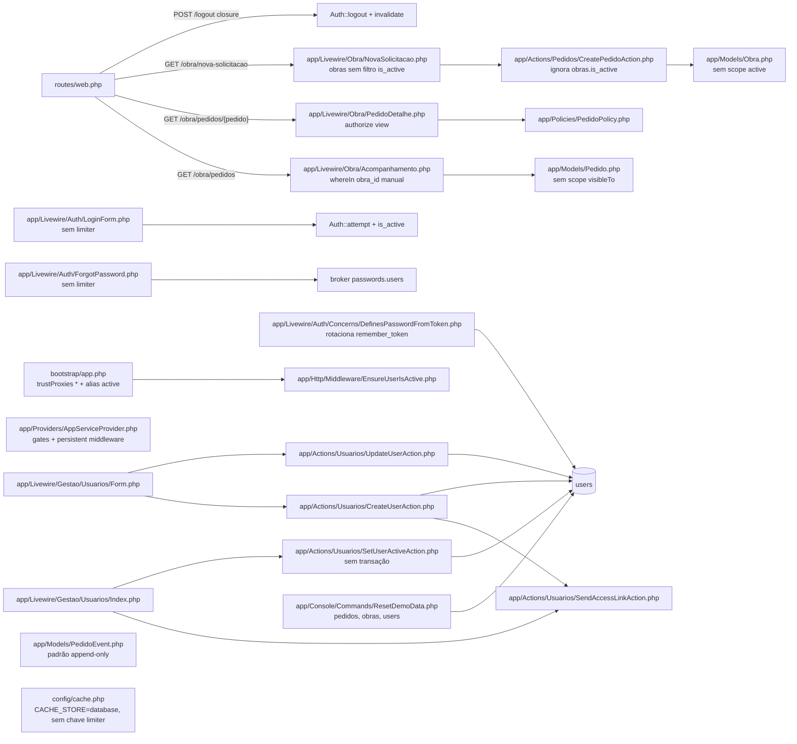
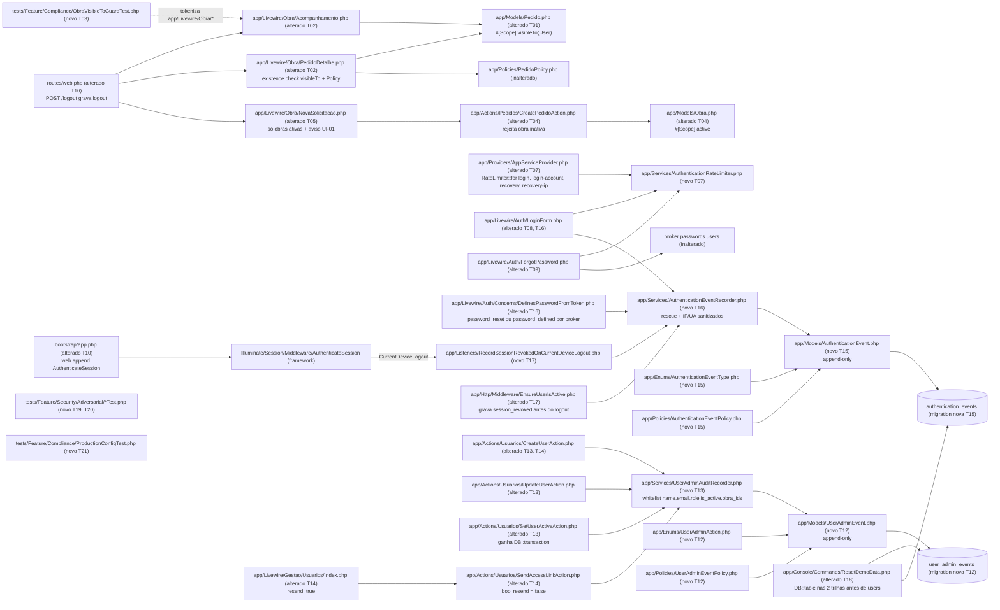

# Implementation Plan

## Request Summary
- Objective: close the authorization/authentication gaps found by the security audit before the V0 Demo is handed to the client — centralised `Pedido::visibleTo(User)` scope for the Obra area, inactive-obra protection on creation, native rate limiting on login and recovery, invalidation of pre-existing sessions after a password reset/definition, an append-only administrative audit trail, an append-only authentication trail, an adversarial test suite, a code-level production-configuration review and a dependency audit — without any Global Scope, RLS, Railway/production change, new dependency or weakened test (SPEC `.spec/features/security-hardening-production/SPEC.md` v1.1, RF-01..RF-33, UI-01..UI-03, CT-01..CT-06, RNF-01..RNF-12, decisions D-01..D-12).
- Scope: **in** — Fases A..I of the SPEC mapped to the 9 phases of description §17; new forward-only migrations for the two trails; factories for the new models; `demo:reset` extension via `DB::table` (D-05/D-11); final report §23 A–P. **out** — PostgreSQL RLS, Global Scope on `Pedido`, new roles/permissions system, OAuth/SSO/MFA, any Railway/DNS/Resend/production-variable change, branch `build/v0-demo-laravel`, Pedido workflow changes, visual identity, authenticated "change password" flow, rate limit on token-consuming pages, retention/purge of the trails (D-07), `trustProxies` change (D-01), forced logout on role change (D-10), obra CRUD.
- Tier: complete
- Architecture references: `AGENTS.md`, `docs/agents/architecture.md`, `docs/agents/domain_rules.md`, `docs/agents/data_model.md`, `docs/agents/coding_guidelines.md`, `CLAUDE.md` (§3, §5, §6, §7 authoritative; §8 real commands). `docs/agents/api_contracts.md` consulted for the contract decision (no JSON API surface exists).

### Architecture rules every task in this plan preserves

| Rule (source) | How the plan honours it |
|---|---|
| Routes bind to Livewire full-page components; components `authorize()` then delegate every write to one single-purpose Action; components never write `pedidos`/`pedido_events` (`docs/agents/architecture.md` "Layer responsibilities"; `docs/agents/coding_guidelines.md` §1, §3) | T02/T05 change only queries and rendering in `app/Livewire/Obra/*`; T08/T09/T16 keep `LoginForm`/`ForgotPassword` as the only callers of the limiter/recorder services and never touch domain tables; audit writes live in Actions (T13/T14) and services, not in components. |
| Actions own `Validator::make`, actor/terminal guards and the `DB::transaction` that writes the mutation + exactly 1 history event (`architecture.md`; `domain_rules.md` "Operational mutation guards"; `coding_guidelines.md` §1–§2) | T04 adds the inactive-obra rule inside `CreatePedidoAction` before the transaction; T13 writes the administrative audit rows **inside** the Actions' transactions (`SetUserActiveAction` gains the transaction it lacks today); T14 writes `access_link_*` outside any transaction per D-03. |
| Authorization is application-layer only (7 layers, `CLAUDE.md` §5): `guest`/`auth` → `active` → `can:is-*` → `mount()` re-check → Policies → Action guards → Action validation. No RLS. | T02 adds the scope as an **existence check** plus the untouched `PedidoPolicy::view`; T10 inserts `AuthenticateSession` into the `web` group (before `auth`/`active`), leaving the 7 layers intact; T19/T20 prove every layer adversarially. |
| `pedido_events` append-only pattern: `UPDATED_AT = null`, `updating`/`deleting` hooks throw `LogicException`, Policy denies update/delete, no DB trigger (`CLAUDE.md` §6; `data_model.md`) | T12 and T15 clone the exact pattern for `UserAdminEvent` and `AuthenticationEvent` (model hooks + Policy + immutability unit tests). |
| Users are never deleted; `pedido_events.actor_id` is `restrictOnDelete` (`CLAUDE.md` §6) | T12/T15 declare every FK to `users` as `restrictOnDelete`; T18 makes `demo:reset` delete demo-referencing audit rows via `DB::table(...)` before `users` (D-05/D-11). |
| `demo:reset` deletes `pedidos` → `obras` → `users` where `is_demo = true` inside one transaction (`ResetDemoData.php:47-51`) | T18 keeps the order and the transaction, adding the two `DB::table` deletes before `users`. |
| Livewire persistent middleware: `EnsureUserIsActive` added explicitly (`AppServiceProvider.php:45`); `AuthenticateSession` belongs to the global `web` group and therefore already runs on `/livewire/update` | T10 appends to the `web` group; T17 keeps `EnsureUserIsActive` as the single place that records the deactivation cut. |
| Models: `#[Fillable]`, casts via `casts()`, scopes via `#[Scope]` (`coding_guidelines.md` §6; `app/Models/Status.php:35`) | T01 (`Pedido::visibleTo`), T04 (`Obra::active`), T12, T15 follow the `#[Scope]`/`#[Fillable]`/`casts()` style. |
| String-backed enums with TitleCase cases (`coding_guidelines.md` §6; `AGENTS.md` php rules) | T12 `UserAdminAction`, T15 `AuthenticationEventType`. |
| PT-BR user-facing strings, English keys (`coding_guidelines.md` §7) | All new messages PT-BR (T04, T05, T08). |
| PHP **8.4** compatible (production 8.4.25, `CLAUDE.md` §2); Pint mandatory; Pest; `php artisan make:*`; no new dependencies (`AGENTS.md`) | Every task ends with `vendor/bin/pint --dirty --format agent`; T22 runs the 8.4 static check; no `composer`/`npm` install anywhere. |
| New models get factories; tests use factory states (`AGENTS.md` laravel/core; `UserFactory` `obra()/suprimentos()/gestao()/inactive()`) | T12/T15 ship factories; T04 adds `ObraFactory::inactive()`. |
| Test DB PostgreSQL on port 5434, `RefreshDatabase` everywhere (`CLAUDE.md` §8; `tests/Pest.php`) | All validation commands assume the `sistema-obra-pgsql-testing` container is up. |

## AS IS — Componentes impactados

Todos os nós foram verificados no código em 2026-09-21. A área Obra aplica o escopo por obra manualmente em `Acompanhamento::pedidos()` e via Policy em `PedidoDetalhe::mount()`; `CreatePedidoAction` e `NovaSolicitacao::obras()` ignoram `obras.is_active`; login e recuperação não têm limitador; `DefinesPasswordFromToken` rotaciona `remember_token` mas nenhuma camada derruba sessões antigas; as quatro Actions de usuário não deixam rastro e `SetUserActiveAction` nem sequer abre transação; `ResetDemoData` conhece apenas `pedidos`, `obras` e `users`.

## TO BE — Componentes propostos

Nós novos/alterados e as tasks que os produzem: escopo `visibleTo` e consumidores da área Obra (T01–T03); obra inativa (T04–T06); limitadores nativos (T07–T09); `AuthenticateSession` e provas de sessão (T10–T11); trilha administrativa (T12–T14); trilha de autenticação, `session_revoked` e `demo:reset` (T15–T18); suíte adversarial (T19–T20); revisão de configuração (T21); gates e relatório (T22–T23).

## Tasks

Common rules for every task: application code changes use `php artisan make:*` where a generator exists; finish with `vendor/bin/pint --dirty --format agent`; run the task's validation command (test DB on `127.0.0.1:5434` — `docker start sistema-obra-pgsql-testing`); never edit an existing migration, never remove or weaken an existing test (RNF-04, RNF-05); never read `.env`; never run `composer update`, `npm update`, `npm audit fix`, or any Railway command (RNF-02, RNF-08). Stop conditions (description §21) named per task are the ones that would halt it; the generic ones (production change, RLS, Global Scope, PHP 8.4 incompatibility, test removal/weakening, secret exposure, substantial architecture change) apply to all.

### T01 — `Pedido::visibleTo(User)` local scope
- **Files**: `app/Models/Pedido.php` (alterado); `tests/Feature/Authorization/PedidoVisibleToScopeTest.php` (novo)
- **Change**: add `#[Scope] protected function visibleTo(Builder $query, User $user): Builder` (project convention `app/Models/Status.php:35`; invoked as `Pedido::query()->visibleTo($user)` / `Pedido::visibleTo($user)`, satisfying CT-01). Resolution by `RoleSlug::tryFrom((string) $user->role?->slug)`: `Obra` → `$query->whereIn('obra_id', $user->obras()->select('obras.id'))` (subquery, no extra round-trip — RNF-07); `Suprimentos` and `Gestao` → `$query` unchanged; `null`/unknown → `$query->whereRaw('1 = 0')`. Pure constraint: no exception, no side effect, no `is_active` filter on obras (D-06, RF-07). No `addGlobalScope`/`ScopedBy` (RNF-03). Docblock cites RF-01, CT-01, D-06.
- **Covers**: RF-01, CT-01, RNF-03, RNF-07
- **Tests**: `tests/Feature/Authorization/PedidoVisibleToScopeTest.php` — fixture with 2 obras (one later set `is_active=false`), ≥1 pedido each; `obra` user of obra A → exactly obra A ids (inactive obra still listed); `suprimentos` → all; `gestao` → all; user with `role_id` of a fresh unknown `Role` (factory) → empty; user with `role_id` null → empty (if the FK permits, otherwise the unknown-role case suffices); composability: `->with(['obra','status'])->latest('requested_at')->paginate(10)` returns the same id set.
- **Validation**: `php artisan test --compact tests/Feature/Authorization/PedidoVisibleToScopeTest.php tests/Unit/Models/PedidoModelTest.php`
- **Stop conditions**: Global Scope need (never); substantial architecture change.
- **Risk**: Low — additive scope, no consumer yet.
- **Dependencies**: none

### T02 — Obra area reads through `visibleTo` (listing + detail existence check)
- **Files**: `app/Livewire/Obra/Acompanhamento.php`, `app/Livewire/Obra/PedidoDetalhe.php` (alterados); `tests/Feature/Livewire/PedidoDetalheObraTest.php`, `tests/Feature/Livewire/AcompanhamentoTest.php` (append only)
- **Change**: `Acompanhamento::pedidos()` → `Pedido::query()->visibleTo(Auth::user())->with(['obra','status','priority','responsible'])->latest('requested_at')->paginate(10)`; delete the `$obraIds = ...pluck(...)` line and the `whereIn('obra_id', …)` (RF-02). `PedidoDetalhe::mount(Pedido $pedido)` keeps route-model binding (404 when the id does not exist) and, before `$this->authorize('view', $pedido)`, adds the scope as an **existence check** throwing `Illuminate\Auth\Access\AuthorizationException` (renders 403 over HTTP and surfaces as `AuthorizationException` in `Livewire::test`, as RF-03's AC requires): `throw_unless(Pedido::query()->visibleTo(Auth::user())->whereKey($pedido->getKey())->exists(), AuthorizationException::class, 'Pedido fora do escopo do solicitante.')`. Never `findOrFail`/`firstOrFail` through the scope (would produce 404 — RF-03, D-03 planner note). `PedidoPolicy::view` untouched (second barrier). Update both docblocks to cite RF-02/RF-03.
- **Covers**: RF-02, RF-03, CT-06, RNF-07
- **Tests**: existing `AcompanhamentoTest` "only pedidos from the user's associated obras are listed", `PedidoDetalheObraTest:54` (403) and `QueryCountTest` T32 stay green with unchanged thresholds; append to `PedidoDetalheObraTest`: obra A user GET `/obra/pedidos/{pedidoB}` → 403; `Livewire::test(PedidoDetalhe::class, ['pedido' => $pedidoB])` → `AuthorizationException`; non-existent id → 404; own pedido → 200.
- **Validation**: `php artisan test --compact tests/Feature/Livewire/AcompanhamentoTest.php tests/Feature/Livewire/PedidoDetalheObraTest.php tests/Feature/Livewire/ObraScreensRouteTest.php tests/Feature/Performance/QueryCountTest.php tests/Feature/Authorization`
- **Stop conditions**: behaviour diverging from the §3 matrix (a 404 replacing the 403); test weakening.
- **Risk**: Medium — touches the only two Obra read paths; mitigated by the existing behavioural tests.
- **Dependencies**: T01

### T03 — Mechanical regression guard for Obra-area queries
- **Files**: `tests/Feature/Compliance/ObraVisibleToGuardTest.php` (novo)
- **Change**: Pest test that globs `app/Livewire/Obra/*.php`, tokenises each with `PhpToken::tokenize`, and asserts (a) every static reference to `Pedido` (`T_STRING`/`T_NAME_QUALIFIED` equal to `Pedido` or `App\Models\Pedido` followed by `::`) is followed by a `visibleTo` `T_STRING` before the next `;` of the same statement; (b) zero occurrences of `whereIn('obra_id'` and of `Pedido::find`/`findOrFail`/`firstOrFail` in those files; (c) `NovaSolicitacao.php` contains no static `Pedido::` call at all (creation is delegated to `CreatePedidoAction`); (d) `app/Models/Pedido.php` contains no `addGlobalScope`/`ScopedBy` (RNF-03). Docblock names the mechanism, its documented limitation (only static `Pedido::` entry points are detected; relation-based reads such as `$this->pedido->events()` are pedido-scoped after the mount check and are covered behaviourally), and references `Acompanhamento::pedidos()` and `PedidoDetalhe::mount()` by class::method; states that the policy barrier is fixed by `tests/Feature/Authorization/PedidoPolicyTest.php` so removing either barrier fails at least one test (RF-03 mutation note); behavioural complement = G-01..G-03 (T19).
- **Covers**: RF-04, RNF-03
- **Tests**: the file itself (green on the current branch after T02; must fail when `->visibleTo(` is removed from `Acompanhamento` — verify once manually by editing in memory, never commit the mutation).
- **Validation**: `php artisan test --compact tests/Feature/Compliance/ObraVisibleToGuardTest.php`
- **Stop conditions**: none specific.
- **Risk**: Low.
- **Dependencies**: T02

### T04 — `Obra::active()` scope and inactive-obra rejection in `CreatePedidoAction`
- **Files**: `app/Models/Obra.php`, `app/Actions/Pedidos/CreatePedidoAction.php`, `database/factories/ObraFactory.php` (alterados); `tests/Feature/Actions/CreatePedidoActionTest.php` (append)
- **Change**: `Obra`: `#[Scope] protected function active(Builder $query): Builder` → `where('is_active', true)`. `ObraFactory::inactive()` state (`is_active => false`). `CreatePedidoAction::execute`: after the existing association check (message unchanged) and **before** `DB::transaction` (so `pedido_code_sequence` is never consumed), add `if (! $requester->obras()->active()->whereKey($validated['obra_id'])->exists()) { throw ValidationException::withMessages(['obra_id' => 'A obra informada está inativa e não recebe novas solicitações.']); }` (CT-05: same `obra_id` key). Docblock cites RF-05/CT-05.
- **Covers**: RF-05, CT-05, G-14 (backend half)
- **Tests**: append to `CreatePedidoActionTest`: obra user associated to an inactive obra calls `execute` directly → `ValidationException` with key `obra_id` and the PT-BR message; `pedidos`/`pedido_events` counts unchanged; sequence not consumed (record `DB::selectOne("select last_value, is_called from pedido_code_sequence")` before, assert equal after; or create a valid pedido afterwards and assert its code is the expected next value); active obra keeps working (existing "valid creation" test).
- **Validation**: `php artisan test --compact tests/Feature/Actions/CreatePedidoActionTest.php tests/Feature/Seeders`
- **Stop conditions**: business rule not covered by D-01..D-12 (none expected — D-06 fixes the read side).
- **Risk**: Low.
- **Dependencies**: none (parallel-safe with T01 — different files; sequenced after Phase 1 by description §17)

### T05 — `NovaSolicitacao` lists only active obras; UI-01 empty-state
- **Files**: `app/Livewire/Obra/NovaSolicitacao.php`, `resources/views/livewire/obra/nova-solicitacao.blade.php` (alterados); `tests/Feature/Livewire/NovaSolicitacaoTest.php` (append)
- **Change**: `obras()` → `Auth::user()->obras()->active()->orderBy('name')->get()`. View: when `$obras->isEmpty()` render `
Nenhuma obra ativa está associada ao seu usuário. Fale com a Gestão.
` (reuse an existing alert class from `resources/css/app.css`; do not add new design tokens — AC-N06) and the "Voltar" link only; the `<form>` with the submit button is rendered only when `$obras->isNotEmpty()`. `submit()` unchanged — the Action re-validates (RF-05). Docblock cites RF-06/UI-01.
- **Covers**: RF-06, UI-01, CT-06
- **Tests**: append to `NovaSolicitacaoTest`: user with 1 active + 1 inactive obra → `assertSee(activeName)`, `assertDontSee(inactiveName)`; user with only an inactive obra → `assertSee('Nenhuma obra ativa está associada ao seu usuário. Fale com a Gestão.')`, `assertDontSee('Enviar solicitação')`, no `<option>` for the inactive obra; forged `->set('obra_id', $inactive->id)->call('submit')` → `assertHasErrors(['obra_id'])` and `pedidos` count unchanged.
- **Validation**: `php artisan test --compact tests/Feature/Livewire/NovaSolicitacaoTest.php tests/Feature/Livewire/ObraScreensRouteTest.php tests/Feature/Compliance/BrandIdentityComplianceTest.php tests/Feature/Security/BladeEscapingTest.php`
- **Stop conditions**: none specific.
- **Risk**: Low.
- **Dependencies**: T04

### T06 — Read-side preservation proofs for inactive obras (D-06, RF-08)
- **Files**: `tests/Feature/Livewire/ObraInativaPreservaHistoricoTest.php` (novo)
- **Change**: test-only. Docblock cites decision D-06 and RF-07/RF-08. Scenarios: obra user associated to obra X with an existing pedido; `Obra::update(['is_active' => false])`; GET `/obra/pedidos` → 200 and `assertSee($pedido->code)`; GET `/obra/pedidos/{id}` → 200; `Pedido::visibleTo($user)` still returns the pedido; `DashboardIndicatorsService::compute([])` counts it; `KanbanBoard` (suprimentos) still renders its card; `pedidos`/`pedido_events` row counts and `updated_at` unchanged after the deactivation.
- **Covers**: RF-07, RF-08, AC-N04
- **Tests**: the file itself; plus existing `KanbanBoardTest`, `TodosPedidosFiltersTest`, `DashboardIndicatorsTest`, `GestaoKanbanReadOnlyTest` re-run.
- **Validation**: `php artisan test --compact tests/Feature/Livewire/ObraInativaPreservaHistoricoTest.php tests/Feature/Livewire/KanbanBoardTest.php tests/Feature/Livewire/TodosPedidosFiltersTest.php tests/Feature/Livewire/DashboardIndicatorsTest.php tests/Feature/Livewire/GestaoKanbanReadOnlyTest.php`
- **Stop conditions**: a business rule beyond D-06 would be required (halt, do not invent).
- **Risk**: Low.
- **Dependencies**: T01, T05

### T07 — Named limiters in `AppServiceProvider` + `AuthenticationRateLimiter` service
- **Files**: `app/Providers/AppServiceProvider.php` (alterado); `app/Services/AuthenticationRateLimiter.php` (novo via `php artisan make:class Services/AuthenticationRateLimiter --no-interaction`); `tests/Unit/Services/AuthenticationRateLimiterTest.php` (novo)
- **Change**: in `AppServiceProvider::boot()` define the four limiters with literal thresholds (D-02 — single source, never env/config): `RateLimiter::for('login', fn () => Limit::perMinute(5))`, `RateLimiter::for('login-account', fn () => Limit::perMinutes(15, 20))`, `RateLimiter::for('recovery', fn () => Limit::perMinute(3))`, `RateLimiter::for('recovery-ip', fn () => Limit::perMinute(6))`, with a docblock citing RF-09/RF-11/D-01/D-02. Service (final class, `RateLimiter` facade only): `public static function normalizeEmail(string $email): string` (`mb_strtolower(trim($email))`); `tooManyLoginAttempts(string $normalizedEmail, string $ip): bool` (either key over its limit); `hitLogin(...)` (hits both keys with each limiter's `decaySeconds`); `clearLogin(...)` (clears both); `tooManyRecoveryAttempts(string $normalizedEmail, string $ip): bool`; `hitRecovery(...)`. Keys: `login:{sha256(email)}:{ip}`, `login-account:{sha256(email)}`, `recovery:{sha256(email)}:{ip}`, `recovery-ip:{ip}` (e-mail hashed — RNF-09). Limits read from the resolved `Limit` objects (`RateLimiter::limiter('login')(null)->maxAttempts` / `->decaySeconds`) so the numbers live only in the provider. The service never receives or stores a password. Store = `RateLimiter`'s cache = default `CACHE_STORE` (`config/cache.php` has no `limiter` key → `CacheServiceProvider.php:36` falls back to the default store) — RF-13.
- **Covers**: RF-09 (thresholds), RF-11 (thresholds), RF-12 (normalization), RF-13, RNF-09
- **Tests**: `tests/Unit/Services/AuthenticationRateLimiterTest.php` — `normalizeEmail` maps `User@Example.com`, ` user@example.com ` and `user@example.com` to one value; the resolved limiters expose exactly 5/60, 20/900, 3/60, 6/60; 5 `hitLogin` → `tooManyLoginAttempts` true, `clearLogin` → false; hits are visible through `RateLimiter::attempts($key)` and vanish after `Cache::flush()` (proves cache-backed, not static — RF-13); no key contains the raw e-mail.
- **Validation**: `php artisan test --compact tests/Unit/Services/AuthenticationRateLimiterTest.php tests/Feature/BootstrapTest.php`
- **Stop conditions**: none specific.
- **Risk**: Low.
- **Dependencies**: none

### T08 — Login limiters in `LoginForm::authenticate` (UI-02, CT-04)
- **Files**: `app/Livewire/Auth/LoginForm.php` (alterado); `tests/Feature/Auth/LoginRateLimitTest.php` (novo); `tests/Feature/Livewire/LoginFormTest.php` (append)
- **Change**: `authenticate(AuthenticationRateLimiter $limiter)`: (1) `$this->email = AuthenticationRateLimiter::normalizeEmail($this->email)` **before** `$this->validate()` (RF-12, independent of `TrimStrings`); (2) `$ip = request()->ip()`; (3) if `$limiter->tooManyLoginAttempts($this->email, $ip)` → throw `ValidationException::withMessages(['email' => 'Muitas tentativas. Aguarde alguns instantes e tente novamente.'])` **without** calling `Auth::attempt` (CT-04: 422 via `/livewire/update`, never 429) — leave a one-line comment `// RF-26: login_failed recorded here by T16`; (4) on `attempt` false → `$limiter->hitLogin(...)` then the existing `E-mail ou senha inválidos.`; (5) on success → `$limiter->clearLogin(...)` (both keys, RF-10) → `Session::regenerate()` → redirect. The password is never passed to the limiter, logged or stored.
- **Covers**: RF-09, RF-10, RF-12, UI-02, CT-04, RNF-11
- **Tests**: `LoginRateLimitTest` — helper `actingFromIp(string $ip)` setting `app('request')->server->set('REMOTE_ADDR', $ip)` before `Livewire::test(LoginForm::class)` (`[UNVERIFIED]` that `Livewire::test` reads the bound request's IP; if not, drive the scenarios through the HTTP `/livewire/update` transport with `withServerVariables(['REMOTE_ADDR' => …])` as `tests/Feature/Auth/EnsureUserIsActiveTest.php:37` does). Cases: 5 wrong → 6th correct refused, `Auth::check()` false, `assertHasErrors(['email'])`; account limiter: 20 wrong spread over 5 IPs (4 each) → 21st correct from a 6th IP refused; decay: `Carbon::setTestNow(now()->addSeconds(61))` → correct password authenticates; `+15 min +1 s` for the account limiter; success then 5 wrong → counts from zero; case/whitespace variants share the counter (trip at 5 total); error text identical for an existing and a non-existing e-mail; array cache store inspected via reflection (`ArrayStore::$storage`) contains no key/value equal to the plaintext password.
- **Validation**: `php artisan test --compact tests/Feature/Auth/LoginRateLimitTest.php tests/Feature/Auth/LoginTest.php tests/Feature/Livewire/LoginFormTest.php`
- **Stop conditions**: secret exposure (password reaching a key/log); test weakening in `LoginTest`.
- **Risk**: Medium — a bug here locks real users out; mitigated by the decay/clear tests and by the fixed generous account ceiling.
- **Dependencies**: T07

### T09 — Recovery-request limiters in `ForgotPassword::sendResetLink` (UI-03)
- **Files**: `app/Livewire/Auth/ForgotPassword.php` (alterado); `tests/Feature/Auth/PasswordRecoveryRateLimitTest.php` (novo)
- **Change**: normalize `$this->email` before `validate()`; `$ip = request()->ip()`; `if ($limiter->tooManyRecoveryAttempts($email, $ip)) { $limiter->hitRecovery($email, $ip); $this->sent = true; return; }` (every submission counts — RF-11); otherwise `hitRecovery` → `Password::broker('users')->sendResetLink([...])` → `$this->sent = true`. Same fixed confirmation state for every outcome (UI-03).
- **Covers**: RF-11, RF-12, UI-03, RNF-11
- **Tests**: `PasswordRecoveryRateLimitTest` (own `normalizeRecoveryHtml` helper mirroring `PasswordRecoveryRequestTest.php:90`): 4 submissions for the same active e-mail from one IP → exactly 1 notification (`Notification::fake()`), rendered HTML of submission 4 byte-identical to submission 1; 6 unknown e-mails from one IP → 7th (a valid active e-mail) sends nothing; case/whitespace variants share the email+IP counter (trip at 3); different IPs keep separate email+IP counters but share the IP-only counter semantics as specified.
- **Validation**: `php artisan test --compact tests/Feature/Auth/PasswordRecoveryRateLimitTest.php tests/Feature/Auth/PasswordRecoveryRequestTest.php tests/Feature/Auth/PasswordResetTest.php tests/Feature/Auth/FirstAccessInviteTest.php`
- **Stop conditions**: test weakening in the recovery suite.
- **Risk**: Low–Medium.
- **Dependencies**: T07

### T10 — `AuthenticateSession` on the `web` group (RF-14/RF-15/RF-18)
- **Files**: `bootstrap/app.php` (alterado); `tests/Feature/Auth/SessionInvalidationOnPasswordChangeTest.php` (novo)
- **Change**: inside `withMiddleware`, `$middleware->web(append: [\Illuminate\Session\Middleware\AuthenticateSession::class]);` with a comment block citing RF-14, R-06 (pre-existing production sessions receive the hash on their first request and are not cut), and that no `logoutOtherDevices` is added to the guest reset flow. Nothing else changes (`trustProxies`, aliases intact — RF-31).
- **Covers**: RF-14, RF-15, RF-18, CT-06
- **Tests**: docblock names the simulation: `SESSION_DRIVER=array`, so "session A/B" are two requests carrying `withSession(['password_hash_web' => $oldHashForCookie])` + `actingAs($user)` (`$oldHashForCookie` = the value the middleware itself stores on a first authenticated GET before the reset, read back with `session('password_hash_web')` — `AuthenticateSession::validatePasswordHash` (`:108-114`) accepts either the raw hash or the cookie-hashed form, so reading it back is the safest simulation). Flow: capture stored hash → reset via `Livewire::test(ResetPassword::class, ['token' => Password::broker('users')->createToken($user)])->set(...)->call('resetPassword')` → GET `/obra/pedidos` from A → 302 `/login`, `Auth::check()` false; from B → same; Livewire update from a pre-reset snapshot → refused; fresh `LoginForm` login with the new password → GET 200; same for the invite flow (`AcceptInvite`, broker `invites`); `remember_token` differs before/after (RF-15); a session without stored hash is not cut and gets the hash after its first request (R-06); `LoginTest` "logout terminates the authenticated session" stays green (RF-18). `session_revoked` row assertions are appended by T17.
- **Validation**: `php artisan test --compact tests/Feature/Auth tests/Feature/Livewire/LoginFormTest.php tests/Feature/LivewireSmokeTest.php`
- **Stop conditions**: substantial architecture change (if the `web` group append proves incompatible with Livewire's update route — verified by the planner as compatible, `SPEC` RF-14 planner note).
- **Risk**: High blast radius (every authenticated request) / low probability — framework-native middleware; mitigated by running the whole `tests/Feature/Auth` + Livewire suites and by R-06 (no rollout cut).
- **Dependencies**: none (sequenced after Phase 3 by §17)

### T11 — Proofs: deactivation cut and role change via the administrative flow
- **Files**: `tests/Feature/Auth/SessionAfterAdministrativeChangesTest.php` (novo)
- **Change**: test-only, docblock cites RF-16, RF-17, D-10. (a) obra user with a live session (`actingAs` + GET 200); `gestao` actor runs `SetUserActiveAction::execute($gestao, $user, false)` (not a raw update); next GET `/obra/pedidos` → 302 `/login` with `session('status') === EnsureUserIsActive::DEACTIVATED_MESSAGE`, `Auth::check()` false; Livewire update from the open snapshot → redirect (reuse the `livewireRefresh` pattern of `EnsureUserIsActiveTest.php:30-45` with a locally named helper). (b) `gestao` user with GET `/gestao/dashboard` 200; another `gestao` runs `UpdateUserAction` downgrading them to `obra` (with ≥1 obra); same session: GET `/gestao/dashboard` → 403 (not 302), `Auth::check()` true; GET `/home` → redirect `route('obra.pedidos.index')`; GET `/obra/pedidos` → 200; (c) `suprimentos` downgraded to `obra` → `UpdatePedidoStatusAction::execute` with that user → `AuthorizationException`; `KanbanBoard::moveViaControl` as that user → `AuthorizationException`. Row assertions (`session_revoked` present / absent) are appended by T17.
- **Covers**: RF-16 (behaviour), RF-17, AC-F12, AC-F13
- **Tests**: the file itself; existing `EnsureUserIsActiveTest` TC-20 stays green.
- **Validation**: `php artisan test --compact tests/Feature/Auth/SessionAfterAdministrativeChangesTest.php tests/Feature/Auth/EnsureUserIsActiveTest.php tests/Feature/Authorization/RoleGatesTest.php`
- **Stop conditions**: behaviour diverging from the §3 matrix (e.g., role change not taking effect on the next request).
- **Risk**: Low.
- **Dependencies**: T10

### T12 — `user_admin_events` migration, `UserAdminEvent` model, enum, policy, factory
- **Files**: `database/migrations/2026_09_21_000001_create_user_admin_events_table.php` (novo via `php artisan make:migration create_user_admin_events_table --no-interaction`, timestamp after `2026_09_18_230919`); `app/Models/UserAdminEvent.php` + `database/factories/UserAdminEventFactory.php` (novos via `make:model UserAdminEvent --factory`); `app/Enums/UserAdminAction.php` (novo via `make:enum --string`); `app/Policies/UserAdminEventPolicy.php` (novo via `make:policy UserAdminEventPolicy --model=UserAdminEvent`); `tests/Unit/Models/UserAdminEventImmutabilityTest.php` (novo); `tests/Feature/MigrationSchemaTest.php` (append)
- **Change**: Schema (CT-02, names mirror `pedido_events`): `id`; `actor_id` `foreignId->constrained('users')->restrictOnDelete()`; `target_id` idem; `action` `string(40)`; `before` `json` nullable; `after` `json` nullable; `created_at` `timestamp->useCurrent()`; **no** `updated_at`; indexes `(target_id, created_at)` and `(actor_id, created_at)` (RF-25); `down()` drops the table. Model: `const UPDATED_AT = null`; `#[Fillable(['actor_id','target_id','action','before','after'])]`; casts `action` → `UserAdminAction`, `before`/`after` → `array`; `booted()` `updating`/`deleting` throw `LogicException('UserAdminEvent registros são imutáveis e não podem ser atualizados/excluídos.')`; relations `actor()`, `target()`. Enum cases: `UserCreated='user_created'`, `UserUpdated`, `RoleChanged`, `ObraAccessChanged`, `UserActivated`, `UserDeactivated`, `AccessLinkSent`, `AccessLinkResent` (exactly RF-20). Policy `update`/`delete` → `false`. Factory with `actor_id`/`target_id` from `User::factory()->gestao()`.
- **Covers**: RF-23, RF-24 (FKs), RF-25, CT-02, RNF-04
- **Tests**: `UserAdminEventImmutabilityTest` mirrors `PedidoEventImmutabilityTest` (update throws, delete throws, policy false for obra/suprimentos/gestao); `MigrationSchemaTest` append: table + columns exist, no `updated_at`, both indexes via `hasIndexOn()`, both FKs `on_delete = restrict` (`Schema::getForeignKeys`), no column named `password|password_hash|remember_token|token|secret|api_key|session_id|cookie|authorization` (RF-22); `FreshMigrationTest` green.
- **Validation**: `php artisan test --compact tests/Unit/Models/UserAdminEventImmutabilityTest.php tests/Feature/MigrationSchemaTest.php tests/Feature/FreshMigrationTest.php tests/Feature/Security/MassAssignmentTest.php`
- **Stop conditions**: destructive migration or data rewrite (neither applies).
- **Risk**: Low — additive table.
- **Dependencies**: none (sequenced after Phase 4 by §17)

### T13 — `UserAdminAuditRecorder` + audit inside `CreateUserAction`, `UpdateUserAction`, `SetUserActiveAction`
- **Files**: `app/Services/UserAdminAuditRecorder.php` (novo via `make:class`); `app/Actions/Usuarios/CreateUserAction.php`, `app/Actions/Usuarios/UpdateUserAction.php`, `app/Actions/Usuarios/SetUserActiveAction.php` (alterados); `tests/Feature/Actions/Usuarios/UserAdminAuditTest.php` (novo)
- **Change**: Recorder: `public const WHITELIST = ['name','email','role','is_active','obra_ids']`; `record(User $actor, User $target, UserAdminAction $action, ?array $before, ?array $after): UserAdminEvent` — throws `LogicException` when any key of `before`/`after` is outside the whitelist (RF-21 defence), then `UserAdminEvent::query()->create([...])`; `snapshot(User $user): array{name: string, email: string, role: string|null, is_active: bool, obra_ids: list<int>}` (role = `$user->role?->slug`, `obra_ids` sorted ints from `obras()->pluck('obras.id')`). Never touches password/remember_token. Actions (constructor-inject the recorder): `CreateUserAction` — inside the existing `DB::transaction`, after `sync`, `user_created` with `before = null`, `after = snapshot` (exactly 5 keys). `UpdateUserAction` — inside the transaction take `$before = snapshot($target)` before `update()`, `$after = snapshot($target->fresh())` after sync/detach; emit `user_updated` with only the changed keys among `name`,`email`; `role_changed` `{role}` when `role_id` changed; `obra_access_changed` `{obra_ids}` when sorted sets differ (covers detach on leaving `obra`); identical data → no row. `SetUserActiveAction` — wrap `update` in `DB::transaction`; emit `user_activated`/`user_deactivated` `{is_active}` only when the previous value differs; no-op → no row. Docblocks updated (RF-19, D-03).
- **Covers**: RF-19, RF-20, RF-21, RF-22, RNF-10, AC-F19, AC-F20
- **Tests**: `UserAdminAuditTest` matrix: each slug row of RF-20 (before/after content, actor/target ids, no-ops emit nothing, `UpdateUserAction` changing name+role+obras emits 3 rows); RF-21: `array_keys` subsets of the whitelist for every row, `user_created.after` has exactly the 5 keys; forced failure — `UserAdminEvent::creating(fn () => throw new RuntimeException)` registered in the test → `CreateUserAction` leaves `users` unchanged, `UpdateUserAction` leaves `users`/`obra_profile` unchanged, `SetUserActiveAction` leaves `is_active` unchanged. Existing `CreateUserActionTest`, `UpdateUserActionTest`, `SetUserActiveActionTest`, `GestaoLockoutGuardTest`, `UsuariosFormTest`, `UsuariosIndexTest` stay green.
- **Validation**: `php artisan test --compact tests/Feature/Actions/Usuarios tests/Feature/Livewire/UsuariosFormTest.php tests/Feature/Livewire/UsuariosIndexTest.php tests/Feature/Authorization/UserPolicyTest.php`
- **Stop conditions**: secret exposure (any non-whitelisted attribute reaching the trail); test weakening.
- **Risk**: Medium — touches the three administrative write paths; atomicity covered by forced-failure tests.
- **Dependencies**: T12

### T14 — `SendAccessLinkAction` explicit `bool $resend` + `access_link_sent`/`access_link_resent` outside transactions (D-03)
- **Files**: `app/Actions/Usuarios/SendAccessLinkAction.php`, `app/Livewire/Gestao/Usuarios/Index.php`, `app/Actions/Usuarios/CreateUserAction.php` (alterados); `tests/Feature/Actions/Usuarios/SendAccessLinkActionTest.php`, `tests/Feature/Actions/Usuarios/UserAdminAuditTest.php`, `tests/Feature/Livewire/UsuariosIndexTest.php` (append)
- **Change**: `execute(User $actor, User $target, bool $resend = false): string`; after the broker returns, `if ($status === Password::RESET_LINK_SENT) { $this->recorder->record($actor, $target, $resend ? UserAdminAction::AccessLinkResent : UserAdminAction::AccessLinkSent, null, null); }` — outside any transaction, failure propagates (D-03). `Index::sendAccessLink` → `$action->execute(Auth::user(), $user, resend: true)`. `CreateUserAction::sendInviteAfterCommit` keeps the default (`resend: false`); its existing try/catch turns a recorder failure into `invite_sent = false` + `report()`. Never infer sent-vs-resent from token state/age. Docblocks cite RF-19/RF-20/D-03.
- **Covers**: RF-19 (access-link rule), RF-20, RNF-10
- **Tests**: default call → `access_link_sent`; `resend: true` → `access_link_resent`; `RESET_THROTTLED` (second call within 60 s) and `INVALID_USER` → no `access_link_*` row; forced recorder failure on the `CreateUserAction` path → user exists, `user_created` present, `invite_sent === false`, no `access_link_*` row, exception reported (`Exceptions::fake()->assertReported`); `UsuariosIndexTest`: resend button emits `access_link_resent`.
- **Validation**: `php artisan test --compact tests/Feature/Actions/Usuarios tests/Feature/Livewire/UsuariosIndexTest.php tests/Feature/Notifications`
- **Stop conditions**: none specific.
- **Risk**: Low.
- **Dependencies**: T13

### T15 — `authentication_events` migration, `AuthenticationEvent` model, enum, policy, factory
- **Files**: `database/migrations/2026_09_21_000002_create_authentication_events_table.php` (novo via `make:migration`); `app/Models/AuthenticationEvent.php` + `database/factories/AuthenticationEventFactory.php` (novos via `make:model --factory`); `app/Enums/AuthenticationEventType.php` (novo via `make:enum --string`); `app/Policies/AuthenticationEventPolicy.php` (novo via `make:policy --model=AuthenticationEvent`); `tests/Unit/Models/AuthenticationEventImmutabilityTest.php` (novo); `tests/Feature/MigrationSchemaTest.php` (append)
- **Change**: Schema (CT-03): `id`; `event` `string(32)`; `user_id` `foreignId->nullable()->constrained('users')->restrictOnDelete()`; `email` `string(255)` nullable; `ip` `string(45)` nullable; `user_agent` `string(255)` nullable; `created_at` `useCurrent()`; no `updated_at`; indexes `(user_id, created_at)`, `(email, created_at)`. Model: `UPDATED_AT = null`; `#[Fillable(['event','user_id','email','ip','user_agent'])]`; cast `event` → `AuthenticationEventType`; immutability hooks (PT-BR `LogicException`); relation `user()`; class + `ip` docblock stating the value is `Request::ip()` behind `trustProxies(at: '*')`, i.e. `X-Forwarded-For`-derived and client-influenceable (D-01), and that no retention/purge exists (D-07). Enum cases exactly: `LoginSuccess='login_success'`, `LoginFailed`, `Logout`, `PasswordReset`, `PasswordDefined`, `SessionRevoked` — no `password_changed`. Policy `update`/`delete` false. Factory default `login_success` with a user.
- **Covers**: RF-26 (schema), RF-27, RF-28 (FK), CT-03, RNF-04
- **Tests**: immutability unit test (update/delete throw, policy false for 3 roles); `MigrationSchemaTest` append: columns, nullable `user_id`, FK `restrict`, both indexes, no forbidden column names (RF-22), `user_agent` length 255; `FreshMigrationTest` green; `grep -rn password_changed app/` = 0 asserted in the immutability test file.
- **Validation**: `php artisan test --compact tests/Unit/Models/AuthenticationEventImmutabilityTest.php tests/Feature/MigrationSchemaTest.php tests/Feature/FreshMigrationTest.php tests/Feature/Security/MassAssignmentTest.php`
- **Stop conditions**: destructive migration (n/a).
- **Risk**: Low.
- **Dependencies**: none (sequenced after Phase 5 by §17)

### T16 — `AuthenticationEventRecorder` + `login_success`/`login_failed`/`logout`/`password_reset`/`password_defined`
- **Files**: `app/Services/AuthenticationEventRecorder.php` (novo via `make:class`); `app/Livewire/Auth/LoginForm.php`, `routes/web.php` (logout closure only), `app/Livewire/Auth/Concerns/DefinesPasswordFromToken.php` (alterados); `tests/Feature/Auth/AuthenticationEventsTest.php` (novo); `tests/Feature/Auth/LoginRateLimitTest.php` (append)
- **Change**: Recorder (final class, injects `Request`): private `write(AuthenticationEventType $event, ?User $user, ?string $email): void` wrapped in `rescue(fn () => AuthenticationEvent::query()->create([...]), report: true)` (RF-29 — never alters the caller's outcome); columns: `email` normalized (`mb_strtolower(trim())`, or the user's e-mail when only a user is given), `ip = $request->ip()`, `user_agent = mb_substr(preg_replace('/[\x00-\x1F\x7F]/u', '', (string) $request->userAgent()), 0, 255)`; public methods `loginSucceeded(User)`, `loginFailed(string $normalizedEmail, ?User $user)`, `loggedOut(User)`, `passwordReset(User)`, `passwordDefined(User)`, `sessionRevoked(User)`. Never receives a password/token. Wiring: `LoginForm::authenticate` — limiter-tripped branch → `loginFailed($email, User::query()->where('email', $email)->first())` before throwing (completes RF-09/D-08); `attempt` false → same lookup → `loginFailed` (user set for wrong password and for inactive account, `null` for unknown e-mail — the `Failed` event is **not** used because it carries `user = null` for inactive accounts); success → `loginSucceeded($user)`. `POST /logout` closure → `app(AuthenticationEventRecorder::class)->loggedOut(Auth::user())` before `logout()` (D-09; no generic `Logout` listener). `DefinesPasswordFromToken::definePasswordThroughBroker` — inside the broker callback after `save()`, `$broker === 'users' ? passwordReset($user) : passwordDefined($user)` (D-04); `event(new PasswordReset($user))` and `remember_token` rotation preserved. HTTP responses of all flows unchanged (RNF-11).
- **Covers**: RF-09 (recording), RF-26 (5 of 6 slugs), RF-29, CT-03, AC-F11, AC-F22
- **Tests**: `AuthenticationEventsTest`: `login_success` (user_id, normalized email, ip `127.0.0.1`, UA present); `login_failed` wrong password → `user_id` set; unknown e-mail → `null`; inactive account → that user's id; response/messages identical to `LoginTest`; `POST /logout` → exactly 1 `logout`, 0 `session_revoked`; recovery flow → `password_reset` and not `password_defined`; first-access flow → `password_defined` and not `password_reset`; 1 000-char UA with `\x00`/`\n` → stored ≤ 255 without control chars; RF-29: `AuthenticationEvent::creating(fn () => throw new RuntimeException)` → login still succeeds (redirect to `/home`, `Auth::check()` true) and `Exceptions::fake()->assertReported(RuntimeException::class)`; exactly one row per event (no duplicate). `LoginRateLimitTest` append: the limiter-refused attempt writes `login_failed` with `user_id` set for an existing e-mail and `null` for an unknown one.
- **Validation**: `php artisan test --compact tests/Feature/Auth tests/Feature/Livewire/LoginFormTest.php`
- **Stop conditions**: secret exposure (password/token reaching the trail).
- **Risk**: Medium — touches the login critical path; `rescue()` keeps failures non-blocking (RF-29 test).
- **Dependencies**: T08, T15

### T17 — `session_revoked`: deactivation cut + `AuthenticateSession` cut
- **Files**: `app/Http/Middleware/EnsureUserIsActive.php` (alterado); `app/Listeners/RecordSessionRevokedOnCurrentDeviceLogout.php` (novo via `php artisan make:listener RecordSessionRevokedOnCurrentDeviceLogout --event='Illuminate\Auth\Events\CurrentDeviceLogout' --no-interaction`); `tests/Feature/Auth/AuthenticationEventsTest.php`, `tests/Feature/Auth/SessionInvalidationOnPasswordChangeTest.php`, `tests/Feature/Auth/SessionAfterAdministrativeChangesTest.php` (append)
- **Change**: `EnsureUserIsActive::handle` — constructor-inject `AuthenticationEventRecorder`; before `Auth::guard('web')->logout()` call `$this->recorder->sessionRevoked($request->user())` (D-09; not `logout`). Listener `handle(CurrentDeviceLogout $event)` → `$event->user instanceof User` → `sessionRevoked($event->user)`; `CurrentDeviceLogout` is dispatched only by `SessionGuard::logoutCurrentDevice()` (`vendor/laravel/framework/src/Illuminate/Auth/SessionGuard.php:703`), which only `AuthenticateSession::logout()` (`AuthenticateSession.php:129`) calls — `Auth::logout()` (`SessionGuard.php:664`) dispatches `Logout`, so explicit logouts and deactivation cuts never double-record. Registration relies on Laravel 13 event discovery of `app/Listeners` (`bootstrap/app.php` has no `withEvents(false)`; Railpack's `event:cache` at build caches the discovery) — do **not** add `Event::listen` for it as well (double rows); docblock states this.
- **Covers**: RF-14 (event), RF-16, RF-26 (`session_revoked`), D-09
- **Tests**: append: deactivation via `SetUserActiveAction` then live-session request → exactly 1 `session_revoked` row for that user and 0 `logout`; two pre-reset sessions cut by `AuthenticateSession` → 2 `session_revoked` rows (one per cut), 0 `logout`; role downgrade → 0 `session_revoked` / 0 `logout` (D-10); explicit `POST /logout` → 0 `session_revoked`; a cut records exactly 1 row (guards against double registration).
- **Validation**: `php artisan test --compact tests/Feature/Auth`
- **Stop conditions**: none specific.
- **Risk**: Medium — middleware on every authenticated request; write is `rescue()`-wrapped.
- **Dependencies**: T10, T11, T16

### T18 — `demo:reset` deletes demo-referencing audit rows via `DB::table` (D-05, D-11)
- **Files**: `app/Console/Commands/ResetDemoData.php` (alterado); `tests/Feature/Console/ResetDemoDataAuditTrailsTest.php` (novo); `tests/Feature/Compliance/AuditTrailsAppendOnlyTest.php` (novo)
- **Change**: inside the existing `DB::transaction`, **before** `User::query()->where('is_demo', true)->delete()`: `$demoUserIds = User::query()->where('is_demo', true)->pluck('id'); DB::table('user_admin_events')->where(fn ($q) => $q->whereIn('actor_id', $demoUserIds)->orWhereIn('target_id', $demoUserIds))->delete(); DB::table('authentication_events')->whereIn('user_id', $demoUserIds)->delete();` — query builder only (bypasses the Eloquent `deleting` guard by design, D-11); rows with `user_id = null` and rows referencing only non-demo users are never touched (D-05). Docblock updated with the order rationale (FK `restrictOnDelete`).
- **Covers**: RF-23 (grep AC), RF-24, RF-28, D-05, D-11
- **Tests**: `ResetDemoDataAuditTrailsTest` fixture (i) rows referencing only demo users, (ii) real actor → demo target, (iii) demo actor → real target, (iv) only real users, (v) `login_failed` with `user_id = null` and a demo e-mail → `artisan demo:reset --force` succeeds; (i)(ii)(iii) gone, (iv)(v) remain; `User::delete()` on a non-demo user with audit rows throws `QueryException` (FK); existing `ResetDemoDataTest` green. `AuditTrailsAppendOnlyTest`: tokenise `app/**/*.php` and assert no statement starting with `UserAdminEvent::`/`AuthenticationEvent::` (or a variable typed as them) contains `->update(`/`->delete(`; assert `ResetDemoData.php` references both tables via `DB::table(` only; assert no registered route uri/name contains `audit`, `events`, `trilha`.
- **Validation**: `php artisan test --compact tests/Feature/Console tests/Feature/Compliance/AuditTrailsAppendOnlyTest.php tests/Feature/Seeders`
- **Stop conditions**: implementation requiring alteration of existing data (none — only demo rows, and only by the operator-run command).
- **Risk**: Medium — deletes audit rows; bounded to demo-referencing rows and to an explicit `--force` command (R-05 accepted).
- **Dependencies**: T12, T15

### T19 — Adversarial suite: cross-obra and cross-role (G-01..G-08, G-14)
- **Files**: `tests/Feature/Security/Adversarial/CrossObraTest.php`, `tests/Feature/Security/Adversarial/CrossRoleTest.php` (novos)
- **Change**: test-only (D-12). Every test name starts with its id (`test('G-01 …')`). `CrossObraTest`: G-01 obra A lists `/obra/pedidos` → `assertDontSee(pedidoB->code)`; G-02 GET `/obra/pedidos/{pedidoB}` → 403; G-03 `Livewire::test(Obra\PedidoDetalhe::class, ['pedido' => $pedidoB])` → `AuthorizationException`; G-04 `Livewire::test(NovaSolicitacao::class)->set('obra_id', $obraB->id)…->call('submit')` → `assertHasErrors(['obra_id'])`, no insert; G-14 inactive obra via `CreatePedidoAction::execute` → `ValidationException` `obra_id`, no insert, sequence untouched. `CrossRoleTest`: G-05 obra → every route named `suprimentos.*` (resolve `{pedido}` with a real id) → 403; G-06 obra → every `gestao.*` route (resolve `{user}`) → 403; G-07 suprimentos → `/gestao/usuarios`, `/gestao/usuarios/novo`, `/gestao/usuarios/{id}/editar` → 403 and each of the 4 `Actions/Usuarios` (`CreateUserAction`, `UpdateUserAction`, `SetUserActiveAction`, `SendAccessLinkAction`) called directly → `AuthorizationException`; G-08 gestao → the 5 operational Actions (`UpdatePedidoStatusAction`, `UpdatePedidoResponsavelAction`, `UpdatePedidoPrioridadeAction`, `UpdatePedidoPrevisaoAction`, `CancelPedidoAction`) called directly → `AuthorizationException`, and via `Livewire::test(Suprimentos\PedidoDetalhe::class, ['pedido' => …])->call('updateStatus'|'updateResponsavel'|'updatePrioridade'|'updatePrevisao'|'cancelarPedido')` and `KanbanBoard::moveCard`/`moveViaControl` → `AuthorizationException` (mount-level `is-suprimentos` denial counts; assert on exception class, never on menus). Assert DB state unchanged after each denial.
- **Covers**: RF-30 (G-01..G-08, G-14), AC-F01..AC-F10, AC-F17, AC-F18
- **Tests**: the files themselves; `php artisan test --compact --filter=Adversarial` lists them.
- **Validation**: `php artisan test --compact --filter=Adversarial && php artisan test --compact --filter='G-0[1-4]'`
- **Stop conditions**: behaviour diverging from the §3 matrix (a scenario that cannot be made to pass without changing a business rule → halt and report).
- **Risk**: Low.
- **Dependencies**: T03, T05

### T20 — Adversarial suite: session, role, rate limit, audit, no-Global-Scope/no-RLS (G-09..G-13, RNF-03)
- **Files**: `tests/Feature/Security/Adversarial/SessionAndRoleTest.php`, `tests/Feature/Security/Adversarial/RateLimitTest.php`, `tests/Feature/Security/Adversarial/AuditTrailTest.php`, `tests/Feature/Security/Adversarial/NoGlobalScopeNoRlsTest.php` (novos)
- **Change**: test-only. G-09 role downgrade via `UpdateUserAction` → same session 403 on the old area, `Auth::check()` true, `/home` reroutes, no `session_revoked`/`logout` row; G-10 deactivation via `SetUserActiveAction` → live session redirected to login + exactly 1 `session_revoked`; G-11 two pre-reset sessions → both refused + 2 `session_revoked`; G-12 the four limiters trip at exactly 5/60 s, 20/15 min, 3/60 s, 6/60 s, responses byte-identical for existing/unknown e-mails, `login_failed` rows for tripped login attempts, no e-mail sent when recovery trips; G-13 full create-user + invite + update + deactivate flow → rows with correct actor/target/action/before/after, then the RF-22 scan: `Notification::fake()` captures the raw invite token, then every column of every row of both trails (`DB::table(...)->get()` → `json_encode` → `stripos`) contains none of: the plaintext password used, `users.password` hash, `remember_token`, the raw token, `password_reset_tokens.token`, the session id (`session()->getId()`); `NoGlobalScopeNoRlsTest`: `grep`-style assertions — `app/Models/Pedido.php` has no `addGlobalScope`/`ScopedBy`; `database/` has no `POLICY|ROW LEVEL SECURITY`; `app/` has no `password_changed`. These may condense scenarios already proven in Phases 3–6; duplication is intended (the suite is the single runnable security regression pack).
- **Covers**: RF-30 (G-09..G-13), RF-22, RF-27, RNF-03, RNF-09, AC-F12..AC-F16, AC-F19..AC-F22
- **Tests**: the files themselves; ≥ 14 passing tests named `G-01`..`G-14` under `tests/Feature/Security/Adversarial/`.
- **Validation**: `php artisan test --compact --filter=Adversarial`
- **Stop conditions**: secret exposure found by the scan (halt, fix in the producing task, never silence the scan).
- **Risk**: Low.
- **Dependencies**: T09, T14, T17, T18

### T21 — Production configuration compliance test (RF-31)
- **Files**: `tests/Feature/Compliance/ProductionConfigTest.php` (novo); `.env.example` (header comment block only, and only if a required line is missing — the header already states `APP_ENV=production`, `APP_DEBUG=false`, `SESSION_SECURE_COOKIE=true`; add "(sob HTTPS)" to the `SESSION_SECURE_COOKIE` line if absent; local key values untouched)
- **Change**: test-only + optional comment. Assertions without reading any real `.env`/Railway value: regexes over `config/session.php` source — `'driver' => env('SESSION_DRIVER', 'database')`, `'lifetime' => (int) env('SESSION_LIFETIME', 120)`, `'secure' => env('SESSION_SECURE_COOKIE')`, `'http_only' => env('SESSION_HTTP_ONLY', true)`, `'same_site' => env('SESSION_SAME_SITE', 'lax')`; `config('auth.passwords.users')` expire 60 / throttle 60 and `config('auth.passwords.invites')` expire 4320 / throttle 60; `bootstrap/app.php` source contains `trustProxies(at: '*')`, `'active' => EnsureUserIsActive::class` and `AuthenticateSession::class`; `.env.example` header contains lines for `APP_ENV=production`, `APP_DEBUG=false`, `SESSION_SECURE_COOKIE=true` while the local `APP_ENV=local`, `APP_DEBUG=true` values remain (so `EnvExampleTest`/`NoCommittedSecretsTest` keep passing); `app/` scan: no `Log::` or `report(` call whose argument list mentions `password`, `token`, `->all()` or `$request` payloads (tokenised or regex, documented in the docblock). Docblock lists each checked item so the final report "Configuration review" section (RF-31 AC) can be copied from the test output.
- **Covers**: RF-31, AC-N10, AC-N11
- **Tests**: the file itself; `EnvExampleTest`, `NoCommittedSecretsTest`, `MailTransportTest` stay green.
- **Validation**: `php artisan test --compact tests/Feature/Compliance`
- **Stop conditions**: implementation requiring a Railway/production change (report as divergence instead — never change).
- **Risk**: Low.
- **Dependencies**: T10 (asserts `AuthenticateSession` presence)

### T22 — Full quality gates and dependency audit (description §18, RF-32, RNF-01..RNF-06, RNF-08)
- **Files**: none modified (Pint may reformat files already touched by earlier tasks — commit those only)
- **Change**: run and record verbatim outputs: (1) `php artisan test --compact` → 0 failures; (2) `vendor/bin/pint --dirty --format agent` → no remaining changes; (3) `npm run build` → completes; (4) `composer audit` → per-advisory table (package, severity, affected, fixed version when given, probable impact) — **never** `composer update`; (5) `npm audit` → same table — **never** `npm audit fix`/`npm update`; (6) `git diff --stat build/v0-demo-laravel...HEAD -- composer.json composer.lock package.json package-lock.json` → empty (RNF-02, RF-32); (7) `git diff --name-status build/v0-demo-laravel...HEAD -- database/migrations/` → only `A` entries, both dated after `2026_09_18_230919` (RNF-04); (8) `git diff --stat build/v0-demo-laravel...HEAD -- tests/` → no `D`; assertion/`test(` count of every pre-existing test file non-decreasing (RNF-05); (9) secret scan: `NoCommittedSecretsTest` + `git diff build/v0-demo-laravel...HEAD | grep -inE 'BEGIN (RSA|OPENSSH|PRIVATE)|re_[A-Za-z0-9]{20,}|eyJ[A-Za-z0-9_-]{20,}|password\s*=\s*['\''"][^'\''"]{8,}'` → only test-fixture factory passwords, nothing else; `git status --porcelain | grep -E '^\?\? \.env'` → empty; (10) PHP 8.4 static check (local runtime is 8.5.4, so `php -l` cannot prove 8.4): `grep -rnE '\|>|#\[\\?NoDiscard\]|\barray_(first|last)\(|\bclone\(' app/ database/ routes/ tests/` → 0 hits, `composer.json` `php: ^8.4` unchanged (RNF-01); (11) `git rev-parse build/v0-demo-laravel` unchanged (`788740e`) and no Railway CLI/MCP write executed (RNF-08).
- **Covers**: RF-32, RNF-01, RNF-02, RNF-04, RNF-05, RNF-06, RNF-08, AC-F23, AC-F24, AC-N10, AC-N11
- **Tests**: the full suite (`php artisan test --compact`).
- **Validation**: the 11 commands above, outputs pasted into the phase log.
- **Stop conditions**: any failing gate; a vulnerability whose only fix is a dependency update (report, do not update — separate decision).
- **Risk**: Low.
- **Dependencies**: T19, T20, T21

### T23 — Final report §23 A–P (RF-33)
- **Files**: none committed (closing message of the run; a file only if the developer asks)
- **Change**: produce the report with all 16 items: A summary; B files created; C files modified; D migrations created; E security controls added; F adversarial tests added; G focused-test results per phase; H `php artisan test --compact` output; I `npm run build` output; J `composer audit` table; K `npm audit` table; L decisions taken (cite D-01..D-12 and the `#[Scope]` convention choice); M pending decisions (R-02 retention/LGPD; any audit vulnerability needing an update); N residual risks (R-01..R-06, plus the `[UNVERIFIED]` items of this plan resolved or not); O explicit confirmation of zero production/Railway change and untouched `build/v0-demo-laravel`; P explicit confirmation that no secret was committed. Include the RF-31 "Configuration review" section (per item verdict, no secret values) and the RNF-01 static-check statement.
- **Covers**: RF-33, RF-31 (report section), RF-32 (report section), AC-N11
- **Tests**: none (documentary).
- **Validation**: the closing message contains headings A..P; `git status` clean apart from intended commits.
- **Stop conditions**: none.
- **Risk**: Low.
- **Dependencies**: T22

## Execution Phases
| Phase | Tasks | Parallel-safe? |
|-------|-------|----------------|
| 1 — Fase A: escopo centralizado `visibleTo` | T01, T02, T03 | No — sequential (T02 consumes T01; T03 guards T02) |
| 2 — Fase B: obra inativa | T04, T05, T06 | No — sequential (T05 uses `Obra::active`; T06 proves the read side after T05) |
| 3 — Fase C: rate limiting | T07, T08, T09 | T08 and T09 are parallel-safe with each other (different files) after T07 |
| 4 — Fase D: invalidação de sessão | T10, T11 | No — T11 proves behaviour that T10 enables |
| 5 — Fase E: auditoria administrativa | T12, T13, T14 | No — sequential (schema → recorder/Actions → access-link slugs) |
| 6 — Fase F: eventos de autenticação e `demo:reset` | T15, T16, T17, T18 | T18 is parallel-safe with T16/T17 (different files) after T15; T16 → T17 sequential |
| 7 — Fase G: suíte adversarial | T19, T20 | Yes — different test files, no application code |
| 8 — Fase H: revisão de configuração | T21 | n/a (single task) |
| 9 — Fase I + relatório: gates completos | T22, T23 | No — T23 consumes T22's outputs |

Checkpoint rule (description §17): each phase ends with its focused tests green, `vendor/bin/pint --dirty --format agent` clean, and one checkpoint commit `feat(phase-N): …` on `feat/security-hardening-production` (never on `build/v0-demo-laravel`).

## Risks
| Risk | Blast radius | Mitigation | Rollback |
|------|-------------|------------|----------|
| `AuthenticateSession` in the `web` group misbehaves with Livewire's update route or with `Session::regenerate()` on login (T10) | Every authenticated request; users unexpectedly logged out | Framework-native middleware verified by the planner (`AuthenticateSession.php:45-75`, runs before `auth`/`active`); full `tests/Feature/Auth` + Livewire suites in T10; R-06 means the rollout itself cuts nobody | Remove the single `web(append:)` line; sessions remain valid (hash key ignored) |
| Login limiter locks legitimate users out (T08) — e.g. a shared office IP or an attacker spamming a victim's e-mail (20/15 min account ceiling) | Affected accounts cannot log in for ≤ 15 min | Thresholds are the developer's D-02 decision; decay proven with `Carbon::setTestNow`; success clears both keys; message reveals nothing | Raise/remove the limiter in `AppServiceProvider` (one place) or stop calling the service in `LoginForm` |
| Forgeable client IP behind `trustProxies(at: '*')` (R-01) lets an attacker bypass IP-keyed limiters | Rate limiting weakened, never disabled — the e-mail-only limiter still holds | D-01 accepted; documented in model docblock and report | n/a (accepted) |
| New FK `restrictOnDelete` to `users` from both trails (T12, T15) | `demo:reset` fails if a demo user has audit rows and the command is not extended | T18 extends the command inside the same transaction and tests the 5-row fixture; `ResetDemoDataTest` stays green | Rows can be removed by an operator via `DB::table` (never Eloquent) if a reset is blocked |
| Railpack runs `php artisan migrate` at container start (`CLAUDE.md` §2) — the two new tables are created automatically on the first deploy after merge | Production schema (additive only) | Forward-only, no data rewrite (RNF-04), `FreshMigrationTest` idempotence; no deploy is performed by this feature (RNF-08) | `php artisan migrate:rollback --step=2` via `railway ssh` (operator decision, out of scope here) |
| Audit write inside the Actions' transaction (T13) fails and rolls back a legitimate administrative change | Gestão cannot create/update/deactivate until fixed | By design (RF-19 atomicity); forced-failure tests; recorder is a simple insert with whitelisted scalars | Revert the recorder call in the affected Action |
| Unbounded growth of `authentication_events` under credential-stuffing (R-03) and personal data (IP/UA) with no retention (R-02) | Storage; LGPD exposure | D-07/D-08 accepted; listed as pending decision M/N in the report; indexes keep reads cheap | Operator purge by `DB::table` when a retention rule is decided |
| Listener auto-discovery + `event:cache` at build (T17): stale cache or double registration | Duplicate or missing `session_revoked` rows | Single registration path (discovery only), test asserts exactly 1 row per cut; Railpack re-runs `event:cache` on every build | Register explicitly in `AppServiceProvider` and disable discovery — a one-file change |
| `QueryCountTest` T32 threshold shifts when the manual `pluck` is replaced by a subquery (T02) | One performance test | The subquery removes one query; the test asserts equality between 5 and 50 rows, not an absolute number | Use the `whereIn('obra_id', $ids)` form fed by a single pluck inside the scope |
| Mechanical guard (T03) gives false confidence for non-static query entry points | Future Obra components could bypass `visibleTo` via relations | Limitation documented in the docblock; behavioural G-01..G-03 cover the real entry points | n/a |

Rollout guidance: all work stays on `feat/security-hardening-production`; merging into `build/v0-demo-laravel` (which auto-deploys and auto-migrates) is a separate developer decision after the T23 report. Pre-deploy checklist for that later decision: confirm the two migrations are the only schema change, expect `Nothing to migrate` → `Migrating: 2026_09_21_…` in the deploy log, and remember R-06 (open sessions survive the rollout) and R-02 (retention undecided).

## Open Questions
- CT-01 spells the scope as `scopeVisibleTo(Builder $query, User $user): Builder`, while the project convention documented in `docs/agents/coding_guidelines.md` §6 and used by `app/Models/Status.php:35` is `#[Scope] protected function visibleTo(Builder $query, …): Builder`. Both are invoked identically (`Pedido::query()->visibleTo($user)`, `Pedido::visibleTo($user)`), so RF-01/CT-01 are satisfied either way; per "architecture is source of truth" the plan uses the `#[Scope]` attribute form (T01). Impact if the developer insists on the literal `scopeVisibleTo` name: rename only — zero behavioural change.
- RF-03's mutation-check AC ("removing either barrier makes at least one adversarial test fail") cannot be satisfied by two behavioural 403 tests alone, since each barrier masks the other. The plan satisfies it structurally: the mechanical guard (T03) fails when `visibleTo` is removed from `PedidoDetalhe::mount()`, and `PedidoPolicyTest` fails when the policy is neutralised. Confirm this reading is acceptable; otherwise a true mutation-testing step would be needed (no tool in the repo — would require a new dependency, which RNF-02 forbids).
- Retention/LGPD treatment of the authentication trail (R-02) remains a pending business decision by design (D-07) — the report item M must carry it; no task in this plan implements a purge.

## Assumptions
- `RateLimiter` uses the default cache store: `config/cache.php` defines no `limiter` key, so `CacheServiceProvider.php:36` resolves `config('cache.limiter')` → `null` → default store (`CACHE_STORE=database` in production, `array` in `phpunit.xml`). Verified by reading both files (RF-13).
- `AuthenticateSession` compares `password_hash_web` stored at first authenticated response with `users.password` on every request and, on mismatch, calls `logoutCurrentDevice()` (dispatching `CurrentDeviceLogout`) then throws `AuthenticationException` → 302 to `login` (verified in `vendor/laravel/framework/src/Illuminate/Session/Middleware/AuthenticateSession.php:45-135` and `SessionGuard.php:694-703`).
- `Auth::logout()` (used by `POST /logout` and `EnsureUserIsActive`) dispatches `Logout`, never `CurrentDeviceLogout` (`SessionGuard.php:664-703`), so the T17 listener fires only for the hash-mismatch cut.
- Laravel 13 event discovery is active for `app/Listeners` (no `withEvents(false)` in `bootstrap/app.php`; verified), and Railpack's build runs `event:cache` (`CLAUDE.md` §2) — compatible with discovery.
- `[UNVERIFIED]` `Livewire::test()` reads the client IP from the bound `request()` instance, so `app('request')->server->set('REMOTE_ADDR', …)` is enough to simulate distinct IPs in T08/T09. Fallback documented in T08: drive the scenarios through the HTTP `/livewire/update` transport with `withServerVariables`.
- `[UNVERIFIED]` `Carbon::setTestNow` advances the array cache store's expiry checks so limiter decay can be tested without sleeping (Laravel's `ArrayStore` and `RateLimiter` both use `Carbon::now()`/`currentTime()`); if not, use `RateLimiter::clear()` + a documented `travel()` helper.
- The `.env.example` header already documents `APP_ENV=production`, `APP_DEBUG=false` and `SESSION_SECURE_COOKIE=true` (read 2026-09-21, lines 8-19); T21 may only append the "(sob HTTPS)" annotation.
- Existing `SendAccessLinkAction::execute($actor, $target)` callers keep working because the new `bool $resend = false` parameter is defaulted (T14); `tests/Feature/Actions/Usuarios/SendAccessLinkActionTest.php` is not weakened.
- Test database container `sistema-obra-pgsql-testing` (port 5434) is the one used for every validation command; `RefreshDatabase` recreates the schema, so the two new migrations are exercised by every run.
- Contract emission: SPEC `### Contracts` is populated (CT-01..CT-06) and tier is `complete`, so the emission gate was evaluated — no artifact was generated because none of the six contracts is a REST/gRPC/async interface (CT-01 = Eloquent scope, CT-02/CT-03 = table shapes, CT-04/CT-05 = exception channels on the existing Livewire transport, CT-06 = preserved routes). Repo scan found no `openapi.yaml`, `*.proto` or `asyncapi.yaml`; `docs/agents/api_contracts.md` confirms "No JSON API". The schemas are inlined in T12/T15 instead.
- Local PHP is 8.5.4, production 8.4.25: RNF-01 is met by the grep-based static check in T22 plus the `composer.json` constraint; the plan introduces no syntax newer than PHP 8.3 (typed class constants are already used by `EnsureUserIsActive::DEACTIVATED_MESSAGE`).
