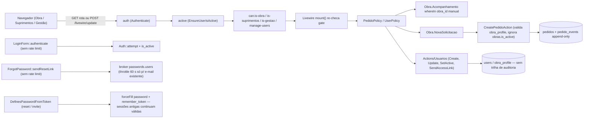
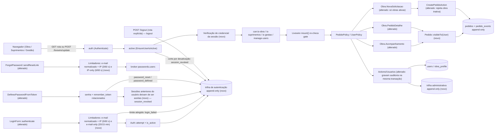

# SPEC: security-hardening-production

## Metadata
- Source: developer description via /plan (`.spec/features/security-hardening-production/.handoff/description.md`, §19 = 23 functional ACs, §20 = 11 non-regression ACs, used verbatim as AC source of truth)
- Service: sistema_obra_mc (Laravel 13.32.0 / Livewire 4.4.5 / PostgreSQL — single repo, single deployable)
- Tier: complete
- Version: 1.1
- Clarification round: 12 questions (Q-01..Q-12) answered by the developer on 2026-09-21 (`.spec/features/security-hardening-production/.handoff/clarifier-answers.md`); the 4 clarification markers of v1.0 (NC-01..NC-04) are resolved and encoded as RIGID text; decisions recorded in "Decisions" at the end of this SPEC.
- Architecture references: `AGENTS.md`, `docs/agents/architecture.md`, `docs/agents/domain_rules.md`, `docs/agents/data_model.md`, `CLAUDE.md` (§3, §5, §6, §7)
- Init chain consulted: `.spec/init/user-stories.md` (US-1.1, US-1.2, US-2.1, US-4.1, US-4.2, US-6.1 only — role/story language). `.spec/init/project-description.md` and `database-schema.md` describe the discontinued Next.js/Supabase stack and were **not** used for stack/RLS decisions.
- Branch: `feat/security-hardening-production` (base `788740e` + `9a7a8fb`). Production branch `build/v0-demo-laravel` is untouched by this feature.

### Architecture rules this SPEC inherits (from the references above)

| Rule | Source |
|---|---|
| Routes bind directly to Livewire full-page components; components call `authorize()` and delegate every write to one single-purpose Action class; components never write `pedidos`/`pedido_events` directly | `docs/agents/architecture.md` "Layer responsibilities" (`app/Livewire/**` → `app/Actions/**`) |
| Actions own validation (`Validator::make`), actor/terminal guards and the `DB::transaction` that writes the mutation + exactly 1 history event | `docs/agents/architecture.md`; `docs/agents/domain_rules.md` "Operational mutation guards" |
| Authorization is application-layer only: `guest`/`auth` → `active` → `can:is-*` gates → `mount()` re-check → Policies → Action guards → Action validation. No PostgreSQL RLS, none planned | `CLAUDE.md` §5 (7 layers, file:line evidence) |
| `pedido_events` is append-only: `UPDATED_AT = null`, `updating`/`deleting` hooks throw `LogicException`, `PedidoEventPolicy::update/delete` = `false`; no DB trigger | `CLAUDE.md` §6; `docs/agents/data_model.md` "pedido_events" |
| Users are never deleted, only `is_active = false`; `pedido_events.actor_id` is `restrictOnDelete` | `CLAUDE.md` §6 "Desativação por is_active" |
| `demo:reset` deletes `pedidos` → `obras` → `users` where `is_demo = true` inside one transaction; children fall by DB cascade | `CLAUDE.md` §6; `app/Console/Commands/ResetDemoData.php:48-50` |
| Livewire persists `Authenticate`, `Authorize` and `App\Http\Middleware\Authenticate` on `/livewire/update` by default; `EnsureUserIsActive` is added explicitly | `vendor/livewire/livewire/src/Mechanisms/PersistentMiddleware/PersistentMiddleware.php:16-25`; `app/Providers/AppServiceProvider.php:45` |
| Code must stay PHP **8.4**-compatible (production runs 8.4.25 even though `AGENTS.md` says 8.5); Pint mandatory; Pest; `php artisan make:*`; no new dependencies without approval | `CLAUDE.md` §2 "Divergência de versão"; `AGENTS.md` foundation/pint/pest rules |
| New models get factories; tests use factories (`UserFactory` has `obra()/suprimentos()/gestao()/inactive()` states, `ObraFactory` defaults `is_active = true`) | `AGENTS.md` laravel/core; `database/factories/UserFactory.php:46-73`, `ObraFactory.php:22` |

## Context

The V0 Demo is live at `albuquerque.mcinteligencia.com` (Railway, FrankenPHP, PHP 8.4.25). Before handing the system to the client, the authorization model must be made harder to regress and the gaps found by the prior security audit must be closed: no login rate limiting, no protection of the recovery form against abuse, no invalidation of other sessions after a credential change, `obras.is_active` ignored when creating pedidos, no audit trail for user administration, no authentication trail, and Obra-area queries applying the obra scope by hand in each component.

The central criterion (description §1): **no user obtains data or executes operations outside their authorized scope through any channel — UI, direct URL, forged HTTP/Livewire payload, manipulated ID, or direct Action call.** Hiding UI controls is not a security mechanism.

### Verification of "estado atual já validado" (description §2) against the code — 2026-09-21

| §2 claim | Verdict | Evidence |
|---|---|---|
| Session/web guard authentication | Confirmed | `config/auth.php:19,40-43`; `app/Livewire/Auth/LoginForm.php:47` |
| Roles persisted, 3 slugs | Confirmed | `app/Enums/RoleSlug.php:7-10`; `users.role_id` FK RESTRICT |
| Inactive user protected at auth and access | Confirmed | `LoginForm.php:47` (`is_active => true` credential); `app/Http/Middleware/EnsureUserIsActive.php:30-37`; alias `active` at `bootstrap/app.php:26` |
| Gates `is-obra`, `is-suprimentos`, `is-gestao`, `manage-users` | Confirmed | `app/Providers/AppServiceProvider.php:35-38` |
| `PedidoPolicy` controls view + operations | Confirmed | `app/Policies/PedidoPolicy.php:19-57` |
| Obra only views pedido of an associated obra | Confirmed | `PedidoPolicy.php:22`; `app/Livewire/Obra/PedidoDetalhe.php:23` |
| Creation re-validates obra membership | Confirmed | `app/Actions/Pedidos/CreatePedidoAction.php:47-53` |
| Actions authorize independently of UI | Confirmed | `GuardsOperationalMutation.php:23-40`; `GuardsUserAdministration.php:21-23`; `tests/Feature/Authorization/BypassUiAuthorizationTest.php` |
| Operational mutations belong to `suprimentos` | Confirmed | `PedidoPolicy.php:34-57` |
| Gestão administers users | Confirmed | `routes/web.php:80-84`; `app/Policies/UserPolicy.php` |
| Obra-area queries apply manual scope | Confirmed | `app/Livewire/Obra/Acompanhamento.php:33-36` (`whereIn('obra_id', …)`); `NovaSolicitacao.php:78` |
| Livewire persistent auth/authz middleware | Confirmed (framework default + explicit `active`) | `PersistentMiddleware.php:16-25`; `AppServiceProvider.php:45` |
| CSRF, mass assignment, escaping covered | Confirmed | `tests/Feature/Security/{CsrfProtectionTest,MassAssignmentTest,BladeEscapingTest}.php` |
| No PostgreSQL RLS | Confirmed | `CLAUDE.md` §5 grep evidence |

**Divergences / gaps confirmed (none contradict §2; they are the reasons for this feature):**

| Gap | Evidence |
|---|---|
| `obras.is_active` is not consulted by `CreatePedidoAction` nor by `NovaSolicitacao::obras()`; the only consumer is the Gestão user form (`app/Livewire/Gestao/Usuarios/Form.php:126`) | grep `is_active` in `app/` |
| No rate limiter anywhere: zero `throttle`/`RateLimiter` in `app/`, `routes/`, `bootstrap/`; only the brokers' 60 s token throttle (`config/auth.php:100,113`), which does not fire for unknown e-mails | grep |
| Password reset/invite rotates `remember_token` (`DefinesPasswordFromToken.php:74-77`) but nothing invalidates other live sessions; `AuthenticateSession`/`logoutOtherDevices` absent | grep |
| No self-service "change password" flow exists — passwords change only via `passwords.users` (reset) and `passwords.invites` (first access) | `routes/web.php:33-35`; `app/Livewire/Auth/` |
| No `app/Events`, `app/Listeners`; no listener on `Illuminate\Auth\Events\*`; `PasswordReset` is dispatched (`DefinesPasswordFromToken.php:80`) but nobody listens | `ls app/` |
| User-administration Actions write no audit row (`SetUserActiveAction.php:14-15` docblock: "No PedidoEvent is written") | code |
| `Obra` user's pedido listing includes pedidos of inactive associated obras (no filter) — current behaviour, **kept by decision D-06** (RF-07) | `Acompanhamento.php:33-39` |
| `bootstrap/app.php:22` `trustProxies(at: '*')` means `Request::ip()` is derived from `X-Forwarded-For` and can be client-influenced; out of scope to change (D-01), mitigated by an e-mail-only login limiter (RF-09) | code |
| Role gates read `role->slug` fresh per request (user re-fetched from `sessions`), so a role change already takes effect on the next request — must be **proven**, not implemented | `AppServiceProvider.php:35-38` |

## AS IS — Estado atual

Cadeia de autorização atual do recorte tocado pela feature: as sete camadas existem e estão testadas, mas o escopo por obra é repetido manualmente em cada componente da área Obra, `obras.is_active` não participa da criação de pedidos, login e recuperação não têm limitador, a troca de senha não derruba outras sessões e as Actions de usuário não deixam rastro.

## TO BE — Estado proposto

Nós novos/alterados e os ids RIGID que realizam: `Pedido::visibleTo` + Acompanhamento/PedidoDetalhe → RF-01..RF-04, CT-01; NovaSolicitacao/CreatePedidoAction (obra inativa) → RF-05..RF-08, UI-01, CT-05; limitadores de login e recuperação → RF-09..RF-13, UI-02, UI-03, CT-04; verificação de credencial da sessão / invalidação → RF-14..RF-18; trilha administrativa → RF-19..RF-25, CT-02; trilha de autenticação → RF-26..RF-29, CT-03; suíte adversarial, revisão de configuração e auditoria de dependências → RF-30..RF-33.

## Scope

- **In**:
  - Fase A: mecanismo central `Pedido::visibleTo(User)` + migração das consultas da área Obra + guarda anti-regressão.
  - Fase B: obra inativa não recebe nova solicitação (backend + UI), preservando histórico.
  - Fase C: rate limiting nativo em login e em solicitação de recuperação de senha.
  - Fase D: invalidação de sessões anteriores após reset/definição de senha; prova de corte por desativação e por mudança de papel.
  - Fase E: trilha administrativa append-only para as 4 Actions de `app/Actions/Usuarios/`.
  - Fase F: trilha de autenticação append-only — 6 slugs: `login_success`, `login_failed` (inclui tentativas barradas pelo limitador), `logout` (só a rota `POST /logout`), `password_reset`, `password_defined`, `session_revoked` (RF-26, D-04/D-08/D-09).
  - Fase G: suíte adversarial cobrindo cross-obra, cross-role, bypass de Action, mudança de papel, desativação, senha/sessão, rate limit e auditoria.
  - Fase H: revisão de configuração de produção no código (`config/`, `bootstrap/app.php`, `.env.example`) com teste de conformidade e relato de divergências.
  - Fase I: `composer audit` + `npm audit` executados e relatados; nenhuma atualização automática.
  - Migrations novas (forward-only) para as duas trilhas; factories dos novos modelos.
- **Out** (description §14):
  - PostgreSQL RLS; Global Scope em `Pedido`; novo sistema de roles/permissões; OAuth/SSO/MFA.
  - Qualquer alteração em Railway, DNS, domínio, Resend, variáveis de produção, branch `build/v0-demo-laravel`.
  - Mudança do workflow de Pedido, identidade visual, refactor geral, novos módulos.
  - Fluxo de "alterar senha" autenticado (não existe hoje e não é criado aqui).
  - Rate limit nas páginas que consomem token (`/redefinir-senha/{token}`, `/primeiro-acesso/{token}`): tokens de 60 caracteres aleatórios gerados pelo broker; fora do escopo explícito de §7.
  - Auditoria de mutações operacionais de Pedido (já coberta por `pedido_events`).
  - Retenção/expurgo automático das trilhas (decisão D-07: armazenar sem expurgo; retenção registrada como decisão pendente / risco residual no relatório final).
  - Alteração de `trustProxies(at: '*')` em `bootstrap/app.php:22` (decisão D-01: fora de escopo; mitigado pelo limitador e-mail-only de RF-09).
  - Encerramento de sessão por mudança de papel (decisão D-10: a sessão permanece; a área antiga responde 403 e `/home` redireciona — RF-17).
  - Cadastro/edição de obras (inexistente; `obras.is_active` continua sendo alterado só via seed/tinker).

## RIGID (Non-Negotiable)

### Functional Requirements

#### Fase A — Escopo centralizado de Pedido

- RF-01 [Ubiquitous]: The system SHALL expose exactly one centralized visibility mechanism for `Pedido`, invoked as `Pedido::visibleTo(User $user)` (name fixed by description §5; no such symbol exists today — grep `visibleTo` in `app/`, `database/`, `tests/` = 0), implemented as an Eloquent local scope (never a Global Scope), that restricts the query to: for role `obra` → pedidos whose `obra_id` is in the user's `obra_profile` associations; for roles `suprimentos` and `gestao` → all pedidos; for any other or missing role → zero rows.
  - AC: A unit/feature test asserts, for the 3 roles plus a user with an unrecognized role, that `Pedido::query()->visibleTo($user)->pluck('id')` equals exactly the expected id set on a fixture with ≥ 2 obras and ≥ 1 pedido per obra.
- RF-02 [Event-Driven]: WHEN `Obra\Acompanhamento` renders its listing, the system SHALL source the pedidos exclusively through `visibleTo(Auth::user())` and SHALL NOT contain any hand-written `whereIn('obra_id', …)` scoping (`app/Livewire/Obra/Acompanhamento.php:33-36` today).
  - AC: `tests/Feature/Livewire/AcompanhamentoTest.php` "only pedidos from the user's associated obras are listed" remains green; `tests/Feature/Performance/QueryCountTest.php` T32 remains green with its current thresholds.
- RF-03 [Event-Driven]: WHEN an `obra` user opens `/obra/pedidos/{pedido}` (`routes/web.php:64`) for a pedido outside `visibleTo`, the system SHALL deny with HTTP **403** (current behaviour, `tests/Feature/Livewire/PedidoDetalheObraTest.php:54`) — never silently converted to 404 — and SHALL keep `PedidoPolicy::view` as the second barrier (`app/Policies/PedidoPolicy.php:19-26` unchanged in semantics). The detail component keeps route-model binding for `{pedido}` (404 only when the id does not exist at all, as today) and applies the scope as an **existence check** — `abort_unless(Pedido::visibleTo($user)->whereKey($pedido)->exists(), 403)` or equivalent — **never** as `findOrFail`/`firstOrFail` through the scope (which would yield 404 and break this requirement). Decision D-03 (`.handoff/clarifier-answers.md`, planner note RF-03/RF-04); residual risk: the 403-vs-404 difference is an existence oracle on sequential ids/codes — accepted, `CLAUDE.md` §5 layer 7 keeps 403.
  - AC: Test: user A (obra A) requests the detail of pedido B (obra B) → status 403; the same via a Livewire `mount` with the forged id → `AuthorizationException`; a non-existent id → 404 (unchanged). Both `visibleTo` and the policy are exercised (removing either one in a mutation check makes at least one adversarial test fail).
- RF-04 [Ubiquitous]: The system SHALL include a regression guard that fails when a `Pedido` query executed by a component under `app/Livewire/Obra/**` does not pass through `visibleTo`. IF a reliable mechanical guard is not achievable, THEN the limitation SHALL be documented in the guard test's docblock AND every existing query point (`Acompanhamento::pedidos()`, `PedidoDetalhe::mount()` — the RF-03 existence check counts as the scope pass-through for the detail) SHALL be covered by a behavioural cross-obra test.
  - AC: One test file exists under `tests/Feature/Compliance/` or `tests/Feature/Authorization/` whose docblock names the mechanism (or the documented limitation) and which references each Obra-area query point by class::method; it passes on the final branch.

#### Fase B — Obra inativa

- RF-05 [Unwanted]: IF `CreatePedidoAction::execute` receives an `obra_id` whose `obras.is_active` is `false` (`database/migrations/2026_09_18_230112_create_obras_table.php:17`), THEN the system SHALL reject with `ValidationException` on field `obra_id` carrying a PT-BR message, before any `pedidos`/`pedido_events` insert, regardless of what the UI offered.
  - AC: Test: obra user associated to an inactive obra calls the Action directly with that `obra_id` → `ValidationException` with key `obra_id`; `pedidos` count unchanged; `pedido_events` count unchanged; `pedido_code_sequence` not consumed (next generated code is the same as before the attempt).
- RF-06 [State-Driven]: WHILE rendering `Obra\NovaSolicitacao`, the obra select SHALL list only obras that are both associated to the user AND `is_active = true`.
  - AC: Test: user associated to 1 active + 1 inactive obra → rendered options contain the active obra name and do not contain the inactive obra name; server-side rejection of RF-05 still applies if the inactive id is forged.
- RF-07 [Ubiquitous]: The system SHALL NOT delete, hide, re-scope or modify any existing `pedidos` or `pedido_events` row because its obra is inactive. An `obra` user SHALL keep **both** the listing and the detail access to pedidos of an associated obra that is deactivated later (current behaviour, `Acompanhamento.php:33-39`); `obras.is_active` affects **only** the creation of new solicitações (RF-05, RF-06). `visibleTo` (RF-01) SHALL NOT filter by `obras.is_active`. Decision D-06 (former NC-01, description §22, option (a) — zero code change on the read side).
  - AC: Test: obra user associated to an obra that is deactivated after a pedido exists still sees that pedido in `/obra/pedidos` and can open its detail (status 200); the test docblock cites decision D-06.
- RF-08 [Ubiquitous]: `suprimentos` and `gestao` visibility, Kanban, listings and dashboard SHALL remain unaffected by `obras.is_active`.
  - AC: Existing tests `KanbanBoardTest`, `TodosPedidosFiltersTest`, `DashboardIndicatorsTest`, `GestaoKanbanReadOnlyTest` remain green; a test asserts a pedido of an inactive obra is still counted by `DashboardIndicatorsService`.

#### Fase C — Rate limiting

- RF-09 [Conditional]: The login flow SHALL apply **two** limiters, both evaluated before `Auth::attempt` (decisions D-01, D-02; thresholds fixed in code via `RateLimiter::for(...)` in `AppServiceProvider::boot()`, **not** read from env/config):

  | Limiter | Key | Limit | Window |
  |---|---|---|---|
  | login per e-mail + IP | normalized e-mail (trimmed, lower-cased) `|` client IP | **5** failed attempts | **60 s** |
  | login per account (e-mail only) | normalized e-mail alone | **20** failed attempts | **15 min** |

  IF either limiter has reached its limit for the submitted e-mail, THEN the system SHALL refuse the attempt WITHOUT calling `Auth::attempt`, SHALL respond with a generic PT-BR field error identical for existing and non-existing e-mails, SHALL record a `login_failed` authentication event (RF-26, decision D-08), and SHALL NOT persist the submitted password anywhere (limiter key, cache, log, audit). Rationale for the second limiter: `trustProxies(at: '*')` makes the client IP `X-Forwarded-For`-derived and forgeable, so IP-keyed protection alone can be bypassed; the e-mail-only limiter holds regardless of IP trust.
  - AC: Test (email+IP): 5 failed attempts with a wrong password → attempt 6 with the **correct** password is refused and no session is created. Test (account): 20 failed attempts spread over ≥ 5 distinct IPs (≤ 4 per IP so the first limiter never trips) → attempt 21 with the correct password from a fresh IP is refused. In both: the response bytes for a non-existent e-mail under the same condition are identical except for values already present in the request; the cache/limiter store contains no key or value equal to the submitted password; a `login_failed` row exists for the refused attempt.
- RF-10 [Event-Driven]: WHEN a login succeeds, the system SHALL clear **both** limiter counters for that e-mail (the email+IP key and the e-mail-only key); WHEN a decay window elapses, the system SHALL accept attempts again for that limiter.
  - AC: Test: after hitting the email+IP limit, `Carbon::setTestNow` +61 s → the correct password authenticates; after hitting the account limit, +15 min +1 s → authenticates; a successful login followed by 5 wrong attempts → limit is counted from zero after the success (both keys cleared).
- RF-11 [Conditional]: The recovery-request flow (`ForgotPassword::sendResetLink`, `app/Livewire/Auth/ForgotPassword.php:44-54`) SHALL apply **two** limiters, evaluated before the broker is called (decision D-02, fixed in code via `RateLimiter::for(...)`):

  | Limiter | Key | Limit | Window |
  |---|---|---|---|
  | recovery per e-mail + IP | normalized e-mail `|` client IP | **3** submissions | **60 s** |
  | recovery per IP | client IP alone | **6** submissions | **60 s** |

  IF either limiter has reached its limit, THEN the system SHALL send no e-mail, SHALL NOT call the broker, and SHALL render the same fixed confirmation output already rendered for unknown/inactive/throttled e-mails (`tests/Feature/Auth/PasswordRecoveryRequestTest.php:90` byte-identical rule). Every submission (accepted or refused) counts as a hit.
  - AC: Test: 4 submissions for the same active e-mail from one IP → exactly 1 e-mail captured by the `array` mailer (the broker's own 60 s throttle absorbs submissions 2-3), zero after the limiter trips at submission 4; the rendered HTML of the tripped case is byte-identical to the non-tripped case; 6 submissions for 6 distinct unknown e-mails from one IP → submission 7 (any e-mail, including a valid active one) sends nothing.
- RF-12 [Unwanted]: IF the same e-mail is submitted with different letter case or surrounding whitespace, THEN the limiters (login and recovery, all keys containing the e-mail) SHALL count it against the same key (no bypass by case variation). Normalization SHALL happen in the component before the limiter key is built and before validation, independently of the `TrimStrings` HTTP middleware (which `Livewire::test()->set()` bypasses).
  - AC: Test: `User@Example.com`, `user@example.com`, ` user@example.com ` from the same IP consume one shared counter and trip at 5 total (login) / 3 total (recovery); the test is exercised through the Livewire component with values set directly (not relying on `TrimStrings`).
- RF-13 [Ubiquitous]: The limiters SHALL use the application cache store configured by `CACHE_STORE` (`config/cache.php` default `database`, `CLAUDE.md` §2), so counts are shared across FrankenPHP threads and survive a process restart; tests run against the `array` store per `phpunit.xml`.
  - AC: Test asserts the limiter hits are written via `RateLimiter`/`Cache` facade (spy or store inspection) and not held in a static/in-memory array of the component.

#### Fase D — Sessões

- RF-14 [Event-Driven]: WHEN a user's password is redefined through the reset flow (`passwords.users`) or defined through the first-access flow (`passwords.invites`) (`app/Livewire/Auth/Concerns/DefinesPasswordFromToken.php:65-88`), THEN every authenticated session of that user that existed before the change SHALL be refused on its next authenticated request (redirected to `login`, `Auth::check()` false), including `/livewire/update` calls.
  The mechanism SHALL be `Illuminate\Session\Middleware\AuthenticateSession` appended to the `web` middleware group in `bootstrap/app.php` (native to Laravel 13; verified by the planner: it runs on `/livewire/update` because it belongs to the global `web` group, runs before `auth`/`active`, and compares the `password_hash_web` stored in the session at login with `users.password` on every request). Known and accepted consequences: (i) sessions that already exist in production before the deploy carry no stored hash — they receive it on their first request after the deploy and are **not** invalidated by the rollout; (ii) there is no remember-me flow in the application, so no `remember_token`-based re-login survives the cut; (iii) the forced cut SHALL record a `session_revoked` authentication event (RF-26, decision D-09). `logoutOtherDevices` SHALL NOT be added to the reset flow (guest context).
  - AC: Test: session A and session B authenticated as the same user; password reset via token; next GET on an authenticated route from A → 302 to `/login`; from B → 302 to `/login`; a fresh login with the new password → 200; one `session_revoked` row per cut session. Because the suite runs `SESSION_DRIVER=array` (`phpunit.xml`), the two sessions are simulated with `$this->withSession([...])` carrying the pre-reset `password_hash_web`, or by seeding the `sessions` table directly with `SESSION_DRIVER=database` forced for that test — the chosen simulation is named in the test docblock.
- RF-15 [Ubiquitous]: `remember_token` rotation on password redefinition (`DefinesPasswordFromToken.php:76`) SHALL be preserved.
  - AC: Test: `remember_token` differs before/after reset (existing behaviour; assert not regressed).
- RF-16 [Event-Driven]: WHEN a user with an open session is deactivated by Gestão, THEN the next request of that session (route or `/livewire/update`) SHALL be denied and the session invalidated with the message `EnsureUserIsActive::DEACTIVATED_MESSAGE` (`app/Http/Middleware/EnsureUserIsActive.php:19`), and the cut SHALL record a `session_revoked` authentication event with that user's id (RF-26, decision D-09) — **not** a `logout` event.
  - AC: `tests/Feature/Auth/EnsureUserIsActiveTest.php` TC-20 tests remain green and are additionally exercised through the administrative flow (`SetUserActiveAction` executed by a `gestao` actor, not a raw DB update); the cut leaves exactly 1 `session_revoked` row and 0 `logout` rows for that user.
- RF-17 [Event-Driven]: WHEN a user's role is changed through `UpdateUserAction`, THEN the existing session of that user SHALL be **kept** (no forced logout, no session invalidation, no authentication event — decision D-10) and the next request of that session SHALL be evaluated with the new role read fresh from `users.role_id`: the previously allowed prefixed routes (`/gestao/*`, `/suprimentos/*`, `/obra/*`) answer **403** through the `can:is-*` gates, `/home` reroutes to the new role's landing route, and the operational Actions refuse per their guards.
  - AC: Test: user logged in as `gestao` with a 200 on `/gestao/dashboard`; Gestão B downgrades them to `obra` via `UpdateUserAction`; same session GET `/gestao/dashboard` → 403 (not 302 to login; `Auth::check()` still true); GET `/home` → redirect to `obra.pedidos.index`; GET `/obra/pedidos` → 200; no `session_revoked`/`logout` row is written for that user.
- RF-18 [Ubiquitous]: `POST /logout` SHALL keep invalidating the session and regenerating the CSRF token (`routes/web.php:53-60`).
  - AC: `tests/Feature/Auth/LoginTest.php` "logout terminates the authenticated session" remains green.

#### Fase E — Auditoria administrativa

- RF-19 [Event-Driven]: WHEN any of the 4 administrative Actions (`CreateUserAction`, `UpdateUserAction`, `SetUserActiveAction`, `SendAccessLinkAction`) mutates state or sends an access link, THEN the system SHALL append ≥ 1 immutable administrative audit record identifying actor, target, action, before, after and timestamp. Transaction rule (decision D-03):
  - For the **state-mutating** slugs (`user_created`, `user_updated`, `role_changed`, `obra_access_changed`, `user_activated`, `user_deactivated`) the record SHALL be written **inside the same `DB::transaction`** as the mutation (atomic: if the audit insert fails, the mutation rolls back; if the mutation fails, no audit row exists).
  - For the two **access-link** slugs (`access_link_sent`, `access_link_resent`) — which depend on an external side effect (e-mail dispatch) that cannot be rolled back — the record SHALL be written **immediately after** the broker returns `Password::RESET_LINK_SENT`, **outside any transaction**; an audit insert failure SHALL propagate (in `CreateUserAction` the existing try/catch around the invite turns it into `invite_sent = false`, so Gestão resends and a new `access_link_resent` row is produced; in `Gestao\Usuarios\Index::sendAccessLink` it surfaces as the existing failure path).
  - AC: Test per Action: after execution, exactly the expected rows exist with `actor` = acting user id, `target` = affected user id, `action` = catalog slug (RF-20); a forced failure of the audit insert for a state-mutating slug leaves `users`/`obra_profile` unchanged; a forced failure of the `access_link_sent` insert inside `CreateUserAction` leaves the user created (`user_created` row present) with `invite_sent = false` and no `access_link_*` row.
- RF-20 [Ubiquitous]: The administrative audit catalog SHALL be exactly the following slugs, emitted per the mapping (one record per changed aspect; a single `UpdateUserAction` call may emit several):

  | Slug | Emitted when | before / after content |
  |---|---|---|
  | `user_created` | `CreateUserAction` commits | before `null`; after `{name,email,role,is_active,obra_ids}` |
  | `user_updated` | `UpdateUserAction` changes `name` and/or `email` | only the changed keys among `name`, `email` |
  | `role_changed` | `UpdateUserAction` changes `role_id` | `{role}` (slug) before/after |
  | `obra_access_changed` | `UpdateUserAction` results in a different `obra_ids` set (including detach on leaving `obra`) | `{obra_ids}` sorted before/after |
  | `user_activated` | `SetUserActiveAction(active: true)` and the previous value was `false` | `{is_active}` |
  | `user_deactivated` | `SetUserActiveAction(active: false)` and the previous value was `true` | `{is_active}` |
  | `access_link_sent` | `SendAccessLinkAction` returns `RESET_LINK_SENT` and was invoked with `resend: false` (the `CreateUserAction` path) | `null` / `null` |
  | `access_link_resent` | `SendAccessLinkAction` returns `RESET_LINK_SENT` and was invoked with `resend: true` (the `Gestao\Usuarios\Index::sendAccessLink` path) | `null` / `null` |

  `SendAccessLinkAction::execute` SHALL receive an **explicit boolean argument** (`bool $resend`, default `false`) that selects between the two slugs; the Action SHALL NOT infer sent-vs-resent from caller inspection, invite age or token state (decision D-03). No other slug SHALL be added unless a real sensitive administrative operation exists in the code. A no-op (`SetUserActiveAction` with unchanged value; `UpdateUserAction` with identical data) SHALL emit no record.
  - AC: Test matrix covering each row above, including the no-op cases; `SendAccessLinkAction` called with `resend: true` by the Index component emits `access_link_resent` and with the default from `CreateUserAction` emits `access_link_sent`; a test asserting that `SendAccessLinkAction` returning `RESET_THROTTLED` or `INVALID_USER` emits no `access_link_*` record.
- RF-21 [Ubiquitous]: `before`/`after` SHALL be built from an explicit whitelist limited to `name`, `email`, `role` (slug, never `role_id` only), `is_active`, `obra_ids` (sorted integer list). The system SHALL NEVER serialize a model, request, or attribute bag wholesale.
  - AC: Test: for every emitted record, `array_keys(before ?? [])` and `array_keys(after ?? [])` are subsets of the whitelist; a record produced by `CreateUserAction` has exactly the 5 keys in `after`.
- RF-22 [Unwanted]: IF any value equal to the target's password (plaintext used in the test), its bcrypt hash, `remember_token`, a `password_reset_tokens.token`, the invite/reset token e-mailed, a session id, an API key, an `Authorization` header or a cookie is about to be written to any audit table, THEN the system SHALL NOT write it; no audit column SHALL be named or hold `password`, `password_hash`, `remember_token`, `token`, `secret`, `api_key`, `session_id`, `cookie`, `authorization`.
  - AC: Test: after the full create-user + invite flow, a case-insensitive scan of every column of every audit row (both trails) finds none of: the known plaintext password, the stored hash, `remember_token`, the raw token captured from the notification, the session id; the schema of both audit tables has no column whose name matches the forbidden list.
- RF-23 [Ubiquitous]: Administrative audit records SHALL be append-only with the same three guarantees as `pedido_events` (`CLAUDE.md` §6): no `updated_at`; Eloquent `updating`/`deleting` throw `LogicException`; a Policy denies `update`/`delete` for every user; no route, component or Action updates or deletes them.
  - AC: Unit test mirrors `tests/Unit/Models/PedidoEventImmutabilityTest.php` for the new model; `php artisan route:list` shows no route touching the trail; grep of `app/` for `->update(`/`->delete(` on the audit **models** (Eloquent) = 0 — the single exemption is `app/Console/Commands/ResetDemoData.php`, which deletes audit rows via `DB::table(...)` (query builder, never the Eloquent model, so the `deleting` guard is bypassed by design — mirrors how `pedido_events` fall by DB cascade today; decision D-11).
- RF-24 [Ubiquitous]: Audit foreign keys to `users` (actor, target) SHALL be `restrictOnDelete` (mirrors `pedido_events.actor_id`, `2026_09_18_230115_create_pedido_events_table.php:20`) so that deleting a real user is impossible while audit exists. `demo:reset` (`app/Console/Commands/ResetDemoData.php:47-51`) SHALL be extended to delete, inside its existing transaction and **before** `users`, via `DB::table(...)`, every audit row (both trails) for which **at least one** of its user references (`actor` OR `target` for the administrative trail; `user_id` for the authentication trail) points to an `is_demo = true` user — decision D-05 ("mixed rows" — a real actor acting on a demo target, or a demo actor acting on a real target — ARE deleted; this loss of the real actor's trail on demo targets is accepted). Rows whose user references are all non-demo (or null) SHALL never be deleted by any application flow; `login_failed` rows with `user_id = null` remain even when their `email` matches a demo user (no FK to satisfy).
  - AC: `tests/Feature/Console/ResetDemoDataTest.php` remains green; new test: fixture with (i) audit rows referencing only demo users, (ii) a mixed row real-actor→demo-target, (iii) a mixed row demo-actor→real-target, (iv) a row referencing only real users, (v) a `login_failed` row with `user_id = null` and a demo e-mail → `demo:reset --force` succeeds, (i)(ii)(iii) are gone, (iv) and (v) remain; deleting a non-demo user with audit rows via Eloquent fails on the FK.
- RF-25 [Ubiquitous]: Audit indices SHALL support the two expected reads: by target user chronologically and by actor chronologically.
  - AC: `tests/Feature/MigrationSchemaTest.php`-style assertion that indices `(target, created_at)` and `(actor, created_at)` exist on the administrative trail.

#### Fase F — Eventos de autenticação

- RF-26 [Event-Driven]: WHEN one of the following occurs, THEN the system SHALL append an immutable authentication record in a trail **separate** from `pedido_events` and from the administrative trail. The catalog is **exactly** these six slugs (decisions D-04, D-08, D-09):

  | Slug | Emitted when | `user_id` |
  |---|---|---|
  | `login_success` | `LoginForm::authenticate` accepted (`Auth::attempt` true) | set |
  | `login_failed` | attempt refused for **any** reason: wrong password, unknown e-mail, inactive account (`is_active = false`), or either login limiter tripped (RF-09, in which case `Auth::attempt` is not called and the record is written by the component) — **every** refused attempt is recorded, including the ones refused by the limiter (D-08) | set when the normalized e-mail resolves to an existing user (looked up by e-mail — the `Failed` event carries `user = null` for the inactive-account case because `is_active` is part of the credentials); `null` otherwise |
  | `logout` | **only** the explicit `POST /logout` route (`routes/web.php:53-60`), dispatched from the route closure — never from a generic `Illuminate\Auth\Events\Logout` listener (D-09) | set |
  | `password_reset` | password redefined via broker `passwords.users` (recovery flow, `DefinesPasswordFromToken` with broker `users`) | set |
  | `password_defined` | password defined via broker `passwords.invites` (first-access acceptance, `DefinesPasswordFromToken` with broker `invites`) — the trait writes explicitly per broker, because both brokers dispatch the same `PasswordReset` event (D-04) | set |
  | `session_revoked` | an authenticated session is cut by the system, not by the user: (a) `EnsureUserIsActive` logging out a deactivated user (RF-16); (b) `AuthenticateSession` rejecting a session whose stored password hash no longer matches after a reset/definition (RF-14) (D-09) | set |

  `password_changed` (listed in description §10) is **removed** from the catalog: no authenticated change-password flow exists and none is created here (Scope Out). Each record SHALL hold: event slug, `user_id` (nullable), normalized e-mail, client IP, user agent truncated to 255 characters and stripped of control characters, `created_at`. The stored `ip` is `Request::ip()` as resolved behind `trustProxies(at: '*')`, i.e. **derived from `X-Forwarded-For` and possibly client-influenced** — this SHALL be stated in the model/column docblock and in the final report (D-01, residual risk). Retention: records are stored **without** automatic purge or anonymisation in this feature (D-07, former NC-03); retention/LGPD treatment is a pending decision listed in the final report (items M/N), not a requirement of this feature.
  - AC: Test per slug (6 tests): exactly 1 row with the expected slug, `user_id` and normalized e-mail; `login_failed` for an unknown e-mail has `user_id = null`, for an inactive account has `user_id` = that user's id, for a limiter-tripped attempt has the expected `user_id`/`null`, and none of these causes a different HTTP response than a wrong password (per the existing `LoginTest` messages); first-access acceptance writes `password_defined` and **not** `password_reset`; recovery writes `password_reset` and **not** `password_defined`; `POST /logout` writes `logout`; a deactivation cut or a hash-mismatch cut writes `session_revoked` and **not** `logout`; the UA column holds ≤ 255 chars for a 1 000-char UA; a grep of `app/` for `password_changed` = 0.
- RF-27 [Ubiquitous]: Authentication records SHALL be append-only with the same guarantees as RF-23 and SHALL never contain the submitted password, any hash, any token or any cookie/session identifier.
  - AC: Same immutability unit test pattern; RF-22 scan covers this trail.
- RF-28 [Ubiquitous]: The `user_id` foreign key of the authentication trail SHALL be nullable and `restrictOnDelete`; `demo:reset` handling per RF-24 (rows whose `user_id` references an `is_demo = true` user are deleted via `DB::table(...)` before `users`; rows with `user_id = null` are never deleted, even when `email` matches a demo user — D-05).
  - AC: Covered by RF-24 tests; a `login_failed` row with `user_id = null` inserts successfully and survives `demo:reset --force`.
- RF-29 [Ubiquitous]: Writing an authentication record SHALL never change the outcome or the rendered response of the flow that triggered it (a failure to write the record is reported via `report()` and does not block login/logout).
  - AC: Test: with the trail write forced to throw, login still succeeds and `report()` receives the exception.

#### Fase G — Suíte adversarial

- RF-30 [Ubiquitous]: The system SHALL ship an adversarial test suite located at `tests/Feature/Security/Adversarial/*Test.php` (decision D-12), with every test name prefixed by its scenario id (`G-01` … `G-14`) so that `php artisan test --compact --filter=Adversarial` runs the whole suite and `--filter='G-0[1-4]'` a subset. The suite exercises the backend, never only the rendered menus, with at least the following named scenarios, each as its own test:

  | # | Scenario | Expected |
  |---|---|---|
  | G-01 | User A (obra A) lists `/obra/pedidos` | pedido B (obra B) absent |
  | G-02 | User A GET `/obra/pedidos/{pedidoB}` | 403 |
  | G-03 | User A mounts `Obra\PedidoDetalhe` with forged id B via Livewire | `AuthorizationException` |
  | G-04 | User A submits `NovaSolicitacao` with `obra_id` B forged | `ValidationException` on `obra_id`, no insert |
  | G-05 | Obra → any `/suprimentos/*` route | 403 |
  | G-06 | Obra → any `/gestao/*` route | 403 |
  | G-07 | Suprimentos → `/gestao/usuarios*` and each `Actions/Usuarios` Action called directly | 403 / `AuthorizationException` |
  | G-08 | Gestão → each of the 5 operational Actions called directly and via `Suprimentos\PedidoDetalhe` / `KanbanBoard` handlers | `AuthorizationException` |
  | G-09 | Role downgrade via `UpdateUserAction` then next privileged request of the same session | 403, session kept, `/home` reroutes (RF-17, D-10) |
  | G-10 | Deactivation via `SetUserActiveAction` then next request of live session | redirect to login + `session_revoked` row (RF-16) |
  | G-11 | Two sessions, password reset, both old sessions | refused + `session_revoked` rows (RF-14) |
  | G-12 | Login limiters (5/60 s email+IP, 20/15 min e-mail-only) and recovery limiters (3/60 s email+IP, 6/60 s IP) | tripped at the fixed limits, no enumeration, `login_failed` rows for tripped attempts (RF-09..RF-12) |
  | G-13 | Administrative action | audit row with correct actor/target/action/before/after; no secret (RF-19..RF-22) |
  | G-14 | Inactive obra creation attempt via Action | rejected (RF-05) |

  - AC: `php artisan test --compact --filter=Adversarial` lists ≥ 14 passing tests whose names start with `G-01`..`G-14`, all files under `tests/Feature/Security/Adversarial/`; every scenario asserts on HTTP status, exception class or DB state — never on the presence/absence of a menu item.

#### Fase H — Revisão de configuração de produção

- RF-31 [Ubiquitous]: The system SHALL include a compliance test asserting the code-level production-relevant defaults without reading any real `.env` or Railway value: `config/session.php` `http_only` default `true` (`:185`), `same_site` default `lax` (`:202`), `secure` driven by `SESSION_SECURE_COOKIE` (`:172`), `lifetime` default `120` (`:35`), `driver` default `database` (`:21`); `bootstrap/app.php` keeps `trustProxies(at: '*')` (`:22`) and the `active` alias (`:26`); `config/auth.php` brokers `users` expire 60 / throttle 60 and `invites` expire 4320 / throttle 60 (`:96-114`); `.env.example` documents the production expectations (`APP_ENV=production`, `APP_DEBUG=false`, `SESSION_SECURE_COOKIE=true` under HTTPS) **in its header comment block** — the local default values of those keys in `.env.example` SHALL remain unchanged (`EnvExampleTest.php` and `NoCommittedSecretsTest.php` keep passing); no `Log::`/`report()` call in `app/` passes a password, token or full request payload.
  - AC: Test file under `tests/Feature/Compliance/` green (it asserts the comment lines exist and the local values are unchanged); the final report (description §23) contains a "Configuration review" section listing each checked item with verdict and any divergence, without printing any secret value.

#### Fase I — Dependências

- RF-32 [Ubiquitous]: `composer audit` and `npm audit` SHALL be executed at the end of the implementation and their results reported per vulnerability (package, severity, affected version, fixed version when informed, probable impact); `composer update`, `npm audit fix` and `npm update` SHALL NOT be executed; `composer.lock` and `package-lock.json` SHALL be unchanged by this feature unless a separate decision approves it.
  - AC: `git diff --stat` of the feature branch shows no change to `composer.lock`/`package-lock.json`; the final report has both audit outputs summarized.

#### Relatório final

- RF-33 [Ubiquitous]: The implementation SHALL end with the final report of description §23 (items A–P) delivered as the closing message of the implementation run (not as a committed file unless the developer asks), including explicit confirmation that no production/Railway change and no secret commit occurred.
  - AC: Report present with all 16 items A–P.

### UI Requirements

- UI-01 [State-Driven]: WHILE an `obra` user is on `/obra/nova-solicitacao`, the obra select SHALL show only active associated obras (RF-06); IF the user has no active associated obra, THEN the form SHALL display a PT-BR notice stating that no active obra is available and the submit control SHALL be absent or disabled.
  - AC: Livewire test: user with only an inactive obra → response contains the notice text and no `<option>` for the inactive obra; `assertSee` of the notice, `assertDontSee` of the obra name.
- UI-02 [Conditional]: IF the login limiter is tripped, THEN the login form SHALL show a single PT-BR field error on `email` (same channel as `E-mail ou senha inválidos.`, `app/Livewire/Auth/LoginForm.php:48-50`) whose text does not reveal whether the e-mail exists and does not reveal the remaining wait in a way that differs between existing and non-existing e-mails.
  - AC: Livewire test: `assertHasErrors(['email'])` after the limit; the error text is identical for an existing and a non-existing e-mail.
- UI-03 [Conditional]: IF the recovery-request limiter is tripped, THEN `/esqueci-senha` SHALL render the same fixed confirmation state (`$sent = true`) as any other outcome — no error, no counter, no different text.
  - AC: Byte-identical HTML assertion extended from `tests/Feature/Auth/PasswordRecoveryRequestTest.php:90` to the limiter-tripped case.

### Contracts

- CT-01 — Domain contract `Pedido::visibleTo(User $user)`: Eloquent local scope on `App\Models\Pedido` (`app/Models/Pedido.php`), signature `scopeVisibleTo(Builder $query, User $user): Builder`; pure query constraint (no side effects, no authorization exception); composable with `with()`, `latest()`, `paginate()`; role resolution via `RoleSlug` (`app/Enums/RoleSlug.php`). Unknown role → `whereRaw('1 = 0')`-equivalent empty result.
- CT-02 — Administrative audit record (persisted shape, column names FLEXIBLE, semantics RIGID): `id`; `actor` → `users.id` (not null, FK RESTRICT); `target` → `users.id` (not null, FK RESTRICT); `action` (string, one of RF-20 slugs); `before` (JSON or null, whitelist RF-21); `after` (JSON or null, whitelist RF-21); `created_at` (timestamp, `useCurrent`). No `updated_at`. Indices per RF-25.
- CT-03 — Authentication record: `id`; `event` (string, exactly one of `login_success`, `login_failed`, `logout`, `password_reset`, `password_defined`, `session_revoked` — RF-26; `password_changed` does not exist); `user_id` → `users.id` (nullable, FK RESTRICT); `email` (string, normalized lower-case trimmed, nullable for `logout`/`session_revoked` when derived from `user_id`); `ip` (string ≤ 45, IPv6-safe; `X-Forwarded-For`-derived behind `trustProxies('*')`, documented as client-influenceable); `user_agent` (string ≤ 255, nullable, control characters stripped); `created_at` (timestamp, `useCurrent`). No `updated_at`. Index `(user_id, created_at)` and `(email, created_at)`.
- CT-04 — Throttled login response: Livewire `authenticate()` throws `ValidationException` with key `email` (existing channel) — HTTP 422 through `/livewire/update`; never a 429 page, never a JSON body naming the e-mail's existence.
- CT-05 — Inactive obra rejection: `CreatePedidoAction` throws `ValidationException` with key `obra_id` (same key as the existing "obra não associada" rejection at `CreatePedidoAction.php:47-53`); `NovaSolicitacao::submit` surfaces it inline like the existing case.
- CT-06 — Existing contracts preserved verbatim: `GET /obra/pedidos`, `GET /obra/pedidos/{pedido}`, `GET /obra/nova-solicitacao` (`routes/web.php:62-66`); `POST /logout` (`:53`); `GET /login`, `/esqueci-senha`, `/redefinir-senha/{token}`, `/primeiro-acesso/{token}` (`:26-35`); gates `is-obra`, `is-suprimentos`, `is-gestao`, `manage-users` (`AppServiceProvider.php:35-38`); middleware alias `active` (`bootstrap/app.php:26`); HTTP 403 for cross-role, 409 for terminal pedido, 422 for validation, 302→login for guest/deactivated.

### Non-Functional Requirements

- RNF-01 [Compatibility]: All new code SHALL run on PHP 8.4 (production 8.4.25): no PHP 8.5-only syntax or functions; `composer.json` `php: ^8.4` unchanged. AC: full suite green under a PHP 8.4 runtime OR a static check (`php -l` under 8.4 / `composer check-platform-reqs` with `--php` 8.4) reported in the final report.
- RNF-02 [Framework]: Only Laravel 13.32.x / Livewire 4.4.x native mechanisms (`RateLimiter`, session middleware, Eloquent scopes, Policies, events/listeners); zero new Composer or npm dependencies. AC: `composer.json` `require`/`require-dev` and `package.json` `dependencies`/`devDependencies` unchanged in `git diff`.
- RNF-03 [Architecture]: No Global Scope on `Pedido` (grep `addGlobalScope`/`ScopedBy` in `app/Models/Pedido.php` = 0); no RLS (grep `POLICY|ROW LEVEL SECURITY` in `database/` = 0). AC: compliance assertions added to the adversarial suite or `NoSupabaseDependencyTest` pattern.
- RNF-04 [Migrations]: Forward-only: only new migration files under `database/migrations/` dated after `2026_09_18_230919`; no edit to the 14 existing files; `migrate:fresh` twice is idempotent (`tests/Feature/FreshMigrationTest.php` green); no data migration that rewrites existing rows. AC: `git diff --name-status database/migrations/` shows only `A` entries.
- RNF-05 [Test integrity]: No existing test file removed, no existing test skipped or weakened (assertion count of each pre-existing file non-decreasing). AC: `git diff --stat tests/` shows no `D` entries and no reduced assertion in pre-existing files; the 11 non-regression ACs of description §20 map to existing green tests (see summary table).
- RNF-06 [Quality gates]: `php artisan test --compact` = 0 failures; `vendor/bin/pint --dirty --format agent` leaves no changes; `npm run build` completes. AC: outputs quoted in the final report.
- RNF-07 [Performance]: `visibleTo` SHALL add at most 1 additional query (obra ids lookup) or a subquery to the Obra listing; `tests/Feature/Performance/QueryCountTest.php` thresholds unchanged and green; audit writes add exactly 1 insert per record inside the existing transaction.
- RNF-08 [Production isolation]: Zero writes to Railway (no variable, domain, service, or deploy change), zero commits/pushes to `build/v0-demo-laravel`, no `.env` committed. AC: final report items O and P; `git log build/v0-demo-laravel` unchanged; `tests/Feature/Compliance/NoCommittedSecretsTest.php` green.
- RNF-09 [Secrets]: No secret in audit rows (RF-22), in limiter keys (e-mail + IP only; hash the e-mail if stored in the key string), in logs, or in test fixtures beyond the factory password. AC: RF-22 scan + `NoCommittedSecretsTest` green.
- RNF-10 [Atomicity]: Administrative audit rows for state-mutating slugs and their mutation commit or roll back together (RF-19); the two `access_link_*` slugs are written outside the transaction after the e-mail is dispatched and are exempt (D-03). AC: forced-failure tests of RF-19.
- RNF-11 [Enumeration resistance]: Login, recovery and limiter responses SHALL be byte-identical (excluding request-echoed values and CSRF/Livewire snapshot tokens) between existing, inactive and non-existing e-mails. AC: extended byte-identical tests (existing pattern `PasswordRecoveryRequestTest.php:90,112`).
- RNF-12 [Stop conditions]: Implementation SHALL halt and report (not improvise) if any description §21 condition arises: a business rule not covered by decisions D-01..D-12 (NC-01..NC-04 are resolved and SHALL NOT be re-opened by the implementer), significant divergence from §3 matrix, destructive migration, data rewrite, production change, RLS/Global Scope need, PHP 8.4 incompatibility, test removal/weakening, secret exposure, substantial architecture change.

## FLEXIBLE (Implementation Suggestions)

- **Scope placement**: `scopeVisibleTo` on `App\Models\Pedido`, using `whereHas('obra.users', …)` or `whereIn('obra_id', $user->obras()->select('obras.id'))` (subquery, no extra round-trip). Keep `PedidoPolicy::view` untouched.
- **Regression guard**: a Pest test that reflects over `app/Livewire/Obra/*.php`, tokenizes with `PhpToken::tokenize`, and asserts every occurrence of `Pedido::query()` / `Pedido::` static call inside those files is followed by `->visibleTo(` within the same statement; complement with the behavioural tests G-01..G-03. Alternative: route-model binding through `Pedido::visibleTo(Auth::user())` in a `resolveRouteBinding`-style helper used by the Obra detail — but keep 403 (RF-03).
- **Inactive obra**: add `Obra::scopeActive()`; in `CreatePedidoAction` query `$requester->obras()->active()->whereKey(...)->exists()` and raise the existing `obra_id` `ValidationException` with a distinct PT-BR message such as `A obra informada está inativa e não recebe novas solicitações.`; `NovaSolicitacao::obras()` → `Auth::user()->obras()->active()->orderBy('name')->get()`.
- **Rate limiting**: four named limiters (`login`, `login-account`, `recovery`, `recovery-ip`) defined with `RateLimiter::for(...)` in `AppServiceProvider::boot()` and consumed with `RateLimiter::tooManyAttempts($key, $max)` / `hit($key, $decay)` / `clear($key)` inside `LoginForm::authenticate()` and `ForgotPassword::sendResetLink()`; keys = `sha256(strtolower(trim($email)))|ip`, `sha256(normalized e-mail)`, and `ip`. Thresholds are the RF-09/RF-11 numbers as constants next to the limiter definitions (not env).
- **Session invalidation**: `$middleware->web(append: [AuthenticateSession::class])` in `bootstrap/app.php` (RF-14 fixes the mechanism). For `session_revoked`: `AuthenticateSession::logout()` calls `guard()->logoutCurrentDevice()`, which dispatches `Illuminate\Auth\Events\CurrentDeviceLogout` — a listener on that event (with the user still resolvable from the event) is a clean place to record the cut; `EnsureUserIsActive` records its own cut explicitly before `Auth::logout()`. Prove RF-14 with two `$this->withSession(['password_hash_web' => $oldHash, ...])`-driven requests or by seeding the `sessions` table. Do not add `logoutOtherDevices` in the reset flow (guest context).
- **Audit trails**: tables `user_admin_events` and `authentication_events` (description's conceptual names; match `pedido_events` naming); models `UserAdminEvent`, `AuthenticationEvent` mirroring `PedidoEvent` (`UPDATED_AT = null`, `booted()` hooks); policies `UserAdminEventPolicy`, `AuthenticationEventPolicy` returning `false`; enums `UserAdminAction`, `AuthenticationEventType` (string-backed, TitleCase cases); factories for both. Write helper: an `app/Actions/Usuarios/Concerns/RecordsAdminAudit` trait or a small `app/Services/UserAdminAuditRecorder` invoked inside the Action's transaction (Actions own the transaction per `architecture.md`).
- **Authentication events**: listeners on `Illuminate\Auth\Events\Login` and `Failed` registered in `AppServiceProvider` (`Event::listen`) or via `#[ListensTo]`-style discovery; `Failed` is dispatched by `SessionGuard::attempt` with the credentials array — the listener must read only `email` from it and resolve `user_id` by normalized e-mail (the event's `user` is `null` when `is_active => true` is part of the credentials). Do **not** listen to the generic `Logout` event (it would fire for the deactivation cut too): record `logout` from the `POST /logout` route closure, `session_revoked` from `EnsureUserIsActive` and from a `CurrentDeviceLogout` listener, `password_reset`/`password_defined` explicitly inside `DefinesPasswordFromToken::definePasswordThroughBroker()` keyed on the broker name (`users` → reset, `invites` → defined) instead of a `PasswordReset` listener. For the limiter-tripped case (no `attempt` call) dispatch the `login_failed` record explicitly from the component. Wrap writes in `rescue()` per RF-29. A small `app/Services/AuthenticationEventRecorder` (or `RecordsAuthenticationEvents` trait) with one method per slug keeps IP/UA sanitisation in one place.
- **Config review test**: `tests/Feature/Compliance/ProductionConfigTest.php` reading `config()` after `config:clear`, plus `.env.example` string assertions in the style of `EnvExampleTest.php`.
- **PT-BR messages** (suggested, not frozen): login tripped: `Muitas tentativas. Aguarde alguns instantes e tente novamente.`; inactive obra: `A obra informada está inativa e não recebe novas solicitações.`; empty select: `Nenhuma obra ativa está associada ao seu usuário. Fale com a Gestão.`
- **Sequencing**: follow description §17 (A→I) with focused tests + checkpoint commit per phase (`feat(phase-N): …` convention from `CLAUDE.md` §8).

## Acceptance Criteria Summary

Functional ACs (description §19, verbatim → RIGID ids):

| ID | Criterion (§19) | Realized by | Testable? |
|----|-----------|-----------|-----------|
| AC-F01 | Obra A não lê Pedido da Obra B | RF-01, RF-03, G-01..G-03 | Yes |
| AC-F02 | Obra A não cria Pedido para Obra B | G-04 (existing `BypassUiAuthorizationTest:69`) | Yes |
| AC-F03 | Obra A não acessa central/Suprimentos | G-05 | Yes |
| AC-F04 | Obra A não acessa Gestão | G-06 | Yes |
| AC-F05 | Suprimentos não acessa administração exclusiva da Gestão | G-07 | Yes |
| AC-F06 | Gestão não executa mutação exclusiva de Suprimentos | G-08 | Yes |
| AC-F07 | URL direta não contorna autorização | G-02, G-05, G-06, G-07 | Yes |
| AC-F08 | Livewire não contorna autorização | G-03, G-08 | Yes |
| AC-F09 | ID manipulado não contorna autorização | G-03, G-04 | Yes |
| AC-F10 | chamada direta de Action não contorna autorização | G-07, G-08, G-14 | Yes |
| AC-F11 | usuário inativo não autentica | existing `LoginTest:40` + RF-26 `login_failed` | Yes |
| AC-F12 | usuário desativado perde acesso em sessão existente | RF-16, G-10 | Yes |
| AC-F13 | downgrade de role remove privilégios | RF-17, G-09 | Yes |
| AC-F14 | login possui rate limiting | RF-09, RF-10, RF-12, RF-13, UI-02, G-12 | Yes (5/60 s email+IP; 20/15 min e-mail-only — D-02) |
| AC-F15 | recuperação de senha possui rate limiting | RF-11, RF-12, UI-03, G-12 | Yes (3/60 s email+IP; 6/60 s IP — D-02) |
| AC-F16 | mudança/reset de senha trata corretamente sessões antigas | RF-14, RF-15, G-11 | Yes |
| AC-F17 | obra inativa não recebe nova solicitação | RF-05, RF-06, UI-01, G-14 | Yes |
| AC-F18 | consultas Obra utilizam mecanismo centralizado de visibilidade | RF-02, RF-04 | Yes |
| AC-F19 | ações administrativas relevantes geram auditoria | RF-19, RF-20, G-13 | Yes |
| AC-F20 | auditoria identifica ator e alvo | RF-19, CT-02 | Yes |
| AC-F21 | auditoria não armazena secrets | RF-22, RF-27, RNF-09 | Yes |
| AC-F22 | eventos de autenticação funcionam conforme escopo implementado | RF-26..RF-29, CT-03 | Yes (6-slug catalog fixed by D-04/D-08/D-09; no retention by D-07) |
| AC-F23 | todos os testes anteriores continuam passando | RNF-05, RNF-06 | Yes |
| AC-F24 | build continua funcionando | RNF-06 (`npm run build`) | Yes |

Non-regression ACs (description §20, verbatim):

| ID | Criterion (§20) | Evidence required | Testable? |
|----|-----------|-----------|-----------|
| AC-N01 | fluxo normal Obra continua funcionando | `NovaSolicitacaoTest`, `AcompanhamentoTest`, `PedidoDetalheObraTest`, `ObraScreensRouteTest` green | Yes |
| AC-N02 | fluxo normal Suprimentos continua funcionando | `KanbanBoardTest`, `PedidoDetalheSuprimentosTest`, `TodosPedidosFiltersTest`, `SuprimentosScreensRouteTest` green | Yes |
| AC-N03 | fluxo normal Gestão continua funcionando | `Dashboard*Test`, `GestaoKanbanReadOnlyTest`, `UsuariosIndexTest`, `UsuariosFormTest` green | Yes |
| AC-N04 | Pedidos existentes não são modificados/destruídos | RF-07, RNF-04 (no data migration) | Yes |
| AC-N05 | histórico de Pedido permanece intacto | `PedidoEventImmutabilityTest`, `MigrationSchemaTest` green; `pedido_events` migration untouched | Yes |
| AC-N06 | identidade Albuquerque permanece intacta | `BrandIdentityComplianceTest`, `BrandAssetsTest`, `ThemeTokensTest` green | Yes |
| AC-N07 | Resend não é quebrado | `MailTransportTest`, `AuthNotificationsTest` green; `config/mail.php` untouched | Yes |
| AC-N08 | login continua funcionando | `LoginTest`, `LoginFormTest` green | Yes |
| AC-N09 | recuperação de senha continua funcionando | `PasswordRecoveryRequestTest`, `PasswordResetTest`, `FirstAccessInviteTest` green | Yes |
| AC-N10 | nenhuma credencial entra no Git | `NoCommittedSecretsTest`, `EnvExampleTest` green | Yes |
| AC-N11 | nenhuma configuração de produção é alterada durante desenvolvimento | RNF-08; final report item O | Yes (attestation + git log) |

Open markers: **none** (v1.1 — all 4 clarification markers of v1.0, NC-01..NC-04, resolved below).

## Decisions (clarification round 2026-09-21)

Source: `.spec/features/security-hardening-production/.handoff/clarifier-answers.md` (developer answers Q-01..Q-12). Each decision is RIGID; the final report (description §23, items L/M/N) SHALL cite these ids.

| Id | Question | Decision | Encoded in |
|---|---|---|---|
| D-01 | Q-01 — `trustProxies('*')` makes the client IP forgeable; is an IP-keyed limiter enough? | Keep `email|ip` limiter **and** add an e-mail-only per-account limiter with a higher ceiling; `trustProxies` untouched (out of scope); `ip` in the authentication trail documented as `X-Forwarded-For`-derived | RF-09, RF-26, CT-03, Scope Out |
| D-02 | Q-02 — limiter thresholds (former NC-02) | Fixed in code via `RateLimiter::for` in `AppServiceProvider`, not env: login email+IP **5 / 60 s**; login e-mail-only **20 / 15 min**; recovery email+IP **3 / 60 s**; recovery per IP **6 / 60 s** | RF-09, RF-10, RF-11, RF-12, G-12 |
| D-03 | Q-03 — `access_link_*` rows vs the "same transaction" rule of RF-19 | `access_link_sent`/`access_link_resent` written immediately after `RESET_LINK_SENT`, outside any transaction; insert failure propagates (in `CreateUserAction` → `invite_sent = false`); `SendAccessLinkAction::execute` receives an explicit `bool $resend` argument | RF-19, RF-20, RNF-10 |
| D-04 | Q-04 — `password_changed` with no change-password flow (former NC-04) | New slug `password_defined` for first-access acceptance (`passwords.invites`); `password_reset` stays for recovery (`passwords.users`); trait writes explicitly per broker; `password_changed` removed | RF-26, CT-03 |
| D-05 | Q-05 — `demo:reset` with FK RESTRICT and mixed demo/real audit rows | Delete an audit row iff actor OR target OR `user_id` references an `is_demo = true` user; mixed rows are deleted (loss of the real actor's trail on demo targets accepted); `user_id = null` rows remain | RF-24, RF-28 |
| D-06 | Q-06 — history of an obra deactivated later (former NC-01) | Obra user keeps listing + detail access; only new solicitações are blocked; zero read-side code change | RF-07 |
| D-07 | Q-07 — IP/UA retention under LGPD (former NC-03) | Store IP + sanitised UA, **no purge** in this feature; retention recorded as pending decision / residual risk in the final report | RF-26, Scope Out |
| D-08 | Q-08 — record limiter-tripped attempts as `login_failed`? | Yes, every refused attempt is recorded; unbounded growth under distributed attack noted as residual risk | RF-09, RF-26 |
| D-09 | Q-09 — `logout` semantics | `logout` = only the explicit `POST /logout` route, dispatched from the route closure (no generic `Logout` listener); new slug `session_revoked` for forced cuts (deactivation in `EnsureUserIsActive`; credential-change invalidation via `AuthenticateSession`) | RF-14, RF-16, RF-26, CT-03 |
| D-10 | Q-10 — role change with an open session | Session kept; old area answers 403, `/home` reroutes; no session-termination mechanism on role change | RF-17, G-09, Scope Out |
| D-11 | Q-11 — RF-23 grep AC vs `demo:reset` deleting audit rows | `ResetDemoData` is the single exemption; it deletes audit rows via `DB::table(...)` (bypasses the Eloquent `deleting` guard, mirrors the `pedido_events` cascade) | RF-23, RF-24 |
| D-12 | Q-12 — adversarial suite location | `tests/Feature/Security/Adversarial/*Test.php`; test names prefixed `G-NN`; filter token `Adversarial` | RF-30 |

Planner notes folded in as RIGID text (verified against code, no decision needed): RF-14 (`AuthenticateSession` in the `web` group, pre-existing sessions not invalidated, `SESSION_DRIVER=array` in tests, no remember-me); RF-31 (`.env.example` header comment, local values unchanged); RF-03/RF-04 (existence check + `abort(403)`, never `findOrFail` through the scope); RF-26 (`Failed` event carries `user = null` for inactive accounts → lookup by normalized e-mail); RF-12 (normalize before validate; `TrimStrings` bypassed by `Livewire::test()->set()`).

### Residual risks / pending decisions (to be listed in the final report, items L/M/N)

| Id | Risk | Origin | Status |
|---|---|---|---|
| R-01 | `ip` stored in the authentication trail and used in limiter keys is `X-Forwarded-For`-derived (`trustProxies(at: '*')`) and may be client-influenced; the IP-keyed limiters can be bypassed by an attacker who controls the header — mitigated, not eliminated, by the e-mail-only limiter | D-01 | Accepted; changing `trustProxies` is out of scope |
| R-02 | Authentication trail (IP + user agent = personal data) has no retention window, purge or anonymisation; LGPD treatment undefined (`CLAUDE.md` §7) | D-07 | **Pending business decision** before/after go-live; not a blocker for this feature |
| R-03 | `login_failed` rows are written for every refused attempt, including limiter-tripped ones — table growth is unbounded under a distributed credential-stuffing attack (no purge, R-02) | D-08 | Accepted; revisit together with R-02 |
| R-04 | 403 (exists, not visible) vs 404 (does not exist) on `/obra/pedidos/{pedido}` is an existence oracle on sequential ids/codes | RF-03 | Accepted (`CLAUDE.md` §5 keeps 403) |
| R-05 | `demo:reset` deletes mixed audit rows, losing the trail of real actors acting on demo targets | D-05 | Accepted |
| R-06 | Sessions already open in production when `AuthenticateSession` is deployed carry no stored hash and are not cut by the rollout (they get the hash on their next request) | RF-14 | Accepted; no action |

## Distribution by Repo (if multi-repo)

| Repo | RFs | Contracts |
|------|-----|-----------|
| `lobernardo/sistema_obra_mc` (single repo; branch `feat/security-hardening-production`) | RF-01..RF-33, UI-01..UI-03, RNF-01..RNF-12 | CT-01..CT-06 |
