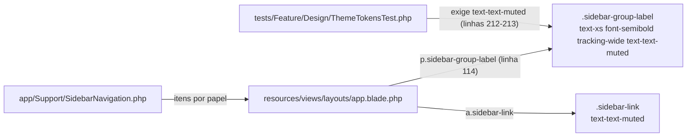
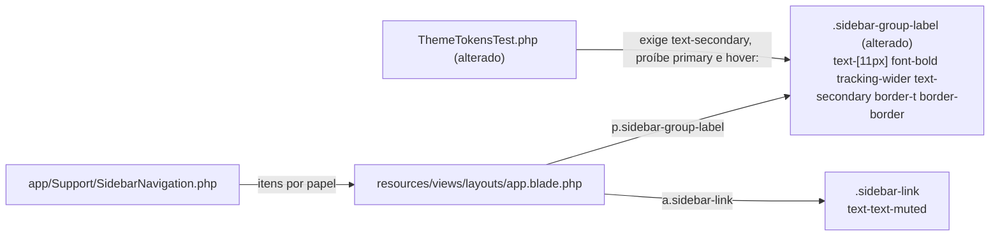

# Implementation Plan

## Request Summary
- Objective: distinguir visualmente os títulos de seção da sidebar (OPERAÇÃO, NOTIFICAÇÕES, CADASTROS, ADMINISTRAÇÃO) dos links clicáveis, trocando o estilo de `.sidebar-group-label` (cor `secondary`, 11 px em negrito, `tracking-wider`, separador superior) e atualizando o teste de tema que hoje fixa `text-text-muted`.
- Scope:
  - in: regra `.sidebar-group-label` em `resources/css/app.css`; teste `.sidebar-group-label` em `tests/Feature/Design/ThemeTokensTest.php`.
  - out: `app/Support/SidebarNavigation.php` (catálogo, itens, ordem, grupos, rotas, habilidades), markup de `resources/views/layouts/app.blade.php`, `.sidebar-link` / `.sidebar-link-active`, autorização, qualquer PHP em `app/`, dependências.
- Tier: light
- Architecture references: `CLAUDE.md` (§5 "A sidebar não é camada de autorização"; §8 "Sidebar: um catálogo só", "Classes Tailwind sempre literais"), `AGENTS.md`, `docs/agents/architecture.md`, `docs/agents/coding_guidelines.md`, `docs/agents/domain_rules.md`. `.ai/rules` não existe no repositório.

## AS IS — Componentes impactados

Hoje o título de seção (`resources/css/app.css:182-184`) e o link (`resources/css/app.css:174-176`) compartilham o token `text-text-muted`, e o teste de tema fixa essa cor no título. O catálogo e o layout só decidem onde o título aparece e não mudam.

## TO BE — Componentes propostos

T01 altera a regra `.sidebar-group-label` (nó CSS alterado, UI-01/UI-02/RNF-01/RNF-02); T02 altera o teste de tema (RF-01). Catálogo, layout e `.sidebar-link` permanecem iguais (UI-03).

## Tasks

### T01 — Restilizar `.sidebar-group-label` com o token secondary e separador
- **Files**: `resources/css/app.css` (regra `.sidebar-group-label`, hoje linhas 182-184, dentro do bloco de componentes da sidebar)
- **Change**: substituir o `@apply` atual (`px-3 pt-4 pb-1 text-xs font-semibold tracking-wide text-text-muted uppercase`) por um `@apply` só com classes literais, por exemplo: `mt-2 border-t border-border px-3 pt-4 pb-1 text-[11px] font-bold tracking-wider text-secondary uppercase`. Deve conter `text-secondary`, `text-[11px]`, `font-bold`, `tracking-wider`, `uppercase`, `border-t`, `border-border`; não pode conter `text-text-muted`, `primary`, `hover:`, `cursor-pointer` nem `underline`. Manter o comentário da seção ("primary only on the active item") e não tocar `.sidebar-link`/`.sidebar-link-active`. Nenhuma alteração em `layouts/app.blade.php` (o `
` da linha 114 continua igual) nem em `SidebarNavigation`. Contraste: #520C1F sobre `surface` #FFFFFF ≈ 14.7:1 (≥ 4.5:1, RNF-02); `secondary` não é o vermelho `primary`, preservando a regra de CLAUDE.md §8.
- **Covers**: UI-01, UI-02, UI-03, RNF-01, RNF-02
- **Tests**: `tests/Feature/Design/ThemeTokensTest.php` (atualizado em T02); `tests/Feature/Livewire/SidebarNavigationTest.php`, `tests/Feature/Authorization/SidebarNavigationCatalogueTest.php` sem modificação. `tests/Browser/SidebarNavigationTest.php` sem modificação (rodar isolado, redirecionando a saída para arquivo; exige `npm run build` para refletir o CSS).
- **Risk**: Low — mudança de estilo numa única regra; `border-t` também aparece acima do primeiro grupo (logo abaixo de "+ Nova Solicitação"), o que é aceitável como separador discreto.
- **Dependencies**: none

### T02 — Atualizar o teste de tema de `.sidebar-group-label`
- **Files**: `tests/Feature/Design/ThemeTokensTest.php` (teste das linhas 212-214)
- **Change**: renomear o teste para algo como `'.sidebar-group-label uses the secondary token and is not styled as a link'` e trocar a asserção: `expect(componentRule('.sidebar-group-label'))->toContain('text-secondary')->not->toContain('primary')->not->toContain('hover:')`. Remover a exigência de `text-text-muted`. Opcionalmente afirmar também `->not->toContain('text-text-muted')`, `->not->toContain('cursor-pointer')`, `->not->toContain('underline')` (UI-02). Não alterar nenhum outro teste.
- **Covers**: RF-01, UI-02
- **Tests**: `php artisan test --compact tests/Feature/Design/ThemeTokensTest.php` verde; depois `php artisan test --compact tests/Feature/Livewire/SidebarNavigationTest.php tests/Feature/Authorization/SidebarNavigationCatalogueTest.php`.
- **Risk**: Low — teste de leitura de arquivo; a asserção `not->toContain('primary')` só passa se T01 não usar nenhum token `primary*`.
- **Dependencies**: T01 (mesma fase; a asserção falha contra o CSS antigo)

## Risks
| Risk | Blast radius | Mitigation | Rollback |
|------|-------------|------------|----------|
| Classe arbitrária `text-[11px]` não gerada | Só o tamanho do título | `@apply` em CSS é processado pelo Tailwind 4 no build; classe literal (sem interpolação) | Reverter a regra em `resources/css/app.css` |
| Teste de navegador depender de estilo | `tests/Browser/SidebarNavigationTest.php` | SPEC exige que passe sem modificação; rodar após `npm run build` | Reverter T01 |
| Mudança não visível no ambiente do usuário | Percepção local | Lembrar `npm run build` / `composer run dev` | n/a |

## Open Questions
- Nenhuma bloqueante. Observação: o separador `border-t` também aparece no primeiro grupo (acima de "Operação"/"Notificações", logo abaixo do botão "+ Nova Solicitação"); a SPEC aceita isso por não restringir. Se for desejado só entre seções, exigiria mudar o markup (fora de escopo, UI-03) ou usar seletor CSS de irmão — não planejado.

## Assumptions
- Nenhum arquivo PHP é alterado, então Pint não tem efeito (rodar `vendor/bin/pint --dirty --format agent` mesmo assim por convenção, pois o teste é PHP).
- Contraste #520C1F / #FFFFFF calculado em ≈ 14.7:1 a partir dos tokens em `resources/css/app.css:36,39`.
- `tests/Browser/SidebarNavigationTest.php` não afirma cor/classe do título [UNVERIFIED — grep por `group-label` em `tests/` só encontrou `ThemeTokensTest.php`].
