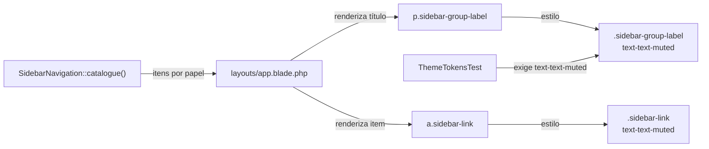
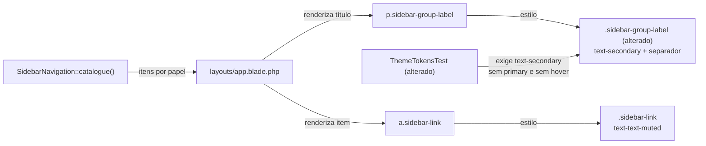

# SPEC: sidebar-titulos-secao

## Metadata
- Source: developer description via /plan (`.spec/features/sidebar-titulos-secao/.handoff/confirmed-input.md`)
- Service: sistema_obra_mc (Laravel 13 + Livewire 4, monorepo único)
- Tier: light
- Version: 1.0
- Architecture references: `AGENTS.md`, `CLAUDE.md` (§8 "Convenções travadas de UI"), `docs/agents/architecture.md`, `docs/agents/domain_rules.md`, `docs/agents/coding_guidelines.md`

## Context
Na sidebar (navegação primária única, `resources/views/layouts/app.blade.php`), os títulos de seção (OPERAÇÃO, NOTIFICAÇÕES, CADASTROS, ADMINISTRAÇÃO) são renderizados como `
` (verified at resources/views/layouts/app.blade.php:113-115). A regra `.sidebar-group-label` usa `text-text-muted` (verified at resources/css/app.css:182-184), o mesmo cinza dos links clicáveis `.sidebar-link` (verified at resources/css/app.css:174-176), então o usuário não distingue título de link. A mudança é exclusivamente visual: os títulos passam a usar o token `secondary` (#520C1F, verified at resources/css/app.css:36), tipografia menor/negrito com espaçamento maior e um separador superior discreto.

Regras de arquitetura citadas (`CLAUDE.md` §8):
- "Sidebar: um catálogo só" — `App\Support\SidebarNavigation::catalogue()` é a única lista de itens; vermelho (primary) só no item ativo, na ação "+ Nova Solicitação" e em detalhes. Esta feature não toca o catálogo.
- "Classes Tailwind sempre literais" — sem safelist; classe interpolada some do build de produção.
- "A sidebar não é camada de autorização" (`CLAUDE.md` §5) — nada de autorização muda.

O teste `tests/Feature/Design/ThemeTokensTest.php:212-213` hoje exige `text-text-muted` em `.sidebar-group-label` e precisa ser atualizado.

## AS IS — Estado atual

Hoje título de seção e link usam o mesmo token de cor `text-text-muted`, e o teste de tema fixa essa cor no título. O catálogo e o markup do layout apenas determinam onde o título aparece.

## TO BE — Estado proposto

Só a regra CSS `.sidebar-group-label` (UI-01, UI-02) e o teste de tema (RF-01) mudam; catálogo, layout e `.sidebar-link` permanecem iguais (UI-03, RNF-01).

## Scope
- **In**: regra `.sidebar-group-label` em `resources/css/app.css`; teste correspondente em `tests/Feature/Design/ThemeTokensTest.php`.
- **Out**: `SidebarNavigation` (itens, ordem, grupos, rotas, habilidades), markup de `layouts/app.blade.php`, `.sidebar-link`/`.sidebar-link-active`, autorização, qualquer arquivo PHP de `app/`, dependências.

## RIGID (Non-Negotiable)

### Functional Requirements
- RF-01 [Event-Driven]: When a suíte `tests/Feature/Design/ThemeTokensTest.php` é executada, the teste de `.sidebar-group-label` shall exigir que a regra contenha `text-secondary` e não contenha `primary` nem `hover:`.
  - AC: o teste afirma `toContain('text-secondary')`, `not->toContain('primary')` e `not->toContain('hover:')` sobre `componentRule('.sidebar-group-label')`, e não exige mais `text-text-muted`; a suíte passa.

### UI Requirements
- UI-01 [State-Driven]: While a sidebar exibe um título de seção, the `.sidebar-group-label` shall usar o token de cor `secondary` (#520C1F), texto em caixa alta com tamanho menor que `text-xs` (11 px), peso `font-bold`, espaçamento `tracking-wider` e um separador superior `border-t border-border`.
  - AC: a regra `.sidebar-group-label` em `resources/css/app.css` contém literalmente `text-secondary`, `text-[11px]`, `font-bold`, `tracking-wider`, `uppercase`, `border-t` e `border-border`, e não contém `text-text-muted`.
- UI-02 [Unwanted]: If a regra `.sidebar-group-label` for estilizada, then the regra shall não conter o token `primary`, nenhuma variante `hover:` e nenhuma classe `cursor-pointer` ou `underline`.
  - AC: busca textual na regra `.sidebar-group-label` por `primary`, `hover:`, `cursor-pointer` e `underline` retorna 0 ocorrências.
- UI-03 [State-Driven]: While a sidebar é renderizada para qualquer papel (`obra`, `suprimentos`, `gestao`), the títulos de seção shall permanecer elementos `
` não interativos, com os mesmos itens, ordem, grupos e rotas atuais.
  - AC: `resources/views/layouts/app.blade.php` e `app/Support/SidebarNavigation.php` não têm diff; `tests/Feature/Livewire/SidebarNavigationTest.php`, `tests/Feature/Authorization/SidebarNavigationCatalogueTest.php` e `tests/Browser/SidebarNavigationTest.php` passam sem modificação.

### Non-Functional Requirements
- RNF-01: Todas as classes Tailwind da regra são literais (nenhuma interpolação `{{ }}`); 0 dependências novas em `composer.json`/`package.json`; 0 arquivos PHP alterados em `app/`.
- RNF-02: O contraste entre o texto do título (#520C1F) e o fundo da sidebar (`surface`) é ≥ 4.5:1 (WCAG 2.1 AA para texto pequeno).

## Acceptance Criteria Summary
| ID | Criterion | Testable? |
|----|-----------|-----------|
| RF-01 | ThemeTokensTest exige `text-secondary`, proíbe `primary` e `hover:` em `.sidebar-group-label`; suíte verde | Sim (Pest) |
| UI-01 | Regra contém `text-secondary`, `text-[11px]`, `font-bold`, `tracking-wider`, `uppercase`, `border-t`, `border-border`; sem `text-text-muted` | Sim (inspeção/Pest) |
| UI-02 | Regra sem `primary`, `hover:`, `cursor-pointer`, `underline` | Sim (Pest/grep) |
| UI-03 | Layout e catálogo sem diff; 3 testes de sidebar verdes sem modificação | Sim (git diff + Pest) |
| RNF-01 | Classes literais; 0 dependências novas; 0 PHP em `app/` alterado | Sim (git diff) |
| RNF-02 | Contraste #520C1F sobre surface ≥ 4.5:1 | Sim (cálculo de contraste) |
