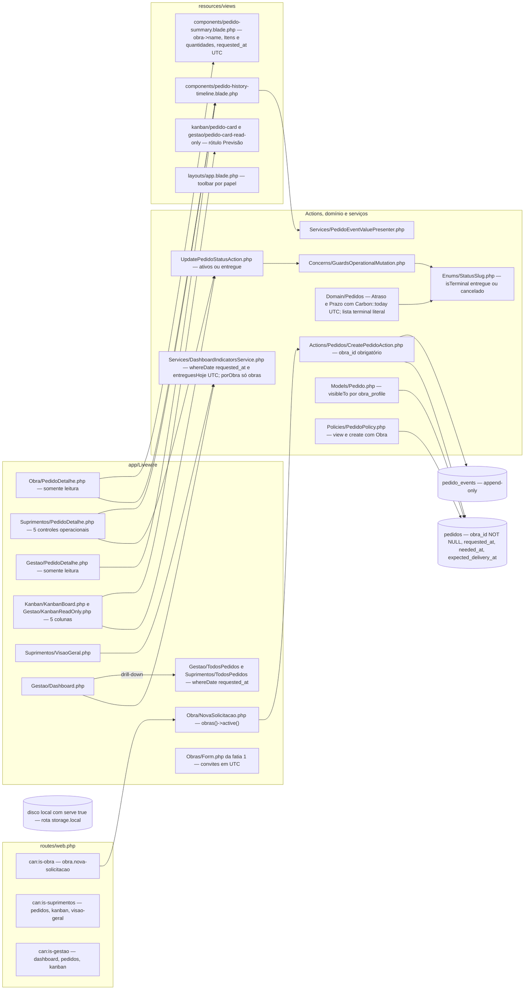
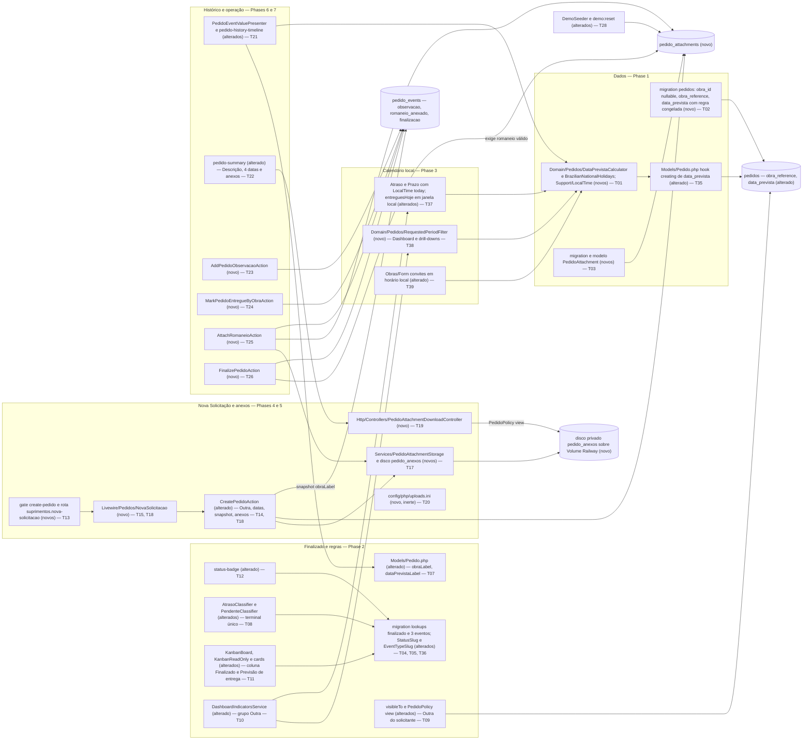

# Implementation Plan

Feature: `solicitacao-historico-finalizacao` (fatia 2 de 3) · Branch: `build/v0-demo-laravel` · Base: the commit that closes slice 1 (see gate G-2)
Source SPEC: `.spec/features/solicitacao-historico-finalizacao/SPEC.md` (v1.2: RF-01..RF-48, UI-01..UI-09, CT-01..CT-10, RNF-01..RNF-09, 0 clarification markers)
Developer decisions: `.spec/features/solicitacao-historico-finalizacao/.handoff/clarifier-answers.md` (2026-09-22, every recommendation accepted) and `.handoff/master-plan.md` (§10–§15, §19–§21, §29–§35, §42, §47–§48; §43/§44 as constraints)
Cross-review fixes (fatia 2, 2026-09-23): `.spec/features/navegacao-sidebar-listagens/.handoff/cross-review-fixes.md` (evidence: `cross-review.md`). Applied here: F-01 (local calendar: T01, T37, T38, T39), F-02 (T14/T15 migrate the unlisted callers; T34 allow-list), F-03 (T28 DemoSeeder, T30 Suprimentos creation, T32 runbook), F-04 (every phase closes green: Phase 1 regrouped without the lookup rows, T04/T05 moved next to T10/T11/T12; new T35/T36), F-06 (T22), F-07 (T11), F-08 (T14), F-09 (T14, T21), F-12 (T39, T31), F-14(b)(c) (T04, T02, T06), F-17 (T14, T15).
Cross-review v2 (fatia 2, 2026-09-23): `.spec/features/navegacao-sidebar-listagens/.handoff/cross-review-v2-decisions.md` (evidence: `cross-review-v2.md`). Applied here, slice-2 items only: **D-1/N-02 approved** (T21 relabels `assertSee('Criação do pedido')` → "Pedido criado" in `PedidoDetalheObraTest:34` and `PedidoDetalheGestaoTest:43`; T23/T24 narrow `PedidoDetalheObraTest:36-53` to the US-2.2 intent with positive assertions; `PedidoDetalheGestaoTest:61-62` unchanged; the three hunks join the T34 allow-list, so Phases 6 and 7 close green), **N-06** (T11 Kanban cards "Necessário em" → "Preciso para"; T10 KPI captions in `gestao/dashboard` and `suprimentos/visao-geral` → "Preciso para vencido e não concluídos"; the `suprimentos/todos-pedidos` caption is slice 3 T14). Defaults **D-5, D-8, D-9 confirmed** by the developer (Open Questions closed).
Upstream (built on, never redone): `.spec/features/obras-associacoes-cadastro-convites/{SPEC,PLAN,PHASES}.md` (slice 1: 28 tasks, 9 phases)
Downstream consumer: `.spec/features/navegacao-sidebar-listagens/SPEC.md` (slice 3 consumes CT-05..CT-08 and CT-10 exactly as named in "Outbound contract surface" below)
Executable view: `.spec/features/solicitacao-historico-finalizacao/PHASES.md` (39 tasks, 10 phases)

## Pré-requisitos de execução (gates — não são tarefas)

**G-1 — Commit documental separado (por referência ao gate de slice 1).** Vale literalmente o gate descrito no topo de `.spec/features/obras-associacoes-cadastro-convites/PLAN.md` ("Pré-requisito de execução"): nenhum `docs/agents/*.md` modificado e não commitado pode existir quando o Ralph começar. Verificação: `git status --short docs/agents` → vazio. Se, ao iniciar esta fatia, houver qualquer diferença pendente em `docs/agents/`, ela vai para um commit somente de documentação (apenas `docs/agents/*.md`; `git show --stat --format= HEAD -- . ':!docs/agents'` vazio) antes do Ralph. Os artefatos `.spec/` desta fatia e da fatia 3 não entram nesse commit.

**G-2 — Fatia 1 mergeada e validada.** Ordem decidida pelo desenvolvedor: Ralph 1 → validar → **Ralph 2** → validar → Ralph 3 → validar → regressão completa. O Ralph desta fatia não começa enquanto qualquer item abaixo falhar (o desenvolvedor verifica):
- as 9 fases de slice 1 estão no `HEAD` da branch: os 8 commits `feat(phase-N): …` de `obras-associacoes-cadastro-convites` **e** o commit somente de documentação da Fase 9 (T27; se o Ralph headless não conseguiu invocar `/ai-context`, o commit documental equivalente feito pelo desenvolvedor);
- `app/Enums/ObraStatus.php` existe; `grep -n "is_active" app/Models/Obra.php` → vazio; `Obra::scopeActive` filtra por `status != 'concluido'`;
- `php artisan route:list --name=obras` e `--name=associacoes` listam `obras.index`, `obras.create`, `obras.edit`, `associacoes.index`; `Gate::has('manage-obras')` é verdadeiro;
- `ls database/migrations` contém `*_convert_obras_activity_to_status.php`, `*_create_obra_invitations_table.php`, `*_create_obra_admin_events_table.php`, `*_create_account_registration_events_table.php`;
- `resources/views/livewire/obras/form.blade.php` contém a seção "Convites" (slice 1 T12) e `tests/Feature/Auth/ZeroObraUserTest.php` existe (slice 1 T19) — ambos são tocados por T39/T14 desta fatia;
- a suíte de slice 1 está verde (T28 de slice 1: Unit + Feature + Browser, um processo Pest por vez em `127.0.0.1:5434`) e o desenvolvedor registrou a validação manual da fatia 1;
- `git status --short -- app database routes resources tests config` → vazio (árvore limpa antes da primeira fase).

**G-3 — Consultas somente leitura em produção antes do merge da Fase 2 (Railpack roda `php artisan migrate` a cada start do container, `CLAUDE.md` §2).** Mesmo protocolo de slice 1: o Claude executa via Railway **somente após confirmação do desenvolvedor naquele momento**, e nada escreve em produção:
- `select count(*) from pedidos where requested_at is null;` — espera-se 0 (T02, Fase 1, usa `requested_at` no backfill; verificar antes do merge da Fase 1);
- `select slug, sort_order from statuses order by sort_order;` — espera-se 6 linhas com `sort_order` 1..6 e nenhum `finalizado`; qualquer `sort_order = 7` ocupado por outro slug faz T04 (Fase 2) abortar o deploy (ver Risks).

**G-4 — Volume e limites de upload antes do push que publica esta fatia.** A branch `build/v0-demo-laravel` faz deploy automático a cada push (`CLAUDE.md` §2). O desenvolvedor só dá `git push` desta fatia depois de cumprir o runbook de T32 (Volume Railway montado, `PEDIDO_ANEXOS_ROOT` e `PHP_INI_SCAN_DIR` definidos, limites conferidos, usuários Suprimentos associados às obras). O Ralph commita localmente; nenhum deploy acontece nesta fase de planejamento.

## Request Summary

- **Objective**: let papéis `obra` **and** `suprimentos` create solicitações (obra associada e ativa, or "Outra" with an optional reference), with three distinct dates (Data da solicitação, Preciso para, Data prevista = +3 dias úteis in `America/Sao_Paulo`), private attachments with authorized download, a standardized history with observations, an Obra-side "Marcar como entregue", romaneio upload, and a new terminal status **Finalizado** that requires a valid romaneio. Move every "day" rule (atraso, prazo, `entreguesHoje`, Dashboard period) and every timestamp display to the `America/Sao_Paulo` calendar through one conversion point, with UTC storage unchanged. Publish CT-05..CT-08 and CT-10 for slice 3.
- **Scope in**: 3 additive migrations (pedidos: `obra_id` nullable + `obra_reference` + `data_prevista` backfilled with a frozen rule; `pedido_attachments`; lookup rows `finalizado` + 3 event types); `StatusSlug`/`EventTypeSlug` extensions with a single terminal definition; `DataPrevistaCalculator` + national-holiday rule (pure PHP); `App\Support\LocalTime` (single conversion point, local-day helpers); `App\Domain\Pedidos\RequestedPeriodFilter` (single local-day period class, CT-10); local-day atraso/prazo/`entreguesHoje`; `Pedido::obraLabel()`/`dataPrevistaLabel()` presentation points; `visibleTo`/`PedidoPolicy::view` for "Outra"; `create-pedido` ability; papel-neutral Nova Solicitação component reachable by Obra and Suprimentos with a papel-aware empty state; private disk `pedido_anexos` + attachment storage service + invokable download controller; 4 new Actions (observação, Obra entregue, romaneio, finalizar); history presenter rewrite with a creation-time `criacao_pedido` snapshot; Kanban Finalizado column and "Previsão de entrega" card label; indicators (`porStatus` includes Finalizado, `porObra` "Outra" group); summary "Descrição" label; slice 1 convite list timestamps in local time; `demo:reset`/`DemoSeeder` (incl. demo Suprimentos associations)/factories; upload-limit configuration file (inert until the runbook enables it); README runbook; docs regeneration; gates.
- **Scope out** (no exception): everything owned by slice 1 (obras area, obra status, associations, Novo Cadastro, convites — except routing slice 1's convite timestamps through `LocalTime`, RF-47) and slice 3 (listing columns "Solicitante / Obra" and "Solicitado em", "Itens → Descrição" in listings, listing "Previsão" column, sorting, compact filters, "Solicitado" presets and "Personalizado", "Somente obras ativas", sidebar, homes, cross-cutting responsive pass); "3 dias" display; deleting/replacing attachments or observations; editing a pedido after creation; e-mail notifications; thumbnails/inline preview; antivirus; any Gestão write; any deploy.
- **Tier**: complete
- **Architecture references** (all present, all honoured): `AGENTS.md`, `CLAUDE.md` (§3 business rules, §5 authorization, §6 data model; §7 "O que NÃO existe" is stale about rate limiting and audit tables — the code wins), `docs/agents/architecture.md`, `docs/agents/domain_rules.md`, `docs/agents/data_model.md`, `docs/agents/api_contracts.md`, `docs/agents/coding_guidelines.md`. `.spec/init/*` describes the discontinued Next.js/Supabase stack and was not used.

### Architecture rules every task below must preserve

| Rule | Source | Mechanically enforced by |
|---|---|---|
| Route → full-page Livewire component → `mount()` re-checks the ability → `$this->authorize(<policy ability>)` before **every** mutating method → exactly one single-purpose Action per write. Components never persist. The only new controller (download, T19) streams bytes and authorizes with `PedidoPolicy::view`; it writes nothing | `docs/agents/architecture.md` "Layer responsibilities" (lists `app/Http/Controllers/Controller.php` as the empty base); `docs/agents/coding_guidelines.md` §1–§2 | `tests/Feature/Authorization/BypassUiAuthorizationTest.php` (extended T27) |
| Actions own `Validator::make` with PT-BR messages, the actor guard (trait), the terminal-state guard, and the `DB::transaction` that writes the mutation together with its **single** `pedido_events` row; a no-op writes nothing. Validation and guards run **before** the transaction and before `PedidoCodeGenerator::generate()` (`nextval` is not rolled back) | `docs/agents/architecture.md` "Request pipeline"; `docs/agents/coding_guidelines.md` §3; `app/Actions/Pedidos/Concerns/GuardsOperationalMutation.php:23-40` | Action tests per task; `last_value` of `pedido_code_sequence` asserted |
| `pedido_events` is append-only (`UPDATED_AT = null`, `updating`/`deleting` throw, `PedidoEventPolicy` denies). The new `pedido_attachments` copies the pattern. `demo:reset` is the only exemption and never goes through the models | `docs/agents/coding_guidelines.md` §8; `CLAUDE.md` §6 | `tests/Unit/Models/PedidoEventImmutabilityTest.php`, `tests/Feature/Compliance/AuditTrailsAppendOnlyTest.php` (extended T28) |
| `Pedido::visibleTo` is the single row-visibility rule, opens every listing query in the same statement, and a user filter only narrows it. `PedidoPolicy::view` mirrors it | `CLAUDE.md` §5 "Decisão travada"; `app/Models/Pedido.php:40-48` | `tests/Feature/Authorization/PedidoVisibleToScopeTest.php`, `tests/Feature/Compliance/ObraVisibleToGuardTest.php` (extended T09/T15) |
| Application-layer authorization only (`guest`/`auth` → `active` → `can:` → `mount()` → Policy → Action guard → Action validation). No RLS, no global scope | `CLAUDE.md` §5 | `tests/Feature/Security/Adversarial/NoGlobalScopeNoRlsTest.php` |
| Atraso/pendente/prazo have one definition each in `app/Domain/Pedidos/` and stay measured by `needed_at`; the terminal list has **one** definition (`StatusSlug::terminal()`), consumed by PHP and SQL; "today" is the `America/Sao_Paulo` day obtained only from `LocalTime` | `docs/agents/domain_rules.md` "Atraso, pendência, prazo"; SPEC RF-39, RF-45 | compliance scans (T08, T37) |
| One conversion point for the local calendar (`App\Support\LocalTime`) and one local-day period class (`App\Domain\Pedidos\RequestedPeriodFilter`); `config('app.timezone')` stays `UTC`; timestamps are compared as UTC half-open intervals, never with `whereDate` on a UTC value; `date` columns are never timezone-shifted | SPEC RF-10, RF-45..RF-47, CT-10 | T38 `RequestedPeriodSingleDefinitionTest`, T31 `LocalTimeDisplayComplianceTest` |
| Lookup rows resolved by slug, never by id literal; enum-backed slugs with TitleCase cases; explicit `#[Fillable]`; new models get factories | `docs/agents/coding_guidelines.md` §6–§7 | `tests/Unit/Enums/SlugEnumsTest.php`, `tests/Feature/Security/MassAssignmentTest.php` |
| "Obra ativa" is consumed from slice 1 (`Obra::active()` / `ObraStatus::isActive()`), never re-implemented | slice 1 RF-03; `tests/Feature/Compliance/ObraActivityDefinitionTest.php` (slice 1 T26) | that test stays green |
| PT-BR user text, English identifiers with Portuguese domain nouns, PT-BR URL segments; literal Tailwind classes; no `{!! !!}`; brand only via `config('app.name')`; listing filter state only via `#[Url]` | `docs/agents/coding_guidelines.md` §5, §10, §11 | `BladeEscapingTest`, `BrandIdentityComplianceTest`, `FilterUrlStateComplianceTest`, `BuiltAssetsUtilitiesTest` |
| No REST API: routes are `routes/web.php` only; the download is a plain authenticated GET | `docs/agents/api_contracts.md` | `tests/Feature/Auth/EnsureUserIsActiveTest.php:109` (every authenticated route carries `active`) |
| PHP **8.4**-compatible (production 8.4.25); `php artisan make:*`; Pint; Pest; **no new Composer/npm dependency**; no `ext-calendar` requirement; no new base folder | `CLAUDE.md` §2, §8; `AGENTS.md` | T34 gate |
| `docs/agents/*.md` regenerated by `/ai-context` only; `CLAUDE.md`/`AGENTS.md`/`README.md` hand-written | `CLAUDE.md` §8 | `tests/Feature/Compliance/DocumentationParityTest.php` |
| **Every phase closes green** (F-04): the Feature and Unit suites pass at the end of each phase; no phase commits known failures for a later phase to fix | cross-review F-04 | phase gate of each phase (Ralph verification) |

### Outbound contract surface (names fixed for slice 3; slice 3 consumes these exact names)

| CT | Name fixed by this PLAN | Task |
|---|---|---|
| CT-05 | Ability `create-pedido` (exactly `obra` + `suprimentos`); routes `obra.nova-solicitacao` (`GET /obra/nova-solicitacao`, kept) and **`suprimentos.nova-solicitacao`** (`GET /suprimentos/nova-solicitacao`), both bound to `App\Livewire\Pedidos\NovaSolicitacao`, inside `['auth','active']` + `can:create-pedido` | T13, T15 |
| CT-06 | Column **`pedidos.data_prevista`** (`date NOT NULL`, index `pedidos_data_prevista_index`); presentation point **`Pedido::dataPrevistaLabel(): string`** (instance) delegating to **`Pedido::presentDataPrevista(CarbonInterface): string`** (static, `d/m/Y`) — the single place a future "3 dias" display changes. The Kanban cards label `expected_delivery_at` **"Previsão de entrega"** (UI-09); bare "Previsão" is slice 3's listing column = `data_prevista` | T02, T35, T07, T11 |
| CT-07 | Column **`pedidos.obra_reference`** (`varchar(255) NULL`); presentation point **`Pedido::obraLabel(): string`** → obra name / `"Outra"` / `"Outra — <referência>"`; constant **`Pedido::OUTRA_LABEL = 'Outra'`**; `porObra` groups every pedido without obra under one `Outra` row; `criacao_pedido.new_value` = the `obraLabel()` snapshot at creation (slice 3 never re-derives it) | T02, T07, T10, T14 |
| CT-08 | `StatusSlug::Finalizado`; `StatusSlug::terminal()` / `terminalValues()` / `isTerminal()` (Entregue, Cancelado, Finalizado); `StatusSlug::finalizableFrom()` (4 active + Entregue); `Pedido::visibleTo` per RF-40; Kanban columns = 4 active, Entregue, Finalizado; `AtrasoClassifier`/`PrazoClassifier` "today" = `LocalTime::today()` | T04, T08, T09, T11, T37 |
| CT-10 | **`App\Domain\Pedidos\RequestedPeriodFilter`** (`final class`, static API, file `app/Domain/Pedidos/RequestedPeriodFilter.php`): `public const string COLUMN = 'requested_at'`; **`utcBoundsForLocalRange(?string $localFrom, ?string $localTo): array{from: ?CarbonImmutable, until: ?CarbonImmutable}`** (`from` = local 00:00 of De in UTC, inclusive; `until` = local 00:00 of the day after Até in UTC, exclusive; empty/unparseable side → `null`); **`applyLocalRange(Builder $query, ?string $localFrom, ?string $localTo): Builder`** (`where('requested_at', '>=', from)` / `where('requested_at', '<', until)`). Slice 3 **adds** its presets (`effectivePreset`, `utcWindow`, preset `apply`) to this same class and routes "Personalizado" through `applyLocalRange` — it must not create the file again nor keep any `whereDate('requested_at', …)` | T38 |
| Conversion point | **`App\Support\LocalTime`**: `TIMEZONE = 'America/Sao_Paulo'`, `toLocal(CarbonInterface): CarbonImmutable`, `formatDateTime(?CarbonInterface): string` (`d/m/Y H:i`, `'—'` for null), `formatDate(?CarbonInterface): string` (`d/m/Y`), `today(): CarbonImmutable` (local date at 00:00 in `TIMEZONE`), `localDayStartUtc(CarbonInterface\|string $localDate): CarbonImmutable`, `todayWindowUtc(): array{0: CarbonImmutable, 1: CarbonImmutable}` | T01 |
| Test helpers | `seedWorkflowStatuses(): array<string, Status>` and `seedHistoryEventTypes(): array<string, EventType>` in `tests/Pest.php`; `Pedido::factory()->outra(?string $reference = null)` | T05, T07 |

## AS IS — Componentes impactados

Legenda: hoje só o papel `obra` cria pedidos (`routes/web.php:69-73`, `PedidoPolicy::create` com `Obra`), sempre com obra associada e ativa (`CreatePedidoAction.php:49-61`); não há anexos nem disco dedicado, e o disco `local` expõe a rota assinada `storage.local`. Todo "hoje" é o dia UTC (`AtrasoClassifier.php:26,46`, `PrazoClassifier.php:30`, `DashboardIndicatorsService.php:113`) e o período usa `whereDate('requested_at')` (`DashboardIndicatorsService.php:154,158`, `Gestao/TodosPedidos.php:172,176`, `Suprimentos/TodosPedidos.php:179,183`); a lista terminal aparece literal em `AtrasoClassifier.php:42-45` e `PendenteClassifier.php:34`.

## TO BE — Componentes propostos

Legenda: a Fase 1 cria o calendário e o ponto único de conversão (T01), as colunas novas de `pedidos` com backfill por regra congelada (T02), o hook que preenche a Data prevista em todo insert (T35) e a tabela de anexos (T03). A Fase 2 introduz Finalizado e todos os seus consumidores juntos (T04, T05, T36, T12, T08, T11) e as regras compartilhadas de "Outra" (T07, T09, T10); a Fase 3 move "hoje" e o período para o dia de São Paulo (T37, T38) e converte os horários da fatia 1 (T39). Criação, anexos, histórico e operações do detalhe ficam em T13–T27, e a demo em T28.

## Tasks

### T01 — Calendário de dias úteis, `DataPrevistaCalculator` e ponto único de conversão `LocalTime` (PHP puro)
- **Files**: `app/Domain/Pedidos/BrazilianNationalHolidays.php` (novo, `php artisan make:class Domain/Pedidos/BrazilianNationalHolidays --no-interaction`), `app/Domain/Pedidos/DataPrevistaCalculator.php` (novo), `app/Support/LocalTime.php` (novo, `make:class Support/LocalTime`), `tests/Unit/Domain/BrazilianNationalHolidaysTest.php`, `tests/Unit/Domain/DataPrevistaCalculatorTest.php`, `tests/Unit/Support/LocalTimeTest.php` (novos)
- **Change**: `LocalTime` (final, static) is the single boundary conversion (RF-10, RF-45..RF-47, CT-10); `config('app.timezone')` stays `UTC`. API: `public const string TIMEZONE = 'America/Sao_Paulo'`; `toLocal(CarbonInterface $utc): CarbonImmutable`; `formatDateTime(?CarbonInterface $utc): string` (`d/m/Y H:i` in `TIMEZONE`, `'—'` for null); `formatDate(?CarbonInterface $utc): string` (`d/m/Y` of the local day, `'—'` for null); `today(): CarbonImmutable` = `CarbonImmutable::now(self::TIMEZONE)->startOfDay()`; `localDayStartUtc(CarbonInterface|string $localDate): CarbonImmutable` = local 00:00 of that calendar date (a `Y-m-d` string is parsed with `'!Y-m-d'` in `TIMEZONE`) converted with `->utc()`; `todayWindowUtc(): array{0: CarbonImmutable, 1: CarbonImmutable}` = `[localDayStartUtc(today()), localDayStartUtc(today()->addDay())]` (half-open). `BrazilianNationalHolidays` has `public const array FIXED = ['01-01','04-21','05-01','09-07','10-12','11-02','11-15','11-20','12-25']`, `easterSunday(int $year): CarbonImmutable` implemented with the anonymous Gregorian (Meeus/Jones/Butcher) algorithm in integer arithmetic — **no `easter_date()`/`easter_days()`, no `ext-calendar`** — `goodFriday(int $year)` = Easter − 2 days, and `isHoliday(CarbonInterface $date): bool`. `DataPrevistaCalculator` has `public const int DIAS_UTEIS = 3` and `public static function forRequestedAt(CarbonInterface $requestedAt): CarbonImmutable`: `LocalTime::toLocal()`, take the calendar date, then advance day by day counting only Monday–Friday that are not `isHoliday`, until `DIAS_UTEIS` business days strictly after that date have been counted; return a date-only `CarbonImmutable`. This is the **only** live business-day computation in `app/` (RF-11; the T02 migration holds a frozen copy by design, RF-12). Docblocks name RF-10/RF-11/RF-45 and state that state/municipal holidays, Carnaval and Corpus Christi are out of scope.
- **Covers**: RF-10, RF-11 (single rule), RF-45/RF-46/RF-47 (conversion point), RNF-05, CT-10 (conversion point)
- **Tests**: `BrazilianNationalHolidaysTest`: Easter Sunday for 2024-03-31, 2025-04-20, 2026-04-05, 2027-03-28, 2030-04-21, 2038-04-25; Good Friday 2026-04-03; every FIXED date is a holiday for 2026; 2026-10-13 and Carnaval 2026-02-17 are not. `DataPrevistaCalculatorTest` (dataset = the 6 rows of the RF-10 table, each input as a UTC instant): Mon 2026-09-21 → 2026-09-24; Fri 09-25 → 09-30; Sat 09-26 → 09-30; Sun 09-27 → 09-30; Fri 10-09 → 10-15; `2026-09-25T01:30:00Z` → 2026-09-29. Extra: Wed 2026-04-01 → Tue 2026-04-07 (Good Friday skipped); `config('app.timezone')` is `UTC` after the calls. `LocalTimeTest`: `2026-09-25T01:30Z` formats as `24/09/2026 22:30` and `formatDate` as `24/09/2026`; with `travelTo('2026-09-22T01:30:00Z')`, `today()` is 2026-09-21 and `todayWindowUtc()` = [`2026-09-21T03:00Z`, `2026-09-22T03:00Z`); `localDayStartUtc('2026-09-22')` = `2026-09-22T03:00Z`; `formatDateTime(null)` = `—`.
- **Risk**: Low. Pure functions; the algorithm is pinned by known Easter dates.
- **Dependencies**: none (gates G-1, G-2)

### T02 — Migration de `pedidos`: `obra_id` nullable, `obra_reference`, `data_prevista` com backfill por regra congelada
- **Files**: `database/migrations/<timestamp>_add_outra_reference_and_data_prevista_to_pedidos.php` (novo, `php artisan make:migration add_outra_reference_and_data_prevista_to_pedidos --no-interaction`)
- **Change**: the timestamp must sort **after every existing migration**, including slice 1's four (`*_convert_obras_activity_to_status`, `*_create_obra_invitations_table`, `*_create_obra_admin_events_table`, `*_create_account_registration_events_table`); `make:migration` at execution time guarantees it, and T06 re-checks it. Docblock style of `2026_09_22_155011_normalize_user_emails_and_add_lower_unique_index.php`. **Frozen rule (RF-12, F-14c)**: the anonymous migration class carries its own copy of the business-day rule — private constants `DIAS_UTEIS = 3`, `TIMEZONE = 'America/Sao_Paulo'`, the 9 fixed holidays, a private Meeus/Jones/Butcher Easter computation and Good Friday — exposed as `public function frozenDataPrevista(string $requestedAtUtc): string` (returns `Y-m-d`; public only so T06 can assert parity). The file imports **no** `App\Domain\*`/`App\Support\*`/`App\Models\*` class; its docblock states that the copy is deliberately frozen so a future change to the live rule never changes what `migrate`/`migrate:fresh` backfills. `up()` inside one `DB::transaction`, in order: (1) `ALTER TABLE pedidos ALTER COLUMN obra_id DROP NOT NULL` via `DB::statement` (the FK `pedidos_obra_id_foreign` with `ON DELETE RESTRICT` is untouched); (2) add `obra_reference varchar(255) NULL` and the checks `pedidos_obra_reference_only_without_obra` = `CHECK (obra_id IS NULL OR obra_reference IS NULL)` and `pedidos_obra_reference_not_blank` = `CHECK (obra_reference IS NULL OR btrim(obra_reference) <> '')`; (3) add `data_prevista date NULL`; (4) backfill with `DB::table('pedidos')->select('id','requested_at')->orderBy('id')->chunkById(500, …)`, computing `$this->frozenDataPrevista($row->requested_at)` per row and `DB::table('pedidos')->where('id', $id)->update(['data_prevista' => …])` (query builder, so no model hook runs); (5) `ALTER COLUMN data_prevista SET NOT NULL`; (6) index `pedidos_data_prevista_index` on `data_prevista`. No `DELETE`/`TRUNCATE`/drop; `expected_delivery_at` and every `pedido_events` row untouched. `down()`: if any row has `obra_id IS NULL`, throw `RuntimeException` in PT-BR ("Existem pedidos \"Outra\" sem obra; a reversão exigiria apagar dados.") before any change; otherwise drop the index, `data_prevista`, the two checks, `obra_reference`, and restore `obra_id NOT NULL`.
- **Covers**: RF-06 (DB check), RF-12 (persisted + frozen backfill), RF-42, CT-02, CT-06 (column), RNF-06
- **Tests**: covered by T06 (same phase).
- **Risk**: **Medium**. Runs at container start in production (Railpack). The backfill is per-row but V0 volume is tiny; G-3 confirms `requested_at` has no nulls. The frozen copy can drift from the live rule only by a deliberate change, which T06's parity test makes visible.
- **Dependencies**: T01 (parity reference only; no code import)

### T35 — Hook de criação do `Pedido`: `requested_at` e `data_prevista` preenchidos em todo insert, e imutabilidade da Data prevista
- **Files**: `app/Models/Pedido.php` (`booted()` and `casts()` only), `tests/Unit/Models/PedidoDataPrevistaHookTest.php` (novo)
- **Change**: this task exists so Phase 1 closes green (F-04): once T02 makes `data_prevista` NOT NULL, every insertion path (factories, `DemoSeeder`, `CreatePedidoAction`) must fill it, through the one live rule. Cast `data_prevista` → `date`. `booted()`: `static::creating` sets `requested_at = now()` when null and `data_prevista = DataPrevistaCalculator::forRequestedAt($pedido->requested_at)` when null; `static::updating` throws `LogicException` ("A data prevista é fixada na criação e não pode ser recalculada.") when `isDirty('data_prevista')` (RF-12: never recomputed). `requested_at` set in PHP (app clock, UTC) is equivalent to the DB default in production and lets `travelTo()` control both dates; the DB default stays as a backstop. Docblock names RF-09/RF-10/RF-12.
- **Covers**: RF-09 (server-set dates), RF-12 (immutability), CT-06
- **Tests**: `PedidoDataPrevistaHookTest`: `travelTo('2026-09-21 12:00')` + `Pedido::factory()->create()` → `requested_at` = test clock and `data_prevista` 2026-09-24; a factory with explicit `requested_at = 2026-09-25T01:30Z` → 2026-09-29; `update(['expected_delivery_at' => …])` and a `status_id` change leave `data_prevista` unchanged; forcing `data_prevista` on update throws. The whole Feature + Unit suite is green at the end of Phase 1.
- **Risk**: Medium. Every existing test that creates a pedido now goes through the hook; the hook only fills nulls.
- **Dependencies**: T01, T02

### T03 — Tabela `pedido_attachments`, modelo `PedidoAttachment` (append-only) e enum de tipo
- **Files**: `database/migrations/<timestamp>_create_pedido_attachments_table.php` (novo), `app/Models/PedidoAttachment.php` (novo, `php artisan make:model PedidoAttachment --factory --no-interaction`), `database/factories/PedidoAttachmentFactory.php` (novo), `app/Enums/PedidoAttachmentKind.php` (novo, `make:enum PedidoAttachmentKind --string`), `app/Policies/PedidoAttachmentPolicy.php` (novo), `tests/Unit/Models/PedidoAttachmentImmutabilityTest.php` (novo), `tests/Feature/Security/MassAssignmentTest.php` (dataset addition only)
- **Change**: table per CT-03: `id`, `pedido_id` FK `pedidos` **cascadeOnDelete** (mirrors `pedido_events`, so `demo:reset`'s pedido delete stays valid), `kind varchar(20)` with `CHECK (kind in ('anexo','romaneio'))` named `pedido_attachments_kind_check`, `path varchar(255)` **unique**, `original_name varchar(255)`, `mime_type varchar(127)`, `size_bytes bigint` with `CHECK (size_bytes > 0)`, `uploaded_by` FK `users` **restrict**, `created_at` `useCurrent()`; **no `updated_at`**; index `(pedido_id, kind)`. Timestamp sorts after T02's. Enum `PedidoAttachmentKind: string` with `Anexo = 'anexo'`, `Romaneio = 'romaneio'` and `label()` ("Anexo"/"Romaneio"). Model copies `PedidoEvent`: `const UPDATED_AT = null`, `booted()` with `updating`/`deleting` throwing `LogicException` ("PedidoAttachment registros são imutáveis e não podem ser atualizados/excluídos."), `#[Fillable(['pedido_id','kind','path','original_name','mime_type','size_bytes','uploaded_by'])]`, `#[Hidden(['path'])]`, casts `kind` → enum, `size_bytes` → int; relations `pedido()`, `uploader()` (`uploaded_by`). `PedidoAttachmentPolicy::update/delete` return `false`. Factory default `kind = Anexo`, random 40-hex `path`, `original_name = 'documento.pdf'`, `mime_type = 'application/pdf'`, `size_bytes = 1024`; state `romaneio()`.
- **Covers**: CT-03 (record), RF-19 (model guard), RF-30 (explicit classification column), RF-42
- **Tests**: `PedidoAttachmentImmutabilityTest`: `update()`, `save()` on an existing row and `delete()` throw; the DB rejects `kind = 'outro'` and `size_bytes = 0`; deleting the parent pedido through `DB::table('pedidos')` cascades the row. `MassAssignmentTest` dataset gains `PedidoAttachment` with the exact fillable list (addition).
- **Risk**: Low
- **Dependencies**: T02 (migration ordering), T35 (the factory builds a pedido)

### T06 — Testes das migrations de `pedidos` e `pedido_attachments` e paridade da regra congelada
- **Files**: `tests/Feature/Migrations/PedidoOutraDataPrevistaMigrationTest.php` (novo), `tests/Feature/MigrationSchemaTest.php`, `tests/Feature/FreshMigrationTest.php`
- **Change**: verification only, in the style of `tests/Feature/Migrations/EmailNormalizationMigrationTest.php` and slice 1 T04 (roll back to before T02's migration, insert rows through `DB::table`, re-run). The schema-pinning assertions forced by T02/T03 are updated here, in the phase that causes them (F-04): `MigrationSchemaTest` (`pedidos` now lists `obra_reference`, `data_prevista`; `obra_id` nullable with the FK still `obras`/restrict; new table `pedido_attachments` without `updated_at`) and `FreshMigrationTest` (adds `pedido_attachments`). No other assertion changes.
- **Covers**: RF-06, RF-12 (incl. frozen rule parity), RF-42, RNF-06, CT-02
- **Tests**: (a) pedidos with `requested_at` = `2026-09-21 12:00Z`, `2026-09-25T01:30Z`, `2026-10-09 15:00Z` get `data_prevista` = 2026-09-24 / 2026-09-29 / 2026-10-15; no row has null `data_prevista`; `expected_delivery_at` values byte-identical. (b) **Parity (F-14c)**: `(require <T02 file>)->frozenDataPrevista($utc)` equals `DataPrevistaCalculator::forRequestedAt($utc)->toDateString()` for the 6 RF-10 rows plus Wed 2026-04-01 (Good Friday) and every day of 2026 at 12:00Z and 01:30Z; a token scan of the T02 file finds no `App\Domain\`, `App\Support\` or `App\Models\` reference. (c) row counts of `users`, `obras`, `obra_profile`, `pedidos`, `pedido_events`, `statuses`, `event_types`, `user_admin_events`, `authentication_events`, `obra_invitations`, `obra_admin_events`, `account_registration_events` identical before/after re-running T02/T03. (d) a raw `DB::select('select id from pedidos where data_prevista >= ? order by data_prevista')` works. (e) a raw insert with both `obra_id` and `obra_reference` fails on `pedidos_obra_reference_only_without_obra`; a blank `obra_reference` fails on `pedidos_obra_reference_not_blank`; a row with `obra_id = null` is accepted and the FK still rejects an unknown `obra_id`. (f) `migrate:rollback --step` of T03/T02 + `migrate` is repeatable; `down()` of T02 with an "Outra" row throws and changes nothing. (g) the two new migration filenames sort after every slice 1 migration filename (`collect(glob(database_path('migrations/*.php')))->sort()`). The Feature + Unit suites are green at the end of Phase 1.
- **Risk**: Low
- **Dependencies**: T02, T03, T35

### T04 — Linhas de lookup por migration e enums (`finalizado`, 3 tipos de evento, terminal único)
- **Files**: `database/migrations/<timestamp>_insert_finalizado_status_and_history_event_types.php` (novo), `app/Enums/StatusSlug.php`, `app/Enums/EventTypeSlug.php`, `database/factories/StatusFactory.php`, `database/factories/EventTypeFactory.php`, `database/seeders/DemoSeeder.php` (`seedStatuses()` `:66-86`, `seedEventTypes()` `:113-129`)
- **Change**: migration (timestamp after T03's), inside `DB::transaction`: for `statuses`, if no row with `slug = 'finalizado'` exists: if `sort_order = 7` is taken by another slug, throw `RuntimeException` in PT-BR naming the conflicting slug (nothing written); otherwise insert `{name: 'Finalizado', slug: 'finalizado', description: 'Pedido concluído operacionalmente por Suprimentos após o romaneio.', sort_order: 7, is_active: true, timestamps}`. For `event_types`, insert each of `observacao` ("Observação adicionada"), `romaneio_anexado` ("Romaneio anexado"), `finalizacao` ("Pedido finalizado") only when its slug is absent. Idempotent; never updates or deletes an existing row. `down()` deletes each of these 4 rows only when no `pedidos.status_id`/`pedido_events.event_type_id` references it, otherwise throws PT-BR; its docblock says explicitly that it is a **conditionally destructive rollback** (it removes lookup rows when unreferenced) (RF-42, F-14b). `StatusSlug`: append case `Finalizado = 'finalizado'` **last** (so every test fixture that derives `sort_order` from `array_search(..., cases()) + 1` yields 7, matching the migration); add `public static function terminal(): array` = `[Entregue, Cancelado, Finalizado]`, `public static function terminalValues(): array` (their `->value`), `public static function finalizableFrom(): array` = `[...activeNonFinal(), Entregue]`; `isTerminal()` becomes `in_array($this, self::terminal(), true)`. `activeNonFinal()` unchanged. `EventTypeSlug`: append `Observacao = 'observacao'`, `RomaneioAnexado = 'romaneio_anexado'`, `Finalizacao = 'finalizacao'` (10 cases). Factories: `StatusFactory::finalizado()` (name "Finalizado", sort 7); `EventTypeFactory::observacao()`, `romaneioAnexado()`, `finalizacao()`. `DemoSeeder`: add the 4 rows to the `firstOrCreate` definitions (idempotent with the migration-inserted rows).
- **Covers**: RF-33, RF-39 (single terminal definition), RF-42 (lookups without `db:seed`; conditional rollback), RF-43 (seeder), CT-08, CT-09
- **Tests**: `tests/Unit/Enums/SlugEnumsTest.php` (T05 updates the dataset); migration behaviour in T36.
- **Risk**: **Medium**. Every `RefreshDatabase` run now starts with these 4 rows: fixture loops over `StatusSlug::cases()` collide on the unique `slug`, and every consumer that lists "all statuses except cancelado" gains Finalizado (Kanban columns, status selects, `porStatus`, badge). All of those land in this same phase (T05, T08, T10, T11, T12), so the phase closes green (F-04).
- **Dependencies**: Phase 1. **T04 and T05 are committed together**, and Phase 2 is only verified after T05, T08, T10, T11 and T12.

### T05 — Compatibilidade das fixtures de teste com as linhas de lookup migradas
- **Files**: `tests/Pest.php` (global helpers only), and the 16 files that loop `StatusSlug::cases()` with `Status::factory()->create`: `tests/Feature/Performance/QueryCountTest.php`, `tests/Feature/Actions/UpdatePedidoStatusActionTest.php`, `tests/Feature/Livewire/{SuprimentosScreensRouteTest,CancelPedidoControlTest,PedidoCardRenderTest,AccessibleStatusControlTest,DashboardIndicatorsTest,PedidoDetalheSuprimentosTest,DashboardDonutTest,LayoutIdentityTest,GestaoKanbanReadOnlyTest,KanbanBoardTest,VisaoGeralTest,KanbanForgedMoveTest,SemanticBadgeTest}.php`, `tests/Unit/Enums/SlugEnumsTest.php`; plus `tests/Feature/Seeders/DemoSeederIdempotencyTest.php`
- **Change**: add to `tests/Pest.php` `function seedWorkflowStatuses(): array` returning `array<string, Status>` keyed by slug, built with `Status::query()->firstOrCreate(['slug' => $case->value], Status::factory()->raw(['slug' => $case->value, 'sort_order' => <index + 1>]))` for every `StatusSlug::cases()`, and `function seedHistoryEventTypes(): array` doing the same for `EventTypeSlug::cases()` with `EventType::factory()->raw()`. Replace **only** the fixture loops of the 16 files with these helpers (same keys, same sort orders). **No assertion is weakened or deleted** (RF-44). The only assertion changes in this task are the ones the lookup rows themselves force on enums/seeder counts: `SlugEnumsTest` (`isTerminal` true for `entregue`, `cancelado`, `finalizado`; `EventTypeSlug` has 10 cases; `terminal()`/`finalizableFrom()` exact lists) and `DemoSeederIdempotencyTest` (7 statuses, 10 event types after one and two runs). The Finalizado-driven behaviour assertions (6 Kanban columns, status-select options, `porStatus`/Visão Geral counts, badge map) are updated by T10, T11 and T12 **in this same phase** (F-04), never deferred.
- **Covers**: RF-44 (suites stay green, tests only extended), RF-42
- **Tests**: at the end of Phase 2 (after T04, T05, T12, T08, T11, T07, T09, T10, T36), `php artisan test --compact --testsuite=Feature` and `--testsuite=Unit` are fully green.
- **Risk**: Medium. Broad but mechanical churn; the rule is "fixture calls only".
- **Dependencies**: T04

### T12 — Badge distinto para Finalizado
- **Files**: `resources/views/components/status-badge.blade.php`, `tests/Feature/Livewire/SemanticBadgeTest.php`
- **Change**: add `\App\Enums\StatusSlug::Finalizado->value => 'badge-success'` to the literal `match` (existing CSS class `.badge-success`, `resources/css/app.css:127-129`; distinct from Entregue's `badge-concluido`). No new CSS, no interpolated class. Without it the `default => 'badge-neutral'` arm collides with Solicitado and `SemanticBadgeTest` fails as soon as T04 adds the enum case — hence same phase.
- **Covers**: UI-08
- **Tests**: `SemanticBadgeTest` expected map gains `finalizado => badge-success`; the "every slug has a distinct class set" assertion covers 7 slugs; `tests/Feature/Compliance/BuiltAssetsUtilitiesTest.php` passes after `npm run build`.
- **Risk**: Low
- **Dependencies**: T04

### T08 — Definição terminal única nos classificadores (PHP e SQL)
- **Files**: `app/Domain/Pedidos/AtrasoClassifier.php` (`:42-45`), `app/Domain/Pedidos/PendenteClassifier.php` (`:34`), `tests/Unit/Domain/AtrasoClassifierTest.php`, `tests/Unit/Domain/PendenteClassifierTest.php`, `tests/Unit/Domain/PrazoClassifierTest.php`, `tests/Feature/Compliance/TerminalStatusDefinitionTest.php` (novo)
- **Change**: both SQL scopes replace their literal `[Entregue, Cancelado]` arrays with `StatusSlug::terminalValues()`. PHP paths already go through `isTerminal()` (T04). `PrazoClassifier` unchanged here (it delegates to `PendenteClassifier`; its "today" moves in T37). All measure `needed_at` exactly as today (Q-11): `data_prevista` never appears in `app/Domain/Pedidos/*Classifier.php`.
- **Covers**: RF-39 (terminal in PHP and SQL), RF-12 (classifiers keep `needed_at`), CT-08
- **Tests**: classifier datasets gain `finalizado` (using the migrated row, not a factory slug): with past `needed_at` → `isAtrasado` false, `scopeAtrasado` excludes it, `isPendente` false, `scopePendente(true)` excludes and `scopePendente(false)` includes it, `PrazoClassifier::classificar` null. A pedido with future `needed_at` and past `data_prevista` is not atrasado; past `needed_at` and future `data_prevista` (non-terminal) is atrasado. `TerminalStatusDefinitionTest` (PhpToken scan of `app/`): no array literal containing both `StatusSlug::Entregue` and `StatusSlug::Cancelado` (or their string values) outside `StatusSlug::terminal()`; no `'data_prevista'` token in the three classifiers.
- **Risk**: Low
- **Dependencies**: T04

### T11 — Kanban com coluna Finalizado, rótulo "Previsão de entrega" nos cards e nenhum caminho genérico até Finalizado
- **Files**: `app/Livewire/Kanban/KanbanBoard.php`, `app/Livewire/Gestao/KanbanReadOnly.php`, `resources/views/livewire/kanban/kanban-board.blade.php`, `resources/views/livewire/kanban/pedido-card.blade.php`, `resources/views/livewire/gestao/kanban-read-only.blade.php`, `resources/views/livewire/gestao/pedido-card-read-only.blade.php`, `app/Livewire/Suprimentos/PedidoDetalhe.php` (`render()` `statuses` only), `app/Actions/Pedidos/UpdatePedidoStatusAction.php` (docblock only), `tests/Feature/Livewire/KanbanBoardTest.php`, `tests/Feature/Livewire/GestaoKanbanReadOnlyTest.php`, `tests/Feature/Livewire/KanbanForgedMoveTest.php`, `tests/Feature/Actions/UpdatePedidoStatusActionTest.php`, `tests/Feature/Livewire/AccessibleStatusControlTest.php`, `tests/Feature/Livewire/PedidoCardRenderTest.php`
- **Change**: columns stay "all statuses except `cancelado`, by `sort_order`" → Solicitado, Em análise, Em compra/preparação, Aguardando entrega, Entregue, Finalizado (sort 7). Grid class becomes the literal `xl:grid-cols-6` in both boards. `KanbanBoard::render()` passes `moveTargets` = columns whose slug is in `[...activeNonFinal(), Entregue]`; the "Mover para" `<select>` iterates `moveTargets` (never Finalizado). Finalizado cards are terminal, so they show no "Mover para" (existing `@unless ($isTerminal)`). A drop onto the Finalizado column reaches `moveCard` → `UpdatePedidoStatusAction`, whose `$allowedTargets` already excludes `finalizado` → 422 "Transição de status inválida." rendered by the existing `@error('status_id')` alert; the card returns on re-render. `Suprimentos\PedidoDetalhe::render()` `statuses` query excludes `cancelado` **and** `finalizado` (UI-07). **UI-09 / F-07**: in both cards the `<dt>` of the `data-field="expected_delivery_at"` row changes from "Previsão" to "Previsão de entrega" (value unchanged: `d/m/Y` or "—"); no field is labelled just "Previsão". **N-06 (cross-review v2)**: in both cards the `<dt>` of the `data-field="needed_at"` row changes from "Necessário em" (`kanban/pedido-card.blade.php:23`, `gestao/pedido-card-read-only.blade.php:19`) to "Preciso para" (value unchanged, `needed_at` `d/m/Y`, never timezone-shifted); pure copy, no logic. `UpdatePedidoStatusAction` logic unchanged; its docblock states that Finalizado is reachable only through `FinalizePedidoAction` (RF-36). The Kanban cards render no timestamp (only `date` columns), so RF-47 needs no conversion here; T31's scan keeps it that way.
- **Covers**: RF-36, RF-39 (Kanban placement), UI-07 (status select), UI-09, CT-06 (card label), CT-08; N-06 ("Preciso para" naming of `needed_at`, SPEC in-scope "Label alignment"; no dedicated RF)
- **Tests**: `KanbanBoardTest` (behaviour change forced by RF-39, same phase as T04): 6 columns in the order above, Cancelado excluded, a Finalizado pedido's card is shown in the Finalizado column without "Mover para"; the "Mover para" options of an active card never include Finalizado. `GestaoKanbanReadOnlyTest`: same 6 columns, no handlers. `KanbanForgedMoveTest` (additions): forged `moveCard`/`moveViaControl` with the `finalizado` status id → error on `status_id`, status unchanged, 0 events. `UpdatePedidoStatusActionTest` (addition): target `finalizado` from each active status and from `entregue` → `ValidationException` "Transição de status inválida." or 409 respectively, 0 events. `AccessibleStatusControlTest`: the detail status `<select>` has no "Finalizado" option. `PedidoCardRenderTest` (addition): both cards render "Previsão de entrega" on the `expected_delivery_at` row and no `<dt>` equal to "Previsão"; both cards render "Preciso para" on the `needed_at` row and the rendered HTML does not contain "Necessário em" (N-06; no existing test pins the old label, so this is additions only). The same-column reorder no-op still writes nothing (RF-44).
- **Risk**: Low
- **Dependencies**: T08

### T07 — Modelo `Pedido`: representação canônica, apresentação da Data prevista, anexos e factory
- **Files**: `app/Models/Pedido.php`, `database/factories/PedidoFactory.php`, `tests/Unit/Models/PedidoModelTest.php`, `tests/Feature/Security/MassAssignmentTest.php` (`Pedido` fillable list only)
- **Change**: `#[Fillable]` adds `obra_reference` only (`data_prevista` is never mass-assignable; the T35 hook fills it). Constant `public const string OUTRA_LABEL = 'Outra'`. `obraLabel(): string` → `$this->obra?->name`; else `OUTRA_LABEL` when `obra_reference` is null; else `'Outra — '.$this->obra_reference` (CT-07). `public static function presentDataPrevista(CarbonInterface $date): string` → `d/m/Y` and `dataPrevistaLabel(): string` delegating to it (CT-06; the single presentation point, docblock says a future "3 dias" display changes only this method; RF-11). Relations `attachments(): HasMany` (ordered `created_at, id`) and `romaneios(): HasMany` (`kind = romaneio`). Factory: `data_prevista` left null (the T35 hook fills it); `configure()` skips the `obra_profile` attach when `obra_id` is null; new state `outra(?string $reference = null)` → `obra_id = null`, `obra_reference = $reference`; a `finalizado()` state is **not** added (tests resolve the migrated row by slug).
- **Covers**: RF-11, RF-13, CT-06, CT-07
- **Tests**: `PedidoModelTest`: `obraLabel()` for the three shapes ("Residencial Aurora", "Outra", "Outra — Galpão provisório"); a pedido created with `travelTo('2026-09-21 12:00')` has `dataPrevistaLabel()` "24/09/2026"; `Pedido::factory()->outra('X')->create()` has no `obra_profile` side effect. `MassAssignmentTest` lists `obra_reference` and not `data_prevista`.
- **Risk**: Low
- **Dependencies**: T35

### T09 — Visibilidade de pedidos "Outra": `visibleTo` e `PedidoPolicy::view`
- **Files**: `app/Models/Pedido.php` (`visibleTo` `:40-48` only), `app/Policies/PedidoPolicy.php` (`view` only), `tests/Feature/Authorization/PedidoVisibleToScopeTest.php`, `tests/Feature/Authorization/PedidoPolicyTest.php`, `tests/Feature/Compliance/ObraVisibleToGuardTest.php`
- **Change**: `RoleSlug::Obra => $query->where(fn (Builder $q) => $q->whereIn('obra_id', $user->obras()->select('obras.id'))->orWhere(fn (Builder $q) => $q->whereNull('obra_id')->where('requester_id', $user->id)))` — grouped, so any later filter ANDs against the whole visibility set and can only narrow it. Suprimentos/Gestão unchanged, unknown papel still `whereRaw('1 = 0')`. `PedidoPolicy::view` mirrors it: `obra` → `$pedido->obra_id === null ? $pedido->requester_id === $user->id : $user->obras()->whereKey($pedido->obra_id)->exists()`. Update both docblocks (RF-40; "Outra" never grants access to an obra, RF-05).
- **Covers**: RF-40, RF-05 (access half), RF-18 (policy basis), CT-08
- **Tests**: additions only. U1 (obra) creates an "Outra" pedido → U1's `visibleTo` set contains it and `view` is true; U2 (obra, with or without associations, including one associated to every obra) → not in the set, `view` false; Suprimentos/Gestão see it; an `obraId` filter applied after the scope never adds the "Outra" pedido of another user nor a pedido of a non-associated obra (the existing "never widens" case extended); an "Outra" pedido whose `obra_reference` equals the name of obra X is not visible to X's users. `ObraVisibleToGuardTest` stays green unchanged at this point.
- **Risk**: **High** (isolation between obras is the most sensitive rule of the product). Mitigation: grouped `where`, mirrored policy, adversarial tests in T27.
- **Dependencies**: T07

### T10 — Representação canônica nos pontos de renderização e indicadores (`porObra` "Outra", `porStatus` com Finalizado)
- **Files**: `resources/views/components/pedido-table.blade.php` (`:33`, `:70`), `resources/views/components/pedido-summary.blade.php` (`:10`), `resources/views/livewire/kanban/pedido-card.blade.php` (`:20`), `resources/views/livewire/gestao/pedido-card-read-only.blade.php` (`:16`), `resources/views/livewire/gestao/dashboard.blade.php` (`:69-72`, `:154`, `:228-242`), `resources/views/livewire/suprimentos/visao-geral.blade.php` (`:21`, caption only; N-06), `app/Services/DashboardIndicatorsService.php`, `tests/Feature/Livewire/DashboardIndicatorsTest.php`, `tests/Feature/Livewire/VisaoGeralTest.php`, `tests/Feature/Livewire/DashboardDonutTest.php` (only if it pins the status list), `tests/Feature/Livewire/OutraRenderSitesTest.php` (novo)
- **Change**: every `{{ $pedido->obra->name }}` becomes `{{ $pedido->obraLabel() }}` (RF-41). `DashboardIndicatorsService::compute()`: `porObra` rows change shape to `array{obra: ?Obra, label: string, count: int}` (PHPDoc updated) — one row per obra (label = obra name, as today) plus, **only when at least one pedido of the dataset has `obra_id = null`**, a single row `{obra: null, label: Pedido::OUTRA_LABEL, count: n}` appended last (grouped by the null obra, never by reference). `entregues` stays `slug === entregue` (Finalizado excluded); `entreguesHoje` untouched here (T37 moves its day boundary); `porStatus` already iterates every status (now includes Finalizado); still exactly 8 keys and still no extra query (the "Outra" count comes from the loaded collection). The dashboard view uses `$row['label']`, `data-obra="{{ $row['obra']?->id ?? 'outra' }}"` and the aria-label built from labels. `VisaoGeral::statusCounts()` is unchanged (rejects only `cancelado`), so Finalizado appears there automatically. **N-06 (cross-review v2)**: the atrasados KPI caption "data necessária vencida e não entregues" becomes "Preciso para vencido e não concluídos" in `gestao/dashboard.blade.php:154` (keeping the " — clique para ver" suffix) and `suprimentos/visao-geral.blade.php:21`; copy only, the number and the drill-down link are unchanged. The identical caption at `suprimentos/todos-pedidos.blade.php:29` is **not** touched here: it belongs to slice 3 T14 (listing).
- **Covers**: RF-39 (indicators), RF-41, CT-07 (aggregation), CT-08; N-06 (KPI caption naming; no dedicated RF)
- **Tests**: `OutraRenderSitesTest`: with one "Outra" pedido without reference and one with reference "Galpão provisório", GET of `/obra/pedidos` (as requester), `/suprimentos/pedidos`, `/gestao/pedidos`, `/suprimentos/kanban`, `/gestao/kanban`, the three detail screens, `/gestao/dashboard` and `/suprimentos/visao-geral` → 200 and each shows "Outra" (and "Galpão provisório" where the pedido is rendered). `DashboardIndicatorsTest` (behaviour change forced by RF-39, same phase as T04; assertions extended): 1 Entregue + 1 Finalizado → `entregues` = 1, `porStatus` has both with 1 each; 2 "Outra" pedidos (reference "X" and none) → exactly one `porObra` row labelled "Outra" with count 2, no "X" row; `array_keys(compute())` unchanged; no "Outra" row when every pedido has an obra. `VisaoGeralTest`: status counts list Finalizado and not Cancelado; the page shows "Preciso para vencido e não concluídos" and its HTML contains no "data necessária" (case-insensitive). `DashboardIndicatorsTest` (addition): the rendered `/gestao/dashboard` shows "Preciso para vencido e não concluídos" and no "data necessária" (case-insensitive) (N-06; no existing test pins the old caption). `DashboardDonutTest`: only if it pins the status list, the list gains Finalizado.
- **Risk**: Medium. The `porObra` shape change touches the dashboard view and its tests; `QueryCountTest` must stay green.
- **Dependencies**: T07, T08

### T36 — Testes da migration de linhas de lookup
- **Files**: `tests/Feature/Migrations/HistoryLookupRowsMigrationTest.php` (novo)
- **Change**: verification only (split from the former T06(e) so Phase 1 does not depend on T04).
- **Covers**: RF-42 (lookups without seeding; conditional rollback), RNF-06, CT-09
- **Tests**: on a DB migrated **without** seeding, `finalizado` (sort 7) and the 3 event types exist; running the lookup migration's `up()` twice leaves one row each; with `sort_order = 7` pre-occupied by another slug the migration throws and inserts nothing; row counts of every data-bearing table listed in T06(c) are unchanged except +1 `statuses` and +3 `event_types`; `down()` removes the 4 rows when unreferenced and throws (changing nothing) when a pedido has status `finalizado` or an event uses one of the 3 types; the migration's docblock contains "destrutivo" or "destructive" (F-14b); its filename sorts after T03's and after every slice 1 migration; `migrate:rollback` + `migrate` of the three slice-2 migrations is repeatable.
- **Risk**: Low
- **Dependencies**: T04, T05

### T37 — "Hoje" no dia de São Paulo: atraso, prazo e `entreguesHoje`
- **Files**: `app/Domain/Pedidos/AtrasoClassifier.php` (`:26`, `:46`), `app/Domain/Pedidos/PrazoClassifier.php` (`:30-31`), `app/Domain/Pedidos/PendenteClassifier.php` (docblock only), `app/Services/DashboardIndicatorsService.php` (`entreguesHojeCount()` `:103-115` only), `tests/Unit/Domain/AtrasoClassifierTest.php`, `tests/Unit/Domain/PrazoClassifierTest.php` (clock fixture only), `tests/Unit/Domain/LocalDayClassifiersTest.php` (novo), `tests/Feature/Livewire/DashboardIndicatorsTest.php` (additions), and — clock fixture only, when their assertions sit on a 1-day or 3-day boundary relative to `now()`/`today()` — `tests/Feature/Authorization/BypassUiAuthorizationTest.php`, `tests/Feature/Livewire/{AcompanhamentoTest,DashboardDonutTest,DashboardDrillDownTest,PedidoCardRenderTest,TodosPedidosFiltersTest,TodosPedidosIndicadoresTest,VisaoGeralTest}.php`, `tests/Feature/Security/Adversarial/CrossObraTest.php`
- **Change**: RF-45. `AtrasoClassifier::isAtrasado`: `! terminal && $pedido->needed_at->toDateString() < LocalTime::today()->toDateString()`; `scopeAtrasado`: `->where('needed_at', '<', LocalTime::today()->toDateString())` (replaces `whereDate(..., Carbon::today())`; `needed_at` is a `date` column, compared as a date, never shifted). `PrazoClassifier`: days remaining = whole days between `LocalTime::today()` and `needed_at`, both as date-only values built in the same timezone (`CarbonImmutable::createFromFormat('!Y-m-d', …, 'UTC')`) so no offset leaks into the difference; `VENCENDO_EM_BREVE_DIAS = 3` unchanged. `PendenteClassifier` uses no date; its docblock states so, so no second definition appears. `entreguesHojeCount()`: `[$start, $end] = LocalTime::todayWindowUtc()` and `->where('pedido_events.created_at', '>=', $start)->where('pedido_events.created_at', '<', $end)` inside the **same single** `whereExists` (no `whereDate`, no per-pedido query; the bounds are UTC `CarbonImmutable`s so the SQL literal is UTC). PHP and SQL versions stay equivalent. Docblocks cite RF-45 and the router decision F-01 (reversible). **Test determinism**: `AtrasoClassifierTest` and `PrazoClassifierTest` freeze at `Carbon::parse('2026-06-15')` = 2026-06-14 21:00 in São Paulo; their freeze point becomes `Carbon::parse('2026-06-15 15:00')` (12:00 local, same calendar day in both zones) — datasets and expectations unchanged. The Feature files listed above are audited: any that asserts atraso/prazo/`entreguesHoje` on a `now()->subDay()`/`addDays(3)`-type boundary gets `$this->travelTo(CarbonImmutable::parse('<its date> 15:00:00', 'UTC'))` in `beforeEach` (fixture clock only); files without such a boundary are left untouched and the phase log lists which ones changed.
- **Covers**: RF-45, RF-12 (still `needed_at`), RF-27 (entreguesHoje day), CT-08 (classifier "today")
- **Tests**: `LocalDayClassifiersTest` (clock frozen at `2026-09-22T01:30Z` = 21/09 22:30 local): non-terminal pedido with `needed_at` = 2026-09-21 is **not** atrasado in PHP and not returned by `scopeAtrasado`; at `2026-09-22T03:30Z` it is atrasado in both; `PrazoClassifier` returns `vencendo_em_breve` for `needed_at` = 2026-09-24 and `dentro_do_prazo` for 2026-09-25 at 22:30 local; `config('app.timezone')` is `UTC`. `DashboardIndicatorsTest` (additions): an entregue pedido with an `entrega` event at `2026-09-22T01:30Z` counts in `entreguesHoje` with the clock at `2026-09-22T02:00Z` (local 21/09) and not at `2026-09-22T04:00Z` (local 22/09); `QueryCountTest` unchanged (still exactly one `whereExists`). All existing classifier, `DashboardIndicatorsTest`, `DashboardDrillDownTest` and `QueryCountTest` cases pass.
- **Risk**: **Medium**. Behaviour change decided by the router (reversible): atraso/prazo/`entreguesHoje` now turn at local midnight instead of 21:00 Brasília. Tests that derived dates from the real clock could flake in the 21:00–24:00 local window; the fixture-clock audit removes that.
- **Dependencies**: Phase 2 (T08 edited the same classifiers; T10 edited the same service)

### T38 — Classe única de período em dia local (`RequestedPeriodFilter`, CT-10) no Dashboard e nos drill-downs
- **Files**: `app/Domain/Pedidos/RequestedPeriodFilter.php` (novo, `php artisan make:class Domain/Pedidos/RequestedPeriodFilter --no-interaction`), `app/Services/DashboardIndicatorsService.php` (`filteredQuery()` `:153-159` only), `app/Livewire/Gestao/TodosPedidos.php` (`:171-177` only), `app/Livewire/Suprimentos/TodosPedidos.php` (`:178-184` only), `tests/Unit/Domain/RequestedPeriodFilterTest.php` (novo), `tests/Feature/Livewire/DashboardDrillDownTest.php` (additions), `tests/Feature/Livewire/TodosPedidosFiltersTest.php` (additions), `tests/Feature/Compliance/RequestedPeriodSingleDefinitionTest.php` (novo)
- **Change**: RF-46 / CT-10. `final class RequestedPeriodFilter` (static, no state): `public const string COLUMN = 'requested_at'`; `utcBoundsForLocalRange(?string $localFrom, ?string $localTo): array{from: ?CarbonImmutable, until: ?CarbonImmutable}` — each side accepts a `Y-m-d` local calendar date; `from = LocalTime::localDayStartUtc($localFrom)` (inclusive), `until = LocalTime::localDayStartUtc(<$localTo + 1 day>)` (exclusive); an empty or unparseable side yields `null` (no restriction on that side); `applyLocalRange(Builder $query, ?string $localFrom, ?string $localTo): Builder` — `where(self::COLUMN, '>=', $from)` and `where(self::COLUMN, '<', $until)` for the non-null bounds, returns the builder. Docblock: RF-46, CT-10, "slice 3 adds its presets to this class and routes Personalizado through `applyLocalRange`; never a second period class; never `whereDate` on `requested_at`". Consumers: `DashboardIndicatorsService::filteredQuery()` replaces the two `whereDate('requested_at', …)` with `RequestedPeriodFilter::applyLocalRange($query, $filters['requestedFrom'] ?? null, $filters['requestedTo'] ?? null)`; `Gestao\TodosPedidos` and `Suprimentos\TodosPedidos` replace their `requestedFrom`/`requestedTo` `whereDate` pair with the same call (still after `visibleTo`, still `#[Url]` state; the `needed_at` `whereDate` pairs stay — `needed_at` is a `date` column). Drill-down URLs and parameter names are unchanged, so parity is structural: Dashboard and listings apply the same bounds.
- **Covers**: RF-46, CT-10, RF-44 (drill-down parity kept)
- **Tests**: `RequestedPeriodFilterTest`: De = Até = `2026-09-22` → [`2026-09-22T03:00Z`, `2026-09-23T03:00Z`); only De → `until` null; only Até → `from` null; `''`/`null`/`'xyz'` → null bound; `config('app.timezone')` still `UTC`. `DashboardDrillDownTest` (addition, the RF-46 boundary case): pedido A `requested_at = 2026-09-22T02:30Z` (21/09 23:30 local) and B `2026-09-22T03:30Z` (22/09 00:30 local); with De = Até = 2026-09-22 the Dashboard `volumeTotal` is 1 and the drill-down listing shows B only (same count); with 2026-09-21 → A only; empty De/Até → both. `TodosPedidosFiltersTest` (addition): the same boundary on `/suprimentos/pedidos` and `/gestao/pedidos`. `RequestedPeriodSingleDefinitionTest` (token scan of `app/`): no `whereDate('requested_at'` and no `whereDate(` on `created_at`/`pedido_events.created_at`; `where('requested_at', '>=' | '<'` appears only in `RequestedPeriodFilter.php`; exactly one class under `app/` declares a method building `requested_at` period bounds; the literal `'America/Sao_Paulo'` appears in `app/` only in `LocalTime.php`.
- **Risk**: Medium. Changes which day a pedido near midnight belongs to in the Dashboard and listings (intended, RF-46); slice 3 must extend this file instead of creating it (see Risks).
- **Dependencies**: T37 (same service file, sequential)

### T39 — Horários da fatia 1 no calendário local: lista de convites e `obra_admin_events`
- **Files**: `resources/views/livewire/obras/form.blade.php` (slice 1 T12 "Convites" list only), any view that renders an `ObraAdminEvent` timestamp (found with `grep -rn "ObraAdminEvent\|obra_admin_events\|adminEvents" resources/views app/Livewire`; slice 1's PLAN renders none), `tests/Feature/Livewire/ObraConvitesSectionTest.php` (additions), `tests/Feature/Livewire/LocalTimeDisplayTest.php` (novo)
- **Change**: RF-47 / F-12. Every timestamp of the convite list (criado em, expira em, revogado em, utilizado em) renders through `LocalTime::formatDateTime(...)` instead of a raw `->format('d/m/Y H:i')`; the same for any `obra_admin_events.created_at` render site found by the grep. No logic, state or query changes in slice 1 components (view-level only). The Kanban cards, the Gestão Dashboard and the Suprimentos Visão Geral render no timestamp today (verified: they format only `date` columns; Visão Geral shows `requested_at` only through `x-pedido-table`, which is slice 3's); T31's scan keeps any future timestamp there on `LocalTime`.
- **Covers**: RF-47 (slice 1 sites), F-12
- **Tests**: `ObraConvitesSectionTest` (addition): a convite created at `2026-09-25T01:30Z` shows "24/09/2026 22:30" as criado em and "25/09/2026 22:30" as expira em (+24 h); a revoked/used convite shows its revogado/utilizado em in local time. `LocalTimeDisplayTest`: if a render site of `obra_admin_events` exists, a row at `2026-09-25T01:30Z` renders "24/09/2026 22:30" there; otherwise the test asserts (by the same grep, as a static check) that no view renders `ObraAdminEvent` timestamps, and T31's scan covers any future one. A pedido with `needed_at` = 2026-09-25 shows 25/09/2026 on every screen (date columns never shifted).
- **Risk**: Low
- **Dependencies**: T01, gate G-2 (slice 1 views exist)

### T13 — Habilidade `create-pedido` e `PedidoPolicy::create(User)`
- **Files**: `app/Providers/AppServiceProvider.php` (`boot()` gates only), `app/Policies/PedidoPolicy.php` (`create` only), `routes/web.php`, `tests/Feature/Authorization/RoleGatesTest.php`, `tests/Feature/Authorization/PedidoPolicyTest.php` (`:66-80`), `tests/Feature/Livewire/ObraScreensRouteTest.php` (route middleware assertions only; its Action call is migrated in T14)
- **Change**: `Gate::define('create-pedido', fn (User $user): bool => in_array($user->role?->slug, [RoleSlug::Obra->value, RoleSlug::Suprimentos->value], true))` next to the existing gates, with a docblock (CT-05; Gestão never creates). `PedidoPolicy::create(User $user): bool` delegates to `Gate::forUser($user)->allows('create-pedido')`; the `Obra` parameter is removed (the obra check lives in the Action, RF-03). Route: `obra.nova-solicitacao` keeps its path, name and component and gains `->middleware('can:create-pedido')`. The Suprimentos route and the switch of both routes to the papel-neutral component are registered in T15, together with the class they bind (so `routes/web.php` never imports a missing class). The tests that encode "obra-only creation" are updated, never deleted (RF-44): `PedidoPolicyTest` `create` cases become `can('create', Pedido::class)` → true for obra and suprimentos, false for gestao and a role-less user.
- **Covers**: RF-01 (gate + policy layers), CT-05 (ability)
- **Tests**: `RoleGatesTest`: `create-pedido` granted to obra and suprimentos, denied to gestao and role-less. The `obra.nova-solicitacao` route middleware contains `auth`, `active`, `can:is-obra` and `can:create-pedido`; GET as obra → 200, as gestao → 403, guest → redirect `/login`.
- **Risk**: Low
- **Dependencies**: Phase 3

### T14 — `CreatePedidoAction` generalizada: Obra e Suprimentos, "Outra", datas do servidor, snapshot do histórico, e migração dos chamadores
- **Files**: `app/Actions/Pedidos/CreatePedidoAction.php`, `tests/Feature/Actions/CreatePedidoActionTest.php`, and the Action callers migrated to the CT-01 keys (F-02): `tests/Feature/Livewire/PedidoDetalheObraTest.php` (`:24-27`, `:42-45`), `tests/Feature/Livewire/PedidoDetalheGestaoTest.php` (`:32-35`, `:51-54`), `tests/Feature/Livewire/ObraScreensRouteTest.php` (`:20-23`), `tests/Feature/Authorization/BypassUiAuthorizationTest.php` (`:69-81`), `tests/Feature/Security/Adversarial/CrossObraTest.php` (G-14 `:111-130` and the Action calls at `:42`, `:47`), `tests/Feature/Auth/ZeroObraUserTest.php` (slice 1 T19, the `CreatePedidoAction` case only)
- **Change**: input per CT-01: `obra_selection` (obra id or the literal `'outra'`), `obra_reference`, `descricao`, `needed_at` (anexos come in T18). Order, all **before** `DB::transaction` and before `PedidoCodeGenerator::generate()`: (1) actor guard — `Gate::forUser($requester)->denies('create-pedido')` → `AuthorizationException('Apenas os perfis Obra e Suprimentos podem criar solicitações.')`; (2) `Validator::make` with PT-BR messages: `obra_selection` required and either `'outra'` or a positive integer (errors reported on key **`obra_id`**, matching RF-03's AC and the existing messages "Selecione a obra."/"Obra inválida."); `obra_reference` nullable string max 255 (key `obra_reference`, "A referência deve ter no máximo 255 caracteres."), trimmed before validation; `descricao` required, trimmed, non-blank ("Informe a descrição."); `needed_at` required date with **"Informe a data em Preciso para."** / **"Informe uma data válida em Preciso para."** (F-08, RF-09; replaces "Informe a data necessária." / "Informe uma data necessária válida."); every other key ignored (`Arr::only`), so a forged `requested_at`, `data_prevista`, `code`, `status_id` or `requester_id` has no effect (RF-09); (3) RF-07: `$requester->obras()->active()->doesntExist()` → `ValidationException` on `obra_id` with `self::noActiveObraMessage($requester)` — also for `'outra'`; `public static function noActiveObraMessage(User $user): string` is papel-aware (F-17): `obra` → "Nenhuma obra ativa está associada ao seu usuário. Fale com a Gestão ou com Suprimentos." (byte-identical to slice 1 UI-09), `suprimentos` → "Nenhuma obra ativa está associada ao seu usuário. Fale com a Gestão ou associe-se em Associações." — the single source of both texts, reused by T15's empty state; (4) for an obra id: not associated (or nonexistent) → "A obra informada não está associada ao solicitante."; associated but Concluído → the slice-1 message at `:58-59`; (5) mapping: `'outra'` → `obra_id = null`, `obra_reference = trimmed ?: null`; an obra id → `obra_reference = null` whatever was sent (RF-06). Transaction: initial status = `Status::query()->whereIn('slug', array_column(StatusSlug::activeNonFinal(), 'value'))->ordered()->firstOrFail()` (still Solicitado = lowest `sort_order`, immune to the migrated `finalizado` row); insert with `requested_at = now()` (the T35 hook derives `data_prevista` from it), `items_description = descricao`; 1 `criacao_pedido` event with actor = requester and **`new_value` = `$pedido->obraLabel()`** computed right after the insert inside the transaction (the creation-time snapshot of CT-07; RF-08, F-09). The Action never creates obras or `obra_profile` rows (RF-05). Docblock rewritten (RF-01, RF-03..RF-09). **Callers (F-02)**: every listed test that calls the Action with `obra_id`/`items_description` is migrated to `obra_selection`/`descricao`, keeping its intent; where the test forges a foreign obra (BypassUiAuthorizationTest `:69-81`, CrossObraTest G-14, ZeroObraUserTest), the assertion is tightened to the **specific** association/Concluído/zero-obra message on `obra_id` (never a vacuous "Selecione a obra." pass on a missing field); ZeroObraUserTest now expects the RF-07 obra message for both a foreign `obra_selection` and `'outra'`.
- **Covers**: RF-01 (Action guard), RF-03, RF-04, RF-05, RF-06, RF-07 (backend + papel-aware message), RF-08 (without files; snapshot), RF-09 (incl. messages), CT-01, CT-07 (snapshot), CT-09
- **Tests**: existing cases migrated to the CT-01 keys (updated, never deleted; RF-44), plus: for an `obra` and a `suprimentos` requester each — success with an active associated obra, and the `criacao_pedido` event's `new_value` = "Residencial Aurora"; the 3 RF-03 cases → 422 on `obra_id` with the exact message, 0 rows, `last_value`/`is_called` of `pedido_code_sequence` unchanged; `'outra'` + `"  Galpão provisório  "` → no obra, reference "Galpão provisório", event `new_value` "Outra — Galpão provisório"; `'outra'` + `""` → reference null, `new_value` "Outra"; 256-char reference → 422 on `obra_reference`, nothing written; `obra_selection = A` + reference "X" → obra A, reference null; `'outra'` with reference = exact name of obra X → `obras`/`obra_profile` counts unchanged and the requester still gets `view` false on a pedido of X; zero active obras (none, or only Concluído) + `'outra'` → 422 on `obra_id` with the papel's RF-07 text (obra vs suprimentos), nothing written, sequence unchanged; missing/invalid `needed_at` → the two new "Preciso para" messages, and no creation message contains "data necessária"; forged `requested_at = 2020-01-01` and `data_prevista` → ignored, stored `requested_at` = test clock, `data_prevista` = calculator result; a `gestao` actor → `AuthorizationException`, sequence unchanged; forcing the event insert to fail (`beforeExecuting` hook) → 0 pedidos, 0 events. The migrated callers pass with their original intent.
- **Risk**: **Medium**. Behaviour-preserving for `obra` except the input keys and the date messages; the sequence-not-consumed guarantee depends on the ordering above.
- **Dependencies**: T13

### T15 — Componente papel-neutro `Pedidos\NovaSolicitacao` e rotas (Obra e Suprimentos)
- **Files**: `app/Livewire/Pedidos/NovaSolicitacao.php` (novo, `php artisan make:livewire Pedidos/NovaSolicitacao --no-interaction`), `resources/views/livewire/pedidos/nova-solicitacao.blade.php` (novo), `routes/web.php`, `tests/Feature/Livewire/SuprimentosScreensRouteTest.php`, `app/Livewire/Obra/NovaSolicitacao.php` and `resources/views/livewire/obra/nova-solicitacao.blade.php` (removed — replaced by the papel-neutral component), `tests/Feature/Livewire/NovaSolicitacaoTest.php`, `tests/Feature/Security/Adversarial/CrossObraTest.php` (import + G-04 `:90-107`: `set('obra_id')`/`set('items_description')` → `set('obra_selection')`/`set('descricao')`), `tests/Feature/Authorization/BypassUiAuthorizationTest.php` (import/route references), `tests/Feature/Compliance/ObraVisibleToGuardTest.php` (`:66-67`, scan list)
- **Change**: routes (CT-05): `obra.nova-solicitacao` now binds `App\Livewire\Pedidos\NovaSolicitacao`; inside the `suprimentos.` group add `Route::get('/nova-solicitacao', NovaSolicitacao::class)->middleware('can:create-pedido')->name('nova-solicitacao')` → `suprimentos.nova-solicitacao`. Component: `#[Layout('layouts.app')]`. Public state: `string $obra_selection = ''`, `string $obra_reference = ''`, `string $descricao = ''`, `string $needed_at = ''`, `?string $code = null`, `?string $createdDataPrevista = null`. `mount()` → `$this->authorize('create-pedido')`. `submit(CreatePedidoAction $action)` → `$this->authorize('create', Pedido::class)` then the Action with the CT-01 keys; on success store `code` and `createdDataPrevista = $pedido->dataPrevistaLabel()` and reset the form. `obras()` = `Auth::user()->obras()->active()->orderBy('name')->get()` (one query, independent of the number of obras). View (UI-01): when `obras()` is empty → the **papel-aware** empty state `CreatePedidoAction::noActiveObraMessage(Auth::user())` (F-17: obra text byte-identical to slice 1 UI-09; Suprimentos "… Fale com a Gestão ou associe-se em Associações.") with **no form and no submit** (RF-07). Otherwise a form with: **Obra** `<select wire:model.live="obra_selection">` = placeholder, the obras by name, then `<option value="outra">Outra</option>` last; **Referência** text input (`maxlength="255"`, "(opcional)") rendered only while `obra_selection === 'outra'`; **Descrição** textarea; **Preciso para** date input; read-only **Data da solicitação** (`LocalTime::today()` as `d/m/Y`) and **Data prevista** (`Pedido::presentDataPrevista(DataPrevistaCalculator::forRequestedAt(now()))`, note "calculada automaticamente: {DIAS_UTEIS} dias úteis" rendered from the constant); `@error('obra_id')` under the select. Success notice (`role="status"`): code, "Data prevista: dd/mm/aaaa" and a link to the requester's listing (`obra.pedidos.index` for obra, `suprimentos.pedidos.index` for suprimentos). No `Pedido::` static call in the component (the Action owns persistence). `ObraVisibleToGuardTest`: the glob also scans `app/Livewire/Pedidos/*.php` and the "NovaSolicitacao must delegate" special case moves to the new path (zero static `Pedido::` references). Old tests are **migrated** to the new class and keys, never deleted; CrossObraTest G-04 keeps its intent — a forged foreign `obra_selection` fails on `obra_id` with the association message and inserts nothing.
- **Covers**: RF-01 (`mount()` + submit layers), RF-02, RF-04 (UI), RF-07 (papel-aware empty state), UI-01 (all but Anexos), CT-01, CT-05
- **Tests**: `NovaSolicitacaoTest`: a user (run for `obra` and for `suprimentos`) associated to A (Em andamento), B (A iniciar), C (Concluído), not to D → options exactly [A, B] by name + "Outra" last; selecting "Outra" reveals Referência, selecting A hides it; labels exactly "Obra", "Referência", "Descrição", "Preciso para", "Data da solicitação", "Data prevista"; with `travelTo('2026-09-21 12:00')` the preview shows "24/09/2026" and Data da solicitação "21/09/2026"; with `travelTo('2026-09-22T01:30Z')` Data da solicitação shows "21/09/2026" (local day); success shows the code and "Data prevista: 24/09/2026" and the right listing link per papel; zero eligible obras → the obra user sees the slice-1 text byte-for-byte and the suprimentos user sees the Suprimentos text, no `<form>`, no "Outra"; forged `set('obra_selection','outra')->call('submit')` in that state → error on `obra_id`, 0 pedidos, sequence unchanged; `gestao` mount → 403 and forged `call('submit')` → 403; GET `/obra/nova-solicitacao` (obra) and `/suprimentos/nova-solicitacao` (suprimentos) → 200; `/suprimentos/nova-solicitacao` as gestao or obra → 403, guest → redirect `/login`; its middleware contains `auth`, `active`, `can:is-suprimentos` and `can:create-pedido`. The page contains no "3 dias" text other than the explanatory note, and the note is rendered from `DataPrevistaCalculator::DIAS_UTEIS`.
- **Risk**: Medium. Moving the class touches several test imports; the obra empty-state text must stay byte-identical to slice 1.
- **Dependencies**: T13, T14 (committed together: T14 changes the Action's input keys that the old `Obra\NovaSolicitacao` still sends)

### T16 — Entrada "+ Nova Solicitação" na toolbar de Suprimentos
- **Files**: `resources/views/layouts/app.blade.php` (`$navItems` `:19-37`), `tests/Feature/Livewire/LayoutIdentityTest.php`
- **Change**: append `['label' => '+ Nova Solicitação', 'route' => 'suprimentos.nova-solicitacao', 'active' => 'suprimentos.nova-solicitacao']` as the **last** item of the Suprimentos arm (after slice 1's "Obras" and "Associações"). Obra arm unchanged (still points to `obra.nova-solicitacao`); Gestão arm unchanged. The entry is provisional: slice 3 replaces the toolbar with the sidebar (its RF-08).
- **Covers**: UI-02, CT-05
- **Tests**: Suprimentos nav = `['Visão Geral', 'Kanban', 'Todos os Pedidos', 'Obras', 'Associações', '+ Nova Solicitação']`; Gestão nav has no "Nova Solicitação"; Obra nav identical to slice 1's; the entry is `aria-current="page"` on `/suprimentos/nova-solicitacao`.
- **Risk**: Low
- **Dependencies**: T15

### T17 — Disco privado `pedido_anexos` e serviço `PedidoAttachmentStorage`
- **Files**: `config/filesystems.php` (new disk only), `app/Services/PedidoAttachmentStorage.php` (novo, `make:class Services/PedidoAttachmentStorage`), `app/Enums/PedidoAttachmentKind.php` (allow-lists), `tests/Pest.php` (fixture builders only), `tests/Feature/Services/PedidoAttachmentStorageTest.php` (novo)
- **Change**: disk `'pedido_anexos' => ['driver' => 'local', 'root' => env('PEDIDO_ANEXOS_ROOT', storage_path('app/pedido-anexos')), 'visibility' => 'private', 'throw' => true, 'report' => false]` — **no `serve`, no `url`**, root outside `storage/app/private` (the `storage.local` route root) and outside `storage/app/public`/`public/` (RF-16, RF-20). `PedidoAttachmentKind::allowedTypes(): array<string, string>` maps canonical extension → detected MIME: Anexo = `jpg`→`image/jpeg`, `png`→`image/png`, `webp`→`image/webp`, `pdf`→`application/pdf`, `docx`→`application/vnd.openxmlformats-officedocument.wordprocessingml.document`, `xlsx`→`application/vnd.openxmlformats-officedocument.spreadsheetml.sheet`; Romaneio = `pdf`, `jpg`, `png`; client extension `jpeg` is normalized to `jpg`. `PedidoAttachmentStorage`: constants `MAX_BYTES = 10 * 1024 * 1024`, `MAX_ANEXOS_POR_PEDIDO = 10`, `DISK = 'pedido_anexos'`. `inspect(UploadedFile $file, PedidoAttachmentKind $kind, string $errorKey): array{mime: string, extension: string, size: int, display_name: string}`: detects the type with `(new finfo(FILEINFO_MIME_TYPE))->buffer($file->get())` — **never** `getMimeType()`/`getClientMimeType()` (Livewire's `TemporaryUploadedFile::getMimeType()` returns the declared fake type under tests and Flysystem's detector falls back to the extension, `vendor/livewire/livewire/src/Features/SupportFileUploads/TemporaryUploadedFile.php:64-80`); requires the detected MIME **and** the client extension to be in the kind's allow-list **and** to match each other; rejects size 0 and size > `MAX_BYTES`; any failure → `ValidationException` on `$errorKey` naming the file ("O arquivo «<nome>» não é de um tipo permitido (…)." / "… excede 10 MB." / "… está vazio."). `sanitizeDisplayName(string $original, string $extension): string`: take the last segment after `/` or `\`, strip control characters, keep only `[\p{L}\p{N} ._()-]`, collapse whitespace, trim dots/spaces, bound to 150 characters keeping the extension, fall back to `anexo.<ext>`. `store(Pedido $pedido, UploadedFile $file, string $extension): string` writes `"{$pedido->id}/".bin2hex(random_bytes(20)).".{$extension}"` (160 random bits, no user input in the path) with `Storage::disk(self::DISK)->put($path, $file->get())` and returns the path; `exists(string $path): bool`; `deleteQuietly(array $paths): void` (best effort, swallows and does not log file content). Test helpers in `tests/Pest.php` build **real bytes**: `anexoPdfBytes()`, `anexoPngBytes()` (base64 literal 1×1 PNG — `ext-gd` is not loaded locally), `anexoJpegBytes()`, `anexoWebpBytes()` (base64 literals), `anexoDocxBytes()`/`anexoXlsxBytes()` (minimal OOXML built with `ZipArchive`, `[Content_Types].xml` first), `anexoHtmlBytes()`, `anexoSvgBytes()`.
- **Covers**: RF-14 (type/size rules), RF-16, RF-20 (configurable root), RNF-01, CT-03
- **Tests**: `PedidoAttachmentStorageTest` with `Storage::fake('pedido_anexos')` and `UploadedFile::fake()->createWithContent(name, bytes)`: each allowed type accepted for Anexo; PDF/JPG/PNG accepted and DOCX/WEBP rejected for Romaneio; `.pdf` with PNG bytes → 422; `.png` with HTML bytes → 422; `.svg` → 422; `.txt`, `.heic`, `.zip`, `.exe`, `.html` → 422; 10 485 760 bytes accepted and 10 485 761 rejected (size forced via a padded PDF); empty file rejected; `../../etc/passwd.pdf` → display name `passwd.pdf`; control characters removed; 300-char name bounded to 150 keeping `.pdf`; the stored path matches `/^\d+\/[0-9a-f]{40}\.(jpg|png|webp|pdf|docx|xlsx)$/` and contains no part of the original name. `config('filesystems.disks.pedido_anexos')` has no `serve`/`url` and its default root is not under `storage_path('app/private')`, `storage_path('app/public')` or `public_path()`. The Livewire temporary upload disk stays the default private `local` (`livewire-tmp`).
- **Risk**: **Medium**. OOXML detection depends on the libmagic bundled with the production PHP build; a failure there rejects a legitimate DOCX/XLSX (safe direction). Post-deploy check in T32's runbook.
- **Dependencies**: Phase 4

### T18 — Anexos na criação: Action atômica e upload arquivo a arquivo no componente
- **Files**: `app/Actions/Pedidos/CreatePedidoAction.php`, `app/Livewire/Pedidos/NovaSolicitacao.php`, `resources/views/livewire/pedidos/nova-solicitacao.blade.php`, `tests/Feature/Actions/CreatePedidoAttachmentsTest.php`, `tests/Feature/Livewire/NovaSolicitacaoAnexosTest.php` (novos)
- **Change**: Action: `anexos` = optional list of `UploadedFile` (`array|max:10`, message "Envie no máximo 10 anexos."); after the field/obra checks of T14 and **still before the transaction**, run `PedidoAttachmentStorage::inspect($file, Anexo, "anexos.$i")` for every file — any invalid file rejects the whole submission, naming it (RF-15). Then `try { DB::transaction(function () use (&$storedPaths) { …insert pedido…; foreach file: $path = store(); $storedPaths[] = $path; PedidoAttachment::create([... 'kind' => Anexo, 'original_name' => display_name, 'mime_type' => detected, 'size_bytes', 'uploaded_by' => requester]); …1 criacao_pedido event with the obraLabel snapshot… }) } catch (Throwable $e) { $storage->deleteQuietly($storedPaths); throw $e; }` (RNF-02: no row references a removed file and no committed row lacks its file). `PedidoAttachmentKind::Anexo` is written **only** here (RF-14: creation-only). Component: `use WithFileUploads`; public `array $anexos = []` and `$novoAnexo = null`. The file input is `<input type="file" multiple accept=".jpg,.jpeg,.png,.webp,.pdf,.docx,.xlsx">` **without** `wire:model`; an Alpine `x-on:change` handler uploads the chosen files **one per request** with Livewire's `$wire.upload('novoAnexo', file, ok, fail)` in sequence and clears the input, so no single upload request carries more than one ≤ 10 MB file (RNF-07). `updatedNovoAnexo()` runs `inspect()` for early feedback (error on `novoAnexo`), refuses an 11th file ("Envie no máximo 10 anexos."), appends to `$anexos` and resets `novoAnexo`. The list shows each chosen file's name and size with a "Remover" button (`removerAnexo(int $index)`, before submit only) and the text "JPG, PNG, WEBP, PDF, DOCX ou XLSX; até 10 MB por arquivo; até 10 arquivos". No `temporaryUrl()`/preview is ever rendered. `submit()` passes `anexos` to the Action and resets it on success.
- **Covers**: RF-08, RF-14, RF-15, UI-01 (Anexos), RNF-02, RNF-07 (one file per upload request), CT-01
- **Tests**: `CreatePedidoAttachmentsTest` (`Storage::fake('pedido_anexos')`): 3 valid files → 1 pedido, 1 event, 3 `anexo` rows, 3 files on the disk at the stored paths; 2 valid + 1 invalid → 422 on `anexos.2` naming the invalid file, 0 pedidos, 0 rows, 0 files, sequence unchanged; 11 files → 422, nothing written; forcing the event insert to fail → 0 pedidos/events/attachment rows and 0 files left on the disk; an attachment named "romaneio.pdf" is stored as `kind = anexo`; RF-03/RF-07 rejections with files attached leave 0 files. `NovaSolicitacaoAnexosTest`: `set('novoAnexo', …)` three times lists 3 files; `removerAnexo(1)` leaves 2 and submit stores 2; an invalid `novoAnexo` shows its error and is not appended; the 11th is refused; the rendered HTML never contains `livewire/preview-file`; the limits text is exact.
- **Risk**: **Medium**. The Alpine sequential upload is exercised end-to-end only by the Browser test (T30); Livewire's upload endpoint throttle (`throttle:60,1`) stays at its default.
- **Dependencies**: T14, T15, T17

### T19 — Download autorizado de anexos
- **Files**: `app/Http/Controllers/PedidoAttachmentDownloadController.php` (novo, `php artisan make:controller PedidoAttachmentDownloadController --invokable --no-interaction`), `routes/web.php`, `tests/Feature/Http/PedidoAttachmentDownloadTest.php` (novo)
- **Change**: route inside the existing `['auth', 'active']` group, outside the papel prefixes: `Route::get('/pedidos/{pedido}/anexos/{attachment}', PedidoAttachmentDownloadController::class)->scopeBindings()->name('pedidos.anexos.download')` (scoped binding through `Pedido::attachments()`, so an attachment under another pedido → 404). `__invoke(Pedido $pedido, PedidoAttachment $attachment)`: `Gate::authorize('view', $pedido)` on every request (403 without metadata); if `! $storage->exists($attachment->path)` → `abort(404)`; return `Storage::disk('pedido_anexos')->download($attachment->path, $attachment->original_name, ['Content-Type' => $attachment->mime_type, 'X-Content-Type-Options' => 'nosniff', 'Cache-Control' => 'private, no-store'])` (Laravel sets `Content-Disposition: attachment; filename=…`). Bytes are streamed, never echoed into Blade (RNF-01). The controller writes nothing and holds no other logic; its docblock explains why a controller is the right layer here (streaming a file for a GET link; Livewire components render HTML).
- **Covers**: RF-16 (no public/signed exposure), RF-17, RF-18, RNF-01, RNF-09, CT-03 (download)
- **Tests**: authorized cases → 200 with exact bytes (`streamedContent()`), `Content-Disposition` starting with `attachment` and containing the sanitized name, stored `Content-Type`, `X-Content-Type-Options: nosniff`: associated obra user, requester of an "Outra" pedido, suprimentos, gestao. Denied: obra user of another obra → 403; another obra user on an "Outra" pedido → 403; guest → redirect `/login`; inactive → logged out and redirected; unknown attachment id → 404; attachment requested under a different pedido → 404; file missing from disk → 404; none of these bodies contains the file bytes or the original name. The same URL fetched in an authorized session then in an unauthorized one → 403. `GET /storage/<stored path>` and a `URL::temporarySignedRoute('storage.local', …, ['path' => <stored path>])` → not 200 and no bytes. The route's middleware contains `auth` and `active` (`EnsureUserIsActiveTest` line 109 stays green).
- **Risk**: Medium. A 403 vs 404 split tells an authenticated user that an attachment id exists; accepted by RF-18 (the response carries no metadata).
- **Dependencies**: T17, T18

### T20 — Limites de upload do PHP versionados (inertes até o runbook) e verificação de consistência
- **Files**: `config/php/uploads.ini` (novo), `tests/Feature/Compliance/UploadLimitsConsistencyTest.php` (novo)
- **Change**: `config/php/uploads.ini` with `upload_max_filesize = 12M`, `post_max_size = 16M`, `max_file_uploads = 20` (12M matches Livewire's default temporary-upload rule `max:12288` at `vendor/livewire/livewire/src/Features/SupportFileUploads/FileUploadConfiguration.php:116`; 16M covers one 10 MB file plus multipart overhead, since T18 uploads one file per request). The file is **inert**: Laravel only loads `config/*.php`, and PHP reads it only when the runtime variable `PHP_INI_SCAN_DIR` includes the directory (set by the developer in Railway through T32's runbook; the leading `:` keeps the image's default scan dir). No `Caddyfile`, `railpack.json` or deploy setting is added or changed now. Local development note goes to T32 (the local CLI has `upload_max_filesize=2M`, `post_max_size=8M`).
- **Covers**: RNF-07, RF-20 (operational half, prepared)
- **Tests**: `UploadLimitsConsistencyTest`: parses `config/php/uploads.ini` and asserts `upload_max_filesize ≥ 10M`, `post_max_size > upload_max_filesize`, both ≥ `PedidoAttachmentStorage::MAX_BYTES`; the Livewire temporary-upload rule max (kilobytes) ≥ `MAX_BYTES / 1024`; `config/livewire.php` is not published with a smaller rule; no `Caddyfile`/`railpack.json`/`Dockerfile` exists at the repository root.
- **Risk**: **Medium**. Whether Railpack's FrankenPHP honours `PHP_INI_SCAN_DIR` and where the app lives in the container (`/app`) is **[UNVERIFIED]**; the runbook verifies with `php --ini` and `ini_get` before uploads are used (G-4).
- **Dependencies**: T18

### T21 — Histórico padronizado: apresentador, horário local, snapshot da criação e componente de timeline
- **Files**: `app/Services/PedidoEventValuePresenter.php`, `resources/views/components/pedido-history-timeline.blade.php`, `resources/views/livewire/obra/pedido-detalhe.blade.php`, `resources/views/livewire/suprimentos/pedido-detalhe.blade.php`, `resources/views/livewire/gestao/pedido-detalhe.blade.php`, `tests/Unit/Services/PedidoEventValuePresenterTest.php`, `tests/Feature/Livewire/PedidoHistoryPresentationTest.php` (novos), and — D-1/N-02, one hunk each — `tests/Feature/Livewire/PedidoDetalheObraTest.php` (`:34`) and `tests/Feature/Livewire/PedidoDetalheGestaoTest.php` (`:43`)
- **Change**: presenter gains `describeAll(Collection $events, Pedido $pedido): array<int, array{action: string, context: ?string, at: string, actor: ?string}>` keyed by event id, resolving lookups once per collection (as `labelsFor` does today, RNF-03). Action labels: `criacao_pedido` → "Pedido criado"; `observacao` → "Observação adicionada"; `romaneio_anexado` → "Romaneio anexado"; `finalizacao` → "Pedido finalizado"; every other type → `eventType->name`. Contexts: `criacao_pedido` → "Solicitação registrada para {X}." where **X = the event's `new_value` snapshot** (written by T14 at creation, F-09) and, only for a legacy event whose `new_value` is null, the pedido's current `obraLabel()` (legacy rows are never rewritten, RF-42); `observacao` → `new_value` verbatim; `romaneio_anexado` → `new_value` (sanitized file name); `finalizacao` → "Pedido finalizado por Suprimentos."; `mudanca_status`/`entrega`/`cancelamento`/`alteracao_*` → "<anterior> → <novo>" from the existing label logic ("—" for a null side). `at` = `LocalTime::formatDateTime($event->created_at)` (RF-47); `actor` = actor name. `labelsFor` stays for backward compatibility (private use by `describeAll`). The timeline takes `:events` and `:pedido` and renders per event, in `created_at, id` order: `<strong>` ação / `
` contexto (omitted only when null) / `
` "dd/mm/aaaa HH:MM · Autor" with `<time datetime="…">` (UI-04). The three detail views pass `:pedido="$pedido"`. **D-1/N-02 (approved)**: the timeline no longer prints `eventType->name` for `criacao_pedido`, so the pre-existing `->assertSee('Criação do pedido')` at `PedidoDetalheObraTest.php:34` and `PedidoDetalheGestaoTest.php:43` is changed to `->assertSee('Pedido criado')` — the only edit to those two lines; no other assertion of either file is touched by T21. The lookup name `Criação do pedido` in `EventTypeFactory`/`DemoSeeder` stays (it is the `event_types.name`, not the history label).
- **Covers**: RF-21 (incl. snapshot source), RF-23, RF-47 (history), UI-04, RNF-08, CT-07, CT-09
- **Tests**: `PedidoEventValuePresenterTest`: each row of the RF-21 table yields its exact action/context; a pre-existing event with unknown ids falls back without error; the presenter issues a constant number of queries for 3 vs 30 events. `PedidoHistoryPresentationTest`: a pedido for "Residencial Aurora" created through `CreatePedidoAction` by "João Silva" at `2026-09-16 13:05Z` shows "Pedido criado", "Solicitação registrada para Residencial Aurora.", "16/09/2026 10:05 · João Silva" in that DOM order; **after renaming the obra to "Aurora II"** the same history still shows "Solicitação registrada para Residencial Aurora."; a legacy `criacao_pedido` event with `new_value` null shows the current name ("Aurora II"); an "Outra" pedido shows "Solicitação registrada para Outra."; the Obra, Suprimentos and Gestão detail screens render identical history text for the same pedido (RF-23); `PedidoDetalheObraTest` and `PedidoDetalheGestaoTest` are green after the `:34`/`:43` relabel ("Pedido criado"), with every other assertion of both files unchanged, and the Phase 6 gate closes green together with T23.
- **Risk**: Low
- **Dependencies**: Phase 5

### T22 — Resumo do pedido: "Descrição", quatro datas distintas e seção de anexos
- **Files**: `resources/views/components/pedido-summary.blade.php`, `app/Livewire/Obra/PedidoDetalhe.php`, `app/Livewire/Suprimentos/PedidoDetalhe.php`, `app/Livewire/Gestao/PedidoDetalhe.php` (eager loads only), `tests/Feature/Livewire/PedidoSummaryDatesAndAttachmentsTest.php` (novo)
- **Change**: summary fields: **Obra** via `obraLabel()` (T10); **Descrição** — the label "Itens e quantidades" (`pedido-summary.blade.php:45`) becomes "Descrição", value still `items_description` (UI-03, F-06); **Data da solicitação** = `LocalTime::formatDateTime($pedido->requested_at)` (replaces the raw `requested_at?->format('d/m/Y H:i')` at `:18`, RF-47); **Preciso para** = `needed_at` `d/m/Y` (label changes from "Data necessária"; never shifted); **Data prevista** = `$pedido->dataPrevistaLabel()`; **Previsão de entrega** = `expected_delivery_at` `d/m/Y` or "—" (unchanged value, RF-13). New **Anexos** section: for each `$pedido->attachments` (eager-loaded with `uploader`): display name as a link to `route('pedidos.anexos.download', [$pedido, $attachment])`, a "Romaneio" badge only when `kind === Romaneio`, size in KB/MB, uploader name and `LocalTime::formatDateTime(created_at)`; "Nenhum anexo." when empty. The three components add `'attachments.uploader'` to `loadMissing` so the query count does not grow with attachments (RNF-03).
- **Covers**: UI-03, RF-13 (display), RF-17 (links), RF-47 (summary/attachment list)
- **Tests**: on the three detail screens: the label "Descrição" is present and "Itens e quantidades" absent; the four labels (Data da solicitação, Preciso para, Data prevista, Previsão de entrega) are present, distinct and exact; a pedido requested at `2026-09-25T01:30Z` shows Data da solicitação "24/09/2026 22:30"; a new pedido shows a `dd/mm/aaaa` Data prevista and "—" in Previsão de entrega; after `UpdatePedidoPrevisaoAction` sets Previsão de entrega the Data prevista is unchanged and 1 `alteracao_previsao` event exists (RF-13); a pedido with 1 anexo + 1 romaneio lists both with the "Romaneio" marker only on the romaneio and each link resolves to `pedidos.anexos.download`.
- **Risk**: Low
- **Dependencies**: T21

### T23 — Observações: Action, habilidade e controles nos detalhes de Obra e Suprimentos
- **Files**: `app/Actions/Pedidos/AddPedidoObservacaoAction.php` (novo, `make:class`), `app/Actions/Pedidos/Concerns/GuardsObraPedidoMutation.php` (novo), `app/Policies/PedidoPolicy.php` (`addObservacao`), `app/Livewire/Obra/PedidoDetalhe.php`, `app/Livewire/Suprimentos/PedidoDetalhe.php`, `resources/views/livewire/obra/pedido-detalhe.blade.php`, `resources/views/livewire/suprimentos/pedido-detalhe.blade.php`, `tests/Feature/Actions/AddPedidoObservacaoActionTest.php`, `tests/Feature/Livewire/PedidoObservacaoControlTest.php` (novos), and — D-1/N-02 — `tests/Feature/Livewire/PedidoDetalheObraTest.php` (`:36-53`, the test "no edit form or mutation control is rendered" only)
- **Change**: `GuardsObraPedidoMutation` (new concern next to `GuardsOperationalMutation`): `ensureActorIsObraWithView(User $actor, Pedido $pedido)` → `AuthorizationException` unless papel `obra` and `Gate::forUser($actor)->allows('view', $pedido)`; `ensureActorMayObserve(User $actor, Pedido $pedido)` → passes for `suprimentos` or for `ensureActorIsObraWithView`, else `AuthorizationException('Apenas os perfis Obra e Suprimentos podem adicionar observações.')`. `PedidoPolicy::addObservacao(User, Pedido)` = suprimentos, or obra with `view`. `AddPedidoObservacaoAction::execute(User $actor, Pedido $pedido, string $texto)`: guard; trim; `required|string|max:2000` with "Escreva a observação." / "A observação deve ter no máximo 2000 caracteres."; **no terminal guard** (RF-26); in `DB::transaction`: 1 `observacao` event with `new_value` = trimmed text, `actor_id`. The pedido row is not touched (status and `updated_at` unchanged). Components: `public string $observacao = ''` and `adicionarObservacao(AddPedidoObservacaoAction $action)` → `authorize('addObservacao', $this->pedido)` → Action → reset the textarea. Views: an "Adicionar observação" form (textarea `maxlength="2000"`, counter text, submit) rendered in **every** status, including terminal (Suprimentos: outside the `@unless ($isTerminal)` block). Gestão detail: nothing added. **D-1/N-02 (approved) — narrowing `PedidoDetalheObraTest:36-53` to the US-2.2 intent**: the blanket `assertDontSee('<form', false)` / `assertDontSee('wire:click', false)` would fail once the observação form exists, so the test is renamed to "obra detail renders no edit or Suprimentos control; only observação (and, from T24, Marcar como entregue) is offered" and rewritten to: (a) collect from the rendered HTML every `wire:submit*`, `wire:click*` and `wire:model*` target (regex over the attribute values, method name without arguments); (b) **positively** assert that the submit targets equal exactly `['adicionarObservacao']`, the `wire:model` targets equal exactly `['observacao']`, and the click targets are empty (T24 extends this set); (c) negatively assert that no target and no `name=` refers to `obra_id`, `obra_selection`, `obra_reference`, `descricao`, `items_description`, `needed_at` (no control edits obra, Descrição or Preciso para) nor to `status_id`, `responsible_id`, `priority_id`, `expected_delivery_at`, `updateStatus`, `cancelarPedido`, romaneio or `finalizar*` (no Suprimentos operation). The pedido fixture, the `actingAs` and the Livewire mount stay as today. `PedidoDetalheGestaoTest:61-62` stays unchanged and green (the Gestão detail gets no control).
- **Covers**: RF-22, RF-24, RF-25, RF-26, UI-05, CT-04 (observação)
- **Tests**: 2 consecutive observations → 2 events, first unchanged, actor/content correct, `pedidos.updated_at` and status unchanged; blank/whitespace → 422, 0 events; 2000 chars accepted, 2001 → 422; on Entregue, Cancelado and Finalizado → 1 event each, no 409; `gestao` actor → `AuthorizationException`; obra user of another obra → `AuthorizationException`; "Outra" requester accepted, other obra user denied. Livewire: control present for obra and suprimentos on active and on the 3 terminal statuses, absent on the Gestão detail; after submit the textarea is empty and the new event text is visible; forged `call('adicionarObservacao')` on the Obra/Suprimentos components (mounted by an allowed user, then acting as gestao via `/livewire/update`) → 403, 0 events; the Gestão component has no such method. `PedidoDetalheObraTest` (narrowed, D-1): the positive set assertions of (b) and the negative ones of (c) pass on an active pedido; `PedidoDetalheGestaoTest:61-62` passes unchanged; Phase 6 closes green.
- **Risk**: Low
- **Dependencies**: T21

### T24 — Obra "Marcar como entregue" no detalhe
- **Files**: `app/Actions/Pedidos/MarkPedidoEntregueByObraAction.php` (novo), `app/Policies/PedidoPolicy.php` (`marcarEntregue`), `app/Livewire/Obra/PedidoDetalhe.php`, `resources/views/livewire/obra/pedido-detalhe.blade.php`, `tests/Feature/Actions/MarkPedidoEntregueByObraActionTest.php`, `tests/Feature/Livewire/ObraMarcarEntregueTest.php` (novos), and — D-1/N-02 — `tests/Feature/Livewire/PedidoDetalheObraTest.php` (the test narrowed by T23 only)
- **Change**: `PedidoPolicy::marcarEntregue(User, Pedido)` = papel `obra` **and** `view`. Action (uses `GuardsObraPedidoMutation` + `GuardsOperationalMutation::ensurePedidoIsNotTerminal`): `ensureActorIsObraWithView`, `ensurePedidoIsNotTerminal` (409 from Entregue, Cancelado, Finalizado); inside `DB::transaction`: re-read the row with `Pedido::query()->whereKey($pedido->id)->lockForUpdate()->with('status')->firstOrFail()`, re-check terminal (409), update `status_id` to `entregue` (resolved by slug), write 1 `entrega` event with previous/new status ids and actor = the obra user (so `entreguesHoje` counts it, on the local day of T37, RF-27). Component: `bool $confirmingEntrega`, `confirmarEntrega()` / `abortarEntrega()` / `marcarComoEntregue(MarkPedidoEntregueByObraAction $action)` → `authorize('marcarEntregue', $this->pedido)`. View (UI-06): "Marcar como entregue" button only while the status is in `activeNonFinal()`, with a two-step confirmation (`role="alertdialog"`, pattern of `resources/views/livewire/suprimentos/pedido-detalhe.blade.php` cancel block); after success the badge and history refresh. Nothing is added to `Acompanhamento` or any card. **D-1/N-02 (approved)**: the narrowed `PedidoDetalheObraTest` test (T23) extends its positive click set from empty to exactly `['confirmarEntrega']` on an active pedido (the first confirmation step; `marcarComoEntregue`/`abortarEntrega` appear only after `confirmarEntrega`, and the test also asserts that, after `->call('confirmarEntrega')`, the click targets equal exactly `['marcarComoEntregue', 'abortarEntrega']`); submit and model sets stay `['adicionarObservacao']` / `['observacao']`; the negative list of (c) is unchanged.
- **Covers**: RF-27, RF-28, RF-29, UI-06, RNF-02, CT-04 (Obra entregue)
- **Tests**: from each of the 4 active statuses → `entregue` + 1 `entrega` event with the obra actor; with the clock frozen at a mid-day instant, counted by `DashboardIndicatorsService::compute()['entreguesHoje']` the same local day; from Entregue/Cancelado/Finalizado → `PedidoTerminalStateException`, 0 events; obra user of another obra, `gestao`, `suprimentos` → `AuthorizationException`, status unchanged; "Outra" requester allowed, another obra user denied; a stale instance loaded before a Suprimentos cancellation → 409 thanks to the locked re-read. Livewire: button present for an active pedido, absent for a terminal one; the first click does not change the status; `/obra/pedidos` DOM has no "Marcar como entregue". `PedidoDetalheObraTest` (narrowed): the only forms/actions of the Obra detail are observação and "Marcar como entregue" (positive set equality), no control edits obra/Descrição/Preciso para, no Suprimentos operation; `PedidoDetalheGestaoTest:61-62` unchanged and green; Phase 7 closes green.
- **Risk**: Medium (new write path for papel `obra`; covered by the policy + guard + lock).
- **Dependencies**: T23 (shared concern)

### T25 — Upload de romaneio por Suprimentos
- **Files**: `app/Actions/Pedidos/AttachRomaneioAction.php` (novo), `app/Policies/PedidoPolicy.php` (`anexarRomaneio`), `app/Livewire/Suprimentos/PedidoDetalhe.php`, `resources/views/livewire/suprimentos/pedido-detalhe.blade.php`, `tests/Feature/Actions/AttachRomaneioActionTest.php`, `tests/Feature/Livewire/RomaneioUploadControlTest.php` (novos)
- **Change**: `PedidoPolicy::anexarRomaneio` = suprimentos. Action: `ensureActorIsSuprimentos`; status must be in `StatusSlug::finalizableFrom()` else `PedidoTerminalStateException` (409 on Cancelado/Finalizado, RF-32) — `ensurePedidoIsNotTerminal` is deliberately **not** used because Entregue is allowed; `inspect($file, Romaneio, 'romaneio')` before any write; then `try { DB::transaction(fn: lock + re-check status (409); $path = store(); PedidoAttachment::create([... 'kind' => Romaneio ...]); 1 `romaneio_anexado` event with `new_value` = display name, actor) } catch (Throwable) { deleteQuietly([$path]); throw; }`. The classification comes only from this path (RF-30/RF-31); several uploads each add one row + one event, nothing is replaced (RF-32). Component: `use WithFileUploads`, `$romaneio = null`, `anexarRomaneio(AttachRomaneioAction $action)` → `authorize('anexarRomaneio', $this->pedido)` → Action → reset. View (UI-07): "Anexar romaneio" section (file input `accept=".pdf,.jpg,.jpeg,.png"`, text "PDF, JPG ou PNG; até 10 MB") rendered while the status is in `finalizableFrom()` (so on Entregue too), absent on Cancelado/Finalizado; `@error('romaneio')`.
- **Covers**: RF-30, RF-31, RF-32, UI-07 (romaneio), RNF-02, CT-04 (romaneio)
- **Tests**: upload "qualquer-nome.pdf" → 1 row `kind = romaneio` + 1 `romaneio_anexado` event with context "qualquer-nome.pdf", listed with the "Romaneio" marker; 2 uploads → 2 rows + 2 events, both downloadable; upload on Entregue accepted; on Cancelado/Finalizado → 409, 0 rows, 0 new files on the disk; `.docx`/`.webp` → 422; obra/gestao actor → `AuthorizationException`, 0 rows; forcing the event insert to fail → 0 rows and the file removed; a creation-time attachment named "romaneio.pdf" is never counted as romaneio. Livewire: control present on active and Entregue, absent on Cancelado/Finalizado; forged `call('anexarRomaneio')` from an obra user → 403.
- **Risk**: Medium
- **Dependencies**: T22, T24

### T26 — Finalizar pedido (exige romaneio válido)
- **Files**: `app/Actions/Pedidos/FinalizePedidoAction.php` (novo), `app/Policies/PedidoPolicy.php` (`finalizar`), `app/Livewire/Suprimentos/PedidoDetalhe.php`, `resources/views/livewire/suprimentos/pedido-detalhe.blade.php`, `tests/Feature/Actions/FinalizePedidoActionTest.php`, `tests/Feature/Livewire/FinalizarPedidoControlTest.php` (novos)
- **Change**: `PedidoPolicy::finalizar` = suprimentos. Action: `ensureActorIsSuprimentos`; stale-status pre-check against `finalizableFrom()` (409); `DB::transaction`: `$locked = Pedido::query()->whereKey($pedido->id)->lockForUpdate()->with('status')->firstOrFail()`; status not in `finalizableFrom()` → `PedidoTerminalStateException` (this is what makes the second concurrent request fail, RF-38); valid romaneio = any `$locked->romaneios()` row whose `PedidoAttachmentStorage::exists(path)` is true; none → `ValidationException::withMessages(['finalizar' => 'Não foi possível finalizar o pedido. Anexe o romaneio antes de finalizar.'])` (rolls back, status and events unchanged, RF-35); otherwise update `status_id` to `finalizado` (by slug) and write 1 `finalizacao` event with previous/new status ids and the actor. Component: `bool $confirmingFinalizacao`, `confirmarFinalizacao()`, `abortarFinalizacao()`, `finalizarPedido(FinalizePedidoAction $action)` → `authorize('finalizar', $this->pedido)`. View (UI-07): "Finalizar pedido" rendered while status ∈ `finalizableFrom()`; `disabled` with the hint "Anexe o romaneio antes de finalizar." when the loaded `attachments` contain no romaneio (complement only); two-step confirmation; `@error('finalizar') 
{{ $message }}
`. On Entregue the romaneio control and the button are shown while the status select, responsável, prioridade, previsão and cancel controls stay hidden (existing `@unless ($isTerminal)`). `feedback` "Pedido finalizado." and the badge shows "Finalizado".
- **Covers**: RF-33, RF-34, RF-35, RF-36 (only path), RF-37, RF-38, UI-07 (Finalizar), RNF-02, CT-04 (finalizar), CT-08
- **Tests**: with a romaneio, from each of the 4 active statuses and from Entregue → `finalizado` + 1 `finalizacao` event, earlier events unchanged; from Cancelado/Finalizado → 409, 0 events; no attachments / only an `anexo` / a romaneio row whose file is missing from the disk → 422 with the exact message, status and events unchanged; obra/gestao → `AuthorizationException`. Livewire: no romaneio → button disabled and hint visible; forged `call('finalizarPedido')` → the RF-35 message in `role="alert"`; with a romaneio → confirm → badge "Finalizado"; on Entregue the operational controls stay hidden while romaneio and Finalizar are present.
- **Risk**: **High** (new terminal transition and the only exemption to Entregue's terminality).
- **Dependencies**: T25

### T27 — Testes adversariais, matriz terminal e concorrência da finalização
- **Files**: `tests/Feature/Security/Adversarial/PedidoFinalizationConcurrencyTest.php`, `tests/Feature/Security/Adversarial/PedidoOperationsAuthorizationTest.php`, `tests/Feature/Security/Adversarial/FinalizadoTerminalMatrixTest.php` (novos), `tests/Feature/Authorization/BypassUiAuthorizationTest.php` (additions only)
- **Change**: tests only. **Concurrency (RF-38)** — in-process simulation, same method the developer approved for slice 1 T22: load the same Entregue pedido (with a valid romaneio) into two stale instances, call `FinalizePedidoAction` with both sequentially → exactly 1 success, the other `PedidoTerminalStateException`, exactly 1 `finalizacao` event, status `finalizado`; the same for Obra Entregue vs Suprimentos cancel. **Terminal matrix (RF-33, RF-37)**: on a Finalizado pedido the 6 mutations (responsável, prioridade, previsão, status, cancelamento, Obra entregue) + romaneio + finalizar → 409 and 0 events; observation → accepted. On an Entregue pedido the 5 Suprimentos Actions + Obra entregue → 409; romaneio, finalizar and observation → accepted. **Authorization (RF-01, RF-25, RF-28, RF-31, RF-36)**: every new Livewire method (`submit`, `adicionarObservacao`, `marcarComoEntregue`, `anexarRomaneio`, `finalizarPedido`) called through `/livewire/update` by a disallowed papel → 403 and 0 rows; every new Action called directly with a disallowed actor → `AuthorizationException`; a `gestao` creation attempt through each layer (route, `mount()`, submit, policy, Action) is denied and `pedido_code_sequence` does not advance; an inactive user's open detail page is cut on the next Livewire call (persistent `active` middleware). **Append-only (RF-22)**: creation + 2 observations + romaneio + finalização → exactly 5 events in order with the first observation unchanged.
- **Covers**: RF-01, RF-22, RF-25, RF-28, RF-31, RF-33, RF-36, RF-37, RF-38, RNF-02
- **Tests**: the deliverable is the tests themselves.
- **Risk**: Low. Truly parallel processes cannot share the `RefreshDatabase` transaction; the stale-instance simulation exercises the locked re-read that decides the race.
- **Dependencies**: T26

### T28 — `demo:reset` com anexos, trilha append-only dos anexos e associações do Suprimentos demo
- **Files**: `app/Console/Commands/ResetDemoData.php`, `database/seeders/DemoSeeder.php` (`seedObras()` `:170-190` and the `criacao_pedido` event of `seedPedidos()` only), `tests/Feature/Console/ResetDemoDataTest.php`, `tests/Feature/Compliance/AuditTrailsAppendOnlyTest.php` (additions only), `tests/Feature/Seeders/DemoSeederIdempotencyTest.php` (additions)
- **Change**: `demo:reset`: inside the existing transaction, **before** `Pedido::query()->where('is_demo', true)->delete()`, collect `$demoAttachmentPaths = DB::table('pedido_attachments')->whereIn('pedido_id', DB::table('pedidos')->where('is_demo', true)->select('id'))->pluck('path')`. Rows disappear through the `cascadeOnDelete` FK when the demo pedidos go (never through the model, so its guard never fires). **After** the transaction commits, `app(PedidoAttachmentStorage::class)->deleteQuietly($demoAttachmentPaths->all())`; if the transaction throws, no file is touched. Attachments of real pedidos (rows and files) are never touched. Class docblock updated (RF-43, and that an attachment uploaded by a demo user on a real pedido blocks the reset through `uploaded_by` restrict, exactly like `pedido_events.actor_id` today). **DemoSeeder (RF-43, F-03)**: `seedObras()` also runs, idempotently, `syncWithoutDetaching([$users['suprimentos']->id])` on every demo obra that is `Obra::active()` (only `is_demo = true` user × `is_demo = true` obras; no real user is ever associated, RF-48), with a comment citing slice 1 RF-11/F-13 (Suprimentos holding obras is intentional); `criacao_pedido` events created by the seeder carry `new_value = $pedido->obraLabel()` like the Action (snapshot, F-09). `AuditTrailsAppendOnlyTest`: `PedidoAttachment` joins `AUDIT_MODELS`; `pedido_attachments` joins the query-builder regex with `ResetDemoData` as the only exemption; no route exposes an update/delete of attachments.
- **Covers**: RF-19, RF-43, RF-48 (demo-only associations), RNF-06
- **Tests**: seed → add an attachment (row + file) to a demo pedido and to a real pedido → `demo:reset --force` exits 0; the demo row and file are gone; the real row and file remain; forcing a failure inside the transaction leaves every file in place. `DemoSeederIdempotencyTest`: after `db:seed` run twice → 7 statuses, 10 event types, and the demo Suprimentos user has exactly one `obra_profile` row per active demo obra (no duplicates, none for a Concluído obra, none for a non-demo user); GET `/suprimentos/nova-solicitacao` as the demo Suprimentos user shows the form (not the empty state).
- **Risk**: Medium. File deletion after commit is best effort (an orphan file is harmless; a deleted file for a surviving row is impossible because deletion only runs after a successful commit).
- **Dependencies**: Phase 7

### T29 — Orçamento de consultas dos detalhes e da Nova Solicitação
- **Files**: `tests/Feature/Performance/QueryCountTest.php` (additions only)
- **Change**: add `measureQueryCount` cases: each of the three detail screens with 3 vs 30 events and 1 vs 10 attachments (mixed kinds and uploaders) → equal counts; Nova Solicitação with 1 vs 15 associated active obras → equal counts; Gestão Dashboard with 0 vs 5 "Outra" pedidos, with and without a De/Até period → equal counts. If a count grows, fix the eager loading in the owning component/presenter (T21/T22/T15); never relax the test.
- **Covers**: RNF-03
- **Tests**: the additions themselves.
- **Risk**: Low
- **Dependencies**: T28

### T30 — Navegador: responsividade e fluxo ponta a ponta (Obra e Suprimentos criam)
- **Files**: `tests/Browser/ResponsiveIdentityTest.php` (additions only), `tests/Browser/SolicitacaoFinalizacaoFlowTest.php` (novo), `tests/Browser/DemoRoteiroTest.php` (only the Nova Solicitação labels/selectors changed by UI-01)
- **Change**: extend the responsive audit (viewports `:22-26`: 1440×900, 820×1180, 390×844) to `/obra/nova-solicitacao` and `/suprimentos/nova-solicitacao` (with "Outra" selected and 2 files listed) and the three detail screens of a pedido carrying history, attachments, the observation form, "Marcar como entregue", the romaneio control and "Finalizar pedido": no horizontal document overflow and the primary control inside the viewport. Flow test: (1) obra user opens Nova Solicitação, selects "Outra", types a reference, attaches a real PDF and a PNG through the multi-file input (sequential upload), submits, sees the code and a `dd/mm/aaaa` Data prevista; (2) opens the pedido, adds an observation, marks as entregue with the two-step confirmation; (3) suprimentos opens the same pedido, sees the disabled "Finalizar pedido" button and its hint, triggers `$wire.finalizarPedido()` from the page (the forged call the disabled button cannot prevent), and sees the exact RF-35 message in `role="alert"`; (4) uploads a romaneio PDF, finalizes, sees the "Finalizado" badge and the history lines "Romaneio anexado" and "Pedido finalizado"; (5) **(F-03)** a suprimentos user associated with an active obra opens `/suprimentos/nova-solicitacao` from the toolbar entry, creates a solicitação for that obra, sees the code and the link to Todos os Pedidos, and the new pedido appears there. Respect the pest-browser gotchas (absolute URLs, wait for `wire:model` before typing, one Pest process at a time).
- **Covers**: RNF-04, UI-01, UI-02, UI-05, UI-06, UI-07, RF-01 (Suprimentos creation end to end), RF-35 (visual)
- **Tests**: the additions themselves. They require `npm run build` and Chromium.
- **Risk**: Medium (environment-sensitive).
- **Dependencies**: T29

### T31 — Varreduras de conformidade da fatia
- **Files**: `tests/Feature/Compliance/DataPrevistaSingleRuleTest.php`, `tests/Feature/Compliance/PedidoAttachmentsComplianceTest.php`, `tests/Feature/Compliance/LocalTimeDisplayComplianceTest.php` (novos)
- **Change**: static and runtime guards. `DataPrevistaSingleRuleTest` (RF-11, RF-12): a token scan of `app/` finds business-day logic (`isWeekend`, `isWeekday`, `addWeekdays`, `addBusinessDays`, `DIAS_UTEIS`, `BrazilianNationalHolidays::`) only in `app/Domain/Pedidos/DataPrevistaCalculator.php` and `BrazilianNationalHolidays.php`; the only other business-day implementation in the repository is the frozen copy inside the T02 migration; `easter_date`/`easter_days` appear nowhere in `app/`/`database/`; `resources/views` and `app/` contain no display of "3 dias" as a forecast value (the only occurrence is the explanatory note built from the constant); every Blade that shows Data prevista calls `dataPrevistaLabel()`/`presentDataPrevista()`. `PedidoAttachmentsComplianceTest` (RF-14, RF-16, RF-19): `PedidoAttachmentKind::Anexo` is written only in `CreatePedidoAction`; `PedidoAttachmentKind::Romaneio` only in `AttachRomaneioAction`; no route, Livewire method or Action calls `PedidoAttachment::…->update/delete/forceDelete` or `DB::table('pedido_attachments')->update/delete` (except `ResetDemoData`'s read); `Storage::disk('public')` and `storage_path('app/public')` never appear with attachments; `pedidos.anexos.download` is the only route under `/pedidos/{pedido}/anexos` and carries `auth` + `active`; no Blade calls `temporaryUrl()`; `ProductionConfigTest` item 13 stays green (no log/report with file content). `LocalTimeDisplayComplianceTest` (RF-47, F-12): in the views owned by slices 1 and 2 — `resources/views/components/{pedido-summary,pedido-history-timeline}.blade.php`, `resources/views/livewire/pedidos/`, `livewire/obra/pedido-detalhe`, `livewire/suprimentos/{pedido-detalhe,visao-geral}`, `livewire/gestao/{pedido-detalhe,dashboard,pedido-card-read-only,kanban-read-only}`, `livewire/kanban/`, `livewire/obras/`, `livewire/associacoes/` and slice 1's convite/cadastro views (paths resolved by glob at execution) — no `->format(` whose pattern contains `H:i` appears outside `LocalTime`, and no timestamp attribute (`requested_at`, `created_at`, `expires_at`, `revoked_at`, `used_at`) is formatted directly; `x-pedido-table` is excluded (slice 3 owns "Solicitado em"); no migration of this slice writes `obra_profile` (RF-48).
- **Covers**: RF-11, RF-12 (frozen copy is the only exception), RF-14, RF-16, RF-19, RF-47, RF-48 (no migration associates users), RNF-01
- **Tests**: the deliverable is the tests themselves.
- **Risk**: Low
- **Dependencies**: T28

### T32 — Runbook de produção: Volume Railway, raiz do disco, limites de upload e associações de Suprimentos
- **Files**: `README.md` (section "Produção (Railway)" — new subsection "Anexos de pedidos (Volume e limites de upload)" and a step in the release checklist; "Instalação e execução local" — local upload note), `.env.example` (commented `# PEDIDO_ANEXOS_ROOT=` line with an explanatory comment, empty), `tests/Feature/Compliance/EnvExampleTest.php` (additions)
- **Change**: document, as **operational steps not executed by this slice** (RF-20, NC-04): (1) create a Railway Volume on service `laravel-app` mounted at `/data`; (2) set `PEDIDO_ANEXOS_ROOT=/data/pedido-anexos` and `PHP_INI_SCAN_DIR=:/app/config/php` in Railway → Variables (build-time `config:cache` also needs `PEDIDO_ANEXOS_ROOT` present before the build); (3) verify read-only after the next deploy — with developer confirmation, as in G-3 — `php --ini` lists `/app/config/php/uploads.ini`, `php -r 'echo ini_get("upload_max_filesize"), " ", ini_get("post_max_size");'` prints `12M 16M`, and the volume path is writable by the PHP process (`test -w /data`; if not, the Railway volume-permission setting `RAILWAY_RUN_UID=0` is the documented fallback **[UNVERIFIED]**); (4) do not push this slice before (1)–(2) (gate G-4); (5) post-deploy manual check: upload a PDF and a DOCX → redeploy → download returns the same bytes (also confirms production libmagic detects OOXML); (6) **(RF-48, F-03)** "associar os usuários Suprimentos às obras em /associacoes antes de anunciar a Nova Solicitação" — a Suprimentos user with zero active associations sees the empty state (RF-07); no migration or seeder associates real users; (7) local development: `PHP_INI_SCAN_DIR=:$(pwd)/config/php php artisan serve` (or the equivalent `-d` flags), because the local CLI defaults are 2M/8M. State that `PEDIDO_ANEXOS_ROOT` is not a secret, that attachments are never under `public/`, that `demo:reset` deletes only demo attachment files, and that "hoje"/período now follow the São Paulo day (RF-45/RF-46). Keep `EnvExampleTest`/`NoCommittedSecretsTest` green (placeholder only).
- **Covers**: RF-20, RF-48, RNF-07, RNF-05
- **Tests**: `EnvExampleTest` gains assertions: README contains "PEDIDO_ANEXOS_ROOT", "Volume", "PHP_INI_SCAN_DIR" and the exact step "associar os usuários Suprimentos às obras em /associacoes antes de anunciar a Nova Solicitação"; `.env.example` names `PEDIDO_ANEXOS_ROOT` only commented and empty. Existing README assertions stay green.
- **Risk**: Medium. If the developer pushes before the volume exists, uploaded files are lost at the next redeploy (see Risks).
- **Dependencies**: T31

### T34 — Gates finais: Pint, build, suítes e dependências
- **Files**: none (verification only)
- **Change**: run `vendor/bin/pint --dirty --format agent`, then `npm run build` (before the suites: `tests/Browser` and `BuiltAssetsUtilitiesTest` read the build). Run `php artisan test --compact --testsuite=Feature`, then `--testsuite=Unit`, then `vendor/bin/pest tests/Browser` — **one Pest process at a time** against `127.0.0.1:5434`. `git diff --stat <base>..HEAD -- composer.json composer.lock package.json package-lock.json` shows no change (RNF-05). `git diff <base>..HEAD --stat -- tests` shows no deleted test file, and the only pre-existing assertions/fixtures rewritten are the ones listed in: T05 (fixture loops, `SlugEnumsTest`, `DemoSeederIdempotencyTest`), T06 (`MigrationSchemaTest`, `FreshMigrationTest`), T08, T10 (`DashboardIndicatorsTest`, `VisaoGeralTest`, `DashboardDonutTest`), T11 (`KanbanBoardTest`, `GestaoKanbanReadOnlyTest`, `KanbanForgedMoveTest`, `UpdatePedidoStatusActionTest`, `AccessibleStatusControlTest`, `PedidoCardRenderTest`), T12 (`SemanticBadgeTest`), T13 (`RoleGatesTest`, `PedidoPolicyTest`, `ObraScreensRouteTest` middleware), **T14 (F-02: `CreatePedidoActionTest`, `PedidoDetalheObraTest`, `PedidoDetalheGestaoTest`, `ObraScreensRouteTest`, `BypassUiAuthorizationTest`, `CrossObraTest` G-14, slice 1 `ZeroObraUserTest`)**, **T15 (F-02: `NovaSolicitacaoTest`, `CrossObraTest` G-04, `BypassUiAuthorizationTest` imports, `ObraVisibleToGuardTest`, `SuprimentosScreensRouteTest`)**, T16 (`LayoutIdentityTest`), **T21 (D-1/N-02: `PedidoDetalheObraTest:34` and `PedidoDetalheGestaoTest:43`, "Criação do pedido" → "Pedido criado" only)**, **T23 and T24 (D-1/N-02: the `PedidoDetalheObraTest` test at `:36-53`, narrowed to the US-2.2 intent with positive set assertions; `PedidoDetalheGestaoTest:61-62` must be byte-identical to the base)**, **T37 (clock fixtures only: `AtrasoClassifierTest`, `PrazoClassifierTest` and the audited Feature files it lists)**, T28 (`DemoSeederIdempotencyTest` additions) and T30 (`DemoRoteiroTest`). Every other test file changes by additions only. `php artisan migrate:fresh --seed` on a scratch database succeeds twice in a row.
- **Covers**: RNF-05, RNF-06, RF-44
- **Tests**: 0 failures across Unit, Feature and Browser; Pint clean; build exit 0; `tests/Feature/{Auth,Authorization,Security,Compliance,Actions,Livewire}` green.
- **Risk**: Medium (browser suite depends on the environment).
- **Dependencies**: T32

### T33 — Documentação: `/ai-context` e `CLAUDE.md` (fase própria, somente documentação, depois de T34)
- **Files**: `docs/agents/*.md` (regenerated), `CLAUDE.md` (manual), `tests/README.md` (theme map additions)
- **Change**: mirrors slice 1 F-05: this is a documentation-only phase after the final gates, so the `feat(phase-N)` commits never mix code and regenerated context. Run `/ai-context` so the generated tree records the `create-pedido` ability, the two Nova Solicitação routes, the download route/controller, `pedido_attachments`, `pedidos.obra_reference`/`data_prevista`, the `pedido_anexos` disk, the status `finalizado`, the 3 event types, the 4 new Actions, the presentation points, `LocalTime` and `RequestedPeriodFilter` (CT-05..CT-08, CT-10). Never hand-edit those files; before regenerating, `git status --short docs/agents` must be empty (G-1). If headless Ralph cannot invoke `/ai-context` ([UNVERIFIED], same as slice 1 T27), the regeneration is a developer step in a separate documentation-only commit. Edit `CLAUDE.md` by hand: §3 workflow table gains Finalizado (terminal, sort 7), the transitions paragraph states the only exit from a terminal status (Entregue → Finalizado via `FinalizePedidoAction`), the Data prevista rule, the national-holiday list and the frozen backfill copy, "Outra", and the local-calendar rule (atraso/prazo/`entreguesHoje`/período use the São Paulo day through `LocalTime`/`RequestedPeriodFilter`; storage UTC); §4 tables (Obra creates "Outra", Suprimentos creates, observations, Obra Entregue, romaneio, Finalizar, anexos), close divergence 3's note about Obra Entregue; §5 layer table (`create-pedido`, new policy abilities, download controller, `visibleTo` for "Outra"); §6 model (`pedido_attachments` append-only, new columns, checks, index, `criacao_pedido` snapshot); §7 (attachment storage on a Railway Volume, download headers). Do not create `AI_CONTEXT.md`. The diff of this phase is restricted to `docs/agents/*.md`, `CLAUDE.md` and `tests/README.md`.
- **Covers**: RNF-08 (documentation language), supports RF-44
- **Tests**: `tests/Feature/Compliance/DocumentationParityTest.php` stays green (run after the edit).
- **Risk**: Low
- **Dependencies**: T34 and gate G-1

## Execution Phases

| Phase | Tasks | Parallel-safe? |
|-------|-------|----------------|
| 1 — Fundação de dados: calendário, `LocalTime`, colunas de `pedidos`, hook da Data prevista e anexos | T01, T02, T35, T03, T06 | No: T01 first; T02 (migration), then T35 (the hook needs the column), then T03 (migration after T02; its factory needs the hook), then T06. T02 + T35 in the same commit (NOT NULL without the hook breaks every insert). Closes green |
| 2 — Finalizado e regras compartilhadas: lookups, terminal único, badge, Kanban, Pedido, visibilidade e indicadores | T04, T05, T12, T08, T11, T07, T09, T10, T36 | Partial: T04 + T05 first (one commit unit). Then T12, T08 and T07 in parallel (disjoint files). T11 after T08. T09 after T07 (both edit `Pedido.php`). T10 after T07/T08 and after T11 (both edit the two Kanban card views). T36 after T05. Every Finalizado-driven assertion (Kanban, status selects, `porStatus`, Visão Geral, badge) lands inside this phase (F-04). Closes green |
| 3 — Calendário local: "hoje", período e exibição | T37, T38, T39 | Partial: T39 in parallel with T37 (disjoint files). T38 after T37 (both edit `DashboardIndicatorsService.php`) |
| 4 — Nova Solicitação para Obra e Suprimentos | T13, T14, T15, T16 | No: T14 needs T13's gate, T15 needs T14's input shape and registers the routes, T16 needs T15's route. T14 and T15 are committed together (T14 changes the Action's input keys that the old `Obra\NovaSolicitacao` and the F-02 callers still send) |
| 5 — Anexos: armazenamento, criação, download e limites | T17, T18, T19, T20 | No: T18 uses T17, T19 needs rows from T18, T20 pins T18's upload shape |
| 6 — Histórico padronizado, resumo e observações | T21, T22, T23 | No: T22 and T23 edit the detail views and components changed by T21 |
| 7 — Entregue pela Obra, romaneio e Finalizado | T24, T25, T26, T27 | No: T24/T25/T26 edit the same components and `PedidoPolicy`; T27 tests all three |
| 8 — Demo, desempenho, navegador e conformidade | T28, T29, T30, T31 | Partial: T29 and T31 in parallel after T28 (disjoint test files). T30 after T29 |
| 9 — Runbook e gates finais | T32, T34 | No: T34 last |
| 10 — Documentação (commit somente de documentação) | T33 | No: single task, after T34; diff restricted to `docs/agents/*.md`, `CLAUDE.md`, `tests/README.md`. If headless Ralph cannot invoke `/ai-context`, the regeneration is a developer step |

## Contracts emitted

None. Emission was evaluated (tier `complete`, `### Contracts` populated with CT-01..CT-10) and skipped: no CT is a REST, gRPC or async-event interface. CT-01/CT-04 are Livewire method → Action inputs, CT-02/CT-03(record)/CT-09 are persisted shapes, CT-03's download is a server-rendered authenticated GET link, and CT-05..CT-08/CT-10 are in-process PHP/route contracts consumed by slice 3. `docs/agents/api_contracts.md` records "no `routes/api.php`, no OpenAPI/GraphQL schema", and the repository has no `openapi*.yaml`, `*.proto` or `asyncapi*.yaml`. Same decision as slice 1 and `paridade-demo-v0`. Every CT is asserted by the tasks listed in "Outbound contract surface" and in each task's **Covers**.

## Risks

| Risk | Blast radius | Mitigation | Rollback |
|------|-------------|------------|----------|
| The lookup rows inserted by migration (T04) exist in every `RefreshDatabase` run: 16 fixture loops collide on the unique `slug`, and every "all statuses except cancelado" consumer gains Finalizado (Kanban, selects, `porStatus`, badge) | The whole suite goes red until every consumer is adapted | T04 moved to Phase 2 next to all its consumers (T05, T08, T10, T11, T12) so Phase 2 closes green (F-04); `Finalizado` appended **last** (sort 7); `seedWorkflowStatuses()`/`seedHistoryEventTypes()` with `firstOrCreate`; initial status resolved among `activeNonFinal()` (T14) | Revert Phase 2 |
| `data_prevista NOT NULL` (T02) breaks every insert path that does not fill it | Whole suite and `DemoSeeder` | T35 hook in the same phase and commit as T02; T06 closes Phase 1 on a green suite | Revert Phase 1 |
| Railpack runs `php artisan migrate` at every container start: T04 aborts when `sort_order = 7` is occupied in production; T02's NOT NULL fails if `requested_at` has nulls | Production `laravel-app` fails to start | G-3 read-only queries before merging Phases 1/2 (Claude runs them only after the developer confirms at that moment); both migrations abort before writing; T06/T36 pin both aborts | Nothing ran; after a successful run `migrate:rollback` works while no "Outra" pedido exists (T02 `down()` refuses otherwise, by design); T04 `down()` is conditionally destructive and refuses while rows are referenced |
| The live business-day rule and the frozen migration copy drift | `migrate:fresh` backfill differs from live creation | Frozen copy by design (F-14c); T06 parity test over the RF-10 table and all of 2026 makes any deliberate change visible | Adjust the live rule consciously; the migration never changes |
| Changing `visibleTo`/`PedidoPolicy::view` (T09) leaks pedidos across obras | Isolation between obras — the product's core guarantee | Grouped `where` so later filters only narrow; policy mirrors the scope; "Outra" visible only to its requester; adversarial cases in T09/T27; `ObraVisibleToGuardTest` extended to the new component folder | Revert T09 (then "Outra" pedidos are visible only to Suprimentos/Gestão, never leaked) |
| Local-day switch (T37/T38) changes which day a pedido/event near midnight belongs to; tests built on the real clock may flake between 21:00 and 24:00 local | Atraso badge, prazo, `entreguesHoje`, Dashboard period and drill-down counts | Router decision F-01 recorded as reversible; single conversion point; PHP/SQL parity tests with frozen clocks at both sides of midnight; drill-down parity test with the RF-46 boundary; fixture-clock audit in T37 | Revert Phase 3 (all day rules return to UTC together; nothing persisted changes) |
| Slice 3 creates `app/Domain/Pedidos/RequestedPeriodFilter.php` again (its current PLAN T08 plans the file and a `whereDate` Personalizado) | Duplicate class or a second period definition; drill-down parity broken | Name, file and API fixed here (CT-10); slice 3 extends the class and routes Personalizado through `applyLocalRange`; T38's `RequestedPeriodSingleDefinitionTest` fails on any `whereDate('requested_at'` or second bounds builder | Slice 3 adjusts its PLAN; this slice is unaffected |
| MIME trust: `TemporaryUploadedFile::getMimeType()` returns the declared fake type under tests and Flysystem's detector falls back to the extension, so a naive implementation would pass spoofing tests while accepting spoofed files | Stored HTML/SVG/executables served as "PDF/PNG" | Detection only via `finfo->buffer($file->get())` + extension allow-list + match (T17); tests use real bytes (`createWithContent`); downloads always `attachment` + `nosniff` (T19); compliance scan (T31) | Revert Phase 5 (creation without attachments still works) |
| Production container filesystem is ephemeral; pushing this slice before the Volume exists loses every uploaded file at the next redeploy | All attachments and romaneios; Finalizar would then fail (romaneio file missing → RF-35 422) | G-4 + T32 runbook: volume + `PEDIDO_ANEXOS_ROOT` before the push; disk root configurable and outside `public/`; post-deploy upload → redeploy → download check | Attach the volume and ask users to re-upload; rows whose file vanished make Finalizar refuse (safe direction) |
| Production Suprimentos users have no obra associations, so `/suprimentos/nova-solicitacao` shows the empty state after deploy | Suprimentos cannot create (RF-01 appears broken) | RF-48 runbook step in T32 before announcing; DemoSeeder associates the demo Suprimentos user (T28); papel-aware empty-state text points to Associações (F-17) | None needed (associating in `/associacoes` fixes it) |
| Production PHP upload limits unknown (local CLI 2M/8M); `PHP_INI_SCAN_DIR` support in Railpack/FrankenPHP and the `/app` path are **[UNVERIFIED]** | Files above the effective limit fail to upload (Livewire upload error) | One file per upload request (T18), ini file versioned but inert (T20), read-only verification in the runbook before use (T32); fallback: the Railpack-documented ini mechanism, decided at runbook time | Unset `PHP_INI_SCAN_DIR` in Railway; uploads keep working up to the default limit |
| Production libmagic may classify DOCX/XLSX as `application/zip` | Legitimate DOCX/XLSX rejected (never a false accept) | T32 post-deploy check with a real DOCX; OOXML fixtures in T17 pin local behaviour | None needed (refusal is safe); follow-up would add an explicit OOXML inspection |
| Concurrent Finalizar / Obra Entregue vs Suprimentos cancel produce two terminal events | Audit trail and status integrity | `lockForUpdate` re-read inside the transaction and re-check before writing (T24, T26); stale-instance simulation (T27) | Revert Phase 7 |
| `porObra` shape change (`obra` nullable + `label`) breaks the Gestão dashboard or its tests | Gestão Dashboard | Shape documented in PHPDoc; view updated in the same task; "Outra" row only when present; `QueryCountTest` unchanged | Revert T10 |
| Listings keep showing "Solicitado em" in UTC until slice 3 (`x-pedido-table` is slice 3's), while details/history show São Paulo time | Users may see a date differ near midnight between listing and detail until slice 3 lands | Single `LocalTime` helper that slice 3 reuses (its T09); recorded as a hand-off in Assumptions | None needed |
| F-02 callers migrated carelessly would pass on a missing field instead of the association rule | Security tests silently weakened | T14/T15 list every caller; forged-obra tests assert the specific PT-BR message; T34 allow-list names each file | Revert Phase 4 |
| `demo:reset` blocked by an attachment a demo user uploaded on a real pedido (`uploaded_by` restrict) | Demo reset exits non-zero, nothing deleted | Same behaviour as today's `pedido_events.actor_id` restrict; files are deleted only after a successful commit; documented in the command docblock | None (transaction rolled back) |
| The browser suite (T30) fails for environment reasons | Completion of Phase 8 | `npm run build` first; Chromium unblocked per the local memory note; one Pest process at a time | Run `tests/Browser` separately; Feature gates stand alone |

## Open Questions

Nenhuma questão bloqueante. Ficam registradas, com o default aplicado, as decisões reversíveis e as verificações operacionais; nenhuma bloqueia o Ralph:

- **[FECHADA — D-5 confirmado em 2026-09-23] Calendário local para "hoje" e período (F-01).** Fuso `America/Sao_Paulo` para toda regra de "hoje" (atraso, prazo, `entreguesHoje`, período): T37/T38 como planejado.
- **[FECHADA — D-9 confirmado em 2026-09-23] Texto das mensagens de "Preciso para" (F-08).** "Informe a data em Preciso para." / "Informe uma data válida em Preciso para." (T14), como planejado.
- **[FECHADA — D-8 confirmado em 2026-09-23] Lista de feriados.** 9 feriados nacionais fixos + Sexta-feira Santa; Carnaval e Corpus Christi excluídos (T01, congelada em T02), como planejado.
- **[NÃO BLOQUEANTE] Pontos de renderização de `obra_admin_events`.** O PLAN da fatia 1 não renderiza essas linhas em nenhuma tela (**[UNVERIFIED]** até a fatia 1 estar mergeada). Default: T39 converte qualquer ponto encontrado pelo grep; se não houver, o AC do RF-47 para `obra_admin_events` é cumprido pela varredura de T31, que obriga `LocalTime` em qualquer renderização futura.
- **[NÃO BLOQUEANTE] Publicar anexos antes do Volume.** A branch faz deploy a cada push, então os uploads ficam ativos assim que a fatia é publicada. Default aplicado: o gate operacional G-4 (o desenvolvedor só faz o push depois do runbook de T32), sem feature flag, porque o SPEC não prevê desligar anexos. Impacto se o desenvolvedor preferir outra ordem: seria preciso uma flag (requisito novo) ou aceitar a perda de arquivos até o Volume existir.
- **[NÃO BLOQUEANTE] Mecanismo de ini no Railpack/FrankenPHP.** `PHP_INI_SCAN_DIR=:/app/config/php` é o mecanismo planejado, e o caminho `/app` e o suporte a essa variável estão **[UNVERIFIED]**. A verificação somente leitura de T32 (`php --ini`, `ini_get`) decide. Se falhar, o runbook adota o mecanismo documentado pelo Railpack naquele momento. Impacto: apenas arquivos acima do limite efetivo falham no upload, sem risco de dados.

## Assumptions

- **Column name `data_prevista`** (Portuguese domain noun) instead of the FLEXIBLE `expected_at`: it cannot be confused with `expected_delivery_at` (Previsão de entrega), which coexists by NC-01. Slice 3 reads it only through `Pedido::dataPrevistaLabel()` and SQL (`WHERE`/`ORDER BY data_prevista`).
- **CT-10 final name `App\Domain\Pedidos\RequestedPeriodFilter`** (the SPEC's suggestion, and the name slice 3's PLAN already uses), as a `final` class with a static API, so slice 3 can add static preset methods to the same file without a container binding. The two-argument range method is named `applyLocalRange` (not `apply`) so slice 3's planned preset-aware `apply(Builder, string $preset, string $from, string $to)` can coexist and delegate to it.
- An unparseable De/Até value is ignored (no restriction on that side). Today `whereDate` with an invalid string would reach PostgreSQL and fail; the drill-down only emits `Y-m-d` values, so no legitimate input changes behaviour.
- The obra-related creation errors keep the key **`obra_id`** while the CT-01 input key is `obra_selection`: RF-03's and RF-07's ACs say "422 on `obra_id`" and the existing PT-BR messages already live there (`CreatePedidoAction.php:52-59`).
- `requested_at` is set in PHP by the `Pedido` `creating` hook (T35; `now()`, UTC) instead of the DB `useCurrent()` default, so Data prevista and Data da solicitação come from the same instant and `travelTo()` controls both in tests (RF-09 AC "stored `requested_at` = test clock"). The DB default stays as a backstop.
- **`criacao_pedido` snapshot (F-09)**: new events store `obraLabel()` in `new_value` at creation (T14; the seeder does the same, T28), so an obra rename never rewrites what the history says. Legacy events (`new_value` null) render the current label; they are never rewritten (RF-42).
- `romaneio_anexado` stores the sanitized file name in `new_value` and nothing in `previous_value`. The attachment row itself (`pedido_id`, `kind`, `uploaded_by`, `created_at`) is the link, and CT-09 marks this FLEXIBLE.
- 10 MB = 10 485 760 bytes (binary), consistent with Livewire's `max:12288` kilobyte rule. "10 MB + 1 byte" is the rejection boundary.
- The `porObra` "Outra" row is emitted only when the filtered dataset has at least one pedido without obra. This keeps today's dashboard output byte-identical for datasets without "Outra", and RF-39 only specifies the case with "Outra" pedidos.
- A two-step confirmation is added to "Finalizar pedido". UI-07 does not require it, but it mirrors the existing irreversible "Cancelar pedido" control. The backend rule is unaffected.
- `App\Livewire\Obra\NovaSolicitacao` is replaced by the papel-neutral `App\Livewire\Pedidos\NovaSolicitacao` (FLEXIBLE suggestion). Its tests are migrated, never deleted, and `ObraVisibleToGuardTest` also scans the new folder.
- The papel-aware RF-07 text lives in one place, `CreatePedidoAction::noActiveObraMessage(User)`, used by both the Action's 422 and the component's empty state, so the two can never diverge; the obra variant is byte-identical to slice 1 UI-09.
- Kanban cards now label `expected_delivery_at` "Previsão de entrega" (UI-09, F-07); the bare "Previsão" is reserved for slice 3's listing column (= Data prevista, CT-06).
- N-06 (cross-review v2) has no dedicated RF in this SPEC: it is a developer-approved copy alignment under the in-scope "Label alignment" item. Evidence: `grep -rin "Necessário em\|data necessária" tests` → no test pins the old wording (verified 2026-09-23), so T10/T11 add assertions only. "não concluídos" replaces "não entregues" because Finalizado now exists; the counted set (`scopeAtrasado`) is unchanged.
- Listings (`x-pedido-table`) keep formatting `requested_at` as today; the "Solicitado em" column and its local-time conversion are slice 3's (it reuses `LocalTime`). Kanban cards, Dashboard and Visão Geral render no timestamp today (verified in `kanban/pedido-card.blade.php`, `gestao/pedido-card-read-only.blade.php`, `gestao/dashboard.blade.php`).
- The Unit classifier tests freeze at `2026-06-15 00:00Z` (= 14/06 21:00 local); moving the freeze to 15:00Z keeps every dataset row and expectation identical under the local-day rule (T37). This is a fixture-clock change, not an assertion change.
- Local verification (2026-09-22): `fileinfo` and `zip` are loaded; `gd` is **not** loaded, so PNG/JPEG/WEBP fixtures are base64 literals; `calendar` is loaded locally but not relied on. Production extensions beyond `fileinfo` are [UNVERIFIED] and not needed at runtime (`zip` is only for building test fixtures).
- Slice 1 artefacts used by name come from its PLAN: `Obra::active()`, `ObraStatus`, `obras.index`/`associacoes.index`, the toolbar arms of slice 1 T23, the convite list of slice 1 T12 (`resources/views/livewire/obras/form.blade.php`), `tests/Feature/Auth/ZeroObraUserTest.php` (slice 1 T19), `tests/Feature/Compliance/ObraActivityDefinitionTest.php`, the in-process concurrency method of slice 1 T22, and the production read-only query protocol. None is re-implemented here.
- Test-runner constraints apply throughout: one Pest process at a time against `127.0.0.1:5434`, and `--filter` without `--testsuite=Feature` pulls in `tests/Browser`.
