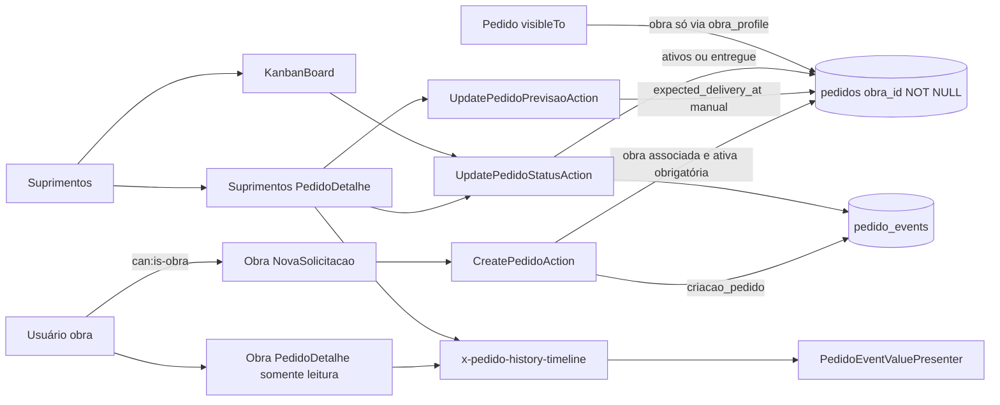
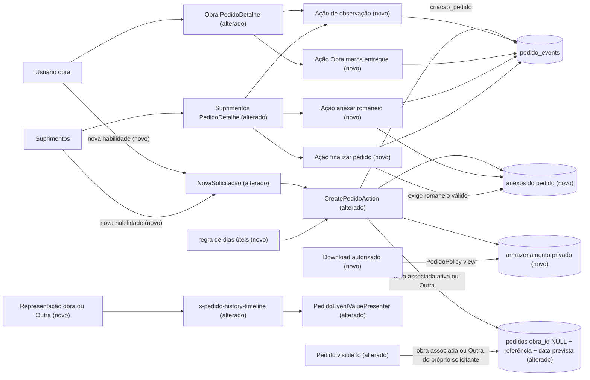

# SPEC: solicitacao-historico-finalizacao

## Metadata
- Source: developer description via /plan (`.spec/features/solicitacao-historico-finalizacao/.handoff/description.md`, slice 2 of 3 of the "PLANO COMPLETO — EVOLUÇÃO DO SISTEMA ALBUQUERQUE"). The 11 confirmed ACs are the source of truth. Product wording comes verbatim from `.handoff/master-plan.md` §10–§15, §19–§21, §29–§35, §42 (pedido items), §47–§48, §41 (screens of this slice only), with §43/§44 as constraints.
- Service: sistema_obra_mc (Laravel 13.32.0 / Livewire 4.4.5 / PostgreSQL). Single repo, single deployable.
- Tier: complete
- Version: 1.2 (v1.1: NC-01..NC-10 resolved from `.handoff/clarifier-answers.md`, 2026-09-22. v1.2: cross-slice review fixes F-01, F-03, F-06..F-09, F-12, F-14, F-17 applied from `.spec/features/navegacao-sidebar-listagens/.handoff/cross-review-fixes.md`, 2026-09-23; see "Resolved clarifications")
- Architecture references: `AGENTS.md`, `CLAUDE.md` (§3 business rules, §5 authorization, §6 data model; §7 "O que NÃO existe" is stale about rate limiting and audit tables, so the code wins), `docs/agents/architecture.md`, `docs/agents/domain_rules.md`, `docs/agents/data_model.md`, `docs/agents/api_contracts.md`, `docs/agents/coding_guidelines.md`
- Upstream contract (read, not re-specified): `.spec/features/obras-associacoes-cadastro-convites/SPEC.md` v1.3 + `PLAN.md` (slice 1). Slice 1 is specified/planned but **not yet implemented** in the working tree (`git status`: directory untracked; `app/Models/Obra.php` still has the boolean `is_active`). This SPEC assumes slice 1 is merged first (execution order 1 → 2 → 3).
- Init chain: not used. `.spec/init/*` describes the discontinued Next.js/Supabase stack.
- `.ai/rules/` does not exist in the repository (checked 2026-09-22).

### Architecture rules this SPEC inherits

| Rule | Source |
|---|---|
| Routes bind to full-page Livewire components. Components re-check the role gate in `mount()`, call `$this->authorize(<policy ability>)` before each Action, and delegate **every** write to a single-purpose Action. Components never persist directly | `docs/agents/architecture.md` "Layer responsibilities"; `docs/agents/coding_guidelines.md` §1–§2 |
| Actions own validation (PT-BR messages), actor guard, terminal-state guard and the `DB::transaction` that writes the mutation together with its `pedido_events` row | `docs/agents/architecture.md` "Request pipeline"; `app/Actions/Pedidos/Concerns/GuardsOperationalMutation.php:23-40` |
| Every pedido mutation writes exactly 1 `pedido_events` row, and a no-op writes none | `docs/agents/coding_guidelines.md` §3 |
| `pedido_events` is append-only: `UPDATED_AT = null`, `updating`/`deleting` hooks throw, `PedidoEventPolicy` denies update/delete | `docs/agents/coding_guidelines.md` §8; `CLAUDE.md` §6 |
| `Pedido::visibleTo` is the single row-visibility rule. It opens every listing query in the same statement, and a user filter may only narrow it | `CLAUDE.md` §5 "Decisão travada"; `app/Models/Pedido.php:40-48` |
| Authorization is application-layer only (guest/auth → active → `can:` gates → `mount()` → policies → Action guards → Action validation). There is no PostgreSQL RLS | `CLAUDE.md` §5 |
| Terminal status: operational Actions reject with `PedidoTerminalStateException` (HTTP 409) | `app/Exceptions/Pedidos/PedidoTerminalStateException.php`; `docs/agents/domain_rules.md` "Operational mutation guards" |
| Atraso/pendente/prazo have one definition each, in PHP and as SQL scopes, in `app/Domain/Pedidos/` | `docs/agents/domain_rules.md` "Atraso, pendência, prazo" |
| Enum-backed slugs with TitleCase cases. Lookup rows are resolved by slug, never by id literal | `docs/agents/coding_guidelines.md` §6 |
| Explicit `#[Fillable]` on every model; Blade never uses `{!! !!}`; Tailwind classes are literal | `docs/agents/coding_guidelines.md` §7, §11 |
| Listing filter state is `#[Url]` only | `docs/agents/coding_guidelines.md` §5 |
| PHP 8.4-compatible code, Pint, Pest, `php artisan make:*`, no new dependency without approval, new models get factories | `CLAUDE.md` §2, §8; `AGENTS.md` |

## Context

Today only papel `obra` creates pedidos (`routes/web.php:69-73`, `can:is-obra`; `PedidoPolicy::create` obra-only at `app/Policies/PedidoPolicy.php:28-32`). The request is always tied to an associated, active obra (`CreatePedidoAction.php:49-61`), and `pedidos.obra_id` is NOT NULL. A pedido has `requested_at` (DB `useCurrent()`), `needed_at` (label "Data necessária") and a nullable `expected_delivery_at` that only Suprimentos fills by hand (`UpdatePedidoPrevisaoAction`). There are no attachments and no file storage in the domain (`config/filesystems.php` untouched; the `local` disk has `'serve' => true`, which exposes the signed route `GET storage/{path}` named `storage.local`). The history (`x-pedido-history-timeline`, `resources/views/components/pedido-history-timeline.blade.php`) shows event type name, date/time, actor and a "previous → new" line. The Obra and Gestão detail screens are read-only. Workflow: 4 active statuses, then `entregue`/`cancelado` as terminal. Only Suprimentos changes status (`UpdatePedidoStatusAction`, which allows active → `entregue` from any active status).

This slice (fatia 2) delivers:
- Nova Solicitação for Obra **and** Suprimentos, with an "Outra" option that carries an optional free-text reference.
- Three distinct dates, with Data prevista = Data da solicitação + 3 dias úteis.
- Pedido attachments with private, authorized download.
- A standardized history, plus free-text observations.
- An Obra-side "Marcar como entregue" in the pedido detail.
- Romaneio upload.
- A new status **Finalizado** that requires a romaneio.
- One local calendar (`America/Sao_Paulo`) for every "day" rule (atraso, prazo, `entreguesHoje`, the Dashboard period filter) and every date/time display, with UTC storage unchanged (RF-45..RF-47, cross-slice decision F-01).

It also publishes the contracts that slice 3 (`navegacao-sidebar-listagens`) consumes: CT-05 … CT-08 and CT-10 (the single local-day period class).

## AS IS — Estado atual

Hoje só o perfil Obra cria pedidos, sempre para uma obra associada e ativa, e não existem anexos nem arquivos no domínio. A previsão é um campo manual de Suprimentos, apenas Suprimentos muda status (até `entregue` ou `cancelado`, ambos terminais), e o histórico mostra tipo, data, autor e "anterior → novo".

## TO BE — Estado proposto

Criação para Obra e Suprimentos, com opção "Outra", data prevista e anexos: RF-01..RF-13, CT-01, CT-02, CT-05, CT-06. O armazenamento privado e o download autorizado estão em RF-14..RF-20 e CT-03. A trilha "observação, entregue, romaneio e finalizar" está em RF-24..RF-39 e CT-04. Histórico padronizado e representação canônica: RF-21..RF-23, RF-41, CT-07. `visibleTo` para pedidos "Outra": RF-40, CT-08.

## Scope
- **In**:
  - Nova Solicitação for papel `obra` and `suprimentos`, with obra selector (associated obras with status ≠ Concluído, via slice 1's single "obra ativa" definition), the "Outra" option with an optional reference, Descrição, Preciso para and optional attachments. A toolbar entry "+ Nova Solicitação" for Suprimentos.
  - The three dates (Data da solicitação, Preciso para, Data prevista), with Data prevista computed as +3 dias úteis and persisted in a SQL-queryable form, including existing pedidos.
  - Pedido attachments: validation, private storage, safe naming and authorized download.
  - A standardized history presentation in the three detail screens; observations by Obra and Suprimentos.
  - Obra "Marcar como entregue" in the pedido detail.
  - Romaneio upload by Suprimentos.
  - The status Finalizado, which requires a romaneio, integrated into the enums, terminal set, classifiers, status controls, Kanban (a column after Entregue) and indicators (RF-39).
  - `Pedido::visibleTo`/`PedidoPolicy::view` extended for pedidos without obra ("Outra").
  - Existing obra-name render sites switched to the canonical "obra ou Outra" representation, so no screen breaks on an "Outra" pedido.
  - `DemoSeeder`, factories and `demo:reset` adapted (including the demo Suprimentos user's associations, RF-43).
  - The local calendar (`America/Sao_Paulo`) for atraso/prazo/`entreguesHoje`, the Dashboard period filter via one local-day period class (CT-10), and timestamp display including slice 1's convite list and `obra_admin_events` (RF-45..RF-47).
  - Label alignment: summary "Descrição", Kanban cards "Previsão de entrega", "Preciso para" messages (UI-03, UI-09, RF-09).
- **Out**:
  - Everything owned by slice 1: Obras area, obra status, associations, Novo Cadastro, convites.
  - Everything owned by slice 3:
    - listing column "solicitante + obra/referência" (§16) and "Itens → Descrição" in listings (§17);
    - "Previsão" column in listings (§18) and sorting (§24);
    - compact filters, "Solicitado" and "Somente obras ativas" (§25–§28);
    - sidebar, homes = Pedidos and highlight of "+ Nova Solicitação" (§22–§23, §36–§40);
    - the cross-cutting responsive pass (§41) and the navigation browser suite.
  - Displaying "3 dias" instead of a date (§14: structure only, no implementation).
  - Deleting or replacing attachments or observations; editing a pedido after creation (obra, Preciso para, Descrição); e-mail notifications; image thumbnails and inline preview of stored attachments; antivirus scanning.
  - Gestão creating pedidos, adding observations, marking Entregue, uploading romaneio or finalizing.

## RIGID (Non-Negotiable)

### Functional Requirements

#### Nova Solicitação — permission and obra selection (AC-1, AC-2, AC-3)

- RF-01 [Ubiquitous]: The system shall allow exactly the papéis `obra` and `suprimentos` to create solicitações, at every layer: route gate, component `mount()`, Livewire submit method, policy and Action actor guard. `gestao`, unknown papel, inactive and unauthenticated users shall be denied.
  - AC: an `obra` user and a `suprimentos` user each GET their Nova Solicitação screen → 200. A `gestao` user GET → 403. A forged `/livewire/update` submit by `gestao` → 403. Calling the creation Action directly with a `gestao` actor → `AuthorizationException`. Guest → redirect to `/login`. Inactive → logout. Every denial leaves 0 `pedidos`/`pedido_events`/attachment rows and does not advance `pedido_code_sequence`.
- RF-02 [Event-Driven]: When an `obra` or `suprimentos` user opens Nova Solicitação, the system shall offer in the obra selector exactly that user's associated obras (`obra_profile`) whose status ≠ Concluído, ordered by name, followed by one option "Outra". When that list of obras is empty, no selector and no "Outra" are offered (RF-07).
  - The "obra ativa" definition is **consumed** from slice 1 (`Obra::active()` scope / `ObraStatus::isActive()`, slice 1 RF-03), never re-implemented.
  - AC: a user associated to A (Em andamento), B (A iniciar) and C (Concluído), not associated to D → options = [A, B] by name + "Outra". The same fixture works for an `obra` user and for a `suprimentos` user.
- RF-03 [Unwanted]: If a creation request carries an `obra_id` that is not associated with the requester, does not exist, or belongs to an obra whose status is Concluído (forged payload or direct Action call), then the system shall reject it with 422 on `obra_id`. It shall write no `pedidos`, `pedido_events` or attachment row, keep no stored file, and not advance `pedido_code_sequence`.
  - Messages reuse the existing PT-BR texts at `app/Actions/Pedidos/CreatePedidoAction.php:52-53,58-59`. The Concluído wording is as adjusted by slice 1.
  - AC: for each of the 3 cases, for both an `obra` and a `suprimentos` requester → 422 on `obra_id`; counts unchanged; `last_value` of `pedido_code_sequence` unchanged; the attachment storage directory has no new file.
- RF-04 [Event-Driven]: When the requester selects "Outra", the system shall show an optional free-text field "Referência" (≤ 255 characters, the same bound as an obra name in slice 1 CT-01). On submit it shall create the pedido with **no obra** and with the trimmed reference. A blank or whitespace-only reference is stored as absent.
  - AC: "Outra" + "  Galpão provisório  " → pedido with no obra and reference "Galpão provisório". "Outra" + "" → pedido with no obra and no reference. A reference of 256 characters → 422 on the reference field, nothing written.
- RF-05 [Ubiquitous]: The system shall treat "Outra" purely as a reference of that pedido. Selecting it shall not create an obra, shall not create or change any `obra_profile` row, and shall not grant access to any existing obra or to its pedidos.
  - AC: after creating an "Outra" pedido whose reference text equals the exact name of an existing obra X → `obras` and `obra_profile` counts unchanged; the requester still gets 403 on a pedido of X when not associated to X; the new pedido has no obra (not X).
- RF-06 [Unwanted]: If a creation request carries both a real `obra_id` and a reference text (forged payload), then the system shall persist the pedido for that obra with **no** reference. The invariant "reference present ⇒ no obra" shall hold for every row.
  - AC: payload `obra_id = A` + reference "X" → pedido with obra A and reference null. A DB-level check rejects a direct insert of a row with both an obra and a reference.
- RF-07 [State-Driven]: While the requester (`obra` or `suprimentos`) has zero associated obras with status ≠ Concluído, Nova Solicitação shall keep slice 1's empty state (slice 1 UI-09: no form submit possible, "Outra" not offered), and the backend shall reject any creation, **including "Outra"**, with a PT-BR 422, writing nothing and not advancing `pedido_code_sequence` (NC-10 resolved: option b).
  - The empty-state copy is papel-aware (F-17): for `obra` it is byte-identical to slice 1's UI-09 text ("Nenhuma obra ativa está associada ao seu usuário. Fale com a Gestão ou com Suprimentos."); for `suprimentos` it is "Nenhuma obra ativa está associada ao seu usuário. Fale com a Gestão ou associe-se em Associações." (a Suprimentos user is never told to talk to Suprimentos).
  - AC: a user with no association, or only Concluído obras → the screen shows the empty state with no submit control and no "Outra" option; the `obra` user sees the slice 1 text byte-for-byte and the `suprimentos` user sees the Suprimentos text above. A forged Livewire submit and a direct Action call with "Outra" → 422; 0 `pedidos`/`pedido_events`/attachment rows; `last_value` of `pedido_code_sequence` unchanged; no stored file.
- RF-08 [Event-Driven]: When a valid solicitação is submitted, the system shall do the following in one transaction:
  1. create the pedido with a new `PED-%06d` code, the initial status (lowest `sort_order`, Solicitado), `requester_id` = the requester, obra or "Outra" + reference, Descrição, Preciso para, Data da solicitação and Data prevista (RF-09, RF-10);
  2. attach every submitted file (RF-14);
  3. write exactly 1 `criacao_pedido` event with actor = requester, carrying in `new_value` the **snapshot** of the canonical representation (CT-07) of the pedido's obra/referência as of that moment (F-09). A later obra rename never changes what this event says (RF-21).

  A failure at any step shall leave no pedido, event or attachment row, and no stored file referenced by the database.
  - AC: success → 1 pedido, 1 event, N attachment rows for N files, N files in private storage. A simulated failure of the event insert → 0 pedidos, 0 events, 0 attachment rows, and no attachment file left in the final storage location. Validation failure of any file → nothing written and code not consumed (validation runs before the transaction).

#### Datas da solicitação (AC-4)

- RF-09 [Ubiquitous]: The system shall keep three distinct date concepts on every pedido:
  - **Data da solicitação**: the moment the pedido was registered, set by the server (`requested_at`). Any client-supplied value is ignored.
  - **Preciso para**: the date the requester needs the material (`needed_at`). Required; past dates accepted, as today.
  - **Data prevista**: computed by RF-10, never typed by the requester.
  - AC: a forged payload with `requested_at = 2020-01-01` and a Data prevista value → both ignored; stored `requested_at` = test clock; Data prevista = RF-10 result. Missing Preciso para → 422 "Informe a data em Preciso para."; an invalid date → 422 "Informe uma data válida em Preciso para." These replace "Informe a data necessária." / "Informe uma data necessária válida." (F-08; wording is a router default, reversible by the developer). No user-facing text of the creation flow says "data necessária".
- RF-10 [Ubiquitous]: The system shall compute Data prevista as the **3rd business day strictly after** the calendar date of the Data da solicitação. The result is never "requested_at + 72 h" and never "+3 calendar days". (NC-02 resolved.)
  - **Business day** = Monday–Friday that is not a Brazilian national holiday. Holidays are fixed and movable national holidays kept as a **literal list/rule in code**, with no new dependency (RNF-05). Fixed: 01/01, 21/04, 01/05, 07/09, 12/10, 02/11, 15/11, 20/11, 25/12. Movable: Sexta-feira da Paixão (Good Friday, derived from Easter). State and municipal holidays are not considered.
  - **Timezone**: the calendar date of the Data da solicitação is taken in `America/Sao_Paulo`. Timestamps stay stored in UTC and `app.timezone` does **not** change; conversion happens only at the boundary (Data prevista calculation, backfill, every "today"/day-range rule of RF-45/RF-46, and date/time display per RF-47), through one conversion point (`LocalTime`, FLEXIBLE name).
  - AC:

    | Data da solicitação (America/Sao_Paulo) | Data prevista |
    |---|---|
    | Mon 2026-09-21 | Thu 2026-09-24 |
    | Fri 2026-09-25 | Wed 2026-09-30 |
    | Sat 2026-09-26 | Wed 2026-09-30 |
    | Sun 2026-09-27 | Wed 2026-09-30 |
    | Fri 2026-10-09 | Thu 2026-10-15 (Mon 2026-10-12 skipped) |
    | Thu 2026-09-24 22:30 (= 2026-09-25T01:30Z) | Tue 2026-09-29 (Thursday in São Paulo, not Friday in UTC) |

    `config('app.timezone')` is still `UTC` after this slice.
- RF-11 [Ubiquitous]: The system shall have exactly one definition of the Data prevista rule. The number of business days (3) is one named constant, and the displayed value of the forecast goes through one presentation point. A future "3 dias" display then changes only that presentation point. The system shall **not** display "3 dias" in this slice.
  - AC: a compliance scan of `app/` finds exactly one place that computes business days for Data prevista; every screen showing Data prevista shows a `dd/mm/aaaa` date.
- RF-12 [Ubiquitous]: The system shall fix Data prevista at creation and store it so that SQL can filter and sort by it (CT-06). No later event (status change, observation, Entregue, romaneio, Finalizado, "Previsão de entrega" edit) shall recompute it. Existing pedidos shall receive their Data prevista from their `requested_at` (converted to `America/Sao_Paulo`) by the same rule during migration, and no pedido row is left without it. The backfill migration shall carry a **frozen copy** of the business-day rule (3 days, the RF-10 holiday list and Good Friday computation) inside the migration itself and shall not call live application code, so a future change to the live rule never changes what `migrate`/`migrate:fresh` backfills (F-14c). Data prevista is informative: atraso, pendente and prazo stay measured by `needed_at` ("Preciso para") (`AtrasoClassifier`, `PendenteClassifier`, `PrazoClassifier`), with "today" taken as the `America/Sao_Paulo` day per RF-45; Data prevista never feeds them (Q-11).
  - AC: after `migrate`, every pre-existing pedido has a non-null Data prevista equal to RF-10 applied to its `requested_at`. The migration file references no `App\Domain\*`/`App\Support\*` class; a parity test asserts that the frozen copy and the live rule produce the same dates for the RF-10 table (so the two only diverge by a deliberate, visible change). `ORDER BY` / `WHERE` on the column works in a raw query. Changing the status or the "Previsão de entrega" does not change the value. A pedido with future `needed_at` and past Data prevista is not atrasado; a pedido with past `needed_at` and future Data prevista is atrasado (when non-terminal).
- RF-13 [Ubiquitous]: The system shall keep the new **Data prevista** and the existing **Previsão de entrega** (`pedidos.expected_delivery_at`) as two coexisting, independent values (NC-01 resolved: option a):
  - Data prevista is automatic, computed once at creation (RF-10/RF-12) and immutable;
  - Previsão de entrega stays Suprimentos' manual, nullable forecast, edited only through `UpdatePedidoPrevisaoAction` with its `alteracao_previsao` event, unchanged in behavior;
  - neither value writes, overrides or recomputes the other; no existing `expected_delivery_at` value is altered or dropped;
  - the listing column "Previsão" of slice 3 (§18) shows **Data prevista** (CT-06), not Previsão de entrega.
  - AC: setting Previsão de entrega to any date leaves Data prevista unchanged and writes 1 `alteracao_previsao` event; Data prevista is non-null while Previsão de entrega is null on a new pedido; the detail shows both under their distinct labels (UI-03).

#### Anexos (AC-5)

- RF-14 [Event-Driven]: When the requester adds files on Nova Solicitação, the system shall accept 0..N files, each validated against:
  - an allow-list of image and document types, checked on **both** the detected content (MIME sniffing of the bytes) and the extension;
  - a per-file size limit;
  - a per-pedido count limit.

  Policy (NC-03 resolved):
  - general attachments: JPG, PNG, WEBP, PDF, DOCX, XLSX;
  - maximum **10 MB** per file;
  - maximum **10** attachments per pedido;
  - general attachments are accepted **only at creation**; there is no path to add a general attachment afterwards;
  - the type is decided by server-side detection of the bytes (MIME sniffing), never by the extension or name alone; the extension must also be in the allow-list and match the detected type.

  The following are never accepted: SVG, HTML/XHTML, XML, JavaScript, executables/scripts, archives, and any file whose content type does not match its extension.
  - AC: an allowed file within limits → stored and listed. A `.pdf` whose bytes are PNG → 422. A `.png` whose bytes are HTML → 422. `.svg` → 422. A `.txt` or `.heic` → 422. A file of 10 MB + 1 byte → 422. 11 files → 422. No route, Livewire method or Action adds a general attachment to an existing pedido.
- RF-15 [Unwanted]: If any submitted file is invalid, then the system shall reject the whole submission with a PT-BR 422 identifying the offending file. It shall create no pedido, attachment row or final stored file.
  - AC: 2 valid + 1 invalid → 422 naming the invalid file; 0 pedidos; 0 attachment rows; code not consumed.
- RF-16 [Ubiquitous]: The system shall store every attachment in private storage, not reachable by any public URL:
  - not under `public/`, not on the `public` disk;
  - never through the framework's signed `GET storage/{path}` route (`storage.local`, enabled by `'serve' => true` at `config/filesystems.php:33-39`; verified in `php artisan route:list`);
  - never through Livewire's `preview-file` route.

  Each file shall be stored under a server-generated, unpredictable name. The original file name is kept only as display metadata, sanitized: path components, control characters and characters outside a safe set are removed, and the length is bounded.
  - AC: the stored path contains no part of the original name. The original name `../../etc/passwd.pdf` is stored as display name `passwd.pdf` (or equivalent without separators). GET `/storage/<stored path>` (with or without a forged signature) returns no file bytes. No attachment path is under `storage/app/public` or `public/`.
- RF-17 [Event-Driven]: When an authenticated, active user for whom `PedidoPolicy::view` passes on the attachment's pedido requests an attachment download, the system shall stream the file with:
  - HTTP 200;
  - `Content-Disposition: attachment` with the sanitized original name;
  - the stored MIME type;
  - `X-Content-Type-Options: nosniff`.

  Authorization is re-checked on every request.
  - AC: `obra` user associated to the pedido's obra, requester of an "Outra" pedido (RF-40), `suprimentos` and `gestao` → 200 with the exact bytes and headers above.
- RF-18 [Unwanted]: If the requester of a download may not view the attachment's pedido, then the system shall answer without any file bytes:
  - 403 for an authenticated user without view rights, e.g. an `obra` user of another obra, or another `obra` user on an "Outra" pedido;
  - redirect to `/login` for guests;
  - logout for inactive users;
  - 404 for an unknown attachment id, or an attachment requested under a pedido it does not belong to.

  The download URL shall not be a bearer credential: knowing the URL grants nothing without the authorization above.
  - AC: each case above returns the stated status with an empty or non-file body. The same URL copied from an authorized session to an unauthorized one → 403.
- RF-19 [Ubiquitous]: The system shall provide no route, Livewire method or Action that updates or deletes an attachment row or its file. The only exemption is `demo:reset` for demo pedidos (RF-43).
  - AC: compliance scan finds no update/delete path. The attachment model rejects `update`/`delete` like `PedidoEvent` does.
- RF-20 [Ubiquitous]: The system shall keep attachment files across redeploys and container restarts in production by storing them on a **private local disk whose root is mounted on a Railway Volume** (NC-04 resolved). No new Composer dependency (no S3). The Railway container filesystem is ephemeral and no volume exists today, so mounting the volume is an **operational step documented in a runbook** (README), not executed by this slice; no deploy happens in this planning phase.
  - AC: the attachment disk root is configurable (so it can point at the volume mount path) and is not under `public/`; the README runbook states the volume mount path and the steps to create/attach the volume before enabling uploads in production. Post-deploy manual check: upload → redeploy → download returns the same bytes.

#### Histórico padronizado (AC-6)

- RF-21 [Ubiquitous]: The system shall render every history event with four parts: **ação** (label), **descrição/contexto** (one line; may be empty only where stated below), **data/hora** (`dd/mm/aaaa HH:MM`, converted from UTC to `America/Sao_Paulo` for display, RF-10) and **autor** (actor name). Events are in chronological order (`created_at`, `id`, as today). Required labels and contexts:

  | Event | Ação | Contexto |
  |---|---|---|
  | `criacao_pedido` | Pedido criado | "Solicitação registrada para <representação canônica>." (CT-07), e.g. "Solicitação registrada para Residencial Aurora." / "Solicitação registrada para Outra." |
  | `observacao` (new) | Observação adicionada | the observation text, verbatim |
  | `romaneio_anexado` (new) | Romaneio anexado | the sanitized original file name, e.g. "romaneio-1234.pdf" |
  | `finalizacao` (new) | Pedido finalizado | "Pedido finalizado por Suprimentos." |
  | `mudanca_status`, `entrega`, `cancelamento` | existing type name | "<status anterior> → <status novo>" |
  | `alteracao_responsavel`, `alteracao_prioridade`, `alteracao_previsao` | existing type name | "<anterior> → <novo>" (as today via `PedidoEventValuePresenter`) |

  - `criacao_pedido` context source (F-09): for events written by this slice onward, `<representação canônica>` is the snapshot stored in the event's `new_value` at creation (RF-08). Only legacy `criacao_pedido` events (written before this slice, `new_value` null) fall back to the pedido's **current** canonical representation. Legacy rows are not rewritten (RF-42).
  - AC: a pedido created for "Residencial Aurora" by "João Silva" shows "Pedido criado", "Solicitação registrada para Residencial Aurora.", "16/09/2026 HH:MM" and "João Silva". After the obra is renamed to "Aurora II" (slice 1 RF-02), the same history still shows "Solicitação registrada para Residencial Aurora."; a legacy event with `new_value` null shows the current name. Each row of the table renders its label and context. Pre-existing events render without error.
- RF-22 [Ubiquitous]: The system shall keep `pedido_events` append-only for the new event types. No action of this slice updates or deletes a prior event, and new events never replace older ones.
  - AC: after creation + 2 observations + romaneio + finalization, the pedido has exactly 5 events in order, and the first observation is unchanged. `tests/Unit/Models/PedidoEventImmutabilityTest.php` and `tests/Feature/Compliance/AuditTrailsAppendOnlyTest.php` pass.
- RF-23 [Ubiquitous]: The system shall use the same history presentation (RF-21) in the Obra, Suprimentos and Gestão detail screens.
  - AC: the same pedido renders identical history text on the three screens.

#### Observações (AC-7)

- RF-24 [Event-Driven]: When an `obra` user for whom `PedidoPolicy::view` passes, or any `suprimentos` user, submits an observation in the pedido detail, the system shall write exactly 1 new `observacao` event with the content (trimmed, otherwise verbatim), the actor, the timestamp and the pedido. The status and every other field stay unchanged.
  - AC: 2 consecutive observations → 2 events, both kept, with actor and content correct; `pedidos.updated_at`/status unchanged.
- RF-25 [Unwanted]: If the observation is blank or whitespace-only, or longer than **2000 characters** after trimming, then the system shall reject it with a PT-BR 422 and write nothing. If the actor is `gestao`, an `obra` user without view rights, inactive or a guest, then the system shall deny it (403 / logout / login redirect) and write nothing.
  - AC: blank → 422, 0 events. 2000 characters → accepted; 2001 characters → 422, 0 events. `gestao` forged call → 403, 0 events. `obra` user of another obra → 403, 0 events.
- RF-26 [State-Driven]: While the pedido is in any status, including the terminal ones (Entregue, Cancelado, Finalizado), the system shall accept observations under RF-24/RF-25 (NC-07 resolved). The observation path does not apply the terminal-state guard and never changes the status.
  - AC: an observation on an Entregue, a Cancelado and a Finalizado pedido → 1 `observacao` event each, status unchanged, no 409.

#### Obra — Marcar como Entregue (AC-8)

- RF-27 [Event-Driven]: When an `obra` user for whom `PedidoPolicy::view` passes (associated to the pedido's obra, or requester of an "Outra" pedido per RF-40) confirms "Marcar como entregue" in the pedido detail, the system shall change the status to `entregue` and write exactly 1 `entrega` event (actor = that user, previous/new status ids) in one transaction.
  - The event is the existing `entrega` type, so the "entregues hoje" indicator (`DashboardIndicatorsService`, event-based) counts it with no change to its event-based definition ("hoje" = the `America/Sao_Paulo` day, RF-45).
  - AC: success → status `entregue`, 1 `entrega` event with the obra actor. The pedido is counted by `entreguesHoje` on the same day.
- RF-28 [Unwanted]: If the actor is not an `obra` user with view rights on the pedido (other obra, `gestao`, forged call), then the system shall deny with 403. If the pedido is already terminal, the system shall answer 409 (`PedidoTerminalStateException`). Nothing is written in either case.
  - AC: each case → stated status, 0 events, status unchanged.
- RF-29 [Ubiquitous]: The system shall allow an `obra` user (RF-27; "authorized" = `PedidoPolicy::view` passes, Q-12) to mark Entregue from **any active status** (Solicitado, Em análise, Em compra/preparação, Aguardando entrega), the same source set Suprimentos has today (`UpdatePedidoStatusAction.php:36`) (NC-06 resolved). From Entregue, Cancelado or Finalizado → 409 (RF-28).
  - AC: from each of the 4 active statuses → status `entregue` + 1 `entrega` event. From each of the 3 terminal statuses → 409, 0 events.

#### Romaneio (AC-9)

- RF-30 [Event-Driven]: When a `suprimentos` user uploads a romaneio in the pedido detail, the system shall store it as an attachment explicitly classified as **romaneio**. The classification is set by the romaneio upload path and never derived from the file name or content. In the same transaction it shall write exactly 1 `romaneio_anexado` event whose context is the sanitized original file name.
  - Validation, storage and download follow RF-14..RF-18, with the romaneio allow-list **PDF, JPG, PNG** (detected by content, NC-03) and the 10 MB per-file limit. Romaneios do not count toward the 10-attachment limit of general attachments, which applies at creation only.
  - AC: upload "qualquer-nome.pdf" as romaneio → 1 attachment classified romaneio + 1 `romaneio_anexado` event with context "qualquer-nome.pdf". It is listed in the detail with a "Romaneio" marker.
- RF-31 [Unwanted]: If a non-`suprimentos` actor tries to upload a romaneio (forged call), then the system shall deny with 403 and write nothing. A general attachment (RF-14) shall never count as a romaneio, whatever its name.
  - AC: `obra`/`gestao` forged romaneio upload → 403, 0 rows. A creation-time attachment named "romaneio.pdf" → classified general; finalizing that pedido still fails per RF-35.
- RF-32 [Ubiquitous]: The system shall accept **several romaneios per pedido**: each upload adds 1 new attachment classified romaneio and 1 `romaneio_anexado` event; no upload replaces, hides or deletes a previous one (NC-08 resolved). A romaneio upload is allowed while the pedido is in an **active status or Entregue**, and rejected with 409 (`PedidoTerminalStateException`, nothing written, no file kept) on **Cancelado** and **Finalizado** (NC-07 resolved).
  - AC: 2 uploads → 2 romaneio attachments + 2 events, both listed and downloadable. Upload on Entregue → accepted. Upload on Cancelado / Finalizado → 409, 0 rows, no new file in storage. A `.docx` or `.webp` as romaneio → 422.

#### Status Finalizado (AC-10)

- RF-33 [Ubiquitous]: The system shall add the status **Finalizado** (slug `finalizado`, name "Finalizado"), distinct from Entregue, as a **terminal** status. §31 defines it as the status that "conclui operacionalmente" the pedido. Therefore every operational mutation (responsável, prioridade, previsão, status, cancelamento, Obra Entregue) on a Finalizado pedido answers 409 and writes nothing.
  - AC: `StatusSlug` has the case `Finalizado`; `isTerminal()` is true for `entregue`, `cancelado` and `finalizado`. Each of the 6 mutations on a Finalizado pedido → 409, 0 events; romaneio upload and Finalizar on it → 409 (RF-32, RF-37); an observation is still accepted (RF-26).
- RF-34 [Event-Driven]: When a `suprimentos` user triggers "Finalizar pedido" and the pedido has at least one **valid romaneio**, the system shall, in one transaction, change the status to `finalizado` and write exactly 1 `finalizacao` event (actor = that user, previous/new status ids, context per RF-21). All prior events are kept.
  - Valid romaneio = an attachment of this pedido classified romaneio (RF-30) whose file is present in attachment storage at the moment of finalization.
  - AC: pedido with romaneio → status `finalizado`, 1 `finalizacao` event, previous events unchanged.
- RF-35 [Unwanted]: If Finalizar is requested and the pedido has no valid romaneio, then the system shall:
  - reject it in the backend with a 422 and the exact message "Não foi possível finalizar o pedido. Anexe o romaneio antes de finalizar.", shown visually in the detail;
  - leave the status unchanged, write no event and leave no partial state.

  A disabled button in the UI is a complement only.
  - AC: no attachments → 422 with that text, status and events unchanged. Only a general attachment → same. Romaneio row present but file missing from storage → same. A forged Livewire call bypassing the disabled button → same.
- RF-36 [Unwanted]: If any other path targets `finalizado` (the generic status control in the Suprimentos detail, `UpdatePedidoStatusAction`, Kanban `moveCard`/`moveViaControl`, or a forged payload), then the system shall reject it without changing the status. Finalizado is reachable only through RF-34. A non-`suprimentos` actor calling Finalizar → 403.
  - AC: `UpdatePedidoStatusAction` with target `finalizado` → 422 "Transição de status inválida.", 0 events. Kanban forged move to the `finalizado` status id → rejected, 0 events. `obra`/`gestao` Finalizar → 403.
- RF-37 [Ubiquitous]: The system shall allow Suprimentos to finalize (RF-34) from **Entregue and from any active status** (NC-05 resolved). Entregue stays terminal for everything else: `StatusSlug::isTerminal()` remains true for `entregue`, the classifiers treat it as terminal, and the 5 existing operational Actions plus Obra Entregue keep answering 409 on it. The only exemptions from Entregue's terminality are: the transition Entregue → Finalizado (RF-34), the romaneio upload (RF-32) and observations (RF-26). Cancelado and Finalizado are terminal with no transition out (finalizing them → 409).
  - AC: finalize with a valid romaneio from each of the 4 active statuses and from Entregue → `finalizado` + 1 `finalizacao` event. Finalize from Cancelado or Finalizado → 409, 0 events. Responsável/prioridade/previsão/status/cancelamento on an Entregue pedido → 409 as today.
- RF-38 [Unwanted]: If two Finalizar requests for the same pedido run concurrently, then exactly one shall succeed. The other shall receive 409 (already terminal) and leave no second `finalizacao` event.
  - AC: 2 parallel finalizations → 1 `finalizacao` event, status `finalizado`.
- RF-39 [Ubiquitous]: The system shall treat `finalizado` as terminal in every place that decides terminality, in PHP and in SQL. Today two SQL scopes hard-code the terminal list: `AtrasoClassifier::scopeAtrasado` (verified at `app/Domain/Pedidos/AtrasoClassifier.php:42-45`) and `PendenteClassifier::scopePendente` (verified at `app/Domain/Pedidos/PendenteClassifier.php:34`). A Finalizado pedido is therefore never pendente or atrasado and has no prazo. Placement (NC-09 resolved):
  - **Kanban**: Finalizado is a column placed immediately after Entregue in both Kanbans (Suprimentos and Gestão read-only), and its cards are shown. Cancelado stays out of the Kanban. No move can target the Finalizado column (RF-36).
  - **`entregues`** (KPI) counts only status `entregue`; it does **not** count Finalizado. `entreguesHoje` keeps its event-based definition; only its day boundary moves to the `America/Sao_Paulo` day (RF-45).
  - **`porStatus`** includes Finalizado; the Suprimentos Visão Geral status counts include Finalizado (still without Cancelado).
  - **`porObra`** gains one group **"Outra"** aggregating every pedido without obra (with or without reference), labelled through the canonical representation's literal "Outra" (CT-07).
  - AC: a Finalizado pedido with a past Preciso para → `isAtrasado` false, `scopeAtrasado` excludes it, `isPendente` false, `scopePendente(true)` excludes it, `PrazoClassifier` returns null. A compliance scan finds no hard-coded terminal list outside the single definition. Kanban columns = Solicitado, Em análise, Em compra/preparação, Aguardando entrega, Entregue, Finalizado in that order. With 1 Entregue + 1 Finalizado pedido → `entregues` = 1, `porStatus` shows both. With 2 "Outra" pedidos (one with reference "X", one without) → `porObra` has one "Outra" entry with count 2 and no "X" entry. `DashboardIndicatorsService::compute()` still returns the same 8 keys.

#### Visibilidade de pedidos "Outra" (outbound CT-08)

- RF-40 [Ubiquitous]: The system shall extend `Pedido::visibleTo` and `PedidoPolicy::view` with identical semantics:
  - `obra` sees pedidos whose obra is in its `obra_profile` **plus** pedidos without obra ("Outra") where it is the requester;
  - `suprimentos`/`gestao` see all;
  - unknown papel sees none.

  The scope still opens every listing query in the same statement.
  - This is the only reading consistent with §13 ("Outra não concede acesso") and §47 (the requester follows the pedido in Acompanhamento).
  - AC: obra user U1 creates an "Outra" pedido → U1 lists and opens it (200). Obra user U2 (any associations) → not listed, GET → 403. Suprimentos/Gestão list and open it. `tests/Feature/Authorization/PedidoVisibleToScopeTest.php` and `tests/Feature/Compliance/ObraVisibleToGuardTest.php` pass, extended with the "Outra" cases. An `obraId` filter never widens U1's set.

#### Representação canônica e não regressão de telas

- RF-41 [Ubiquitous]: The system shall render the obra of a pedido only through the canonical representation (CT-07) in every existing render site, and no screen shall error on an "Outra" pedido. Verified sites:
  - `resources/views/components/pedido-table.blade.php:33,70`
  - `resources/views/components/pedido-summary.blade.php:10`
  - `resources/views/livewire/kanban/pedido-card.blade.php:20`
  - `resources/views/livewire/gestao/pedido-card-read-only.blade.php:16`
  - `resources/views/livewire/gestao/dashboard.blade.php:72,232-234` (via `DashboardIndicatorsService` `porObra`, `app/Services/DashboardIndicatorsService.php:79-82`)
  - AC: with one "Outra" pedido (with and one without reference) seeded, every listing, Kanban (both), the three detail screens, Gestão Dashboard and Suprimentos Visão Geral return 200 and show "Outra" (and the reference when present). `porObra` shows the single "Outra" group of RF-39.

#### Non-regression and data preservation (AC-11, §42, §43, §44)

- RF-42 [Ubiquitous]: The migrations of this slice shall be additive/transforming only:
  - `pedidos.obra_id` becomes nullable, keeping its FK and restrict behavior;
  - new nullable/defaulted columns are added and Data prevista is backfilled (RF-12);
  - a new attachment table is created;
  - the lookup rows (status `finalizado`; event types `observacao`, `romaneio_anexado`, `finalizacao`) are inserted idempotently by migration, so that `php artisan migrate` alone, without `db:seed`, makes them available.

  No `DELETE`, `TRUNCATE`, column drop or table drop on data-bearing tables. No change to existing `pedido_events` rows or to `expected_delivery_at` values.

  Rollbacks (F-14b): the `down()` of the migration that inserts the lookup rows removes them only when no row references them; it is a **conditionally destructive** rollback and its docblock says so. The Data prevista backfill uses the frozen rule of RF-12 (F-14c).
  - AC: row counts of `users`, `obras`, `obra_profile`, `pedidos`, `pedido_events`, `statuses`, `event_types`, `user_admin_events`, `authentication_events` are identical before/after `migrate`, except the added lookup rows. On a DB migrated without seeding, the 3 event types and `finalizado` exist. `migrate:fresh` is repeatable on the test DB.
- RF-43 [Ubiquitous]: The system shall keep `php artisan demo:reset` deleting only `is_demo = true` data in one transaction without FK violations. This now includes the attachment rows of demo pedidos **and their files**. Attachments of real pedidos, rows and files, are never touched. `DemoSeeder` shall seed `finalizado` and the 3 new event types idempotently (`firstOrCreate`) and stay runnable twice. `DemoSeeder` shall also associate (idempotently, `obra_profile`) the demo `suprimentos` user with every demo obra whose status ≠ Concluído, so the Suprimentos Nova Solicitação (RF-01/RF-02) works out of the box in the demo (F-03; Suprimentos holding obras is intentional per slice 1 RF-11/F-13).
  - AC: seed → add attachments to a demo pedido and to a real pedido → `demo:reset --force` exits 0; the demo files are gone from storage; the real row and file remain. `tests/Feature/Seeders/DemoSeederIdempotencyTest.php` passes. After `db:seed` (run twice), the demo Suprimentos user has exactly one `obra_profile` row per active demo obra and GET of its Nova Solicitação shows the form (not the empty state).
- RF-44 [Ubiquitous]: The system shall keep unchanged:
  - `AuthenticateSession` in the `web` group and `EnsureUserIsActive` on every authenticated route **including the new download route** and on `/livewire/update`;
  - the existing and slice-1 rate limiters, and Livewire's upload endpoint throttle (default `throttle:60,1`, verified at `vendor/livewire/livewire/config/livewire.php:135`; not disabled);
  - `EmailNormalizer`, `users_email_lower_unique`;
  - the append-only guards of `pedido_events`, `user_admin_events`, `authentication_events` and slice 1's trails;
  - `GuardsOperationalMutation` in the 5 existing Suprimentos Actions;
  - `PedidoPolicy` operational abilities (Suprimentos-only);
  - `UserPolicy`/`manage-users`;
  - the Kanban same-column no-op;
  - the rejection of Concluído obras for new solicitações.
  - AC: existing suites under `tests/Feature/{Auth,Authorization,Security,Compliance,Actions,Livewire}` pass. Tests are only extended, never deleted. Tests encoding "obra-only creation" or "`obra_id` required" are updated to RF-01/RF-04.

#### Calendário local: "hoje", período e exibição (cross-slice decision F-01, F-12)

Decision taken by the router on 2026-09-23, reversible by the developer: it extends NC-02 (day of the solicitação and history display in `America/Sao_Paulo`) to every remaining "day" rule. Before this slice, atraso, prazo and `entreguesHoje` turned the day at 21:00 Brasília (UTC midnight). Storage stays UTC and `config('app.timezone')` stays `UTC`.

- RF-45 [Ubiquitous]: The system shall take "today" as the current calendar day in `America/Sao_Paulo`, obtained through the single conversion point of RF-10, in:
  - `AtrasoClassifier` (PHP `isAtrasado` and SQL `scopeAtrasado`): atrasado = non-terminal and `needed_at` < local today;
  - `PrazoClassifier`: days remaining and "vencendo em breve" (≤ 3 days) counted from local today;
  - `PendenteClassifier`: unaffected (it uses no date); stated so no second definition appears;
  - `DashboardIndicatorsService::entreguesHoje`: an `entrega` event counts when its `created_at` falls in the local-today window, compared as a UTC half-open interval `[local 00:00 → UTC, next local 00:00 → UTC)` on the timestamp (never `whereDate` on the UTC value). Still exactly one `whereExists` query (no per-pedido query).

  `needed_at`, `expected_delivery_at` and Data prevista are calendar `date` columns and are compared as dates, never timezone-shifted. PHP and SQL versions of each classifier keep identical results.
  - AC (clock frozen at 2026-09-22T01:30Z = 21/09 22:30 in São Paulo): a non-terminal pedido with `needed_at` = 2026-09-21 is **not** atrasado (PHP and SQL agree); at 2026-09-22T03:30Z (= 22/09 00:30 local) it is atrasado. An `entrega` event at 2026-09-22T01:30Z counts in `entreguesHoje` on local 21/09 and not on local 22/09. `PrazoClassifier` returns `vencendo_em_breve` for `needed_at` = local today + 3 and `dentro_do_prazo` for + 4, both evaluated at 22:30 local. `config('app.timezone')` is `UTC`. Existing classifier, `DashboardIndicatorsTest` and `QueryCountTest` suites pass (updated only where the day boundary is asserted).
- RF-46 [Ubiquitous]: The system shall have exactly **one** local-day period class (CT-10) that turns a local calendar date range (De/Até, either side optional, inclusive) into UTC half-open bounds on `requested_at`: `De` → local 00:00 of De converted to UTC (inclusive); `Até` → local 00:00 of the day after Até converted to UTC (exclusive). The Gestão Dashboard period filter (`requestedFrom`/`requestedTo` in `DashboardIndicatorsService::filteredQuery`) and the drill-down targets that carry those filters (`Gestao\TodosPedidos`, and `Suprimentos\TodosPedidos` for its requested-date range) shall apply the period only through this class. No `whereDate('requested_at', …)` remains in `app/`.
  - Drill-down parity is kept: for any filter set, the count shown by the Dashboard equals the row total of the drill-down listing (`tests/Feature/Livewire/DashboardDrillDownTest.php`, extended with a boundary case).
  - AC: pedido A at 2026-09-22T02:30Z (= 21/09 23:30 local) and pedido B at 2026-09-22T03:30Z (= 22/09 00:30 local). Filter De = Até = 22/09 → B only, on the Dashboard and in the drill-down listing, with equal counts; De = Até = 21/09 → A only. Empty De/Até → no period restriction. A compliance scan finds no `whereDate('requested_at'` in `app/` and exactly one class building `requested_at` period bounds.
- RF-47 [Ubiquitous]: The system shall display every **timestamp** (date/time stored in UTC) through the single conversion point, in `America/Sao_Paulo`, in `dd/mm/aaaa HH:MM` (or `dd/mm/aaaa` where only the date is shown). This slice owns the conversion (it creates the conversion point) and applies it to (F-12):
  - the history, summary and attachment list of this slice (RF-21, UI-03);
  - slice 1's convite list dates (criado, expira, revogado, utilizado em) and every render of `obra_admin_events` timestamps;
  - every timestamp rendered on the Kanban cards (both Kanbans), the Gestão Dashboard and the Suprimentos Visão Geral.

  Calendar `date` columns (`needed_at`, `expected_delivery_at`, Data prevista) are shown as stored, never converted. The listing column "Solicitado em" (`x-pedido-table`) is slice 3's (it reuses the same conversion point).
  - AC: a convite created at 2026-09-25T01:30Z shows "24/09/2026 22:30" in the convite list; an `obra_admin_events` row at the same instant renders the same local value. Today the Kanban cards and the Dashboard render no timestamp (verified: `kanban/pedido-card.blade.php`, `gestao/pedido-card-read-only.blade.php`, `gestao/dashboard.blade.php` format only `date` columns; Visão Geral renders `requested_at` only through `x-pedido-table`, slice 3's); any timestamp this slice adds to them goes through the conversion point. A pedido with `needed_at` = 2026-09-25 shows 25/09/2026 everywhere. A compliance scan finds no `->format('d/m/Y H:i')` on a UTC timestamp outside the conversion point in the views owned by slices 1 and 2.
- RF-48 [Ubiquitous]: The README runbook shall include, before announcing the Suprimentos Nova Solicitação in production, the step "associar os usuários Suprimentos às obras em /associacoes antes de anunciar a Nova Solicitação", because RF-07 shows the empty state to any Suprimentos user with zero active associations (F-03). No migration or seeder associates real (non-demo) users.
  - AC: the README runbook contains that step; no migration writes `obra_profile` rows; `DemoSeeder` associates only `is_demo = true` users with `is_demo = true` obras (RF-43).

### UI Requirements

- UI-01 [Ubiquitous]: Nova Solicitação (one screen shared by `obra` and `suprimentos`) shall contain:
  - **Obra** selector (RF-02, with "Outra" last);
  - **Referência** text input, rendered only while "Outra" is selected, marked optional;
  - **Descrição** textarea (replaces the "Itens e quantidades" label of this form only);
  - **Preciso para** date input (replaces the "Data necessária" label of this form only);
  - read-only **Data da solicitação** (today) and **Data prevista** preview computed by the RF-10 rule (the persisted value is always recomputed server-side);
  - **Anexos**: multi-file input listing the chosen files with a per-file remove-before-submit control, and the allowed types/limits in text ("JPG, PNG, WEBP, PDF, DOCX ou XLSX; até 10 MB por arquivo; até 10 arquivos");
  - submit.

  With zero eligible obras the screen shows the papel-aware empty state of RF-07 instead of the form (obra: slice 1's text byte-identical; suprimentos: the RF-07 Suprimentos text).

  After success it shows the code, the Data prevista and a link to the requester's own pedido listing (Obra → Acompanhamento, Suprimentos → Todos os Pedidos).
  - AC: selecting "Outra" reveals Referência; selecting an obra hides it. The labels are exactly those above. The success notice shows the code and a `dd/mm/aaaa` Data prevista.
- UI-02 [Ubiquitous]: The current toolbar (`resources/views/layouts/app.blade.php:20-37`) shall gain "+ Nova Solicitação" for `suprimentos`, pointing to the Suprimentos-reachable Nova Solicitação (CT-05). The `obra` entry keeps pointing to its screen. `gestao` gets no such entry. Slice 3 moves/highlights it in the sidebar.
  - AC: Suprimentos toolbar contains "+ Nova Solicitação"; the Gestão toolbar does not.
- UI-03 [Ubiquitous]: The pedido summary (`x-pedido-summary`) in the three detail screens shall show:
  - **Obra** via the canonical representation;
  - **Descrição** (the label "Itens e quantidades" is replaced, F-06; the value is still `items_description`);
  - **Data da solicitação** (`dd/mm/aaaa HH:MM`), **Preciso para** (`dd/mm/aaaa`) and **Data prevista** (`dd/mm/aaaa`) as three separate, exactly-labelled fields, plus **Previsão de entrega** (`dd/mm/aaaa` or "—" when empty) as a fourth, distinct field (RF-13);
  - an **Anexos** section listing each attachment (display name, "Romaneio" marker when classified romaneio, size, uploader, date) with a download link (RF-17).
  - AC: the label "Descrição" is present and "Itens e quantidades" is absent from the three detail screens. The four labels (Data da solicitação, Preciso para, Data prevista, Previsão de entrega) are present, distinct and exact. A pedido with 1 general attachment + 1 romaneio lists both, with the marker only on the romaneio.
- UI-04 [Ubiquitous]: The history component shall render each event as ação (bold) / contexto / "dd/mm/aaaa HH:MM · Autor", per RF-21, on all three detail screens.
  - AC: DOM of each event contains those three lines in that order.
- UI-05 [Ubiquitous]: The Obra and Suprimentos detail screens shall show an "Adicionar observação" textarea (max 2000 characters, RF-25) + submit in every status, terminal ones included (RF-26). The Gestão detail shall show none.
  - AC: the control is present for obra/suprimentos (also on Entregue, Cancelado and Finalizado pedidos) and absent for gestão. After submit, the textarea is cleared and the new event is visible without reload.
- UI-06 [State-Driven]: While an `obra` user views a pedido it may mark (RF-27, RF-29), the Obra detail shall show "Marcar como entregue" with a two-step confirmation. The action shall not exist in any listing (Acompanhamento) or card.
  - AC: button present in the detail for an eligible pedido and absent for a terminal one. No "Entregue" action in `/obra/pedidos` DOM. Confirming updates the status badge and history.
- UI-07 [Ubiquitous]: The Suprimentos detail shall show:
  - an "Anexar romaneio" file control (PDF, JPG, PNG; up to 10 MB) while the pedido is active or Entregue, absent on Cancelado/Finalizado (RF-32);
  - a "Finalizar pedido" button while the pedido is active or Entregue (RF-37), disabled with an explanatory hint while no romaneio exists and enabled otherwise; absent on Cancelado/Finalizado. On a backend refusal (RF-35) the exact message is shown in an alert region (`role="alert"`);
  - the generic status select (only on non-terminal pedidos, as today), which does not offer "Finalizado".
  - AC: with no romaneio the button is disabled and the hint visible; a forged call shows the RF-35 message. On an Entregue pedido the romaneio control and the Finalizar button are present while the status select, responsável, prioridade, previsão and cancel controls stay hidden. With a romaneio, finalizing shows the "Finalizado" badge. The status `<select>` has no "Finalizado" option.
- UI-08 [Ubiquitous]: The status badge shall have a distinct literal color mapping for "Finalizado", different from "Entregue" (literal Tailwind classes, no interpolation).
  - AC: rendered badge classes for `finalizado` differ from `entregue`; `tests/Feature/Compliance/BuiltAssetsUtilitiesTest.php` passes.
- UI-09 [Ubiquitous]: The Kanban cards (`resources/views/livewire/kanban/pedido-card.blade.php`, `resources/views/livewire/gestao/pedido-card-read-only.blade.php`) shall label the `expected_delivery_at` field "Previsão de entrega" (the UI-03 label), so "Previsão" alone never names the manual value (F-07; the bare "Previsão" is slice 3's listing column = Data prevista, CT-06). The value is unchanged (`dd/mm/aaaa` or "—").
  - AC: both cards render the label "Previsão de entrega" on the `data-field="expected_delivery_at"` row and no field labelled just "Previsão".

### Contracts

Concrete route paths and names are FLEXIBLE suggestions. Abilities, inputs, outcomes and middleware stacks are rigid.

- CT-01 (Creation input, Livewire submit → creation Action): `{ obra_selection: <obra id> | "outra", obra_reference: string ≤255 | null (only with "outra"), descricao: string required non-blank, needed_at (Preciso para): date required, anexos: list<file> 0..10, each ≤ 10 MB, JPG/PNG/WEBP/PDF/DOCX/XLSX by content }`. Server-set fields: `requested_at`, Data prevista, `requester_id`, `code`, `status_id`. Errors are 422 field errors in PT-BR. Actor ∈ {`obra`, `suprimentos`} with ≥ 1 associated obra whose status ≠ Concluído, also for "outra" (RF-07).
- CT-02 (Pedido additions): `obra_id` nullable (FK obras, restrict kept); `obra_reference` text ≤255 nullable, with DB check "`obra_reference` is null when `obra_id` is not null"; Data prevista `date NOT NULL` after backfill, indexable (RF-12). `expected_delivery_at` (Previsão de entrega) is unchanged in schema, data and behavior and coexists with Data prevista (RF-13).
- CT-03 (Attachment record + download): `{ id, pedido_id FK pedidos, kind ∈ { anexo | romaneio }, stored path (server-generated, private), original_name (sanitized, bounded), mime_type (detected), size_bytes, uploaded_by FK users restrict, created_at }`, no `updated_at`, append-only (RF-19). Download = one GET route inside `auth` + `active`, keyed by attachment id (and optionally pedido id), authorized by `PedidoPolicy::view` on every request. Response per RF-17/RF-18.
- CT-04 (Detail operations, Livewire methods → Actions, each with its policy ability and Action guard):

  | Operation | Allowed actor | Allowed source status | Outcome |
  |---|---|---|---|
  | add observation | `obra` with view / `suprimentos` | any (terminal included) | event `observacao`; errors 422 (blank, > 2000 chars)/403 |
  | Obra marks Entregue | `obra` with view | any active | status `entregue` + event `entrega`; errors 403/409 |
  | attach romaneio | `suprimentos` | any active, Entregue | attachment kind romaneio + event `romaneio_anexado` (several allowed); errors 422 (PDF/JPG/PNG, ≤ 10 MB)/403/409 on Cancelado, Finalizado |
  | finalize | `suprimentos` | any active, Entregue | status `finalizado` + event `finalizacao`; error 422 with the RF-35 message, 403, 409 on Cancelado, Finalizado |
- CT-05 (outbound → slice 3: Nova Solicitação entry): Nova Solicitação is reachable by `suprimentos` through a named route inside `auth` + `active`, gated by an ability granting exactly `obra` and `suprimentos`. The `obra` route `obra.nova-solicitacao` (verified at `routes/web.php:70`) keeps working. Slice 3 only relocates/highlights the entries.
- CT-06 (outbound → slice 3: Data prevista): a `pedidos` date column holding Data prevista (RF-10/RF-12: +3 business days, national holidays excluded, date taken in `America/Sao_Paulo`), non-null, fixed at creation, usable in SQL `WHERE`/`ORDER BY`, plus one presentation point for its display (RF-11). **Slice 3's "Previsão" column (§18) = Data prevista**; it reads this column and never recomputes it, and it does **not** show `expected_delivery_at` (Previsão de entrega, RF-13). Atraso/pendente/prazo filters stay on `needed_at` (RF-12), with "today" = the `America/Sao_Paulo` day (RF-45). The Kanban cards label the manual value "Previsão de entrega" (UI-09).
- CT-07 (outbound → slice 3: canonical obra/referência): one presentation point on the pedido that returns the obra name when the pedido has an obra; the literal "Outra" when it has none and no reference; or a text containing "Outra" and the full reference when a reference exists (separator FLEXIBLE). The reference is also a plain SQL column (CT-02) so slice 3 can search/sort. Aggregations by obra (e.g. `porObra`) group every pedido without obra under the single literal "Outra", never by reference (RF-39). Slice 3's "solicitante / obra-referência" column (§16) and "Somente obras ativas" handling of "Outra" (§28) consume this. The history's `criacao_pedido` context is a creation-time snapshot of this representation (RF-08, RF-21), not a live read; slice 3 never re-derives it.
- CT-08 (outbound → slice 3: status and visibility): `StatusSlug::Finalizado` with `isTerminal() === true` (`entregue` and `cancelado` also terminal); one terminal definition consumed by the PHP classifiers and SQL scopes (RF-39); the classifiers' "today" is the `America/Sao_Paulo` day (RF-45), so slice 3's "Atrasado" badge/filter turns at local midnight, like its "Solicitado" presets; Entregue → Finalizado is the only transition out of a terminal status and only via RF-34. Kanban columns = the 4 active statuses, Entregue, **Finalizado** (Cancelado excluded); indicators: `entregues` excludes Finalizado, `porStatus`/Visão Geral include Finalizado, `porObra` has an "Outra" group (RF-39). `Pedido::visibleTo` per RF-40 (the scope every slice 3 listing must keep opening its query with). Slice 3 status filters must offer Finalizado.
- CT-09 (Event type catalogue): `EventTypeSlug` gains `Observacao = 'observacao'`, `RomaneioAnexado = 'romaneio_anexado'`, `Finalizacao = 'finalizacao'` (10 slugs total). `previous_value`/`new_value` stay `text` (observation text and romaneio file name are carried there or in an equivalent immutable event column; FLEXIBLE). `criacao_pedido` events written from this slice onward carry the canonical obra/referência snapshot in `new_value` (RF-08); legacy ones keep `new_value` null and render via fallback (RF-21).
- CT-10 (outbound → slice 3: single local-day period class): exactly one class (suggested `App\Domain\Pedidos\RequestedPeriodFilter`; name FLEXIBLE, uniqueness RIGID) that, given a local calendar range (De and/or Até, inclusive, `America/Sao_Paulo`), returns/applies the UTC half-open bounds on `requested_at` of RF-46, using the single conversion point (`LocalTime`, exposing the timezone constant and a UTC → local conversion). Created by this slice and used by the Gestão Dashboard period filter and its drill-down listings. **Slice 3's "Personalizado" (De/Até) must reuse this class unchanged in semantics**, and slice 3's relative presets ("Hoje", etc.) are added to the same class (or built on its bounds), never to a second one. Slice 3's "Solicitado em" column and presets use the same conversion point. Consequence: Dashboard, drill-down and every listing's "Solicitado"/Personalizado filter agree on which day a pedido belongs to.

### Non-Functional Requirements

- RNF-01 (file security):
  - type is decided by server-side content detection (PHP `fileinfo`, loaded) **and** extension, both in the allow-list;
  - SVG/HTML/XML/JS/executables/archives are never accepted;
  - stored names are random with ≥ 128 bits, and no user input ever reaches a filesystem path;
  - downloads always carry `Content-Disposition: attachment` and `X-Content-Type-Options: nosniff`;
  - file bytes are never echoed into a Blade view;
  - the Livewire temporary upload directory stays on a private disk (default `livewire-tmp` on `local`, `storage/app/private`).
- RNF-02 (atomicity): creation (pedido + attachments + event), romaneio (attachment + event), Obra Entregue (status + event) and finalization (status + event) each commit or roll back as one unit. A file written for a rolled-back transaction is removed (best effort) and is never referenced by a row. Finalization concurrency per RF-38.
- RNF-03 (query budget): rendering each detail screen issues a number of SQL queries that does not grow with the number of events or attachments. Rendering Nova Solicitação does not grow with the number of associated obras. Asserted in the style of `tests/Feature/Performance/QueryCountTest.php`.
- RNF-04 (responsive): Nova Solicitação (with "Outra" and the file list), and the three detail screens with history, observation, Entregue, romaneio and Finalizar controls, show no horizontal document overflow and keep the primary control inside the viewport at 390×844, 820×1180 and 1440×900 (same viewports as `tests/Browser/ResponsiveIdentityTest.php:22-26`).
- RNF-05 (compatibility): no new Composer or npm dependency (none needed: storage is a local disk on a Railway Volume per RF-20; holidays are a literal list per RF-10). The code runs on PHP 8.4.25 (production) and passes `vendor/bin/pint --dirty --format agent`.
- RNF-06 (migrations): `php artisan migrate` on a copy of the current schema with data completes with exit 0, removes zero rows (RF-42), and is repeatable via `migrate:fresh`. It adds the lookup rows without `db:seed`. It contains no destructive cleanup (§43).
- RNF-07 (upload limits consistency): the per-file size limit of 10 MB (RF-14), for up to 10 files in one creation submit, must be ≤ the effective PHP `upload_max_filesize`/`post_max_size` and ≤ Livewire's temporary upload rule in production. The local CLI shows `upload_max_filesize=2M`, `post_max_size=8M`; the production FrankenPHP values are **not verified**. The planner must verify them and configure them explicitly in the repo if needed.
- RNF-08 (language/brand): every user-facing text is PT-BR; the brand only via `config('app.name')`; history, alerts and labels use the exact strings of RF-21/RF-35/UI-01/UI-03.
- RNF-09 (no leakage): no screen, error page or download response reveals the existence, name or content of an attachment or pedido that the user may not view (RF-18 returns 403/404 without metadata).

## FLEXIBLE (Implementation Suggestions)

- **Ability**: `Gate::define('create-pedido', fn (User $u) => in_array($u->role?->slug, ['obra', 'suprimentos'], true))` next to the existing gates. `PedidoPolicy::create(User $user)` delegates to it (drop the `Obra` parameter; the obra check stays in the Action).
- **Routes**: keep `obra.nova-solicitacao`; add `GET /suprimentos/nova-solicitacao` → `suprimentos.nova-solicitacao` under `can:is-suprimentos`, bound to the same component. Alternatively, use a shared `GET /nova-solicitacao` (`pedidos.create`) under `can:create-pedido` with a redirect from the old path. Download: `GET /pedidos/{pedido}/anexos/{anexo}` → `pedidos.anexos.download` inside `['auth','active']`, handled by a small invokable controller in `app/Http/Controllers/` (the only way to stream bytes; Livewire components are not suited), with `->scopeBindings()` so a mismatched pair → 404.
- **Component**: move `Obra\NovaSolicitacao` to a papel-neutral component (e.g. `Pedidos\NovaSolicitacao`) with `WithFileUploads`. `mount()` authorizes `create-pedido`. The select value `'outra'` is mapped to `obra_id = null` before calling the Action.
- **Action**: generalize `CreatePedidoAction` (actor guard: papel ∈ {obra, suprimentos}; `->obras()->active()` check unchanged for both papéis). Store files through an `AttachmentStorage` service on a dedicated private disk `pedido_anexos` (root `storage/app/private/pedido-anexos`, **without** `'serve' => true`), named `Str::uuid()` or `Str::random(40)` + a safe extension from the detected MIME.
- **Data prevista**: column `expected_at` (or `data_prevista`) `date`. A `App\Domain\Pedidos\DataPrevistaCalculator` with `public const int DIAS_UTEIS = 3` and `forRequestedAt(CarbonInterface): CarbonImmutable`. Holidays (RF-10) come from a literal list or a small `Holiday` enum in code plus an Easter computation for Good Friday (PHP `easter_days()` needs `ext-calendar`; verify availability or use a pure-PHP algorithm), with no new dependency. The backfill migration inlines a frozen PHP copy of the rule (private methods of the migration; RF-12/F-14c) and a Unit test asserts parity with the calculator on the RF-10 table. `App\Support\LocalTime` (`TIMEZONE`, `toLocal()`, `formatDateTime()`, plus a `todayWindowUtc()`/`localDayBoundsUtc()` helper) is the single conversion point used by the classifiers, `entreguesHoje`, `RequestedPeriodFilter` and the views (RF-45..RF-47). Display through `Pedido::dataPrevistaLabel()` (the single presentation point for the future "3 dias").
- **Reference**: column `obra_reference varchar(255) null` + `CHECK (obra_id IS NULL OR obra_reference IS NULL)`. Canonical representation: accessor `Pedido::obraLabel(): string` → `$this->obra?->name ?? ($this->obra_reference ? "Outra — {$this->obra_reference}" : 'Outra')`.
- **visibleTo**: `RoleSlug::Obra => $query->where(fn ($q) => $q->whereIn('obra_id', $user->obras()->select('obras.id'))->orWhere(fn ($q) => $q->whereNull('obra_id')->where('requester_id', $user->id)))`. Mirror it in `PedidoPolicy::view`.
- **Attachments**: table `pedido_attachments` + model `PedidoAttachment` (append-only like `PedidoEvent`) + `PedidoAttachmentKind` enum (`Anexo`, `Romaneio`) + factory. FK `pedido_id` `cascadeOnDelete` (mirrors `pedido_events`, so `demo:reset`'s pedido delete stays valid). `demo:reset` collects the demo attachment paths **before** deleting pedidos and deletes the files after the transaction commits.
- **Events**: `criacao_pedido.new_value` = `$pedido->obraLabel()` at creation; the presenter reads it and falls back to the live `obraLabel()` only when null. Observation text in `new_value` (text). Romaneio file name in `new_value` + attachment id in `previous_value`, or a nullable `pedido_attachment_id` FK column on `pedido_events` added by migration. `PedidoEventValuePresenter` gains a `describe(PedidoEvent): array{action: string, context: ?string}` used by the timeline; label overrides ("Pedido criado") live in the presenter, so the `event_types.name` lookup rows need no rewrite.
- **Actions**: `AddPedidoObservacaoAction`, `MarkPedidoEntregueByObraAction`, `AttachRomaneioAction`, `FinalizePedidoAction` under `app/Actions/Pedidos/`. `FinalizePedidoAction` uses `ensureActorIsSuprimentos` + `ensurePedidoIsNotTerminal`, then `Pedido::whereKey()->lockForUpdate()` inside the transaction, re-checks the status and the romaneio existence (row + `Storage::exists`), and throws `ValidationException::withMessages(['finalizar' => 'Não foi possível finalizar o pedido. Anexe o romaneio antes de finalizar.'])`. A new concern `GuardsObraPedidoMutation` holds the obra-with-view guard.
- **Terminal set**: `StatusSlug::terminal(): array` used by `isTerminal()`, `AtrasoClassifier::scopeAtrasado` and `PendenteClassifier::scopePendente`. A separate `StatusSlug::finalizableFrom(): array` (active + `entregue`) is used by `FinalizePedidoAction` and `AttachRomaneioAction` instead of `ensurePedidoIsNotTerminal`. Status seed: `finalizado` with `sort_order` 7 (keeps the `sort_order` unique index; ordering the Kanban by `sort_order` without Cancelado yields Entregue → Finalizado).
- **Tests**: `Storage::fake('pedido_anexos')`, `UploadedFile::fake()->create('x.pdf', 100, 'application/pdf')` plus real-byte fixtures for MIME spoofing; `travelTo()` for the RF-10 table; a parallel finalization test mirroring slice 1's concurrency test.

## Acceptance Criteria Summary

| ID | Criterion | Testable? |
|----|-----------|-----------|
| RF-01 | Only obra/suprimentos create, all layers | Yes (Feature, adversarial) |
| RF-02 | Selector = associated non-Concluído obras + "Outra" | Yes (Livewire) |
| RF-03 | Forged obra_id rejected, nothing written, no code consumed | Yes (Feature) |
| RF-04 | "Outra" + optional reference ≤255 | Yes (Feature) |
| RF-05 | "Outra" creates no obra/association/access | Yes (Feature) |
| RF-06 | Reference never persisted with a real obra; DB check | Yes (Feature + migration) |
| RF-07 | Zero-obra users: empty state, "Outra" also rejected (422) | Yes (Feature, adversarial) |
| RF-08 | Atomic creation with attachments + 1 event | Yes (Feature) |
| RF-09 | Three distinct dates; server-set fields ignore client input | Yes (Feature) |
| RF-10 | +3 business days, national holidays, America/Sao_Paulo date | Yes (Unit, time travel) |
| RF-11 | Single rule definition; no "3 dias" display | Yes (compliance) |
| RF-12 | Persisted, SQL-queryable, backfilled, never recomputed | Yes (migration + Feature) |
| RF-13 | Data prevista and Previsão de entrega coexist, independent | Yes (Feature) |
| RF-14 | Types/10 MB/10 files by content + extension; creation only | Yes (Feature) |
| RF-15 | Any invalid file rejects the submission | Yes (Feature) |
| RF-16 | Private storage, random names, no public/signed exposure | Yes (Feature) |
| RF-17 | Authorized download with safe headers | Yes (Feature) |
| RF-18 | Unauthorized download denied, no bytes | Yes (Feature, adversarial) |
| RF-19 | No update/delete of attachments | Yes (compliance + Unit) |
| RF-20 | Files on Railway Volume-backed private disk; runbook | Yes (config + README); redeploy check manual |
| RF-21 | History ação/contexto/data-hora/autor with exact texts | Yes (Livewire) |
| RF-22 | Append-only history preserved | Yes (existing + Feature) |
| RF-23 | Same history in 3 detail screens | Yes (Livewire) |
| RF-24 | Observation → new event, prior kept | Yes (Feature) |
| RF-25 | Blank/unauthorized observation rejected | Yes (Feature) |
| RF-26 | Observations allowed in every status | Yes (Feature) |
| RF-27 | Obra marks Entregue from detail, event with author | Yes (Feature) |
| RF-28 | Unauthorized/terminal Entregue denied | Yes (Feature) |
| RF-29 | Obra Entregue from any active status | Yes (Feature) |
| RF-30 | Romaneio classified by path + event with file name | Yes (Feature) |
| RF-31 | Only suprimentos; name never classifies | Yes (Feature) |
| RF-32 | Several romaneios; active/Entregue only, 409 on Cancelado/Finalizado | Yes (Feature) |
| RF-33 | Finalizado exists, distinct, terminal | Yes (Unit + Feature) |
| RF-34 | Finalize with romaneio → status + event | Yes (Feature) |
| RF-35 | Finalize without valid romaneio → exact 422, no change | Yes (Feature + Browser) |
| RF-36 | No other path reaches Finalizado | Yes (Feature, adversarial) |
| RF-37 | Finalize from active or Entregue; Entregue terminal otherwise | Yes (Feature) |
| RF-38 | Concurrent finalization → one event | Yes (concurrency) |
| RF-39 | Finalizado terminal in PHP + SQL; Kanban column; indicators; porObra "Outra" | Yes (Unit + compliance + Livewire) |
| RF-40 | visibleTo/view for "Outra" = requester only (obra) | Yes (Feature) |
| RF-41 | Canonical representation everywhere, no errors on "Outra" | Yes (Feature) |
| RF-42 | Additive migrations; lookup rows without seeding | Yes (migration test) |
| RF-43 | demo:reset removes demo attachment rows + files only | Yes (Console) |
| RF-44 | No regression of existing protections | Yes (existing suites) |
| RF-45 | "Hoje" = São Paulo day in atraso/prazo (PHP + SQL) and `entreguesHoje` | Yes (Unit + Feature, time travel) |
| RF-46 | One local-day period class for Dashboard + drill-down; parity kept | Yes (Feature + compliance) |
| RF-47 | Timestamps displayed in São Paulo (slice 1 convites, `obra_admin_events`, slice 2 screens); date columns unshifted | Yes (Livewire + compliance) |
| RF-48 | Runbook step: associate Suprimentos users before announcing Nova Solicitação | Yes (README check) |
| UI-01..UI-09 | Form, toolbar entry, summary dates/Descrição/anexos, history, observation, Entregue, romaneio/Finalizar, badge, Kanban "Previsão de entrega" | Yes (Livewire + Browser) |
| RNF-01..RNF-09 | File security, atomicity, query budget, responsive, deps, migrations, upload limits, PT-BR, no leakage | Yes (RNF-07 needs production verification) |

## Resolved clarifications

All resolved on 2026-09-22 from `.handoff/clarifier-answers.md` (developer accepted every recommendation). No open marker remains.

| Id | Resolution | Applied in |
|---|---|---|
| NC-01 (Q-01) | Coexist. Data prevista = automatic, fixed at creation (+3 dias úteis). Previsão de entrega (`expected_delivery_at`, `UpdatePedidoPrevisaoAction`) stays manual and audited by Suprimentos. Slice 3's "Previsão" column shows Data prevista | RF-12, RF-13, UI-03, CT-02, CT-06 |
| NC-02 (Q-02) | Business days = Mon–Fri minus Brazilian national fixed + movable holidays, literal list in code, no dependency. Timestamps stay UTC (`app.timezone` unchanged); the request date, the business-day calculation and history date/time use `America/Sao_Paulo`, converted at the boundary | RF-10, RF-12, RF-21, CT-06 |
| NC-03 (Q-03) | General attachments: JPG, PNG, WEBP, PDF, DOCX, XLSX; ≤ 10 MB each; ≤ 10 per pedido; creation only. Romaneio: PDF, JPG, PNG. MIME checked on the server from the bytes. PHP/FrankenPHP upload limits are a planner task (RNF-07) | RF-14, RF-30, UI-01, UI-07, CT-01, RNF-07 |
| NC-04 (Q-04) | Private local disk mounted on a Railway Volume, no new Composer dependency. Volume setup = documented runbook step, not executed now; no deploy | RF-20, RNF-05 |
| NC-05 (Q-05) | Finalize from Entregue and from any active status. Entregue stays terminal except for Entregue → Finalizado (plus romaneio and observations). Cancelado and Finalizado terminal | RF-33, RF-37, UI-07, CT-04, CT-08 |
| NC-06 (Q-06) | Obra marks Entregue from any active status | RF-29, UI-06, CT-04 |
| NC-07 (Q-07) | Observations allowed in every status, terminal included. Romaneio allowed on active statuses and Entregue; 409 on Cancelado and Finalizado | RF-26, RF-32, UI-05, UI-07, CT-04 |
| NC-08 (Q-08) | Several romaneios per pedido; each upload adds 1 attachment + 1 event; nothing replaced or deleted | RF-32, CT-04 |
| NC-09 (Q-09) | Finalizado = Kanban column after Entregue; `entregues` excludes Finalizado; Finalizado in `porStatus` and Visão Geral; `porObra` gets an "Outra" group | RF-39, RF-41, CT-07, CT-08 |
| NC-10 (Q-10) | No. A user with zero active associated obras cannot create, not even "Outra"; backend 422; UI keeps slice 1 UI-09 empty state | RF-02, RF-07, UI-01, CT-01 |
| Q-11 | Atraso/pendente/prazo stay measured by `needed_at`; Data prevista is informative. (v1.2: "today" for these rules is the São Paulo day, RF-45; no UTC exception remains) | RF-12, CT-06 |
| Q-12 | "Authorized obra user" for Entregue = any `obra` user passing `PedidoPolicy::view` (associated to the obra, or requester of an "Outra" pedido) | RF-27, RF-29 |
| Obs. length | Observation max 2000 characters, promoted to RIGID | RF-25, UI-05 |

### v1.2 — cross-slice review fixes (2026-09-23)

Source: `.spec/features/navegacao-sidebar-listagens/.handoff/cross-review-fixes.md` (decisions), evidence in `.../cross-review.md`. Decisions taken by the router; no already-decided product requirement is reinterpreted. Items marked "router default" are reversible by the developer.

| Id | Resolution | Applied in |
|---|---|---|
| F-01 | Cross-slice timezone decision (router default, reversible): every "day" rule and every timestamp display uses `America/Sao_Paulo`; storage and `app.timezone` stay UTC. Atraso/prazo (PHP + SQL) and `entreguesHoje` use the local day (previously turned at 21:00 Brasília); `PendenteClassifier` has no date and is unaffected. The Dashboard period filter and its drill-down use one local-day period class, published to slice 3 for "Personalizado" (CT-10); drill-down parity kept | Context, RF-10, RF-12, RF-27, RF-39, RF-45, RF-46, CT-06, CT-08, CT-10, Q-11 |
| F-03 | `DemoSeeder` idempotently associates the demo Suprimentos user with the active demo obras; README runbook step "associar os usuários Suprimentos às obras em /associacoes antes de anunciar a Nova Solicitação" | RF-43, RF-48 |
| F-06 | Pedido summary label "Itens e quantidades" → "Descrição" | UI-03 |
| F-07 | Kanban cards label the manual value "Previsão de entrega" | UI-09, CT-06 |
| F-08 | Required/invalid Preciso para messages reworded: "Informe a data em Preciso para." / "Informe uma data válida em Preciso para." (exact wording = router default) | RF-09 |
| F-09 | `criacao_pedido` stores the `obraLabel()` snapshot in `new_value`; render uses it, fallback to the live value only for legacy events | RF-08, RF-21, CT-07, CT-09 |
| F-12 | Slice 1 convite list dates, `obra_admin_events` and any Kanban/Dashboard timestamp go through the single conversion point created here | RF-47 |
| F-14 (b)(c) | Lookup-row migration `down()` documented as conditionally destructive; Data prevista backfill uses a frozen copy of the business-day rule inside the migration (no live code), with a parity test | RF-12, RF-42 |
| F-17 | Papel-aware empty state: obra text byte-identical to slice 1; Suprimentos "… Fale com a Gestão ou associe-se em Associações." | RF-07, UI-01 |
| Note (non-blocking, confirm with developer) | Holiday list = 9 fixed + Sexta-feira Santa; Carnaval and Corpus Christi excluded (ponto facultativo). Unchanged from RF-10 | RF-10 |

F-02 and F-04 are PLAN-level (test migration list, green phases) and are not SPEC changes.

### Superseded open-question log (v1.0, kept for traceability)

| Id | Original question | Why the master plan did not answer it | Affects |
|---|---|---|---|
| NC-01 | Relation between the new automatic Data prevista and the existing manual "Previsão de entrega" (`expected_delivery_at`, `UpdatePedidoPrevisaoAction`, event `alteracao_previsao`): (a) coexist, (b) manual overrides the automatic value, (c) retire the manual control? | §14/§18 define only the automatic value; the manual previsão exists in code (`app/Livewire/Suprimentos/PedidoDetalhe.php:73-79`) and is not mentioned | RF-12, RF-13, UI-03, CT-02, CT-06 |
| NC-02 | (a) Business days: Monday–Friday only, or also national holidays (which list, e.g. fixed + movable), or national + municipal? (b) Timezone for "data da solicitação" and for history display: `America/Sao_Paulo`, or keep the app's `UTC` (`config/app.php:68`)? With UTC, a request at 22:00 BRT Friday counts as Saturday | §14 says only "3 dias úteis" | RF-10, RF-12, RF-21 |
| NC-03 | Attachment policy: exact allowed types (e.g. JPG, PNG, WEBP, HEIC? / PDF, DOCX, XLSX, TXT?), per-file size limit (MB), max files per pedido, same rules for romaneio (e.g. PDF + images only?), and whether general attachments can be added **after** creation (by whom) | §15 lists only "imagens; documentos" and "tamanho" without values; §47 places anexos in the creation flow | RF-14, RF-30, UI-01, RNF-07 |
| NC-04 | Where files persist in production: a Railway volume mounted on the private storage path (no new dependency), or S3-compatible storage (needs `league/flysystem-aws-s3-v3`, a new dependency requiring approval, plus credentials)? The container filesystem is ephemeral | §15 says "armazenamento" only; the infra has neither today | RF-20, RNF-05 |
| NC-05 | Finalizado: from which statuses may Suprimentos finalize (only Entregue? any active? both)? Does Entregue stop being terminal so that the §48 flow "Obra marca Entregue → Suprimentos anexa romaneio → Finalizar" works? (Finalizado itself is frozen as terminal, RF-33) | §31–§33 define the requirement and romaneio guard, not the transition matrix | RF-37, RF-29, RF-39, UI-07 |
| NC-06 | Obra "Marcar como entregue": allowed from which statuses (any active, like Suprimentos today, or only "Aguardando entrega")? | §21 gives who/where, not from which states | RF-29, UI-06 |
| NC-07 | On terminal pedidos (Entregue, Cancelado, Finalizado): are observations allowed? Is a romaneio upload allowed (e.g. on Entregue, if NC-05 keeps it finalizable)? | §20/§30 do not mention terminal states; today every terminal pedido rejects mutations (409) | RF-26, RF-32, UI-05, UI-07 |
| NC-08 | Romaneio cardinality: exactly one per pedido (second upload rejected), or several (each adds a new attachment + event)? Replacement is excluded either way (§42, nothing destroyed) | §30/§32 speak of "um romaneio" | RF-32 |
| NC-09 | Kanban and indicators with Finalizado: is Finalizado a Kanban column (order relative to Entregue)? Does `entregues` count Finalizado pedidos, or is there a separate count? Is Finalizado in `porStatus`/Visão Geral? Does `porObra` show an "Outra" bucket? | The plan does not mention the Kanban or dashboard for the new status or for "Outra" | RF-39, RF-41, CT-08, UI-08 |
| NC-10 | May a user (`obra` or `suprimentos`) with **zero** active associated obras create an "Outra" solicitação? Note: Novo Cadastro (slice 1) is public, so "yes" lets any self-registered account create pedidos visible to Suprimentos; "no" keeps slice 1 UI-09's empty state | §1 says Obra operates on its obras "além do fluxo específico de Outra"; §5 says an unassociated user "não recebe acesso a nenhuma obra". Neither says whether the Outra flow needs ≥ 1 association | RF-07, UI-01 |

## Distribution by Repo (if multi-repo)
| Repo | RFs | Contracts |
|------|-----|-----------|
| sistema_obra_mc (single repo) | RF-01..RF-48 | CT-01..CT-10 (CT-05..CT-08 and CT-10 outbound to slice 3) |
