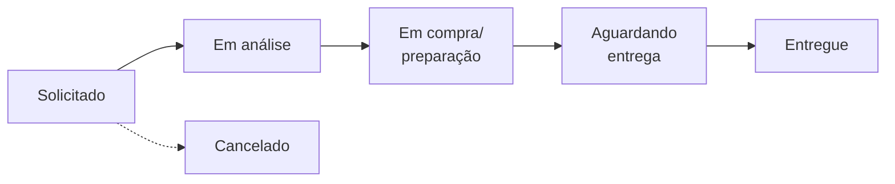

# Onboarding — Sistema de Solicitações e Compras

2026-09-22

## O que o sistema faz

O sistema transforma um pedido de material da obra em um registro rastreável, com código único, responsável, prazo e histórico completo. Ele substitui o WhatsApp, a planilha e a ligação como canal de solicitação de compra.

O que ele responde, a qualquer momento e para qualquer pessoa autorizada:

- O que foi pedido, por qual obra e por quem
- Quando foi pedido e para quando é necessário
- Em que estágio está e quem de Suprimentos é o responsável
- Qual a previsão de entrega e se o pedido está atrasado
- Tudo o que aconteceu com o pedido, na ordem em que aconteceu

**O que está fora do escopo desta versão** — diga isso na primeira reunião, evita frustração depois: não há cotação, fornecedores, catálogo de materiais (SKU), preços, financeiro, aprovação hierárquica, entrega parcial, anexos, comentários no pedido, notificações por e-mail de movimentação (só os e-mails de acesso) e integração com ERP. Os itens do pedido são texto livre, escritos pela obra.

O sistema é acessado pelo navegador, sem instalação, e funciona em celular. Endereço de produção: albuquerque.mcinteligencia.com.

## Vocabulário — as dez palavras do sistema

Alinhe estes termos antes de mostrar qualquer tela; toda a interface usa exatamente estas palavras.

| Termo | O que significa no sistema |
| --- | --- |
| Pedido | A solicitação registrada. Ganha um código único no formato PED-000123 no momento do envio |
| Obra | O canteiro que solicitou. Um usuário de obra só enxerga as obras às quais foi associado |
| Solicitante | Quem criou o pedido. Gravado automaticamente, não se escolhe |
| Data necessária | Quando a obra precisa do material. É ela que define o atraso |
| Itens e quantidades | Texto livre, um item por linha. Não há catálogo nem campo de quantidade separado |
| Status | O estágio do pedido. São seis, e só Suprimentos muda |
| Responsável | A pessoa de Suprimentos que tocou o pedido. Só usuários do perfil Suprimentos podem ser responsáveis |
| Prioridade | Baixa, Normal, Alta ou Urgente. Quem define é Suprimentos, não a obra |
| Previsão de entrega | A data prometida por Suprimentos. Começa vazia |
| Histórico | A lista de tudo que mudou no pedido, com autor e data. Não pode ser editada nem apagada por ninguém |

### Os seis status

A linha cheia é o caminho normal. Na prática Suprimentos pode mover o pedido para qualquer estágio ativo, inclusive voltar, e pode marcar **Entregue** a partir de qualquer um deles. **Cancelado** nunca aparece no Kanban e só é alcançado pelo botão Cancelar pedido.

**Entregue** e **Cancelado** são estados finais: o pedido congela e nenhum campo aceita alteração depois.

### Atraso e prazo

Um pedido está **Atrasado** quando a data necessária já passou e ele ainda não foi entregue nem cancelado. Entregue com atraso não conta como atrasado — o indicador mostra o que ainda precisa de ação, não o histórico de pontualidade.

No dashboard, os pedidos pendentes aparecem em três faixas: **Dentro do prazo**, **Vencendo em breve** (faltam até 3 dias) e **Atrasado**.

## Os três perfis

Cada usuário tem um único perfil, definido pela Gestão, e o menu do topo muda conforme ele. Não existe usuário com dois perfis, e ninguém se cadastra sozinho.

| Perfil | Menu que vê | Alcance dos dados | Pode alterar |
| --- | --- | --- | --- |
| Obra | Acompanhamento, + Nova Solicitação | Somente pedidos das obras às quais está associado | Nada depois do envio — só cria pedidos |
| Suprimentos | Visão Geral, Kanban, Todos os Pedidos | Todos os pedidos de todas as obras | Status, responsável, prioridade, previsão, cancelamento |
| Gestão | Dashboard, Kanban, Todos os Pedidos, Usuários | Todos os pedidos de todas as obras | Nada nos pedidos — só usuários |

Três consequências que valem explicar na reunião:

1. **Gestão não opera pedidos.** O dashboard e o Kanban da Gestão são somente leitura. Quem precisa mexer em pedido precisa do perfil Suprimentos.
2. **A obra não define prioridade.** Ela informa a data necessária; a prioridade é uma leitura de Suprimentos sobre a fila.
3. **A obra não vê o que não é dela.** Duas obras diferentes não enxergam os pedidos uma da outra, nem pelo link direto.

Ao entrar, cada pessoa cai direto na sua tela principal: a obra em Acompanhamento, Suprimentos no Kanban e a Gestão no Dashboard.

## Acesso: convite, senha e desativação

Ninguém recebe senha por WhatsApp nem senha provisória compartilhada. A Gestão cadastra o usuário, o sistema envia um e-mail de primeiro acesso e a própria pessoa define a senha.

### Primeiro acesso

1. Gestão cria o usuário em **Usuários → Novo usuário** (nome, e-mail, perfil e, se for perfil Obra, as obras).
2. O sistema envia o e-mail de convite automaticamente, assim que o usuário é salvo.
3. A pessoa clica no link, cai na tela **Defina sua senha**, digita a senha duas vezes e já entra.

O link do convite vale **72 horas**. Depois disso ele para de funcionar e a Gestão precisa reenviar pelo botão **Reenviar convite / Enviar link de redefinição** na lista de usuários. A senha precisa ter no mínimo 8 caracteres.

### Esqueci minha senha

O próprio usuário resolve, pelo link **Esqueci minha senha** na tela de login. O link enviado por e-mail vale **60 minutos** — bem menos que o convite, e essa diferença costuma gerar chamado; vale avisar.

Três comportamentos que confundem o suporte:

- A tela sempre responde a mesma mensagem, exista o e-mail ou não. É proposital, para não revelar quem tem conta.
- Conta desativada não recebe link nenhum. Se a pessoa jura que pediu e não chegou, a primeira verificação é o status dela na lista de usuários.
- Só existe um link válido por e-mail. Se a Gestão reenviar o convite enquanto a pessoa tinha um link de redefinição aberto, o antigo deixa de valer.

### Desativar em vez de excluir

Usuário não se apaga, se desativa — o histórico dos pedidos precisa continuar mostrando quem fez o quê. Ao desativar: o login para de funcionar na hora, a sessão aberta cai na próxima tela e a pessoa some da lista de possíveis responsáveis. Os pedidos dela continuam intactos.

Duas travas de segurança: ninguém desativa nem muda o próprio perfil, e o sistema não deixa desativar o último usuário ativo de Gestão. Por isso o cliente precisa de **pelo menos dois usuários de Gestão** desde o primeiro dia.

## Guia do perfil Obra

A obra tem duas telas e uma única ação: registrar a necessidade. O treinamento dela cabe em 20 minutos.

### Criar uma solicitação

1. Clicar em **+ Nova Solicitação** no menu do topo.
2. **Obra** — selecionar. Quem está em uma obra só vê aquela obra na lista.
3. **Data necessária** — quando o material precisa estar no canteiro.
4. **Itens e quantidades** — campo livre, **um item por linha**, com quantidade e unidade no mesmo texto. Ex.: `20 sacos de cimento CP-II`.
5. **Enviar solicitação**. A tela devolve o código do pedido, por exemplo PED-000123.

Ensine a anotar ou fotografar o código: é por ele que a obra cobra Suprimentos e que Suprimentos localiza o pedido.

### Acompanhar

**Acompanhamento** lista os pedidos das obras da pessoa, do mais recente para o mais antigo, com código, obra, data necessária, status, prioridade, responsável, previsão e o selo **Atrasado** ou **No prazo**. Clicando na linha, abre o pedido com todos os dados e o histórico completo.

### Os três pontos que geram reclamação

- **O pedido não pode ser editado depois de enviado.** Nem pela obra, nem por Suprimentos. Errou o item ou a data? O caminho é pedir o cancelamento a Suprimentos e criar um novo. Por isso vale reforçar a conferência antes do botão Enviar.
- **Uma solicitação por necessidade, não por dia.** Se a obra junta materiais de frentes diferentes num pedido só, tudo anda no mesmo status e a entrega parcial não existe no sistema.
- **Não há aviso por e-mail quando o status muda.** A obra precisa entrar no sistema para saber. Isso é combinado de processo, não falha.

## Guia do perfil Suprimentos

Suprimentos é o único perfil que muda pedidos. A rotina diária acontece no **Kanban**, para enxergar a fila, e no **detalhe do pedido**, para tomar decisões — com a **Visão Geral** como tela de abertura do dia.

### Visão Geral — o resumo do dia

Três números no topo: **Total de pedidos**, **Atrasados** e **Entregues hoje**. Abaixo, a contagem de pedidos em cada um dos cinco status do fluxo (cancelados ficam de fora), um atalho para o Kanban e as cinco solicitações mais recentes.

É a mesma matemática do dashboard da Gestão: atraso, pendência e entrega saem das mesmas regras usadas no Kanban e nas listagens, então os números nunca divergem entre as telas.

**Entregues hoje** conta a entrega registrada no dia — o momento em que alguém marcou o pedido como Entregue, não a previsão. Na demonstração com dados de exemplo, esse número só aparece preenchido no mesmo dia em que os dados foram carregados.

### Kanban — a fila do dia

Cinco colunas, na ordem do fluxo: Solicitado, Em análise, Em compra/preparação, Aguardando entrega, Entregue. Cada coluna mostra a contagem de pedidos, e cada card traz código, obra, itens, data necessária, previsão, responsável, prioridade e o selo de atraso. Pedidos cancelados não aparecem aqui.

Para mover: arrastar o card para outra coluna. Quem prefere não arrastar — ou está no celular — usa o seletor **Mover pedido para outro status** dentro do próprio card. As duas formas fazem exatamente a mesma coisa e registram o mesmo evento no histórico.

Reordenar cards dentro da mesma coluna não faz nada: a ordem é fixa e não é uma fila de prioridade.

### Detalhe do pedido — onde se decide

Abre clicando no código do pedido, no Kanban ou em Todos os Pedidos. Do lado esquerdo ficam os dados e o histórico; do lado direito, o bloco **Operação**, com quatro controles independentes:

| Controle | O que fazer | Regra |
| --- | --- | --- |
| Status → **Mover status** | Avançar, voltar ou marcar Entregue | Pode ir de qualquer estágio ativo para qualquer outro, e para Entregue de onde estiver |
| Responsável → **Salvar responsável** | Assumir o pedido ou passar a um colega | Só aparecem usuários ativos do perfil Suprimentos |
| Prioridade → **Salvar prioridade** | Classificar a fila | Baixa, Normal, Alta, Urgente |
| Previsão de entrega → **Salvar previsão** | Dar a data prometida à obra | Pode ser alterada quantas vezes for preciso; cada mudança fica no histórico |

Cada botão salva o seu campo isoladamente — não existe um “salvar tudo” no fim da tela.

### Cancelar um pedido

O botão **Cancelar pedido** fica no fim do bloco Operação e pede confirmação em duas etapas. Cancelamento é **irreversível**: não existe reabrir. O caminho de volta é a obra criar um pedido novo.

Use cancelamento para pedido duplicado, pedido criado com erro e necessidade que deixou de existir. O pedido cancelado não some: continua em Todos os Pedidos, com o histórico e o autor do cancelamento.

### Todos os Pedidos — busca

É a tela de consulta, com filtros combináveis: **Busca** por código, obra ou texto dos itens; **Obra**; **Status**; **Prioridade**; **Responsável**; **Somente atrasados**; e duas faixas de data, uma por data de solicitação e outra por data necessária. No topo, três indicadores mostram total, pendentes e atrasados **do recorte filtrado**, não do sistema inteiro.

O filtro de **Status** é o caminho para separar cancelados e entregues do resto — escolher `Cancelado` isola exatamente os cancelamentos. O botão **Limpar filtros** devolve a lista completa.

O recorte fica na barra de endereços: qualquer combinação de filtros pode ser copiada e enviada a outra pessoa, que abre a mesma consulta. É por isso que o drill-down do dashboard funciona.

### O combinado mínimo de processo

O sistema não obriga ordem nem prazo; quem obriga é o acordo com o cliente. Sugestão de acordo, a ajustar na reunião:

1. Todo pedido novo ganha **responsável** no mesmo dia.
2. Ao sair de **Em análise**, o pedido já tem **previsão de entrega** preenchida.
3. A **prioridade** é definida quando o responsável assume, não depois.
4. **Entregue** só é marcado com a confirmação de recebimento da obra.

## Guia do perfil Gestão

A Gestão lê indicadores e administra pessoas. Não muda pedidos — e essa separação é proposital, porque mantém o histórico com um dono único por decisão.

### Dashboard

Indicadores recalculados sobre o mesmo recorte de filtros:

| Indicador | Leitura |
| --- | --- |
| Volume total | Pedidos no escopo filtrado |
| Pendentes | Não entregues nem cancelados — clicável |
| Atrasados | Data necessária vencida e ainda não entregues — clicável |
| Entregues | Pedidos já entregues no escopo filtrado — clicável |
| Distribuição por status | Quantos pedidos em cada estágio |
| Visão por obra | Quais canteiros concentram a demanda |
| Prazos | Dentro do prazo, Vencendo em breve e Atrasado, somente entre os pendentes — com um gráfico de rosca ao lado da lista |

Os filtros do topo são cinco: **Período (solicitação)** com data inicial e final, **Obra**, **Status**, **Prioridade** e **Responsável**. O período filtra pela data em que o pedido foi criado — não pela data necessária. Vale dizer isso em voz alta na demonstração: é a confusão mais comum do dashboard.

**Drill-down:** clicar em Pendentes, Atrasados ou Entregues abre Todos os Pedidos já filtrado com o mesmo recorte — inclusive obra, status, prioridade, responsável e período —, listando pedido a pedido. É o caminho de “esse número está alto, quais são?”.

### Kanban e Todos os Pedidos

As mesmas telas de Suprimentos, sem nenhum controle de alteração. Servem para a reunião semanal: o Kanban mostra onde a fila está empoçando, a lista permite buscar um pedido específico por código ou material.

### Usuários

A tela **Usuários** lista nome, e-mail, perfil, obras e status de acesso, com busca por nome ou e-mail. As ações são quatro:

- **Novo usuário** — nome, e-mail, perfil e obras. O convite sai automaticamente.
- **Editar** — muda nome, e-mail, perfil e obras. Trocar o perfil de Obra para outro remove as obras associadas.
- **Ativar / Desativar** — corta ou devolve o acesso, sem apagar nada.
- **Reenviar convite / Enviar link de redefinição** — o botão para “não recebi o e-mail” ou “o link expirou”.

Duas regras de preenchimento que o formulário cobra: usuário de perfil **Obra** precisa de pelo menos uma obra, e usuário de Suprimentos ou Gestão **não pode** ter obras — eles enxergam todas por definição.

O e-mail é único e funciona como login. Ele pode ser corrigido em **Editar**, mas a pessoa passa a entrar com o novo endereço — avise antes de trocar.

### O que a Gestão não faz nesta versão

Cadastrar obras. A lista de obras é criada pela equipe técnica no banco de dados. Toda obra nova, ou renomeada, entra por solicitação ao suporte — combine esse canal no onboarding.

## As regras que travam o usuário

Estas são as sete regras que geram “não consigo” no primeiro mês. Antecipe todas na reunião — explicadas antes, viram processo; descobertas depois, viram chamado.

| Situação | Por que o sistema se comporta assim | O que fazer |
| --- | --- | --- |
| O pedido não pode ser editado depois de enviado | O texto original é a prova do que a obra pediu | Cancelar e criar outro |
| Pedido Entregue ou Cancelado não aceita mais nenhuma alteração | Estado final congela o registro | Se foi marcado Entregue por engano, criar um pedido novo |
| Cancelamento não tem volta | O cancelamento é uma decisão registrada, não um rascunho | Confirmar na segunda etapa só com certeza |
| Só Suprimentos pode ser responsável | Responsável é quem executa a compra | Para dar responsabilidade a alguém, mudar o perfil da pessoa |
| A obra não vê pedido de outra obra | Isolamento por obra, inclusive por link direto | Se precisa ver tudo, o perfil é Gestão |
| O histórico não pode ser corrigido nem apagado | É a trilha de auditoria do processo | Registrar a correção como um novo evento (nova mudança de status, nova previsão) |
| Desativar usuário não apaga os pedidos dele | O histórico precisa manter a autoria | Nada — é o comportamento correto |

Duas ausências que valem dizer com todas as letras, porque o cliente vai perguntar:

- **Não há aprovação.** O pedido da obra vai direto para a fila de Suprimentos. Se o cliente quiser um aval do engenheiro antes, isso é combinado fora do sistema nesta versão.
- **Não há entrega parcial.** Um pedido é entregue inteiro ou não é. Se metade chegou, o pedido continua em Aguardando entrega — ou a obra separa as necessidades em dois pedidos desde o início.

## Roteiro de onboarding sugerido

Quatro encontros em duas semanas, do menor público para o maior. A ordem importa: Suprimentos precisa estar treinado antes de a primeira obra enviar pedido, senão a fila nasce parada e o sistema perde credibilidade na primeira semana.

| # | Sessão | Público | Duração | Objetivo |
| --- | --- | --- | --- | --- |
| 1 | Alinhamento e decisões | Gestão (2 a 3 pessoas) | 60 min | Fechar obras, usuários, perfis e o combinado de processo |
| 2 | Operação | Suprimentos | 90 min | Rodar a fila de ponta a ponta com pedidos de teste |
| 3 | Solicitação | Encarregados e engenheiros de obra | 45 min | Criar a primeira solicitação real, cada um no próprio celular |
| 4 | Indicadores | Gestão | 45 min | Ler o dashboard e definir a reunião semanal |

### Sessão 1 — Alinhamento e decisões

Não é demonstração de tela; é a sessão que produz a lista de cadastro. Saia dela com: a lista de obras ativas com o nome exato que aparecerá no sistema, a lista de pessoas com nome, e-mail, perfil e obras, os dois usuários de Gestão e o combinado de processo de Suprimentos.

Perguntas que destravam a lista: quem, por obra, tem autoridade para pedir? O almoxarife pede ou só o engenheiro? Quem de Suprimentos responde por qual frente?

### Sessão 2 — Operação (Suprimentos)

Metade demonstração, metade mão na massa. Exercício em sala, cada participante no próprio acesso:

1. Abrir o Kanban e encontrar um pedido pelo código.
2. Assumir o pedido como responsável e definir prioridade.
3. Mover para Em compra/preparação pelo arrastar e voltar pelo seletor.
4. Lançar uma previsão de entrega e depois alterá-la.
5. Abrir o histórico e reconhecer as próprias ações.
6. Marcar Entregue e tentar mudar algo depois — ver a trava funcionando.
7. Cancelar um pedido de teste, com a confirmação em duas etapas.

### Sessão 3 — Solicitação (Obra)

Curta, no celular, de preferência no canteiro. Cada pessoa cria uma solicitação real, anota o código e localiza o pedido em Acompanhamento. Feche com as três frases que a obra precisa levar: confira antes de enviar porque não dá para editar; guarde o código; consulte o sistema em vez de ligar.

### Sessão 4 — Indicadores (Gestão)

Com dados reais da primeira semana, não com dados de demonstração. Percorra os seis indicadores, use o drill-down de Atrasados e combine o ritual: um horário fixo por semana, começando por Atrasados, depois Pendentes por obra.

### Acompanhamento pós-implantação

Nos primeiros 30 dias, dois checkpoints curtos: no dia 7, verificar se há pedidos sem responsável ou sem previsão; no dia 30, revisar o que o cliente sentiu falta e decidir o que entra na próxima versão.

## Checklist antes de liberar o sistema

O que precisa estar pronto antes da Sessão 2, feito pela equipe técnica.

- [ ] Domínio albuquerque.mcinteligencia.com abrindo com HTTPS válido
- [ ] Envio de e-mail real ligado e testado — sem isso, nenhum convite chega
- [ ] Endereço remetente definido e reconhecível pelo cliente
- [ ] Obras reais cadastradas, com o nome exato aprovado na Sessão 1
- [ ] Dados de demonstração removidos — nada com o prefixo \[DEMO\] pode sobrar
- [ ] Dois usuários de Gestão criados e com senha definida por eles mesmos
- [ ] Um usuário real de cada perfil testado de ponta a ponta: convite recebido, senha criada, login feito
- [ ] Teste do fluxo completo em produção: um pedido criado pela obra, movido por Suprimentos até Entregue, e depois cancelado outro
- [ ] Rotina de backup do banco confirmada
- [ ] Canal de suporte definido: quem o cliente aciona, por onde e em qual prazo

Duas armadilhas conhecidas: os usuários de demonstração têm senha padrão e não podem sobreviver à virada; e o cadastro de obras exige intervenção técnica, então precisa estar fechado antes, não durante o treinamento.

## Perguntas frequentes e limites desta versão

**“Não recebi o e-mail de acesso.”** Conferir, nesta ordem: caixa de spam, se o e-mail cadastrado está correto na lista de usuários, se a conta está Ativa. Resolvido isso, usar **Reenviar convite / Enviar link de redefinição**.

**“Meu login parou de funcionar de repente.”** Quase sempre é conta desativada — a sessão cai na tela seguinte, com a mensagem de conta desativada. A Gestão reativa.

**“Errei a data do pedido.”** Não há edição. Pedir a Suprimentos o cancelamento e criar outro.

**“O pedido sumiu do Kanban.”** Foi cancelado, ou entregue há tempo suficiente para a coluna encher. Buscar pelo código em Todos os Pedidos.

**“Por que o pedido entregue com atraso não aparece em Atrasados?”** O indicador mostra o que ainda exige ação. Entregue sai da conta, mesmo fora do prazo.

**“Quero receber e-mail quando o status mudar.”** Não existe nesta versão. E-mail, só para convite e redefinição de senha.

### Limites conhecidos, para registrar como próximos passos

| Limite | Impacto no dia a dia |
| --- | --- |
| Cadastro de obras só por via técnica | Obra nova depende do suporte |
| Sem edição do pedido original | Correção passa por cancelar e recriar |
| Sem entrega parcial | Pedido misto trava inteiro até o último item |
| Sem anexos e sem comentários | Foto de material e negociação ficam fora do sistema |
| Sem aprovação hierárquica | Qualquer usuário de obra manda direto para a fila |

Leve esta tabela para a Sessão 1. Ela costuma antecipar o pedido de evolução que o cliente faria no dia 30, e transforma limitação em roteiro de próxima versão.
